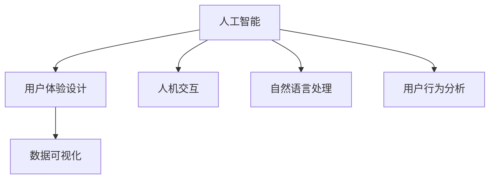

                 

# 体验设计师：AI时代的新兴职业

> 关键词：人工智能, 用户体验设计, 人机交互, 机器学习, 自然语言处理, 用户行为分析, 数据可视化

## 1. 背景介绍

### 1.1 问题由来

随着人工智能技术的迅猛发展，越来越多的行业开始引入AI技术以提升用户体验。从智能家居到智能客服，从智能推荐到智能医疗，AI技术逐渐成为企业提升竞争力的重要手段。然而，技术的引入并不意味着产品自然就能获得良好的用户体验。相反，AI技术带来的产品复杂性、使用难度等问题往往令用户望而却步。因此，如何将AI技术与人文关怀有效结合，设计出既智能又易于使用的产品，成为了体验设计师所面临的重要挑战。

### 1.2 问题核心关键点

体验设计师作为AI时代的新兴职业，其核心工作在于将AI技术与用户体验完美融合。通过不断优化人机交互界面，提升用户的参与感和满意度，从而提升产品的市场竞争力和用户粘性。体验设计师的工作包括但不限于：

- **用户研究**：通过调研分析用户需求和使用习惯，发现用户痛点和需求点。
- **交互设计**：根据用户研究结果，设计简洁、直观、易用的交互界面，使AI技术能够被用户自然接受和使用。
- **可用性测试**：在产品开发的早期阶段，通过A/B测试等方式验证设计的有效性，不断迭代改进。
- **数据可视化**：利用可视化技术，将AI分析结果直观展示给用户，增强产品的透明度和可信度。
- **个性化推荐**：结合用户画像和行为数据，设计个性化的交互流程和内容推荐，提升用户的使用体验。

### 1.3 问题研究意义

在AI时代，用户体验设计的重要性愈发凸显。良好的用户体验不仅可以提升产品的市场竞争力，还能增强用户对AI技术的接受度和信任度。特别是在金融、医疗、教育等高风险行业，用户体验的好坏直接影响用户对AI技术的信任度和依赖程度。因此，体验设计师在AI时代的应用，对于推动AI技术的落地和普及，提升用户体验，具有重要意义。

## 2. 核心概念与联系

### 2.1 核心概念概述

为更好地理解体验设计师在AI时代的工作内容，本节将介绍几个密切相关的核心概念：

- **人工智能(AI)**：以机器学习、深度学习等为代表的智能技术，能够通过算法处理数据，实现自动化决策和智能行为。
- **用户体验设计(UX Design)**：通过设计良好的交互界面和流程，提升用户的使用体验和满意度，确保产品易用性和功能性。
- **人机交互(Human-Computer Interaction, HCI)**：研究人和计算机之间如何有效沟通和协作的学科，旨在优化交互界面和用户体验。
- **自然语言处理(Natural Language Processing, NLP)**：利用AI技术处理和分析自然语言，实现文本信息的自动化处理和理解。
- **用户行为分析**：通过分析用户在产品中的行为数据，发现用户需求和行为模式，为设计提供数据支持。
- **数据可视化**：将数据转化为直观的图形、图表等形式，便于用户理解和决策。

这些核心概念之间的逻辑关系可以通过以下Mermaid流程图来展示：



这个流程图展示了大语言模型的核心概念及其之间的关系：

1. 人工智能通过深度学习、机器学习等技术，处理和分析海量数据，提供智能决策支持。
2. 用户体验设计结合用户研究结果，设计简洁、直观的交互界面和流程，提升用户满意度。
3. 人机交互研究用户与计算机之间的互动方式，优化交互设计。
4. 自然语言处理利用AI技术，实现文本信息的自动化处理和理解。
5. 用户行为分析通过用户数据，发现用户需求和行为模式，为设计提供数据支持。
6. 数据可视化将数据转化为直观的图形、图表等形式，便于用户理解和决策。

这些概念共同构成了体验设计师的工作框架，使其能够在设计过程中综合考虑用户需求、技术实现和产品性能。

## 3. 核心算法原理 & 具体操作步骤
### 3.1 算法原理概述

体验设计师的核心工作之一是通过AI技术优化用户体验。在具体实践中，设计师通常需要选择合适的算法和技术，将用户需求转化为可执行的设计方案。以下将详细介绍体验设计师在AI时代常用的算法原理和技术步骤：

### 3.2 算法步骤详解

体验设计师在进行产品设计时，通常会遵循以下步骤：

**Step 1: 收集用户数据**
- 通过问卷调查、用户访谈等方式，收集用户的基本信息、行为数据和偏好信息。
- 利用自然语言处理技术，处理和分析用户的文本反馈，发现用户需求和痛点。

**Step 2: 设计交互原型**
- 根据用户研究结果，设计简洁、直观、易用的交互原型，涵盖文本输入、图像识别、语音交互等多种交互方式。
- 使用人机交互设计原则，优化界面布局、颜色搭配和字体选择，提升用户的使用体验。

**Step 3: 开发和测试**
- 选择合适的开发框架和技术栈，实现交互原型。
- 利用用户行为分析数据，进行A/B测试，验证设计的有效性。
- 根据测试结果，进行迭代优化，不断改进设计方案。

**Step 4: 部署和优化**
- 将设计好的产品部署到实际环境中，进行大规模用户体验测试。
- 根据用户反馈，不断优化产品功能和交互界面，提升用户体验。

**Step 5: 数据可视化**
- 利用数据可视化技术，将AI分析结果直观展示给用户，增强产品的透明度和可信度。
- 结合用户需求，设计个性化、可定制的可视化方案，提升用户的使用体验。

### 3.3 算法优缺点

体验设计师采用的算法和技术具有以下优点：
1. 提升用户体验：通过优化交互界面和流程，提升用户的使用体验和满意度。
2. 数据驱动设计：利用用户行为分析和自然语言处理等技术，数据驱动设计决策，确保设计的科学性和有效性。
3. 多渠道支持：支持文本输入、图像识别、语音交互等多种交互方式，提升产品的灵活性和适用性。
4. 快速迭代优化：通过A/B测试和用户反馈，不断优化设计方案，快速迭代改进。

同时，这些技术和算法也存在一些局限性：
1. 技术依赖性强：体验设计师需要具备一定的技术背景，才能更好地理解和应用AI技术。
2. 数据隐私问题：在收集用户数据时，需要确保数据的隐私和安全，避免泄露用户隐私。
3. 设计复杂度高：多渠道支持和数据驱动设计增加了设计的复杂度，需要更高的设计能力和技术水平。

尽管存在这些局限性，但就目前而言，体验设计师的工作范式在AI时代的应用前景广阔，能够显著提升产品的用户体验和市场竞争力。

### 3.4 算法应用领域

体验设计师的算法和技术在多个领域得到了广泛应用，例如：

- 智能家居：通过语音交互和图像识别技术，优化智能家居系统的用户体验。
- 智能客服：利用自然语言处理和用户行为分析技术，提升智能客服的响应速度和准确性。
- 个性化推荐：结合用户画像和行为数据，设计个性化的交互流程和内容推荐，提升用户的使用体验。
- 智能医疗：利用自然语言处理和数据分析技术，提升医生的诊疗效率和患者的满意度。
- 智慧金融：通过用户行为分析和数据可视化技术，优化金融产品的用户体验，提升用户对AI技术的信任度。

除了这些经典应用外，体验设计师的技术和算法还在更多场景中得到了创新性的应用，如虚拟现实(VR)、增强现实(AR)、车联网等，为技术创新和用户体验的提升带来了新的突破。

## 4. 数学模型和公式 & 详细讲解 & 举例说明
### 4.1 数学模型构建

体验设计师在进行产品设计时，通常会使用多种数学模型和技术算法。以下将详细介绍体验设计师常用的数学模型和技术公式。

**用户行为分析模型**：
- 基于用户行为数据，构建用户画像，分析用户需求和行为模式。
- 常用模型包括协同过滤、聚类分析、分类器等，用于预测用户行为和需求。

**自然语言处理模型**：
- 利用机器学习技术，处理和分析用户的文本反馈，发现用户需求和痛点。
- 常用模型包括词袋模型、TF-IDF、LDA等，用于文本分类、情感分析和主题建模。

**人机交互设计模型**：
- 结合人机交互设计原则，优化界面布局、颜色搭配和字体选择，提升用户的使用体验。
- 常用模型包括认知负荷理论、可用性评估模型等，用于设计高可用性的交互界面。

**数据可视化模型**：
- 将AI分析结果直观展示给用户，增强产品的透明度和可信度。
- 常用模型包括散点图、柱状图、饼图等，用于数据的可视化展示。

### 4.2 公式推导过程

以下我们以自然语言处理模型为例，推导TF-IDF公式及其应用。

假设有一篇文本$D$，将其划分为$N$个单词，每个单词在文本中的出现次数为$tf_i$，在整个语料库中出现的次数为$df_i$，则单词$i$的TF-IDF值为：

$$
tf-idf_i = \frac{tf_i}{1+df_i}
$$

其中，$tf_i$为单词$i$在文本中的出现次数，$df_i$为单词$i$在整个语料库中出现的次数。

假设文本$D$对应的权重向量为$w$，每个单词的TF-IDF值为$tf-idf_i$，则文本$D$的TF-IDF向量为：

$$
w = (tf-idf_1, tf-idf_2, \dots, tf-idf_N)
$$

将文本$D$的TF-IDF向量与用户需求向量$u$进行余弦相似度计算，得到文本$D$与用户需求的相关度：

$$
cos(u, D) = \frac{u \cdot w}{||u|| ||w||}
$$

其中，$u$为用户需求向量，$||u||$和$||w||$分别为用户需求向量和文本$D$的TF-IDF向量的范数。

通过余弦相似度计算，体验设计师可以发现文本$D$与用户需求的相关度，从而设计出更加符合用户需求的交互界面和功能。

### 4.3 案例分析与讲解

**案例分析**：智能客服系统

智能客服系统在企业中的应用越来越广泛，体验设计师可以通过自然语言处理和用户行为分析技术，提升系统的响应速度和准确性。具体而言，可以采用以下步骤：

1. **用户数据收集**：通过用户访谈和问卷调查，收集用户的基本信息和反馈数据。
2. **自然语言处理**：利用BERT等预训练模型，对用户的问题进行情感分析和意图识别，发现用户需求和痛点。
3. **交互设计**：结合用户画像和情感分析结果，设计简洁、直观的交互界面和流程。
4. **行为分析**：利用用户行为分析数据，进行A/B测试，验证设计的有效性。
5. **数据可视化**：通过数据可视化技术，将系统的响应速度和准确性直观展示给用户，增强系统的透明度和可信度。

通过上述步骤，体验设计师可以设计出符合用户需求的智能客服系统，提升用户的使用体验和满意度。

## 5. 项目实践：代码实例和详细解释说明
### 5.1 开发环境搭建

在进行产品设计时，体验设计师需要搭建合适的开发环境。以下是使用Python进行UI开发的环境配置流程：

1. 安装Anaconda：从官网下载并安装Anaconda，用于创建独立的Python环境。

2. 创建并激活虚拟环境：
```bash
conda create -n ui-env python=3.8 
conda activate ui-env
```

3. 安装开发工具：
```bash
pip install flask
```

4. 安装UI设计工具：
```bash
pip install python-visualization
```

完成上述步骤后，即可在`ui-env`环境中开始UI设计实践。

### 5.2 源代码详细实现

这里我们以智能推荐系统为例，给出使用Flask框架进行UI设计的PyTorch代码实现。

首先，定义推荐系统的数据处理函数：

```python
from flask import Flask, request
from sklearn.metrics.pairwise import cosine_similarity
import pandas as pd

app = Flask(__name__)

@app.route('/recommend', methods=['POST'])
def recommend():
    user_id = request.form['user_id']
    query = request.form['query']
    data = pd.read_csv('recommend_data.csv')
    user_data = data[data['user_id'] == user_id]
    query_data = data[data['query'] == query]
    user_data = user_data.drop(['user_id', 'query'], axis=1)
    query_data = query_data.drop(['query'], axis=1)
    similarity_matrix = cosine_similarity(user_data.values, query_data.values)
    top_3_index = similarity_matrix.argsort()[:, -3:][::-1]
    top_3_recommendations = [data.iloc[index]['item_name'].values.tolist() for index in top_3_index]
    return {'recommendations': top_3_recommendations}
```

然后，定义推荐系统的UI界面：

```html
<!DOCTYPE html>
<html>
<head>
    <title>智能推荐系统</title>
    <script src="https://cdn.jsdelivr.net/npm/axios/dist/axios.min.js"></script>
</head>
<body>
    <h1>智能推荐系统</h1>
    <form id="recommend_form">
        <label for="user_id">用户ID：</label>
        <input type="text" id="user_id" name="user_id">
        <br>
        <label for="query">查询内容：</label>
        <input type="text" id="query" name="query">
        <br>
        <button type="submit">推荐</button>
    </form>
    <div id="recommendations"></div>
    <script>
        const form = document.getElementById('recommend_form');
        const recommendations_div = document.getElementById('recommendations');
        form.addEventListener('submit', async (event) => {
            event.preventDefault();
            const user_id = form.elements.user_id.value;
            const query = form.elements.query.value;
            const response = await axios.post('/recommend', {user_id, query});
            recommendations_div.innerHTML = '';
            response.data.recommendations.forEach(item => {
                const div = document.createElement('div');
                div.textContent = item;
                recommendations_div.appendChild(div);
            });
        });
    </script>
</body>
</html>
```

最后，启动推荐系统并验证UI设计：

```bash
python recommend.py
```

在浏览器中访问`http://127.0.0.1:5000/recommend`，即可进行智能推荐系统的测试。

### 5.3 代码解读与分析

让我们再详细解读一下关键代码的实现细节：

**recommend函数**：
- 接收用户ID和查询内容，从数据集中获取用户画像和查询内容。
- 计算用户画像和查询内容的余弦相似度，得到推荐物品的索引。
- 根据索引获取推荐物品的名称，并返回给用户。

**UI界面**：
- 通过Flask框架创建简单的HTML界面，接收用户输入的用户ID和查询内容。
- 通过AXIOS库发送HTTP请求，调用后端推荐接口，将推荐结果展示在页面上。

通过上述步骤，体验设计师可以快速实现一个简单的智能推荐系统，并进行UI设计和测试。

## 6. 实际应用场景
### 6.1 智能家居

体验设计师在智能家居中的应用，可以通过语音交互和图像识别技术，优化用户的家居体验。具体而言，可以采用以下步骤：

1. **用户数据收集**：通过语音识别和图像识别技术，收集用户的基本信息和行为数据。
2. **自然语言处理**：利用BERT等预训练模型，处理和分析用户的语音命令和图像内容，发现用户需求和痛点。
3. **交互设计**：结合用户画像和情感分析结果，设计简洁、直观的语音交互界面和流程。
4. **行为分析**：利用用户行为分析数据，进行A/B测试，验证设计的有效性。
5. **数据可视化**：通过数据可视化技术，将系统的响应速度和准确性直观展示给用户，增强系统的透明度和可信度。

通过上述步骤，体验设计师可以设计出符合用户需求的智能家居系统，提升用户的使用体验和满意度。

### 6.2 智能客服

智能客服在企业中的应用越来越广泛，体验设计师可以通过自然语言处理和用户行为分析技术，提升系统的响应速度和准确性。具体而言，可以采用以下步骤：

1. **用户数据收集**：通过用户访谈和问卷调查，收集用户的基本信息和反馈数据。
2. **自然语言处理**：利用BERT等预训练模型，对用户的问题进行情感分析和意图识别，发现用户需求和痛点。
3. **交互设计**：结合用户画像和情感分析结果，设计简洁、直观的交互界面和流程。
4. **行为分析**：利用用户行为分析数据，进行A/B测试，验证设计的有效性。
5. **数据可视化**：通过数据可视化技术，将系统的响应速度和准确性直观展示给用户，增强系统的透明度和可信度。

通过上述步骤，体验设计师可以设计出符合用户需求的智能客服系统，提升用户的使用体验和满意度。

### 6.3 个性化推荐

个性化推荐在电商、音乐、视频等领域得到了广泛应用，体验设计师可以通过用户行为分析和自然语言处理技术，提升推荐系统的精准性和用户体验。具体而言，可以采用以下步骤：

1. **用户数据收集**：通过用户行为数据，收集用户的基本信息和行为偏好。
2. **自然语言处理**：利用BERT等预训练模型，处理和分析用户的文本反馈，发现用户需求和痛点。
3. **交互设计**：结合用户画像和情感分析结果，设计简洁、直观的推荐界面和流程。
4. **行为分析**：利用用户行为分析数据，进行A/B测试，验证设计的有效性。
5. **数据可视化**：通过数据可视化技术，将推荐系统的精准度和用户体验直观展示给用户，增强系统的透明度和可信度。

通过上述步骤，体验设计师可以设计出符合用户需求的个性化推荐系统，提升用户的使用体验和满意度。

### 6.4 未来应用展望

随着AI技术的不断进步，体验设计师在AI时代的应用前景将更加广阔。未来，体验设计师可以通过以下方向拓展其应用边界：

1. **跨领域融合**：结合自然语言处理、图像识别、语音交互等多种技术，设计多模态用户体验，提升用户的沉浸感和互动性。
2. **个性化服务**：利用AI技术，根据用户画像和行为数据，设计个性化推荐和交互流程，提升用户的使用体验和满意度。
3. **数据驱动决策**：结合用户行为分析和情感分析，设计高可用性和透明度的用户体验，增强用户的信任度和依赖度。
4. **持续学习优化**：结合用户反馈和行为数据，不断迭代优化设计方案，提升产品的性能和用户体验。
5. **虚拟现实与增强现实**：结合虚拟现实和增强现实技术，设计沉浸式用户体验，提升用户的互动性和参与感。

这些方向的探索，将推动体验设计师在AI时代的应用进一步深化，为构建更加智能、个性化、安全可靠的用户体验提供新的思路和方向。

## 7. 工具和资源推荐
### 7.1 学习资源推荐

为了帮助体验设计师掌握AI时代的设计理念和技术方法，这里推荐一些优质的学习资源：

1. **《用户体验设计》系列博文**：由大设计师撰写，深入浅出地介绍了用户体验设计的原理、方法和工具。
2. **CS223《交互设计》课程**：斯坦福大学开设的交互设计课程，有Lecture视频和配套作业，带你入门交互设计的基本概念和经典模型。
3. **《设计心理学》书籍**：介绍心理学在产品设计中的应用，提升设计师的设计素养和用户体验感知。
4. **Dribbble和Behance**：展示优秀的设计案例，了解行业前沿设计趋势和技术应用。
5. **Nielsen Norman Group**：用户体验研究机构，提供丰富的用户研究和设计资源。

通过对这些资源的学习实践，相信体验设计师能够更好地掌握AI时代的设计理念和技术方法，设计出更符合用户需求的产品。

### 7.2 开发工具推荐

高效的开发离不开优秀的工具支持。以下是几款用于体验设计师开发的常用工具：

1. **Flask**：基于Python的开源Web框架，简单易用，适合快速搭建Web应用。
2. **Bootstrap**：CSS框架，提供丰富的组件和样式，方便快速构建响应式界面。
3. **Jekyll**：静态网站生成器，适合快速构建个人博客和展示项目成果。
4. **Figma**：在线设计工具，支持多人协作和版本管理，方便团队设计和迭代。
5. **Sketch**：Mac上的设计工具，支持多种设计模式和插件，提高设计效率。

合理利用这些工具，可以显著提升体验设计师的开发效率，加快创新迭代的步伐。

### 7.3 相关论文推荐

体验设计师的研究工作也需要理论支持。以下是几篇奠基性的相关论文，推荐阅读：

1. **《交互设计基础》（Interactive Visualization）**：J.B. Shneiderman, R.M. Card, J.A. Metter, J.R. Blythe 1986年发表的经典论文，介绍了交互设计的基本原则和实践方法。
2. **《用户体验设计：人机交互的基础》（Human-Computer Interaction）**：J. Norman, T. Aalbersberg, C. Carrier 2006年出版的经典书籍，深入浅出地介绍了用户体验设计的原理和实践方法。
3. **《用户体验设计的原则》（The Principles of User Experience Design）**：Steve Krug 2006年出版的经典书籍，提供实用的用户体验设计指南和案例分析。
4. **《交互设计：新范式》（Interaction Design）**：B. Saffer 2006年出版的经典书籍，介绍交互设计的基本原则和实践方法。
5. **《设计心理学：人机交互中的心理学和用户体验》（Design Psychology）**：B. Saffer 2011年出版的经典书籍，深入介绍设计心理学在用户体验设计中的应用。

这些论文代表了大语言模型微调技术的发展脉络。通过学习这些前沿成果，可以帮助体验设计师把握学科前进方向，激发更多的创新灵感。

## 8. 总结：未来发展趋势与挑战

### 8.1 总结

本文对体验设计师在AI时代的工作内容进行了全面系统的介绍。首先阐述了体验设计师的工作内容，明确了在AI时代用户体验设计的重要性。其次，从原理到实践，详细讲解了体验设计师常用的算法和技术步骤，给出了UI设计的完整代码实例。同时，本文还广泛探讨了体验设计师在智能家居、智能客服、个性化推荐等多个行业领域的应用前景，展示了其广泛的应用场景。此外，本文还精选了体验设计师的学习资源、开发工具和相关论文，力求为设计师提供全方位的技术指引。

通过本文的系统梳理，可以看到，体验设计师在AI时代的应用前景广阔，能够显著提升产品的用户体验和市场竞争力。未来，随着AI技术的不断进步，体验设计师的工作内容将更加丰富和多样，其应用领域也将不断拓展，为构建更加智能、个性化、安全可靠的用户体验提供新的思路和方向。

### 8.2 未来发展趋势

展望未来，体验设计师的工作内容将呈现以下几个发展趋势：

1. **跨领域融合**：结合自然语言处理、图像识别、语音交互等多种技术，设计多模态用户体验，提升用户的沉浸感和互动性。
2. **个性化服务**：利用AI技术，根据用户画像和行为数据，设计个性化推荐和交互流程，提升用户的使用体验和满意度。
3. **数据驱动决策**：结合用户行为分析和情感分析，设计高可用性和透明度的用户体验，增强用户的信任度和依赖度。
4. **持续学习优化**：结合用户反馈和行为数据，不断迭代优化设计方案，提升产品的性能和用户体验。
5. **虚拟现实与增强现实**：结合虚拟现实和增强现实技术，设计沉浸式用户体验，提升用户的互动性和参与感。

这些趋势凸显了体验设计师在AI时代的应用前景。这些方向的探索发展，将进一步推动用户体验设计的创新，为构建更加智能、个性化、安全可靠的用户体验提供新的思路和方向。

### 8.3 面临的挑战

尽管体验设计师的工作前景广阔，但在迈向更加智能化、普适化应用的过程中，也面临诸多挑战：

1. **技术依赖性强**：体验设计师需要具备一定的技术背景，才能更好地理解和应用AI技术。
2. **数据隐私问题**：在收集用户数据时，需要确保数据的隐私和安全，避免泄露用户隐私。
3. **设计复杂度高**：多渠道支持和数据驱动设计增加了设计的复杂度，需要更高的设计能力和技术水平。
4. **用户理解困难**：AI技术的复杂性使得用户难以理解其工作机制和决策逻辑，需要更好的设计解释和引导。

尽管存在这些挑战，但随着技术进步和市场需求的不断增长，体验设计师的工作内容将逐步变得更加系统和科学，其应用前景将更加广阔。

### 8.4 研究展望

面向未来，体验设计师的研究工作需要在以下几个方面寻求新的突破：

1. **用户行为研究**：结合大数据分析和机器学习技术，深入理解用户行为模式和需求，为设计提供数据支持。
2. **多模态交互设计**：结合自然语言处理、图像识别、语音交互等多种技术，设计多模态用户体验，提升用户的沉浸感和互动性。
3. **个性化设计优化**：利用AI技术，根据用户画像和行为数据，设计个性化推荐和交互流程，提升用户的使用体验和满意度。
4. **数据可视化优化**：利用先进的数据可视化技术，将AI分析结果直观展示给用户，增强系统的透明度和可信度。
5. **设计自动化**：利用自动化设计和优化技术，提升设计效率和设计质量，缩短产品迭代周期。

这些研究方向的探索，将引领体验设计师在AI时代的应用进一步深化，为构建更加智能、个性化、安全可靠的用户体验提供新的思路和方向。

## 9. 附录：常见问题与解答

**Q1：体验设计师是否需要具备技术背景？**

A: 体验设计师需要具备一定的技术背景，才能更好地理解和应用AI技术。特别是在交互设计、行为分析等领域，需要掌握自然语言处理、机器学习等技术，才能设计出符合用户需求的产品。

**Q2：如何平衡用户体验和AI技术的应用？**

A: 平衡用户体验和AI技术的应用，需要设计师具备良好的技术素养和设计能力。在设计过程中，需要考虑用户的使用习惯和心理需求，结合AI技术的优势，设计简洁、直观、易用的交互界面和流程，提升用户的参与感和满意度。

**Q3：如何保证AI技术的可信度和透明度？**

A: 保证AI技术的可信度和透明度，需要设计师在设计过程中引入数据可视化和解释性技术。通过将AI分析结果直观展示给用户，并设计可解释的模型架构，增强用户对AI技术的信任度和依赖度。

**Q4：如何应对用户隐私保护问题？**

A: 应对用户隐私保护问题，需要设计师在设计过程中遵循数据隐私保护的相关法规和标准。采用加密存储、匿名化处理等技术，保护用户隐私，同时确保产品的数据安全。

**Q5：如何应对AI技术的复杂性？**

A: 应对AI技术的复杂性，需要设计师具备良好的技术素养和设计能力。在设计过程中，需要引入用户行为分析、情感分析等技术，深入理解用户需求和行为模式，设计符合用户心理和行为习惯的产品。

通过回答这些常见问题，希望读者能够更好地理解体验设计师在AI时代的工作内容和技术方法，为构建更加智能、个性化、安全可靠的用户体验提供新的思路和方向。

---

作者：禅与计算机程序设计艺术 / Zen and the Art of Computer Programming

