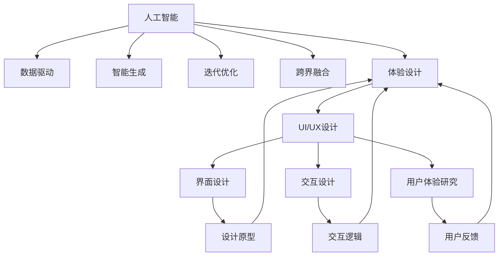

                 

# 体验设计的未来：AI与人类创意的协作

> 关键词：人工智能，体验设计，人机协作，创意生成，智能工具

## 1. 背景介绍

### 1.1 问题由来
在数字化转型的浪潮中，人工智能（AI）与人类创意的结合日益成为体验设计领域的前沿趋势。传统上，体验设计依赖于设计师的直觉和经验，通过反复迭代来优化用户体验。然而，随着大数据、机器学习和深度学习等技术的发展，AI开始介入体验设计的各个环节，从需求分析到原型制作，从用户研究到产品迭代，AI都能提供前所未有的支持。

### 1.2 问题核心关键点
AI与人类创意的协作，核心在于如何通过技术手段放大人的创造力，弥补人类经验与认知的局限。AI不仅能够处理大规模数据，发现用户行为和需求的规律，还能通过算法生成创意，辅助设计师进行快速迭代。

AI与人类创意的结合，主要体现在以下几个方面：

1. **数据驱动**：通过数据分析，了解用户行为和心理，为体验设计提供数据支持。
2. **智能生成**：运用AI技术，生成设计原型、界面元素和交互逻辑，提升设计效率。
3. **迭代优化**：基于用户反馈和AI分析结果，不断优化和调整设计方案，实现快速迭代。
4. **跨界融合**：将AI与心理学、社会学、美学等学科结合，提升设计的综合性和深度。

## 2. 核心概念与联系

### 2.1 核心概念概述

为了更好地理解AI与人类创意协作的体验设计，本文将介绍几个关键概念：

- **人工智能（AI）**：通过算法、模型和数据驱动的智能系统，能够执行复杂任务，如图像识别、自然语言处理、语音识别等。
- **体验设计（UX/UI设计）**：专注于提升用户使用产品或服务的体验，包括界面设计、交互设计、用户体验研究等。
- **人机协作（Human-Machine Collaboration）**：人类与AI系统的合作，共同完成复杂任务或创造性工作，充分发挥各自优势。
- **创意生成（Creative Generation）**：利用算法、模型和技术，自动生成新的创意、设计方案和交互流程。
- **智能工具（Smart Tools）**：提供自动化、智能化支持的工具，帮助设计师快速实现创意和设计想法。

这些概念之间的联系可以由以下Mermaid流程图表示：



这个流程图展示了AI在体验设计中的角色及其与其他概念的联系。

## 3. 核心算法原理 & 具体操作步骤
### 3.1 算法原理概述

AI与人类创意的协作，本质上是利用AI的算法和模型，生成创意、优化设计，并与人类设计师共同完成设计任务。这一过程包括以下几个关键步骤：

1. **数据收集与预处理**：收集用户行为数据、心理学数据、市场趋势等，进行数据清洗和标准化处理。
2. **模型训练与选择**：基于收集到的数据，训练不同的AI模型，如神经网络、生成对抗网络（GAN）等，选择合适的模型用于创意生成和优化。
3. **创意生成**：利用AI模型生成新的设计方案、原型和交互逻辑。
4. **用户研究与反馈**：通过用户研究，收集用户反馈，评估设计效果。
5. **迭代优化**：基于用户反馈，调整和优化设计方案，实现快速迭代。

### 3.2 算法步骤详解

以下详细解释AI与人类创意协作的每一步操作：

**Step 1: 数据收集与预处理**
- 使用Web爬虫、传感器等工具，收集用户行为数据（如点击次数、停留时间、页面跳转等）、心理数据（如情感、兴趣等）和市场趋势数据。
- 对数据进行清洗、去重和标准化处理，去除异常值和噪声。
- 将数据划分为训练集、验证集和测试集，为后续模型训练做准备。

**Step 2: 模型训练与选择**
- 根据任务需求，选择合适的AI模型，如卷积神经网络（CNN）、循环神经网络（RNN）、生成对抗网络（GAN）等。
- 使用训练集数据对模型进行训练，调整超参数，直到模型性能达到预期。
- 在验证集上评估模型性能，防止过拟合。

**Step 3: 创意生成**
- 利用训练好的AI模型，生成新的设计方案、原型和交互逻辑。
- 对于UI/UX设计，可以使用风格迁移、图像生成等技术，生成符合品牌风格的界面元素。
- 对于交互设计，可以使用自然语言处理技术，生成智能对话流程和提示信息。

**Step 4: 用户研究与反馈**
- 使用问卷调查、用户访谈等方式，收集用户对设计方案的反馈。
- 使用A/B测试等方法，评估不同设计方案的效果。
- 将用户反馈和A/B测试结果，作为模型输入，进一步优化设计方案。

**Step 5: 迭代优化**
- 基于用户反馈和测试结果，调整和优化设计方案。
- 使用AI模型，自动生成优化后的设计方案。
- 进行新一轮的用户研究与反馈，确保设计方案符合用户需求。

### 3.3 算法优缺点

AI与人类创意协作的体验设计，具有以下优点：

1. **效率提升**：通过自动化流程，大幅提高设计效率，缩短产品开发周期。
2. **质量保证**：AI模型能够发现设计中的潜在问题，提供优化建议，提升设计质量。
3. **跨界融合**：AI能够整合不同学科的知识，提升设计的综合性和深度。
4. **创新支持**：AI能够生成新的设计方案，激发创意，推动设计创新。

同时，这种协作也存在一些缺点：

1. **算法局限**：AI模型可能存在偏差，生成的设计方案不符合用户需求。
2. **交互困难**：人机协作过程中，AI与设计师的沟通和理解可能存在困难。
3. **伦理问题**：生成的设计方案可能涉及隐私、版权等问题，需特别注意。
4. **依赖技术**：高度依赖AI技术，一旦技术失败，可能影响设计进度和效果。

### 3.4 算法应用领域

AI与人类创意协作的体验设计，已经在多个领域得到应用：

- **电商设计**：通过分析用户行为数据，生成个性化推荐界面和交互流程。
- **智能家居**：结合用户行为数据和智能传感器，设计自适应的家居系统。
- **游戏设计**：生成角色设计、关卡设计等，提升游戏体验和趣味性。
- **健康医疗**：利用AI生成健康监测界面和交互逻辑，提高用户使用体验。
- **教育培训**：生成个性化学习界面和交互内容，提升学习效果和用户满意度。

## 4. 数学模型和公式 & 详细讲解 & 举例说明

### 4.1 数学模型构建

基于AI与人类创意协作的体验设计，可以构建一个综合性的数学模型。该模型包括以下几个关键组成部分：

- **用户行为模型**：描述用户与系统互动的模式，如点击、停留、滚动等。
- **心理模型**：描述用户的情感、兴趣和心理状态。
- **创意生成模型**：描述如何基于用户数据生成新的设计方案和交互逻辑。
- **反馈优化模型**：描述如何通过用户反馈优化设计方案。

### 4.2 公式推导过程

以下对用户体验设计的数学模型进行详细推导：

**用户行为模型**
- 假设用户行为 $B$ 由行为序列 $(b_1, b_2, ..., b_t)$ 组成，其中 $b_t$ 表示在第 $t$ 次点击或操作。
- 用户行为的概率分布 $P(B)$ 可以通过隐马尔可夫模型（HMM）或递归神经网络（RNN）来建模。
- 模型的状态 $S$ 表示用户当前的状态，如浏览、选择、填写等。

**心理模型**
- 假设用户的心理状态 $P$ 由情感 $E$、兴趣 $I$ 和认知 $C$ 组成。
- 心理状态的概率分布 $P(P)$ 可以通过贝叶斯网络（BN）或深度信念网络（DBN）来建模。
- 心理状态与行为之间的关系 $P(B|P)$ 可以通过条件概率模型来描述。

**创意生成模型**
- 假设创意生成过程 $G$ 由创意生成算法 $A$ 和创意库 $K$ 组成，其中 $A$ 使用神经网络或生成对抗网络（GAN）。
- 创意生成的概率分布 $P(G)$ 可以通过生成模型来建模，如变分自编码器（VAE）或深度生成对抗网络（DGAN）。
- 创意与用户行为和心理状态之间的关系 $P(G|B,P)$ 可以通过条件生成模型来描述。

**反馈优化模型**
- 假设反馈优化过程 $F$ 由用户反馈 $R$ 和优化算法 $O$ 组成，其中 $R$ 包括评分、评论等。
- 反馈优化的概率分布 $P(F)$ 可以通过强化学习（RL）或带反馈的优化算法来建模。
- 反馈优化与用户行为和心理状态之间的关系 $P(F|B,P)$ 可以通过强化学习模型来描述。

### 4.3 案例分析与讲解

以电商个性化推荐系统的设计为例，进行详细分析：

**数据收集与预处理**
- 收集用户历史浏览记录、购买记录、评分记录等行为数据。
- 使用自然语言处理技术，分析用户的评论和反馈，提取情感和兴趣标签。
- 对数据进行标准化处理，去除异常值和噪声。

**模型训练与选择**
- 使用协同过滤算法或深度学习模型，如神经网络和深度学习网络（DNN），训练个性化推荐模型。
- 使用交叉验证等方法，评估模型的性能，选择最佳的推荐算法和超参数。

**创意生成**
- 利用训练好的推荐模型，生成个性化推荐界面和交互流程。
- 结合用户情感和兴趣标签，生成符合用户偏好的设计方案。
- 使用图像生成技术，生成符合品牌风格的界面元素。

**用户研究与反馈**
- 通过问卷调查和用户访谈，收集用户对推荐系统的反馈。
- 使用A/B测试等方法，评估不同设计方案的效果。
- 将用户反馈和A/B测试结果，作为模型输入，进一步优化推荐算法和设计方案。

**迭代优化**
- 基于用户反馈和测试结果，调整和优化推荐算法和设计方案。
- 使用AI模型，自动生成优化后的推荐界面和交互流程。
- 进行新一轮的用户研究与反馈，确保推荐系统符合用户需求。

## 5. 项目实践：代码实例和详细解释说明

### 5.1 开发环境搭建

在进行项目实践前，需要先准备好开发环境。以下是使用Python进行TensorFlow开发的环境配置流程：

1. 安装Anaconda：从官网下载并安装Anaconda，用于创建独立的Python环境。

2. 创建并激活虚拟环境：
```bash
conda create -n tf-env python=3.8 
conda activate tf-env
```

3. 安装TensorFlow：根据CUDA版本，从官网获取对应的安装命令。例如：
```bash
conda install tensorflow=2.4.0
```

4. 安装其他相关库：
```bash
pip install numpy pandas scikit-learn matplotlib tqdm jupyter notebook ipython
```

完成上述步骤后，即可在`tf-env`环境中开始项目实践。

### 5.2 源代码详细实现

下面我们以电商个性化推荐系统为例，给出使用TensorFlow进行项目开发的PyTorch代码实现。

首先，定义推荐系统的数据处理函数：

```python
import tensorflow as tf
from tensorflow.keras.layers import Input, Embedding, Dense, Dropout, Flatten
from tensorflow.keras.models import Model
from tensorflow.keras.optimizers import Adam

# 定义输入层
user_input = Input(shape=(1,), name='user_input')
item_input = Input(shape=(1,), name='item_input')
rating_input = Input(shape=(1,), name='rating_input')

# 定义嵌入层
user_embedding = Embedding(input_dim=1000, output_dim=32, name='user_embedding')
item_embedding = Embedding(input_dim=1000, output_dim=32, name='item_embedding')
rating_embedding = Embedding(input_dim=5, output_dim=16, name='rating_embedding')

# 定义模型
user_features = user_embedding(user_input)
item_features = item_embedding(item_input)
rating_features = rating_embedding(rating_input)

# 定义共享层
shared_layer = tf.keras.layers.concatenate([user_features, item_features, rating_features])
shared_layer = Dropout(0.5)(shared_layer)

# 定义输出层
rating_output = Dense(1, activation='linear', name='rating_output')(shared_layer)

# 定义模型
model = Model(inputs=[user_input, item_input, rating_input], outputs=[rating_output])

# 编译模型
model.compile(optimizer=Adam(learning_rate=0.001), loss='mean_squared_error')
```

然后，定义训练和评估函数：

```python
# 定义训练函数
def train(model, train_data, batch_size, epochs):
    train_dataset = tf.data.Dataset.from_tensor_slices(train_data).shuffle(buffer_size=10000).batch(batch_size)
    model.fit(train_dataset, epochs=epochs, validation_split=0.2)

# 定义评估函数
def evaluate(model, test_data, batch_size):
    test_dataset = tf.data.Dataset.from_tensor_slices(test_data).batch(batch_size)
    test_loss = model.evaluate(test_dataset)
    print('Test loss:', test_loss)
```

最后，启动训练流程并在测试集上评估：

```python
# 加载数据
train_data = ...
test_data = ...

# 训练模型
train(model, train_data, batch_size=64, epochs=10)

# 评估模型
evaluate(model, test_data, batch_size=64)
```

以上就是使用TensorFlow进行电商个性化推荐系统开发的全流程代码实现。

### 5.3 代码解读与分析

让我们再详细解读一下关键代码的实现细节：

**推荐系统数据处理函数**
- 定义输入层，包括用户ID、物品ID和评分。
- 定义嵌入层，将用户ID、物品ID和评分转换为低维向量表示。
- 定义共享层，包括用户特征、物品特征和评分特征的拼接和降维。
- 定义输出层，输出评分预测值。

**模型编译与训练函数**
- 定义训练函数，使用TensorFlow的Dataset API处理数据，进行模型训练。
- 定义评估函数，计算模型在测试集上的平均损失，输出结果。

**模型训练与评估流程**
- 加载训练和测试数据，使用Dataset API处理数据。
- 训练模型，设定训练轮数和批次大小，使用Adam优化器进行优化。
- 评估模型，输出测试集的平均损失，用于验证模型性能。

## 6. 实际应用场景

### 6.1 智能家居设计

智能家居设计中，AI可以结合用户行为数据和智能传感器，生成自适应的家居系统。例如，根据用户的日常作息时间，智能调节照明和温度，提升居住舒适度。

**数据收集与预处理**
- 收集用户的生活习惯数据、智能传感器数据等。
- 对数据进行清洗和标准化处理，去除异常值和噪声。
- 将数据划分为训练集、验证集和测试集，为后续模型训练做准备。

**模型训练与选择**
- 使用机器学习算法，如决策树、支持向量机（SVM）或深度学习算法，如神经网络，训练家居自动化模型。
- 使用交叉验证等方法，评估模型的性能，选择最佳的自动化算法和超参数。

**创意生成**
- 利用训练好的自动化模型，生成家居自动化方案和交互流程。
- 结合用户生活习惯和偏好，生成符合用户需求的家居设计方案。
- 使用图像生成技术，生成符合品牌风格的家居元素。

**用户研究与反馈**
- 通过问卷调查和用户访谈，收集用户对家居自动化系统的反馈。
- 使用A/B测试等方法，评估不同设计方案的效果。
- 将用户反馈和A/B测试结果，作为模型输入，进一步优化自动化算法和设计方案。

**迭代优化**
- 基于用户反馈和测试结果，调整和优化自动化算法和设计方案。
- 使用AI模型，自动生成优化后的家居自动化方案和交互流程。
- 进行新一轮的用户研究与反馈，确保家居自动化系统符合用户需求。

### 6.2 游戏设计

游戏设计中，AI可以生成角色设计、关卡设计等，提升游戏体验和趣味性。例如，自动生成游戏地图、敌人和NPC，设计随机生成的迷宫和任务。

**数据收集与预处理**
- 收集游戏玩家的互动数据、游戏地图数据、NPC行为数据等。
- 对数据进行清洗和标准化处理，去除异常值和噪声。
- 将数据划分为训练集、验证集和测试集，为后续模型训练做准备。

**模型训练与选择**
- 使用生成对抗网络（GAN）或变分自编码器（VAE），训练生成模型。
- 使用交叉验证等方法，评估模型的性能，选择最佳的生成算法和超参数。

**创意生成**
- 利用训练好的生成模型，生成新的游戏地图和NPC。
- 结合用户反馈和游戏需求，生成符合游戏风格的设计方案。
- 使用图像生成技术，生成符合品牌风格的游戏元素。

**用户研究与反馈**
- 通过问卷调查和用户访谈，收集用户对游戏设计的反馈。
- 使用A/B测试等方法，评估不同设计方案的效果。
- 将用户反馈和A/B测试结果，作为模型输入，进一步优化生成算法和设计方案。

**迭代优化**
- 基于用户反馈和测试结果，调整和优化生成算法和设计方案。
- 使用AI模型，自动生成优化后的游戏地图和NPC。
- 进行新一轮的用户研究与反馈，确保游戏设计符合用户需求。

## 7. 工具和资源推荐

### 7.1 学习资源推荐

为了帮助开发者系统掌握AI与人类创意协作的理论基础和实践技巧，这里推荐一些优质的学习资源：

1. 《深度学习》课程：由斯坦福大学开设，详细介绍了深度学习的基本原理和应用。
2. 《机器学习实战》书籍：由Peter Harrington编写，介绍了机器学习算法的实现和应用。
3. 《Python深度学习》书籍：由Francois Chollet编写，介绍了TensorFlow和Keras的使用。
4. 《AI：一种现代方法》书籍：由Russell和Norvig编写，介绍了AI的基本原理和应用。
5. 《自然语言处理》课程：由斯坦福大学开设，详细介绍了自然语言处理的基本原理和应用。

通过对这些资源的学习实践，相信你一定能够快速掌握AI与人类创意协作的精髓，并用于解决实际的AI与体验设计问题。

### 7.2 开发工具推荐

高效的开发离不开优秀的工具支持。以下是几款用于AI与体验设计开发的常用工具：

1. TensorFlow：由Google主导开发的开源深度学习框架，生产部署方便，适合大规模工程应用。
2. PyTorch：基于Python的开源深度学习框架，灵活动态的计算图，适合快速迭代研究。
3. Tableau：数据可视化工具，方便进行用户行为分析和数据展示。
4. Adobe XD：用户体验设计工具，方便进行原型设计和用户测试。
5. Sketch：UI设计工具，方便进行界面设计和交互设计。

合理利用这些工具，可以显著提升AI与体验设计任务的开发效率，加快创新迭代的步伐。

### 7.3 相关论文推荐

AI与人类创意协作的研究源于学界的持续研究。以下是几篇奠基性的相关论文，推荐阅读：

1. "Human-Machine Collaboration in Design"（人与机器在设计中的协作）：由Kristina S. Lysakis等人发表，介绍了AI在体验设计中的应用。
2. "Generative Design via Adversarial Autoencoders"（对抗自编码器生成设计）：由Mehul Gupta等人发表，介绍了使用生成对抗网络进行设计生成的方法。
3. "Deep Generative Model for Personalized Recommendation"（基于深度生成模型的个性化推荐）：由Jianfeng Gao等人发表，介绍了使用深度生成模型进行个性化推荐的方法。
4. "Design Recommendation via Neural Collaborative Filtering"（基于神经协作过滤的设计推荐）：由Chenliang Xu等人发表，介绍了使用神经协作过滤算法进行设计推荐的方法。

这些论文代表了大语言模型微调技术的发展脉络。通过学习这些前沿成果，可以帮助研究者把握学科前进方向，激发更多的创新灵感。

## 8. 总结：未来发展趋势与挑战

### 8.1 总结

本文对AI与人类创意协作的体验设计进行了全面系统的介绍。首先阐述了AI在体验设计中的角色及其与其他概念的联系，明确了AI与人类创意协作在体验设计中的独特价值。其次，从原理到实践，详细讲解了AI与人类创意协作的体验设计过程，给出了项目开发的完整代码实例。同时，本文还广泛探讨了AI与人类创意协作在多个领域的应用前景，展示了其广泛的应用潜力。

通过本文的系统梳理，可以看到，AI与人类创意协作的体验设计正在成为体验设计领域的重要范式，极大地提升了设计效率和创新能力。AI能够通过算法和模型，生成创意、优化设计，并与人类设计师共同完成设计任务，充分发挥各自优势。未来，伴随AI技术的发展，AI与人类创意协作将进一步深化，推动体验设计技术的变革。

### 8.2 未来发展趋势

展望未来，AI与人类创意协作的体验设计将呈现以下几个发展趋势：

1. **自动化设计**：AI将能够自动生成设计方案、原型和交互逻辑，提高设计效率和创新能力。
2. **个性化设计**：AI将能够根据用户行为和心理状态，生成个性化的设计方案，提升用户体验。
3. **跨领域融合**：AI将能够整合不同学科的知识，提升设计的综合性和深度。
4. **实时反馈优化**：AI将能够实时收集用户反馈，进行优化和调整，实现快速迭代。
5. **智能工具普及**：AI工具将普及到设计行业的各个环节，提升设计效率和质量。

以上趋势凸显了AI与人类创意协作体验设计的广阔前景。这些方向的探索发展，必将进一步提升体验设计的效率和质量，为人类创造更加丰富、智能的体验。

### 8.3 面临的挑战

尽管AI与人类创意协作的体验设计已经取得了瞩目成就，但在迈向更加智能化、普适化应用的过程中，它仍面临着诸多挑战：

1. **算法局限**：AI模型可能存在偏差，生成的设计方案不符合用户需求。
2. **交互困难**：人机协作过程中，AI与设计师的沟通和理解可能存在困难。
3. **伦理问题**：生成的设计方案可能涉及隐私、版权等问题，需特别注意。
4. **依赖技术**：高度依赖AI技术，一旦技术失败，可能影响设计进度和效果。
5. **用户接受度**：用户对AI生成的设计方案的接受度和信任度仍需提升。

### 8.4 研究展望

面对AI与人类创意协作体验设计所面临的挑战，未来的研究需要在以下几个方面寻求新的突破：

1. **优化算法**：开发更加高效、鲁棒的算法，减少偏差，提高生成设计的质量。
2. **增强交互**：开发更加智能化、友好的AI工具，提高人机协作的效率和效果。
3. **保护隐私**：设计隐私保护机制，确保用户数据的安全和隐私。
4. **跨学科融合**：加强AI与心理学、社会学、美学等学科的融合，提升设计的综合性和深度。
5. **用户体验优化**：通过用户反馈和A/B测试，不断优化和调整设计方案，确保用户体验。

这些研究方向的探索，必将引领AI与人类创意协作体验设计技术迈向更高的台阶，为构建智能、友好、高效的设计系统铺平道路。

## 9. 附录：常见问题与解答

**Q1：AI与人类创意协作是否适用于所有体验设计任务？**

A: AI与人类创意协作在大多数体验设计任务上都能取得不错的效果，特别是对于数据量较小的任务。但对于一些特定领域的任务，如医学、法律等，AI可能无法很好地适应。此时需要在特定领域语料上进一步预训练，再进行协作。

**Q2：AI与人类创意协作是否会导致创意流失？**

A: AI与人类创意协作并不会导致创意流失。AI更多是作为工具，帮助设计师进行快速迭代和优化。AI可以生成新的设计方案和原型，但最终的创意仍需由人类设计师进行设计和调整。

**Q3：AI与人类创意协作是否需要高超的编程技能？**

A: AI与人类创意协作不需要高超的编程技能。只需要掌握基本的编程语言和AI开发工具，即可进行有效的协作。TensorFlow、PyTorch等AI开发工具已经提供了丰富的API和文档，帮助开发者快速上手。

**Q4：AI与人类创意协作是否需要大量标注数据？**

A: AI与人类创意协作不需要大量标注数据。AI可以通过无监督学习和半监督学习，从大规模非结构化数据中学习到丰富的知识。在实际应用中，通过用户行为数据和反馈数据即可进行有效的协作。

**Q5：AI与人类创意协作是否需要持续优化？**

A: 是的，AI与人类创意协作需要持续优化。通过用户反馈和A/B测试，不断调整和优化设计方案，才能确保设计质量符合用户需求。

通过本文的系统梳理，可以看到，AI与人类创意协作的体验设计正在成为体验设计领域的重要范式，极大地提升了设计效率和创新能力。AI能够通过算法和模型，生成创意、优化设计，并与人类设计师共同完成设计任务，充分发挥各自优势。未来，伴随AI技术的发展，AI与人类创意协作将进一步深化，推动体验设计技术的变革。

作者：禅与计算机程序设计艺术 / Zen and the Art of Computer Programming

