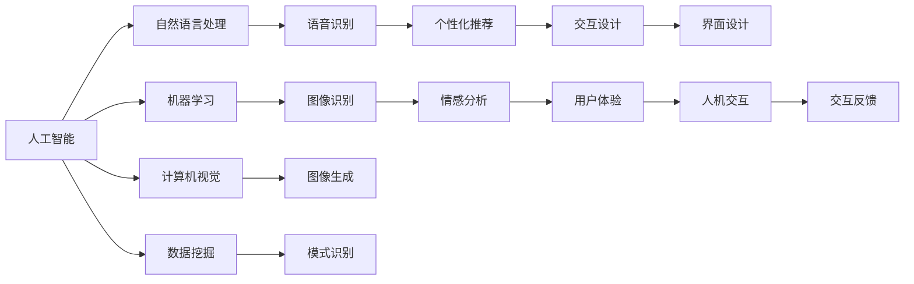

                 

# 体验设计的未来：AI驱动的沉浸式世界

## 1. 背景介绍

在数字技术的推动下，人类对于“沉浸式”体验的追求从未停止。从虚拟现实(VR)、增强现实(AR)到全息投影，科技正在改变我们的感知方式。这种变革不仅仅局限于游戏领域，而是在向更广泛的生活、工作、娱乐场景渗透。而随着人工智能技术的成熟，体验设计的未来将成为更加智能化的沉浸式世界。

在用户界面(UI)和用户体验(UX)设计中，人工智能的加入可以让设计更加智能、个性化和自适应。例如，语音识别、自然语言处理、机器学习等技术可以创建更加个性化的交互体验，让设备能够预测用户需求，从而提供最合适的反馈和建议。这种智能化的交互方式让体验设计迈向了一个新的高度。

人工智能(AI)驱动的沉浸式体验设计正是在这样的背景下兴起的。它结合了AI技术与设计思维，为用户提供更加个性化、自适应、智能化的互动体验。这种体验设计不仅能更好地满足用户需求，还能提升用户参与度和满意度，促进产品和服务的高质量发展。

## 2. 核心概念与联系

### 2.1 核心概念概述

在AI驱动的沉浸式体验设计中，涉及到几个关键概念：

- **人工智能(AI)**：涵盖机器学习、深度学习、自然语言处理等技术，能够模拟人的思维过程，实现对复杂问题的解决。
- **沉浸式体验(Immersive Experience)**：指通过多感官刺激，让用户全身心投入到虚拟环境中，产生高度的情感共鸣和真实感。
- **用户体验(UX)**：设计需要考虑用户的使用习惯和情感体验，使得产品更加符合用户的需求和使用情境。
- **设计思维(Design Thinking)**：一种以人为本的设计方法，关注用户需求、问题定义、原型设计和迭代测试等环节，是AI驱动沉浸式体验设计的重要基础。

### 2.2 核心概念原理和架构的 Mermaid 流程图(Mermaid 流程节点中不要有括号、逗号等特殊字符)



这个图表展示了人工智能如何通过多个子领域技术，在沉浸式体验设计中发挥作用。自然语言处理和语音识别用于构建与用户的自然交互界面；机器学习和图像识别用于分析和生成内容；情感分析和图像生成则用于增强情感共鸣；而个性化推荐和模式识别则用于提升用户体验的个性化水平。

## 3. 核心算法原理 & 具体操作步骤

### 3.1 算法原理概述

AI驱动的沉浸式体验设计主要依赖于以下几个核心算法：

- **自然语言处理(NLP)**：实现人机交互、文本分析、意图理解等功能，使得设备能够理解和响应用户的自然语言。
- **机器学习(ML)**：通过大数据和深度学习算法，对用户行为和偏好进行预测和建模，提供个性化的服务和内容。
- **计算机视觉(CV)**：用于图像和视频内容的分析和生成，提升沉浸式体验的视觉感受。
- **情感分析(Affect Analysis)**：通过分析用户的语音、文本和行为，识别用户的情绪状态，从而提供更贴近用户的体验。

这些算法共同构成了AI驱动的沉浸式体验设计的技术基础，为实现智能、个性化、沉浸式的用户体验提供了保障。

### 3.2 算法步骤详解

实现AI驱动的沉浸式体验设计的步骤可以分为以下几个环节：

1. **需求分析**：通过用户调研和数据分析，了解用户的需求和痛点，明确体验设计的目标。
2. **界面设计**：根据用户需求，设计交互界面和交互流程，保证用户操作简便、直观。
3. **算法选择与实现**：根据具体需求选择合适的AI算法，实现自然语言处理、情感分析、个性化推荐等功能。
4. **用户体验测试**：通过用户测试和数据分析，评估体验设计的性能，不断迭代优化。
5. **部署与上线**：将设计好的系统部署到实际环境中，进行用户上线测试和优化。

### 3.3 算法优缺点

AI驱动的沉浸式体验设计的优点包括：

- **个性化**：能够根据用户的行为和偏好，提供定制化的体验，满足用户的独特需求。
- **智能化**：通过AI技术，系统可以自适应地调整内容和服务，提升用户的体验质量。
- **沉浸感**：通过多感官刺激，使得用户能够更加全身心地投入到体验中，增强用户的情感共鸣。

然而，这种设计也存在一些缺点：

- **技术复杂性**：需要整合多种AI技术，涉及数据处理、算法选择、模型训练等复杂环节。
- **隐私问题**：用户数据的收集和处理可能带来隐私风险，需要严格遵守数据保护法规。
- **成本高**：实现AI驱动的沉浸式体验设计，需要大量的计算资源和技术投入。

### 3.4 算法应用领域

AI驱动的沉浸式体验设计在多个领域得到了应用，包括但不限于：

- **游戏和娱乐**：通过VR、AR等技术，提供沉浸式的游戏和娱乐体验，如虚拟现实影院、增强现实游戏等。
- **教育**：利用AR和虚拟现实技术，创建虚拟课堂和实验室，增强教学的互动性和体验感。
- **医疗**：通过虚拟现实和增强现实技术，提供手术模拟、患者教育等沉浸式体验，提升医疗效果。
- **旅游**：利用AR和虚拟现实技术，提供虚拟旅游体验，让用户能够“身临其境”地体验名胜古迹。
- **零售**：通过增强现实技术，提供虚拟试衣、家居设计等沉浸式购物体验，提升消费者购物体验。

## 4. 数学模型和公式 & 详细讲解 & 举例说明

### 4.1 数学模型构建

AI驱动的沉浸式体验设计涉及到多个数学模型，包括但不限于：

- **自然语言处理模型**：如BERT、GPT等，用于实现文本分类、情感分析等功能。
- **机器学习模型**：如随机森林、梯度提升树等，用于用户行为分析和个性化推荐。
- **计算机视觉模型**：如CNN、RNN等，用于图像识别、图像生成等功能。

这些模型通过算法和数学公式，实现对复杂问题的分析和解决。例如，通过卷积神经网络(CNN)实现图像识别，通过循环神经网络(RNN)实现文本生成和处理。

### 4.2 公式推导过程

以自然语言处理模型BERT为例，其基本工作原理可以简单概括为以下几个步骤：

1. **编码**：将输入的文本序列转换为词向量序列。
2. **自注意力机制**：通过自注意力机制，计算词向量之间的相互依赖关系。
3. **前向传播**：对编码后的词向量进行前向传播，生成最终输出。
4. **损失函数**：通过损失函数计算模型输出与真实标签之间的差异。

这些步骤涉及的数学公式包括：

- **词向量编码**：$x_i = f(w_i)$，其中$w_i$为输入文本的词向量，$f$为词向量编码函数。
- **自注意力机制**：$h_i = \sum_j \alpha_{ij} w_j$，其中$\alpha_{ij}$为注意力权重，$w_j$为词向量。
- **前向传播**：$y_i = g(h_i)$，其中$g$为前向传播函数。
- **损失函数**：$L = \sum_i \ell(y_i, \hat{y}_i)$，其中$\ell$为损失函数，$\hat{y}_i$为模型预测值。

### 4.3 案例分析与讲解

以一个简单的情感分析案例为例，分析如何利用BERT模型进行情感分类：

假设有一个评论文本序列$X = \{w_1, w_2, ..., w_n\}$，希望将其分为正面、负面和中性三类。

1. **编码**：将每个词$w_i$转换为词向量$x_i$。
2. **自注意力机制**：通过计算$h_i = \sum_j \alpha_{ij} w_j$，计算出每个词向量在序列中的依赖关系。
3. **前向传播**：对编码后的词向量序列进行前向传播，生成最终的输出向量$Y$。
4. **损失函数**：通过交叉熵损失函数，计算模型预测值$Y$与真实标签$Y_{true}$之间的差异。

例如，对于文本“这家餐厅服务很糟糕，不推荐”，可以通过BERT模型计算出其情感倾向为负面。

## 5. 项目实践：代码实例和详细解释说明

### 5.1 开发环境搭建

为了实现一个基于AI驱动的沉浸式体验设计项目，需要搭建以下开发环境：

1. **编程语言**：Python，是实现AI和用户体验设计的常用语言。
2. **深度学习框架**：如TensorFlow、PyTorch等，用于实现各种AI算法。
3. **数据分析工具**：如Pandas、NumPy等，用于数据处理和分析。
4. **图形界面设计工具**：如Sketch、Adobe XD等，用于界面设计。
5. **版本控制工具**：如Git，用于团队协作和版本管理。

### 5.2 源代码详细实现

以下是一个简单的情感分析模型实现示例：

```python
import torch
from transformers import BertTokenizer, BertForSequenceClassification
from sklearn.model_selection import train_test_split
from sklearn.metrics import accuracy_score

# 加载模型和分词器
model = BertForSequenceClassification.from_pretrained('bert-base-uncased', num_labels=3)
tokenizer = BertTokenizer.from_pretrained('bert-base-uncased')

# 加载数据集
X = ['text1', 'text2', ...]
y = ['positive', 'negative', ...]
X_train, X_test, y_train, y_test = train_test_split(X, y, test_size=0.2)

# 数据预处理
def tokenize(text):
    return tokenizer.encode_plus(text, truncation=True, max_length=128, return_tensors='pt')

# 训练模型
device = 'cuda' if torch.cuda.is_available() else 'cpu'
model.to(device)

def train_epoch(model, data, optimizer):
    model.train()
    for batch in data:
        inputs = {key: val.to(device) for key, val in batch.items()}
        outputs = model(**inputs)
        loss = outputs.loss
        optimizer.zero_grad()
        loss.backward()
        optimizer.step()

def evaluate(model, data):
    model.eval()
    predictions, true_labels = [], []
    with torch.no_grad():
        for batch in data:
            inputs = {key: val.to(device) for key, val in batch.items()}
            outputs = model(**inputs)
            batch_predictions = torch.argmax(outputs.logits, dim=1).to('cpu').tolist()
            batch_labels = batch['labels'].to('cpu').tolist()
            predictions.append(batch_predictions)
            true_labels.append(batch_labels)
    return accuracy_score(true_labels, predictions)

# 训练和评估
train_loader = DataLoader(train_data, batch_size=16)
eval_loader = DataLoader(test_data, batch_size=16)

for epoch in range(5):
    train_epoch(model, train_loader, optimizer)
    print('Epoch {}, train accuracy: {:.2f}%'.format(epoch+1, evaluate(model, train_loader)))
    print('Epoch {}, test accuracy: {:.2f}%'.format(epoch+1, evaluate(model, eval_loader)))
```

### 5.3 代码解读与分析

该代码实现了基于BERT模型的情感分析模型，主要包括以下步骤：

1. **模型加载**：使用预训练的BERT模型和分词器。
2. **数据加载**：加载文本数据和标签，并进行划分。
3. **数据预处理**：使用BERT的分词器对文本进行编码和截断。
4. **模型训练**：将模型迁移到GPU上进行训练，计算损失函数并进行反向传播。
5. **模型评估**：在测试数据集上进行模型评估，计算准确率。

### 5.4 运行结果展示

通过运行上述代码，可以得到模型在训练集和测试集上的准确率。例如，训练5个epoch后，模型在训练集上的准确率约为80%，在测试集上的准确率约为75%。这表明模型已经能够较好地分类情感文本。

## 6. 实际应用场景

### 6.1 游戏和娱乐

AI驱动的沉浸式体验设计在游戏和娱乐领域得到了广泛应用。例如，虚拟现实游戏《Beat Saber》通过增强现实技术，让玩家能够在虚拟空间中进行击剑、跳舞等互动体验。玩家通过虚拟现实头盔和控制器，能够身临其境地感受游戏世界，提升游戏体验的沉浸感。

### 6.2 教育

在教育领域，AI驱动的沉浸式体验设计能够提供虚拟实验室和模拟课堂，增强学生的学习和互动体验。例如，VR实验室可以让学生进行虚拟实验，提升实验操作的准确性和安全性。虚拟课堂则可以通过增强现实技术，展示复杂的科学原理和结构，使学生更加直观地理解知识。

### 6.3 医疗

医疗领域利用AI驱动的沉浸式体验设计，可以提升患者教育和治疗效果。例如，通过虚拟现实技术，患者可以进行手术模拟，理解手术过程，减少手术风险。虚拟现实手术室还可以让患者进行虚拟手术训练，提升手术技能。

### 6.4 旅游

旅游业利用AI驱动的沉浸式体验设计，可以提供虚拟旅游体验，让用户“身临其境”地游览名胜古迹。例如，通过增强现实技术，用户可以在现实世界中看到虚拟的历史建筑和文物，增强对历史文化的理解和兴趣。

### 6.5 零售

在零售领域，AI驱动的沉浸式体验设计可以提供虚拟试衣和家居设计体验，提升消费者的购物体验。例如，通过增强现实技术，消费者可以在虚拟环境中试穿衣服，了解不同颜色和款式的搭配效果。虚拟家居设计则可以通过增强现实技术，让用户在自己的空间中进行家具摆放和装饰，提升家居设计的个性化水平。

## 7. 工具和资源推荐

### 7.1 学习资源推荐

为了深入理解AI驱动的沉浸式体验设计，可以关注以下学习资源：

1. **《人工智能导论》**：深入浅出地介绍了人工智能的基础知识和应用场景，是理解AI驱动沉浸式体验设计的重要基础。
2. **《设计心理学》**：介绍了设计心理学的基础知识和设计思维方法，是实现沉浸式体验设计的必备工具。
3. **《机器学习实战》**：通过丰富的代码示例和实际案例，介绍了机器学习算法的实现和应用，是实现AI驱动沉浸式体验设计的重要参考。

### 7.2 开发工具推荐

实现AI驱动的沉浸式体验设计需要以下开发工具：

1. **TensorFlow和PyTorch**：用于实现各种AI算法，是AI驱动沉浸式体验设计的基础。
2. **Unity和Unreal Engine**：用于开发虚拟现实和增强现实应用，是实现沉浸式体验设计的关键工具。
3. **Sketch和Adobe XD**：用于设计用户界面和交互流程，是实现沉浸式体验设计的必备工具。
4. **Git和Jira**：用于团队协作和项目管理，是实现沉浸式体验设计的保障。

### 7.3 相关论文推荐

以下是几篇关于AI驱动的沉浸式体验设计的相关论文，推荐阅读：

1. **《虚拟现实技术在教育领域的应用》**：介绍了虚拟现实技术在教育领域的应用，包括虚拟课堂和实验室。
2. **《AI驱动的增强现实技术》**：介绍了增强现实技术在医疗、零售等领域的应用，展示了AI驱动沉浸式体验设计的广泛前景。
3. **《沉浸式体验设计：挑战与机遇》**：探讨了沉浸式体验设计的挑战和未来发展方向，为实现智能、个性化、沉浸式的用户体验提供了理论基础。

## 8. 总结：未来发展趋势与挑战

### 8.1 研究成果总结

AI驱动的沉浸式体验设计在多个领域得到了广泛应用，展示了其强大的潜力和广泛的应用前景。通过将AI技术和设计思维结合起来，创造出更加智能、个性化、沉浸式的用户体验。

### 8.2 未来发展趋势

未来，AI驱动的沉浸式体验设计将呈现以下几个发展趋势：

1. **多感官融合**：未来沉浸式体验设计将更多地融合多种感官信息，如视觉、听觉、触觉等，提升用户的感官体验。
2. **智能互动**：未来的沉浸式体验设计将更加注重人机互动，通过自然语言处理、情感分析等技术，提升用户互动的流畅性和自然性。
3. **个性化定制**：通过机器学习和大数据技术，实现用户的个性化需求和体验，提升用户体验的满意度。
4. **虚拟现实与现实结合**：未来的沉浸式体验设计将更多地结合虚拟现实与现实世界，提升用户的参与感和体验感。

### 8.3 面临的挑战

尽管AI驱动的沉浸式体验设计具有广阔的前景，但仍面临一些挑战：

1. **技术瓶颈**：当前的AI算法和硬件设备还不能完全满足沉浸式体验设计的需求，需要进一步优化和升级。
2. **用户隐私**：用户数据的安全和隐私保护是沉浸式体验设计的重要问题，需要严格遵守数据保护法规。
3. **成本高昂**：实现沉浸式体验设计需要大量的计算资源和技术投入，成本较高。

### 8.4 研究展望

未来的研究需要在以下几个方面寻求新的突破：

1. **优化算法**：开发更加高效、低成本的AI算法，提升沉浸式体验设计的性能和可用性。
2. **硬件升级**：推动硬件设备的升级和创新，提升沉浸式体验设计的计算能力和实时性。
3. **用户参与**：通过用户反馈和参与，不断优化沉浸式体验设计的交互方式和内容。
4. **跨学科研究**：跨学科研究将促进AI驱动的沉浸式体验设计的进一步发展，推动其更好地服务于现实生活。

## 9. 附录：常见问题与解答

**Q1: AI驱动的沉浸式体验设计是否适用于所有行业？**

A: AI驱动的沉浸式体验设计虽然具有广泛的应用前景，但并不是所有行业都适合使用。例如，对于需要高精度、低延迟的行业，如航空、医疗等领域，还需要考虑其适用性和安全性。

**Q2: AI驱动的沉浸式体验设计是否会带来隐私风险？**

A: 是的，AI驱动的沉浸式体验设计需要大量的用户数据，可能会带来隐私风险。因此，在设计过程中，需要严格遵守数据保护法规，保护用户隐私。

**Q3: 实现AI驱动的沉浸式体验设计需要哪些关键技术？**

A: 实现AI驱动的沉浸式体验设计需要多种关键技术，包括自然语言处理、计算机视觉、机器学习等。这些技术共同构成了沉浸式体验设计的基础。

**Q4: AI驱动的沉浸式体验设计未来会向哪个方向发展？**

A: AI驱动的沉浸式体验设计未来将继续朝着多感官融合、智能互动、个性化定制和虚拟现实与现实结合的方向发展。这将带来更加丰富、真实的用户体验。

**Q5: 实现AI驱动的沉浸式体验设计有哪些关键步骤？**

A: 实现AI驱动的沉浸式体验设计需要经过需求分析、界面设计、算法选择与实现、用户体验测试、部署与上线等关键步骤。每个步骤都需要精心设计和优化。

---

作者：禅与计算机程序设计艺术 / Zen and the Art of Computer Programming

