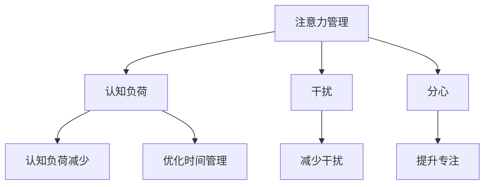

                 

# 信息时代的注意力管理实践与策略：在干扰和分心中保持头脑清晰

> 关键词：注意力管理, 信息时代, 干扰和分心, 头脑清晰, 注意力恢复, 认知负荷, 多任务处理, 时间管理

## 1. 背景介绍

### 1.1 问题由来

随着信息技术的高速发展，我们生活的方方面面都深受其影响。智能手机、互联网、社交媒体、信息爆炸等现象，极大地改变了我们的工作方式、生活习惯乃至心理状态。面对海量的信息流，我们不可避免地会受到干扰和分心，难以集中注意力，从而影响了工作效率和生活质量。这种注意力分散的现象，已经成为信息时代一个普遍的问题。

### 1.2 问题核心关键点

在信息时代，如何管理注意力、在干扰和分心中保持头脑清晰，是每个个体和组织需要面对的挑战。具体来说，核心关键点包括：

- **认知负荷**：信息过载会加重认知负荷，导致注意力分散。
- **干扰因素**：外界干扰如社交媒体、即时消息等会打断我们的工作和学习。
- **分心习惯**：长时间的上网、游戏等行为容易形成分心的习惯，影响工作效率。
- **时间管理**：有效的时间管理能够帮助我们更好地分配注意力，提升生产力。

### 1.3 问题研究意义

研究注意力管理的方法和策略，对于提升个人和组织的注意力集中度，提高信息时代的生产效率和生活质量，具有重要的理论和实践意义：

- 提升工作效率：通过有效管理注意力，可以减少工作中的分心和干扰，提高任务完成的效率和质量。
- 改善生活质量：减少分心和干扰，有助于提升个人的心理健康和生活满意度，促进更好的家庭和工作平衡。
- 支持教育和学习：教育和学习环境中，有效管理注意力，有助于学生更好地集中精力，提高学习效果。
- 促进健康发展：管理好注意力，有助于预防注意力缺陷多动障碍(ADHD)等注意力相关问题，促进个体健康发展。
- 推动组织创新：组织层面通过集中注意力，有助于提升团队协作和创新能力，增强组织竞争力。

## 2. 核心概念与联系

### 2.1 核心概念概述

为更好地理解注意力管理及其策略，本节将介绍几个密切相关的核心概念：

- **注意力管理(Attention Management)**：指通过有意识的策略和方法，提升个体或团队的注意力集中度，减少干扰和分心的过程。
- **认知负荷(Cognitive Load)**：指个体在处理信息时所需的心理资源，过多的认知负荷会导致注意力分散。
- **干扰(Interference)**：指外界环境或内在心理状态对个体注意力集中度的负面影响。
- **分心(Distractibility)**：指个体在面对多种任务或干扰时，容易偏离当前任务的心理状态。
- **时间管理(Time Management)**：指通过计划和组织，合理分配时间，提升工作效率和生活质量的过程。

这些核心概念之间的逻辑关系可以通过以下Mermaid流程图来展示：



这个流程图展示了几大核心概念及其之间的关系：

1. 注意力管理通过减少认知负荷、干扰和分心，提升认知负荷减少、减少干扰、提升专注、优化时间管理。
2. 认知负荷减少有助于提升注意力集中度。
3. 干扰和分心减少有助于注意力集中。
4. 优化时间管理有助于提高效率，减轻认知负荷。

这些概念共同构成了注意力管理的核心框架，指导我们在信息时代有效管理注意力，提升工作和生活质量。

## 3. 核心算法原理 & 具体操作步骤

### 3.1 算法原理概述

注意力管理的核心原理在于通过有意识的策略，减少认知负荷和干扰，提升个体或团队的注意力集中度。具体来说，可以分为以下几个步骤：

1. **认知负荷评估**：识别导致认知负荷过高的信息源和工作任务，进行评估和优先排序。
2. **干扰因素识别**：识别和分析干扰因素，如社交媒体、即时消息等，制定减少干扰的策略。
3. **分心习惯分析**：分析分心行为的习惯，如长时间上网、游戏等，制定改进计划。
4. **时间管理优化**：通过时间规划和任务分配，提升时间利用效率，减少分心和干扰。

### 3.2 算法步骤详解

以下是具体的注意力管理操作步骤：

**Step 1: 认知负荷评估**

1. **识别信息源**：列出日常接触的信息源，如社交媒体、电子邮件、新闻网站等。
2. **评估信息量**：对每个信息源的信息量和处理难度进行评估。
3. **优先排序**：根据信息的重要性和紧急性，进行优先级排序。

**Step 2: 干扰因素识别**

1. **分析干扰源**：识别日常生活中的干扰源，如手机通知、同事打扰、即时消息等。
2. **评估干扰程度**：对每个干扰源的影响程度进行评估。
3. **制定应对策略**：对高干扰源制定减少或避免的策略，如关闭通知、设定工作时间等。

**Step 3: 分心习惯分析**

1. **记录分心行为**：记录工作或学习中的分心行为，如上网、聊天等。
2. **分析习惯原因**：分析分心行为背后的心理原因，如压力、无聊等。
3. **制定改进计划**：制定改变分心习惯的计划，如限制上网时间、设定工作目标等。

**Step 4: 时间管理优化**

1. **设定工作目标**：明确每天的工作目标和优先级。
2. **时间块分配**：将工作时间分成若干时间块，每个时间块专注于一个任务。
3. **使用时间管理工具**：使用时间管理工具，如Todoist、Trello等，帮助规划和管理时间。

### 3.3 算法优缺点

注意力管理的优点在于：

- **提升效率**：通过减少干扰和分心，提升工作和学习的效率。
- **改善心理状态**：减少分心和干扰，有助于改善焦虑、压力等心理状态。
- **优化时间利用**：通过科学的时间管理，提升时间利用效率，避免无效劳动。

其缺点主要包括：

- **执行难度**：需要个体具备较强的自我控制力和自律性，执行起来较为困难。
- **个性化需求高**：不同个体和团队的需求差异较大，通用策略可能难以适用。
- **依赖外部环境**：注意力管理的效果还受到外部环境的影响，如工作环境、社会压力等。

### 3.4 算法应用领域

注意力管理的方法和策略在多个领域得到了广泛的应用：

- **工作场所**：企业和组织通过制定规范和培训，帮助员工提升注意力管理能力。
- **教育机构**：学校和培训机构通过课程和活动，帮助学生提高注意力集中度。
- **家庭生活**：家庭成员通过共同制定规则和计划，减少家庭内部的干扰和分心。
- **健康护理**：医疗专业人员通过认知行为疗法等方法，帮助患者管理注意力和压力。

除了上述这些领域，注意力管理还广泛应用于心理咨询、职业发展、个人成长等多个方面，成为提升生活质量和职业能力的重要手段。

## 4. 数学模型和公式 & 详细讲解 & 举例说明

### 4.1 数学模型构建

注意力管理的数学模型可以基于认知负荷理论进行构建。假设个体在处理任务时，需要消耗的认知资源为 $C_i$，任务的重要性为 $I_i$，紧急性为 $E_i$。则认知负荷 $L$ 可以表示为：

$$
L = \sum_{i=1}^n \omega_C C_i + \omega_I I_i + \omega_E E_i
$$

其中，$\omega_C$、$\omega_I$、$\omega_E$ 为不同维度的权重系数。

### 4.2 公式推导过程

1. **认知负荷公式推导**：
   - $C_i$ 表示处理任务 $i$ 所需的认知资源。
   - $I_i$ 表示任务 $i$ 的重要性，可以通过任务的价值和风险评估得到。
   - $E_i$ 表示任务的紧急性，可以通过任务的截止时间和优先级评估得到。
   - $\omega_C$、$\omega_I$、$\omega_E$ 为权重系数，可以根据实际情境进行调整。

2. **任务优先级排序公式推导**：
   - 对所有任务按照 $L$ 的大小进行排序，优先处理认知负荷较小的任务。
   - 对于同级别的任务，可以采用其他规则进行排序，如先紧急后重要。

### 4.3 案例分析与讲解

以软件开发项目为例，可以构建如下认知负荷模型：

- **任务1**：开发一个新的功能模块，重要性 $I_1=4$，紧急性 $E_1=3$，所需认知资源 $C_1=5$。
- **任务2**：修复一个已知问题，重要性 $I_2=3$，紧急性 $E_2=2$，所需认知资源 $C_2=3$。
- **任务3**：更新项目文档，重要性 $I_3=2$，紧急性 $E_3=1$，所需认知资源 $C_3=2$。

根据上述公式，可以计算出每个任务的认知负荷 $L_i$，并进行优先排序：

1. 任务2的认知负荷 $L_2 = \omega_C \cdot 3 + \omega_I \cdot 3 + \omega_E \cdot 2$。
2. 任务3的认知负荷 $L_3 = \omega_C \cdot 2 + \omega_I \cdot 2 + \omega_E \cdot 1$。
3. 任务1的认知负荷 $L_1 = \omega_C \cdot 5 + \omega_I \cdot 4 + \omega_E \cdot 3$。

假设 $\omega_C=0.4$、$\omega_I=0.3$、$\omega_E=0.3$，可以计算出：

- 任务2的认知负荷 $L_2 = 0.4 \cdot 3 + 0.3 \cdot 3 + 0.3 \cdot 2 = 3.3$。
- 任务3的认知负荷 $L_3 = 0.4 \cdot 2 + 0.3 \cdot 2 + 0.3 \cdot 1 = 1.9$。
- 任务1的认知负荷 $L_1 = 0.4 \cdot 5 + 0.3 \cdot 4 + 0.3 \cdot 3 = 5.2$。

根据认知负荷大小，任务3应该优先处理，其次是任务2，最后是任务1。

## 5. 项目实践：代码实例和详细解释说明

### 5.1 开发环境搭建

在进行注意力管理的项目实践前，我们需要准备好开发环境。以下是使用Python进行注意力管理开发的环境配置流程：

1. 安装Python：从官网下载并安装Python，建议选择3.7及以上版本。
2. 安装Pip：安装pip工具，以便于安装和管理第三方库。
3. 安装注意力管理工具包：如Focus、RescueTime等，这些工具包可以辅助你进行认知负荷评估和干扰管理。
4. 安装数据分析工具包：如Pandas、Numpy等，用于数据处理和分析。
5. 安装可视化工具包：如Matplotlib、Seaborn等，用于数据可视化。

完成上述步骤后，即可在开发环境中开始注意力管理的项目实践。

### 5.2 源代码详细实现

这里我们以RescueTime工具为例，介绍如何使用Python和RescueTime进行注意力管理。RescueTime是一款跨平台的时间管理工具，可以自动记录用户的使用时间，并提供详细的分析和报告。

首先，需要安装RescueTime的API接口：

```python
!pip install rescuetime-py
```

然后，连接RescueTime并获取数据：

```python
import rescuetime

# 连接RescueTime账户
rt = rescuetime.Rescuetime('my_username', 'my_password', 'my_device')

# 获取最近7天的活动数据
activities = rt.get_activity_data('2021-01-01', '2021-01-07')
```

接下来，进行数据处理和分析：

```python
# 将活动数据按时间切片
daily_activity = activities.groupby('day')['app_id'].sum()

# 绘制时间分布图
daily_activity.plot(kind='bar')
```

最后，根据分析结果进行改进计划：

```python
# 输出高活动时间段
print('High activity times:', daily_activity[daily_activity > 2].index)

# 制定改进计划，如在非高峰时间限制使用社交媒体
```

### 5.3 代码解读与分析

以上代码展示了如何使用Python和RescueTime进行注意力管理的核心步骤：

- **数据获取**：通过RescueTime API获取用户的时间活动数据，按天进行统计。
- **数据处理**：对活动数据按时间切片，并进行统计分析，得到高活动时间段。
- **数据可视化**：绘制时间分布图，直观展示活动数据。
- **改进计划**：根据高活动时间段，制定限制使用社交媒体的计划。

这些步骤展示了如何使用Python和第三方工具进行注意力管理的项目实践，通过数据驱动的方法，帮助用户识别和改进工作中的分心行为。

## 6. 实际应用场景

### 6.1 工作场所

在企业环境中，注意力管理可以显著提升工作效率和员工满意度。通过认知负荷评估和干扰管理，企业可以帮助员工识别和优化工作流程，减少干扰和分心，提高工作效率。例如：

- **认知负荷评估**：定期评估员工的工作任务和信息源，优化任务分配，减轻员工认知负荷。
- **干扰管理**：设定工作时间段，禁止社交媒体通知，减少不必要的干扰。
- **分心习惯改进**：制定工作目标和时间块计划，帮助员工提升专注度。

### 6.2 教育机构

在学校和培训机构中，注意力管理可以帮助学生提高学习效果。通过科学的时间管理和学习任务设计，可以帮助学生集中注意力，避免分心，提升学习效果。例如：

- **学习任务设计**：根据认知负荷理论，设计合理的学习任务和活动，减少学生认知负荷。
- **时间管理培训**：通过时间管理课程和活动，帮助学生学会有效管理时间，提升学习效率。
- **学习环境优化**：改善学习环境，减少干扰和分心，如静音教室、无电子设备区域等。

### 6.3 家庭生活

在家庭生活中，注意力管理可以帮助家庭成员减少分心，提升家庭幸福感。通过共同制定规则和计划，家庭成员可以减少干扰，共同营造和谐的家庭氛围。例如：

- **规则制定**：家庭成员共同制定使用电子设备的时间规则，减少家庭内部的干扰。
- **共同活动**：安排家庭共同活动，增强家庭成员之间的互动和沟通。
- **情感支持**：家庭成员之间提供情感支持，减少分心和压力。

### 6.4 未来应用展望

随着技术的不断进步，注意力管理将迎来更多创新和应用。未来，我们可以期待以下发展：

1. **AI辅助注意力管理**：通过AI技术，自动化进行认知负荷评估和干扰管理，提高效率。
2. **个性化管理方案**：基于个性化数据，制定个性化的注意力管理方案，提升用户满意度和效果。
3. **多模态注意力管理**：结合视觉、听觉等多模态信息，进行更全面的注意力管理。
4. **远程协作管理**：在远程工作环境中，通过技术手段进行更有效的注意力管理，提升团队协作效率。
5. **健康管理结合**：结合健康管理，如运动、饮食等，进行更全面的注意力管理，提升生活质量。

## 7. 工具和资源推荐

### 7.1 学习资源推荐

为了帮助开发者系统掌握注意力管理的理论和实践，这里推荐一些优质的学习资源：

1. **《注意力管理：提升生产力的科学》**：介绍认知负荷理论和注意力管理的经典书籍，提供详细的理论和实践指导。
2. **Coursera《时间管理和压力管理》课程**：提供系统的时间管理和注意力管理课程，帮助提高工作效率和生活质量。
3. **MindTools《注意力管理》文章**：提供多篇文章，介绍注意力管理的具体策略和方法。
4. **Focus@Will音乐服务**：提供针对不同工作场景的背景音乐，帮助提升注意力和专注度。
5. **RescueTime官方博客**：提供丰富的博客和案例，介绍RescueTime的使用方法和注意力管理的实践经验。

通过这些资源的学习和实践，相信你一定能够掌握注意力管理的精髓，并在工作和生活实践中取得显著效果。

### 7.2 开发工具推荐

高效的注意力管理开发离不开优秀的工具支持。以下是几款用于注意力管理开发的常用工具：

1. **RescueTime**：跨平台的时间管理工具，自动记录用户的时间活动，并提供详细的分析和报告。
2. **Focus@Will**：提供针对不同工作场景的背景音乐，帮助提升注意力和专注度。
3. **Todoist**：任务管理工具，帮助用户制定工作计划和任务优先级。
4. **Trello**：团队协作工具，帮助团队进行任务分配和时间管理。
5. **Forest**：专注力培养应用，通过种树的方式帮助用户保持专注。

合理利用这些工具，可以显著提升注意力管理的开发效率，帮助用户更好地管理时间和注意力。

### 7.3 相关论文推荐

注意力管理的研究源于学界的持续研究。以下是几篇奠基性的相关论文，推荐阅读：

1. **《认知负荷理论》**：介绍认知负荷理论及其应用，为注意力管理提供理论基础。
2. **《注意力管理：多任务处理的认知负荷》**：研究多任务处理中的认知负荷，提供具体的注意力管理策略。
3. **《基于AI的时间管理工具》**：介绍AI技术在时间管理中的应用，提供技术实现和优化方法。
4. **《社交媒体对工作生活的影响》**：研究社交媒体对工作和生活的影响，提供注意力管理的实际案例。

这些论文代表了大注意力管理的发展脉络。通过学习这些前沿成果，可以帮助研究者把握学科前进方向，激发更多的创新灵感。

## 8. 总结：未来发展趋势与挑战

### 8.1 总结

本文对信息时代的注意力管理方法进行了全面系统的介绍。首先阐述了注意力管理的背景和意义，明确了注意力管理在提升工作效率和生活质量方面的独特价值。其次，从原理到实践，详细讲解了注意力管理的数学模型和操作步骤，给出了注意力管理任务开发的完整代码实例。同时，本文还广泛探讨了注意力管理在多个领域的应用前景，展示了注意力管理技术的广泛潜力。

通过本文的系统梳理，可以看到，注意力管理在信息时代的重要性和必要性。这些方法不仅可以帮助个体提升工作和学习的效率，还能改善心理状态，提升生活质量。未来，伴随注意力管理技术的不断进步，我们有望在更多领域实现注意力管理的普及和优化，推动人工智能技术在实际应用中的落地和应用。

### 8.2 未来发展趋势

展望未来，注意力管理技术将呈现以下几个发展趋势：

1. **AI辅助管理**：通过AI技术，自动化进行注意力评估和管理，提高效率和准确性。
2. **多模态结合**：结合视觉、听觉、触觉等多模态信息，进行更全面的注意力管理。
3. **个性化方案**：基于个性化数据，制定个性化的注意力管理方案，提升用户满意度和效果。
4. **远程协作管理**：在远程工作环境中，通过技术手段进行更有效的注意力管理，提升团队协作效率。
5. **健康管理结合**：结合健康管理，如运动、饮食等，进行更全面的注意力管理，提升生活质量。

以上趋势凸显了注意力管理技术的广阔前景。这些方向的探索发展，必将进一步提升注意力管理的科学性和有效性，帮助个体和组织更好地适应信息时代的挑战。

### 8.3 面临的挑战

尽管注意力管理技术已经取得了显著进展，但在迈向更加智能化、普适化应用的过程中，它仍面临着诸多挑战：

1. **数据隐私**：在自动化管理和记录用户行为时，如何保护用户隐私，是一个重要的伦理和法律问题。
2. **个性化难度**：尽管个性化管理方案能够提升效果，但实现个性化定制需要复杂的数据分析和算法支持，需要投入大量的资源。
3. **技术融合**：如何将注意力管理技术与其他技术如AI、物联网等进行深度融合，是未来的重要研究方向。
4. **应用场景局限**：当前的注意力管理技术在特定领域和场景中表现良好，但在一些复杂和动态的系统中，效果可能不足。
5. **用户习惯改变**：改变用户的分心习惯需要较长时间和持续的努力，难度较大。

这些挑战需要学界和产业界的共同努力，积极应对并寻求突破，才能使注意力管理技术更好地服务于人类社会。

### 8.4 研究展望

面向未来，注意力管理技术需要在以下几个方面进行深入研究：

1. **AI与注意力管理的融合**：研究AI技术在注意力管理中的应用，如自动化评估、个性化推荐等，提高注意力管理的效率和效果。
2. **多模态信息的融合**：研究视觉、听觉、触觉等多模态信息与注意力管理的结合，提升注意力管理的全面性和科学性。
3. **个性化管理方案**：研究基于用户数据和行为分析的个性化管理方案，提升用户满意度和效果。
4. **技术融合创新**：研究注意力管理与其他技术的深度融合，如物联网、云计算等，推动技术创新和应用。
5. **跨领域应用**：研究注意力管理在教育、医疗、智能家居等多个领域的创新应用，拓展注意力管理的应用边界。

这些研究方向将推动注意力管理技术不断进步，提升其在实际应用中的落地效果和应用价值。相信通过不断的探索和创新，注意力管理技术将为信息时代的生产力和生活质量带来新的突破。

## 9. 附录：常见问题与解答

**Q1：注意力管理是否适用于所有工作场景？**

A: 注意力管理在大多数工作场景中都能取得显著效果，但不同工作场景的特点和需求不同，需要根据实际情况进行调整和优化。例如，创意工作可能需要更多自由时间，而生产型工作则需要更严格的时间管理。

**Q2：如何克服注意力管理的困难？**

A: 克服注意力管理的困难需要个体具备较强的自律性和自我管理能力，同时可以借助外部工具和技术支持。例如，可以使用时间管理工具、番茄工作法等方法，提升时间管理和注意力集中度。

**Q3：注意力管理是否需要持续努力？**

A: 是的，注意力管理需要持续的努力和实践，才能形成良好的习惯和效果。建议定期评估和管理注意力，逐步改进和优化工作流程。

**Q4：注意力管理对工作和生活有何影响？**

A: 通过有效的注意力管理，可以提高工作效率和生活质量，减少分心和干扰，提升心理状态和幸福感。同时，还可以增强团队协作和创新能力，推动组织发展。

**Q5：注意力管理需要多少时间？**

A: 注意力管理的效果和效果显著程度因人而异，一般来说，需要持续的时间管理实践和调整，才能显著提升注意力集中度和工作效率。

---

作者：禅与计算机程序设计艺术 / Zen and the Art of Computer Programming

