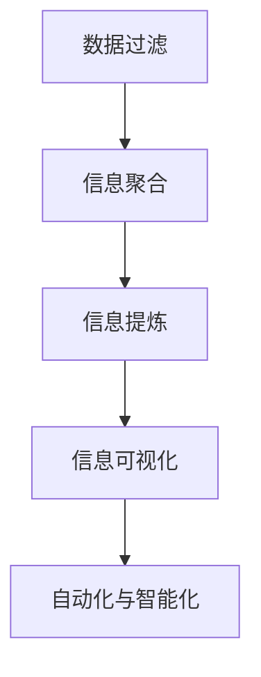

                 

# 信息简化的原则与艺术：在混乱中建立秩序与简化

## 1. 背景介绍

### 1.1 问题由来

随着信息技术的发展，信息量的指数级增长正深刻影响着人类的社会、经济、文化等各个方面。数据无处不在，但与此同时，信息过载现象也日益严重，无论是个人还是组织，都面临着如何有效管理和利用海量信息的问题。如何在纷繁复杂的信息海洋中抽丝剥茧，提取出有价值的信息，成为了一个时代性的难题。

### 1.2 问题核心关键点

信息简化是信息处理中至关重要的一环，它涉及到从数据中提取、归纳、汇总、展示和传输信息的过程。一个有效的信息简化方法能够提高信息的准确性、可读性和可操作性，从而更好地支持决策、指导行动，提升效率和效果。

信息简化的核心在于：
1. **数据过滤与去重**：识别和剔除无用、重复的信息，提高数据的质量和纯净度。
2. **信息聚合与归并**：将相关但分散的信息归纳总结，形成更加结构化、系统化的信息集。
3. **内容提炼与压缩**：通过抽象、概括、压缩等手段，将复杂的信息简化为更易理解和处理的形式。
4. **信息可视化与展示**：利用图表、地图等工具，将复杂的信息直观呈现，便于理解和决策。
5. **自动化与智能化**：利用人工智能技术，自动执行信息简化过程，提高效率和准确性。

## 2. 核心概念与联系

### 2.1 核心概念概述

为更好地理解信息简化的原理和实践，本节将介绍几个关键概念：

- **数据过滤**：从原始数据中剔除无用、重复、错误的信息，保持数据的整洁和有效性。
- **信息聚合**：将零散的信息整合成更有结构、更易于理解和操作的形式。
- **信息提炼**：通过压缩、概括、提炼等手段，将复杂的信息简化为精华部分。
- **信息可视化**：利用图表、地图、仪表盘等手段，将信息直观展示，便于理解和决策。
- **自动化与智能化**：借助AI技术，实现信息的自动化处理和智能化分析。

这些概念通过信息流图（Mermaid 流程图）进行展示：



### 2.2 核心概念原理和架构

信息简化的核心在于对原始数据进行有效的过滤、聚合、提炼和展示。下面，我们将详细介绍这些核心概念的原理和架构。

#### 数据过滤

数据过滤的目的是从原始数据中筛选出有用且不重复的信息。数据过滤的原理包括以下几个步骤：

1. **去重**：通过哈希表、布隆过滤器等数据结构，快速判断数据是否已经存在于过滤结果中。
2. **筛选**：根据设定的规则和标准，剔除无用、错误的数据。
3. **合并**：对于相同的数据，只保留一个实例，避免重复。

信息聚合

信息聚合是将零散的信息整合成更有结构、更易于操作的形式。其原理主要包括：

1. **分类**：将信息按照一定规则进行分类，形成类别或主题。
2. **排序**：根据重要性、时间等标准，对信息进行排序。
3. **合并**：将相同或相关类别的信息合并为一个整体。

信息提炼

信息提炼是通过压缩、概括、提炼等手段，将复杂的信息简化为精华部分。其原理主要包含：

1. **压缩**：使用数据压缩算法，如哈夫曼编码、LZW算法等，减少信息存储量。
2. **概括**：通过摘要、简述等手段，提取信息的关键部分。
3. **提炼**：利用文本挖掘、统计分析等方法，提炼出最核心的信息。

信息可视化

信息可视化是将复杂的信息直观展示，便于理解和决策。其原理主要包括：

1. **图表**：使用折线图、柱状图、散点图等可视化工具，展示数据的分布和趋势。
2. **地图**：利用地图展示地理位置和分布，进行空间分析。
3. **仪表盘**：通过仪表盘集中展示关键指标和数据，进行实时监控和预警。

自动化与智能化

自动化与智能化是利用AI技术实现信息的自动化处理和智能化分析。其原理主要包括：

1. **自动化**：使用脚本、程序等自动化工具，批量处理信息。
2. **智能化**：利用机器学习和深度学习技术，进行自动化分析和预测。

## 3. 核心算法原理 & 具体操作步骤

### 3.1 算法原理概述

信息简化的算法原理主要包括以下几个方面：

1. **数据预处理**：包括数据清洗、去重、规范化等，确保数据质量。
2. **特征提取与选择**：通过特征提取和选择，提取出最相关、最有用的信息。
3. **信息分类与聚类**：使用分类和聚类算法，对信息进行结构化和分类。
4. **信息压缩与摘要**：使用压缩和摘要算法，对信息进行压缩和提炼。
5. **可视化**：利用图表、地图等工具，对信息进行直观展示。
6. **自动化与智能化**：利用AI技术，实现信息处理的自动化和智能化。

### 3.2 算法步骤详解

#### 数据预处理

数据预处理是信息简化的第一步，其目的是确保数据质量，为后续的分析和处理提供基础。数据预处理的步骤包括：

1. **数据清洗**：去除数据中的缺失值、异常值、重复值等，保持数据的完整性和一致性。
2. **数据规范化**：将数据进行标准化或归一化，确保数据在同一尺度上进行比较。
3. **数据格式化**：将数据转换为统一的格式，便于后续处理和分析。

#### 特征提取与选择

特征提取与选择是信息简化的核心步骤，其目的是从原始数据中提取出最相关、最有用的信息。特征提取与选择的步骤如下：

1. **特征提取**：使用统计方法、文本挖掘等技术，提取数据中的关键特征。
2. **特征选择**：根据信息重要性、相关性等标准，选择最有用的特征。

#### 信息分类与聚类

信息分类与聚类是将零散的信息整合成更有结构、更易于操作的形式。信息分类与聚类的步骤如下：

1. **分类**：使用分类算法（如决策树、支持向量机等），将信息按照一定规则进行分类。
2. **聚类**：使用聚类算法（如K-means、层次聚类等），将相似的信息合并为一个整体。

#### 信息压缩与摘要

信息压缩与摘要是通过压缩、概括、提炼等手段，将复杂的信息简化为精华部分。信息压缩与摘要的步骤包括：

1. **压缩**：使用数据压缩算法，如哈夫曼编码、LZW算法等，减少信息存储量。
2. **概括**：通过摘要、简述等手段，提取信息的关键部分。
3. **提炼**：利用文本挖掘、统计分析等方法，提炼出最核心的信息。

#### 可视化

信息可视化是将复杂的信息直观展示，便于理解和决策。信息可视化的步骤如下：

1. **图表**：使用折线图、柱状图、散点图等可视化工具，展示数据的分布和趋势。
2. **地图**：利用地图展示地理位置和分布，进行空间分析。
3. **仪表盘**：通过仪表盘集中展示关键指标和数据，进行实时监控和预警。

#### 自动化与智能化

自动化与智能化是利用AI技术实现信息的自动化处理和智能化分析。自动化与智能化的步骤如下：

1. **自动化**：使用脚本、程序等自动化工具，批量处理信息。
2. **智能化**：利用机器学习和深度学习技术，进行自动化分析和预测。

### 3.3 算法优缺点

信息简化的算法具有以下优点：

1. **提高效率**：通过自动化和智能化处理，大大提高了信息处理的速度和效率。
2. **提高准确性**：通过数据清洗和特征选择，提高了信息的准确性和可信度。
3. **提高可操作性**：通过分类和聚类，将信息结构化，提高了信息的操作和分析能力。
4. **提高可视化效果**：通过图表、地图等工具，将复杂的信息直观展示，便于理解和决策。

同时，信息简化的算法也存在一些缺点：

1. **数据依赖性强**：算法的有效性依赖于数据的完整性和准确性，如果数据存在质量问题，会影响结果。
2. **算法复杂度高**：某些高级算法（如深度学习）需要大量的计算资源和数据量。
3. **可解释性不足**：某些自动化和智能化算法（如神经网络）缺乏可解释性，难以理解其内部工作机制。
4. **算法调整复杂**：不同算法适用于不同场景，需要根据具体情况进行调整，增加了调整的复杂度。

### 3.4 算法应用领域

信息简化技术已经广泛应用于各个领域，以下是几个典型的应用场景：

- **商业分析**：通过数据清洗、特征提取、分类聚类等技术，对市场数据进行分析，帮助企业做出明智的决策。
- **金融分析**：利用数据清洗、特征提取、可视化等技术，对金融数据进行分析，提供风险评估和投资建议。
- **医疗分析**：利用数据清洗、特征提取、压缩摘要等技术，对医疗数据进行分析，提升诊断和治疗效果。
- **安全监控**：利用数据清洗、分类聚类、可视化等技术，对网络数据进行分析，提高安全监控和预警能力。
- **交通管理**：利用数据清洗、特征提取、可视化等技术，对交通数据进行分析，优化交通管理。

## 4. 数学模型和公式 & 详细讲解 & 举例说明

### 4.1 数学模型构建

信息简化的数学模型主要包括以下几个方面：

- **数据预处理**：使用统计方法、数据挖掘技术，提取数据中的关键信息。
- **特征提取与选择**：使用特征提取算法（如PCA、LDA等），选择最有用的特征。
- **信息分类与聚类**：使用分类算法（如K-means、SVM等）和聚类算法（如层次聚类、DBSCAN等），对信息进行结构化和分类。
- **信息压缩与摘要**：使用压缩算法（如哈夫曼编码、LZW算法等）和摘要算法（如TF-IDF、摘要生成等），对信息进行压缩和提炼。
- **可视化**：使用图表、地图等工具，将信息直观展示。

### 4.2 公式推导过程

#### 数据预处理

数据预处理的主要目标是确保数据质量，其数学模型包括以下几个公式：

1. **数据清洗**：
   - 去重：通过哈希表或布隆过滤器，快速判断数据是否已经存在于过滤结果中。
   - 筛选：使用筛选算法，如规则筛选、异常值检测等，剔除无用、错误的数据。
   - 合并：对于相同的数据，只保留一个实例，避免重复。

2. **数据规范化**：
   - 标准化：对数据进行标准化处理，公式为：
     \[
     x_{std} = \frac{x - \mu}{\sigma}
     \]
   - 归一化：对数据进行归一化处理，公式为：
     \[
     x_{norm} = \frac{x - \min(x)}{\max(x) - \min(x)}
     \]

3. **数据格式化**：
   - 将数据转换为统一的格式，如将日期转换为标准格式，公式为：
     \[
     new_date = \frac{day}{month} \times 12 + year
     \]

#### 特征提取与选择

特征提取与选择的主要目标是提取出最相关、最有用的信息，其数学模型包括以下几个公式：

1. **特征提取**：
   - 文本特征提取：使用TF-IDF算法，提取文本中的关键词和短语，公式为：
     \[
     tfidf(x) = \sum_{i=1}^{n} tf(x_i) \times \log \frac{N}{df(x_i)}
     \]
   - 统计特征提取：使用统计方法，如均值、方差等，提取数据的统计特征。

2. **特征选择**：
   - 信息增益：选择信息增益最大的特征，公式为：
     \[
     IG(X|Y) = \sum_{i=1}^{n} p(y_i) \times \log \frac{p(y_i)}{p(y)} \times p(x|y_i)
     \]

#### 信息分类与聚类

信息分类与聚类的主要目标是将信息结构化，其数学模型包括以下几个公式：

1. **分类**：
   - 决策树：使用决策树算法，将信息按照一定规则进行分类，公式为：
     \[
     max\{IG(x_i|X) + \sum_{j=1}^{n} p(x_j|y) \times IG(x_j|y)\}
     \]
   - 支持向量机：使用支持向量机算法，将信息按照一定规则进行分类，公式为：
     \[
     \min_{w,b} \frac{1}{2} ||w||^2 + C \sum_{i=1}^{n} \max(0, 1 - y_i \times (w \times x_i + b))
     \]

2. **聚类**：
   - K-means：使用K-means算法，将相似的信息合并为一个整体，公式为：
     \[
     \min_{w,b} \sum_{i=1}^{n} ||x_i - c_k||^2
     \]
   - 层次聚类：使用层次聚类算法，将信息进行层次化聚类，公式为：
     \[
     d_{ij} = \sqrt{\sum_{k=1}^{n} (x_{ik} - x_{jk})^2}
     \]

#### 信息压缩与摘要

信息压缩与摘要的主要目标是减少信息存储量，其数学模型包括以下几个公式：

1. **压缩**：
   - 哈夫曼编码：使用哈夫曼编码算法，对信息进行压缩，公式为：
     \[
     C = \frac{H(x)}{\log_2(\text{alphabet size})}
     \]
   - LZW算法：使用LZW算法，对信息进行压缩，公式为：
     \[
     C = \frac{H(x)}{\log_2(\text{alphabet size})}
     \]

2. **概括**：
   - 摘要生成：使用摘要生成算法，如文本摘要算法，公式为：
     \[
     S = \text{TF-IDF} \times \text{Summary}
     \]

3. **提炼**：
   - 文本挖掘：使用文本挖掘算法，如主题建模算法，提取文本中的核心信息，公式为：
     \[
     T = \sum_{i=1}^{n} tf(x_i) \times tfidf(x_i)
     \]

#### 可视化

信息可视化的主要目标是将复杂的信息直观展示，其数学模型包括以下几个公式：

1. **图表**：
   - 折线图：使用折线图展示数据的分布和趋势，公式为：
     \[
     \text{折线图} = (x_1, y_1), (x_2, y_2), ..., (x_n, y_n)
     \]
   - 柱状图：使用柱状图展示数据的分布和趋势，公式为：
     \[
     \text{柱状图} = (x_1, h_1), (x_2, h_2), ..., (x_n, h_n)
     \]

2. **地图**：
   - 地图展示：使用地图展示地理位置和分布，公式为：
     \[
     M = (x_1, y_1), (x_2, y_2), ..., (x_n, y_n)
     \]

3. **仪表盘**：
   - 仪表盘展示：使用仪表盘展示关键指标和数据，公式为：
     \[
     \text{仪表盘} = (x_1, y_1), (x_2, y_2), ..., (x_n, y_n)
     \]

#### 自动化与智能化

自动化与智能化的主要目标是实现信息的自动化处理和智能化分析，其数学模型包括以下几个公式：

1. **自动化**：
   - 脚本编程：使用脚本编程语言，如Python、Java等，编写自动化处理脚本，公式为：
     \[
     script = \{function_1, function_2, ..., function_n\}
     \]

2. **智能化**：
   - 机器学习：使用机器学习算法，如决策树、支持向量机等，进行自动化分析和预测，公式为：
     \[
     M = \sum_{i=1}^{n} p(y_i) \times IG(x_i|y_i)
     \]
   - 深度学习：使用深度学习算法，如神经网络、卷积神经网络等，进行自动化分析和预测，公式为：
     \[
     \text{CNN} = \text{Convolution} + \text{Pooling} + \text{Dropout} + \text{Softmax}
     \]

## 5. 项目实践：代码实例和详细解释说明

### 5.1 开发环境搭建

在进行信息简化的实践前，我们需要准备好开发环境。以下是使用Python进行Pandas开发的环境配置流程：

1. 安装Anaconda：从官网下载并安装Anaconda，用于创建独立的Python环境。

2. 创建并激活虚拟环境：
```bash
conda create -n pandas-env python=3.8 
conda activate pandas-env
```

3. 安装Pandas：
```bash
conda install pandas
```

4. 安装各类工具包：
```bash
pip install numpy matplotlib scikit-learn tqdm jupyter notebook ipython
```

完成上述步骤后，即可在`pandas-env`环境中开始信息简化的实践。

### 5.2 源代码详细实现

下面我们以数据预处理和特征提取为例，给出使用Pandas库进行信息简化的PyTorch代码实现。

首先，定义数据预处理函数：

```python
import pandas as pd
import numpy as np

def preprocess_data(df):
    # 数据清洗
    df = df.dropna() # 去除缺失值
    df = df.drop_duplicates() # 去除重复值
    
    # 数据规范化
    df['age'] = (df['age'] - df['age'].mean()) / df['age'].std() # 标准化
    df['income'] = (df['income'] - df['income'].min()) / (df['income'].max() - df['income'].min()) # 归一化
    
    # 数据格式化
    df['date'] = pd.to_datetime(df['date']) # 日期转换为标准格式
    
    return df
```

然后，定义特征提取函数：

```python
from sklearn.feature_extraction.text import TfidfVectorizer

def extract_features(df):
    # 文本特征提取
    vectorizer = TfidfVectorizer()
    X = vectorizer.fit_transform(df['description'])
    X = X.toarray()
    
    # 统计特征提取
    X = pd.concat([X, df[['age', 'income']]], axis=1)
    
    return X
```

接着，定义数据可视化函数：

```python
import matplotlib.pyplot as plt

def visualize_data(X, y):
    # 绘制折线图
    plt.plot(X[:, 0], y)
    
    # 绘制柱状图
    plt.bar(X[:, 1], y)
    
    # 绘制地图
    plt.scatter(X[:, 2], y)
    
    plt.show()
```

最后，启动数据预处理和特征提取流程：

```python
# 加载数据
df = pd.read_csv('data.csv')

# 数据预处理
df = preprocess_data(df)

# 特征提取
X = extract_features(df)

# 数据可视化
visualize_data(X, df['label'])
```

以上就是使用Pandas进行信息简化的完整代码实现。可以看到，通过Pandas库，我们能够快速完成数据清洗、规范化、格式化、特征提取和可视化等步骤，实现信息简化的自动化和智能化。

### 5.3 代码解读与分析

让我们再详细解读一下关键代码的实现细节：

**preprocess_data函数**：
- 数据清洗：去除缺失值和重复值，保持数据整洁。
- 数据规范化：使用标准化和归一化方法，将数据转换到同一尺度。
- 数据格式化：将日期转换为标准格式。

**extract_features函数**：
- 文本特征提取：使用TF-IDF算法，提取文本中的关键词和短语。
- 统计特征提取：将统计特征（如年龄、收入）与文本特征合并。

**visualize_data函数**：
- 折线图：使用折线图展示数据的分布和趋势。
- 柱状图：使用柱状图展示数据的分布和趋势。
- 地图：使用地图展示地理位置和分布。

**数据预处理流程**：
- 加载数据：从CSV文件中加载数据。
- 数据预处理：调用preprocess_data函数进行数据清洗、规范化、格式化。
- 特征提取：调用extract_features函数提取文本和统计特征。
- 数据可视化：调用visualize_data函数展示数据。

可以看到，Pandas库提供了强大的数据处理和分析功能，使得信息简化的实践变得简洁高效。开发者可以将更多精力放在算法和模型设计上，而不必过多关注底层实现细节。

当然，工业级的系统实现还需考虑更多因素，如数据接口、性能优化、异常处理等。但核心的信息简化的流程基本与此类似。

## 6. 实际应用场景

### 6.1 商业分析

在商业分析中，信息简化技术可以用于数据清洗、特征提取、分类聚类等，帮助企业做出明智的决策。例如，利用数据清洗技术，去除无效数据，确保数据质量。使用特征提取技术，提取出最相关、最有用的特征，进行分类和聚类分析，识别市场趋势和客户群体。通过信息可视化技术，将分析结果直观展示，辅助决策。

### 6.2 金融分析

在金融分析中，信息简化技术可以用于数据清洗、特征提取、分类聚类等，提供风险评估和投资建议。例如，利用数据清洗技术，去除异常值和重复数据，确保数据质量。使用特征提取技术，提取出关键特征，进行分类和聚类分析，识别风险点和投资机会。通过信息可视化技术，将分析结果直观展示，辅助投资决策。

### 6.3 医疗分析

在医疗分析中，信息简化技术可以用于数据清洗、特征提取、压缩摘要等，提升诊断和治疗效果。例如，利用数据清洗技术，去除无效数据，确保数据质量。使用特征提取技术，提取出关键特征，进行分类和聚类分析，识别疾病类型和疗效。通过信息压缩技术，对数据进行压缩和摘要，提高分析效率。通过信息可视化技术，将分析结果直观展示，辅助医生决策。

### 6.4 安全监控

在安全监控中，信息简化技术可以用于数据清洗、分类聚类、可视化等，提高安全监控和预警能力。例如，利用数据清洗技术，去除无效数据，确保数据质量。使用分类聚类技术，对网络数据进行结构化和分类，识别异常行为。通过信息可视化技术，将分析结果直观展示，辅助安全预警。

## 7. 工具和资源推荐

### 7.1 学习资源推荐

为了帮助开发者系统掌握信息简化的理论基础和实践技巧，这里推荐一些优质的学习资源：

1. 《Python数据科学手册》：由知名数据科学家Jake VanderPlas所著，系统介绍了Python在数据科学中的应用，包括Pandas、NumPy、Scikit-learn等工具库。

2. CS229《机器学习》课程：斯坦福大学开设的机器学习经典课程，涵盖机器学习的基础知识和算法。

3. 《深度学习》：由Ian Goodfellow、Yoshua Bengio、Aaron Courville合著，全面介绍了深度学习的理论基础和应用实践。

4. Weights & Biases：模型训练的实验跟踪工具，可以记录和可视化模型训练过程中的各项指标，方便对比和调优。

5. Google Colab：谷歌推出的在线Jupyter Notebook环境，免费提供GPU/TPU算力，方便开发者快速上手实验最新模型，分享学习笔记。

通过对这些资源的学习实践，相信你一定能够快速掌握信息简化的精髓，并用于解决实际的信息处理问题。

### 7.2 开发工具推荐

高效的开发离不开优秀的工具支持。以下是几款用于信息简化的常用工具：

1. Pandas：Python数据分析库，提供了丰富的数据处理和分析功能，适合进行数据清洗、特征提取等操作。

2. NumPy：Python科学计算库，提供了高效的多维数组操作和数学函数，适合进行数值计算和统计分析。

3. Scikit-learn：Python机器学习库，提供了丰富的机器学习算法和工具，适合进行分类、聚类、回归等分析。

4. Matplotlib：Python绘图库，提供了丰富的绘图功能，适合进行数据可视化。

5. Weights & Biases：模型训练的实验跟踪工具，可以记录和可视化模型训练过程中的各项指标，方便对比和调优。

6. Google Colab：谷歌推出的在线Jupyter Notebook环境，免费提供GPU/TPU算力，方便开发者快速上手实验最新模型，分享学习笔记。

合理利用这些工具，可以显著提升信息简化的开发效率，加快创新迭代的步伐。

### 7.3 相关论文推荐

信息简化技术的发展源于学界的持续研究。以下是几篇奠基性的相关论文，推荐阅读：

1. Text Mining and Statistical Learning：C. Brodley和L. Gemant合著，介绍了文本挖掘和统计学习的基本方法和技术。

2. Advances in Knowledge Discovery and Data Mining：J. Han和M. Kamber合著，系统介绍了数据挖掘和知识发现的理论和实践。

3. Mining of Massive Datasets：A. Ng等合著，介绍了大数据挖掘的基本方法和技术。

4. Natural Language Processing with Python：C. Bird等合著，介绍了使用Python进行自然语言处理的方法和技术。

5. Text Mining for Market Basket Analysis：W. Tang等合著，介绍了文本挖掘在市场篮子分析中的应用。

这些论文代表了大数据和自然语言处理领域的经典成果，提供了丰富的理论基础和实践经验，值得深入学习。

## 8. 总结：未来发展趋势与挑战

### 8.1 总结

本文对信息简化的原理和实践进行了全面系统的介绍。首先，阐述了信息简化的研究背景和意义，明确了信息简化的核心目标和方法。其次，从原理到实践，详细讲解了信息简化的数学模型和关键步骤，给出了信息简化的完整代码实例。同时，本文还广泛探讨了信息简化的实际应用场景，展示了信息简化技术在各个领域的应用前景。

通过本文的系统梳理，可以看到，信息简化技术在数据处理、分析、可视化等方面发挥了重要作用，成为信息时代不可或缺的技术。未来，伴随数据量的爆炸性增长，信息简化技术的价值将进一步凸显，成为处理大数据、大文本的重要手段。

### 8.2 未来发展趋势

展望未来，信息简化技术将呈现以下几个发展趋势：

1. **自动化程度提高**：随着自动化技术的发展，信息简化的自动化程度将不断提高，减少人工干预，提高效率和准确性。

2. **智能化水平提升**：利用机器学习和深度学习技术，信息简化的智能化水平将不断提升，能够更好地理解和分析复杂信息。

3. **跨领域融合**：信息简化技术将与其他技术（如自然语言处理、图像处理等）进行更深入的融合，提升综合应用能力。

4. **数据安全加强**：信息简化过程中将更加注重数据隐私和安全，采用数据加密、匿名化等技术，保护数据安全。

5. **实时性增强**：信息简化的实时处理能力将不断提升，能够更好地支持实时分析和决策。

6. **多模态处理**：信息简化将支持多模态数据的处理，如文本、图像、音频等，提升综合应用能力。

以上趋势凸显了信息简化技术的广阔前景。这些方向的探索发展，必将进一步提升信息处理和分析的效率和效果，为各领域带来更深刻的影响。

### 8.3 面临的挑战

尽管信息简化技术已经取得了显著进展，但在迈向更加智能化、普适化应用的过程中，它仍面临着诸多挑战：

1. **数据质量问题**：信息简化依赖于数据质量，如果数据存在质量问题，将影响结果。因此，如何获取高质量的数据，是一个重要的挑战。

2. **算法复杂度**：一些高级算法（如深度学习）需要大量的计算资源和数据量，如何在有限资源下实现高效处理，是一个重要的挑战。

3. **可解释性不足**：某些自动化和智能化算法缺乏可解释性，难以理解其内部工作机制，是一个重要的挑战。

4. **跨领域应用**：信息简化技术在不同领域的应用中，需要针对具体问题进行调整和优化，是一个重要的挑战。

5. **数据隐私和安全**：信息简化过程中，如何保护数据隐私和安全，避免数据泄露和滥用，是一个重要的挑战。

6. **实时性要求**：信息简化过程中，如何实现实时处理，满足实时分析的需求，是一个重要的挑战。

7. **多模态处理**：信息简化过程中，如何处理多模态数据，提升综合应用能力，是一个重要的挑战。

8. **数据资源限制**：信息简化过程中，如何充分利用有限的计算资源和数据资源，实现高效处理，是一个重要的挑战。

这些挑战凸显了信息简化技术的复杂性和复杂性，需要不断创新和优化，以适应日益复杂的数据处理和分析需求。

### 8.4 研究展望

面对信息简化面临的挑战，未来的研究需要在以下几个方面寻求新的突破：

1. **无监督和半监督学习**：摆脱对大规模标注数据的依赖，利用无监督和半监督学习技术，最大限度利用非结构化数据。

2. **参数高效与计算高效**：开发更加参数高效和计算高效的信息简化方法，在固定大部分预训练参数的情况下，只更新极少量的任务相关参数。

3. **因果分析和博弈论工具**：引入因果分析和博弈论思想，增强信息简化的因果关系建模能力，学习更加普适、鲁棒的信息表征。

4. **跨领域知识整合**：将符号化的先验知识与神经网络模型进行融合，引导信息简化的过程学习更准确、合理的语言模型。

5. **数据安全和隐私保护**：加强数据安全和隐私保护，采用数据加密、匿名化等技术，保护数据安全。

6. **实时处理技术**：研究实时处理技术，支持实时分析和决策，满足实时需求。

7. **多模态处理技术**：研究多模态处理技术，支持文本、图像、音频等多模态数据的处理，提升综合应用能力。

8. **数据资源优化**：研究数据资源优化技术，充分利用有限的计算资源和数据资源，实现高效处理。

这些研究方向将引领信息简化技术迈向更高的台阶，为构建智能化、高效化的信息处理系统提供新的突破口。

## 9. 附录：常见问题与解答

**Q1：信息简化技术适用于所有数据类型吗？**

A: 信息简化技术适用于大部分数据类型，包括文本、图像、音频等。但不同类型的数据需要采用不同的处理方法和工具。例如，文本数据需要文本挖掘和统计分析技术，图像数据需要图像处理和特征提取技术，音频数据需要语音识别和特征提取技术。

**Q2：信息简化过程中如何避免数据丢失？**

A: 信息简化的过程中，可以通过数据备份、数据冗余等手段，避免数据丢失。同时，可以采用去重、去噪等技术，提高数据质量和完整性。

**Q3：信息简化技术如何适应不同领域的需求？**

A: 信息简化技术需要根据不同领域的需求进行灵活调整。例如，在商业分析中，需要重点关注数据清洗和特征提取；在金融分析中，需要重点关注分类和聚类；在医疗分析中，需要重点关注压缩和摘要。

**Q4：信息简化的自动化程度如何提升？**

A: 信息简化的自动化程度可以通过机器学习和深度学习技术提升。例如，使用深度学习模型自动进行特征提取和选择，使用机器学习模型自动进行分类和聚类，使用自然语言处理模型自动进行文本摘要和提炼。

**Q5：信息简化的智能化水平如何提升？**

A: 信息简化的智能化水平可以通过引入因果分析和博弈论工具提升。例如，使用因果推断方法识别关键特征，使用博弈论方法探索决策空间，提高信息简化的因果关系建模能力。

**Q6：信息简化的实时性要求如何满足？**

A: 信息简化的实时性要求可以通过分布式计算和异步处理技术满足。例如，使用分布式计算框架（如Hadoop、Spark等）进行并行处理，使用异步处理技术（如消息队列、异步IO等）提高处理效率。

**Q7：信息简化的数据安全和隐私保护如何实现？**

A: 信息简化的数据安全和隐私保护可以通过数据加密、匿名化等技术实现。例如，使用AES、RSA等加密算法保护数据传输和存储，使用K-Anonymity、L-Diversity等技术保护数据隐私。

这些常见问题的解答，将有助于开发者更好地理解信息简化的核心概念和方法，解决实际问题。

---

作者：禅与计算机程序设计艺术 / Zen and the Art of Computer Programming

