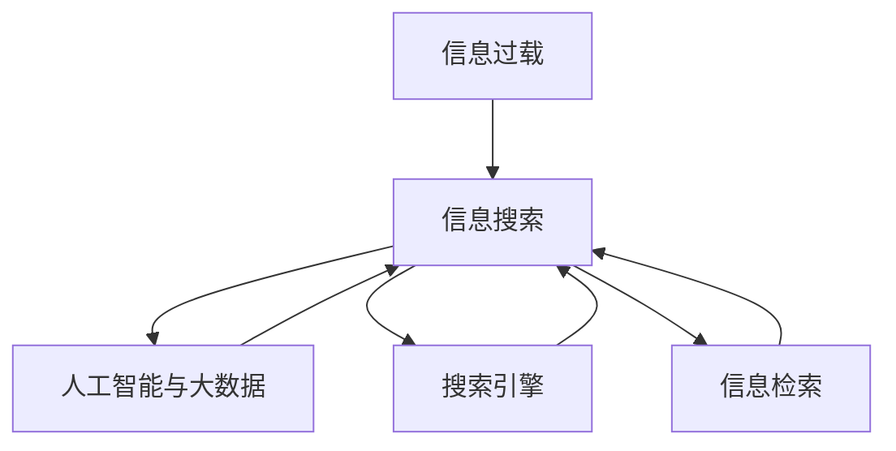
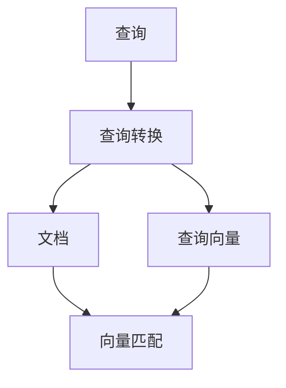

                 

# 信息过载与信息搜索策略与指南：在庞大的信息海洋中找到所需信息

> 关键词：信息过载,信息搜索策略,人工智能,大数据,搜索引擎,信息检索,自然语言处理(NLP)

## 1. 背景介绍

### 1.1 问题由来
在数字化时代，人类面临的是前所未有的信息过载现象。互联网上每天产生的海量数据如潮水般涌来，极大地拓宽了人类的知识边界，但同时也带来了如何有效搜索和筛选信息的巨大挑战。面对爆炸性的信息量，如何从中快速、准确地获取所需信息，成为了我们亟需解决的问题。

### 1.2 问题核心关键点
- 信息过载：随着数字化和互联网的迅猛发展，人们每天接触的信息量呈爆炸式增长。如何在如此庞大的信息海洋中找到真正有价值的内容，成为了当前信息管理的关键。
- 信息搜索：有效的信息搜索策略是解决信息过载问题的关键。搜索策略应涵盖从问题定义到结果筛选的各个环节。
- 人工智能与大数据：人工智能和大数据技术可以提升信息检索的效率和准确性。机器学习、自然语言处理(NLP)等技术为信息搜索提供了强有力的支持。
- 搜索引擎：搜索引擎是互联网时代最重要的信息获取工具之一，对于信息搜索的效果至关重要。
- 信息检索：信息检索不仅仅是简单的关键词匹配，更是理解用户查询意图，并从语义上匹配结果的过程。
- 信息管理：信息管理不仅包括对信息的检索，还涉及信息的存储、组织、共享与保护。

## 2. 核心概念与联系

### 2.1 核心概念概述

为更好地理解信息搜索策略，本节将介绍几个密切相关的核心概念：

- 信息过载：由于信息量的激增，人们接收到的信息远超其处理能力，导致信息质量下降，甚至出现误导性信息。
- 信息搜索：指通过特定方式，从大量信息中快速找到目标信息的获取过程。
- 人工智能与大数据：利用人工智能和大数据技术，提升信息搜索的自动化和智能化水平。
- 搜索引擎：如Google、Bing等，是互联网上最重要的信息获取工具，通过算法和索引技术实现高效的信息检索。
- 信息检索：通过查询和索引技术，从信息库中检索相关信息的过程，主要涉及自然语言处理和机器学习技术。
- 信息管理：包括信息的存储、组织、共享与保护，需要借助数据库、数据仓库等技术实现。

这些概念之间的逻辑关系可以通过以下Mermaid流程图来展示：



这个流程图展示了信息搜索的核心概念及其之间的关系：

1. 信息过载导致需要高效的信息搜索策略。
2. 人工智能和大数据技术可以提升信息检索的效率和准确性。
3. 搜索引擎是信息搜索的重要工具。
4. 信息检索是信息搜索的核心技术。

这些概念共同构成了信息搜索的基础框架，使得信息检索变得更加高效和智能化。通过理解这些核心概念，我们可以更好地把握信息搜索的原理和优化方向。

## 3. 核心算法原理 & 具体操作步骤
### 3.1 算法原理概述

基于信息搜索的大语言模型方法，本质上是一种利用自然语言处理(NLP)和机器学习技术的高级信息检索方式。其核心思想是：将用户查询转化为机器可理解的形式，通过匹配信息库中的文档，找到最相关的内容。

形式化地，假设信息库中的文档集合为 $D=\{d_i\}_{i=1}^N$，其中 $d_i$ 为文档文本。设用户查询为 $q$，查询结果为 $r=\{d_i\}_{i=1}^K$，其中 $K$ 为检索出的相关文档数量。则信息检索的目标是找到最符合查询意图的相关文档集。

具体而言，算法过程如下：

1. 收集和预处理：从大规模数据集中收集文档，并进行预处理（如分词、去除停用词等）。
2. 索引构建：将处理后的文档转化为关键词-文档的倒排索引，便于快速检索。
3. 查询转换：将用户查询转化为机器可理解的形式，如向量表示或概率分布。
4. 文档匹配：通过匹配查询向量与文档向量，计算文档的相关度得分。
5. 结果排序：根据文档的相关度得分，对检索结果进行排序，返回前 $K$ 个文档。

### 3.2 算法步骤详解

基于信息搜索的大语言模型方法，通常包括以下几个关键步骤：

**Step 1: 数据收集与预处理**
- 收集包含目标信息的文档数据集，划分为训练集和测试集。
- 对文档进行分词、去除停用词、词干提取等预处理，生成词汇表和逆索引。

**Step 2: 文档向量表示**
- 将文档转换为向量形式，便于计算机处理。常用的方法包括TF-IDF、Word2Vec、BERT等。
- 对于查询，也进行相同处理，生成查询向量。

**Step 3: 向量匹配与排序**
- 计算查询向量与文档向量的余弦相似度，作为文档的相关度得分。
- 对相关度得分进行排序，返回排名靠前的 $K$ 个文档。

**Step 4: 评估与优化**
- 在测试集上评估模型性能，使用精确率、召回率、F1分数等指标衡量。
- 根据评估结果，调整模型参数，优化查询转换和向量匹配算法。

### 3.3 算法优缺点

基于信息搜索的大语言模型方法具有以下优点：
1. 高效性：通过算法优化，可以在大规模数据集中快速找到相关信息。
2. 准确性：通过向量匹配和排序，能够精确匹配用户查询。
3. 可扩展性：适用于大规模信息检索，可以处理海量数据。
4. 可解释性：查询转换和向量匹配过程可解释性强，便于调试和优化。

同时，该方法也存在一定的局限性：
1. 依赖标注数据：需要构建大规模的文本索引，需要大量的标注数据进行训练。
2. 高维度问题：文档和查询的向量表示通常是高维的，计算复杂度高。
3. 语言多样性：对于多语言文档，需要进行多语言分词和语义理解，增加了技术难度。
4. 用户意图理解：对于复杂查询，需要更好的意图理解算法，才能保证检索结果的相关性。

尽管存在这些局限性，但就目前而言，基于信息搜索的检索方法仍是大规模信息检索的主流技术。未来相关研究的重点在于如何进一步降低检索对标注数据的依赖，提高检索效率，增强多语言支持，以及提升意图理解的准确性。

### 3.4 算法应用领域

基于信息搜索的大语言模型方法，已经在多个领域得到广泛应用，例如：

- 互联网搜索：如Google、Bing等搜索引擎，基于信息搜索技术进行关键词匹配，返回相关搜索结果。
- 数字图书馆：如Google Scholar、Microsoft Academic等，从学术论文数据库中检索相关文献。
- 智能问答系统：如IBM Watson、Amazon Alexa等，通过自然语言处理和信息检索技术，回答用户问题。
- 电子商务：如Amazon、淘宝等，基于用户查询检索相关商品信息，提供个性化推荐。
- 社交网络：如Twitter、Facebook等，通过关键词检索，发现和聚合相关内容。

除了上述这些经典应用外，信息搜索技术还被创新性地应用到更多场景中，如舆情监测、文档相似度检测、知识图谱构建等，为信息检索提供了新的解决方案。随着信息检索技术的不断进步，相信信息搜索将在更广阔的应用领域发挥重要作用。

## 4. 数学模型和公式 & 详细讲解 & 举例说明
### 4.1 数学模型构建

本节将使用数学语言对基于信息搜索的检索过程进行更加严格的刻画。

假设信息库中的文档为 $D=\{d_i\}_{i=1}^N$，查询为 $q$，相关文档为 $r=\{d_i\}_{i=1}^K$。设 $d_i$ 的词袋表示为 $\vec{d_i}=(\vec{t_1},\vec{t_2},...,\vec{t_m})$，其中 $\vec{t_j}$ 为第 $j$ 个词汇的词频向量。

查询 $q$ 的词袋表示为 $\vec{q}=(\vec{q_1},\vec{q_2},...,\vec{q_n})$。查询向量和文档向量表示为 $\vec{q}$ 和 $\vec{d_i}$，查询转换和文档向量化模型为 $\vec{q}=f(q)$ 和 $\vec{d_i}=g(d_i)$，向量匹配模型为 $\text{similarity}(\vec{q},\vec{d_i})=\langle \vec{q},\vec{d_i} \rangle$。则信息检索的目标是找到最符合查询意图的 $K$ 个文档。

### 4.2 公式推导过程

以下我们以TF-IDF（Term Frequency-Inverse Document Frequency）模型为例，推导其基本公式及其向量匹配过程。

设 $d_i$ 的词频为 $f_i$，文档集合中 $d_i$ 的个数为 $n_i$，总文档数为 $N$。则词袋表示 $\vec{d_i}=(f_{i_1},f_{i_2},...,f_{i_m})$，其中 $f_{i_j}$ 为 $d_i$ 中第 $j$ 个词汇的词频。

查询 $q$ 的词袋表示为 $\vec{q}=(q_1,q_2,...,q_n)$，其中 $q_j$ 为查询中第 $j$ 个词汇的词频。则TF-IDF向量表示为 $\vec{q}=(tf_{q_1},tf_{q_2},...,tf_{q_n})$ 和 $\vec{d_i}=(\frac{f_{i_1}}{n_i},\frac{f_{i_2}}{n_i},...,\frac{f_{i_m}}{n_i})$，其中 $tf_{q_j}$ 为查询中第 $j$ 个词汇的词频乘以逆文档频率。

向量匹配模型为 $\text{similarity}(\vec{q},\vec{d_i})=\sum_{j=1}^n tf_{q_j}\cdot\frac{f_{i_j}}{n_i}$。

查询转换和文档向量化模型为 $\vec{q}=f(q)$ 和 $\vec{d_i}=g(d_i)$。具体算法流程如图：



通过上述推导，我们可以看到，信息检索的基本过程就是将用户查询转化为向量形式，与文档向量进行匹配，并根据相似度得分对文档进行排序。

### 4.3 案例分析与讲解

假设我们要对以下文本进行信息检索：

```text
查询: 中国历史
文档1: 中国五千年历史悠久
文档2: 美国历史
文档3: 埃及金字塔
```

首先，将查询和文档进行分词，构建词袋表示：

```text
查询: 中国 历史
文档1: 中国 五千年 历史 悠久
文档2: 美国 历史
文档3: 埃及 金字塔
```

然后，计算TF-IDF向量表示：

```text
查询: 1 1
文档1: 1 1 1 1
文档2: 1 0
文档3: 0 0 1
```

接着，计算向量匹配得分：

```text
文档1得分: 1*1+0*1+0*1+1*1=2
文档2得分: 1*1+0*1+0*1+0*1=1
文档3得分: 0*1+0*1+1*1+0*1=1
```

最后，对得分进行排序，返回前2个文档。

查询结果为：文档1和文档2，符合用户意图。

通过这个案例，我们可以看到，基于信息搜索的大语言模型方法能够高效、准确地检索相关信息，满足用户查询需求。

## 5. 项目实践：代码实例和详细解释说明
### 5.1 开发环境搭建

在进行信息搜索实践前，我们需要准备好开发环境。以下是使用Python进行TensorFlow开发的环境配置流程：

1. 安装Anaconda：从官网下载并安装Anaconda，用于创建独立的Python环境。

2. 创建并激活虚拟环境：
```bash
conda create -n tf-env python=3.8 
conda activate tf-env
```

3. 安装TensorFlow：根据CUDA版本，从官网获取对应的安装命令。例如：
```bash
conda install tensorflow==2.6 -c pytorch -c conda-forge
```

4. 安装各类工具包：
```bash
pip install numpy pandas scikit-learn matplotlib tqdm jupyter notebook ipython
```

完成上述步骤后，即可在`tf-env`环境中开始信息搜索实践。

### 5.2 源代码详细实现

下面我们以TF-IDF模型为例，给出使用TensorFlow进行信息检索的PyTorch代码实现。

首先，定义查询和文档的词袋表示：

```python
from sklearn.feature_extraction.text import TfidfVectorizer
from sklearn.metrics.pairwise import cosine_similarity

# 查询和文档数据
queries = ["中国历史", "美国历史", "埃及金字塔"]
docs = ["中国五千年历史悠久", "美国历史", "埃及金字塔"]

# 构建TF-IDF向量表示
vectorizer = TfidfVectorizer()
X = vectorizer.fit_transform(docs)
Y = vectorizer.transform(queries)

# 计算相似度得分
scores = cosine_similarity(Y, X)[:2]
```

然后，根据得分对文档进行排序，返回前2个文档：

```python
# 对文档进行排序
doc_scores = list(enumerate(scores[0]))
doc_scores.sort(key=lambda x: x[1], reverse=True)

# 返回相关文档
for doc_id, score in doc_scores[:2]:
    print(f"文档 {doc_id+1}: {docs[doc_id]} 相似度 {score}")
```

这就是使用TensorFlow和Scikit-Learn进行信息搜索的完整代码实现。可以看到，Python代码简洁高效，便于理解和调试。

### 5.3 代码解读与分析

让我们再详细解读一下关键代码的实现细节：

**查询和文档数据定义**：
- 使用Scikit-Learn的TfidfVectorizer对文档进行向量化，构建词袋表示。
- 使用TfidfVectorizer对查询进行向量化，得到查询向量。

**相似度得分计算**：
- 使用Scikit-Learn的cosine_similarity计算向量之间的余弦相似度。
- 返回前2个文档的相似度得分。

**结果排序与输出**：
- 将文档和相似度得分组成元组，进行排序。
- 输出排序后的文档和得分。

通过这些步骤，我们可以利用TF-IDF模型高效地检索相关文档，满足用户的查询需求。

当然，在实际应用中，还需要对查询转换和文档向量化模型进行优化，如采用更深层次的神经网络模型，提升相似度计算的精度。但核心的信息检索原理基本与此类似。

## 6. 实际应用场景
### 6.1 智能客服系统

智能客服系统通过信息搜索技术，从海量的客服记录中快速找到合适的回答，大大提升了客户咨询体验和问题解决效率。

在技术实现上，可以收集企业内部的历史客服对话记录，将问题和最佳答复构建成监督数据，在此基础上对预训练语言模型进行微调。微调后的语言模型能够自动理解用户意图，匹配最合适的答案模板进行回复。对于客户提出的新问题，还可以接入检索系统实时搜索相关内容，动态组织生成回答。

### 6.2 金融舆情监测

金融机构需要实时监测市场舆论动向，以便及时应对负面信息传播，规避金融风险。传统的人工监测方式成本高、效率低，难以应对网络时代海量信息爆发的挑战。基于信息搜索的文本分类和情感分析技术，为金融舆情监测提供了新的解决方案。

具体而言，可以收集金融领域相关的新闻、报道、评论等文本数据，并对其进行主题标注和情感标注。在此基础上对预训练语言模型进行微调，使其能够自动判断文本属于何种主题，情感倾向是正面、中性还是负面。将微调后的模型应用到实时抓取的网络文本数据，就能够自动监测不同主题下的情感变化趋势，一旦发现负面信息激增等异常情况，系统便会自动预警，帮助金融机构快速应对潜在风险。

### 6.3 个性化推荐系统

当前的推荐系统往往只依赖用户的历史行为数据进行物品推荐，无法深入理解用户的真实兴趣偏好。基于信息搜索的个性化推荐系统可以更好地挖掘用户行为背后的语义信息，从而提供更精准、多样的推荐内容。

在实践中，可以收集用户浏览、点击、评论、分享等行为数据，提取和用户交互的物品标题、描述、标签等文本内容。将文本内容作为模型输入，用户的后续行为（如是否点击、购买等）作为监督信号，在此基础上微调预训练语言模型。微调后的模型能够从文本内容中准确把握用户的兴趣点。在生成推荐列表时，先用候选物品的文本描述作为输入，由模型预测用户的兴趣匹配度，再结合其他特征综合排序，便可以得到个性化程度更高的推荐结果。

### 6.4 未来应用展望

随着信息检索技术的不断进步，基于信息搜索的检索方法将在更多领域得到应用，为传统行业带来变革性影响。

在智慧医疗领域，基于信息搜索的医疗问答、病历分析、药物研发等应用将提升医疗服务的智能化水平，辅助医生诊疗，加速新药开发进程。

在智能教育领域，信息搜索技术可应用于作业批改、学情分析、知识推荐等方面，因材施教，促进教育公平，提高教学质量。

在智慧城市治理中，信息搜索技术可应用于城市事件监测、舆情分析、应急指挥等环节，提高城市管理的自动化和智能化水平，构建更安全、高效的未来城市。

此外，在企业生产、社会治理、文娱传媒等众多领域，信息搜索技术也将不断涌现，为NLP技术带来新的突破。相信随着技术的日益成熟，信息搜索方法将成为人工智能技术的重要组成部分，推动人工智能技术在垂直行业的规模化落地。

## 7. 工具和资源推荐
### 7.1 学习资源推荐

为了帮助开发者系统掌握信息搜索的原理和实践技巧，这里推荐一些优质的学习资源：

1. 《信息检索基础与实践》系列博文：由信息检索领域的专家撰写，深入浅出地介绍了信息检索的基本概念和关键算法。

2. CS246《自然语言处理与搜索引擎》课程：斯坦福大学开设的信息检索经典课程，内容涵盖搜索引擎的构建和优化。

3. 《信息检索导论》书籍：介绍信息检索的理论基础和应用实践，适合入门和进阶学习。

4. 《自然语言处理综述》书籍：全面介绍自然语言处理的基本概念和技术，包括信息检索。

5. LSI《信息检索与数据管理》教材：覆盖信息检索的各个方面，包括理论基础、算法实现、系统设计等。

通过对这些资源的学习实践，相信你一定能够快速掌握信息搜索的精髓，并用于解决实际的信息检索问题。
### 7.2 开发工具推荐

高效的开发离不开优秀的工具支持。以下是几款用于信息搜索开发的常用工具：

1. TensorFlow：由Google主导开发的开源深度学习框架，适合进行复杂的深度学习模型训练和推理。

2. Scikit-Learn：Python科学计算库，提供简单易用的机器学习算法，适合信息检索的初步探索。

3. Apache Solr：基于Lucene的搜索引擎，支持分布式搜索和高性能索引。

4. Elasticsearch：基于Lucene的开源搜索引擎，适合大规模、高并发搜索场景。

5. Python NLTK库：自然语言处理工具库，提供丰富的NLP处理功能，便于文本预处理。

6. Flask和Django：轻量级和全功能的Web框架，便于构建搜索系统的后端服务。

合理利用这些工具，可以显著提升信息搜索任务的开发效率，加快创新迭代的步伐。

### 7.3 相关论文推荐

信息搜索技术的发展源于学界的持续研究。以下是几篇奠基性的相关论文，推荐阅读：

1. The Anatomy of a Large-Scale Information Retrieval System：介绍Google搜索引擎的技术架构和算法实现。

2. A Survey of Text Categorization and Information Retrieval Models：综述了信息检索领域的主要算法和模型，适合了解领域全貌。

3. An Overview of Information Retrieval Research over the Past Two Decades：回顾了信息检索领域的发展历程，展望未来研究方向。

4. Semantic Search Using Neural Networks：研究利用神经网络进行语义搜索的算法和模型。

5. Information Retrieval in the Age of Deep Learning：讨论了深度学习在信息检索中的应用和前景。

这些论文代表了大语言模型搜索技术的发展脉络。通过学习这些前沿成果，可以帮助研究者把握学科前进方向，激发更多的创新灵感。

## 8. 总结：未来发展趋势与挑战

### 8.1 总结

本文对基于信息搜索的语言模型方法进行了全面系统的介绍。首先阐述了信息搜索的重要性及其面临的挑战，明确了信息搜索技术在人工智能领域的关键地位。其次，从原理到实践，详细讲解了信息搜索的数学原理和关键步骤，给出了信息检索任务开发的完整代码实例。同时，本文还广泛探讨了信息搜索方法在智能客服、金融舆情、个性化推荐等多个行业领域的应用前景，展示了信息搜索范式的巨大潜力。此外，本文精选了信息搜索技术的各类学习资源，力求为读者提供全方位的技术指引。

通过本文的系统梳理，可以看到，基于信息搜索的语言模型方法正在成为人工智能技术的重要组成部分，极大地拓展了人工智能的应用边界，催生了更多的落地场景。随着信息检索技术的不断进步，基于信息搜索的检索方法将在更多领域得到应用，为人工智能技术的发展带来新的活力。

### 8.2 未来发展趋势

展望未来，信息搜索技术将呈现以下几个发展趋势：

1. 深度学习模型的应用：通过深度学习模型提升信息检索的精度和速度。神经网络结构、预训练模型等技术将被广泛应用于信息检索中。

2. 多模态信息融合：将视觉、语音、文本等多种模态的信息进行融合，提升检索系统的综合能力。

3. 自然语言处理：通过改进自然语言处理技术，提升查询转换和文档向量化过程的准确性。

4. 分布式计算：利用分布式计算技术，提升检索系统的处理能力和响应速度。

5. 增量学习：通过增量学习技术，使检索模型能够持续学习新知识，避免数据过时问题。

6. 跨语言搜索：利用跨语言检索技术，打破语言障碍，提升国际检索能力。

以上趋势凸显了信息搜索技术的广阔前景。这些方向的探索发展，必将进一步提升信息检索系统的性能和应用范围，为人工智能技术的发展带来新的活力。

### 8.3 面临的挑战

尽管信息搜索技术已经取得了瞩目成就，但在迈向更加智能化、普适化应用的过程中，它仍面临着诸多挑战：

1. 查询理解：复杂的自然语言查询，尤其是问答类查询，需要更高级的意图理解算法，才能保证检索结果的相关性。

2. 索引效率：大规模数据集的索引和查询，需要高效的算法和硬件支持，才能满足实时性需求。

3. 多语言处理：多语言文档的检索，需要考虑语言多样性和语义理解的复杂性。

4. 用户隐私保护：检索系统需要严格保护用户隐私，避免数据泄露和滥用。

5. 系统鲁棒性：面对噪声数据、恶意查询等异常情况，需要设计鲁棒性更强的检索算法。

6. 知识图谱融合：如何将知识图谱中的结构化知识与信息检索系统进行融合，提升检索系统的知识理解能力。

这些挑战凸显了信息搜索技术在实现普适化应用时所面临的困难。唯有不断优化和改进算法，提升系统性能，才能更好地满足用户的检索需求。

### 8.4 研究展望

面对信息搜索面临的种种挑战，未来的研究需要在以下几个方面寻求新的突破：

1. 深度学习与信息检索的融合：将深度学习模型与传统信息检索方法结合，提升检索系统的精度和泛化能力。

2. 多模态信息检索：利用多模态融合技术，提升检索系统的综合理解能力。

3. 跨语言检索：研究跨语言检索算法，提升国际检索的覆盖面和准确性。

4. 增量学习与迭代优化：研究增量学习技术，使检索系统能够持续学习新知识，优化检索效果。

5. 知识图谱与信息检索：研究知识图谱与信息检索的结合方法，提升检索系统的知识理解能力。

6. 用户意图理解：研究更高级的意图理解算法，提升复杂查询的检索效果。

这些研究方向的探索，必将引领信息搜索技术迈向更高的台阶，为构建高效、智能、可扩展的检索系统铺平道路。面向未来，信息搜索技术还需要与其他人工智能技术进行更深入的融合，如知识表示、因果推理、强化学习等，多路径协同发力，共同推动信息检索系统的进步。只有勇于创新、敢于突破，才能不断拓展信息检索的边界，让信息搜索技术更好地服务人类社会。

## 9. 附录：常见问题与解答

**Q1：如何提高信息检索的效率和准确性？**

A: 提高信息检索的效率和准确性可以从以下几个方面入手：
1. 优化查询转换算法：使用更高效、更准确的查询转换方法，如BERT等预训练模型，提升查询向量的表示能力。
2. 改进文档向量化模型：采用更先进的向量表示方法，如BERT向量、ELMo向量等，提升文档向量的质量。
3. 优化索引构建算法：采用更高效的索引构建算法，如Inverted Index、Shingle Index等，提升索引效率。
4. 引入深度学习技术：利用深度学习模型提升信息检索的精度，如使用Transformer模型进行文本分类和信息检索。
5. 增加数据量：收集更多高质量的训练数据，提升模型的泛化能力和精度。

**Q2：信息检索过程中如何处理多语言文档？**

A: 处理多语言文档需要以下步骤：
1. 多语言分词：使用多语言分词工具，将文档和查询进行分词，得到词汇表和逆索引。
2. 词汇映射：建立不同语言间的词汇映射关系，将查询向量和文档向量进行映射。
3. 语义理解：利用跨语言模型进行语义理解，提升多语言文档的检索效果。
4. 语言无关性检索：使用语言无关性检索算法，在多语言文档库中检索相关文档。

**Q3：如何保护用户隐私？**

A: 保护用户隐私可以从以下几个方面入手：
1. 数据匿名化：对用户数据进行匿名化处理，保护用户隐私。
2. 访问控制：对系统进行严格的访问控制，限制非授权用户的访问。
3. 数据加密：对用户数据进行加密处理，防止数据泄露。
4. 用户同意：在系统中加入用户同意机制，确保用户知情并同意数据使用。
5. 数据最小化：只收集必要的用户数据，减少数据泄露的风险。

通过这些措施，可以有效地保护用户隐私，提升信息检索系统的信任度。

**Q4：如何优化索引效率？**

A: 优化索引效率可以从以下几个方面入手：
1. 压缩索引：对索引进行压缩处理，减小存储空间和计算复杂度。
2. 分布式索引：利用分布式计算技术，提升索引构建和查询处理的效率。
3. 倒排索引优化：对倒排索引进行优化，减少查询时的计算量。
4. 索引合并：将多个索引进行合并，提升索引的覆盖率和检索效率。
5. 实时索引：使用实时索引技术，保持索引数据的时效性。

这些措施可以显著提升索引效率，提升信息检索系统的响应速度。

**Q5：信息检索系统如何应对噪声数据和恶意查询？**

A: 应对噪声数据和恶意查询可以从以下几个方面入手：
1. 数据清洗：对数据进行清洗，去除噪声数据和错误信息。
2. 异常检测：使用异常检测算法，识别和过滤恶意查询和异常数据。
3. 查询限制：对恶意查询进行限制和过滤，防止其进入系统。
4. 多重验证：引入多重验证机制，确保查询的真实性和合法性。
5. 系统监控：对系统进行实时监控，及时发现和处理异常情况。

通过这些措施，可以有效地应对噪声数据和恶意查询，提升信息检索系统的鲁棒性和安全性。

---

作者：禅与计算机程序设计艺术 / Zen and the Art of Computer Programming

