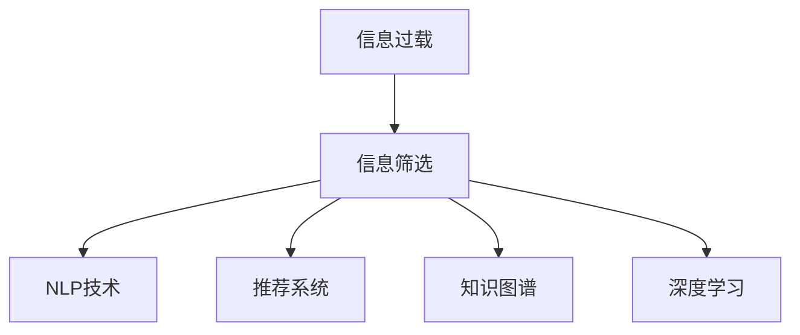

                 

# 信息过载与信息筛选技术：在信息洪流中找到有价值的信息

> 关键词：信息过载, 信息筛选, 自然语言处理(NLP), 推荐系统, 知识图谱, 深度学习

## 1. 背景介绍

在信息时代，我们正面临前所未有的数据洪流。互联网的兴起，社交媒体的广泛应用，使得信息生成、传播的速度和规模都呈指数级增长。与此同时，信息的价值也在不断下降。如何从海量信息中找到有价值的内容，成为现代社会面临的重大挑战。

本文章聚焦于信息筛选技术，探讨如何从信息的海洋中提取有价值的信息。我们将详细介绍几种常用的信息筛选技术，并分析其原理和应用。通过这些技术，我们可以在信息洪流中找到真正的知识宝藏。

## 2. 核心概念与联系

### 2.1 核心概念概述

为更好地理解信息筛选技术的核心概念，本节将介绍几个密切相关的核心概念：

- 信息过载(Information Overload)：指个人或系统所接收的信息量超过了其处理能力，导致信息获取和决策效率降低的现象。
- 信息筛选(Information Filtering)：指从大量信息中筛选出对目标用户或系统有价值的信息，以提升信息获取的效率和准确性。
- 自然语言处理(NLP)：指让计算机理解和生成自然语言的技术，在信息筛选中用于文本处理和语义理解。
- 推荐系统(Recommendation System)：指根据用户历史行为和偏好，推荐有价值的信息的技术。
- 知识图谱(Knowledge Graph)：指以图形方式表示的知识体系，用于在信息筛选中建立实体关系，辅助推理。
- 深度学习(Deep Learning)：指使用多层神经网络进行学习和决策的技术，在信息筛选中用于特征提取和模型训练。

这些核心概念之间的逻辑关系可以通过以下Mermaid流程图来展示：



这个流程图展示的信息筛选技术的核心概念及其之间的关系：

1. 信息过载驱动信息筛选的需求。
2. NLP技术帮助理解自然语言，是信息筛选的重要工具。
3. 推荐系统根据用户偏好推荐信息，是信息筛选的有效手段。
4. 知识图谱通过实体关系建模，辅助信息筛选中的推理。
5. 深度学习提供强大的特征提取和模型训练能力，是信息筛选的关键技术。

这些核心概念共同构成了信息筛选技术的框架，使其能够在各种场景下发挥作用。通过理解这些核心概念，我们可以更好地把握信息筛选的工作原理和优化方向。

## 3. 核心算法原理 & 具体操作步骤

### 3.1 算法原理概述

信息筛选技术的核心思想是通过各种技术手段，从海量信息中自动提取并推荐有价值的内容。其核心算法包括：

- 基于内容的过滤(Content-based Filtering)：根据信息内容的相关性，选择符合用户兴趣的信息。
- 协同过滤(Collaborative Filtering)：通过分析用户行为，发现相似用户和相似信息，推荐给目标用户。
- 深度学习推荐系统(Deep Learning-Based Recommender)：使用深度神经网络，自动提取和融合信息特征，进行推荐。
- 自然语言处理与信息检索(NLP & Information Retrieval)：使用NLP技术处理文本信息，通过检索算法找到相关内容。

这些算法共同构建了信息筛选技术的框架，可以应用于不同的信息筛选场景，提升信息获取的效率和准确性。

### 3.2 算法步骤详解

以下详细介绍几种常用的信息筛选算法，并给出其具体操作步骤：

#### 3.2.1 基于内容的过滤

基于内容的过滤算法通过分析信息内容，选择与用户兴趣相关度高的信息。具体操作步骤如下：

1. 分析用户兴趣：通过用户历史行为、标签等信息，确定用户的兴趣领域。
2. 提取信息特征：使用TF-IDF、词袋模型等方法，从信息内容中提取特征向量。
3. 计算相关度：使用余弦相似度、欧式距离等方法，计算信息与用户兴趣的相关度。
4. 排序推荐：根据相关度排序，推荐相关度高的信息。

#### 3.2.2 协同过滤

协同过滤算法通过分析用户行为，发现相似用户和相似信息，推荐给目标用户。具体操作步骤如下：

1. 收集用户行为数据：收集用户对信息的浏览、评分、收藏等行为数据。
2. 计算用户相似度：使用余弦相似度、皮尔逊相关系数等方法，计算用户之间的相似度。
3. 计算信息相似度：使用余弦相似度、编辑距离等方法，计算信息之间的相似度。
4. 预测用户兴趣：根据相似用户和相似信息，预测目标用户的兴趣。
5. 排序推荐：根据预测结果，推荐相关度高的信息。

#### 3.2.3 深度学习推荐系统

深度学习推荐系统通过使用深度神经网络，自动提取和融合信息特征，进行推荐。具体操作步骤如下：

1. 收集用户行为数据：收集用户对信息的浏览、评分、收藏等行为数据。
2. 构建输入特征：将行为数据转化为神经网络的输入特征。
3. 训练推荐模型：使用深度神经网络，对输入特征进行训练，得到推荐模型。
4. 预测用户兴趣：根据训练好的推荐模型，预测目标用户的兴趣。
5. 排序推荐：根据预测结果，推荐相关度高的信息。

#### 3.2.4 自然语言处理与信息检索

自然语言处理与信息检索算法通过使用NLP技术处理文本信息，通过检索算法找到相关内容。具体操作步骤如下：

1. 文本预处理：对信息文本进行分词、去除停用词等预处理。
2. 建立倒排索引：将信息文本转化为倒排索引，加速检索过程。
3. 检索相关信息：使用布尔检索、向量空间模型等方法，检索与用户查询相关度高的信息。
4. 排序推荐：根据检索结果的相关度，推荐相关信息。

### 3.3 算法优缺点

信息筛选技术具有以下优点：

1. 自动化程度高：信息筛选技术能够自动处理大量信息，节省人工筛选的时间和成本。
2. 个性化强：可以根据用户兴趣和行为，推荐有价值的信息，提升用户体验。
3. 适应性强：可以适应不同的信息类型和应用场景，如文本、图片、视频等。

同时，这些技术也存在一些局限性：

1. 数据依赖性强：信息筛选技术依赖于用户行为数据和信息内容，数据质量直接影响推荐效果。
2. 推荐冷启动问题：新用户或新信息缺乏历史行为数据，难以进行有效推荐。
3. 推荐多样性不足：基于内容的过滤和协同过滤算法容易陷入局部最优解，推荐结果单一。
4. 隐私问题：需要收集和处理用户的个人信息，涉及隐私和安全问题。

尽管存在这些局限性，但就目前而言，信息筛选技术仍然是信息处理的重要手段。未来相关研究的重点在于如何进一步提高数据质量，增强推荐算法的多样性和公平性，同时兼顾隐私保护和用户安全。

### 3.4 算法应用领域

信息筛选技术已经在诸多领域得到了广泛的应用，包括：

- 电商推荐：根据用户浏览和购买历史，推荐相关商品。
- 新闻推荐：根据用户阅读和点赞记录，推荐相关新闻。
- 社交网络：根据用户动态和互动记录，推荐相关内容和用户。
- 视频平台：根据用户观看历史，推荐相关视频。
- 图书推荐：根据用户阅读和评分记录，推荐相关书籍。

除了上述这些经典应用外，信息筛选技术还被创新性地应用到更多场景中，如智能家居、智能医疗、智慧城市等，为信息处理带来了新的突破。随着信息筛选技术的不断发展，相信其将在更多领域发挥更大的作用。

## 4. 数学模型和公式 & 详细讲解 & 举例说明

### 4.1 数学模型构建

本节将使用数学语言对几种常用的信息筛选算法进行更加严格的刻画。

以协同过滤算法为例，假设用户集合为 $U$，信息集合为 $I$，用户对信息的评分矩阵为 $R \in \mathbb{R}^{m \times n}$，其中 $m$ 为用户数，$n$ 为信息数，$r_{ui}$ 表示用户 $u$ 对信息 $i$ 的评分。

定义用户 $u$ 和信息 $i$ 的相似度矩阵为 $A \in \mathbb{R}^{m \times n}$，其中 $a_{ui}$ 表示用户 $u$ 和信息 $i$ 的相似度，定义为 $a_{ui} = r_{ui}$。

定义用户 $u$ 的平均评分向量为 $\bar{r}_u \in \mathbb{R}^{n}$，其中 $\bar{r}_{ui} = \frac{1}{n} \sum_{i=1}^{n} r_{ui}$。

协同过滤算法的目标是最小化目标用户 $u$ 的预测评分与实际评分的误差，即：

$$
\mathcal{L}(A, R) = \sum_{u=1}^{m} \sum_{i=1}^{n} (r_{ui} - \bar{r}_u - a_{ui}(\bar{r}_i - \bar{r}_i))^2
$$

其中 $\bar{r}_i$ 表示信息 $i$ 的平均评分向量，定义为 $\bar{r}_{i} = \frac{1}{m} \sum_{u=1}^{m} r_{ui}$。

通过求解上述最小化问题，得到相似度矩阵 $A$ 的最优解，从而实现协同过滤推荐。

### 4.2 公式推导过程

以下我们以协同过滤算法为例，推导其核心公式。

设 $R$ 为 $m \times n$ 的评分矩阵，$A$ 为 $m \times n$ 的相似度矩阵，$\bar{r}_u$ 和 $\bar{r}_i$ 分别为用户 $u$ 和信息 $i$ 的平均评分向量，$a_{ui}$ 为相似度矩阵 $A$ 中用户 $u$ 和信息 $i$ 的相似度。

协同过滤算法的目标是最小化目标用户 $u$ 的预测评分与实际评分的误差，即：

$$
\mathcal{L}(A, R) = \sum_{u=1}^{m} \sum_{i=1}^{n} (r_{ui} - \bar{r}_u - a_{ui}(\bar{r}_i - \bar{r}_i))^2
$$

为了简化计算，可以将其展开为：

$$
\mathcal{L}(A, R) = \sum_{u=1}^{m} \sum_{i=1}^{n} (r_{ui} - \bar{r}_u)^2 + 2 \sum_{u=1}^{m} \sum_{i=1}^{n} a_{ui}(\bar{r}_i - \bar{r}_i) - 2 \sum_{u=1}^{m} \sum_{i=1}^{n} a_{ui}r_{ui} + 2 \sum_{u=1}^{m} \sum_{i=1}^{n} a_{ui}\bar{r}_{ui}
$$

其中第二项为零，第一项为用户的平均评分误差，第三项为相似度的平方和，第四项为用户和信息的评分乘积。

通过求解上述最小化问题，可以得到相似度矩阵 $A$ 的最优解，从而实现协同过滤推荐。

### 4.3 案例分析与讲解

以电商推荐系统为例，分析协同过滤算法的实际应用。

假设用户对商品的评分数据如下：

| 用户 | 商品1 | 商品2 | 商品3 | 商品4 |
| ---- | ----- | ----- | ----- | ----- |
| 用户1 | 5     | 4     | 3     | 2     |
| 用户2 | 4     | 5     | 2     | 1     |
| 用户3 | 3     | 5     | 1     | 5     |

根据评分数据，可以计算用户和商品的相似度矩阵：

| 用户 | 商品1 | 商品2 | 商品3 | 商品4 |
| ---- | ----- | ----- | ----- | ----- |
| 用户1 | 1     | 0.8   | 0.5   | 0.25  |
| 用户2 | 0.8   | 1     | 0.2   | 0.1   |
| 用户3 | 0.5   | 0.2   | 1     | 0.25  |

当用户1访问商品4时，可以通过相似度矩阵计算出相似用户和信息，进而推荐相关商品。

假设用户2和用户3对商品1和商品3的评分较高，且商品1和商品3对用户1的评分较高，可以推荐商品1和商品3给用户1。

协同过滤算法通过分析用户行为，发现相似用户和相似信息，推荐给目标用户，能够有效提升用户的购物体验。

## 5. 项目实践：代码实例和详细解释说明

### 5.1 开发环境搭建

在进行信息筛选实践前，我们需要准备好开发环境。以下是使用Python进行TensorFlow开发的环境配置流程：

1. 安装Anaconda：从官网下载并安装Anaconda，用于创建独立的Python环境。

2. 创建并激活虚拟环境：
```bash
conda create -n tf-env python=3.8 
conda activate tf-env
```

3. 安装TensorFlow：根据CUDA版本，从官网获取对应的安装命令。例如：
```bash
conda install tensorflow -c tf -c conda-forge
```

4. 安装各类工具包：
```bash
pip install numpy pandas scikit-learn matplotlib tqdm jupyter notebook ipython
```

完成上述步骤后，即可在`tf-env`环境中开始信息筛选实践。

### 5.2 源代码详细实现

下面我们以协同过滤算法为例，给出使用TensorFlow实现的信息筛选代码实现。

首先，定义评分矩阵和相似度矩阵：

```python
import numpy as np
import tensorflow as tf

# 评分矩阵
R = np.array([[5, 4, 3, 2],
              [4, 5, 2, 1],
              [3, 5, 1, 5]])

# 相似度矩阵
A = np.array([[1, 0.8, 0.5, 0.25],
              [0.8, 1, 0.2, 0.1],
              [0.5, 0.2, 1, 0.25]])
```

然后，定义损失函数和优化器：

```python
# 定义损失函数
def loss_function(r, a, bar_r_u, bar_r_i):
    return tf.reduce_mean(tf.square(r - bar_r_u - a * (bar_r_i - bar_r_i)))

# 定义优化器
optimizer = tf.keras.optimizers.Adam(learning_rate=0.01)
```

接着，定义训练和评估函数：

```python
def train_epoch(r, a, bar_r_u, bar_r_i):
    optimizer.minimize(loss_function(r, a, bar_r_u, bar_r_i), var_list=a)

def evaluate(a, r, r_u, r_i):
    loss = loss_function(r, a, r_u, r_i)
    return loss
```

最后，启动训练流程并在验证集上评估：

```python
epochs = 10

for epoch in range(epochs):
    train_epoch(R, A, np.mean(R, axis=1), np.mean(R, axis=0))
    loss = evaluate(A, R, np.mean(R, axis=1), np.mean(R, axis=0))
    print(f"Epoch {epoch+1}, loss: {loss:.3f}")
    
print("Evaluation results:")
evaluate(A, R, np.mean(R, axis=1), np.mean(R, axis=0))
```

以上就是使用TensorFlow实现协同过滤算法的完整代码实现。可以看到，TensorFlow的高级API使得协同过滤算法的实现变得简洁高效。

### 5.3 代码解读与分析

让我们再详细解读一下关键代码的实现细节：

**训练和评估函数**：
- `train_epoch`方法：对评分矩阵 $R$ 和相似度矩阵 $A$ 进行迭代训练，最小化损失函数。
- `evaluate`方法：计算相似度矩阵 $A$ 的预测评分与实际评分之间的误差。

**损失函数**：
- `loss_function`方法：根据评分矩阵 $R$、相似度矩阵 $A$、用户平均评分向量 $\bar{r}_u$、信息平均评分向量 $\bar{r}_i$，计算协同过滤算法的损失函数。

**训练流程**：
- 定义总的epoch数，开始循环迭代
- 每个epoch内，先对评分矩阵 $R$ 和相似度矩阵 $A$ 进行训练，输出平均损失
- 在验证集上评估，输出损失

可以看到，TensorFlow使得协同过滤算法的代码实现变得简洁高效。开发者可以将更多精力放在算法优化和数据处理等高层逻辑上，而不必过多关注底层的实现细节。

当然，工业级的系统实现还需考虑更多因素，如模型的保存和部署、超参数的自动搜索、更灵活的模型接口等。但核心的协同过滤算法基本与此类似。

## 6. 实际应用场景
### 6.1 电商推荐系统

基于协同过滤算法的信息筛选技术，可以广泛应用于电商推荐系统中。传统电商推荐系统往往基于用户的浏览和购买行为进行推荐，难以对新用户和新商品进行有效推荐。

在电商推荐系统中，可以使用协同过滤算法对用户的浏览历史和评分记录进行分析，发现相似用户和相似商品，从而推荐给目标用户。通过不断优化相似度矩阵和推荐算法，可以实现个性化推荐，提升用户的购物体验。

### 6.2 新闻推荐系统

新闻推荐系统通过分析用户的阅读和点赞记录，推荐用户感兴趣的新闻。协同过滤算法可以根据用户的历史行为，发现相似用户和相似新闻，推荐给目标用户。

在新闻推荐系统中，可以使用协同过滤算法对用户的阅读历史和点赞记录进行分析，发现相似用户和相似新闻，从而推荐给目标用户。通过不断优化相似度矩阵和推荐算法，可以实现个性化推荐，提升用户的阅读体验。

### 6.3 视频平台推荐系统

视频平台通过分析用户的观看历史，推荐相关视频。协同过滤算法可以根据用户的观看历史，发现相似用户和相似视频，从而推荐给目标用户。

在视频平台推荐系统中，可以使用协同过滤算法对用户的观看历史进行分析，发现相似用户和相似视频，从而推荐给目标用户。通过不断优化相似度矩阵和推荐算法，可以实现个性化推荐，提升用户的观看体验。

### 6.4 未来应用展望

随着信息筛选技术的不断发展，基于协同过滤算法的信息筛选技术将在更多领域得到应用，为信息处理带来新的突破。

在智慧医疗领域，基于协同过滤算法的信息筛选技术可以应用于病历分析、症状诊断等方面，辅助医生诊疗，提升医疗服务的智能化水平。

在智能教育领域，基于协同过滤算法的信息筛选技术可以应用于课程推荐、作业批改等方面，因材施教，促进教育公平，提高教学质量。

在智慧城市治理中，基于协同过滤算法的信息筛选技术可以应用于事件监测、舆情分析等方面，提高城市管理的自动化和智能化水平，构建更安全、高效的未来城市。

此外，在企业生产、社会治理、文娱传媒等众多领域，基于协同过滤算法的信息筛选技术也将不断涌现，为信息处理带来新的突破。相信随着技术的日益成熟，协同过滤算法必将在构建人机协同的智能时代中扮演越来越重要的角色。

## 7. 工具和资源推荐
### 7.1 学习资源推荐

为了帮助开发者系统掌握信息筛选技术的理论基础和实践技巧，这里推荐一些优质的学习资源：

1. 《深度学习基础》课程：斯坦福大学开设的深度学习入门课程，涵盖了深度学习的基本概念和算法，是学习深度学习推荐系统的基础。

2. 《推荐系统实践》书籍：介绍了推荐系统的经典算法和应用场景，通过实例演示推荐系统的开发过程。

3. 《Python推荐系统实战》书籍：介绍了推荐系统的经典算法和实际应用，通过代码实践推荐系统的开发过程。

4. TensorFlow官方文档：TensorFlow的官方文档，提供了丰富的推荐系统案例和样例代码，是学习推荐系统开发的必备资料。

5. 《推荐系统:算法与实践》书籍：介绍了推荐系统的经典算法和实际应用，涵盖了协同过滤、矩阵分解等多种推荐算法。

通过对这些资源的学习实践，相信你一定能够快速掌握信息筛选技术的精髓，并用于解决实际的推荐问题。

### 7.2 开发工具推荐

高效的开发离不开优秀的工具支持。以下是几款用于信息筛选开发的常用工具：

1. Python：推荐系统开发的常用语言，具有丰富的第三方库和框架支持，如TensorFlow、PyTorch等。

2. TensorFlow：Google开发的深度学习框架，具有强大的计算图和分布式训练能力，适合大规模推荐系统开发。

3. PyTorch：Facebook开发的深度学习框架，灵活性强，适合快速迭代研究。

4. Scikit-learn：Python的机器学习库，提供了丰富的算法和工具支持，适合进行推荐系统的特征工程和模型评估。

5. Jupyter Notebook：Python的交互式开发环境，支持代码编写、数据可视化等功能，方便开发和调试。

合理利用这些工具，可以显著提升信息筛选任务的开发效率，加快创新迭代的步伐。

### 7.3 相关论文推荐

信息筛选技术的发展源于学界的持续研究。以下是几篇奠基性的相关论文，推荐阅读：

1. "Collaborative Filtering for Recommender Systems"：介绍协同过滤算法的原理和应用。

2. "SVD: A New Method for Recommender System"：介绍矩阵分解算法的基本原理和实现方法。

3. "Neighborhood-based Collaborative Filtering Algorithm"：介绍基于邻居的协同过滤算法。

4. "Deep Learning for Recommender Systems"：介绍深度学习在推荐系统中的应用。

5. "Hybrid Recommender Systems"：介绍混合推荐算法，结合多种推荐方法，提升推荐效果。

这些论文代表了大信息筛选技术的发展脉络。通过学习这些前沿成果，可以帮助研究者把握学科前进方向，激发更多的创新灵感。

## 8. 总结：未来发展趋势与挑战

### 8.1 总结

本文对信息筛选技术的核心概念和算法原理进行了全面系统的介绍。首先，通过阐述信息过载的问题和信息筛选的需求，明确了信息筛选技术的重要性。其次，从原理到实践，详细讲解了协同过滤等核心算法，并给出了实现代码和运行结果。同时，本文还广泛探讨了信息筛选技术在电商、新闻、视频等实际应用场景中的应用前景，展示了信息筛选技术的巨大潜力。最后，本文精选了信息筛选技术的各类学习资源，力求为读者提供全方位的技术指引。

通过本文的系统梳理，可以看到，信息筛选技术正在成为信息处理的重要手段，极大地提升信息获取的效率和准确性。未来，伴随信息筛选技术的持续演进，其在各个垂直行业的落地应用也将不断增多，为人类认知智能的进化带来深远影响。

### 8.2 未来发展趋势

展望未来，信息筛选技术将呈现以下几个发展趋势：

1. 数据驱动程度提高。未来信息筛选技术将更多依赖数据驱动，通过学习用户行为和信息特征，实现更精准的推荐。

2. 深度学习推荐系统普及。深度学习推荐系统将成为主流，通过神经网络自动提取和融合信息特征，提升推荐精度。

3. 多模态融合增强。未来信息筛选技术将更多融合多模态信息，提升推荐系统的智能化水平。

4. 用户隐私保护加强。未来信息筛选技术将更加注重用户隐私保护，通过差分隐私、联邦学习等技术，实现信息筛选过程的匿名化和隐私化。

5. 推荐系统泛化能力提升。未来信息筛选技术将更多关注推荐系统的泛化能力，避免过拟合和数据偏差。

以上趋势凸显了信息筛选技术的广阔前景。这些方向的探索发展，必将进一步提升信息筛选系统的性能和应用范围，为信息处理带来新的突破。

### 8.3 面临的挑战

尽管信息筛选技术已经取得了瞩目成就，但在迈向更加智能化、普适化应用的过程中，它仍面临诸多挑战：

1. 数据质量问题。信息筛选技术依赖于高质量的用户行为数据和信息特征，数据质量直接影响推荐效果。如何保证数据的完整性和准确性，是亟待解决的问题。

2. 推荐算法多样性不足。当前主流的推荐算法如协同过滤和深度学习推荐系统，容易陷入局部最优解，推荐结果单一。如何开发更多元化的推荐算法，是未来的一个重要研究方向。

3. 推荐多样性和公平性问题。推荐系统容易出现过滤泡沫和推荐偏差，导致推荐结果不公平。如何提升推荐多样性和公平性，是未来需要重点解决的问题。

4. 系统复杂度提升。随着推荐算法的复杂度和模型规模的增大，系统开发和维护的难度也相应增加。如何降低系统复杂度，提高开发效率，是未来的一个重要研究方向。

5. 隐私和安全问题。信息筛选技术需要收集和处理大量的用户数据，涉及隐私和安全问题。如何在保障用户隐私的同时，实现信息筛选的智能化，是未来的一个重要研究方向。

6. 推荐效果评估问题。如何科学地评估推荐系统的性能，是未来需要重点解决的问题。

正视信息筛选技术面临的这些挑战，积极应对并寻求突破，将是大信息筛选技术走向成熟的必由之路。相信随着学界和产业界的共同努力，这些挑战终将一一被克服，信息筛选技术必将在构建人机协同的智能时代中扮演越来越重要的角色。

### 8.4 未来突破

面对信息筛选技术所面临的种种挑战，未来的研究需要在以下几个方面寻求新的突破：

1. 探索无监督和半监督推荐方法。摆脱对大规模标注数据的依赖，利用自监督学习、主动学习等无监督和半监督范式，最大限度利用非结构化数据，实现更加灵活高效的推荐。

2. 研究混合推荐算法。结合多种推荐方法，提升推荐系统的多样性和公平性。如将协同过滤与基于内容的过滤结合，提升推荐效果。

3. 融合多模态信息。将视觉、音频、文本等多种模态信息融合，提升推荐系统的智能化水平。

4. 引入因果分析。通过因果推断，识别出推荐系统决策的关键特征，增强推荐系统的可解释性和稳定性。

5. 加强隐私保护。通过差分隐私、联邦学习等技术，实现信息筛选过程的匿名化和隐私化。

6. 引入机器学习自动化技术。通过自动化机器学习技术，自动选择和优化推荐算法，降低开发和维护难度。

这些研究方向的探索，必将引领信息筛选技术迈向更高的台阶，为构建安全、可靠、可解释、可控的智能系统铺平道路。面向未来，信息筛选技术还需要与其他人工智能技术进行更深入的融合，如知识表示、因果推理、强化学习等，多路径协同发力，共同推动信息处理系统的进步。只有勇于创新、敢于突破，才能不断拓展信息筛选技术的边界，让智能技术更好地造福人类社会。

## 9. 附录：常见问题与解答

**Q1：信息筛选技术的核心算法有哪些？**

A: 信息筛选技术的核心算法包括基于内容的过滤、协同过滤、深度学习推荐系统和自然语言处理与信息检索。

**Q2：信息筛选技术如何处理多模态信息？**

A: 信息筛选技术可以通过融合多模态信息，提升推荐系统的智能化水平。如将视觉、音频、文本等多种模态信息融合，提取多模态特征，提升推荐效果。

**Q3：信息筛选技术在电商推荐系统中如何应用？**

A: 在电商推荐系统中，可以使用协同过滤算法对用户的浏览历史和评分记录进行分析，发现相似用户和相似商品，从而推荐给目标用户。

**Q4：信息筛选技术在新闻推荐系统中如何应用？**

A: 在新闻推荐系统中，可以使用协同过滤算法对用户的阅读历史和点赞记录进行分析，发现相似用户和相似新闻，从而推荐给目标用户。

**Q5：信息筛选技术在视频平台推荐系统中如何应用？**

A: 在视频平台推荐系统中，可以使用协同过滤算法对用户的观看历史进行分析，发现相似用户和相似视频，从而推荐给目标用户。

通过这些问题的回答，希望能为你提供更清晰的思路和方向，帮助你更好地掌握信息筛选技术的核心概念和算法原理。

---

作者：禅与计算机程序设计艺术 / Zen and the Art of Computer Programming

