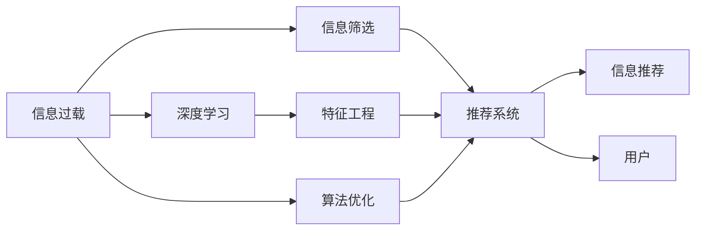

                 

# 信息过载与信息筛选策略与实践：在信息洪流中找到有价值的信息

> 关键词：信息过载, 信息筛选, 推荐系统, 自然语言处理(NLP), 数据挖掘, 深度学习, 特征工程, 算法优化

## 1. 背景介绍

在当今数字时代，信息量呈指数级增长。根据IBM的预测，到2025年，全球产生的数据量将达到175ZB（1ZB = 10^21字节）。这不仅仅是一个巨大的数据海洋，更是一个庞杂的信息洪流。面对如此浩瀚的信息，如何从中筛选出有价值的内容，成为我们亟需解决的问题。本文将探讨信息过载现象、其对人类和机器的影响，以及如何利用现代技术手段，进行有效的信息筛选和推荐。

### 1.1 信息过载的现状和影响

信息过载（Information Overload）是指信息量超过个人或系统的处理能力，导致信息接收和处理困难的现象。在信息洪流中，每个人每天接触的信息量极大，尽管这些信息中有许多是有价值的，但也有大量无关的、错误的信息。信息过载对个体认知、决策能力以及组织的效率都造成了负面影响。

- **认知负担**：过多信息会占用人的认知资源，导致注意力分散，难以专注于重要内容。
- **决策困难**：过量的信息增加了决策难度，使得人们难以快速做出有效的决策。
- **效率下降**：在信息过载环境中，查找和处理信息的时间和精力大大增加，降低了整体工作效率。

这些问题不仅影响个人工作，也对企业决策和市场运营构成挑战。因此，有效的信息筛选和推荐技术显得尤为重要。

### 1.2 信息筛选与推荐的应用场景

信息筛选和推荐技术被广泛应用于各种场景，例如：

- **搜索引擎**：帮助用户从海量的网页中筛选出最相关的信息。
- **社交媒体**：为用户推荐感兴趣的内容，提升用户体验。
- **电子商务**：推荐商品给用户，提升销售转化率。
- **内容平台**：如新闻网站、视频网站等，为用户推荐新闻、视频等。
- **智能客服**：帮助客服快速定位用户问题，提供准确解答。

这些应用场景中，信息筛选和推荐技术都是提升用户体验和运营效率的关键。

## 2. 核心概念与联系

为了更好地理解信息筛选和推荐技术，我们首先介绍几个核心概念及其相互关系：

### 2.1 核心概念概述

- **信息过载**：信息量超出个体或系统的处理能力，导致信息接收和处理困难的现象。
- **信息筛选**：从大量信息中选取最相关、最有价值的信息，提升信息的质量和可用性。
- **信息推荐**：利用算法为用户推荐最可能感兴趣的信息，帮助用户快速发现新内容。
- **推荐系统**：基于用户历史行为和偏好，通过算法为用户推荐物品、内容或服务的技术。
- **深度学习**：一种强大的机器学习技术，擅长处理非线性、高维数据，广泛应用于推荐系统中。
- **特征工程**：在数据挖掘中，通过选取、构造和变换特征，提升模型的预测能力。
- **算法优化**：通过模型调优、参数调整等手段，提高推荐系统的效率和准确性。

### 2.2 核心概念联系的 Mermaid 流程图



## 3. 核心算法原理 & 具体操作步骤

### 3.1 算法原理概述

信息筛选和推荐技术主要基于数据挖掘、机器学习和信息检索等方法，通过分析和理解用户行为和需求，为用户推荐最相关、最有价值的信息。其核心在于将用户特征、物品特征和用户行为数据进行综合分析，构建预测模型，进行信息推荐。

推荐系统一般分为四个主要步骤：

1. **用户建模**：提取用户的历史行为、偏好、属性等特征。
2. **物品建模**：提取物品的属性、标签、特征等。
3. **交互数据建模**：利用用户与物品的交互数据，构建用户-物品的相似性度量。
4. **推荐计算**：根据用户特征、物品特征和相似性度量，预测用户对物品的兴趣，进行推荐。

### 3.2 算法步骤详解

以协同过滤（Collaborative Filtering）算法为例，其步骤详解如下：

**Step 1: 用户建模**

用户建模包括提取用户的基本信息、历史行为、社交关系等特征。例如，可以记录用户的浏览历史、购买记录、评分数据等。

```python
# 用户历史行为数据
user_id, item_id, interaction_time = user_browsing_data['user_id'], user_browsing_data['item_id'], user_browsing_data['interaction_time']
```

**Step 2: 物品建模**

物品建模包括提取物品的属性、标签、内容等信息。例如，可以记录电影的导演、演员、类型等信息。

```python
# 电影属性数据
item_id, item_title, item_genre, item_rating = movie_data['item_id'], movie_data['item_title'], movie_data['item_genre'], movie_data['item_rating']
```

**Step 3: 交互数据建模**

交互数据建模利用用户与物品的交互数据，构建用户-物品的相似性度量。常用的方法有用户-物品评分矩阵、用户-物品交互矩阵等。

```python
# 用户-物品评分矩阵
user_item_matrix = pd.DataFrame(user_browsing_data.groupby(['user_id', 'item_id']).size().unstack().fillna(0))
```

**Step 4: 推荐计算**

推荐计算根据用户特征、物品特征和相似性度量，预测用户对物品的兴趣，进行推荐。常用的推荐算法包括协同过滤、基于内容的推荐、深度学习推荐等。

```python
# 协同过滤推荐
from surprise import Reader, Dataset, KNNBasic
from surprise.model_selection import train_test_split

reader = Reader(rating_scale=(1, 5))
data = Dataset.load_from_df(user_item_matrix, reader)
trainset, testset = train_test_split(data, test_size=0.2, random_state=42)
algo = KNNBasic(sim_options={'name': 'pearson_baseline'})
algo.fit(trainset)
test_pred = algo.test(testset)
```

### 3.3 算法优缺点

协同过滤算法具有以下优点：

- **用户个性化**：通过分析用户历史行为，个性化推荐物品。
- **灵活性高**：可以处理任意类型的数据，适用范围广。
- **无需物品特征**：仅需用户-物品交互数据即可进行推荐。

同时，协同过滤也存在一些缺点：

- **冷启动问题**：新用户或物品无法提供有效信息，难以推荐。
- **数据稀疏性**：用户-物品交互数据稀疏，可能导致推荐准确性下降。
- **可扩展性差**：在大规模数据集上，协同过滤的计算复杂度高。

### 3.4 算法应用领域

协同过滤算法广泛应用于电子商务、社交媒体、新闻推荐等领域。例如：

- **电子商务**：亚马逊、淘宝等电商平台使用协同过滤算法推荐商品，提升用户体验和销售转化率。
- **社交媒体**：Facebook、Instagram等社交平台利用协同过滤算法为用户推荐朋友、文章等。
- **新闻网站**：如雅虎、谷歌新闻等，利用协同过滤算法推荐新闻文章，提升用户停留时间和点击率。

## 4. 数学模型和公式 & 详细讲解 & 举例说明

### 4.1 数学模型构建

推荐系统的核心数学模型可以表示为：

$$
y_{ui} = \sum_{j=1}^n \alpha_j x_{uj} \cdot r_{ij} + b
$$

其中：

- $y_{ui}$：用户 $u$ 对物品 $i$ 的评分。
- $x_{uj}$：用户 $u$ 的特征向量。
- $r_{ij}$：物品 $i$ 的特征向量。
- $\alpha_j$：特征 $j$ 对评分的贡献系数。
- $b$：截距项。

### 4.2 公式推导过程

以协同过滤算法中的余弦相似度（Cosine Similarity）为例，其公式推导如下：

设用户 $u$ 和物品 $i$ 的向量表示分别为 $\mathbf{u}$ 和 $\mathbf{i}$，则余弦相似度为：

$$
\cos(\theta) = \frac{\mathbf{u} \cdot \mathbf{i}}{\|\mathbf{u}\| \cdot \|\mathbf{i}\|}
$$

在推荐系统中，$\mathbf{u}$ 和 $\mathbf{i}$ 通常为经过归一化处理的特征向量。

### 4.3 案例分析与讲解

**案例一：电影推荐系统**

假设我们有一个电影推荐系统，已知用户对不同电影的评分数据，以及每部电影的导演、演员、类型等属性。可以利用协同过滤算法为用户推荐电影。

**案例二：新闻推荐系统**

在新闻推荐系统中，用户对不同新闻文章的阅读时间、点击次数等行为数据，以及每篇文章的标题、作者、发布时间等属性。可以利用协同过滤算法为用户推荐新闻。

## 5. 项目实践：代码实例和详细解释说明

### 5.1 开发环境搭建

进行推荐系统开发，需要以下环境：

- Python 3.x
- Pandas、NumPy、Scikit-learn 等数据处理库
- TensorFlow、PyTorch 等深度学习框架
- Jupyter Notebook 或 JupyterLab 进行交互式编程

### 5.2 源代码详细实现

**用户-物品评分矩阵**

```python
import pandas as pd
import numpy as np

# 用户历史行为数据
user_browsing_data = pd.read_csv('user_browsing_data.csv')

# 构建用户-物品评分矩阵
user_item_matrix = pd.DataFrame(user_browsing_data.groupby(['user_id', 'item_id']).size().unstack().fillna(0))
```

**协同过滤推荐**

```python
from surprise import Reader, Dataset, KNNBasic
from surprise.model_selection import train_test_split

# 构建数据集
reader = Reader(rating_scale=(1, 5))
data = Dataset.load_from_df(user_item_matrix, reader)
trainset, testset = train_test_split(data, test_size=0.2, random_state=42)

# 协同过滤推荐
algo = KNNBasic(sim_options={'name': 'pearson_baseline'})
algo.fit(trainset)
test_pred = algo.test(testset)
```

### 5.3 代码解读与分析

**代码解读**

- **用户建模**：通过 `user_browsing_data` 数据集，提取用户的历史行为数据，构建用户-物品评分矩阵 `user_item_matrix`。
- **协同过滤推荐**：利用协同过滤算法 `KNNBasic`，从训练集 `trainset` 中拟合模型，并在测试集 `testset` 上进行预测，生成推荐结果 `test_pred`。

**代码分析**

- **数据预处理**：用户历史行为数据需要进行数据清洗、归一化等预处理，以提升模型的预测能力。
- **算法选择**：根据具体应用场景选择合适的推荐算法，如协同过滤、基于内容的推荐等。
- **模型训练**：利用训练集数据拟合推荐模型，并在测试集上评估模型效果。

### 5.4 运行结果展示

```python
from surprise.model_selection import accuracy
from surprise import Dataset

# 评估推荐结果的准确率
test_pred = algo.test(testset)
accuracy(surprise.reader(), test_pred, verbose=True)
```

## 6. 实际应用场景

### 6.1 智能客服系统

智能客服系统利用推荐技术，为用户推荐可能感兴趣的问题和解决方案，提升客服体验和问题解决效率。例如，可以根据用户的历史查询记录，推荐最相关的解决方案，减少客服的工作量。

### 6.2 金融理财

金融理财平台利用推荐技术，为用户推荐理财产品、投资策略等，提升用户体验和收益。例如，可以根据用户的风险偏好、历史投资记录，推荐适合的理财方案。

### 6.3 医疗健康

医疗健康平台利用推荐技术，为患者推荐最适合的治疗方案、药品等，提升诊疗效率和效果。例如，可以根据患者的病史、病情，推荐最适合的治疗方案。

### 6.4 未来应用展望

未来推荐技术将进一步发展，其主要趋势包括：

- **多模态推荐**：结合文本、图像、视频等多种模态信息，提升推荐效果。
- **个性化推荐**：根据用户的行为和偏好，提供更加个性化的推荐服务。
- **实时推荐**：利用实时数据，动态更新推荐结果，提升用户体验。
- **公平推荐**：确保推荐结果的公平性和多样性，避免算法偏见。

## 7. 工具和资源推荐

### 7.1 学习资源推荐

1. **《推荐系统实战》**：本书系统介绍了推荐系统的基本原理、算法实现和优化技巧，适合深入学习。
2. **《深度学习推荐系统》**：详细介绍了深度学习在推荐系统中的应用，涵盖协同过滤、神经网络推荐等。
3. **Kaggle 竞赛平台**：通过参加推荐系统竞赛，可以积累实战经验，提升技能水平。

### 7.2 开发工具推荐

1. **TensorFlow**：开源的深度学习框架，支持多种推荐算法，易于部署和优化。
2. **PyTorch**：开源的深度学习框架，适用于复杂推荐模型的开发。
3. **Jupyter Notebook**：交互式编程环境，方便调试和展示推荐模型。

### 7.3 相关论文推荐

1. **《A Factorization Approach to Recommender Systems》**：经典的协同过滤算法论文，介绍了基于矩阵分解的推荐方法。
2. **《Neural Collaborative Filtering》**：深度学习在推荐系统中的应用，介绍了基于神经网络的推荐模型。
3. **《Recommender Systems: Challenges and Future Directions》**：总结了推荐系统面临的挑战和未来发展方向，适合深入阅读。

## 8. 总结：未来发展趋势与挑战

### 8.1 研究成果总结

信息过载和推荐技术在近年来取得了显著进展，但仍然面临诸多挑战。以下是一些主要成果和挑战：

- **协同过滤**：在推荐准确性和用户个性化方面取得了良好效果，但在冷启动和数据稀疏性方面仍需改进。
- **深度学习**：提升了推荐系统的预测能力和泛化能力，但需要大规模数据和计算资源。
- **特征工程**：通过选取和构造有效特征，提升了模型的预测能力和解释能力，但需要丰富的领域知识。

### 8.2 未来发展趋势

未来的推荐技术将朝着以下方向发展：

1. **多模态推荐**：结合文本、图像、视频等多种信息源，提升推荐效果。
2. **个性化推荐**：利用用户的多样化需求，提供更加个性化的推荐服务。
3. **实时推荐**：利用实时数据，动态更新推荐结果，提升用户体验。
4. **公平推荐**：确保推荐结果的公平性和多样性，避免算法偏见。

### 8.3 面临的挑战

尽管推荐技术取得了不少进展，但仍面临一些挑战：

1. **数据隐私**：推荐系统需要大量用户数据，如何保护用户隐私和数据安全是一个重要问题。
2. **算法偏见**：推荐算法可能存在偏见，如何设计公平、无偏的推荐模型是一个挑战。
3. **模型解释性**：推荐模型通常是黑盒模型，难以解释其内部决策过程，需要提高模型的可解释性。

### 8.4 研究展望

未来的研究需要在以下几个方面寻求突破：

1. **多模态推荐**：结合多种信息源，提升推荐效果。
2. **个性化推荐**：利用用户的多样化需求，提供更加个性化的推荐服务。
3. **实时推荐**：利用实时数据，动态更新推荐结果，提升用户体验。
4. **公平推荐**：确保推荐结果的公平性和多样性，避免算法偏见。

## 9. 附录：常见问题与解答

**Q1: 信息过载有哪些应对策略？**

A1: 应对信息过载，可以采取以下策略：
1. **信息筛选**：通过过滤、排序等手段，减少无用信息。
2. **时间管理**：合理安排时间，避免过度使用信息工具。
3. **信息管理工具**：利用信息管理工具，如RSS、邮件过滤等，管理信息流。
4. **信息素养教育**：提升信息素养，学会甄别信息的价值。

**Q2: 推荐系统的评估指标有哪些？**

A2: 推荐系统的评估指标包括：
1. **准确率**：推荐结果的准确程度。
2. **召回率**：推荐结果中与真实结果匹配的比例。
3. **覆盖率**：推荐结果中不同物品的覆盖度。
4. **多样性**：推荐结果的多样性程度。
5. **用户满意度**：用户对推荐结果的满意度。

**Q3: 如何提升推荐系统的公平性？**

A3: 提升推荐系统的公平性，可以采取以下策略：
1. **算法设计**：设计公平的推荐算法，避免算法偏见。
2. **数据采集**：采集多样化的数据，避免数据偏见。
3. **用户反馈**：利用用户反馈，动态调整推荐策略。

**Q4: 推荐系统如何利用深度学习技术？**

A4: 推荐系统可以利用深度学习技术进行：
1. **用户建模**：利用深度学习模型提取用户特征。
2. **物品建模**：利用深度学习模型提取物品特征。
3. **相似性计算**：利用深度学习模型计算用户与物品的相似度。
4. **推荐计算**：利用深度学习模型进行推荐计算。

**Q5: 推荐系统在实际应用中需要注意哪些问题？**

A5: 推荐系统在实际应用中需要注意以下问题：
1. **数据隐私**：保护用户数据隐私，避免数据泄露。
2. **模型可解释性**：提升模型可解释性，增强用户信任。
3. **系统稳定性**：确保推荐系统的稳定性和可靠性，避免崩溃。
4. **用户体验**：提升用户体验，减少用户对系统的抵触情绪。

---

作者：禅与计算机程序设计艺术 / Zen and the Art of Computer Programming

