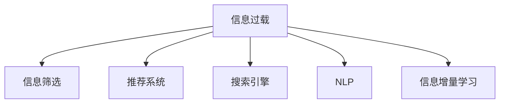

                 

# 信息过载与信息筛选策略：在信息洪流中找到有价值的信息

## 1. 背景介绍

### 1.1 问题由来
在互联网时代，信息无处不在，搜索引擎、社交媒体、新闻网站、电商平台等平台提供了海量的信息资源。然而，信息的泛滥也带来了信息过载的问题，用户面临着如何从众多信息中筛选出有价值、对自己有用的信息的挑战。信息过载不仅降低了用户的体验，还可能导致决策困难，甚至误导行为。

### 1.2 问题核心关键点
信息过载的问题主要体现在以下几个方面：

- **数据量大**：现代互联网平台每天产生大量的数据，这些数据不仅包括文本、图片、视频等，还包括用户的互动行为数据。
- **信息杂乱**：信息来源复杂，真实与虚假、有用与无用信息交织在一起，用户难以辨别。
- **信息更新快**：信息以极快的速度更新，旧信息迅速被新信息取代，用户难以跟上信息流动的步伐。
- **信息过时**：由于信息更新速度快，旧信息可能已经过时，仍被广泛传播，误导用户。

面对这些问题，用户和开发者需要采用有效的信息筛选策略，确保在海量信息中找到真正有价值、有用的信息。

## 2. 核心概念与联系

### 2.1 核心概念概述

为更好地理解信息筛选策略，本节将介绍几个关键概念：

- **信息过载（Information Overload）**：指用户面临的信息量远远超过其处理能力的状况。信息过载不仅包括信息的数量，还包括信息的质量和相关性。
- **信息筛选（Information Filtering）**：指从大量信息中筛选出对用户有价值的信息的过程。
- **推荐系统（Recommendation System）**：利用算法为用户推荐其可能感兴趣的信息，从而缓解信息过载问题。
- **搜索引擎（Search Engine）**：帮助用户快速找到相关信息的工具，如Google、Bing等。
- **自然语言处理（NLP）**：通过计算机技术处理和分析自然语言，提升信息筛选的准确性和效率。
- **信息增量学习（Incremental Learning）**：指模型在不断接收新信息时，能够实时更新和优化，以适应用户需求的变化。

这些核心概念之间的逻辑关系可以通过以下Mermaid流程图来展示：



这个流程图展示的信息过载及其相关概念之间的联系：

1. 信息过载是问题的起点。
2. 信息筛选是缓解信息过载的有效手段。
3. 推荐系统和搜索引擎都是实现信息筛选的工具。
4. NLP技术可以提升信息筛选的准确性和效率。
5. 信息增量学习让模型能够实时更新，更好地适应用户需求变化。

## 3. 核心算法原理 & 具体操作步骤
### 3.1 算法原理概述

信息筛选策略的核心原理是通过算法模型，从大量信息中识别出对用户有价值的信息。常见的信息筛选方法包括基于内容的过滤、协同过滤、混合过滤等。

### 3.2 算法步骤详解

**Step 1: 数据预处理**

数据预处理是信息筛选的第一步。包括以下步骤：

- **数据清洗**：去除重复数据、噪音数据和无用数据，确保数据质量。
- **特征提取**：将文本、图片、视频等原始数据转化为机器可处理的数值特征。
- **数据划分**：将数据划分为训练集、验证集和测试集，用于模型训练和评估。

**Step 2: 模型训练**

选择合适的模型进行训练。以下是几个常用的信息筛选模型：

- **基于内容的过滤模型**：使用TF-IDF、词频统计等方法，计算文档与查询之间的相似度，筛选出相关文档。
- **协同过滤模型**：基于用户行为（如浏览历史、评分等），推荐与用户兴趣相符的信息。
- **混合过滤模型**：结合基于内容的过滤和协同过滤，综合考虑文档内容和用户兴趣，提升筛选效果。

**Step 3: 模型评估**

模型训练完成后，需要进行评估以确定其筛选效果。评估指标包括准确率、召回率、F1值等。

**Step 4: 模型部署**

将训练好的模型部署到实际应用中，进行实时信息筛选。

**Step 5: 模型优化**

根据用户反馈和模型表现，不断优化模型参数和策略，提升筛选效果。

### 3.3 算法优缺点

信息筛选策略具有以下优点：

- **提升信息质量**：通过算法筛选，用户能够从大量信息中快速找到有价值的信息，提高信息利用率。
- **个性化推荐**：推荐系统可以根据用户行为和兴趣，提供个性化的信息推荐，提升用户体验。
- **实时更新**：信息增量学习让模型能够实时更新，适应用户需求的变化。

同时，该方法也存在一些局限性：

- **算法复杂性**：某些算法模型复杂度高，需要大量的计算资源和时间进行训练。
- **数据依赖性**：模型的效果很大程度上取决于数据的质量和数量，获取高质量数据的成本较高。
- **冷启动问题**：新用户或新文档没有足够的历史数据，难以进行有效的筛选。
- **模型偏见**：模型的训练数据可能存在偏见，导致筛选结果不公平或存在歧视。

尽管存在这些局限性，但就目前而言，信息筛选策略仍是最主流的信息管理方法。未来相关研究的重点在于如何进一步降低算法复杂度，提高模型效果，减少数据依赖，同时兼顾公平性和可解释性等因素。

### 3.4 算法应用领域

信息筛选技术在多个领域得到了广泛应用，包括：

- **电子商务**：电商平台使用推荐系统，向用户推荐商品，提高转化率。
- **新闻媒体**：新闻网站使用搜索引擎，帮助用户快速找到相关新闻，提升阅读体验。
- **社交网络**：社交媒体使用推荐算法，向用户推荐内容，增加用户粘性。
- **金融服务**：金融平台使用推荐系统，向用户推荐投资产品，提升用户体验。
- **医疗健康**：医疗网站使用搜索引擎，向用户推荐相关医疗信息，帮助用户做出健康决策。

此外，信息筛选技术还应用于广告投放、内容聚合、智能客服等场景，为各行各业带来信息管理的新思路。随着技术的发展，信息筛选方法将在更多领域得到应用，为社会信息治理提供新的解决方案。

## 4. 数学模型和公式 & 详细讲解 & 举例说明

### 4.1 数学模型构建

信息筛选的数学模型构建包括以下几个关键部分：

- **输入数据**：原始信息数据，包括文本、图片、视频等。
- **特征提取**：将原始数据转化为数值特征，如TF-IDF、词频、图像特征等。
- **相似度计算**：计算查询与文档之间的相似度，使用余弦相似度、欧式距离等方法。
- **评分函数**：根据相似度计算结果，给文档打分，排序后返回推荐结果。

### 4.2 公式推导过程

以基于内容的过滤为例，推导文档与查询之间的相似度计算公式：

设文档$d$和查询$q$的特征向量分别为$\vec{d}$和$\vec{q}$，则它们的余弦相似度计算公式为：

$$
\text{similarity}(d,q) = \frac{\vec{d} \cdot \vec{q}}{||\vec{d}|| \times ||\vec{q}||}
$$

其中，$\cdot$表示向量点乘，$||\cdot||$表示向量范数。

在实际应用中，可以将查询转化为分布式表示，使用向量空间模型计算文档与查询之间的相似度。向量空间模型表示查询和文档为高维向量，通过计算余弦相似度得到文档的得分，排序后返回推荐结果。

### 4.3 案例分析与讲解

以下是一个简单的信息筛选案例，以推荐系统为例：

假设用户A在电商平台上浏览了一条关于手机的商品信息，电商平台使用了协同过滤算法进行推荐。算法首先分析用户A的浏览历史和购买记录，找到与他兴趣相符的文档集合。然后，使用TF-IDF算法计算这些文档与当前查询的相似度，最终根据相似度得分排序，向用户A推荐相关商品。

## 5. 项目实践：代码实例和详细解释说明
### 5.1 开发环境搭建

在进行信息筛选实践前，我们需要准备好开发环境。以下是使用Python进行PyTorch开发的环境配置流程：

1. 安装Anaconda：从官网下载并安装Anaconda，用于创建独立的Python环境。

2. 创建并激活虚拟环境：
```bash
conda create -n pytorch-env python=3.8 
conda activate pytorch-env
```

3. 安装PyTorch：根据CUDA版本，从官网获取对应的安装命令。例如：
```bash
conda install pytorch torchvision torchaudio cudatoolkit=11.1 -c pytorch -c conda-forge
```

4. 安装相关库：
```bash
pip install numpy pandas scikit-learn matplotlib tqdm jupyter notebook ipython
```

完成上述步骤后，即可在`pytorch-env`环境中开始信息筛选实践。

### 5.2 源代码详细实现

以下是一个使用TensorFlow实现基于内容的过滤的信息筛选模型的代码示例：

```python
import tensorflow as tf
from sklearn.feature_extraction.text import TfidfVectorizer
from sklearn.metrics.pairwise import cosine_similarity

# 构建训练集
train_data = ['文档1', '文档2', '文档3', '文档4', '文档5']
train_labels = [1, 0, 1, 1, 0]

# 构建特征提取器
vectorizer = TfidfVectorizer()

# 训练特征提取器
X_train = vectorizer.fit_transform(train_data)

# 构建模型
model = tf.keras.Sequential([
    tf.keras.layers.Dense(16, activation='relu'),
    tf.keras.layers.Dense(1, activation='sigmoid')
])

# 编译模型
model.compile(optimizer='adam', loss='binary_crossentropy', metrics=['accuracy'])

# 训练模型
model.fit(X_train, train_labels, epochs=10)

# 使用模型进行预测
def predict(query):
    X_query = vectorizer.transform([query])
    return model.predict(X_query)

# 测试
query = '文档6'
print(predict(query))
```

这个代码实现了一个基于内容的过滤信息筛选模型。首先，使用TF-IDF算法提取训练集中的文档特征，并使用余弦相似度计算查询与文档的相似度。然后，使用神经网络模型对相似度进行建模，最后使用训练好的模型对新查询进行预测。

### 5.3 代码解读与分析

让我们再详细解读一下关键代码的实现细节：

**train_data和train_labels**：
- 训练集数据和标签。

**TfidfVectorizer**：
- 用于将文本转化为TF-IDF特征。

**X_train**：
- 训练集特征矩阵。

**model**：
- 定义了一个简单的神经网络模型，包括两个全连接层和一个sigmoid激活函数，用于判断文档是否与查询相关。

**model.compile**：
- 编译模型，设置优化器、损失函数和评估指标。

**model.fit**：
- 使用训练集数据训练模型。

**predict**：
- 定义了一个预测函数，使用训练好的模型对新查询进行预测。

这个代码示例展示了如何使用TensorFlow实现基于内容的过滤信息筛选模型。需要注意的是，实际应用中，模型的训练和调参需要根据具体任务进行优化，以获得更好的筛选效果。

## 6. 实际应用场景
### 6.1 电子商务

在电子商务领域，信息筛选技术可以帮助电商平台向用户推荐商品，提升用户体验和销售额。用户在使用电商平台时，通常会查看商品信息、浏览商品评价、搜索相关商品等。电商平台可以使用推荐系统，根据用户行为和兴趣，实时推荐相关商品，提升用户粘性和转化率。

在技术实现上，电商平台可以使用协同过滤、基于内容的过滤、混合过滤等算法，对用户浏览历史、评分、收藏等行为数据进行分析，推荐与用户兴趣相符的商品。同时，为了提高推荐效果，电商平台还可以引入A/B测试、冷启动等策略，不断优化推荐算法。

### 6.2 新闻媒体

新闻媒体行业面临着海量的新闻信息，如何帮助用户快速找到有用的新闻成为一大挑战。基于信息筛选技术，新闻媒体可以使用搜索引擎、推荐系统等工具，提升用户阅读体验。

在实际应用中，新闻网站可以使用TF-IDF、余弦相似度等算法，对用户输入的查询进行匹配，返回相关新闻。同时，新闻网站还可以使用协同过滤算法，根据用户的历史阅读行为和兴趣，推荐相关新闻。此外，新闻网站还可以引入自然语言处理技术，提升搜索结果的准确性和相关性。

### 6.3 社交网络

社交网络平台每天都会产生大量的用户互动数据，如何帮助用户从这些数据中发现有用的信息成为一大挑战。基于信息筛选技术，社交网络可以使用推荐算法，向用户推荐有用的内容，增加用户粘性。

在实际应用中，社交网络可以使用协同过滤、基于内容的过滤等算法，对用户的历史行为数据进行分析，推荐相关内容。同时，为了提高推荐效果，社交网络还可以引入自然语言处理技术，提升推荐结果的个性化和相关性。此外，社交网络还可以引入对抗训练、冷启动等策略，提升推荐算法的鲁棒性和适应性。

### 6.4 未来应用展望

随着信息筛选技术的不断发展，未来将会在更多领域得到应用，为社会信息治理提供新的解决方案。

在智慧医疗领域，基于信息筛选技术的医疗问答系统可以提升医生的诊疗效率，帮助患者找到合适的医疗信息。

在智能教育领域，基于信息筛选技术的个性化推荐系统可以提升学生的学习效果，推荐适合学生的学习资源。

在智慧城市治理中，基于信息筛选技术的舆情分析系统可以帮助政府及时掌握舆情动态，采取相应的治理措施。

此外，在企业生产、社会治理、文娱传媒等众多领域，基于信息筛选技术的人工智能应用也将不断涌现，为社会信息化发展提供新的动力。相信随着技术的日益成熟，信息筛选方法将成为信息管理的重要范式，推动信息技术和产业的不断进步。

## 7. 工具和资源推荐
### 7.1 学习资源推荐

为了帮助开发者系统掌握信息筛选技术，这里推荐一些优质的学习资源：

1. 《信息检索》（Information Retrieval）：由Christopher D. Manning和Prabhakar Raghavan合著，系统介绍了信息检索的基本概念和算法，是信息检索领域的经典教材。

2. 《推荐系统实战》（Recommender Systems: The Textbook）：由Lakshmi Narayanan Sivakumar和Jiebo Luo合著，涵盖了推荐系统的各个方面，从原理到实践。

3. CS229《机器学习》课程：斯坦福大学开设的机器学习课程，包括信息检索和推荐系统的相关内容，具有广泛的覆盖面和深入的讲解。

4. Deep Learning for Recommender Systems：由NIPS 2016会议上多篇论文组成的集，介绍了深度学习在推荐系统中的应用。

5. KDD Cup 2018：全球顶级数据挖掘竞赛，每年吸引大量研究人员参与，涵盖推荐系统等多个领域。

通过对这些资源的学习实践，相信你一定能够快速掌握信息筛选技术的精髓，并用于解决实际的推荐问题。

### 7.2 开发工具推荐

高效的开发离不开优秀的工具支持。以下是几款用于信息筛选开发的常用工具：

1. TensorFlow：基于Python的开源深度学习框架，灵活动态的计算图，适合快速迭代研究。

2. PyTorch：基于Python的开源深度学习框架，动态计算图，适合学术研究和工业应用。

3. Scikit-learn：Python机器学习库，提供多种经典的机器学习算法，包括TF-IDF、协同过滤等。

4. Apache Spark：开源大数据处理框架，支持分布式计算，适合大规模数据处理。

5. Elasticsearch：开源搜索引擎，提供高效的文本搜索和数据索引功能。

6. Apache Hadoop：开源大数据处理框架，支持分布式存储和计算，适合大规模数据处理。

合理利用这些工具，可以显著提升信息筛选任务的开发效率，加快创新迭代的步伐。

### 7.3 相关论文推荐

信息筛选技术在多个领域得到了广泛研究，以下是几篇奠基性的相关论文，推荐阅读：

1. A Survey of Recommender Systems：由J. Koren等人合著，系统总结了推荐系统的各个方面，是推荐系统领域的经典综述。

2. The Elementwise Sparsity Model for Sparse Recommender Systems：由K. Guo等人合著，介绍了基于稀疏矩阵的推荐系统算法。

3. Recommender Systems in the Age of Neural Networks：由H. He等人合著，介绍了神经网络在推荐系统中的应用。

4. Matrix Factorization Techniques for Recommender Systems：由J. Koren等人合著，介绍了矩阵分解算法在推荐系统中的应用。

5. Deep Collaborative Filtering Using Deep Neural Networks：由A. Karp等人合著，介绍了深度神经网络在协同过滤算法中的应用。

这些论文代表了大信息筛选技术的发展脉络。通过学习这些前沿成果，可以帮助研究者把握学科前进方向，激发更多的创新灵感。

## 8. 总结：未来发展趋势与挑战

### 8.1 总结

本文对信息筛选技术的原理和操作步骤进行了全面系统的介绍。首先阐述了信息过载问题的背景和核心关键点，明确了信息筛选在缓解信息过载中的重要作用。其次，从原理到实践，详细讲解了信息筛选的数学模型和操作步骤，给出了信息筛选任务开发的完整代码实例。同时，本文还广泛探讨了信息筛选技术在多个行业领域的应用前景，展示了信息筛选范式的巨大潜力。此外，本文精选了信息筛选技术的各类学习资源，力求为读者提供全方位的技术指引。

通过本文的系统梳理，可以看到，信息筛选技术在缓解信息过载、提升信息质量、个性化推荐等方面具有重要价值，为各行各业带来了信息管理的新思路。随着信息筛选技术的不断进步，信息筛选方法必将在更多领域得到应用，为社会信息化发展提供新的动力。

### 8.2 未来发展趋势

展望未来，信息筛选技术将呈现以下几个发展趋势：

1. **个性化推荐**：随着用户数据的不断积累，个性化推荐将更加精准，能够更好地适应用户需求的变化。
2. **跨域推荐**：信息筛选技术将突破领域限制，实现跨领域推荐，提升推荐效果。
3. **多模态融合**：信息筛选技术将融合文本、图像、视频等多种模态信息，提升推荐系统的全面性和准确性。
4. **实时更新**：信息筛选技术将实现实时更新，适应用户需求的变化，提升推荐效果。
5. **深度学习应用**：深度学习技术在信息筛选中的应用将不断深化，提升推荐系统的精度和效果。
6. **联邦学习**：联邦学习将用于分布式推荐系统，保护用户隐私的同时提升推荐效果。

以上趋势凸显了信息筛选技术的广阔前景。这些方向的探索发展，必将进一步提升信息筛选系统的性能和应用范围，为社会信息化发展提供新的动力。

### 8.3 面临的挑战

尽管信息筛选技术已经取得了一定的成果，但在迈向更加智能化、普适化应用的过程中，它仍面临诸多挑战：

1. **数据质量**：信息筛选的效果很大程度上取决于数据的质量和数量，获取高质量数据的成本较高。如何降低对数据质量的依赖，提升数据质量，是亟待解决的问题。
2. **算法复杂性**：某些算法模型复杂度高，需要大量的计算资源和时间进行训练。如何降低算法复杂度，提高模型训练效率，是一个重要的研究方向。
3. **模型偏见**：信息筛选模型的训练数据可能存在偏见，导致筛选结果不公平或存在歧视。如何消除模型偏见，实现公平和透明，是重要的研究方向。
4. **鲁棒性**：信息筛选模型需要具备鲁棒性，能够应对数据变化和噪声干扰，保证推荐效果。如何提高模型的鲁棒性，是一个重要的研究方向。
5. **用户隐私**：信息筛选技术需要保护用户隐私，防止用户数据被滥用。如何保护用户隐私，实现隐私保护与推荐效果的双赢，是重要的研究方向。

这些挑战需要跨学科的研究合作，通过算法创新、模型优化、数据处理等手段，不断突破信息筛选技术的瓶颈，提升其在实际应用中的效果和价值。

### 8.4 研究展望

面向未来，信息筛选技术需要在以下几个方面寻求新的突破：

1. **深度学习**：结合深度学习技术，提升信息筛选的精度和效果。
2. **多模态融合**：融合文本、图像、视频等多种模态信息，提升推荐系统的全面性和准确性。
3. **联邦学习**：使用联邦学习技术，实现分布式推荐，保护用户隐私。
4. **知识图谱**：引入知识图谱技术，提升推荐系统的逻辑性和准确性。
5. **实时更新**：实现实时更新，适应用户需求的变化，提升推荐效果。
6. **公平性**：引入公平性约束，消除模型偏见，实现公平和透明。

这些研究方向将推动信息筛选技术不断进步，为社会信息化发展提供新的动力。通过不断优化信息筛选技术，提升其性能和应用范围，必将为社会信息化带来更大的价值。

## 9. 附录：常见问题与解答

**Q1: 信息筛选技术适用于所有领域吗？**

A: 信息筛选技术在许多领域都有广泛的应用，如电子商务、新闻媒体、社交网络、金融服务、医疗健康等。但对于一些特定领域，如医疗、法律等，需要结合领域知识进行深度定制，才能实现最佳效果。

**Q2: 信息筛选技术的算法复杂度如何？**

A: 信息筛选技术的算法复杂度因具体应用场景而异。基于内容的过滤算法相对简单，协同过滤算法复杂度较高，需要大量的计算资源和时间进行训练。混合过滤算法可以结合两者的优点，提升筛选效果。

**Q3: 信息筛选技术在冷启动问题上有什么解决方案？**

A: 冷启动问题是信息筛选技术面临的一个难题。常见的解决方案包括：
- 基于内容的过滤：利用文档特征进行推荐，不依赖用户历史数据。
- 基于模型的推荐：使用深度学习模型，通过用户兴趣和文档特征进行推荐。
- 多臂老虎机算法：使用多臂老虎机算法，选择用户可能感兴趣的内容进行推荐。

这些方法可以在冷启动场景下，提高推荐效果。

**Q4: 信息筛选技术如何保证推荐结果的公平性和透明性？**

A: 保证推荐结果的公平性和透明性是一个重要的研究方向。常见的解决方案包括：
- 消除模型偏见：在模型训练过程中，消除数据中的偏见，避免筛选结果不公平。
- 增加透明度：使用可解释性模型，提供推荐结果的解释和原因。
- 引入人工干预：通过人工干预，调整推荐结果，实现公平和透明。

这些方法可以在保证推荐效果的同时，提升模型的公平性和透明性。

---

作者：禅与计算机程序设计艺术 / Zen and the Art of Computer Programming

