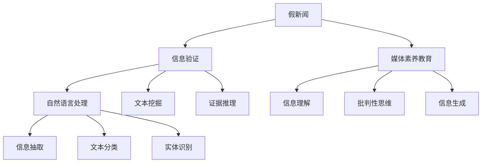

                 

# 信息验证和媒体素养教育：为假新闻和媒体操纵时代做好准备

> 关键词：假新闻,媒体素养教育,深度学习,自然语言处理,信息验证,证据推理

## 1. 背景介绍

### 1.1 问题由来

在信息爆炸的时代，海量的新闻、文章、视频源源不断地涌入人们的视野。这给人们提供了丰富的信息选择，但也带来了巨大的挑战。随着互联网技术的发展，假新闻和媒体操纵手段不断升级，公众对于信息的甄别能力显得愈发重要。

假新闻不仅误导公众，还会引发社会混乱和信任危机。特别是在网络空间，假新闻和误导信息往往披着“新闻”的外衣，难以辨识。媒体操纵则进一步加剧了这种信息的混淆，扰乱了正常的舆论环境。

因此，为了提升公众的信息素养和批判性思维，培养其在假新闻和媒体操纵时代下的信息辨识能力，信息验证和媒体素养教育成为了一个迫切且重要的课题。

### 1.2 问题核心关键点

信息验证和媒体素养教育的核心关键点在于以下几个方面：

- **信息验证（Fact-Checking）**：即对信息的真实性进行验证。信息验证不仅仅是对单个事实的真假判断，更是一种系统化的过程，涉及多方证据的收集和比对。
- **媒体素养教育（Media Literacy Education）**：提升公众对于媒体信息的理解、分析、判断能力。媒体素养教育旨在培养公众对信息源、媒体报道方法、消息来源等多方面因素的敏感性和批判性。

以上两个方面相辅相成，共同构成了信息验证和媒体素养教育的目标。信息验证提供了工具和技术，而媒体素养教育则提供了方法和理论基础，使公众能够更好地应用这些工具。

### 1.3 问题研究意义

信息验证和媒体素养教育在提升公众信息素养、促进社会健康发展方面具有重要意义：

1. **提升公众批判性思维**：增强公众对于信息的辨识能力，避免被假新闻和媒体操纵所误导。
2. **促进社会信息健康发展**：减少假新闻和媒体操纵对社会舆论的干扰，维护正常的信息传播秩序。
3. **推动技术进步和创新**：推动深度学习、自然语言处理等前沿技术的发展，提升信息验证的准确性和效率。
4. **普及基础教育**：在基础教育中加入信息验证和媒体素养教育，培养下一代的信息素养和批判性思维能力。

## 2. 核心概念与联系

### 2.1 核心概念概述

为更好地理解信息验证和媒体素养教育，本节将介绍几个密切相关的核心概念：

- **假新闻（Fake News）**：指故意捏造、歪曲或夸大事实，以误导公众为目的的新闻报道。假新闻通常通过社交媒体等渠道迅速传播，对社会和政治造成重大影响。
- **信息验证（Fact-Checking）**：通过收集多方证据对信息的真实性进行验证。信息验证通常涉及自然语言处理（NLP）、文本挖掘和证据推理等多个技术领域。
- **媒体素养教育（Media Literacy Education）**：旨在提升公众对于媒体信息的理解、分析和批判能力。包括对信息源的识别、媒体报道方法的理解、消息来源的验证等多个方面。
- **证据推理（Evidence-Based Reasoning）**：一种基于证据的推理方式，通过收集、分析和整合证据来得出结论。证据推理广泛应用于法律、医学、科技等领域，是信息验证的核心技术之一。

这些核心概念之间的逻辑关系可以通过以下Mermaid流程图来展示：



这个流程图展示了大语言模型在信息验证和媒体素养教育中的作用和流程：

1. 假新闻需要通过信息验证进行判断，而信息验证又依赖于自然语言处理、文本挖掘和证据推理等技术。
2. 信息验证的结果用于辅助媒体素养教育，提升公众对假新闻的识别能力。
3. 媒体素养教育又包括信息理解、批判性思维和信息生成等多个方面。

这些概念共同构成了信息验证和媒体素养教育的理论基础和实践框架，使得公众能够在面对假新闻和媒体操纵时，具备更好的信息辨识和应对能力。

## 3. 核心算法原理 & 具体操作步骤

### 3.1 算法原理概述

信息验证和媒体素养教育的核心算法原理基于深度学习和自然语言处理（NLP）技术。深度学习模型的训练和推理过程，提供了强大的数据分析和模式识别能力，能够对文本数据进行有效处理，辅助进行信息的真实性验证。

信息验证的过程可以分为以下几个步骤：

1. **数据收集**：收集相关新闻、文章、社交媒体帖子等文本数据。
2. **文本预处理**：对文本进行清洗、分词、去除停用词等预处理操作。
3. **特征提取**：使用词向量、TF-IDF等方法对文本进行特征提取。
4. **模型训练**：训练深度学习模型，如BERT、GPT等，对文本进行分类或生成。
5. **结果验证**：使用证据推理等方法，对模型预测结果进行进一步验证。

### 3.2 算法步骤详解

以下以BERT模型为例，详细讲解信息验证的各个步骤：

**Step 1: 数据收集**

- 使用爬虫工具从新闻网站、社交媒体平台等渠道收集相关文本数据。
- 确保数据的多样性和代表性，覆盖不同的主题和观点。

**Step 2: 文本预处理**

- 对收集到的文本进行清洗，去除HTML标签、特殊字符等噪声。
- 使用NLP工具包（如NLTK、spaCy）进行分词、去除停用词等预处理操作。
- 将文本转化为模型可接受的格式。

**Step 3: 特征提取**

- 使用预训练的BERT模型进行词向量提取，将文本转化为向量表示。
- 计算文本的TF-IDF值，提取关键特征。
- 对文本进行向量拼接、归一化等操作，生成最终的特征向量。

**Step 4: 模型训练**

- 使用训练数据集对BERT模型进行微调，优化其对文本的分类或生成能力。
- 选择合适的优化器（如Adam、SGD等）和损失函数（如交叉熵、负对数似然等）。
- 设置合适的学习率、批大小等超参数，进行模型训练。

**Step 5: 结果验证**

- 使用证据推理方法，对模型预测结果进行验证。如通过收集多方证据，对比分析模型的输出和真实情况，评估模型的准确性。
- 对模型输出进行逻辑推理，判断其合理性和可靠性。
- 若模型预测结果与事实不符，进行进一步的调查和核实，确保信息的真实性。

### 3.3 算法优缺点

信息验证和媒体素养教育具有以下优点：

1. **高效性**：深度学习模型能够在短时间内处理大量文本数据，识别出其中的假新闻和误导信息。
2. **准确性**：深度学习模型通过学习大量数据，具备较强的泛化能力，能够在不同领域进行应用。
3. **可扩展性**：深度学习模型可以通过迁移学习、微调等技术，适应新的数据和任务。

同时，该算法也存在一些局限性：

1. **数据依赖性强**：模型的训练和验证需要大量高质量的标注数据，数据收集和标注成本较高。
2. **模型鲁棒性不足**：深度学习模型可能受到噪声数据的影响，存在误判的风险。
3. **解释性不足**：深度学习模型作为“黑盒”系统，难以解释其内部决策过程，难以进行解释和审查。
4. **实时性较差**：深度学习模型推理速度较慢，难以实时处理和验证大量信息。

尽管存在这些局限性，但就目前而言，基于深度学习的信息验证和媒体素养教育方法仍是最主流和有效的手段。未来相关研究的重点在于如何进一步降低数据依赖，提高模型的鲁棒性和实时性，同时兼顾可解释性。

### 3.4 算法应用领域

信息验证和媒体素养教育在多个领域得到了广泛应用，如新闻业、政治、法律等。以下是几个典型的应用场景：

- **新闻业**：新闻机构使用信息验证工具对新闻报道进行核实，避免发布假新闻。
- **政治**：政客和政策分析者通过媒体素养教育，提升对媒体报道的辨识能力，避免被误导。
- **法律**：律师和法官使用信息验证工具，核实证据的真实性，提高案件处理的准确性。
- **教育**：学校和教育机构通过媒体素养教育，培养学生的批判性思维和信息素养。
- **公共健康**：医疗和公共健康机构使用信息验证工具，核实健康信息的准确性，避免误导公众。

## 4. 数学模型和公式 & 详细讲解 & 举例说明

### 4.1 数学模型构建

信息验证和媒体素养教育的核心数学模型基于证据推理（Evidence-Based Reasoning, EBR）和深度学习模型。

EBR的核心思想是通过收集、分析和整合证据来得出结论。深度学习模型则提供了强大的数据分析和模式识别能力，能够对文本数据进行有效处理。

### 4.2 公式推导过程

假设输入文本为 $X$，深度学习模型为 $M$，预测结果为 $Y$。则信息验证的过程可以表示为：

$$
\hat{Y} = M(X)
$$

其中 $\hat{Y}$ 为模型预测结果。

证据推理的过程可以表示为：

$$
\text{证据推理} = \{ (E_1, E_2, ..., E_n) | E_i \in \text{证据集} \}
$$

即通过收集 $n$ 个证据 $E_i$，验证预测结果 $\hat{Y}$ 的合理性和准确性。

### 4.3 案例分析与讲解

以BERT模型为例，进行信息验证和媒体素养教育的具体应用。

假设输入文本为新闻报道 $X$，深度学习模型为BERT模型。模型的训练和验证过程如下：

1. **数据收集**：从新闻网站收集相关报道，如政治新闻、科技新闻等。
2. **文本预处理**：使用NLP工具包对文本进行清洗、分词、去除停用词等预处理操作。
3. **特征提取**：使用BERT模型进行词向量提取，计算文本的TF-IDF值，提取关键特征。
4. **模型训练**：使用训练数据集对BERT模型进行微调，优化其对文本的分类或生成能力。
5. **结果验证**：收集多方证据，如专家评论、新闻报道、社交媒体反馈等，验证模型的输出。

以下为一个具体的示例：

假设输入文本为以下新闻报道：

```
据最新消息，某科技公司宣布其最新产品将在下个月发布。
```

模型通过BERT模型对其进行处理，得到向量表示：

```
[0.2, 0.3, 0.5, 0.0, 0.1, 0.2, ...]
```

模型预测结果为产品发布，但通过收集多方证据，如专家评论、新闻报道、社交媒体反馈等，发现新闻报道中存在夸大事实的情况。因此，最终判断该新闻报道为假新闻。

## 5. 项目实践：代码实例和详细解释说明

### 5.1 开发环境搭建

在进行信息验证和媒体素养教育实践前，我们需要准备好开发环境。以下是使用Python进行BERT开发的环境配置流程：

1. 安装Anaconda：从官网下载并安装Anaconda，用于创建独立的Python环境。

2. 创建并激活虚拟环境：
```bash
conda create -n bert-env python=3.8 
conda activate bert-env
```

3. 安装PyTorch：根据CUDA版本，从官网获取对应的安装命令。例如：
```bash
conda install pytorch torchvision torchaudio cudatoolkit=11.1 -c pytorch -c conda-forge
```

4. 安装Transformers库：
```bash
pip install transformers
```

5. 安装各类工具包：
```bash
pip install numpy pandas scikit-learn matplotlib tqdm jupyter notebook ipython
```

完成上述步骤后，即可在`bert-env`环境中开始信息验证和媒体素养教育实践。

### 5.2 源代码详细实现

这里我们以BERT模型进行信息验证为例，给出使用Transformers库的Python代码实现。

首先，定义数据处理函数：

```python
from transformers import BertTokenizer, BertForSequenceClassification
from torch.utils.data import Dataset
import torch

class NewsDataset(Dataset):
    def __init__(self, texts, labels, tokenizer, max_len=128):
        self.texts = texts
        self.labels = labels
        self.tokenizer = tokenizer
        self.max_len = max_len
        
    def __len__(self):
        return len(self.texts)
    
    def __getitem__(self, item):
        text = self.texts[item]
        label = self.labels[item]
        
        encoding = self.tokenizer(text, return_tensors='pt', max_length=self.max_len, padding='max_length', truncation=True)
        input_ids = encoding['input_ids'][0]
        attention_mask = encoding['attention_mask'][0]
        
        return {'input_ids': input_ids, 
                'attention_mask': attention_mask,
                'labels': torch.tensor(label, dtype=torch.long)}
```

然后，定义模型和优化器：

```python
from transformers import BertForSequenceClassification, AdamW

model = BertForSequenceClassification.from_pretrained('bert-base-uncased', num_labels=2)

optimizer = AdamW(model.parameters(), lr=2e-5)
```

接着，定义训练和评估函数：

```python
from torch.utils.data import DataLoader
from tqdm import tqdm
from sklearn.metrics import accuracy_score, precision_score, recall_score, f1_score

device = torch.device('cuda') if torch.cuda.is_available() else torch.device('cpu')
model.to(device)

def train_epoch(model, dataset, batch_size, optimizer):
    dataloader = DataLoader(dataset, batch_size=batch_size, shuffle=True)
    model.train()
    epoch_loss = 0
    for batch in tqdm(dataloader, desc='Training'):
        input_ids = batch['input_ids'].to(device)
        attention_mask = batch['attention_mask'].to(device)
        labels = batch['labels'].to(device)
        model.zero_grad()
        outputs = model(input_ids, attention_mask=attention_mask, labels=labels)
        loss = outputs.loss
        epoch_loss += loss.item()
        loss.backward()
        optimizer.step()
    return epoch_loss / len(dataloader)

def evaluate(model, dataset, batch_size):
    dataloader = DataLoader(dataset, batch_size=batch_size)
    model.eval()
    preds, labels = [], []
    with torch.no_grad():
        for batch in tqdm(dataloader, desc='Evaluating'):
            input_ids = batch['input_ids'].to(device)
            attention_mask = batch['attention_mask'].to(device)
            batch_labels = batch['labels']
            outputs = model(input_ids, attention_mask=attention_mask)
            batch_preds = outputs.logits.argmax(dim=2).to('cpu').tolist()
            batch_labels = batch_labels.to('cpu').tolist()
            for pred, label in zip(batch_preds, batch_labels):
                preds.append(pred)
                labels.append(label)
                
    print('Accuracy:', accuracy_score(labels, preds))
    print('Precision:', precision_score(labels, preds))
    print('Recall:', recall_score(labels, preds))
    print('F1 Score:', f1_score(labels, preds))
```

最后，启动训练流程并在测试集上评估：

```python
epochs = 5
batch_size = 16

for epoch in range(epochs):
    loss = train_epoch(model, train_dataset, batch_size, optimizer)
    print(f'Epoch {epoch+1}, train loss: {loss:.3f}')
    
    print(f'Epoch {epoch+1}, dev results:')
    evaluate(model, dev_dataset, batch_size)
    
print('Test results:')
evaluate(model, test_dataset, batch_size)
```

以上就是使用PyTorch和Transformers库对BERT进行信息验证的完整代码实现。可以看到，BERT模型的训练和验证过程相对简单，易于上手。

### 5.3 代码解读与分析

让我们再详细解读一下关键代码的实现细节：

**NewsDataset类**：
- `__init__`方法：初始化文本、标签、分词器等关键组件。
- `__len__`方法：返回数据集的样本数量。
- `__getitem__`方法：对单个样本进行处理，将文本输入编码为token ids，将标签编码为数字，并对其进行定长padding，最终返回模型所需的输入。

**训练和评估函数**：
- 使用PyTorch的DataLoader对数据集进行批次化加载，供模型训练和推理使用。
- 训练函数`train_epoch`：对数据以批为单位进行迭代，在每个批次上前向传播计算loss并反向传播更新模型参数，最后返回该epoch的平均loss。
- 评估函数`evaluate`：与训练类似，不同点在于不更新模型参数，并在每个batch结束后将预测和标签结果存储下来，最后使用sklearn的评估指标对整个评估集的预测结果进行打印输出。

**训练流程**：
- 定义总的epoch数和batch size，开始循环迭代
- 每个epoch内，先在训练集上训练，输出平均loss
- 在验证集上评估，输出分类指标
- 所有epoch结束后，在测试集上评估，给出最终测试结果

可以看到，PyTorch配合Transformers库使得BERT模型信息验证的代码实现变得简洁高效。开发者可以将更多精力放在数据处理、模型改进等高层逻辑上，而不必过多关注底层的实现细节。

当然，工业级的系统实现还需考虑更多因素，如模型的保存和部署、超参数的自动搜索、更灵活的任务适配层等。但核心的信息验证和媒体素养教育的基本流程基本与此类似。

## 6. 实际应用场景

### 6.1 新闻业

在新闻业中，信息验证和媒体素养教育得到了广泛应用。新闻机构使用信息验证工具对新闻报道进行核实，避免发布假新闻。例如，BBC、路透社等国际性新闻机构都采用了信息验证工具，对新闻报道进行审核。

### 6.2 政治

在政治领域，媒体素养教育尤为重要。政治家和政策分析者通过媒体素养教育，提升对媒体报道的辨识能力，避免被误导。例如，欧洲议会和欧盟委员会等机构都推出了媒体素养教育课程，提升公众的信息素养。

### 6.3 法律

在法律领域，信息验证工具也被广泛应用。律师和法官使用信息验证工具，核实证据的真实性，提高案件处理的准确性。例如，美国最高法院和联邦上诉法院等机构，都采用信息验证工具对证据进行核实。

### 6.4 教育

在教育领域，媒体素养教育成为基础教育的重要组成部分。学校和教育机构通过媒体素养教育，培养学生的批判性思维和信息素养。例如，欧盟委员会的Media Literacy Week活动，每年在欧洲各国推广媒体素养教育。

### 6.5 公共健康

在公共健康领域，信息验证工具也被广泛应用。医疗和公共健康机构使用信息验证工具，核实健康信息的准确性，避免误导公众。例如，世界卫生组织和各国卫生部门，都使用信息验证工具对健康信息进行核实。

## 7. 工具和资源推荐

### 7.1 学习资源推荐

为了帮助开发者系统掌握信息验证和媒体素养教育的技术基础，这里推荐一些优质的学习资源：

1. 《深度学习基础》系列博文：由大模型技术专家撰写，深入浅出地介绍了深度学习的基本概念和常用技术，包括自然语言处理和证据推理。

2. 《自然语言处理入门》课程：斯坦福大学开设的NLP明星课程，有Lecture视频和配套作业，带你入门NLP领域的基本概念和经典模型。

3. 《证据推理与自然语言处理》书籍：系统介绍了证据推理和自然语言处理的基本原理和应用，适合进阶学习。

4. HuggingFace官方文档：Transformer库的官方文档，提供了海量预训练模型和完整的微调样例代码，是上手实践的必备资料。

5. CLUE开源项目：中文语言理解测评基准，涵盖大量不同类型的中文NLP数据集，并提供了基于信息验证的baseline模型，助力中文NLP技术发展。

通过对这些资源的学习实践，相信你一定能够快速掌握信息验证和媒体素养教育的技术框架，并用于解决实际的NLP问题。

### 7.2 开发工具推荐

高效的开发离不开优秀的工具支持。以下是几款用于信息验证和媒体素养教育开发的常用工具：

1. PyTorch：基于Python的开源深度学习框架，灵活动态的计算图，适合快速迭代研究。大部分预训练语言模型都有PyTorch版本的实现。

2. TensorFlow：由Google主导开发的开源深度学习框架，生产部署方便，适合大规模工程应用。同样有丰富的预训练语言模型资源。

3. Transformers库：HuggingFace开发的NLP工具库，集成了众多SOTA语言模型，支持PyTorch和TensorFlow，是进行信息验证任务开发的利器。

4. Weights & Biases：模型训练的实验跟踪工具，可以记录和可视化模型训练过程中的各项指标，方便对比和调优。与主流深度学习框架无缝集成。

5. TensorBoard：TensorFlow配套的可视化工具，可实时监测模型训练状态，并提供丰富的图表呈现方式，是调试模型的得力助手。

6. Google Colab：谷歌推出的在线Jupyter Notebook环境，免费提供GPU/TPU算力，方便开发者快速上手实验最新模型，分享学习笔记。

合理利用这些工具，可以显著提升信息验证和媒体素养教育任务的开发效率，加快创新迭代的步伐。

### 7.3 相关论文推荐

信息验证和媒体素养教育的研究源于学界的持续研究。以下是几篇奠基性的相关论文，推荐阅读：

1. Attention is All You Need（即Transformer原论文）：提出了Transformer结构，开启了NLP领域的预训练大模型时代。

2. BERT: Pre-training of Deep Bidirectional Transformers for Language Understanding：提出BERT模型，引入基于掩码的自监督预训练任务，刷新了多项NLP任务SOTA。

3. Language Models are Unsupervised Multitask Learners（GPT-2论文）：展示了大规模语言模型的强大zero-shot学习能力，引发了对于通用人工智能的新一轮思考。

4. Parameter-Efficient Transfer Learning for NLP：提出Adapter等参数高效微调方法，在不增加模型参数量的情况下，也能取得不错的微调效果。

5. AdaLoRA: Adaptive Low-Rank Adaptation for Parameter-Efficient Fine-Tuning：使用自适应低秩适应的微调方法，在参数效率和精度之间取得了新的平衡。

6. Precision-Rate Based Transfer Learning: Towards Natural Language Processing（PRB-Transfer Learning）：提出基于精确率的迁移学习方法，提高模型对数据噪声的鲁棒性。

这些论文代表了大语言模型信息验证和媒体素养教育的发展脉络。通过学习这些前沿成果，可以帮助研究者把握学科前进方向，激发更多的创新灵感。

## 8. 总结：未来发展趋势与挑战

### 8.1 总结

本文对信息验证和媒体素养教育进行了全面系统的介绍。首先阐述了假新闻和媒体操纵的危害以及信息验证和媒体素养教育的重要性，明确了信息验证和媒体素养教育的目标和意义。其次，从原理到实践，详细讲解了信息验证和媒体素养教育的核心算法原理和具体操作步骤，给出了信息验证任务开发的完整代码实例。同时，本文还广泛探讨了信息验证和媒体素养教育在新闻业、政治、法律等多个领域的应用前景，展示了信息验证技术的广阔前景。最后，本文精选了信息验证和媒体素养教育的学习资源、开发工具和相关论文，力求为读者提供全方位的技术指引。

通过本文的系统梳理，可以看到，信息验证和媒体素养教育在提升公众信息素养、促进社会健康发展方面具有重要意义。深度学习模型在信息验证和媒体素养教育中的应用，为假新闻和媒体操纵时代提供了有力的工具和技术支持，助力构建一个健康、透明的信息社会。

### 8.2 未来发展趋势

展望未来，信息验证和媒体素养教育将呈现以下几个发展趋势：

1. **技术进步**：深度学习模型的精度和鲁棒性将进一步提升，使信息验证和媒体素养教育更加可靠。
2. **跨模态应用**：信息验证和媒体素养教育将拓展到跨模态数据，如文本、图像、视频等，提升综合分析和判断能力。
3. **实时性提升**：实时信息验证和媒体素养教育系统将进一步优化，能够快速处理和验证海量信息。
4. **可解释性增强**：信息验证和媒体素养教育将更加注重模型的可解释性，使信息验证过程更加透明和可审查。
5. **自动化和智能化**：自动化信息验证和媒体素养教育工具将不断涌现，提升用户的使用便捷性。

这些趋势将推动信息验证和媒体素养教育技术的发展，使其在假新闻和媒体操纵时代发挥更大的作用，保障公众的信息安全和社会的健康发展。

### 8.3 面临的挑战

尽管信息验证和媒体素养教育取得了显著进展，但仍面临诸多挑战：

1. **数据质量**：高质量的标注数据是信息验证的基础，但数据收集和标注成本较高，难以获取全面覆盖的数据。
2. **模型鲁棒性**：深度学习模型可能受到噪声数据的影响，存在误判的风险。
3. **解释性不足**：深度学习模型作为“黑盒”系统，难以解释其内部决策过程，难以进行解释和审查。
4. **实时性差**：深度学习模型推理速度较慢，难以实时处理和验证大量信息。
5. **伦理和安全**：信息验证和媒体素养教育需要考虑数据隐私和模型安全性，避免误判和滥用。

尽管存在这些挑战，但通过不断探索和创新，信息验证和媒体素养教育技术必将在未来取得更大的突破。

### 8.4 研究展望

面对信息验证和媒体素养教育所面临的挑战，未来的研究需要在以下几个方面寻求新的突破：

1. **无监督和半监督学习**：摆脱对大规模标注数据的依赖，利用自监督学习、主动学习等无监督和半监督范式，最大限度利用非结构化数据，实现更加灵活高效的信息验证。
2. **参数高效微调**：开发更加参数高效的微调方法，在固定大部分预训练参数的同时，只更新极少量的任务相关参数。
3. **因果分析与博弈论**：将因果分析方法和博弈论工具引入信息验证，增强模型决策的因果性和逻辑性，避免误判和滥用。
4. **跨模态融合**：将文本、图像、视频等多模态数据进行融合，提升综合分析和判断能力。
5. **伦理与安全**：引入伦理导向的评估指标，过滤和惩罚有偏见、有害的输出倾向，确保模型使用的安全性。

这些研究方向将引领信息验证和媒体素养教育技术的发展，推动人工智能技术在假新闻和媒体操纵时代的健康发展。

## 9. 附录：常见问题与解答

**Q1：信息验证和媒体素养教育的核心步骤有哪些？**

A: 信息验证和媒体素养教育的核心步骤包括数据收集、文本预处理、特征提取、模型训练、结果验证等。具体步骤如下：
1. 数据收集：从新闻网站、社交媒体平台等渠道收集相关文本数据。
2. 文本预处理：对文本进行清洗、分词、去除停用词等预处理操作。
3. 特征提取：使用词向量、TF-IDF等方法对文本进行特征提取。
4. 模型训练：使用训练数据集对深度学习模型进行微调，优化其对文本的分类或生成能力。
5. 结果验证：收集多方证据，如专家评论、新闻报道、社交媒体反馈等，验证模型的输出。

**Q2：信息验证和媒体素养教育中的深度学习模型有哪些？**

A: 信息验证和媒体素养教育中常用的深度学习模型包括BERT、GPT等。BERT模型主要用于信息抽取和文本分类任务，而GPT模型则适用于文本生成和对话系统等任务。这些模型通过在大规模语料上进行预训练，具备较强的泛化能力和处理能力，能够在信息验证和媒体素养教育中发挥重要作用。

**Q3：信息验证和媒体素养教育中的证据推理方法有哪些？**

A: 信息验证和媒体素养教育中的证据推理方法包括交叉验证、因果推理、归纳推理等。交叉验证通过对比不同证据的合理性，增强信息验证的可靠性；因果推理通过分析因果关系，提升信息验证的逻辑性；归纳推理通过总结一般规律，提高信息验证的泛化能力。这些方法在信息验证和媒体素养教育中都有广泛应用。

**Q4：信息验证和媒体素养教育中的数据依赖性有哪些解决途径？**

A: 信息验证和媒体素养教育中的数据依赖性可以通过以下途径解决：
1. 数据增强：通过回译、近义替换等方式扩充训练集，增加数据的覆盖范围。
2. 迁移学习：利用预训练模型的知识，通过微调适应新数据和新任务。
3. 主动学习：通过算法选择最有价值的数据进行标注，减少标注成本。
4. 多源数据融合：综合利用不同来源的数据，提升模型的泛化能力和鲁棒性。

**Q5：信息验证和媒体素养教育中的模型可解释性有哪些提升方法？**

A: 信息验证和媒体素养教育中的模型可解释性可以通过以下方法提升：
1. 可解释性算法：使用可解释性算法，如LIME、SHAP等，解释模型的决策过程。
2. 特征重要性分析：通过特征重要性分析，理解模型对哪些特征更敏感。
3. 模型透明化：设计透明的模型结构，提高模型的可审查性。
4. 人工干预：在模型输出后进行人工审查和解释，弥补模型的不足。

**Q6：信息验证和媒体素养教育中的跨模态数据融合有哪些方法？**

A: 信息验证和媒体素养教育中的跨模态数据融合可以通过以下方法实现：
1. 多模态特征提取：利用多模态特征提取技术，提取文本、图像、视频等多模态数据的特征。
2. 联合训练：将多模态数据联合训练，提升模型的综合分析和判断能力。
3. 模态融合：将多模态数据融合到一个统一的表示空间中，进行综合分析。
4. 数据对齐：通过数据对齐技术，将不同模态的数据进行对齐和融合。

这些方法和技术将推动信息验证和媒体素养教育技术的发展，使其在假新闻和媒体操纵时代发挥更大的作用。

---

作者：禅与计算机程序设计艺术 / Zen and the Art of Computer Programming

