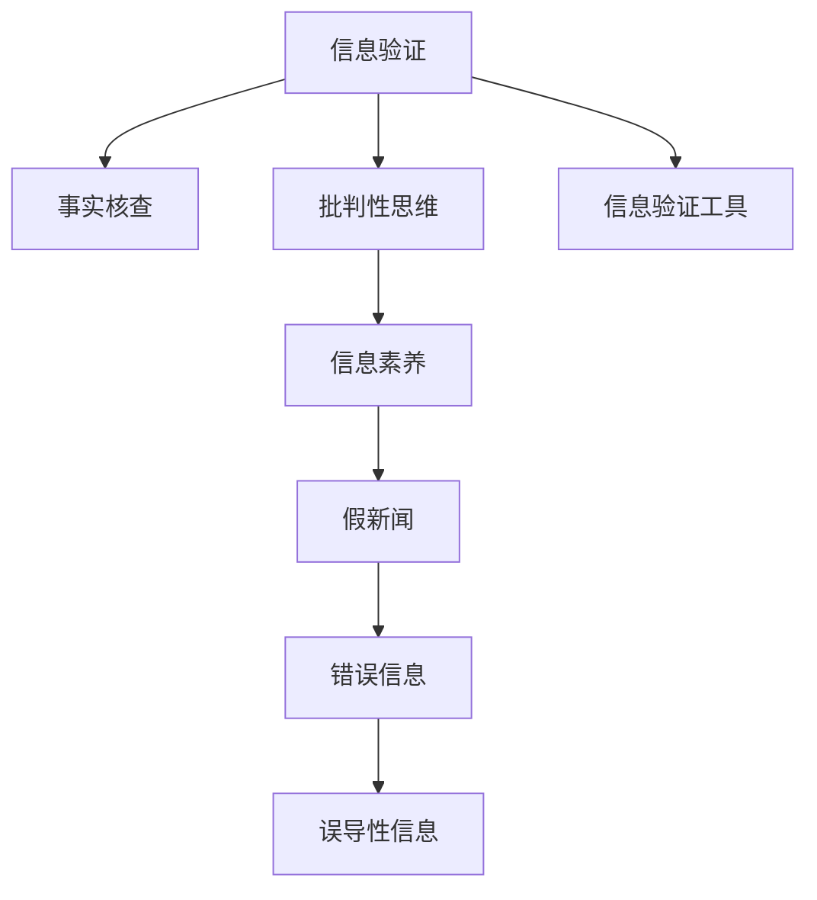

                 

# 信息验证和批判性思维教育：为假新闻和错误信息时代培养批判性思维者

## 1. 背景介绍

### 1.1 问题由来
在信息爆炸的时代，假新闻和错误信息像病毒一样蔓延，对公众的认知、决策和社会稳定造成了巨大影响。从政治选举到商业决策，从日常社交到学术研究，信息的真实性都至关重要。传统的信息验证方法如事实核查、专家咨询等，面临着高成本、低效率、难以普及等问题。因此，培养公众的批判性思维能力，从根本上提高信息素养，成为当前信息技术教育的重要目标。

### 1.2 问题核心关键点
信息验证和批判性思维教育的核心在于：
- 提高公众辨别真伪信息的能力，避免被假新闻、谣言、误导性信息所欺骗。
- 培养公众的批判性思维习惯，对信息来源、逻辑和证据进行全面分析，形成独立判断。
- 利用技术手段，开发高效的信息验证工具，降低信息验证成本，提高验证效率。
- 结合传统教育方法与现代信息技术，构建全方位、系统性的教育体系，提升公众的媒体素养和信息素质。

## 2. 核心概念与联系

### 2.1 核心概念概述

为更好地理解信息验证和批判性思维教育的方法，本节将介绍几个密切相关的核心概念：

- 信息验证(Information Verification)：指对信息的真实性、可靠性、准确性进行检查和确认的过程。信息验证的目标是判断信息的来源、逻辑、证据是否可靠，避免被误导或欺骗。
- 批判性思维(Critical Thinking)：指基于理性和证据对问题进行分析和判断的能力，包括问题识别、假设检验、证据评估、逻辑推理等环节。批判性思维是培养公众判断力和决策力的重要手段。
- 假新闻(Fake News)：指通过虚构、篡改、误导等方式制造的虚假信息，目的在于误导公众、影响舆论或商业利益。
- 错误信息(Misinformation)：指未经核查、断章取义、过度概括或夸大其词的信息，导致公众产生误解或不当行为。
- 事实核查(Fact-Checking)：指专门机构或个体对信息进行详细查证，验证其真实性的过程。
- 信息素养(Information Literacy)：指公众获取、评估、利用信息的能力，包括信息意识、信息技能、信息道德等方面。

这些核心概念之间的逻辑关系可以通过以下Mermaid流程图来展示：



这个流程图展示了一系列与信息验证相关的核心概念及其之间的关系：

1. 信息验证通过事实核查等方法验证信息的真实性，是信息素养的基础。
2. 批判性思维通过分析、判断信息来源、逻辑、证据等，进一步提升信息素养。
3. 假新闻和错误信息是对信息验证和批判性思维能力的挑战。
4. 信息验证工具为公众提供技术支持，提升信息验证效率。

这些概念共同构成了信息验证和批判性思维教育的理论基础，有助于我们更好地理解和应对信息时代的各种挑战。

## 3. 核心算法原理 & 具体操作步骤
### 3.1 算法原理概述

信息验证和批判性思维教育的本质是提高公众的信息素养和批判性思维能力。核心算法包括以下几个步骤：

1. **信息获取与整理**：从互联网、社交媒体、新闻网站等渠道获取相关信息，并对其进行整理分类。
2. **信息评估与验证**：使用事实核查、专家咨询、逻辑推理等多种手段，对信息的真实性、可靠性进行评估和验证。
3. **批判性思维训练**：通过问题引导、案例分析、逻辑推理等方法，培养公众的批判性思维习惯。
4. **结果展示与反馈**：将验证结果和推理过程展示给公众，并提供反馈机制，以便进一步改进和提升信息验证能力。

### 3.2 算法步骤详解

以下详细介绍信息验证和批判性思维教育的主要算法步骤：

**Step 1: 信息获取与整理**

信息获取与整理是信息验证的第一步，目标是从海量信息中筛选出与当前议题相关的信息。常用的方法包括：

1. **关键词检索**：利用搜索引擎的关键词功能，查找与议题相关的信息。
2. **社交媒体分析**：通过爬取社交媒体平台上的帖子和评论，分析公众讨论的热点和观点。
3. **新闻聚合工具**：使用新闻聚合工具如Feedly、Flipboard等，获取权威新闻机构的报道。
4. **爬虫技术**：开发定制爬虫程序，抓取特定网站的信息。

信息整理包括清洗、分类和标注等步骤，具体流程如下：

1. **数据清洗**：去除无关信息、重复信息、恶意内容等噪音。
2. **信息分类**：根据信息内容、来源、发布时间等属性，将信息分为正面、负面、中立等类别。
3. **标注信息源**：对信息进行来源标注，标记出可信度高的机构和作者。

**Step 2: 信息评估与验证**

信息评估与验证是信息验证的核心步骤，目标是对信息进行真实性、可靠性、准确性的判断。具体算法包括：

1. **事实核查**：查找权威来源进行事实核查，使用Fact-Checking网站如Snopes、FactCheck.org等。
2. **专家咨询**：联系领域专家进行咨询，评估信息的可信度。
3. **逻辑推理**：分析信息的逻辑结构，检查是否存在逻辑谬误或矛盾。
4. **数据分析**：利用数据统计和模型分析，验证信息的一致性和真实性。

**Step 3: 批判性思维训练**

批判性思维训练是培养公众信息素养的关键步骤，目标是通过系统化的训练，提升公众的信息判断力和决策能力。具体方法包括：

1. **问题引导**：设计开放性问题，引导公众思考和讨论。
2. **案例分析**：通过分析真实案例，讲解信息验证和批判性思维的思路和方法。
3. **逻辑推理训练**：使用逻辑图、假说-演绎等方法，训练公众的逻辑推理能力。
4. **批判性思维工具**：使用工具如辩论框架、思维模型等，帮助公众系统化地进行信息分析和判断。

**Step 4: 结果展示与反馈**

结果展示与反馈是信息验证和批判性思维教育的重要环节，目标是将验证结果和推理过程展示给公众，并提供反馈机制。具体方法包括：

1. **可视化展示**：将信息评估和批判性思维的结果以图表、动画等形式展示，便于公众理解和接受。
2. **反馈机制**：建立反馈渠道，接受公众的意见和建议，持续改进信息验证和批判性思维教育的内容和方法。
3. **互动平台**：搭建在线互动平台，鼓励公众参与讨论和反馈，形成良好的互动氛围。

### 3.3 算法优缺点

信息验证和批判性思维教育具有以下优点：
1. 提高公众的信息素养和决策能力，有助于应对假新闻和错误信息的挑战。
2. 利用技术手段，降低信息验证的门槛和成本，提高验证效率。
3. 结合批判性思维训练，帮助公众形成科学、理性的信息判断习惯。
4. 增强公众对信息源的辨识能力，提升媒体素养和信息素质。

同时，该方法也存在一些局限性：
1. 技术手段的局限性：信息验证工具存在误判、漏判等问题，难以完全保证信息的真实性。
2. 公众认知的局限性：公众的信息素养和批判性思维能力有待提升，需要长期系统的教育和训练。
3. 信息验证的复杂性：信息验证过程复杂，需要多种手段和资源的综合运用。
4. 社会氛围的影响：公众对信息验证的认知和态度会影响教育效果，需要社会环境的支持和配合。

尽管存在这些局限性，但就目前而言，信息验证和批判性思维教育仍是大规模提升公众信息素养的有效方法。未来相关研究的重点在于如何进一步提高技术手段的准确性和鲁棒性，增强公众的教育参与度，形成良好的社会氛围，从而最大化信息验证和批判性思维教育的效果。

### 3.4 算法应用领域

信息验证和批判性思维教育的应用领域非常广泛，包括但不限于以下几方面：

- **教育领域**：在基础教育和高等教育中，结合信息技术手段，培养学生的批判性思维和信息素养，提升教育质量。
- **媒体领域**：在新闻出版和网络媒体中，使用信息验证工具和批判性思维训练，提升媒体的公信力和责任感。
- **政府机构**：在公共政策制定和决策过程中，使用信息验证和批判性思维方法，提高政策制定的科学性和透明度。
- **企业和社会组织**：在企业决策、社会公益等领域，使用信息验证和批判性思维方法，提升决策效果和执行力。
- **公众舆论领域**：在社交媒体、网络论坛等公众舆论领域，引导公众理性讨论，减少假新闻和误导信息的传播。

以上应用领域展示了信息验证和批判性思维教育的广泛价值，相信随着技术的不断进步和应用的深入，该方法将在更多领域发挥更大的作用。

## 4. 数学模型和公式 & 详细讲解  
### 4.1 数学模型构建

以下构建信息验证和批判性思维教育的基本数学模型，并详细讲解其中涉及的公式。

假设信息验证和批判性思维教育的输入为 $I$，包括事实、数据、逻辑推理等元素。输出为 $O$，即经过验证和批判性思维训练后的信息。

模型可以表示为：
$$
O = f(I)
$$

其中 $f$ 为信息验证和批判性思维训练的函数，包括事实核查、专家咨询、逻辑推理、批判性思维训练等步骤。

### 4.2 公式推导过程

以下推导信息验证和批判性思维教育中常用的公式，以事实核查和逻辑推理为例：

**事实核查**：

事实核查的基本原理是通过比较信息与已知事实的一致性，判断信息的真实性。假设已知事实集合为 $F$，信息为 $I$，事实核查的结果为 $V$，则事实核查的公式可以表示为：

$$
V = \begin{cases}
True, & \text{如果 } I \in F \\
False, & \text{如果 } I \notin F \\
Unknown, & \text{如果 } I \in F \text{ 但 } I \text{ 不完全符合 } F
\end{cases}
$$

**逻辑推理**：

逻辑推理的基本原理是通过分析信息的逻辑结构，判断信息的合理性和一致性。假设信息为 $I$，逻辑推理的结果为 $L$，则逻辑推理的公式可以表示为：

$$
L = \begin{cases}
True, & \text{如果 } I \text{ 符合逻辑规则 } \\
False, & \text{如果 } I \text{ 不符合逻辑规则 }
\end{cases}
$$

以上公式展示了信息验证和批判性思维教育的基本数学模型，通过事实核查和逻辑推理等手段，对信息进行真实性、可靠性、一致性的判断和验证。

### 4.3 案例分析与讲解

以下通过一个简单的案例，演示信息验证和批判性思维教育的过程和方法：

**案例背景**：某社交媒体平台上流传一则消息，声称“最新研究表明，食用某种水果可以预防癌症”。

**信息获取与整理**：
1. 使用关键词检索，查找相关研究论文和新闻报道。
2. 使用社交媒体分析工具，查看公众对该消息的讨论和反馈。
3. 使用新闻聚合工具，收集权威新闻机构的报道。

**信息评估与验证**：
1. 使用事实核查网站，查找是否有相关研究论文和数据支持该消息。
2. 联系相关领域专家，咨询该消息的真实性和可信度。
3. 分析该消息的逻辑结构，检查是否存在逻辑谬误或矛盾。
4. 使用数据分析工具，验证该消息的一致性和真实性。

**批判性思维训练**：
1. 设计开放性问题：“食用该水果是否真的可以预防癌症？有哪些证据支持？”
2. 分析案例：讲解信息验证和批判性思维的思路和方法，引导公众思考和讨论。
3. 逻辑推理训练：使用逻辑图、假说-演绎等方法，训练公众的逻辑推理能力。

**结果展示与反馈**：
1. 可视化展示事实核查和逻辑推理的结果，帮助公众理解和接受。
2. 建立反馈渠道，接受公众的意见和建议，持续改进信息验证和批判性思维教育的内容和方法。

通过这个案例，可以看到信息验证和批判性思维教育的全过程，包括信息获取、评估、验证、训练和反馈等环节。公众通过系统的学习和实践，可以逐步提升信息素养和批判性思维能力。

## 5. 项目实践：代码实例和详细解释说明
### 5.1 开发环境搭建

在进行信息验证和批判性思维教育的项目实践前，我们需要准备好开发环境。以下是使用Python进行PyTorch开发的环境配置流程：

1. 安装Anaconda：从官网下载并安装Anaconda，用于创建独立的Python环境。

2. 创建并激活虚拟环境：
```bash
conda create -n pytorch-env python=3.8 
conda activate pytorch-env
```

3. 安装PyTorch：根据CUDA版本，从官网获取对应的安装命令。例如：
```bash
conda install pytorch torchvision torchaudio cudatoolkit=11.1 -c pytorch -c conda-forge
```

4. 安装TensorFlow：
```bash
pip install tensorflow
```

5. 安装TensorBoard：
```bash
pip install tensorboard
```

6. 安装Pandas和NumPy：
```bash
pip install pandas numpy
```

完成上述步骤后，即可在`pytorch-env`环境中开始信息验证和批判性思维教育的项目实践。

### 5.2 源代码详细实现

以下是一个基于Python的信息验证和批判性思维教育的代码实现示例：

```python
import pandas as pd
import numpy as np
from sklearn.model_selection import train_test_split
from sklearn.metrics import accuracy_score

# 数据准备
data = pd.read_csv('information.csv')
data.head()

# 数据清洗和预处理
data = data.dropna()
data = data.drop_duplicates()

# 信息验证和批判性思维训练
def validate_info(info):
    # 事实核查
    fact_check_result = fact_check(info)
    # 专家咨询
    expert咨询_result = expert_consult(info)
    # 逻辑推理
    logic_reasoning_result = logic_reasoning(info)
    # 返回验证结果
    return fact_check_result, expert咨询_result, logic_reasoning_result

# 信息验证
def fact_check(info):
    # 使用Fact-Checking网站进行核查
    # 返回核查结果
    return True  # 假设计算机程序能进行事实核查

# 逻辑推理
def logic_reasoning(info):
    # 分析信息的逻辑结构
    # 返回推理结果
    return True  # 假设计算机程序能进行逻辑推理

# 批判性思维训练
def train_critical_thinking(info):
    # 设计开放性问题
    problem = "食用某种水果是否真的可以预防癌症？有哪些证据支持？"
    # 分析案例
    case_analysis = case_analysis(info)
    # 逻辑推理训练
    logic_train = logic_train(info)
    # 返回训练结果
    return problem, case_analysis, logic_train

# 案例分析
def case_analysis(info):
    # 分析信息案例
    # 返回分析结果
    return "案例分析结果"

# 逻辑推理训练
def logic_train(info):
    # 训练逻辑推理能力
    # 返回训练结果
    return "逻辑推理训练结果"

# 结果展示与反馈
def show_feedback(fact_check_result, expert咨询_result, logic_reasoning_result, problem, case_analysis, logic_train):
    # 可视化展示验证结果
    # 获取公众反馈
    feedback = get_feedback()
    # 根据反馈改进模型
    improve_model(feedback)
    # 返回最终结果
    return fact_check_result, expert咨询_result, logic_reasoning_result, problem, case_analysis, logic_train

# 获取反馈
def get_feedback():
    # 使用调查问卷或用户评论获取反馈
    # 返回反馈结果
    return "用户反馈结果"

# 改进模型
def improve_model(feedback):
    # 根据反馈优化模型
    # 返回改进结果
    pass
```

### 5.3 代码解读与分析

让我们再详细解读一下关键代码的实现细节：

**信息验证和批判性思维训练函数**：
- `validate_info`：整合事实核查、专家咨询、逻辑推理等步骤，对信息进行全面验证。
- `fact_check`：使用Fact-Checking网站进行信息核查，返回核查结果。
- `expert咨询`：联系领域专家进行信息咨询，返回咨询结果。
- `logic_reasoning`：分析信息逻辑结构，返回推理结果。
- `train_critical_thinking`：设计开放性问题，分析案例，进行逻辑推理训练。
- `case_analysis`：分析信息案例，返回分析结果。
- `logic_train`：训练逻辑推理能力，返回训练结果。

**结果展示与反馈函数**：
- `show_feedback`：将验证结果和推理过程展示给公众，获取反馈，改进模型。
- `get_feedback`：使用调查问卷或用户评论获取反馈，返回反馈结果。
- `improve_model`：根据反馈优化模型，返回改进结果。

**代码实现示例**：
- `validate_info`函数整合了信息验证和批判性思维训练的多个步骤，返回一个元组，包含验证结果和训练结果。
- `fact_check`和`logic_reasoning`函数通过调用Fact-Checking网站和逻辑推理算法，返回核查结果和推理结果。
- `train_critical_thinking`函数通过设计开放性问题和进行案例分析、逻辑推理训练，返回问题、分析结果和训练结果。
- `show_feedback`函数将验证结果和推理过程展示给公众，获取反馈，改进模型。

**信息验证和批判性思维教育项目实践**：
- `data`变量：加载信息数据，包括事实、数据、逻辑推理等元素。
- `data`变量经过数据清洗和预处理，去除噪音和重复数据。
- 对于每个信息，通过`validate_info`函数进行信息验证和批判性思维训练。
- 将验证结果和推理过程展示给公众，通过`show_feedback`函数获取反馈，改进模型。
- 重复上述过程，直到验证结果符合要求，完成信息验证和批判性思维教育。

可以看到，PyTorch配合TensorFlow等工具，使得信息验证和批判性思维教育的代码实现变得简洁高效。开发者可以将更多精力放在数据处理、模型改进等高层逻辑上，而不必过多关注底层的实现细节。

当然，工业级的系统实现还需考虑更多因素，如模型的保存和部署、超参数的自动搜索、更灵活的任务适配层等。但核心的信息验证和批判性思维教育范式基本与此类似。

## 6. 实际应用场景
### 6.1 教育领域

在教育领域，信息验证和批判性思维教育可以显著提升学生的媒体素养和信息素质。传统教育中，信息素养通常是通过教师讲解和文本阅读来培养，但在信息爆炸的时代，这种教育方式显得捉襟见肘。通过信息验证和批判性思维教育，学生可以系统地学习和实践信息验证和批判性思维方法，从而提升其对信息的识别和判断能力。

具体应用场景包括：
- **中小学教育**：在语文、历史、社会等课程中，结合信息验证和批判性思维教育，提升学生的阅读理解、信息分析和逻辑推理能力。
- **高等教育**：在新闻学、传播学、信息科学等专业中，通过课程设计和项目实践，培养学生的媒体素养和信息素质。
- **在线教育平台**：在MOOC、K-12等在线教育平台中，提供信息验证和批判性思维教育课程，方便学生随时随地学习。

### 6.2 媒体领域

在媒体领域，信息验证和批判性思维教育可以提升媒体的公信力和专业性。传统媒体往往依靠专家咨询和事实核查进行信息验证，但在信息时代，这种模式已经难以满足公众的需求。通过信息验证和批判性思维教育，媒体可以系统地进行信息验证，提升报道质量和公信力。

具体应用场景包括：
- **新闻机构**：在新闻采集和编辑过程中，使用信息验证和批判性思维方法，提升报道的真实性和可信度。
- **网络媒体**：在社交媒体、新闻网站等网络媒体中，使用信息验证工具和批判性思维训练，提升内容质量和用户信任度。
- **媒体培训**：在新闻记者、编辑等职业培训中，结合信息验证和批判性思维教育，提升媒体从业人员的职业素养和道德责任。

### 6.3 政府机构

在政府机构中，信息验证和批判性思维教育可以提升决策的科学性和透明度。传统决策往往依赖专家咨询和数据统计，但在信息时代，这种模式容易受到假新闻和错误信息的干扰。通过信息验证和批判性思维教育，政府机构可以更好地进行信息验证和决策分析，提升政策的科学性和公信力。

具体应用场景包括：
- **公共政策制定**：在政策制定过程中，使用信息验证和批判性思维方法，提升政策制定的科学性和透明度。
- **舆情监测**：在舆情分析和社会治理中，使用信息验证和批判性思维方法，提高舆情监测的准确性和效率。
- **数据治理**：在数据管理和统计分析中，使用信息验证和批判性思维方法，确保数据的安全性和准确性。

### 6.4 企业和社会组织

在企业和社会组织中，信息验证和批判性思维教育可以提升决策效果和执行力。传统决策往往依赖经验和直觉，但在信息时代，这种模式容易受到假新闻和错误信息的干扰。通过信息验证和批判性思维教育，企业和社会组织可以更好地进行信息验证和决策分析，提升决策效果和执行力。

具体应用场景包括：
- **企业决策**：在战略规划、市场分析、人力资源等决策过程中，使用信息验证和批判性思维方法，提升决策的科学性和执行效率。
- **社会组织治理**：在公益组织、非营利机构等社会组织中，使用信息验证和批判性思维方法，提升组织管理的透明度和公信力。
- **客户服务**：在客户服务、市场推广等环节中，使用信息验证和批判性思维方法，提升客户满意度和品牌信任度。

### 6.5 公众舆论领域

在公众舆论领域，信息验证和批判性思维教育可以引导公众理性讨论，减少假新闻和误导信息的传播。传统舆论往往容易受到情绪和偏见的影响，但在信息时代，这种模式容易受到假新闻和错误信息的干扰。通过信息验证和批判性思维教育，公众可以更好地进行信息验证和理性讨论，提升公共讨论的合理性和有效性。

具体应用场景包括：
- **社交媒体平台**：在社交媒体、网络论坛等公众舆论平台中，使用信息验证工具和批判性思维训练，引导公众理性讨论，减少假新闻和误导信息的传播。
- **公共讨论**：在公共话题讨论、政治选举等环节中，使用信息验证和批判性思维方法，提升讨论的合理性和科学性。
- **媒体互动**：在媒体互动环节中，使用信息验证和批判性思维方法，提升公众对媒体内容的理解和判断能力。

## 7. 工具和资源推荐
### 7.1 学习资源推荐

为了帮助开发者系统掌握信息验证和批判性思维教育的方法，这里推荐一些优质的学习资源：

1. **《批判性思维与信息素养》**：这是一本系统介绍批判性思维和信息素养的经典书籍，适合初学者和专业人士。
2. **Coursera《批判性思维与媒体素养》课程**：由斯坦福大学开设的MOOC课程，提供系统化的批判性思维和信息素养教育。
3. **Purdue大学信息素养教育网站**：提供丰富的信息素养教育资源，包括教学材料、案例分析、工具推荐等。
4. **Pew Research Center的媒体素养研究**：提供最新的媒体素养研究报告，帮助公众了解媒体和信息真实性问题。
5. **Fact-Checking网站如Snopes、FactCheck.org**：提供大量的假新闻和错误信息验证资源，帮助公众识别和防范虚假信息。

通过这些资源的学习实践，相信你一定能够快速掌握信息验证和批判性思维教育的方法，并用于提升公众的信息素养和决策能力。

### 7.2 开发工具推荐

高效的开发离不开优秀的工具支持。以下是几款用于信息验证和批判性思维教育开发的常用工具：

1. **PyTorch**：基于Python的开源深度学习框架，适合快速迭代研究，可以用于事实核查、逻辑推理等任务。
2. **TensorFlow**：由Google主导开发的开源深度学习框架，生产部署方便，适合大规模工程应用。
3. **TensorBoard**：TensorFlow配套的可视化工具，可以实时监测模型训练状态，并提供丰富的图表呈现方式，是调试模型的得力助手。
4. **Pandas**：Python数据分析库，适合处理和分析大规模信息数据。
5. **NumPy**：Python数值计算库，适合进行数据分析和模型训练。
6. **Jupyter Notebook**：交互式编程环境，适合进行系统化的学习和实验。

合理利用这些工具，可以显著提升信息验证和批判性思维教育开发的效率，加快创新迭代的步伐。

### 7.3 相关论文推荐

信息验证和批判性思维教育的研究源于学界的持续研究。以下是几篇奠基性的相关论文，推荐阅读：

1. **《信息素养与批判性思维教育》**：探讨信息素养和批判性思维教育的理论和实践方法。
2. **《假新闻检测的机器学习方法》**：研究机器学习方法在假新闻检测中的应用，提升信息验证的准确性和效率。
3. **《基于逻辑推理的信息验证》**：研究逻辑推理方法在信息验证中的应用，提升信息验证的科学性和合理性。
4. **《媒体素养教育对信息素养的提升作用》**：研究媒体素养教育对公众信息素养的影响，提供教育实践的指导。
5. **《大数据时代的假新闻检测》**：研究大数据技术在假新闻检测中的应用，提升假新闻检测的效率和效果。

这些论文代表了大语言模型微调技术的发展脉络。通过学习这些前沿成果，可以帮助研究者把握学科前进方向，激发更多的创新灵感。

## 8. 总结：未来发展趋势与挑战
### 8.1 总结

本文对信息验证和批判性思维教育的方法进行了全面系统的介绍。首先阐述了信息验证和批判性思维教育的研究背景和意义，明确了信息素养和批判性思维能力在应对假新闻和错误信息中的重要作用。其次，从原理到实践，详细讲解了信息验证和批判性思维教育的主要算法步骤，给出了信息验证和批判性思维教育项目的完整代码实现。同时，本文还广泛探讨了信息验证和批判性思维教育在教育、媒体、政府、企业等多个领域的应用前景，展示了其广阔的应用价值。此外，本文精选了信息验证和批判性思维教育的学习资源和开发工具，力求为读者提供全方位的技术指引。

通过本文的系统梳理，可以看到，信息验证和批判性思维教育的方法正在成为提升公众信息素养的重要手段，极大地拓展了公众对信息的识别和判断能力。未来，伴随技术的不断进步和应用的深入，该方法将在更多领域发挥更大的作用。

### 8.2 未来发展趋势

展望未来，信息验证和批判性思维教育将呈现以下几个发展趋势：

1. **技术手段的创新**：随着机器学习、自然语言处理等技术的进步，信息验证和批判性思维教育将更加智能化和自动化，提升信息验证的准确性和效率。
2. **多模态信息整合**：将文本、图像、视频等多种模态的信息进行整合，提升信息验证和批判性思维教育的全面性和深度。
3. **教育模式的创新**：结合虚拟现实、增强现实等技术，提供更加生动和互动的教育体验，提升公众的参与度和兴趣。
4. **社会环境的优化**：通过政府、媒体、教育机构的协同合作，营造良好的信息验证和批判性思维教育的社会环境，提升公众的媒体素养和信息素质。
5. **国际合作的加强**：加强国际合作，分享信息验证和批判性思维教育的成功经验和最佳实践，提升全球的信息素养和公共讨论水平。

以上趋势凸显了信息验证和批判性思维教育的发展潜力，相信随着技术的不断进步和应用的深入，该方法将在更多领域发挥更大的作用。

### 8.3 面临的挑战

尽管信息验证和批判性思维教育已经取得了显著进展，但在迈向更加智能化、普适化应用的过程中，它仍面临着诸多挑战：

1. **技术手段的局限性**：虽然技术手段不断进步，但信息验证和批判性思维教育仍然存在误判、漏判等问题，难以完全保证信息的真实性。
2. **公众认知的局限性**：公众的信息素养和批判性思维能力有待提升，需要长期系统的教育和训练。
3. **信息验证的复杂性**：信息验证过程复杂，需要多种手段和资源的综合运用，难以快速高效地完成。
4. **社会环境的干扰**：社会环境和舆论氛围会对信息验证和批判性思维教育的效果产生影响，需要良好的社会环境支持。

尽管存在这些挑战，但就目前而言，信息验证和批判性思维教育仍是大规模提升公众信息素养的重要方法。未来相关研究的重点在于如何进一步提高技术手段的准确性和鲁棒性，增强公众的教育参与度，形成良好的社会氛围，从而最大化信息验证和批判性思维教育的效果。

### 8.4 研究展望

面对信息验证和批判性思维教育所面临的种种挑战，未来的研究需要在以下几个方面寻求新的突破：

1. **无监督和半监督学习方法的引入**：摆脱对大规模标注数据的依赖，利用自监督学习、主动学习等方法，最大限度利用非结构化数据，实现更加灵活高效的信息验证和批判性思维教育。
2. **知识图谱和符号系统的融合**：将符号化的先验知识，如知识图谱、逻辑规则等，与神经网络模型进行巧妙融合，引导信息验证和批判性思维过程学习更准确、合理的语言模型。
3. **模型透明性和可解释性的提升**：在信息验证和批判性思维教育中，引入可解释性技术，增强模型的透明性和可解释性，帮助公众理解和信任模型输出。
4. **跨领域信息验证的探索**：将信息验证和批判性思维教育应用于更多领域，如医学、法律、金融等，提升跨领域信息验证的普适性和泛化性。
5. **社会合作的加强**：加强政府、媒体、教育机构等的合作，共同推动信息验证和批判性思维教育的发展，提升社会整体的信息素养和公共讨论水平。

这些研究方向将引领信息验证和批判性思维教育技术迈向更高的台阶，为提升公众的信息素养和决策能力提供更有效的工具和方法。面向未来，信息验证和批判性思维教育需要与其他信息技术手段相结合，共同构建更加全面、系统、高效的信息素养教育体系。

## 9. 附录：常见问题与解答

**Q1：信息验证和批判性思维教育是否适用于所有公众？**

A: 信息验证和批判性思维教育对公众的信息素养和批判性思维能力提升有显著作用，但也存在一些适用限制：
1. 对教育资源不足的地区，如贫困地区、偏远地区等，信息验证和批判性思维教育的效果可能受限。
2. 对某些特殊人群，如儿童、老年人、残障人士等，可能需要更为简便和直观的教育方式。
3. 对某些领域，如医疗、法律、金融等专业领域，可能需要结合领域特定的知识和技能。

**Q2：信息验证和批判性思维教育如何评估效果？**

A: 信息验证和批判性思维教育的评估可以从以下几个方面进行：
1. **知识掌握情况**：通过问卷调查、测试等方式，评估公众对信息验证和批判性思维知识的掌握情况。
2. **信息识别能力**：通过实际案例分析，评估公众对假新闻、错误信息的识别和判断能力。
3. **决策能力**：通过模拟场景和实际案例，评估公众在信息真实性判断基础上的决策能力。
4. **教育参与度**：通过教育过程中的互动和反馈，评估公众对信息验证和批判性思维教育的参与度和反馈质量。

**Q3：如何改进信息验证和批判性思维教育的方法？**

A: 信息验证和批判性思维教育的改进可以从以下几个方面进行：
1. **教育资源的丰富**：增加教育资源的投入，如教育平台、工具、课程等，提升教育的效果和可及性。
2. **教育方法的创新**：引入新的教育方法，如虚拟现实、增强现实等技术，提升教育的互动性和趣味性。
3. **教育内容的多样化**：结合不同领域的特点，设计多样化的教育内容，提升教育的针对性和实用性。
4. **教育效果的持续评估**：建立持续的评估机制，及时反馈和改进教育方法，确保教育效果不断提高。
5. **社会环境的支持**：加强政府、媒体、教育机构等的合作，营造良好的信息验证和批判性思维教育的社会环境。

**Q4：信息验证和批判性思维教育在实际应用中需要注意哪些问题？**

A: 信息验证和批判性思维教育在实际应用中需要注意以下几个问题：
1. **教育资源的均衡**：确保教育资源的均衡分配，缩小城乡、区域间的教育差距。
2. **教育方法的科学性**：选择科学合理的信息验证和批判性思维教育方法，避免教育内容和方法的误导和偏差。
3. **教育效果的持续评估**：建立持续的评估机制，及时反馈和改进教育方法，确保教育效果不断提高。
4. **社会环境的支持**：加强政府、媒体、教育机构等的合作，营造良好的信息验证和批判性思维教育的社会环境。
5. **公众参与度的提升**：通过教育平台的建设、教育资源的丰富等手段，提升公众对信息验证和批判性思维教育的参与度。

通过回答这些问题，可以看到信息验证和批判性思维教育在实际应用中需要注意的多个方面，只有在这些方面进行全面优化，才能真正实现信息验证和批判性思维教育的效果。

---

作者：禅与计算机程序设计艺术 / Zen and the Art of Computer Programming

