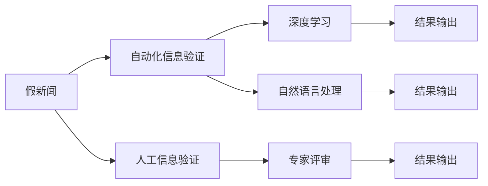

                 

## 1. 背景介绍

在数字化时代，信息爆炸使得人们面临着前所未有的信息过载和信息筛选压力。假新闻和错误信息的泛滥不仅扰乱了公共舆论，也给社会稳定和经济发展带来了严重威胁。因此，信息验证和批判性思维能力培养成为了当前信息技术领域的一个重要课题。本文将系统介绍基于机器学习的自动信息验证方法，探讨其在检测假新闻、甄别错误信息方面的应用，并对信息素养和批判性思维能力的提升提出建议。

## 2. 核心概念与联系

### 2.1 核心概念概述

- **假新闻与错误信息**：指故意篡改、歪曲、误导或虚假发布的信息，旨在误导公众，影响公众舆论或行为。

- **信息验证**：指通过技术手段确定信息真伪的过程。包括自动化方法如机器学习、深度学习等，以及人工验证如事实核查、专家评审等。

- **批判性思维**：指在处理信息、做出判断时，能够基于逻辑、证据、理由和事实进行深度分析、质疑和推理的能力。

### 2.2 核心概念原理和架构的 Mermaid 流程图



该流程图展示了假新闻验证的整体架构，包括自动验证（涉及深度学习和自然语言处理）和人工验证（涉及专家评审）的流程和输出。

## 3. 核心算法原理 & 具体操作步骤

### 3.1 算法原理概述

基于机器学习的信息验证方法主要利用深度学习模型，通过训练学习识别和验证假新闻的特征。常见的算法包括文本分类模型、序列标注模型和序列生成模型等。

### 3.2 算法步骤详解

1. **数据准备**：收集和标注大量的假新闻和真实新闻数据集，作为训练和验证数据。

2. **特征提取**：使用自然语言处理技术，如词向量、TF-IDF等，将文本数据转化为模型可处理的特征向量。

3. **模型训练**：利用标注数据训练深度学习模型，如卷积神经网络(CNN)、循环神经网络(RNN)、长短时记忆网络(LSTM)等，学习识别假新闻的特征。

4. **验证与测试**：在独立的测试集上验证模型性能，使用准确率、召回率、F1值等指标评估模型效果。

5. **部署与应用**：将训练好的模型集成到实际应用中，用于实时检测和验证信息真伪。

### 3.3 算法优缺点

#### 优点

- 自动化和高效性：大规模的自动化处理能够快速验证信息真伪，适应大规模数据量。
- 可扩展性：深度学习模型的通用性使得方法可应用于不同语言和领域的新闻验证。
- 持续学习：通过不断更新训练数据，模型能够学习最新的假新闻特征，提高检测准确率。

#### 缺点

- 数据依赖：模型的性能依赖于高质量的数据集，标注成本高，数据分布可能不均衡。
- 可解释性：深度学习模型作为"黑箱"，难以解释其推理过程和决策依据。
- 误报和漏报：存在一定比例的误报和漏报，需要通过调整模型参数和优化特征提取方法来提高精度。

### 3.4 算法应用领域

- 假新闻检测：在社交媒体、新闻网站等平台上自动检测和标记假新闻。
- 错误信息甄别：在政治、经济、科技等领域识别和驳斥错误信息，防止误导公众。
- 舆论监控：监测特定主题的舆论动向，及时发现和干预有害信息传播。
- 信息素养教育：辅助学校和机构进行信息素养教育，提升公众的信息辨别能力。

## 4. 数学模型和公式 & 详细讲解 & 举例说明

### 4.1 数学模型构建

信息验证的数学模型通常包括文本分类模型和序列标注模型，这里我们以文本分类为例进行详细讲解。

设文本分类任务有$n$个类别，每个文本$x$属于某个类别$y$。假定使用$C$维词向量表示文本$x$，$w$为模型参数。假设分类器为$F$，则模型的损失函数$\mathcal{L}$可以定义为：

$$\mathcal{L} = \sum_{i=1}^N \log(F(w,x_i)y_i)$$

其中$N$为训练样本数，$y_i$为类别标签。

### 4.2 公式推导过程

以卷积神经网络(CNN)为例，推导信息验证模型的损失函数：

- **卷积层**：对文本进行局部特征提取，计算卷积核$k$在文本$x$上的卷积操作：

$$h_k(x) = \sum_{i=0}^{n-1}k_i \cdot x_i$$

其中$k_i$为卷积核参数，$n$为文本长度。

- **池化层**：对卷积层输出进行下采样，简化特征向量。

- **全连接层**：将池化层输出连接成向量，输入到全连接层进行分类：

$$z = \sum_{i=1}^d w_i \cdot h_i$$

其中$d$为全连接层节点数，$h_i$为池化层输出。

- **输出层**：使用Softmax函数输出每个类别的概率分布：

$$p(y|x) = \frac{e^{z_i}}{\sum_{j=1}^n e^{z_j}}$$

- **损失函数**：分类任务的交叉熵损失函数：

$$\mathcal{L} = -\sum_{i=1}^N \sum_{j=1}^n y_j \log p(y_j|x_i)$$

通过反向传播算法，不断调整模型参数$w$，最小化损失函数$\mathcal{L}$，使得模型在训练集上准确率最大化。

### 4.3 案例分析与讲解

假设有一篇关于美国大选的新闻，模型需要判断其真伪。首先，将新闻文本转化为词向量表示，输入到卷积神经网络中，通过卷积和池化操作提取关键特征。然后，将池化层输出连接成向量，输入到全连接层和Softmax层进行分类，输出每个类别的概率分布。最后，使用交叉熵损失函数计算预测与真实标签之间的差异，并反向传播更新模型参数，直到模型收敛。

## 5. 项目实践：代码实例和详细解释说明

### 5.1 开发环境搭建

在进行项目实践前，需要安装Python和相关库，如TensorFlow、Keras、NLTK等。在Python环境中安装并配置相应的深度学习框架和自然语言处理工具包。

### 5.2 源代码详细实现

以下是一个使用TensorFlow实现文本分类模型的示例代码：

```python
import tensorflow as tf
from tensorflow.keras.models import Sequential
from tensorflow.keras.layers import Embedding, Conv1D, MaxPooling1D, Flatten, Dense

# 定义模型
model = Sequential()
model.add(Embedding(input_dim=vocab_size, output_dim=embedding_dim, input_length=max_length))
model.add(Conv1D(filters=64, kernel_size=3, activation='relu'))
model.add(MaxPooling1D(pool_size=2))
model.add(Flatten())
model.add(Dense(units=128, activation='relu'))
model.add(Dense(units=num_classes, activation='softmax'))

# 编译模型
model.compile(loss='categorical_crossentropy', optimizer='adam', metrics=['accuracy'])

# 训练模型
model.fit(x_train, y_train, epochs=10, batch_size=32, validation_data=(x_val, y_val))
```

### 5.3 代码解读与分析

- `Embedding`层：将文本数据转化为词向量表示。
- `Conv1D`层：提取文本中的局部特征。
- `MaxPooling1D`层：对卷积层输出进行下采样。
- `Flatten`层：将池化层输出连接成向量。
- `Dense`层：全连接层进行分类。

模型通过反向传播不断调整参数，最小化损失函数。训练过程中需要设置合适的超参数，如学习率、批次大小、训练轮数等，以获得最佳性能。

### 5.4 运行结果展示

在训练过程中，可以使用`model.evaluate`方法在验证集上评估模型性能，使用`model.predict`方法在测试集上进行预测。

## 6. 实际应用场景

### 6.1 假新闻检测

在社交媒体平台如Twitter、Facebook上，使用自动化信息验证方法检测假新闻，可以及时发现和标记有害信息，防止其传播。

### 6.2 错误信息甄别

在新闻网站和政论节目中，利用深度学习模型甄别错误信息，帮助公众理解事实真相，防止被误导。

### 6.3 舆论监控

政府和机构可以使用信息验证技术，监测特定主题的舆论动向，及时干预有害信息的传播，维护社会稳定。

### 6.4 信息素养教育

学校和培训机构可以借助信息验证工具，提升学生的媒体素养和批判性思维能力，使其在面对海量信息时具备自我筛选和判断的能力。

## 7. 工具和资源推荐

### 7.1 学习资源推荐

- **Kaggle**：提供大量公开数据集和竞赛，可以帮助学习者掌握信息验证的实战技巧。
- **Google Scholar**：查找最新研究论文，了解最新的信息验证方法和应用。
- **Coursera**：参加自然语言处理和深度学习课程，学习信息验证的理论基础和实现方法。

### 7.2 开发工具推荐

- **TensorFlow**：强大的深度学习框架，适合构建复杂的信息验证模型。
- **NLTK**：自然语言处理工具包，提供文本处理和分析功能。
- **Keras**：高层次的神经网络API，易于上手且功能丰富。

### 7.3 相关论文推荐

- **"Deep Fake News Detection with Attention-Based Recurrent Neural Networks"**：提出基于注意力机制的RNN模型，用于假新闻检测。
- **"Towards Explainable Deep News Verification"**：探讨深度学习模型的可解释性问题，提出可视化工具辅助模型分析。
- **"Evaluating NLP-based Fake News Detectors"**：分析多种NLP方法在假新闻检测中的表现，提出综合评估指标。

## 8. 总结：未来发展趋势与挑战

### 8.1 研究成果总结

基于机器学习的信息验证方法，已经展现出在检测假新闻和错误信息方面的强大能力。然而，现有方法仍面临数据质量、模型可解释性、误报漏报等问题，需要进一步优化和改进。

### 8.2 未来发展趋势

- **跨模态信息验证**：结合视觉、音频等多模态信息，提升假新闻检测的准确率。
- **实时信息验证**：构建分布式、流式处理系统，实现实时检测和验证。
- **交互式信息验证**：引入人机交互，提供用户反馈机制，动态调整模型参数。

### 8.3 面临的挑战

- **数据偏见**：大规模数据集的偏见问题，可能导致模型在特定领域或特定语言上的性能下降。
- **模型复杂性**：复杂模型需要大量的计算资源，存在资源消耗高的问题。
- **误报和漏报**：尽管精度有所提升，但误报和漏报仍难以完全消除。

### 8.4 研究展望

- **多模态融合**：探索视觉、听觉、文本等多种模态数据的融合，提升信息验证的全面性。
- **对抗训练**：引入对抗样本训练，增强模型鲁棒性，降低误报和漏报。
- **跨语言验证**：研究跨语言信息验证方法，拓展信息验证的国际影响力。

## 9. 附录：常见问题与解答

### Q1: 假新闻检测的挑战是什么？

A: 假新闻检测的主要挑战包括数据质量问题、自动化检测的准确性、跨语言识别能力不足等。数据集的不平衡和标注的不准确会影响模型的性能。自动化检测虽然速度快，但准确性可能受限于模型的复杂性和训练数据的规模。跨语言识别能力的不足使得模型在处理不同语言的新闻时，难以保证一致性。

### Q2: 如何提升信息验证模型的可解释性？

A: 提升信息验证模型的可解释性，可以通过以下几个方法：
- **可视化工具**：使用可视化工具如TensorBoard，展示模型的训练和推理过程，理解模型的决策依据。
- **规则注入**：在设计模型时，结合领域专家的知识，注入规则和先验信息，增强模型的可解释性。
- **层级分析**：分析模型各层的特征表示，理解模型在检测假新闻时的关键特征。

### Q3: 如何评估信息验证模型的性能？

A: 评估信息验证模型的性能，可以使用以下指标：
- **准确率**：模型正确分类的样本数与总样本数的比例。
- **召回率**：模型正确识别的正样本数与实际正样本数的比例。
- **F1值**：准确率和召回率的调和平均，综合评估模型的整体性能。
- **ROC曲线**：绘制真正率与假正率的关系图，评估模型的分类性能。

通过这些指标的综合评估，可以全面了解模型的性能表现，并指导后续的模型优化和改进。

---

作者：禅与计算机程序设计艺术 / Zen and the Art of Computer Programming

