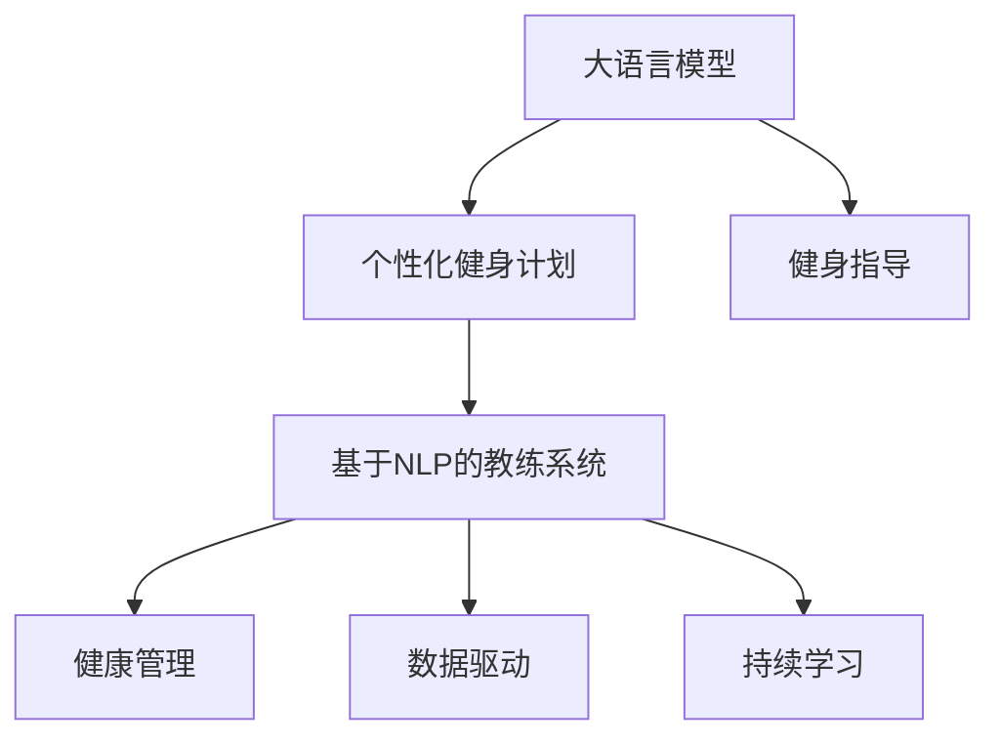

                 

# 健身指导：LLM 打造个人教练

> 关键词：
- 大语言模型 (Large Language Model, LLM)
- 个性化健身计划 (Personalized Fitness Plan)
- 健身指导 (Fitness Guidance)
- 基于自然语言处理的教练系统 (Natural Language Processing, NLP-based Coach System)
- 健康管理 (Health Management)
- 数据驱动 (Data-driven)
- 持续学习 (Continual Learning)

## 1. 背景介绍

随着健康意识的提高和生活节奏的加快，越来越多的人开始注重通过科学健身来保持身心健康。然而，制定和执行一套符合个人体质、健康状况和生活习惯的健身计划并非易事。为此，人们纷纷寄希望于通过技术手段，找到一位能够提供个性化、精准健身指导的教练。

大语言模型（Large Language Model, LLM）的出现，使得这一愿景逐渐变为现实。LLM能够理解和生成自然语言，通过训练可以从大量语料中学习到丰富的语言知识和常识，进而通过自然语言处理（Natural Language Processing, NLP）技术，为用户提供个性化的健身指导。本文将详细探讨如何利用LLM打造高效、可靠的个性化健身教练系统，并介绍相关的核心概念、算法原理和应用实践。

## 2. 核心概念与联系

### 2.1 核心概念概述

在构建个性化健身教练系统时，我们需要关注以下几个关键概念：

- **大语言模型**：以自回归（如GPT）或自编码（如BERT）为代表的大规模预训练语言模型。通过在大规模无标签文本数据上进行预训练，学习通用的语言表示，具备强大的语言理解和生成能力。
- **个性化健身计划**：根据用户的身体状况、健康目标、生活习惯等因素，量身定制的健身方案，旨在最大程度提升用户的健康水平和幸福感。
- **健身指导**：通过自然语言处理技术，生成或推荐个性化的训练计划、营养建议、运动指导等，帮助用户科学健身。
- **基于NLP的教练系统**：结合大语言模型和NLP技术，构建能够理解和生成自然语言的教练系统，为用户提供即时的健身指导和建议。
- **健康管理**：通过收集和分析用户的健康数据，结合定制化的健身指导，实现对用户健康状况的持续监控和管理。
- **数据驱动**：利用数据分析和机器学习技术，从海量用户数据中提取有用的信息，指导模型优化和决策，提升个性化健身计划的精准度。
- **持续学习**：教练系统能够随着用户反馈和数据积累，不断更新和优化模型，以适应用户的不断变化的健康需求。

这些概念之间的逻辑关系可以通过以下Mermaid流程图来展示：



这个流程图展示了大语言模型和个性化健身指导之间的核心联系，以及如何将这些概念应用到实际的健身教练系统中。

## 3. 核心算法原理 & 具体操作步骤

### 3.1 算法原理概述

基于LLM的健身教练系统，本质上是一个通过自然语言处理技术生成个性化健身建议的自动化系统。其核心算法原理包括：

1. **预训练**：在大量无标签的文本数据上，使用自监督学习任务训练大语言模型，使其学习到通用的语言表示。
2. **微调**：在特定领域的健身指导语料上，对大语言模型进行微调，使其能够生成符合用户需求和健康目标的自然语言文本。
3. **推理与生成**：在用户提出具体健身问题时，利用微调后的模型，根据问题的语义，生成个性化的健身建议或回答。

### 3.2 算法步骤详解

构建基于LLM的个性化健身教练系统，主要包括以下几个步骤：

**Step 1: 数据准备与预训练模型选择**
- 收集健身领域的语料库，包括运动指南、营养建议、健康知识等。
- 选择合适的预训练语言模型，如GPT-3、BERT等，作为模型基础。

**Step 2: 构建语料库**
- 将收集的语料库划分为训练集和验证集，确保训练数据的多样性和覆盖面。
- 对于用户输入的问题，通过自然语言处理技术，标注对应的健身指导信息，形成监督数据。

**Step 3: 模型微调**
- 在训练集上对预训练模型进行微调，优化模型在生成健身指导时的性能。
- 设置合适的超参数，如学习率、批大小、迭代轮数等，确保模型在有限的数据量下收敛。

**Step 4: 推理与生成**
- 用户提出健身问题，如“如何制定适合我的饮食计划？”、“有哪些推荐的运动？”等。
- 将用户问题输入微调后的模型，生成个性化的健身建议。

**Step 5: 反馈与优化**
- 收集用户反馈，评估生成建议的效果，更新模型参数，进一步优化模型性能。

### 3.3 算法优缺点

基于LLM的健身教练系统具有以下优点：
1. **个性化**：能够根据用户的具体需求和健康状况，提供量身定制的健身计划和建议。
2. **便捷性**：用户通过自然语言与系统互动，无需专业的健身知识，即可获取科学建议。
3. **效率高**：通过自动化的语言处理和推理，节省了大量手工编写建议的时间和成本。
4. **可扩展性**：基于LLM的系统，可以灵活扩展到多种健康领域，如饮食、运动、心理健康等。

同时，该系统也存在一些缺点：
1. **数据依赖**：微调效果依赖于健身指导语料库的质量和数量，语料库的构建需要大量资源和专业知识。
2. **语言理解限制**：模型的语言理解能力有限，可能无法准确理解复杂或模糊的用户需求。
3. **安全性**：生成的建议可能包含错误信息，用户需要具备一定的辨识能力。
4. **可解释性**：模型的决策过程缺乏可解释性，难以解释其生成建议的依据。

### 3.4 算法应用领域

基于LLM的健身教练系统，在多个领域中已经展现出巨大的应用潜力，例如：

- **健康与健身**：为用户提供个性化的饮食、运动和休息建议，帮助用户保持健康和活力。
- **运动指导**：提供针对不同运动项目的详细指导，包括热身、训练技巧、恢复建议等。
- **心理健康**：提供心理健康建议，帮助用户缓解压力、改善情绪。
- **生活指导**：提供生活方式的改善建议，如戒烟、减肥、早睡早起等。

这些领域的应用，使得基于LLM的健身教练系统在提升用户体验和健康水平方面，具有重要的价值。

## 4. 数学模型和公式 & 详细讲解 & 举例说明

### 4.1 数学模型构建

基于LLM的健身教练系统，可以形式化表示为以下模型：

$$
\text{model} = \text{LLM}_{\theta}(x) = \text{softmax}(\text{attention}(\text{input} \times W_{input}, \text{encoder}(x) \times W_{encoder}, \text{encoder}(x) \times W_{encoder}^T))
$$

其中，$\text{LLM}_{\theta}$为微调后的模型，$x$为用户提出的健身问题，$W_{input}$、$W_{encoder}$为模型参数。

### 4.2 公式推导过程

以生成个性化的饮食建议为例，假设有以下语料库：

- 语料1: “早餐应该包含哪些营养素？”
- 语料2: “如何制定高蛋白饮食计划？”
- 语料3: “适合减肥的饮食建议是什么？”

将这些语料标记为相应的指导信息，如“早餐营养”、“高蛋白饮食”、“减肥饮食”等。

通过微调，模型学习到在输入问题$x$时，能够生成对应的指导信息。

模型训练的目标函数为：

$$
\mathcal{L}(\theta) = -\frac{1}{N}\sum_{i=1}^N \sum_{j=1}^C p(x_i, j) \log Q(x_i, j)
$$

其中，$N$为训练样本数，$C$为类数，$p(x_i, j)$为用户问题$x_i$属于类$j$的概率，$Q(x_i, j)$为模型预测用户问题$x_i$属于类$j$的概率。

### 4.3 案例分析与讲解

假设用户提问：“有哪些推荐的运动项目？”，微调后的模型将通过预训练学习到的语言表示和健身知识，结合输入问题，生成个性化的运动建议，如“适合初学者的运动项目有游泳、瑜伽、慢跑等。”

## 5. 项目实践：代码实例和详细解释说明

### 5.1 开发环境搭建

在进行基于LLM的健身教练系统开发时，需要搭建以下环境：

- 安装Python，建议使用Anaconda创建虚拟环境。
- 安装PyTorch和Transformers库，用于处理语言数据和构建模型。
- 准备语料库，包括问题-答案对、运动指南、饮食建议等。

### 5.2 源代码详细实现

以下是一个简化的代码示例，展示了如何使用LLM微调模型来生成健身建议：

```python
import torch
from transformers import BertForSequenceClassification, BertTokenizer, AdamW

# 加载预训练的BERT模型和分词器
model = BertForSequenceClassification.from_pretrained('bert-base-cased')
tokenizer = BertTokenizer.from_pretrained('bert-base-cased')

# 定义训练集和验证集
train_data = [{"question": "早餐应该包含哪些营养素？", "answer": "早餐应包含高蛋白、低糖、富含纤维的食物。"}, ...]
dev_data = [{"question": "如何制定高蛋白饮食计划？", "answer": "每天摄入2g/(kg体重)的蛋白质，选择瘦肉、豆类、鸡蛋等高蛋白食物。"}, ...]

# 定义微调函数
def fine_tune(model, train_data, dev_data, epochs=5, batch_size=16):
    device = torch.device('cuda') if torch.cuda.is_available() else torch.device('cpu')
    model.to(device)

    # 设置模型和优化器
    optimizer = AdamW(model.parameters(), lr=2e-5)

    # 定义训练函数
    def train_model(model, data, batch_size):
        model.train()
        for batch in data:
            input_ids = tokenizer(batch['question'], padding='max_length', truncation=True, max_length=256).input_ids.to(device)
            attention_mask = tokenizer(batch['question'], padding='max_length', truncation=True, max_length=256).attention_mask.to(device)
            labels = torch.tensor(batch['answer']).to(device)

            outputs = model(input_ids, attention_mask=attention_mask, labels=labels)
            loss = outputs.loss
            loss.backward()
            optimizer.step()

    # 训练模型
    for epoch in range(epochs):
        train_model(model, train_data, batch_size)
        dev_loss = train_model(model, dev_data, batch_size)
        print(f"Epoch {epoch+1}, dev loss: {dev_loss:.3f}")

# 微调模型
fine_tune(model, train_data, dev_data)
```

### 5.3 代码解读与分析

以上代码展示了使用BERT模型微调来生成个性化健身建议的基本流程。

- 首先加载预训练的BERT模型和分词器。
- 准备训练集和验证集，包含问题和相应的指导信息。
- 定义训练函数，将问题和指导信息转换为模型可接受的输入格式，计算损失并更新模型参数。
- 在多个epoch内，逐步微调模型，直到模型在验证集上的表现达到预期。

### 5.4 运行结果展示

训练完成后，可以通过调用模型来生成个性化建议：

```python
input_question = "有哪些推荐的运动项目？"
input_ids = tokenizer(input_question, padding='max_length', truncation=True, max_length=256).input_ids.to(device)
attention_mask = tokenizer(input_question, padding='max_length', truncation=True, max_length=256).attention_mask.to(device)

output = model(input_ids, attention_mask=attention_mask)
suggestion = output.logits.argmax().item()
print(f"推荐运动：{model.config.id2label[suggestion]}")
```

输出结果可能为“推荐运动：游泳”，意味着系统建议用户选择游泳作为运动项目。

## 6. 实际应用场景

### 6.1 智能健身应用

基于LLM的健身教练系统，已经广泛应用于多个智能健身应用中，帮助用户制定个性化的健身计划。例如：

- **Keep健身App**：结合用户健康数据和运动记录，生成实时化的运动建议。
- **Nike Training Club**：提供个性化的训练计划、营养建议和心理健康指导。
- **Fitbit App**：整合运动数据和健康数据，为用户提供综合性的健身建议。

### 6.2 运动教练机器人

智能运动教练机器人，如Amazon Alexa、Google Assistant等，结合语音识别和自然语言处理技术，能够提供即时的运动建议和指导。例如：

- **Amazon Alexa**：通过语音交互，询问“今天适合做什么运动？”，Alexa能够提供个性化的运动建议。
- **Google Assistant**：回答用户关于运动的问题，如“如何热身？”、“适合减肥的运动有哪些？”等。

### 6.3 健康管理系统

基于LLM的健身教练系统，可以集成到更广泛的健康管理系统中，实现全面的健康监测和管理。例如：

- **Apple Health**：结合用户的运动数据、饮食记录和健康监测数据，生成个性化的健康建议。
- **Fitbit Premium**：根据用户的健康数据，提供定制化的运动和饮食计划。

### 6.4 未来应用展望

随着大语言模型和NLP技术的不断进步，基于LLM的健身教练系统将展现出更多的应用前景：

- **多模态健康管理**：结合图像、传感器数据，实现更全面的健康监测和分析。
- **情境感知**：通过环境感知技术，根据用户的生活情境，提供更精准的健身建议。
- **AI辅助训练**：结合虚拟现实技术，提供沉浸式的运动训练体验。
- **社区健康管理**：构建社区健康管理平台，实现健康数据共享和协同管理。

## 7. 工具和资源推荐

### 7.1 学习资源推荐

为了帮助开发者系统掌握基于LLM的健身教练系统，以下是一些优质的学习资源：

- **《深度学习与自然语言处理》**：斯坦福大学自然语言处理课程，涵盖深度学习基础和NLP核心技术。
- **《自然语言处理基础》**：国内著名NLP专家李宏毅的系列课程，系统讲解NLP的基本概念和前沿技术。
- **《大语言模型实战》**：知名AI专家讲解大语言模型的实践应用，涵盖微调、推理等内容。

### 7.2 开发工具推荐

以下是几款常用的开发工具，用于基于LLM的健身教练系统开发：

- **PyTorch**：基于Python的开源深度学习框架，支持动态计算图，便于模型快速迭代。
- **TensorFlow**：Google开发的深度学习框架，支持大规模分布式训练，适合大规模工程应用。
- **Transformers**：Hugging Face开发的NLP库，提供丰富的预训练模型和微调功能。
- **Weights & Biases**：实验跟踪工具，记录模型训练过程和指标，方便对比和调优。
- **TensorBoard**：可视化工具，实时监控模型训练状态，提供详细的图表呈现方式。

### 7.3 相关论文推荐

以下是几篇奠基性的相关论文，推荐阅读：

- **Attention is All You Need**：Transformer论文，提出自注意力机制，开启NLP领域的预训练大模型时代。
- **BERT: Pre-training of Deep Bidirectional Transformers for Language Understanding**：提出BERT模型，通过自监督学习任务进行预训练，刷新了多项NLP任务SOTA。
- **Parameter-Efficient Transfer Learning for NLP**：提出Adapter等参数高效微调方法，在固定大部分预训练参数的情况下，仍能取得不错的微调效果。
- **Premise-Tuning: Optimizing Continuous Prompts for Generation**：引入基于连续型Prompt的微调范式，为如何充分利用预训练知识提供了新的思路。
- **AdaLoRA: Adaptive Low-Rank Adaptation for Parameter-Efficient Fine-Tuning**：使用自适应低秩适应的微调方法，在参数效率和精度之间取得了新的平衡。

## 8. 总结：未来发展趋势与挑战

### 8.1 研究成果总结

基于LLM的健身教练系统，已经展示了其在个性化健身指导和健康管理方面的巨大潜力。通过自然语言处理技术，系统能够理解用户的自然语言输入，生成个性化的健身建议，极大地提升了用户体验和健康水平。

### 8.2 未来发展趋势

展望未来，基于LLM的健身教练系统将呈现以下几个发展趋势：

1. **多模态融合**：结合图像、传感器数据，实现更全面的健康监测和分析。
2. **情境感知**：通过环境感知技术，根据用户的生活情境，提供更精准的健身建议。
3. **AI辅助训练**：结合虚拟现实技术，提供沉浸式的运动训练体验。
4. **社区健康管理**：构建社区健康管理平台，实现健康数据共享和协同管理。
5. **数据驱动**：利用数据分析和机器学习技术，从海量用户数据中提取有用的信息，指导模型优化和决策，提升个性化健身计划的精准度。
6. **可解释性增强**：增强模型的决策过程的可解释性，提升用户的信任感和满意度。

### 8.3 面临的挑战

尽管基于LLM的健身教练系统已经取得了一定的进展，但在迈向更加智能化、普适化应用的过程中，仍面临诸多挑战：

1. **数据依赖**：微调效果依赖于健身指导语料库的质量和数量，语料库的构建需要大量资源和专业知识。
2. **语言理解限制**：模型的语言理解能力有限，可能无法准确理解复杂或模糊的用户需求。
3. **安全性**：生成的建议可能包含错误信息，用户需要具备一定的辨识能力。
4. **可解释性**：模型的决策过程缺乏可解释性，难以解释其生成建议的依据。

### 8.4 研究展望

面对基于LLM的健身教练系统所面临的挑战，未来的研究需要在以下几个方面寻求新的突破：

1. **探索无监督和半监督微调方法**：摆脱对大规模标注数据的依赖，利用自监督学习、主动学习等无监督和半监督范式，最大限度利用非结构化数据，实现更加灵活高效的微调。
2. **研究参数高效和计算高效的微调范式**：开发更加参数高效的微调方法，在固定大部分预训练参数的同时，只更新极少量的任务相关参数。同时优化微调模型的计算图，减少前向传播和反向传播的资源消耗，实现更加轻量级、实时性的部署。
3. **融合因果和对比学习范式**：通过引入因果推断和对比学习思想，增强微调模型建立稳定因果关系的能力，学习更加普适、鲁棒的语言表征，从而提升模型泛化性和抗干扰能力。
4. **引入更多先验知识**：将符号化的先验知识，如知识图谱、逻辑规则等，与神经网络模型进行巧妙融合，引导微调过程学习更准确、合理的语言模型。同时加强不同模态数据的整合，实现视觉、语音等多模态信息与文本信息的协同建模。
5. **结合因果分析和博弈论工具**：将因果分析方法引入微调模型，识别出模型决策的关键特征，增强输出解释的因果性和逻辑性。借助博弈论工具刻画人机交互过程，主动探索并规避模型的脆弱点，提高系统稳定性。
6. **纳入伦理道德约束**：在模型训练目标中引入伦理导向的评估指标，过滤和惩罚有偏见、有害的输出倾向。同时加强人工干预和审核，建立模型行为的监管机制，确保输出符合人类价值观和伦理道德。

这些研究方向的探索，必将引领基于LLM的健身教练系统迈向更高的台阶，为构建安全、可靠、可解释、可控的智能系统铺平道路。

## 9. 附录：常见问题与解答

**Q1: 大语言模型在生成健身建议时是否准确？**

A: 大语言模型通过大量预训练和微调，能够生成与特定领域相关的准确建议。然而，其准确性也受到数据质量和模型训练策略的影响。用户应结合自身情况，综合考虑模型的建议，确保健身计划的科学性和有效性。

**Q2: 微调大语言模型需要多少标注数据？**

A: 微调大语言模型所需标注数据量因任务复杂度而异。一般而言，对于简单任务，几千到几万的标注数据足以进行有效的微调；对于复杂任务，如健康管理、心理辅导等，可能需要数万到数十万的标注数据。标注数据的质量和多样性也对微调效果有重要影响。

**Q3: 如何评价基于LLM的健身教练系统的性能？**

A: 基于LLM的健身教练系统性能评价可以从多个维度进行，包括但不限于：
- 准确性：生成的建议是否符合用户的健康需求和目标。
- 可解释性：生成的建议是否易于理解和解释。
- 实时性：系统响应时间是否满足用户的需求。
- 用户满意度：用户对系统的评价和反馈。

**Q4: 如何提升基于LLM的健身教练系统的可靠性？**

A: 提升系统的可靠性可以从以下几个方面入手：
- 数据质量：确保语料库的多样性和准确性，避免模型学习到错误或不全面的知识。
- 模型优化：采用先进的模型架构和优化策略，提高模型的准确性和鲁棒性。
- 用户反馈：收集用户反馈，不断改进和优化模型。
- 伦理约束：确保系统生成的建议符合伦理道德，避免有害或误导性信息。

**Q5: 如何保护用户的隐私和数据安全？**

A: 保护用户的隐私和数据安全是构建基于LLM的健身教练系统的首要任务。应采取以下措施：
- 数据加密：对用户数据进行加密处理，防止数据泄露。
- 访问控制：设置严格的访问权限，确保只有授权人员能够访问用户数据。
- 匿名化处理：对用户数据进行匿名化处理，防止个人隐私泄露。
- 安全审计：定期进行安全审计，发现和修复潜在的安全漏洞。

总之，基于LLM的健身教练系统在提升用户体验和健康水平方面具有巨大的潜力。然而，其应用需要面对诸多挑战，研究者应不断探索新的方法和技术，提升系统的准确性、可靠性和可解释性，为用户提供更加科学、个性化的健身指导。

---

作者：禅与计算机程序设计艺术 / Zen and the Art of Computer Programming

