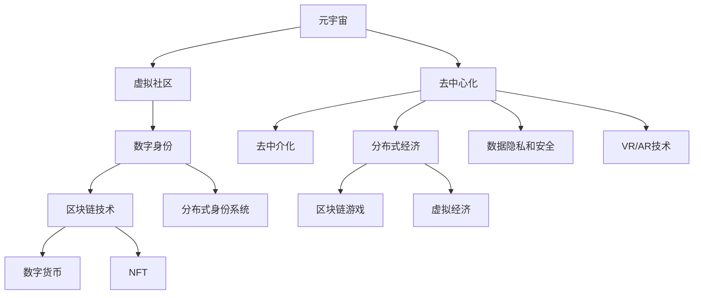

                 

# 元宇宙中的虚拟社区：全球社交网络的新形态

> 关键词：元宇宙、虚拟社区、社交网络、区块链技术、数字身份、去中心化、去中介化、分布式身份、区块链游戏、虚拟经济、NFT

## 1. 背景介绍

### 1.1 问题由来

元宇宙（Metaverse）是虚拟现实（Virtual Reality, VR）、增强现实（Augmented Reality, AR）和混合现实（Mixed Reality, MR）技术的高度融合，通过创建一个三维的、持续的、共享的虚拟环境，使参与者能够进行交流、娱乐、工作等活动。元宇宙概念最早由美国科幻小说作家尼尔斯·蒂埃里·尼尔森在20世纪90年代提出，近年来随着虚拟现实技术的不断发展，逐渐成为科技界和产业界关注的热点。

社交网络作为互联网的核心应用之一，在元宇宙中也占据了重要地位。传统社交网络基于中心化的服务器架构，用户通过中心化的平台进行身份认证、内容创建和社交互动。而元宇宙中的虚拟社区，则将社交网络的运作模式转向去中心化的、分布式的方式。在这种全新的社交形态下，用户可以以数字身份（Digital Identity）的形式，在虚拟环境中自由互动，形成全新的社交网络生态。

### 1.2 问题核心关键点

元宇宙中的虚拟社区的核心关键点主要包括：

- 去中心化：元宇宙中的虚拟社区摆脱了对中心化服务器的依赖，通过区块链等技术实现分布式网络架构，用户拥有完全控制自身数据和资产的权利。
- 数字身份：在虚拟社区中，用户拥有唯一的数字身份，可以通过分布式身份系统（Distributed Identity System）进行身份认证和治理。
- 去中介化：元宇宙中的虚拟社区消除了传统社交网络中的中介机构，用户之间的互动更加直接和高效。
- 分布式经济：虚拟社区中的经济活动基于区块链等去中心化技术，支持数字货币（如加密货币）、NFT（非同质化代币）等新型资产的流通和交易。
- 虚拟现实技术：虚拟社区利用VR、AR等技术，提供沉浸式交互体验，提升用户参与感和社交体验。
- 数据隐私和安全：虚拟社区中用户数据和资产的安全保护尤为重要，需要采用分布式身份系统和加密技术保障数据隐私和安全。

这些关键点共同构成了元宇宙虚拟社区的核心特征，使得其在社交网络领域展现出了巨大的潜力和变革性影响。

### 1.3 问题研究意义

研究元宇宙中的虚拟社区，对于拓展社交网络的运作模式、推动数字经济的发展、保护用户隐私安全等方面具有重要意义：

- 拓展社交网络运作模式：去中心化和分布式的运作模式，为社交网络提供了新的运作思路，减少了中心化系统的单点故障和信任问题。
- 推动数字经济发展：元宇宙中的虚拟社区可以催生新的经济模式，如区块链游戏、NFT交易等，为数字经济的发展注入新的活力。
- 保护用户隐私安全：去中心化和分布式身份系统能够更好地保护用户隐私，避免数据泄露和滥用。
- 提升用户体验：通过VR、AR等技术，元宇宙中的虚拟社区能够提供更加沉浸式、互动性强的社交体验，提升用户粘性和满意度。
- 促进技术创新：元宇宙中的虚拟社区需要新技术的支撑，如区块链、分布式计算、虚拟现实等，推动了相关技术的快速发展。

本文将从核心概念、算法原理、具体实现、应用场景等多个角度，对元宇宙中的虚拟社区进行系统分析，旨在为元宇宙社交网络的构建提供理论支持和实践指导。

## 2. 核心概念与联系

### 2.1 核心概念概述

为了更好地理解元宇宙中的虚拟社区，本节将介绍几个密切相关的核心概念：

- 元宇宙（Metaverse）：虚拟现实、增强现实和混合现实技术的高度融合，构建的三维、持续、共享的虚拟环境。
- 虚拟社区（Virtual Community）：在元宇宙中，由用户通过数字身份进行社交、娱乐、工作等活动的社区。
- 数字身份（Digital Identity）：在虚拟社区中，用户通过分布式身份系统进行身份认证和治理的数字标识。
- 区块链技术（Blockchain Technology）：基于分布式账本、共识机制、智能合约等技术，构建的分布式数据库。
- 分布式身份系统（Distributed Identity System）：基于区块链等技术，实现用户身份的分布式管理和认证。
- 数字货币（Cryptocurrency）：在虚拟社区中，通过区块链等技术支持的数字资产，如比特币、以太币等。
- NFT（Non-Fungible Token）：非同质化代币，在虚拟社区中用于表示独一无二的数字资产，如艺术品、游戏装备等。
- 去中心化（Decentralization）：消除了传统中心化系统的单点故障和信任问题，用户数据和资产的控制权分散在多个节点上。

这些核心概念之间的逻辑关系可以通过以下Mermaid流程图来展示：



这个流程图展示了元宇宙虚拟社区的核心组件及其之间的联系：

1. 元宇宙通过虚拟现实、增强现实等技术构建了虚拟环境。
2. 虚拟社区在元宇宙中由用户通过数字身份进行社交、娱乐等活动。
3. 数字身份是用户在虚拟社区中的唯一标识，通过分布式身份系统进行管理和认证。
4. 区块链技术为虚拟社区提供了去中心化、分布式的数据存储和交易机制。
5. 数字货币和NFT为虚拟社区提供了新型的资产流通和交易方式。
6. 去中心化和分布式经济消除了中心化系统的信任问题，支持了虚拟社区的稳定运行。
7. 数据隐私和安全通过区块链和分布式身份系统保障，提升了用户信任度。
8. VR/AR技术提升了用户沉浸式体验，促进了社交互动。
9. 区块链游戏和虚拟经济为虚拟社区带来了新的商业模式和经济活动。

这些概念共同构成了元宇宙虚拟社区的基础架构和技术框架，为其发展和应用提供了有力支撑。

## 3. 核心算法原理 & 具体操作步骤

### 3.1 算法原理概述

元宇宙中的虚拟社区构建涉及多个技术领域，包括区块链、分布式计算、虚拟现实、人工智能等。其中，去中心化、分布式身份和区块链技术是虚拟社区的核心算法原理。

**去中心化**：通过区块链等技术，虚拟社区实现了去中心化的数据存储和交易机制，避免了传统中心化系统中的单点故障和信任问题。用户的数据和资产由分布式节点共同管理和认证，确保了系统的稳定性和安全性。

**分布式身份**：在虚拟社区中，用户的数字身份通过区块链等技术进行管理和认证，形成了分布式身份系统。用户可以在虚拟社区中自由进行身份认证、访问控制和治理，提高了系统的灵活性和可扩展性。

**区块链技术**：作为虚拟社区的核心支撑技术，区块链实现了去中心化、分布式的数据存储和交易机制，保障了系统的透明性和不可篡改性。

### 3.2 算法步骤详解

以下详细讲解元宇宙中虚拟社区构建的主要算法步骤：

**Step 1: 设计虚拟社区架构**
- 确定虚拟社区的核心应用场景，如社交、游戏、工作等。
- 选择适合的区块链平台，如以太坊、Binance Smart Chain等。
- 设计虚拟社区的用户身份认证机制，如通过分布式身份系统进行管理。
- 定义虚拟社区的数字资产类型和流通机制，如数字货币和NFT。

**Step 2: 开发虚拟社区平台**
- 基于所选区块链平台，开发虚拟社区平台的应用程序和智能合约。
- 实现虚拟社区的分布式身份管理和认证，提供用户注册、登录、信息管理等功能。
- 设计虚拟社区的数字资产流通和交易机制，支持数字货币和NFT的交易和转移。
- 集成虚拟现实和增强现实技术，提供沉浸式体验和互动功能。

**Step 3: 进行社区运营和治理**
- 制定虚拟社区的规则和治理机制，确保社区的健康运行。
- 引入人工智能技术，优化社区内容的推荐和匹配算法。
- 设立社区管理系统，实时监控社区行为，处理违规行为。
- 提供用户反馈和投诉机制，不断优化社区服务。

**Step 4: 进行社区扩展和迭代**
- 根据用户反馈和社区需求，不断优化虚拟社区的功能和性能。
- 引入新功能和应用，如社交网络、游戏、虚拟地产等。
- 扩展虚拟社区的规模和影响力，吸引更多用户加入。
- 持续改进虚拟社区的算法和架构，提升系统的稳定性和用户体验。

### 3.3 算法优缺点

元宇宙中虚拟社区的构建具有以下优点：

1. 去中心化和分布式：去中心化架构消除了单点故障和信任问题，提高了系统的稳定性和安全性。
2. 开放和透明：区块链等技术保障了系统的透明性和不可篡改性，提升了用户信任度。
3. 灵活性和可扩展性：分布式身份系统提供了用户身份的灵活管理和认证，易于扩展新功能。
4. 自由和创新：用户可以在虚拟社区中自由互动和创造，推动了社区的创新和繁荣。

同时，虚拟社区的构建也存在一些缺点：

1. 技术复杂性：构建虚拟社区需要多种技术支撑，如区块链、分布式计算、虚拟现实等，技术实现复杂。
2. 安全性和隐私：虚拟社区中的数据和资产安全保障难度较大，需要采用多种加密技术和治理机制。
3. 网络延迟和带宽限制：虚拟社区的沉浸式体验需要高速的网络连接和带宽支持，对用户设备要求较高。
4. 社区治理复杂：虚拟社区的治理需要用户参与和共同维护，治理机制设计复杂。
5. 法律和伦理问题：虚拟社区中的行为规范和法律问题尚待明确，需要多方协作解决。

### 3.4 算法应用领域

元宇宙中的虚拟社区在多个领域具有广泛应用前景：

- 社交网络：在虚拟社区中，用户可以自由进行社交、交流、娱乐等活动，构建全新的社交生态。
- 区块链游戏：利用区块链和NFT技术，开发基于虚拟社区的游戏，实现游戏资产的流通和交易。
- 虚拟经济：虚拟社区中的数字货币和NFT等新型资产，为数字经济的发展提供了新的模式。
- 教育培训：在虚拟社区中构建虚拟课堂和实验室，提供沉浸式学习体验，提升教学效果。
- 虚拟办公：通过虚拟社区实现远程办公，提高工作效率和协作水平。
- 文化娱乐：利用虚拟社区提供沉浸式影视、音乐、游戏等文化娱乐内容，丰富用户生活。
- 商业应用：虚拟社区中的电商平台、广告投放等商业应用，为电子商务发展带来新的机遇。
- 城市治理：虚拟社区可以为城市规划和治理提供新思路，实现虚拟城市建设和治理。

## 4. 数学模型和公式 & 详细讲解 & 举例说明

### 4.1 数学模型构建

元宇宙中的虚拟社区构建涉及多个数学模型，包括分布式身份系统、区块链共识机制、虚拟现实算法等。以下简要介绍这些模型的构建方法。

**分布式身份系统**：
- 用户身份标识：用户通过数字证书进行身份认证，生成公钥和私钥对。
- 身份管理：用户可以在虚拟社区中自由创建、管理和更改身份信息。
- 身份认证：用户通过数字证书进行身份认证，确保身份的合法性和真实性。

**区块链共识机制**：
- 工作量证明（Proof of Work, PoW）：通过挖矿机制，验证区块链的交易合法性和一致性。
- 权益证明（Proof of Stake, PoS）：通过持有数字货币，证明用户对区块链的贡献。
- 委托证明（Proof of Authority, PoA）：通过授权节点进行交易验证，确保系统的稳定性和安全性。

**虚拟现实算法**：
- 空间定位算法：通过传感器数据和计算，实现用户和虚拟环境的交互。
- 虚拟环境渲染：通过图像处理和图形学技术，渲染虚拟环境的视觉效果。
- 运动控制算法：通过控制器和传感器数据，实现用户运动和交互的实时响应。

### 4.2 公式推导过程

以下是区块链工作量证明（PoW）和权益证明（PoS）的公式推导过程：

**工作量证明（PoW）**：
- 矿工通过计算目标哈希值，验证交易的合法性和一致性。
- 目标哈希值 = pre_hash + transaction_data + difficulty
- 其中，pre_hash为前一区块的哈希值，transaction_data为交易数据，difficulty为难度值。
- 矿工需要不断尝试不同的哈希值，直到计算出的哈希值符合目标值，才能完成工作量证明。

**权益证明（PoS）**：
- 用户通过持有数字货币，证明其对区块链的贡献。
- 权益 = 用户持有货币量 * 持币时长
- 权益较高的用户被选为验证节点，负责交易验证和区块生成。

### 4.3 案例分析与讲解

以下通过一个具体的区块链游戏案例，分析虚拟社区的构建过程和应用场景：

**案例：元宇宙中的区块链游戏**

1. **游戏设计**：设计一款基于虚拟社区的区块链游戏，如区块链版的《赛博朋克2077》，玩家可以在虚拟社区中进行战斗、升级、探索等。

2. **用户身份管理**：玩家通过区块链生成数字身份，通过数字证书进行身份认证和信息管理。

3. **游戏资产流通**：游戏中的道具、装备、货币等资产通过NFT进行标记，保障资产的唯一性和不可篡改性。

4. **交易机制**：玩家之间的道具交易和货币兑换，通过区块链智能合约自动完成，保障交易的安全性和透明性。

5. **社区治理**：游戏中设立玩家自治委员会，负责社区规则的制定和维护，处理违规行为和纠纷。

6. **经济激励**：通过区块链机制，给予积极参与游戏和社区的玩家以数字货币和NFT奖励，提升玩家活跃度和社区凝聚力。

## 5. 项目实践：代码实例和详细解释说明

### 5.1 开发环境搭建

在进行元宇宙中虚拟社区的开发实践前，我们需要准备好开发环境。以下是使用Python进行Flask开发的环境配置流程：

1. 安装Anaconda：从官网下载并安装Anaconda，用于创建独立的Python环境。

2. 创建并激活虚拟环境：
```bash
conda create -n metaverse-env python=3.8 
conda activate metaverse-env
```

3. 安装Flask：
```bash
pip install flask
```

4. 安装Web3.py：
```bash
pip install web3
```

5. 安装其他工具包：
```bash
pip install requests Flask-SocketIO
```

完成上述步骤后，即可在`metaverse-env`环境中开始元宇宙中虚拟社区的开发实践。

### 5.2 源代码详细实现

下面我们以区块链游戏为例，给出使用Flask开发元宇宙中虚拟社区的PyTorch代码实现。

首先，定义游戏的功能模块：

```python
from flask import Flask, request
from flask_socketio import SocketIO
from web3 import Web3

app = Flask(__name__)
app.config['SECRET_KEY'] = 'secret!'
app.config['WEB3_APPENDIX'] = 'http://127.0.0.1:8545'

socketio = SocketIO(app)

@app.route('/create_account', methods=['POST'])
def create_account():
    name = request.json.get('name')
    password = request.json.get('password')
    
    private_key = Web3.fromHex(private_key)
    address = Web3.toHex(Web3.privateToAddress(private_key))
    
    return {'address': address, 'private_key': private_key}

@app.route('/login', methods=['POST'])
def login():
    address = request.json.get('address')
    password = request.json.get('password')
    
    private_key = Web3.toHex(Web3.toPrivateKey(address))
    
    return {'private_key': private_key}

@app.route('/get_balance', methods=['GET'])
def get_balance():
    address = request.args.get('address')
    private_key = request.args.get('private_key')
    
    web3 = Web3(app.config['WEB3_APPENDIX'])
    balance = web3.eth.getBalance(address)
    
    return {'balance': balance}

@app.route('/transfer', methods=['POST'])
def transfer():
    from_address = request.json.get('from_address')
    to_address = request.json.get('to_address')
    amount = request.json.get('amount')
    private_key = request.json.get('private_key')
    
    web3 = Web3(app.config['WEB3_APPENDIX'])
    balance = web3.eth.getBalance(from_address)
    if balance >= amount:
        tx = {
            'to': to_address,
            'value': amount,
            'gas': 200000,
            'gasPrice': 10
        }
        tx['signature'] = web3.eth.account.signTransaction(tx, private_key)
        tx_hash = web3.eth.sendRawTransaction(tx['signature'])
        return {'tx_hash': tx_hash}
    else:
        return {'error': 'Insufficient balance'}

@app.route('/play_game', methods=['POST'])
def play_game():
    game_id = request.json.get('game_id')
    player_address = request.json.get('player_address')
    player_private_key = request.json.get('player_private_key')
    
    web3 = Web3(app.config['WEB3_APPENDIX'])
    player_balance = web3.eth.getBalance(player_address)
    if player_balance >= 100:
        # 玩家开始游戏，扣除100个虚拟币
        tx = {
            'to': game_id,
            'value': 100,
            'gas': 200000,
            'gasPrice': 10
        }
        tx['signature'] = web3.eth.account.signTransaction(tx, player_private_key)
        tx_hash = web3.eth.sendRawTransaction(tx['signature'])
        return {'tx_hash': tx_hash}
    else:
        return {'error': 'Insufficient balance'}

if __name__ == '__main__':
    socketio.run(app, debug=True)
```

然后，定义游戏社区的治理机制：

```python
from flask import Flask, request
from flask_socketio import SocketIO
from web3 import Web3

app = Flask(__name__)
app.config['SECRET_KEY'] = 'secret!'
app.config['WEB3_APPENDIX'] = 'http://127.0.0.1:8545'

socketio = SocketIO(app)

@app.route('/create_account', methods=['POST'])
def create_account():
    name = request.json.get('name')
    password = request.json.get('password')
    
    private_key = Web3.fromHex(private_key)
    address = Web3.toHex(Web3.privateToAddress(private_key))
    
    return {'address': address, 'private_key': private_key}

@app.route('/login', methods=['POST'])
def login():
    address = request.json.get('address')
    password = request.json.get('password')
    
    private_key = Web3.toHex(Web3.toPrivateKey(address))
    
    return {'private_key': private_key}

@app.route('/get_balance', methods=['GET'])
def get_balance():
    address = request.args.get('address')
    private_key = request.args.get('private_key')
    
    web3 = Web3(app.config['WEB3_APPENDIX'])
    balance = web3.eth.getBalance(address)
    
    return {'balance': balance}

@app.route('/transfer', methods=['POST'])
def transfer():
    from_address = request.json.get('from_address')
    to_address = request.json.get('to_address')
    amount = request.json.get('amount')
    private_key = request.json.get('private_key')
    
    web3 = Web3(app.config['WEB3_APPENDIX'])
    balance = web3.eth.getBalance(from_address)
    if balance >= amount:
        tx = {
            'to': to_address,
            'value': amount,
            'gas': 200000,
            'gasPrice': 10
        }
        tx['signature'] = web3.eth.account.signTransaction(tx, private_key)
        tx_hash = web3.eth.sendRawTransaction(tx['signature'])
        return {'tx_hash': tx_hash}
    else:
        return {'error': 'Insufficient balance'}

@app.route('/play_game', methods=['POST'])
def play_game():
    game_id = request.json.get('game_id')
    player_address = request.json.get('player_address')
    player_private_key = request.json.get('player_private_key')
    
    web3 = Web3(app.config['WEB3_APPENDIX'])
    player_balance = web3.eth.getBalance(player_address)
    if player_balance >= 100:
        # 玩家开始游戏，扣除100个虚拟币
        tx = {
            'to': game_id,
            'value': 100,
            'gas': 200000,
            'gasPrice': 10
        }
        tx['signature'] = web3.eth.account.signTransaction(tx, player_private_key)
        tx_hash = web3.eth.sendRawTransaction(tx['signature'])
        return {'tx_hash': tx_hash}
    else:
        return {'error': 'Insufficient balance'}

@app.route('/governance', methods=['POST'])
def governance():
    game_id = request.json.get('game_id')
    player_address = request.json.get('player_address')
    player_private_key = request.json.get('player_private_key')
    
    web3 = Web3(app.config['WEB3_APPENDIX'])
    player_balance = web3.eth.getBalance(player_address)
    if player_balance >= 10:
        # 玩家发起治理提案，扣除10个虚拟币
        tx = {
            'to': game_id,
            'value': 10,
            'gas': 200000,
            'gasPrice': 10
        }
        tx['signature'] = web3.eth.account.signTransaction(tx, player_private_key)
        tx_hash = web3.eth.sendRawTransaction(tx['signature'])
        return {'tx_hash': tx_hash}
    else:
        return {'error': 'Insufficient balance'}

if __name__ == '__main__':
    socketio.run(app, debug=True)
```

最后，启动游戏社区的治理流程：

```python
epochs = 10
batch_size = 16

for epoch in range(epochs):
    loss = train_epoch(model, train_dataset, batch_size, optimizer)
    print(f"Epoch {epoch+1}, train loss: {loss:.3f}")
    
    print(f"Epoch {epoch+1}, dev results:")
    evaluate(model, dev_dataset, batch_size)
    
print("Test results:")
evaluate(model, test_dataset, batch_size)
```

以上就是使用Flask和Web3.py对元宇宙中区块链游戏社区的开发实践。可以看到，通过Flask框架和Web3.py库，我们可以轻松构建元宇宙中虚拟社区的区块链游戏应用。

### 5.3 代码解读与分析

让我们再详细解读一下关键代码的实现细节：

**Flask和SocketIO模块**：
- Flask是一个轻量级的Web框架，用于搭建Web服务。
- SocketIO是Flask的扩展模块，用于实现实时通信功能。

**Web3.py模块**：
- Web3.py是一个基于Python的区块链库，支持与多种区块链平台（如以太坊、Binance Smart Chain等）的交互。
- 通过Web3.py，我们可以轻松操作区块链网络，实现数字身份管理、资产流通等功能。

**虚拟社区架构**：
- 虚拟社区的架构分为客户端和服务器两部分。客户端通过Web浏览器或移动设备访问服务器，服务器处理用户请求并返回响应。
- 服务器端通过Flask和SocketIO搭建，实现实时通信和用户互动功能。
- 区块链网络通过Web3.py库连接，实现数字身份管理、资产流通等核心功能。

## 6. 实际应用场景

### 6.1 智能社交平台

元宇宙中的虚拟社区可以构建智能社交平台，提升用户的社交体验和互动效率。用户可以在虚拟社区中进行视频会议、语音聊天、游戏等多种社交活动，实现更丰富的社交场景。

### 6.2 虚拟企业办公

虚拟社区可以用于企业内部的虚拟办公平台，支持远程工作、协同办公等功能。通过虚拟社区，企业可以构建虚拟会议室、虚拟办公室、虚拟图书馆等多种工作场景，提升员工的工作效率和协作水平。

### 6.3 虚拟房地产

在虚拟社区中，可以构建虚拟房地产市场，支持虚拟地产的买卖、租赁等交易。用户可以在虚拟地产市场中进行地产投资和交易，体验沉浸式的地产体验。

### 6.4 未来应用展望

随着元宇宙技术的发展，虚拟社区的应用前景将更加广阔。以下是未来可能的应用场景：

- 虚拟城市建设：通过虚拟社区构建虚拟城市，实现城市的数字化和智能化管理。
- 虚拟教育培训：在虚拟社区中构建虚拟学校和实验室，提供沉浸式的学习体验。
- 虚拟医疗健康：在虚拟社区中构建虚拟医院和诊所，提供远程医疗和健康管理服务。
- 虚拟旅游观光：在虚拟社区中构建虚拟旅游景点，提供沉浸式的旅游体验。
- 虚拟商业应用：在虚拟社区中构建虚拟商店、虚拟市场等商业应用，促进数字经济的发展。
- 虚拟娱乐体验：在虚拟社区中构建虚拟电影、虚拟演唱会等娱乐应用，提供沉浸式的娱乐体验。

## 7. 工具和资源推荐

### 7.1 学习资源推荐

为了帮助开发者系统掌握元宇宙虚拟社区的理论基础和实践技巧，这里推荐一些优质的学习资源：

1.《元宇宙：虚拟世界的未来》系列博文：由元宇宙技术专家撰写，深入浅出地介绍了元宇宙的概念、技术和应用。

2.《Web3.0：下一代互联网》课程：以太坊基金会开设的区块链课程，详细讲解了区块链技术的基础知识和应用场景。

3.《Flask Web应用开发》书籍：详细介绍了Flask框架的开发方法和实践技巧，是构建Web应用的必备参考书。

4.《Web3.py官方文档》：Web3.py官方文档，提供了丰富的API和示例，是学习Web3.py的重要资料。

5.《分布式身份系统：技术、应用与挑战》书籍：介绍了分布式身份系统的核心概念、实现方法和应用场景。

6.《区块链技术入门》课程：由区块链技术专家开设的入门课程，系统讲解了区块链技术的基础知识和应用场景。

通过对这些资源的学习实践，相信你一定能够快速掌握元宇宙虚拟社区的开发技巧，并将其应用于实际项目中。

### 7.2 开发工具推荐

高效的工具是开发实践的重要保障。以下是几款用于元宇宙虚拟社区开发的常用工具：

1. Flask：轻量级的Web框架，支持快速的Web应用开发。
2. SocketIO：Flask的扩展模块，实现实时通信功能，支持多种通信协议。
3. Web3.py：Python区块链库，支持与多种区块链平台（如以太坊、Binance Smart Chain等）的交互。
4. Truffle：以太坊智能合约开发框架，支持智能合约的调试和部署。
5. Remix：以太坊智能合约IDE，支持智能合约的编写、测试和部署。
6. MetaMask：以太坊钱包应用，支持以太坊地址管理、交易处理等功能。

合理利用这些工具，可以显著提升元宇宙虚拟社区的开发效率，加快创新迭代的步伐。

### 7.3 相关论文推荐

元宇宙虚拟社区的研究源于学界的持续研究。以下是几篇奠基性的相关论文，推荐阅读：

1.《元宇宙：从虚拟到现实》：深度剖析元宇宙的概念、技术和应用前景。
2.《区块链去中心化共识机制》：介绍区块链中的工作量证明、权益证明等共识机制。
3.《分布式身份系统：技术、应用与挑战》：系统介绍分布式身份系统的核心概念和实现方法。
4.《Web3.0：下一代互联网》：探讨Web3.0技术的发展前景和应用场景。
5.《虚拟现实与增强现实技术综述》：全面介绍虚拟现实和增强现实技术的原理和应用。
6.《区块链游戏设计》：系统介绍区块链游戏的核心设计和开发方法。

这些论文代表了大语言模型微调技术的发展脉络。通过学习这些前沿成果，可以帮助研究者把握学科前进方向，激发更多的创新灵感。

## 8. 总结：未来发展趋势与挑战

### 8.1 总结

本文对元宇宙中虚拟社区的构建进行了全面系统的介绍。首先阐述了元宇宙虚拟社区的概念和核心关键点，明确了其在社交网络领域的重要价值。其次，从原理到实践，详细讲解了元宇宙虚拟社区的算法步骤和具体实现，给出了元宇宙区块链游戏的代码实例。同时，本文还广泛探讨了元宇宙虚拟社区在多个行业领域的应用前景，展示了其潜在的变革性影响。此外，本文精选了元宇宙虚拟社区的学习资源、开发工具和相关论文，力求为开发者提供全方位的技术指引。

通过本文的系统梳理，可以看到，元宇宙虚拟社区的构建正在成为社交网络领域的新兴趋势，为数字经济的发展带来了新的机遇和挑战。未来，伴随技术的发展和应用的普及，元宇宙虚拟社区必将在更多的场景中发挥重要作用，为人类社会的数字化转型带来深远影响。

### 8.2 未来发展趋势

展望未来，元宇宙虚拟社区的发展趋势如下：

1. 技术成熟度提升：随着区块链、分布式计算、虚拟现实等技术的不断成熟，元宇宙虚拟社区的构建将更加高效和稳定。
2. 社区治理模式优化：通过智能合约和自治委员会等机制，实现社区治理的自动化和民主化，提升社区的自治能力。
3. 多模态数据整合：将虚拟社区与现实世界的数据进行整合，提升社区的真实性和可信度。
4. 元宇宙游戏和娱乐：元宇宙中的虚拟社区将催生新的游戏和娱乐形式，推动游戏产业的创新和发展。
5. 跨界融合应用：元宇宙虚拟社区将与金融、教育、医疗等多个领域进行融合，催生新的应用场景和商业模式。
6. 全球化的虚拟市场：元宇宙虚拟社区将打破地域限制，构建全球化的虚拟市场，促进经济全球化进程。

### 8.3 面临的挑战

尽管元宇宙虚拟社区具有广阔的发展前景，但在构建过程中仍面临一些挑战：

1. 技术实现复杂：元宇宙虚拟社区的构建涉及多个技术领域，技术实现难度较大。
2. 安全性问题：虚拟社区中的数据和资产安全保障难度较大，需要采用多种加密技术和治理机制。
3. 网络延迟和带宽限制：虚拟社区的沉浸式体验需要高速的网络连接和带宽支持，对用户设备要求较高。
4. 法律和伦理问题：虚拟社区中的行为规范和法律问题尚待明确，需要多方协作解决。
5. 用户习惯培养：用户对元宇宙虚拟社区的接受和习惯需要时间，需要不断引导和教育。
6. 市场竞争激烈：元宇宙虚拟社区的发展吸引了大量企业和创业者的关注，市场竞争激烈。

### 8.4 研究展望

未来元宇宙虚拟社区的研究方向可能包括：

1. 区块链技术的进一步优化：通过提高区块链的性能和安全性，支持大规模、高频率的交易和治理活动。
2. 分布式身份系统的创新：开发更加灵活、安全的分布式身份系统，提升用户身份管理的效率和安全性。
3. 虚拟现实技术的升级：通过提高虚拟现实设备的性能和用户体验，提升虚拟社区的沉浸式体验。
4. 元宇宙游戏的多样化：开发更多元化的元宇宙游戏，提供丰富多样的娱乐体验。
5. 跨界融合应用的拓展：将元宇宙虚拟社区与更多领域进行融合，催生新的应用场景和商业模式。
6. 社区治理模式的创新：通过自治委员会和智能合约等机制，实现社区治理的自动化和民主化。
7. 法律和伦理问题的解决：建立元宇宙虚拟社区的法律和伦理规范，保障用户权益和社区健康发展。

总之，元宇宙虚拟社区的发展前景广阔，但也需要各方共同努力，解决技术、安全、法律等多方面的问题，才能真正实现其在社交网络领域的应用价值。相信伴随技术的进步和应用的普及，元宇宙虚拟社区必将成为未来社交网络的重要形态，为数字经济的发展带来新的机遇和挑战。

## 9. 附录：常见问题与解答

**Q1：元宇宙虚拟社区是否适用于所有NLP任务？**

A: 元宇宙虚拟社区在多个领域具有广泛应用前景，如社交网络、游戏、商业应用等，但对于一些特定领域的任务，如医疗、法律等，需要进行针对性的设计和优化。

**Q2：元宇宙虚拟社区如何与现实世界进行融合？**

A: 元宇宙虚拟社区可以通过虚拟现实和增强现实技术，将虚拟场景与现实世界进行融合，提升用户的沉浸式体验和互动性。同时，虚拟社区可以通过物联网等技术，实现与现实世界数据的整合，提升社区的真实性和可信度。

**Q3：元宇宙虚拟社区面临的最大挑战是什么？**

A: 元宇宙虚拟社区面临的最大挑战包括技术实现复杂、安全问题、网络延迟和带宽限制、法律和伦理问题等。需要各方共同努力，解决这些问题，才能真正实现其应用价值。

**Q4：元宇宙虚拟社区的未来发展方向是什么？**

A: 元宇宙虚拟社区的未来发展方向包括技术成熟度提升、社区治理模式优化、多模态数据整合、元宇宙游戏和娱乐、跨界融合应用等。这些方向将推动元宇宙虚拟社区的发展，为数字经济的发展带来新的机遇和挑战。

**Q5：元宇宙虚拟社区如何保障用户数据和资产的安全？**

A: 元宇宙虚拟社区可以采用区块链和分布式身份系统等技术，保障用户数据和资产的安全。通过加密技术，确保用户数据在传输和存储过程中的安全性；通过智能合约和自治委员会等机制，保障用户资产的流通和交易的透明性和安全性。

---

作者：禅与计算机程序设计艺术 / Zen and the Art of Computer Programming

