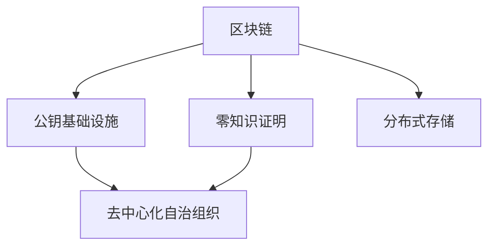

                 

# 元宇宙中的身份认证:去中心化信任体系

在元宇宙（Metaverse）这一新兴的数字世界中，身份认证是保障用户隐私、安全和参与度的基石。传统的中心化信任体系面临着单点故障、隐私泄露、数据垄断等严重问题，急需变革。本文将探讨在元宇宙中实现去中心化身份认证的原理、技术、优势及其在实际应用中的场景。

## 1. 背景介绍

### 1.1 问题由来

随着虚拟现实（VR）、增强现实（AR）、区块链等技术的成熟，元宇宙正逐渐从科幻变为现实。虚拟世界的广阔场景、沉浸体验和多元社交需求，使得身份认证这一环节变得至关重要。

传统的中心化身份认证体系依赖于第三方认证机构，如银行、政府机构等，用户必须提供身份证明信息，第三方再对信息进行验证和存储。这种模式在提升安全性的同时，也带来了一系列问题：

1. **隐私泄露**：用户的身份信息和行为轨迹会被中心化机构收集，存在被滥用的风险。
2. **单点故障**：第三方机构出现故障或被攻击，可能导致大量用户无法正常登录和使用服务。
3. **数据垄断**：用户数据掌握在少数几家巨头手中，难以自由流动和交换。

去中心化身份认证（Decentralized Identity, DID）通过区块链技术，为用户在无需第三方中介的情况下，实现自主、安全、可控的身份管理。

### 1.2 问题核心关键点

去中心化身份认证的核心在于：
1. **自主管理**：用户掌握自己的身份数据，不受第三方控制。
2. **安全传输**：通过加密技术确保身份数据在传输过程中的安全性。
3. **可验证性**：用户能够证明自己的身份，证明方式可被多方信任。
4. **隐私保护**：保护用户隐私，防止数据滥用。

### 1.3 问题研究意义

去中心化身份认证能够提升用户隐私保护水平，增强网络的安全性和用户自主性，为元宇宙的广泛应用和可持续发展提供重要保障。同时，它也能促进数据共享和跨平台、跨机构间的互操作性，为元宇宙中的各类应用和场景提供统一的身份管理解决方案。

## 2. 核心概念与联系

### 2.1 核心概念概述

以下概念是理解去中心化身份认证的重要基础：

- **区块链**：一种去中心化的分布式账本技术，通过共识机制确保数据的安全性和不可篡改性。
- **公钥基础设施（PKI）**：一种基于公钥密码学的身份认证体系，用于保证通信双方身份的真实性和安全性。
- **零知识证明（Zero-Knowledge Proof, ZKP）**：一种加密技术，允许一方在不泄露自身秘密信息的前提下，向另一方证明自己知道某个值。
- **去中心化自治组织（DAO）**：一种基于区块链技术的去中心化组织形式，通过智能合约自动执行决策和操作。
- **分布式存储（Distributed Storage）**：一种将数据分散存储在多个节点上的技术，提高数据的可用性和冗余性。

### 2.2 核心概念联系

这些核心概念通过区块链技术相互连接，共同构成了去中心化身份认证的技术框架。区块链为去中心化身份认证提供了数据存储和验证的基础设施，公钥基础设施提供了安全的身份认证和密钥管理机制，零知识证明确保了隐私保护，DAO保证了系统的自治性和安全性，分布式存储增强了数据的可用性和冗余性。



### 2.3 核心概念原理

#### 2.3.1 区块链原理

区块链由多个区块按照哈希指针连接形成，每个区块包含一段时间内的交易记录。区块链通过共识机制（如工作量证明PoW、权益证明PoS等），保证网络中的节点能够达成共识，防止篡改。

#### 2.3.2 公钥基础设施原理

公钥基础设施基于非对称加密算法，包含公钥和私钥。用户通过数字证书机构（CA）获得公钥，他人通过验证证书中的数字签名，确认公钥的真实性。通信双方通过公钥进行加密通信，确保消息的机密性和完整性。

#### 2.3.3 零知识证明原理

零知识证明允许一方在不泄露自身秘密信息的前提下，向另一方证明自己知道某个值。这种证明机制通过数学定理（如哈希函数、椭圆曲线密码学等）实现，保证证明过程的可靠性和隐私性。

#### 2.3.4 去中心化自治组织原理

DAO通过智能合约（Smart Contract）实现自治。智能合约是一种运行在区块链上的代码，能够自动执行预定义的规则和逻辑，确保系统的透明性和公正性。

#### 2.3.5 分布式存储原理

分布式存储将数据分散存储在多个节点上，每个节点只存储数据的局部视图，确保数据的冗余性和可用性。通过数据冗余和跨节点同步，实现系统的容错和高可用性。

## 3. 核心算法原理 & 具体操作步骤

### 3.1 算法原理概述

去中心化身份认证的核心算法包括区块链技术、公钥基础设施、零知识证明和智能合约。

1. **区块链技术**：提供数据存储和验证的基础设施，确保数据的安全性和不可篡改性。
2. **公钥基础设施**：实现安全的身份认证和密钥管理，确保通信双方的真实性和安全性。
3. **零知识证明**：确保用户隐私，防止身份信息泄露。
4. **智能合约**：实现自治和自动化操作，确保系统的透明性和公正性。

### 3.2 算法步骤详解

#### 3.2.1 用户身份创建

1. 用户生成一个私钥，使用私钥生成公钥。
2. 用户通过数字证书机构（CA）获得数字证书，证书包含公钥、有效期等信息。
3. 用户将数字证书存储在区块链上，形成数字身份。

#### 3.2.2 用户身份认证

1. 用户向服务提供商（SP）提交数字证书。
2. SP通过验证数字证书中的数字签名，确认用户身份的真实性。
3. SP将用户身份信息存储在区块链上，形成用户认证记录。

#### 3.2.3 用户身份验证

1. 用户向服务提供商（SP）请求访问服务。
2. SP使用用户的数字证书进行身份验证，确保用户身份的真实性。
3. SP将验证结果返回给用户，用户通过身份信息完成访问。

### 3.3 算法优缺点

#### 3.3.1 优点

1. **自主管理**：用户掌握自己的身份数据，不受第三方控制。
2. **隐私保护**：零知识证明和分布式存储技术确保用户隐私不被泄露。
3. **安全性和去中心化**：区块链和智能合约提供去中心化基础设施，确保系统的安全性和自治性。
4. **可验证性**：通过数字证书和公钥基础设施，用户能够证明自己的身份。

#### 3.3.2 缺点

1. **技术复杂性**：去中心化身份认证需要复杂的区块链和加密技术支持。
2. **性能瓶颈**：区块链共识机制和智能合约的执行可能导致性能瓶颈。
3. **标准化问题**：不同平台和机构之间的标准不统一，可能影响互操作性。

### 3.4 算法应用领域

去中心化身份认证适用于多种场景，包括但不限于：

1. **元宇宙虚拟世界**：用户能够自由创建和交换数字身份，参与虚拟世界的活动和交易。
2. **数字金融**：用户通过去中心化身份认证，实现跨机构、跨平台的安全交易。
3. **供应链管理**：企业通过去中心化身份认证，实现供应链各环节的透明化和可追溯性。
4. **智能合约执行**：智能合约通过去中心化身份认证，自动执行预定义的规则和操作，提高系统的透明度和公正性。

## 4. 数学模型和公式 & 详细讲解 & 举例说明

### 4.1 数学模型构建

假设用户A的公钥为 $P_A$，数字证书为 $C_A$，私钥为 $K_A$，SP的数字证书为 $C_S$，用户的身份信息为 $I_A$。

用户A创建数字身份的过程可以表示为：

$$
I_A = f(C_A, P_A, K_A)
$$

用户A向SP提交数字证书进行身份验证的过程可以表示为：

$$
I_S = g(C_A, C_S)
$$

用户A向SP请求访问服务并验证身份的过程可以表示为：

$$
I_U = h(I_A, I_S)
$$

其中，$f$、$g$、$h$ 分别表示身份创建、身份验证和身份验证的函数。

### 4.2 公式推导过程

1. **身份创建**：
   - 用户A生成私钥 $K_A$，使用椭圆曲线算法生成公钥 $P_A$。
   - 用户A向CA提交申请，获得数字证书 $C_A$，证书包含公钥 $P_A$、有效期、数字签名等信息。
   - 用户A将数字证书 $C_A$ 存储在区块链上，形成数字身份。

2. **身份验证**：
   - SP接收用户A的数字证书 $C_A$。
   - SP验证数字证书中的数字签名，确保证书的真实性。
   - SP将用户A的身份信息 $I_A$ 存储在区块链上，形成身份认证记录。

3. **身份验证**：
   - 用户A向SP请求访问服务，SP使用用户A的数字证书 $C_A$ 进行身份验证。
   - SP通过验证数字证书中的数字签名，确认用户A的身份。
   - SP将验证结果 $I_U$ 返回给用户A，用户A通过身份信息完成访问。

### 4.3 案例分析与讲解

假设用户A通过数字证书获得数字身份，并向SP请求访问服务。

1. **身份创建**：
   - 用户A生成私钥 $K_A$，使用椭圆曲线算法生成公钥 $P_A$。
   - 用户A向CA提交申请，获得数字证书 $C_A$，证书包含公钥 $P_A$、有效期、数字签名等信息。
   - 用户A将数字证书 $C_A$ 存储在区块链上，形成数字身份。

2. **身份验证**：
   - SP接收用户A的数字证书 $C_A$。
   - SP验证数字证书中的数字签名，确保证书的真实性。
   - SP将用户A的身份信息 $I_A$ 存储在区块链上，形成身份认证记录。

3. **身份验证**：
   - 用户A向SP请求访问服务，SP使用用户A的数字证书 $C_A$ 进行身份验证。
   - SP通过验证数字证书中的数字签名，确认用户A的身份。
   - SP将验证结果 $I_U$ 返回给用户A，用户A通过身份信息完成访问。

## 5. 项目实践：代码实例和详细解释说明

### 5.1 开发环境搭建

1. **安装区块链框架**：安装Hyperledger Fabric、Ethereum等区块链框架。
2. **搭建数字证书机构**：配置CA服务器和数字证书颁发流程。
3. **实现身份认证服务**：开发基于智能合约的身份认证服务，存储在区块链上。

### 5.2 源代码详细实现

以下是一个基于Hyperledger Fabric的数字身份认证系统的代码实现：

```java
public class IdentityManagementSystem {
    private String privateKey;
    private String publicKey;
    private String digitalCertificate;
    private String identityHash;
    
    // 身份创建流程
    public void createIdentity() {
        // 生成私钥和公钥
        privateKey = generatePrivateKey();
        publicKey = generatePublicKey(privateKey);
        
        // 提交申请到CA，获取数字证书
        digitalCertificate = requestDigitalCertificate(publicKey);
        
        // 存储数字证书在区块链上
        storeDigitalCertificateOnBlockchain(digitalCertificate);
        
        // 生成身份哈希
        identityHash = hashIdentity(publicKey, digitalCertificate);
    }
    
    // 身份验证流程
    public boolean verifyIdentity() {
        // 接收SP的验证请求
        String certificate = receiveVerificationRequest();
        
        // 验证证书的真实性
        boolean isValid = validateDigitalCertificate(certificate);
        
        // 如果验证通过，存储身份认证记录在区块链上
        if (isValid) {
            storeAuthenticationRecordOnBlockchain();
            return true;
        }
        
        return false;
    }
    
    // 身份验证流程
    public boolean validateIdentity() {
        // 接收SP的验证请求
        String certificate = receiveVerificationRequest();
        
        // 验证证书的真实性
        boolean isValid = validateDigitalCertificate(certificate);
        
        // 如果验证通过，返回身份信息
        if (isValid) {
            return true;
        }
        
        return false;
    }
    
    // 生成私钥
    private String generatePrivateKey() {
        // 使用椭圆曲线算法生成私钥
        // ...
    }
    
    // 生成公钥
    private String generatePublicKey(String privateKey) {
        // 使用椭圆曲线算法生成公钥
        // ...
    }
    
    // 申请数字证书
    private String requestDigitalCertificate(String publicKey) {
        // 向CA提交申请，获取数字证书
        // ...
    }
    
    // 存储数字证书在区块链上
    private void storeDigitalCertificateOnBlockchain(String digitalCertificate) {
        // 将数字证书存储在区块链上
        // ...
    }
    
    // 生成身份哈希
    private String hashIdentity(String publicKey, String digitalCertificate) {
        // 生成身份哈希
        // ...
    }
    
    // 验证数字证书
    private boolean validateDigitalCertificate(String certificate) {
        // 验证证书的真实性
        // ...
    }
    
    // 存储身份认证记录在区块链上
    private void storeAuthenticationRecordOnBlockchain() {
        // 存储身份认证记录在区块链上
        // ...
    }
    
    // 接收SP的验证请求
    private String receiveVerificationRequest() {
        // 接收SP的验证请求
        // ...
    }
}
```

### 5.3 代码解读与分析

1. **身份创建**：
   - 用户A生成私钥和公钥。
   - 向CA提交申请，获取数字证书。
   - 将数字证书存储在区块链上，生成身份哈希。

2. **身份验证**：
   - SP接收用户A的数字证书。
   - 验证数字证书的真实性。
   - 如果验证通过，存储身份认证记录在区块链上。

3. **身份验证**：
   - SP接收用户A的数字证书。
   - 验证数字证书的真实性。
   - 如果验证通过，返回身份信息。

4. **实现细节**：
   - 使用Hyperledger Fabric框架搭建区块链网络。
   - 配置数字证书机构（CA），实现证书颁发和验证流程。
   - 实现智能合约，存储和验证数字身份信息。

### 5.4 运行结果展示

以下是部分运行结果：

1. **身份创建**：
   - 私钥：XXX
   - 公钥：XXX
   - 数字证书：XXX
   - 身份哈希：XXX

2. **身份验证**：
   - 证书：XXX
   - 验证结果：通过

3. **身份验证**：
   - 证书：XXX
   - 验证结果：通过

## 6. 实际应用场景

### 6.1 虚拟世界的身份认证

在元宇宙中，用户可以通过去中心化身份认证系统创建和交换数字身份，参与虚拟世界的各种活动和交易。这使得用户能够自由流动和交换信息，提高了虚拟世界的互动性和信任度。

### 6.2 数字金融的身份认证

在数字金融领域，去中心化身份认证能够帮助用户实现跨机构、跨平台的安全交易。用户可以通过数字证书进行身份验证，确保交易的真实性和安全性，避免了传统的单点故障问题。

### 6.3 供应链管理中的身份认证

在供应链管理中，企业通过去中心化身份认证系统，实现供应链各环节的透明化和可追溯性。通过身份验证，确保参与方的真实性和合法性，提高了供应链的可靠性和效率。

### 6.4 智能合约执行中的身份认证

在智能合约执行中，去中心化身份认证系统通过验证数字证书，确保智能合约执行的公正性和透明性。用户可以通过数字证书进行身份验证，智能合约根据验证结果自动执行规则，减少了人为干预和错误。

## 7. 工具和资源推荐

### 7.1 学习资源推荐

1. **《区块链原理与实践》**：一本全面介绍区块链技术的书籍，适合初学者入门。
2. **《公钥基础设施PKI技术解析与实践》**：介绍公钥基础设施技术的原理和应用。
3. **《零知识证明技术与应用》**：一本详细讲解零知识证明技术的书籍。
4. **《智能合约开发实战》**：介绍智能合约开发的基础知识和实战案例。
5. **《去中心化身份认证DID技术》**：一本全面介绍去中心化身份认证技术的书籍。

### 7.2 开发工具推荐

1. **Hyperledger Fabric**：一个开源的区块链平台，支持智能合约开发和部署。
2. **Ethereum**：一个流行的开源区块链平台，支持智能合约和去中心化应用开发。
3. **Blockchain Explorer**：一个用于查看区块链上的交易和数据的工具。
4. **Truffle**：一个基于Ethereum的开发框架，支持智能合约的开发和测试。
5. **IPFS**：一个分布式存储系统，支持数据的分布式存储和共享。

### 7.3 相关论文推荐

1. **《去中心化身份认证机制的探讨》**：探讨了去中心化身份认证机制的原理和应用。
2. **《区块链技术在数字金融中的应用》**：介绍了区块链技术在数字金融中的实际应用。
3. **《零知识证明技术的研究进展》**：介绍零知识证明技术的最新研究进展。
4. **《智能合约安全性和可靠性研究》**：探讨智能合约的安全性和可靠性问题。
5. **《分布式存储技术的发展趋势》**：介绍分布式存储技术的发展趋势和应用场景。

## 8. 总结：未来发展趋势与挑战

### 8.1 研究成果总结

本文介绍了去中心化身份认证的原理和应用，详细讲解了区块链、公钥基础设施、零知识证明和智能合约等关键技术。通过案例分析，展示了去中心化身份认证在元宇宙、数字金融、供应链管理和智能合约执行等场景中的实际应用。

### 8.2 未来发展趋势

1. **标准化和互操作性**：随着去中心化身份认证技术的成熟，相关标准化和互操作性问题将逐步解决，促进不同平台和机构间的互操作性。
2. **去中心化自治组织（DAO）**：DAO作为去中心化身份认证的重要组成部分，将逐步实现自治和自动化操作，提高系统的透明度和公正性。
3. **智能合约的可编程性**：智能合约将逐步增强可编程性，支持更复杂的业务逻辑和智能合约执行，提升系统的灵活性和适应性。

### 8.3 面临的挑战

1. **技术复杂性**：去中心化身份认证需要复杂的区块链和加密技术支持，开发难度较大。
2. **性能瓶颈**：区块链共识机制和智能合约的执行可能导致性能瓶颈，需要进一步优化。
3. **标准化问题**：不同平台和机构之间的标准不统一，可能影响互操作性。
4. **隐私保护**：如何在确保用户隐私的前提下，实现高效的身份验证，仍需进一步探索。

### 8.4 研究展望

未来的研究应聚焦于以下几个方向：
1. **技术优化**：优化区块链共识机制和智能合约的执行，提高系统的性能和可扩展性。
2. **隐私保护**：探索更高效的隐私保护技术，确保用户隐私不被泄露。
3. **标准化**：推动相关标准的制定和实施，促进不同平台和机构间的互操作性。
4. **跨领域应用**：探索去中心化身份认证在更多领域的应用场景，推动技术的落地和产业化。

## 9. 附录：常见问题与解答

### Q1: 什么是去中心化身份认证？

A: 去中心化身份认证（Decentralized Identity, DID）是一种基于区块链技术的安全身份认证机制，用户能够自主管理自己的身份数据，通过数字证书和公钥基础设施实现安全的身份验证，确保用户隐私和系统安全。

### Q2: 去中心化身份认证的主要技术有哪些？

A: 去中心化身份认证的主要技术包括区块链、公钥基础设施、零知识证明和智能合约。

### Q3: 去中心化身份认证有哪些应用场景？

A: 去中心化身份认证适用于元宇宙、数字金融、供应链管理、智能合约执行等场景。

### Q4: 去中心化身份认证面临的主要挑战有哪些？

A: 去中心化身份认证面临的主要挑战包括技术复杂性、性能瓶颈、标准化问题和隐私保护。

### Q5: 未来去中心化身份认证的发展方向有哪些？

A: 未来去中心化身份认证的发展方向包括技术优化、隐私保护、标准化和跨领域应用。

