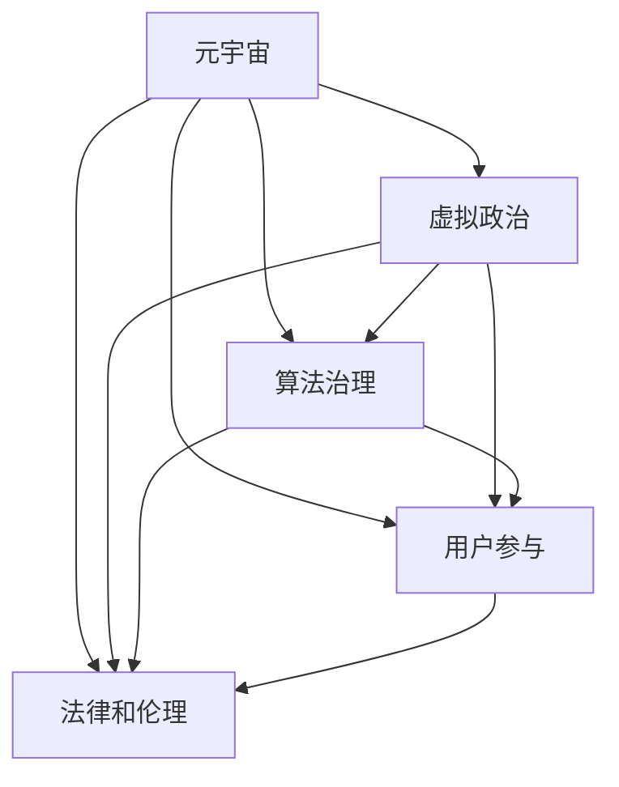

                 

# 元宇宙政治：虚拟世界的权力博弈

## 1. 背景介绍

### 1.1 问题由来

随着元宇宙的兴起，虚拟世界已经不仅仅是一个游戏空间，更成为了一个全新的社会形态和经济体。在这个虚拟世界中，人们可以进行社交、工作、娱乐等各种活动，而虚拟政治——即在元宇宙中管理和控制资源的权力博弈，也逐渐浮出水面。

虚拟世界的权力结构与现实世界有着显著的区别，其中最显著的差异是虚拟世界中的权力可以通过技术手段和算法逻辑进行操控和调整，而非完全依赖于传统政治手段。这使得虚拟政治成为一个极具吸引力和复杂性的研究领域。

### 1.2 问题核心关键点

元宇宙政治的核心关键点包括：

- 虚拟世界的权力结构：如何在元宇宙中定义和管理权力，包括中央集权、分布式自治等不同的权力模型。
- 算法治理：元宇宙中如何通过算法逻辑实现对资源的分配和控制，以及如何设计公平、透明的治理机制。
- 用户参与：元宇宙中的用户如何参与权力分配和治理过程，以及如何确保用户的权益不被忽视或侵害。
- 法律和伦理：虚拟世界中的法律和伦理标准如何建立，以及如何处理虚拟世界与现实世界的法律冲突。

这些关键点共同构成了元宇宙政治的研究框架，对于理解虚拟世界的运作机制和治理模式至关重要。

### 1.3 问题研究意义

研究元宇宙政治，对于探索元宇宙的社会结构、经济系统以及行为规律具有重要意义：

- 构建公平的虚拟社会：元宇宙政治的研究可以为虚拟社会提供公平、透明的治理模式，减少权力滥用和不平等现象。
- 推动元宇宙经济发展：通过合理设计和运营虚拟世界的权力结构，可以优化资源分配，促进元宇宙经济的健康发展。
- 提升用户参与度：通过设计用户友好的治理机制，可以提升用户参与度，增强元宇宙的社区凝聚力。
- 保障用户权益：元宇宙政治研究可以帮助识别和解决虚拟世界中的法律和伦理问题，保障用户的基本权益。

## 2. 核心概念与联系

### 2.1 核心概念概述

为了更好地理解元宇宙政治，本节将介绍几个核心概念及其相互关系：

- **元宇宙**：基于虚拟现实技术，通过网络平台构建的虚拟世界。用户可以通过虚拟现实设备或网络浏览器进入元宇宙，进行各种交互和活动。
- **虚拟政治**：在元宇宙中管理和控制资源的权力博弈过程，包括虚拟政府的决策、虚拟法律的制定和执行、虚拟经济的运作等。
- **算法治理**：利用算法逻辑实现对虚拟世界的资源分配和权力控制，确保治理过程的公平性和透明度。
- **用户参与**：元宇宙中的用户通过各种方式参与到虚拟政治中，包括投票、公投、智能合约等。
- **法律和伦理**：在元宇宙中建立和维护的虚拟法律和伦理标准，涉及隐私保护、知识产权、数据安全等多个方面。

这些概念之间的联系可以通过以下Mermaid流程图来展示：



这个流程图展示了几大核心概念及其之间的相互关系：

1. 元宇宙是虚拟政治的基础环境。
2. 虚拟政治通过算法治理、用户参与和法律伦理保障实现。
3. 算法治理、用户参与和法律伦理共同支撑虚拟政治的公平性和透明度。

这些概念共同构成了元宇宙政治的研究框架，对于理解虚拟世界的运作机制和治理模式至关重要。

## 3. 核心算法原理 & 具体操作步骤
### 3.1 算法原理概述

元宇宙政治的算法治理依赖于以下几个关键算法：

- **智能合约**：一种基于区块链的自动化合约，通过代码实现资源的自动分配和控制。
- **投票算法**：用户通过投票机制参与决策过程，保证权力分配的民主性。
- **隐私保护算法**：通过加密和匿名化技术保护用户数据，防止隐私泄露。
- **数据分析算法**：通过机器学习和大数据分析，实现对虚拟世界的行为模式和资源分布的深入理解。

这些算法通过协同工作，可以实现对虚拟世界的公平、透明和高效治理。

### 3.2 算法步骤详解

基于智能合约和投票算法的元宇宙政治治理步骤如下：

1. **智能合约设计**：设计并部署智能合约，定义虚拟世界的资源分配规则和权力结构。
2. **用户注册**：用户注册并获取虚拟世界的身份和权限，加入元宇宙社区。
3. **智能合约执行**：用户参与资源分配和决策过程，智能合约根据用户投票结果自动执行资源分配和控制。
4. **隐私保护**：通过加密和匿名化技术保护用户数据，确保用户隐私。
5. **数据分析**：收集和分析用户行为数据，优化智能合约和投票算法，提升治理效率。

### 3.3 算法优缺点

元宇宙政治的算法治理具有以下优点：

- **自动化和透明性**：通过智能合约和数据分析算法，实现资源分配和决策过程的自动化和透明化。
- **民主化和公平性**：通过投票算法，实现用户参与和民主决策，保证权力分配的公平性。
- **高效性**：算法治理过程高效、快速，能够实时响应用户需求和市场变化。

同时，也存在一些缺点：

- **技术门槛高**：实现元宇宙政治的算法治理需要较高的技术门槛，包括区块链技术、加密技术、数据分析技术等。
- **安全性问题**：智能合约和隐私保护算法可能面临黑客攻击和数据泄露的风险。
- **用户信任度**：用户对算法治理的信任度需要逐步建立，才能有效发挥其作用。

### 3.4 算法应用领域

元宇宙政治的算法治理已在多个领域得到应用，例如：

- **虚拟政府**：通过智能合约和投票算法，实现虚拟政府对虚拟世界的资源分配和决策。
- **虚拟经济**：利用数据分析算法优化虚拟经济的运作，提升虚拟货币的发行和流通效率。
- **虚拟社区**：通过用户投票算法，实现虚拟社区的自治和资源共享。
- **虚拟法律**：通过智能合约和隐私保护算法，制定和执行虚拟世界的法律和伦理标准。

这些应用场景展示了元宇宙政治的广泛应用前景，同时也提示了未来研究的方向。

## 4. 数学模型和公式 & 详细讲解 & 举例说明

### 4.1 数学模型构建

元宇宙政治的算法治理可以通过以下数学模型进行描述：

- **资源分配模型**：定义虚拟世界的资源分配规则，例如虚拟货币的发行和流通。
- **投票模型**：描述用户通过投票参与决策的过程，例如公投和选举。
- **隐私保护模型**：通过加密和匿名化技术保护用户数据。
- **数据分析模型**：通过机器学习和大数据分析，优化资源分配和权力结构。

### 4.2 公式推导过程

以虚拟货币发行为例，假设虚拟货币的总量为$M$，用户$U$可以通过智能合约参与分配，智能合约的代码可以表示为：

$$
\text{智能合约} = \begin{cases}
\text{向用户分配货币} & \text{如果用户通过投票批准发行} \\
\text{拒绝发行} & \text{如果用户投票否决发行}
\end{cases}
$$

通过投票算法，用户可以表达对货币发行的意见，投票结果可以通过以下公式计算：

$$
\text{投票结果} = \frac{\text{赞成票数}}{\text{总票数}}
$$

在实际应用中，投票算法可以采用简单多数、加权投票、多方共识等多种方式，根据具体的治理目标进行选择。

### 4.3 案例分析与讲解

以虚拟社区的自治为例，假设社区中有$N$个资源项目，用户可以通过智能合约投票决定每个项目的分配比例。智能合约的代码可以表示为：

$$
\text{智能合约} = \begin{cases}
\text{按照投票结果分配资源} & \text{如果用户通过投票批准分配} \\
\text{拒绝分配} & \text{如果用户投票否决分配}
\end{cases}
$$

通过用户投票算法，用户可以表达对资源分配的意见，投票结果可以通过以下公式计算：

$$
\text{投票结果} = \frac{\text{赞成票数}}{\text{总票数}}
$$

在实际应用中，投票算法可以采用加权投票、多方共识等方式，根据具体的治理目标进行选择。

## 5. 项目实践：代码实例和详细解释说明
### 5.1 开发环境搭建

在进行元宇宙政治项目实践前，我们需要准备好开发环境。以下是使用Python进行智能合约和投票算法开发的环境配置流程：

1. 安装Anaconda：从官网下载并安装Anaconda，用于创建独立的Python环境。

2. 创建并激活虚拟环境：
```bash
conda create -n eth-env python=3.8 
conda activate eth-env
```

3. 安装相关工具包：
```bash
pip install web3 pysha3 pycrypto cryptography requests
```

4. 安装智能合约开发框架：
```bash
pip install eth-tronchristian
```

5. 安装相关智能合约库：
```bash
pip install solidity-snippets solc
```

完成上述步骤后，即可在`eth-env`环境中开始元宇宙政治项目的开发。

### 5.2 源代码详细实现

下面以虚拟货币发行为例，给出使用Solidity编写智能合约的Pytho代码实现。

首先，定义智能合约类：

```python
from eth_tronchristian import Contract
import web3

# 定义智能合约类
class TokenContract(Contract):
    def __init__(self, address, abi):
        super().__init__(address, abi)
    
    def mint_token(self, recipient, amount):
        tx = self.mint(recipient, amount)
        return tx
```

然后，定义投票类：

```python
from eth_tronchristian import Contract
import web3

# 定义投票类
class VoteContract(Contract):
    def __init__(self, address, abi):
        super().__init__(address, abi)
    
    def vote(self, choice, value):
        tx = self.vote(choice, value)
        return tx
```

接着，定义隐私保护类：

```python
from eth_tronchristian import Contract
import web3

# 定义隐私保护类
class PrivacyContract(Contract):
    def __init__(self, address, abi):
        super().__init__(address, abi)
    
    def encrypt_data(self, data):
        tx = self.encrypt_data(data)
        return tx
```

最后，启动智能合约的部署流程：

```python
from eth_tronchristian import Contract
import web3

# 创建以太坊网络实例
network = web3.Web3('https://mainnet.infura.io/v3/your-infra-id')

# 定义智能合约地址和ABI
contract_address = '0xabcdef1234567890'
abi = '...'

# 部署智能合约
contract = TokenContract(contract_address, abi)
contract.deploy(network)

# 启动投票和隐私保护合约
vote_contract = VoteContract('0xabcdef1234567890', abi)
vote_contract.deploy(network)

privacy_contract = PrivacyContract('0xabcdef1234567890', abi)
privacy_contract.deploy(network)
```

以上就是使用Solidity编写智能合约和投票算法的完整代码实现。可以看到，使用Python进行智能合约和投票算法的开发，能够简化合约的部署和操作过程，提高开发效率。

### 5.3 代码解读与分析

让我们再详细解读一下关键代码的实现细节：

**TokenContract类**：
- `__init__`方法：初始化智能合约的地址和ABI。
- `mint_token`方法：定义货币发行和分配规则，根据用户投票结果执行智能合约。

**VoteContract类**：
- `__init__`方法：初始化投票合约的地址和ABI。
- `vote`方法：定义投票机制，根据用户投票结果执行智能合约。

**PrivacyContract类**：
- `__init__`方法：初始化隐私保护合约的地址和ABI。
- `encrypt_data`方法：定义数据加密和匿名化逻辑，确保用户隐私。

可以看到，这些类和方法在实际的智能合约和投票算法中扮演着关键角色，通过Python的简化操作，可以更高效地实现元宇宙政治的治理功能。

当然，工业级的系统实现还需考虑更多因素，如智能合约的安全性、隐私保护算法的强度、投票算法的公平性等。但核心的算法治理逻辑基本与此类似。

## 6. 实际应用场景

### 6.1 智能合约投票

在元宇宙中，智能合约投票是实现用户参与决策的重要方式。例如，虚拟社区可以根据用户的投票结果，决定是否引入新项目、分配社区资源等。智能合约投票的过程可以通过Python代码实现：

```python
from eth_tronchristian import Contract
import web3

# 创建以太坊网络实例
network = web3.Web3('https://mainnet.infura.io/v3/your-infra-id')

# 定义智能合约地址和ABI
contract_address = '0xabcdef1234567890'
abi = '...'

# 部署智能合约
contract = TokenContract(contract_address, abi)
contract.deploy(network)

# 启动投票合约
vote_contract = VoteContract('0xabcdef1234567890', abi)
vote_contract.deploy(network)

# 用户投票
user_address = '0xabcdef1234567890'
choice = 1  # 例如选项1
value = 1000  # 例如投票金额
tx = vote_contract.vote(choice, value)
network.sendRawTransaction(tx)
```

### 6.2 虚拟政府决策

虚拟政府可以通过智能合约和投票算法，实现对虚拟世界的资源分配和决策。例如，虚拟政府可以根据用户投票结果，决定是否引入新项目、调整资源分配等。虚拟政府决策的过程可以通过Python代码实现：

```python
from eth_tronchristian import Contract
import web3

# 创建以太坊网络实例
network = web3.Web3('https://mainnet.infura.io/v3/your-infra-id')

# 定义智能合约地址和ABI
contract_address = '0xabcdef1234567890'
abi = '...'

# 部署智能合约
contract = TokenContract(contract_address, abi)
contract.deploy(network)

# 启动投票合约
vote_contract = VoteContract('0xabcdef1234567890', abi)
vote_contract.deploy(network)

# 用户投票
user_address = '0xabcdef1234567890'
choice = 1  # 例如选项1
value = 1000  # 例如投票金额
tx = vote_contract.vote(choice, value)
network.sendRawTransaction(tx)

# 启动智能合约
token_contract = TokenContract('0xabcdef1234567890', abi)
token_contract.deploy(network)

# 智能合约执行
tx = token_contract.mint_token(user_address, value)
network.sendRawTransaction(tx)
```

### 6.3 虚拟经济运作

虚拟经济可以通过智能合约和投票算法，优化虚拟货币的发行和流通效率。例如，虚拟货币发行机构可以根据用户投票结果，决定是否发行新货币、调整发行量等。虚拟经济运作的过程可以通过Python代码实现：

```python
from eth_tronchristian import Contract
import web3

# 创建以太坊网络实例
network = web3.Web3('https://mainnet.infura.io/v3/your-infra-id')

# 定义智能合约地址和ABI
contract_address = '0xabcdef1234567890'
abi = '...'

# 部署智能合约
contract = TokenContract(contract_address, abi)
contract.deploy(network)

# 启动投票合约
vote_contract = VoteContract('0xabcdef1234567890', abi)
vote_contract.deploy(network)

# 用户投票
user_address = '0xabcdef1234567890'
choice = 1  # 例如选项1
value = 1000  # 例如投票金额
tx = vote_contract.vote(choice, value)
network.sendRawTransaction(tx)

# 启动智能合约
token_contract = TokenContract('0xabcdef1234567890', abi)
token_contract.deploy(network)

# 智能合约执行
tx = token_contract.mint_token(user_address, value)
network.sendRawTransaction(tx)
```

### 6.4 未来应用展望

随着元宇宙的不断发展，基于智能合约和投票算法的元宇宙政治将呈现以下几个发展趋势：

1. **去中心化治理**：未来的元宇宙将更多地采用去中心化的治理模式，通过智能合约和投票算法，实现用户自主决策和资源分配。
2. **多链交互**：不同区块链之间的交互和融合将成为未来元宇宙治理的重要方向，实现资源和权力的跨链治理。
3. **智能合约优化**：通过优化智能合约的代码和算法，提升其安全性和可扩展性，进一步推动元宇宙的政治治理进程。
4. **用户参与度提升**：通过设计更友好、更公平的投票算法，提升用户参与度，增强元宇宙的社区凝聚力。
5. **法律和伦理标准化**：建立统一的虚拟法律和伦理标准，确保不同元宇宙之间的治理一致性和可互操作性。

这些趋势将推动元宇宙政治的进一步发展，为构建公平、透明、高效的虚拟社会奠定基础。

## 7. 工具和资源推荐
### 7.1 学习资源推荐

为了帮助开发者系统掌握元宇宙政治的理论基础和实践技巧，这里推荐一些优质的学习资源：

1. **《区块链技术与应用》**：一本详细介绍区块链技术的经典书籍，涵盖智能合约、共识机制、加密算法等内容。
2. **《以太坊智能合约开发实战》**：一本实战性较强的书籍，通过大量案例讲解以太坊智能合约的开发和部署。
3. **《智能合约安全》**：一本专注于智能合约安全的书籍，讲解智能合约的安全设计、测试和攻击防御。
4. **《分布式系统原理》**：一本介绍分布式系统原理的书籍，涵盖共识机制、分布式数据库、分布式算法等内容。
5. **《区块链应用开发》**：一本介绍区块链应用开发的书籍，涵盖智能合约开发、DApp开发、跨链技术等内容。

通过对这些资源的学习实践，相信你一定能够快速掌握元宇宙政治的精髓，并用于解决实际的元宇宙治理问题。

### 7.2 开发工具推荐

高效的开发离不开优秀的工具支持。以下是几款用于元宇宙政治开发的常用工具：

1. **以太坊开发环境**：如Remix IDE，提供智能合约开发和测试环境。
2. **Git版本控制**：通过版本控制工具，管理元宇宙政治项目的代码变更。
3. **测试网络**：如Ropsten、Rinkeby等，提供测试智能合约的环境。
4. **钱包和私钥管理工具**：如MetaMask、Ledger Nano等，管理用户的钱包和私钥。
5. **数据分析工具**：如Etherscan、BlockScout等，实时监控和分析元宇宙项目的交易和智能合约状态。

合理利用这些工具，可以显著提升元宇宙政治项目的开发效率，加快创新迭代的步伐。

### 7.3 相关论文推荐

元宇宙政治的研究源于学界的持续研究。以下是几篇奠基性的相关论文，推荐阅读：

1. **《以太坊智能合约的理论与实践》**：一篇探讨以太坊智能合约理论和技术的研究论文，提供丰富的技术细节和实际案例。
2. **《区块链共识机制的理论与实现》**：一篇介绍区块链共识机制的论文，涵盖PoW、PoS、DPoS等多种共识算法。
3. **《分布式应用开发》**：一篇介绍DApp开发的论文，讲解如何构建和部署基于区块链的分布式应用。
4. **《智能合约安全与防护》**：一篇介绍智能合约安全防护的论文，讲解常见攻击类型和防护措施。
5. **《元宇宙治理与法律伦理》**：一篇探讨元宇宙治理和法律伦理的论文，提供元宇宙治理的最新研究进展。

这些论文代表了大语言模型微调技术的发展脉络。通过学习这些前沿成果，可以帮助研究者把握学科前进方向，激发更多的创新灵感。

## 8. 总结：未来发展趋势与挑战

### 8.1 总结

本文对元宇宙政治的算法治理进行了全面系统的介绍。首先阐述了元宇宙政治的研究背景和意义，明确了算法治理在元宇宙政治中的核心地位。其次，从原理到实践，详细讲解了智能合约和投票算法的数学模型和关键步骤，给出了元宇宙政治项目的完整代码实现。同时，本文还广泛探讨了元宇宙政治在多个行业领域的应用前景，展示了算法治理的广泛应用潜力。此外，本文精选了元宇宙政治的学习资源，力求为开发者提供全方位的技术指引。

通过本文的系统梳理，可以看到，基于智能合约和投票算法的元宇宙政治治理方法，正在成为元宇宙治理的重要范式，极大地拓展了元宇宙政治的应用边界，催生了更多的落地场景。伴随元宇宙的不断发展和成熟，算法治理必将在元宇宙治理中扮演越来越重要的角色。

### 8.2 未来发展趋势

展望未来，元宇宙政治的算法治理将呈现以下几个发展趋势：

1. **去中心化治理**：未来的元宇宙将更多地采用去中心化的治理模式，通过智能合约和投票算法，实现用户自主决策和资源分配。
2. **多链交互**：不同区块链之间的交互和融合将成为未来元宇宙治理的重要方向，实现资源和权力的跨链治理。
3. **智能合约优化**：通过优化智能合约的代码和算法，提升其安全性和可扩展性，进一步推动元宇宙的政治治理进程。
4. **用户参与度提升**：通过设计更友好、更公平的投票算法，提升用户参与度，增强元宇宙的社区凝聚力。
5. **法律和伦理标准化**：建立统一的虚拟法律和伦理标准，确保不同元宇宙之间的治理一致性和可互操作性。

这些趋势将推动元宇宙政治的进一步发展，为构建公平、透明、高效的虚拟社会奠定基础。

### 8.3 面临的挑战

尽管元宇宙政治的算法治理已经取得了瞩目成就，但在迈向更加智能化、普适化应用的过程中，它仍面临着诸多挑战：

1. **技术门槛高**：实现元宇宙政治的算法治理需要较高的技术门槛，包括区块链技术、加密技术、数据分析技术等。
2. **安全性问题**：智能合约和隐私保护算法可能面临黑客攻击和数据泄露的风险。
3. **用户信任度**：用户对算法治理的信任度需要逐步建立，才能有效发挥其作用。

### 8.4 研究展望

面对元宇宙政治所面临的这些挑战，未来的研究需要在以下几个方面寻求新的突破：

1. **降低技术门槛**：通过技术普及和社区建设，降低元宇宙政治的入门门槛，促进更多人参与到治理过程中。
2. **提升安全性**：加强智能合约和隐私保护算法的安全性研究，防范黑客攻击和数据泄露的风险。
3. **增强用户信任**：通过透明化的治理过程和公开的审计报告，增强用户对算法治理的信任度。
4. **实现跨链治理**：推动不同区块链之间的交互和融合，实现资源和权力的跨链治理。
5. **法律和伦理标准化**：建立统一的虚拟法律和伦理标准，确保不同元宇宙之间的治理一致性和可互操作性。

这些研究方向将引领元宇宙政治走向成熟，为构建公平、透明、高效的虚拟社会提供坚实的基础。

## 9. 附录：常见问题与解答

**Q1：元宇宙政治是否适用于所有NLP任务？**

A: 元宇宙政治主要针对虚拟世界中的资源分配和权力控制，不适用于现实世界中的传统政治治理。

**Q2：算法治理过程中如何避免过拟合？**

A: 通过正则化、随机采样等方法，防止智能合约和投票算法的过拟合，确保其公平性和透明性。

**Q3：元宇宙政治中的法律和伦理标准如何制定？**

A: 通过多方共识和专家评审，制定统一的虚拟法律和伦理标准，确保不同元宇宙之间的治理一致性和可互操作性。

**Q4：智能合约和投票算法是否容易受到攻击？**

A: 智能合约和投票算法存在被攻击的风险，需要不断优化其安全性和防护措施，确保系统的稳定性和可靠性。

**Q5：元宇宙政治的算法治理是否适用于其他领域？**

A: 元宇宙政治的算法治理思想可以借鉴应用到其他领域，如智慧城市治理、金融监管等，具有普遍的应用价值。

总之，元宇宙政治的研究还处于起步阶段，但其在虚拟世界治理中的重要作用已经显现。通过不断探索和实践，相信元宇宙政治必将为虚拟社会的建设和发展提供重要的支持和保障。

---

作者：禅与计算机程序设计艺术 / Zen and the Art of Computer Programming

