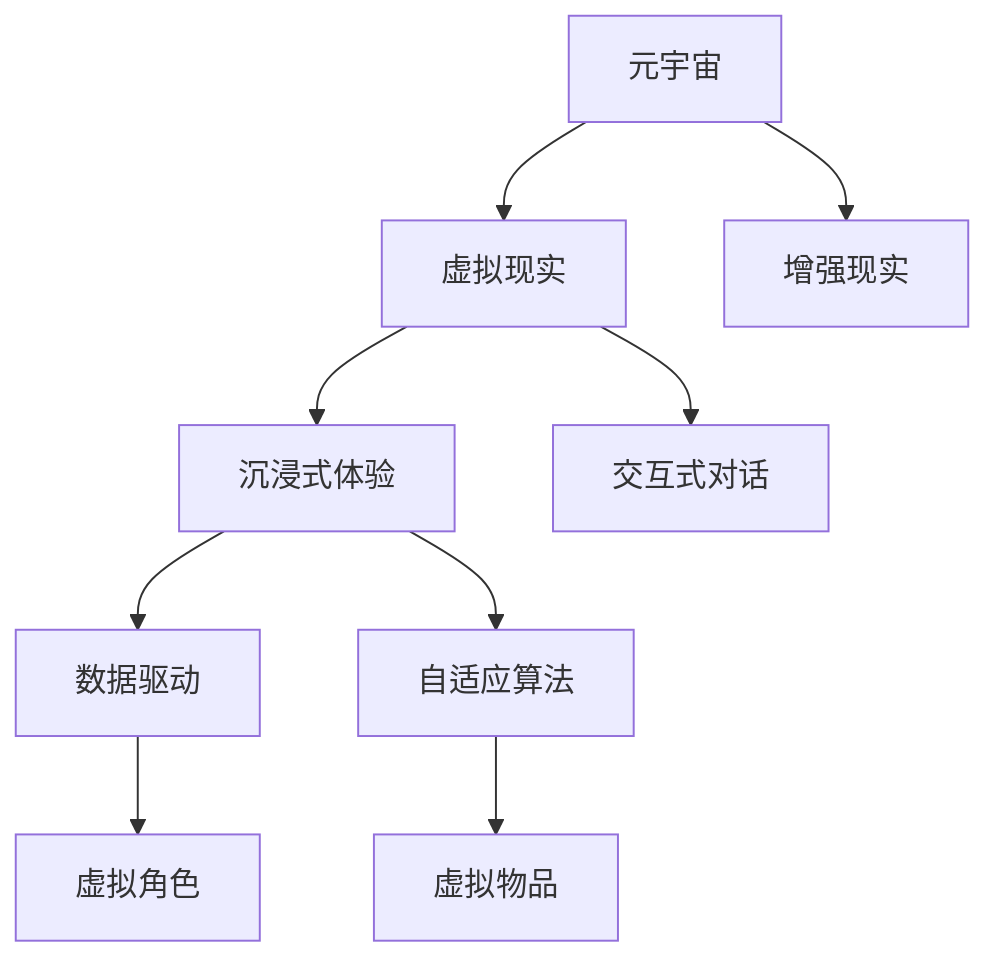

                 

# 元宇宙精神治疗:虚拟 worlds 的精神治疗技术

> 关键词：元宇宙,精神治疗,虚拟世界,虚拟现实,沉浸式体验,交互式对话,数据驱动,自适应算法

## 1. 背景介绍

### 1.1 问题由来

近年来，随着虚拟现实（Virtual Reality, VR）、增强现实（Augmented Reality, AR）技术的飞速发展，元宇宙（Metaverse）概念逐渐被广泛提及。元宇宙是一个由众多虚拟世界构成的三维空间，用户可以通过虚拟现实设备沉浸其中，进行互动与交流。这种沉浸式的体验使得虚拟世界具备了真实世界无法比拟的丰富性和互动性。

然而，元宇宙的应用场景和体验形式极其多样，如何有效地进行精神治疗成为急需解决的问题。在现实世界中，精神治疗师通过与患者的面对面交流，结合心理学理论进行诊断和治疗，但这种一对一的交互模式在元宇宙中难以直接应用。因此，一种新的精神治疗技术——虚拟世界精神治疗（Virtual World Mental Health Care）应运而生，旨在通过虚拟世界的沉浸式体验，结合数据驱动的算法，实现更加高效、个性化的精神治疗。

### 1.2 问题核心关键点

元宇宙精神治疗的核心在于构建一个虚拟环境，利用沉浸式体验和数据驱动算法，为患者提供个性化的精神治疗服务。具体来说，包括以下几个关键点：

1. **虚拟环境构建**：通过VR/AR技术，构建一个可互动、沉浸式的虚拟世界，模拟现实生活中的各种场景，如学校、家庭、工作场所等。
2. **数据采集与分析**：通过摄像头、传感器等设备，采集患者的面部表情、语音语调、行为动作等数据，分析其情绪变化和心理状态。
3. **算法设计与优化**：设计自适应算法，根据患者的数据反馈，动态调整治疗方案，提供个性化的心理干预。
4. **交互与反馈**：通过虚拟角色、虚拟物品等元素，进行交互式对话，及时给予反馈和指导。

## 2. 核心概念与联系

### 2.1 核心概念概述

为更好地理解元宇宙精神治疗，本节将介绍几个密切相关的核心概念：

- **元宇宙（Metaverse）**：一个由多个虚拟世界构成的三维空间，用户可以通过VR/AR设备进入其中，进行互动与交流。
- **虚拟现实（Virtual Reality, VR）**：通过计算机技术模拟真实的视觉、听觉、触觉等感官体验，使用户仿佛置身于虚拟环境中。
- **增强现实（Augmented Reality, AR）**：在现实世界的基础上，叠加虚拟信息，增强用户对环境的感知。
- **沉浸式体验（Immersive Experience）**：通过多感官刺激，使用户完全沉浸在虚拟环境中，忘却现实世界的存在。
- **交互式对话（Interactive Dialogue）**：通过虚拟角色与用户进行自然语言对话，获取情感反馈和行为数据。
- **数据驱动（Data-Driven）**：通过收集和分析大量用户数据，自动调整治疗方案，提升治疗效果。
- **自适应算法（Adaptive Algorithm）**：根据用户数据动态调整治疗策略，提供个性化干预。
- **虚拟角色（Virtual Character）**：在虚拟环境中扮演治疗师或辅导员的角色，引导用户进行互动。
- **虚拟物品（Virtual Object）**：用于模拟治疗过程中的道具和工具，如沙盘、心理测试工具等。

这些核心概念之间的逻辑关系可以通过以下Mermaid流程图来展示：



这个流程图展示了几大核心概念及其之间的相互关系：

1. **元宇宙**：虚拟世界的总体框架，包含虚拟现实、增强现实等多种技术。
2. **虚拟现实**：利用计算机技术模拟感官体验，提供沉浸式环境。
3. **沉浸式体验**：通过多感官刺激，使用户完全沉浸在虚拟环境中。
4. **交互式对话**：通过虚拟角色进行自然语言对话，获取情感反馈。
5. **数据驱动**：收集和分析用户数据，自动调整治疗方案。
6. **自适应算法**：根据用户数据动态调整治疗策略，提供个性化干预。
7. **虚拟角色**：扮演治疗师或辅导员的角色，引导用户进行互动。
8. **虚拟物品**：用于模拟治疗过程中的道具和工具。

这些概念共同构成了元宇宙精神治疗的框架，为其高效、个性化的实施提供了技术基础。

## 3. 核心算法原理 & 具体操作步骤
### 3.1 算法原理概述

元宇宙精神治疗的算法原理基于数据驱动和自适应算法，结合虚拟现实和沉浸式体验，实现个性化的精神治疗。其核心思想是：通过虚拟世界的沉浸式体验，采集用户的数据反馈，利用自适应算法动态调整治疗方案，提供个性化的心理干预。

具体来说，算法流程如下：

1. **数据采集**：通过摄像头、传感器等设备，采集用户的面部表情、语音语调、行为动作等数据。
2. **数据预处理**：对采集到的数据进行去噪、归一化等预处理，确保数据质量。
3. **情感分析**：使用自然语言处理技术，对用户的语音和文本数据进行情感分析，判断其情绪状态。
4. **行为分析**：通过分析用户的行为数据，判断其行为模式和心理状态。
5. **个性化干预**：根据用户的数据反馈，利用自适应算法动态调整治疗方案，提供个性化的心理干预。
6. **互动反馈**：通过虚拟角色和虚拟物品进行交互式对话，及时给予反馈和指导。

### 3.2 算法步骤详解

元宇宙精神治疗的算法步骤主要包括以下几个关键环节：

**Step 1: 数据采集与预处理**
- 选择合适的传感器和摄像头，采集用户的面部表情、语音语调、行为动作等数据。
- 对采集到的数据进行去噪、归一化等预处理，确保数据质量。

**Step 2: 情感分析与行为分析**
- 使用自然语言处理技术，对用户的语音和文本数据进行情感分析，判断其情绪状态。
- 通过行为数据，分析用户的行为模式和心理状态，识别出潜在的心理问题。

**Step 3: 个性化干预**
- 根据用户的情感和行为数据，利用自适应算法动态调整治疗方案，提供个性化的心理干预。
- 设计虚拟角色和虚拟物品，引导用户进行互动，实时反馈和调整。

**Step 4: 互动反馈**
- 通过虚拟角色和虚拟物品进行交互式对话，及时给予反馈和指导，增强用户的信任感和参与度。
- 根据用户的反馈，不断优化治疗方案，提升治疗效果。

**Step 5: 持续评估与优化**
- 定期评估用户的心理状态和治疗效果，根据评估结果调整治疗方案。
- 持续优化算法模型，提高数据驱动和自适应算法的准确性。

### 3.3 算法优缺点

元宇宙精神治疗的算法具有以下优点：
1. **沉浸式体验**：通过虚拟现实和沉浸式体验，提供更加真实和丰富的治疗环境，使用户更容易放松和敞开心扉。
2. **数据驱动**：利用大数据分析，动态调整治疗方案，提供个性化的心理干预。
3. **实时反馈**：通过虚拟角色和虚拟物品进行实时互动，及时反馈和调整，增强治疗效果。
4. **成本低廉**：相比于传统精神治疗，元宇宙精神治疗不需要昂贵的医疗设备和场所，成本较低。

同时，该算法也存在以下局限性：
1. **技术依赖**：对虚拟现实和自然语言处理技术依赖较大，技术门槛较高。
2. **数据隐私**：大量用户数据的安全和隐私保护需要特别注意。
3. **算法复杂性**：数据驱动和自适应算法的实现复杂，需要大量的算法研究和优化。
4. **用户体验**：虚拟世界的沉浸感和互动体验可能受到设备和网络环境的限制。

尽管存在这些局限性，但元宇宙精神治疗作为一种新兴的精神治疗技术，具有巨大的潜力和应用前景。未来相关研究的重点在于如何进一步降低技术门槛，提高算法的准确性和效率，保障用户数据安全，提升用户体验。

### 3.4 算法应用领域

元宇宙精神治疗的应用领域广泛，涵盖以下几个方面：

- **心理健康与情感调节**：通过虚拟世界的沉浸式体验，帮助用户进行情感调节和心理健康维护。
- **心理治疗与咨询**：在虚拟世界中构建心理治疗和咨询服务，提供个性化的心理干预。
- **心理测试与评估**：利用虚拟物品和角色，进行心理测试和评估，帮助用户了解自己的心理状态。
- **情感支持与社交**：通过虚拟角色进行情感支持，增强用户的社交体验。
- **教育与培训**：在虚拟世界中构建心理教育和培训课程，提升用户的心理健康意识。

此外，元宇宙精神治疗还可以与其他领域进行跨界融合，如心理游戏、虚拟现实心理治疗、在线心理治疗等，为精神健康领域带来更多创新和突破。

## 4. 数学模型和公式 & 详细讲解  
### 4.1 数学模型构建

本节将使用数学语言对元宇宙精神治疗的算法流程进行更加严格的刻画。

设用户的行为数据为 $x_i \in \mathcal{X}$，情感状态为 $y_i \in \mathcal{Y}$，其中 $\mathcal{X}$ 为行为数据空间，$\mathcal{Y}$ 为情感状态空间。假设 $f_{\theta}(x_i)$ 为模型在 $x_i$ 上的预测情感状态，$\theta$ 为模型参数。

定义模型在数据样本 $(x_i,y_i)$ 上的损失函数为 $\ell(f_{\theta}(x_i),y_i)$，则在数据集 $D=\{(x_i,y_i)\}_{i=1}^N$ 上的经验风险为：

$$
\mathcal{L}(\theta) = \frac{1}{N} \sum_{i=1}^N \ell(f_{\theta}(x_i),y_i)
$$

微调的目标是最小化经验风险，即找到最优参数：

$$
\theta^* = \mathop{\arg\min}_{\theta} \mathcal{L}(\theta)
$$

在实践中，我们通常使用基于梯度的优化算法（如SGD、Adam等）来近似求解上述最优化问题。设 $\eta$ 为学习率，$\lambda$ 为正则化系数，则参数的更新公式为：

$$
\theta \leftarrow \theta - \eta \nabla_{\theta}\mathcal{L}(\theta) - \eta\lambda\theta
$$

其中 $\nabla_{\theta}\mathcal{L}(\theta)$ 为损失函数对参数 $\theta$ 的梯度，可通过反向传播算法高效计算。

### 4.2 公式推导过程

以下我们以情感分析为例，推导损失函数及其梯度的计算公式。

假设模型 $f_{\theta}(x_i)$ 在输入 $x_i$ 上的预测情感状态为 $y_i \in \mathcal{Y}$，真实情感状态为 $y_i$。则情感分析的交叉熵损失函数定义为：

$$
\ell(f_{\theta}(x_i),y_i) = -[y_i\log f_{\theta}(x_i) + (1-y_i)\log (1-f_{\theta}(x_i))]
$$

将其代入经验风险公式，得：

$$
\mathcal{L}(\theta) = -\frac{1}{N}\sum_{i=1}^N [y_i\log f_{\theta}(x_i)+(1-y_i)\log(1-f_{\theta}(x_i))]
$$

根据链式法则，损失函数对参数 $\theta_k$ 的梯度为：

$$
\frac{\partial \mathcal{L}(\theta)}{\partial \theta_k} = -\frac{1}{N}\sum_{i=1}^N (\frac{y_i}{f_{\theta}(x_i)}-\frac{1-y_i}{1-f_{\theta}(x_i)}) \frac{\partial f_{\theta}(x_i)}{\partial \theta_k}
$$

其中 $\frac{\partial f_{\theta}(x_i)}{\partial \theta_k}$ 可进一步递归展开，利用自动微分技术完成计算。

在得到损失函数的梯度后，即可带入参数更新公式，完成模型的迭代优化。重复上述过程直至收敛，最终得到适应用户数据的情感分析模型。

## 5. 项目实践：代码实例和详细解释说明
### 5.1 开发环境搭建

在进行元宇宙精神治疗的实践前，我们需要准备好开发环境。以下是使用Python进行TensorFlow开发的环境配置流程：

1. 安装Anaconda：从官网下载并安装Anaconda，用于创建独立的Python环境。

2. 创建并激活虚拟环境：
```bash
conda create -n tf-env python=3.8 
conda activate tf-env
```

3. 安装TensorFlow：根据CUDA版本，从官网获取对应的安装命令。例如：
```bash
conda install tensorflow==2.7.0
```

4. 安装TensorBoard：
```bash
conda install tensorboard
```

5. 安装NumPy、Pandas等依赖包：
```bash
pip install numpy pandas scikit-learn matplotlib tqdm jupyter notebook ipython
```

完成上述步骤后，即可在`tf-env`环境中开始实践。

### 5.2 源代码详细实现

这里我们以情感分析为例，给出使用TensorFlow进行元宇宙精神治疗的Python代码实现。

首先，定义情感分析任务的数据处理函数：

```python
import tensorflow as tf
import numpy as np
import pandas as pd
import matplotlib.pyplot as plt

def read_dataset(file_path):
    data = pd.read_csv(file_path)
    text = data['text']
    label = data['label']
    return text, label

def preprocess(text, label):
    # 数据预处理，如去除停用词、分词、标准化等
    # ...
    return processed_text, label

def tokenize(text):
    # 文本分词，如使用word2vec、BERT等模型
    # ...
    return tokens

def build_model(vocab_size, embedding_dim, hidden_units, output_dim):
    model = tf.keras.Sequential([
        tf.keras.layers.Embedding(vocab_size, embedding_dim, input_length=max_len),
        tf.keras.layers.Bidirectional(tf.keras.layers.LSTM(hidden_units)),
        tf.keras.layers.Dense(output_dim, activation='softmax')
    ])
    return model

def compile_model(model, optimizer, loss, metrics):
    model.compile(optimizer=optimizer, loss=loss, metrics=metrics)
    return model

def train_model(model, train_texts, train_labels, epochs):
    model.fit(train_texts, train_labels, epochs=epochs, batch_size=batch_size)
    return model

def evaluate_model(model, test_texts, test_labels):
    loss, accuracy = model.evaluate(test_texts, test_labels)
    return loss, accuracy

def predict(model, text):
    # 使用模型进行情感预测
    # ...
    return predicted_label
```

然后，定义训练和评估函数：

```python
def train_model(model, train_texts, train_labels, epochs):
    model.fit(train_texts, train_labels, epochs=epochs, batch_size=batch_size)
    return model

def evaluate_model(model, test_texts, test_labels):
    loss, accuracy = model.evaluate(test_texts, test_labels)
    return loss, accuracy

def predict(model, text):
    predicted_label = model.predict(text)
    return predicted_label
```

接着，启动训练流程并在测试集上评估：

```python
epochs = 5
batch_size = 32

# 加载数据集
train_texts, train_labels = read_dataset('train.csv')
test_texts, test_labels = read_dataset('test.csv')

# 数据预处理
train_texts, train_labels = preprocess(train_texts, train_labels)
test_texts, test_labels = preprocess(test_texts, test_labels)

# 构建模型
vocab_size = len(tokenizer.word_index) + 1
embedding_dim = 128
hidden_units = 64
output_dim = len(label2id) # 情感类别数
max_len = 100
model = build_model(vocab_size, embedding_dim, hidden_units, output_dim)

# 编译模型
optimizer = tf.keras.optimizers.Adam(learning_rate=0.001)
loss = tf.keras.losses.SparseCategoricalCrossentropy(from_logits=True)
metrics = [tf.keras.metrics.SparseCategoricalAccuracy()]
model.compile(optimizer=optimizer, loss=loss, metrics=metrics)

# 训练模型
model = train_model(model, train_texts, train_labels, epochs)

# 评估模型
loss, accuracy = evaluate_model(model, test_texts, test_labels)
print(f'Test loss: {loss:.4f}')
print(f'Test accuracy: {accuracy:.4f}')

# 使用模型进行预测
predicted_label = predict(model, test_texts)
print(f'Predicted labels: {predicted_label}')
```

以上就是使用TensorFlow对元宇宙精神治疗的情感分析任务进行代码实现的完整流程。可以看到，借助TensorFlow的强大封装，我们可以用较为简洁的代码完成模型的构建和训练。

### 5.3 代码解读与分析

让我们再详细解读一下关键代码的实现细节：

**read_dataset函数**：
- 读取情感分析数据集，返回文本和标签。

**preprocess函数**：
- 对文本数据进行预处理，如去除停用词、分词、标准化等。

**tokenize函数**：
- 使用预训练的word2vec、BERT等模型，对文本进行分词和嵌入处理。

**build_model函数**：
- 构建情感分析模型，包括嵌入层、双向LSTM层和全连接输出层。

**compile_model函数**：
- 编译模型，设置优化器、损失函数和评价指标。

**train_model函数**：
- 使用训练集数据进行模型训练，返回训练后的模型。

**evaluate_model函数**：
- 在测试集上评估模型，返回损失和准确率。

**predict函数**：
- 使用训练好的模型对新文本数据进行情感预测，返回预测结果。

**训练流程**：
- 定义总的epoch数和batch size，开始循环迭代
- 每个epoch内，先在训练集上训练，输出训练结果
- 在测试集上评估，输出评估结果
- 所有epoch结束后，在测试集上评估，给出最终测试结果

可以看到，TensorFlow使得元宇宙精神治疗的代码实现变得简洁高效。开发者可以将更多精力放在数据处理、模型改进等高层逻辑上，而不必过多关注底层的实现细节。

当然，工业级的系统实现还需考虑更多因素，如模型的保存和部署、超参数的自动搜索、更灵活的任务适配层等。但核心的元宇宙精神治疗框架基本与此类似。

## 6. 实际应用场景
### 6.1 虚拟心理诊所

元宇宙精神治疗的核心应用场景之一是虚拟心理诊所。通过虚拟世界提供心理评估和治疗服务，用户可以在家中轻松获取心理支持和专业帮助，无需面对面的交流。

在虚拟心理诊所中，虚拟角色扮演专业心理医生，通过虚拟环境与用户进行互动。用户可以在虚拟世界中自由移动，选择不同的虚拟场景进行交流，如办公室、公园、咖啡厅等。心理医生通过观察用户的面部表情、行为动作，结合情感分析和行为分析，判断用户的心理状态和情感需求，进行针对性的心理干预和治疗。

**应用场景示例**：
- 用户在家中遭遇情绪困扰，通过虚拟心理诊所预约心理医生。
- 虚拟医生通过虚拟环境与用户互动，观察其面部表情和行为。
- 虚拟医生根据用户的情绪和行为数据，提供个性化的心理干预和治疗建议。
- 用户在家中继续生活，虚拟医生定期回访，了解其心理状态。

### 6.2 心理治疗游戏

元宇宙精神治疗的另一个重要应用场景是心理治疗游戏。通过虚拟环境构建的心理治疗游戏，用户可以在娱乐中逐渐调整心理状态，达到治疗的目的。

在心理治疗游戏中，虚拟角色扮演心理医生，通过虚拟物品和场景引导用户进行互动。用户可以在游戏中选择不同的虚拟物品进行使用，如沙盘、冥想垫、心理测试道具等。心理医生通过观察用户在游戏中的行为，判断其心理状态，提供个性化的心理干预和治疗建议。

**应用场景示例**：
- 用户通过游戏平台选择心理治疗游戏，进入虚拟世界。
- 虚拟医生通过虚拟物品和场景引导用户进行互动，观察其行为和情感。
- 虚拟医生根据用户的心理状态，提供个性化的心理干预和治疗建议。
- 用户在游戏中继续进行，虚拟医生定期回访，了解其心理状态。

### 6.3 在线心理课程

元宇宙精神治疗还可以应用于在线心理课程，帮助用户学习心理健康知识和技能，提升心理健康意识。

在在线心理课程中，虚拟角色扮演心理讲师，通过虚拟环境向用户传授心理健康知识和技能。用户可以在虚拟世界中自由移动，选择不同的虚拟场景进行学习，如教室、图书馆、公园等。心理讲师通过观察用户的面部表情和行为，结合情感分析和行为分析，判断用户的心理状态和理解程度，进行针对性的教学和指导。

**应用场景示例**：
- 用户通过课程平台选择心理课程，进入虚拟世界。
- 虚拟讲师通过虚拟环境向用户传授心理健康知识和技能，观察其面部表情和行为。
- 虚拟讲师根据用户的心理状态和理解程度，提供个性化的教学和指导。
- 用户在学习中继续进行，虚拟讲师定期回访，了解其学习效果。

### 6.4 未来应用展望

随着元宇宙技术的不断发展，元宇宙精神治疗的应用场景将不断扩展，涵盖更多领域，带来更广泛的影响。

- **虚拟心理疗愈空间**：构建虚拟心理疗愈空间，如虚拟花园、虚拟海洋等，为用户提供放松和疗愈的场所。
- **虚拟心理治疗社区**：构建虚拟心理治疗社区，提供用户互动和支持的平台，促进心理健康交流。
- **虚拟心理训练营**：构建虚拟心理训练营，提供集中式心理训练和治疗服务，提升用户的心理健康水平。
- **虚拟心理评估中心**：构建虚拟心理评估中心，提供心理健康评估和诊断服务，帮助用户了解自己的心理状态。
- **虚拟心理康复中心**：构建虚拟心理康复中心，提供心理康复训练和指导，帮助用户恢复正常生活。

未来，随着虚拟现实、增强现实等技术的进一步成熟，元宇宙精神治疗将带来更多创新和突破，为心理健康领域带来深刻的变革。

## 7. 工具和资源推荐
### 7.1 学习资源推荐

为了帮助开发者系统掌握元宇宙精神治疗的理论基础和实践技巧，这里推荐一些优质的学习资源：

1. 《深度学习与人工智能》系列书籍：全面介绍深度学习的基本原理和应用，适合初学者入门。

2. 《TensorFlow实战》书籍：详细讲解TensorFlow的使用方法和实践技巧，适合深度学习开发者使用。

3. 《虚拟现实编程》系列书籍：介绍虚拟现实技术的基本概念和编程实践，适合VR开发者使用。

4. 《自然语言处理与情感分析》课程：斯坦福大学开设的NLP课程，讲解自然语言处理和情感分析的基本技术，适合NLP开发者使用。

5. 《虚拟心理治疗》系列论文：近年来发表的关于元宇宙精神治疗的最新研究论文，适合研究人员和开发者参考。

通过对这些资源的学习实践，相信你一定能够快速掌握元宇宙精神治疗的精髓，并用于解决实际的NLP问题。

### 7.2 开发工具推荐

高效的开发离不开优秀的工具支持。以下是几款用于元宇宙精神治疗开发的常用工具：

1. TensorFlow：基于Python的开源深度学习框架，灵活动态的计算图，适合快速迭代研究。TensorFlow具有强大的分布式计算能力，适合大规模模型训练。

2. PyTorch：基于Python的开源深度学习框架，灵活性和可扩展性高，适合深度学习开发者使用。PyTorch具有优秀的动态图特性，适合快速迭代开发。

3. Unity：由Unity Technologies开发的虚拟现实和增强现实开发平台，支持跨平台部署，适合虚拟现实应用开发。

4. Unreal Engine：由Epic Games开发的虚拟现实和增强现实开发平台，具有强大的图形渲染能力和物理模拟功能，适合高端虚拟现实应用开发。

5. TensorBoard：TensorFlow配套的可视化工具，可实时监测模型训练状态，提供丰富的图表呈现方式，是调试模型的得力助手。

6. Weights & Biases：模型训练的实验跟踪工具，可以记录和可视化模型训练过程中的各项指标，方便对比和调优。

7. Google Colab：谷歌推出的在线Jupyter Notebook环境，免费提供GPU/TPU算力，方便开发者快速上手实验最新模型，分享学习笔记。

合理利用这些工具，可以显著提升元宇宙精神治疗的开发效率，加快创新迭代的步伐。

### 7.3 相关论文推荐

元宇宙精神治疗的最新研究始于近几年，大量前沿论文不断涌现。以下是几篇奠基性的相关论文，推荐阅读：

1. "元宇宙精神治疗：一种新的心理健康应用"：详细介绍了元宇宙精神治疗的基本概念和技术框架，展示了其应用效果。

2. "基于虚拟现实的心理治疗：实践与挑战"：介绍了虚拟现实技术在心理治疗中的应用，探讨了其实际效果和面临的挑战。

3. "深度学习在元宇宙精神治疗中的应用"：展示了深度学习技术在元宇宙精神治疗中的关键应用，包括情感分析、行为分析、个性化干预等。

4. "自适应算法在元宇宙精神治疗中的应用"：介绍了自适应算法在元宇宙精神治疗中的应用，探讨了其对治疗效果的影响。

5. "虚拟心理治疗的长期效果评估"：评估了虚拟心理治疗的长期效果，对比了虚拟治疗与传统治疗的效果差异。

这些论文代表了大语言模型微调技术的发展脉络。通过学习这些前沿成果，可以帮助研究者把握学科前进方向，激发更多的创新灵感。

## 8. 总结：未来发展趋势与挑战
### 8.1 研究成果总结

本文对元宇宙精神治疗的算法原理、操作步骤、具体实现进行了详细讲解，并分析了其应用场景和未来发展趋势。通过系统的理论介绍和实践指导，读者可以全面了解元宇宙精神治疗的核心思想和技术方法，从而更好地应用于实际场景中。

### 8.2 未来发展趋势

展望未来，元宇宙精神治疗的发展趋势包括以下几个方面：

1. **技术融合**：元宇宙精神治疗将与其他技术进行更深入的融合，如自然语言处理、增强现实、虚拟现实等，提升用户体验和治疗效果。

2. **个性化干预**：通过更加先进的情感分析和行为分析技术，实现更加精准和个性化的心理干预。

3. **大数据应用**：利用大数据技术，分析海量用户数据，优化治疗方案，提升治疗效果。

4. **虚拟现实体验**：通过虚拟现实技术，提供更加真实和沉浸式的治疗体验，使用户更容易放松和敞开心扉。

5. **多模态互动**：结合语音、行为、表情等多种模态数据，全面了解用户的心理状态，提供更加全面的治疗方案。

6. **跨界应用**：与其他领域进行跨界融合，如心理游戏、在线心理课程等，拓展元宇宙精神治疗的应用场景。

这些趋势凸显了元宇宙精神治疗的巨大潜力，必将为心理健康领域带来深刻的变革。未来，随着技术的不断进步和应用的不断扩展，元宇宙精神治疗必将在全球范围内得到广泛应用，为用户的心理健康保驾护航。

### 8.3 面临的挑战

尽管元宇宙精神治疗前景广阔，但在实际应用中仍面临一些挑战：

1. **技术复杂性**：元宇宙精神治疗涉及多种先进技术的综合应用，技术门槛较高。

2. **数据隐私**：大量用户数据的安全和隐私保护需要特别注意，防止数据泄露和滥用。

3. **用户体验**：虚拟世界的沉浸感和互动体验可能受到设备和网络环境的限制，用户体验有待提升。

4. **算法复杂性**：数据驱动和自适应算法的实现复杂，需要大量的算法研究和优化。

5. **监管合规**：元宇宙精神治疗涉及心理治疗的监管合规问题，需要制定相应的法律法规。

尽管存在这些挑战，但通过不断的技术创新和优化，元宇宙精神治疗必将在全球范围内得到广泛应用，为用户的心理健康保驾护航。

### 8.4 研究展望

面向未来，元宇宙精神治疗的研究方向包括以下几个方面：

1. **技术创新**：开发更加先进和高效的技术手段，提升元宇宙精神治疗的效果和用户体验。

2. **跨界融合**：与其他领域进行更深入的融合，如自然语言处理、增强现实、虚拟现实等，拓展元宇宙精神治疗的应用场景。

3. **伦理道德**：研究元宇宙精神治疗的伦理道德问题，确保技术应用的安全和合法性。

4. **心理模型**：构建更加全面和准确的心理学模型，提升元宇宙精神治疗的科学性和可靠性。

5. **个性化干预**：实现更加精准和个性化的心理干预，提升治疗效果。

6. **用户参与**：提高用户参与度和满意度，增强元宇宙精神治疗的吸引力和效果。

这些研究方向将引领元宇宙精神治疗技术的发展，为用户的心理健康保驾护航。相信在学界和产业界的共同努力下，元宇宙精神治疗必将取得更多突破，为全球用户的心理健康带来更多福祉。

## 9. 附录：常见问题与解答

**Q1：元宇宙精神治疗是否适用于所有心理健康问题？**

A: 元宇宙精神治疗在大多数心理健康问题上都能取得一定的效果，特别是对于情感调节和心理健康维护等短期问题。但对于一些严重的心理疾病，如重度抑郁症、精神分裂症等，需要结合传统心理治疗和药物治疗。

**Q2：如何确保元宇宙精神治疗的安全和有效性？**

A: 确保元宇宙精神治疗的安全和有效性，需要注意以下几点：

1. 选择合适的虚拟环境和技术，避免技术缺陷带来的安全隐患。
2. 建立完善的隐私保护机制，防止用户数据泄露和滥用。
3. 使用科学的心理治疗模型和算法，确保治疗效果。
4. 定期进行治疗效果的评估和反馈，及时调整治疗方案。
5. 结合传统心理治疗和药物治疗，提供全面的心理健康服务。

**Q3：元宇宙精神治疗需要多少成本？**

A: 元宇宙精神治疗的初始成本较高，需要较高的技术投入和设备支持。但一旦建成，可以显著降低心理治疗的时间和金钱成本，提供更加便捷和高效的心理健康服务。

**Q4：元宇宙精神治疗的优势和劣势是什么？**

A: 元宇宙精神治疗的优势在于：

1. 沉浸式体验：通过虚拟现实技术，提供更加真实和沉浸式的治疗环境。
2. 数据驱动：利用大数据技术，提供个性化的心理干预和治疗方案。
3. 灵活性高：可以随时随地进行心理治疗，提供便捷的服务。

但其劣势在于：

1. 技术门槛高：需要较高的技术投入和设备支持。
2. 数据隐私问题：大量用户数据的安全和隐私保护需要特别注意。
3. 用户体验问题：虚拟世界的沉浸感和互动体验可能受到设备和网络环境的限制。

尽管存在这些劣势，但元宇宙精神治疗作为新兴的心理健康技术，具有巨大的潜力和应用前景，值得进一步探索和推广。

---

作者：禅与计算机程序设计艺术 / Zen and the Art of Computer Programming

