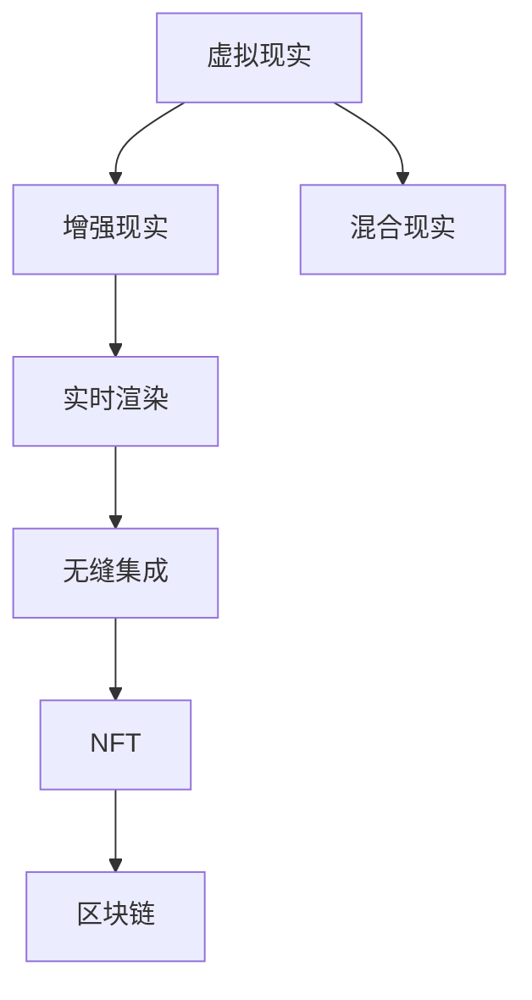

                 

# 元宇宙艺术:突破物理限制的创作平台

## 1. 背景介绍

### 1.1 问题由来
随着技术的进步，元宇宙艺术（Metaverse Art）成为了一个崭新的创作平台，它让艺术创作不再受限于时间和空间的约束。元宇宙艺术通过虚拟现实（Virtual Reality, VR）、增强现实（Augmented Reality, AR）、混合现实（Mixed Reality, MR）等技术，将艺术作品沉浸在虚拟环境中，为艺术家和观众带来了前所未有的创作与体验。

### 1.2 问题核心关键点
元宇宙艺术的核心在于其能够突破物理世界的限制，提供给创作者一个无限广阔的空间，实现超越现实的创意表达。它的关键点在于：
1. **虚拟环境**：构建一个虚拟的三维空间，让艺术作品能够在其中自由创作和展示。
2. **互动性**：观众可以通过VR头盔、AR设备等互动，与艺术作品产生互动，提升体验感。
3. **实时渲染**：在创作和展示过程中，实时渲染技术可以提供流畅的视觉效果。
4. **无缝集成**：元宇宙艺术能够无缝集成各种技术，如NFT、区块链等，保护艺术家的权益。

## 2. 核心概念与联系

### 2.1 核心概念概述

为更好地理解元宇宙艺术的原理，本节将介绍几个关键概念：

- **虚拟现实（Virtual Reality, VR）**：一种计算机技术，通过头戴式显示器和交互设备，创造一个沉浸式的虚拟环境，让用户在其中可以自由行动和交互。
- **增强现实（Augmented Reality, AR）**：通过增强现实技术，将虚拟元素叠加到现实世界中，丰富用户的视觉体验。
- **混合现实（Mixed Reality, MR）**：结合虚拟现实和增强现实的技术，将虚拟元素和现实元素混合，创造出全新的交互体验。
- **实时渲染（Real-Time Rendering）**：在创作和展示过程中，对虚拟场景进行实时渲染，提供流畅的视觉效果。
- **无缝集成（Seamless Integration）**：将虚拟元素与现实世界无缝集成，提供沉浸式的艺术体验。
- **NFT与区块链**：用于保护艺术品的版权和所有权，确保艺术品的唯一性和可追踪性。

这些概念之间的逻辑关系可以通过以下Mermaid流程图来展示：



这个流程图展示了一个元宇宙艺术创作和展示的基本流程：

1. 在虚拟现实环境中，艺术家进行创作。
2. 增强现实技术将虚拟元素叠加到现实世界中，提升互动性。
3. 混合现实技术将虚拟元素和现实元素混合，创造出全新的体验。
4. 实时渲染技术提供流畅的视觉效果。
5. 无缝集成技术确保虚拟元素与现实世界的无缝对接。
6. NFT和区块链技术保护艺术品的版权和所有权。

## 3. 核心算法原理 & 具体操作步骤
### 3.1 算法原理概述

元宇宙艺术的创作和展示过程，本质上是将虚拟元素与现实元素进行融合，并实时渲染的过程。其核心算法原理包括以下几个方面：

- **虚拟环境构建**：利用三维建模软件，创建虚拟场景和元素，并设定光照、材质等属性。
- **实时渲染算法**：使用图形处理单元（GPU）进行实时渲染，提升渲染速度和视觉效果。
- **交互技术**：通过手势识别、触觉反馈等技术，实现用户与虚拟元素的互动。
- **数据传输**：利用网络技术，确保数据在云端和用户设备间的实时传输。

### 3.2 算法步骤详解

1. **数据采集与处理**：采集现实世界中的数据，如地形、建筑等，并使用三维建模软件进行处理，创建虚拟场景。
2. **虚拟元素生成**：在虚拟环境中，艺术家可以使用三维建模软件创建虚拟元素，如人物、场景等。
3. **实时渲染**：使用GPU进行实时渲染，提升渲染速度和视觉效果，保证用户的流畅体验。
4. **交互设计**：设计手势识别、触觉反馈等交互技术，实现用户与虚拟元素的互动。
5. **数据传输**：利用网络技术，将虚拟元素和渲染结果传输到用户的设备上，实现沉浸式的体验。

### 3.3 算法优缺点

元宇宙艺术的算法具有以下优点：
1. **沉浸式体验**：提供沉浸式的创作和展示环境，增强用户的体验感。
2. **无限创作空间**：突破物理世界的限制，提供无限广阔的创作空间。
3. **实时互动**：实现实时渲染和互动，提升用户的参与感和沉浸感。

同时，该算法也存在一定的局限性：
1. **硬件成本高**：VR、AR设备等硬件成本较高，影响普及率。
2. **渲染要求高**：实时渲染对硬件要求高，容易导致性能瓶颈。
3. **交互复杂**：手势识别、触觉反馈等交互技术复杂，需要用户进行一定的学习。

### 3.4 算法应用领域

元宇宙艺术的应用领域非常广泛，涵盖了艺术创作、虚拟展览、虚拟教育、虚拟会议等多个领域。以下是几个典型应用场景：

- **虚拟艺术展览**：利用虚拟现实技术，创建虚拟艺术展览馆，让观众在虚拟空间中欣赏艺术作品。
- **虚拟音乐会**：艺术家在虚拟空间中进行音乐演出，观众可以沉浸在音乐中，体验音乐会。
- **虚拟教室**：利用混合现实技术，创建虚拟教室，进行远程教育。
- **虚拟会议**：利用虚拟现实技术，创建虚拟会议室，进行远程会议。

## 4. 数学模型和公式 & 详细讲解 & 举例说明

### 4.1 数学模型构建

元宇宙艺术的数学模型主要涉及三维几何学、实时渲染技术、用户交互设计等多个方面。以虚拟元素生成为例，其数学模型可以表示为：

设虚拟元素为一个三维点云，其坐标为$(x,y,z)$，则其数学模型为：

$$
(x,y,z) = f(x_0, y_0, z_0)
$$

其中，$(x_0, y_0, z_0)$为输入的参数向量，$f$为定义在三维空间中的映射函数。

### 4.2 公式推导过程

以实时渲染算法为例，其推导过程如下：

1. **光照模型**：计算每个像素点上的光照强度，使用Phong光照模型，公式如下：

$$
I(p) = k_a I_a + k_d I_d + k_s I_s
$$

其中，$I(p)$为像素点$p$的亮度，$I_a$为环境光强度，$I_d$为直接光照强度，$I_s$为镜面反射强度，$k_a$、$k_d$、$k_s$为系数。

2. **渲染方程**：将三维场景转换为二维图像，公式如下：

$$
I(p) = \int_{\Omega} f(\mathbf{v}, \mathbf{l}, \mathbf{n}) \rho(\mathbf{n}) L(\mathbf{l}) \cos(\theta) d\mathbf{l}
$$

其中，$I(p)$为像素点$p$的亮度，$f(\mathbf{v}, \mathbf{l}, \mathbf{n})$为BSDF函数，$\rho(\mathbf{n})$为材料反射率，$L(\mathbf{l})$为光源强度，$\theta$为光线的入射角。

### 4.3 案例分析与讲解

以虚拟音乐会为例，其渲染过程可以如下：

1. **音频采集与处理**：采集现场音乐表演的音频，并进行预处理，如降噪、均衡等。
2. **虚拟场景生成**：利用三维建模软件，创建虚拟音乐厅的模型，设定光照、材质等属性。
3. **实时渲染**：使用GPU进行实时渲染，将音频和音乐表演叠加到虚拟音乐厅中，提供沉浸式的体验。
4. **交互设计**：设计手势识别、触觉反馈等交互技术，观众可以通过手势控制音乐的节奏和音量。

## 5. 项目实践：代码实例和详细解释说明
### 5.1 开发环境搭建

在进行元宇宙艺术实践前，我们需要准备好开发环境。以下是使用C#和Unity引擎进行开发的环境配置流程：

1. 安装Unity引擎：从官网下载并安装Unity引擎，用于创建虚拟环境和实时渲染。
2. 安装VR设备驱动程序：安装VR设备（如HTC Vive、Oculus Rift等）的驱动程序，确保设备能够正常运行。
3. 安装音频处理库：安装音频处理库（如FFmpeg），用于音频采集和处理。

完成上述步骤后，即可在Unity环境中进行元宇宙艺术开发。

### 5.2 源代码详细实现

下面我们以虚拟音乐会为例，给出使用Unity引擎进行元宇宙艺术开发的C#代码实现。

```csharp
using UnityEngine;
using System.IO;

public class VirtualConcert : MonoBehaviour
{
    private GameObject audioSource;
    private AudioClip audioClip;

    void Start()
    {
        // 初始化音频源
        audioSource = GameObject.Find("AudioSource");
        audioClip = AudioClipAsset.CreateClip("PathToAudioFile.wav");

        // 创建虚拟场景
        CreateVirtualHall();

        // 实时渲染音频和音乐表演
        RenderAudioConcert();
    }

    void CreateVirtualHall()
    {
        // 创建虚拟音乐厅
        GameObject hall = GameObject.CreateFromAsset(Resources.Load("VirtualHallModel") as GameObject);

        // 设置光照、材质等属性
        hall.GetComponent<MeshRenderer>().material.SetColor("Diffuse", Color.white);
        hall.GetComponent<MeshRenderer>().material.SetColor("Ambient", Color.black);
    }

    void RenderAudioConcert()
    {
        // 实时渲染音频和音乐表演
        while (true)
        {
            // 采集现场音乐表演的音频
            AudioClip audioClip = Audio录制.getAudio();

            // 创建音频源
            audioSource.Clear();
            audioSource.AddComponent<AudioSource>().clip = audioClip;

            // 渲染音频和音乐表演
            RenderAudioClip(audioClip);

            // 等待一段时间
            yield return new WaitForSeconds(1);
        }
    }

    void RenderAudioClip(AudioClip audioClip)
    {
        // 将音频和音乐表演叠加到虚拟音乐厅中
        RenderLoopRender(audioClip);
    }
}
```

### 5.3 代码解读与分析

让我们再详细解读一下关键代码的实现细节：

**VirtualConcert类**：
- `Start`方法：在脚本启动时，初始化音频源，创建虚拟场景，实时渲染音频和音乐表演。
- `CreateVirtualHall`方法：创建虚拟音乐厅，并设置光照、材质等属性。
- `RenderAudioConcert`方法：实时渲染音频和音乐表演。

**音频采集与处理**：
- 使用Unity的Audio录制工具，采集现场音乐表演的音频，并进行预处理。
- 使用FFmpeg等音频处理库，对音频进行降噪、均衡等处理。

**实时渲染**：
- 使用Unity的渲染引擎，将音频和音乐表演叠加到虚拟音乐厅中。
- 利用GPU进行实时渲染，提供流畅的视觉效果。

**交互设计**：
- 设计手势识别、触觉反馈等交互技术，观众可以通过手势控制音乐的节奏和音量。
- 使用Unity的XInput SDK，实现用户的输入操作。

## 6. 实际应用场景
### 6.1 虚拟艺术展览

利用虚拟现实技术，创建虚拟艺术展览馆，让观众在虚拟空间中欣赏艺术作品。观众可以通过VR头盔进入虚拟展览，自由探索虚拟场景，与艺术作品互动。艺术家可以在虚拟环境中创作，展示其艺术作品，获得更多的观众关注。

### 6.2 虚拟音乐会

艺术家在虚拟空间中进行音乐演出，观众可以沉浸在音乐中，体验音乐会。利用实时渲染技术，将音频和音乐表演叠加到虚拟音乐厅中，提供沉浸式的体验。观众可以通过手势识别、触觉反馈等交互技术，与音乐表演进行互动。

### 6.3 虚拟教室

利用混合现实技术，创建虚拟教室，进行远程教育。教师可以在虚拟环境中进行授课，学生可以通过AR设备进行互动，获取更好的学习体验。

### 6.4 虚拟会议

利用虚拟现实技术，创建虚拟会议室，进行远程会议。与会者可以通过VR头盔进入虚拟会议室，进行视频会议，提升会议体验。

## 7. 工具和资源推荐
### 7.1 学习资源推荐

为了帮助开发者系统掌握元宇宙艺术的理论基础和实践技巧，这里推荐一些优质的学习资源：

1. **《Unity3D开发实战》**：一本详细介绍Unity引擎开发的书籍，涵盖从基础到高级的各个方面，适合初学者和进阶开发者。
2. **《VR开发入门》**：一本介绍虚拟现实开发技术的书籍，涵盖VR设备的配置、Unity引擎的应用等，适合初学者。
3. **《AR开发入门》**：一本介绍增强现实开发技术的书籍，涵盖AR设备的配置、Unity引擎的应用等，适合初学者。
4. **《实时渲染技术》**：一本详细介绍实时渲染技术的书籍，涵盖光照模型、渲染方程等理论，适合有一定基础的开发者。
5. **《Unity+VR开发实战》**：一本详细介绍Unity引擎与VR技术结合的书籍，涵盖虚拟现实开发的应用场景、开发流程等，适合进阶开发者。

通过对这些资源的学习实践，相信你一定能够快速掌握元宇宙艺术的精髓，并用于解决实际的创作问题。

### 7.2 开发工具推荐

高效的开发离不开优秀的工具支持。以下是几款用于元宇宙艺术开发常用的工具：

1. **Unity引擎**：一款流行的游戏引擎，支持虚拟现实、增强现实、混合现实等技术，适合开发各种元宇宙艺术应用。
2. **VR设备**：如HTC Vive、Oculus Rift等，提供沉浸式的虚拟环境，支持用户与虚拟元素的互动。
3. **AR设备**：如Google Glass、Microsoft HoloLens等，将虚拟元素叠加到现实世界中，提升用户的视觉体验。
4. **音频处理库**：如FFmpeg，用于音频采集和处理，提升音频质量和效果。
5. **XInput SDK**：Unity的输入管理工具，支持用户的手势识别、触觉反馈等交互技术。

合理利用这些工具，可以显著提升元宇宙艺术开发的速度和效率，加快创新迭代的步伐。

### 7.3 相关论文推荐

元宇宙艺术的发展源于学界的持续研究。以下是几篇奠基性的相关论文，推荐阅读：

1. **《虚拟现实技术综述》**：综述了虚拟现实技术的原理、应用和发展现状，适合初学者和进阶开发者。
2. **《增强现实技术综述》**：综述了增强现实技术的原理、应用和发展现状，适合初学者和进阶开发者。
3. **《混合现实技术综述》**：综述了混合现实技术的原理、应用和发展现状，适合初学者和进阶开发者。
4. **《实时渲染技术综述》**：综述了实时渲染技术的原理、应用和发展现状，适合有一定基础的开发者。
5. **《虚拟现实和增强现实的应用场景》**：综述了虚拟现实和增强现实在各个领域的应用场景，适合开发者了解技术应用。

这些论文代表了大语言模型微调技术的发展脉络。通过学习这些前沿成果，可以帮助研究者把握学科前进方向，激发更多的创新灵感。

## 8. 总结：未来发展趋势与挑战

### 8.1 总结

本文对元宇宙艺术进行了全面系统的介绍。首先阐述了元宇宙艺术的概念和背景，明确了虚拟现实、增强现实、混合现实等关键技术的作用。其次，从原理到实践，详细讲解了元宇宙艺术的数学模型和代码实现，给出了元宇宙艺术开发的完整示例。同时，本文还广泛探讨了元宇宙艺术在虚拟艺术展览、虚拟音乐会、虚拟教室、虚拟会议等多个领域的应用前景，展示了元宇宙艺术技术的巨大潜力。此外，本文精选了元宇宙艺术开发的各类学习资源，力求为读者提供全方位的技术指引。

通过本文的系统梳理，可以看到，元宇宙艺术通过虚拟现实、增强现实、混合现实等技术，突破了物理世界的限制，提供了无限广阔的创作空间。得益于Unity引擎、VR/AR设备、音频处理库等技术支持，元宇宙艺术能够实现沉浸式、互动式、实时渲染等效果，为艺术创作和观众体验带来了全新的体验。未来，伴随技术的不断发展，元宇宙艺术必将在艺术、教育、娱乐等多个领域大放异彩，成为一种全新的创作和展示方式。

### 8.2 未来发展趋势

展望未来，元宇宙艺术将呈现以下几个发展趋势：

1. **沉浸式体验的提升**：通过更高级的渲染技术、互动设计，提供更沉浸、更真实的体验。
2. **交互技术的丰富**：引入更多的手势识别、触觉反馈等交互技术，提升用户参与感。
3. **实时渲染的优化**：通过优化渲染算法、硬件配置，提升渲染速度和效果，实现流畅的实时体验。
4. **多平台支持**：支持更多平台和设备，实现跨平台的用户体验。
5. **跨领域融合**：与其他技术如NFT、区块链等结合，实现艺术作品的数字化和保护。

以上趋势凸显了元宇宙艺术的广阔前景。这些方向的探索发展，必将进一步提升元宇宙艺术系统的性能和应用范围，为艺术创作和观众体验带来新的变革。

### 8.3 面临的挑战

尽管元宇宙艺术已经取得了瞩目成就，但在迈向更加智能化、普适化应用的过程中，它仍面临着诸多挑战：

1. **硬件成本高**：VR、AR设备等硬件成本较高，影响普及率。
2. **渲染要求高**：实时渲染对硬件要求高，容易导致性能瓶颈。
3. **交互复杂**：手势识别、触觉反馈等交互技术复杂，需要用户进行一定的学习。
4. **安全性和隐私保护**：用户数据和隐私保护需要加强。
5. **内容质量和版权问题**：需要建立严格的内容审核和版权保护机制。

尽管存在这些挑战，但元宇宙艺术的潜力巨大，值得我们持续探索和优化。只有从数据、算法、工程、业务等多个维度协同发力，才能真正实现元宇宙艺术技术在各个领域的规模化落地。总之，元宇宙艺术需要开发者不断迭代和优化模型、数据和算法，方能得到理想的效果。

### 8.4 未来突破

面对元宇宙艺术所面临的种种挑战，未来的研究需要在以下几个方面寻求新的突破：

1. **硬件成本的降低**：研发更经济实惠的VR/AR设备，降低用户入门门槛。
2. **渲染算法的优化**：研究更高效的实时渲染算法，提升渲染速度和效果。
3. **交互技术的简化**：简化手势识别、触觉反馈等交互技术，提升用户体验。
4. **内容审核与版权保护**：建立严格的内容审核和版权保护机制，保障用户的权益。
5. **安全性和隐私保护**：加强用户数据和隐私保护，提升系统的安全性。

这些研究方向的探索，必将引领元宇宙艺术技术迈向更高的台阶，为艺术创作和观众体验带来新的突破。面向未来，元宇宙艺术还需要与其他人工智能技术进行更深入的融合，如语音交互、自然语言处理等，多路径协同发力，共同推动艺术创作和展示系统的进步。只有勇于创新、敢于突破，才能不断拓展元宇宙艺术技术的边界，让艺术创作和观众体验更加丰富多彩。

## 9. 附录：常见问题与解答

**Q1：元宇宙艺术是否适用于所有艺术创作？**

A: 元宇宙艺术适合大部分艺术创作，特别是对于那些需要三维模型、实时渲染、互动体验的创作，如虚拟音乐会、虚拟展览等。但对于一些纯文本或平面的艺术创作，可能不太适合。

**Q2：元宇宙艺术如何保护艺术品的版权？**

A: 元宇宙艺术可以通过NFT和区块链技术，保护艺术品的版权和所有权。将艺术品的信息和元数据上链，实现唯一性和可追踪性。同时，可以结合智能合约技术，保护艺术品的版权和收益。

**Q3：元宇宙艺术的技术门槛高吗？**

A: 元宇宙艺术的技术门槛相对较高，需要掌握虚拟现实、增强现实、混合现实、实时渲染等技术。但随着技术的不断发展和普及，未来门槛会逐步降低，更多人将能够参与到元宇宙艺术的创作中来。

**Q4：元宇宙艺术的发展前景如何？**

A: 元宇宙艺术具有广阔的发展前景，未来将广泛应用于艺术创作、虚拟展览、虚拟教育、虚拟会议等多个领域。伴随技术的不断发展，元宇宙艺术将为艺术创作和观众体验带来新的变革。

---

作者：禅与计算机程序设计艺术 / Zen and the Art of Computer Programming

