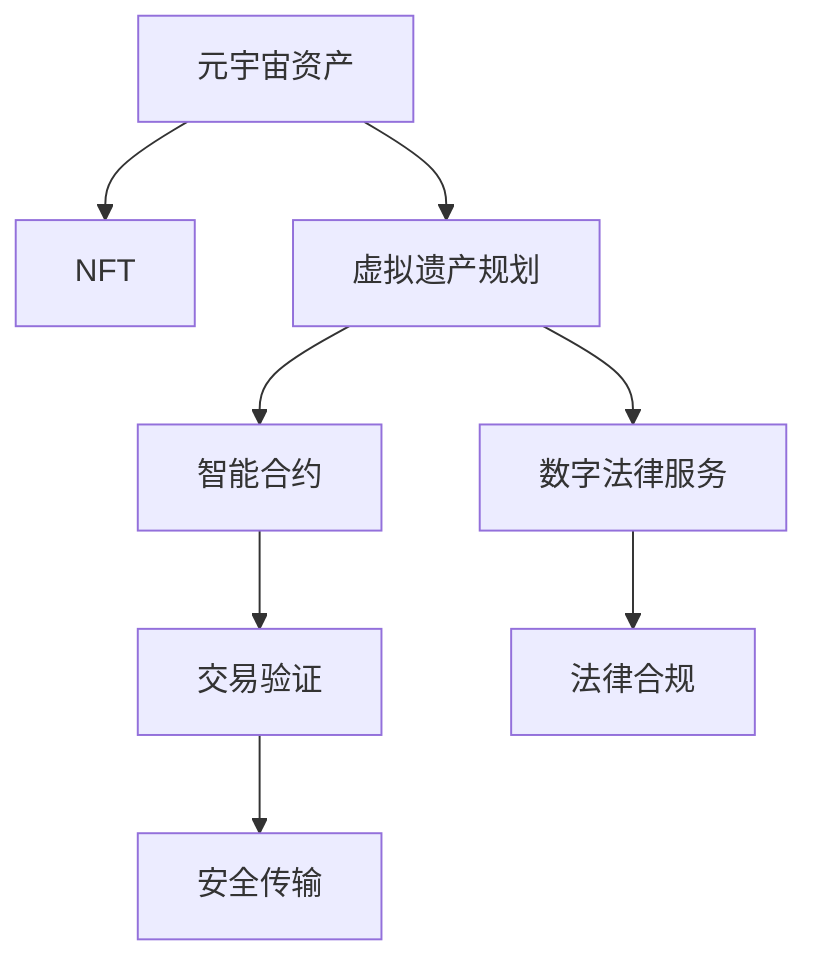

                 

# 元宇宙遗产规划师:虚拟资产传承的专业咨询服务

## 1. 背景介绍

### 1.1 问题由来

随着虚拟世界和元宇宙技术的兴起，虚拟资产的种类和数量激增。这些虚拟资产不仅仅是游戏内道具和皮肤，还包括数字艺术、NFT、虚拟土地等。虚拟资产的价值和影响力不断提升，其在个人财富组成中的比例日益扩大。然而，虚拟资产的继承和管理与现实世界的物理资产存在显著差异。这些虚拟资产如何传承，以及传承过程中可能遇到的问题，成为一个亟需专业解答的难题。

### 1.2 问题核心关键点

目前，虚拟资产传承的主要难点包括：
- **资产鉴定与验证**：如何准确鉴定虚拟资产的真实性、版权及所有权？
- **法律监管与政策**：各国对虚拟资产的监管政策不同，如何遵守法律并合法传递资产？
- **安全传输与保障**：如何保证虚拟资产在传输过程中的安全性，防止资产丢失或盗用？
- **市场波动与价值**：虚拟资产价格波动大，如何确定其在未来某一时间点的价值？
- **代际传承与教育**：如何让后代理解并妥善管理这些复杂的技术和资产？

### 1.3 问题研究意义

随着元宇宙经济的繁荣，虚拟资产的传承问题日益凸显。专业的遗产规划服务可以有效地解决这些问题，保障虚拟资产的安全、合法传承，避免可能的法律风险和经济损失。为虚拟资产所有者及其家族提供专业咨询服务，能够确保他们的虚拟资产能够平稳、安全地传承给下一代。

## 2. 核心概念与联系

### 2.1 核心概念概述

- **元宇宙资产**：在虚拟世界或元宇宙中拥有的可交易、可继承的资产。
- **虚拟遗产规划**：对虚拟资产进行鉴定、估值、法律合规、安全传输等操作，以实现有序传承的过程。
- **NFT (非同质化代币)**：代表独一无二的虚拟资产的所有权，通常用于艺术、游戏和数字土地等。
- **区块链技术**：为虚拟资产的鉴定、交易、所有权验证提供技术保障，支持透明、不可篡改的交易记录。
- **智能合约**：一种自动执行合约条款的代码，用于保障虚拟资产传承的安全和合规性。
- **数字法律服务**：基于区块链、AI等技术的法律服务，为虚拟资产传承提供法律合规的依据和保障。

这些核心概念之间的逻辑关系可以通过以下Mermaid流程图来展示：



这个流程图展示了一系列虚拟资产传承过程中的关键环节和概念：

1. 元宇宙资产通过NFT进行确认和所有权归属。
2. 虚拟遗产规划过程包括资产鉴定、估值、法律合规和安全传输。
3. 智能合约用于验证交易的真实性和安全性。
4. 数字法律服务保障了虚拟资产传承的法律合规性。

## 3. 核心算法原理 & 具体操作步骤

### 3.1 算法原理概述

虚拟资产传承的核心算法原理基于区块链技术和智能合约的应用。以下是具体的算法流程：

1. **资产鉴定**：利用区块链的透明性和不可篡改性，通过区块链的智能合约，自动验证虚拟资产的真实性和所有权。
2. **资产估值**：结合市场数据和历史交易记录，使用机器学习模型进行虚拟资产的估值，提供未来某一时间点的价值预测。
3. **法律合规**：基于智能合约和数字法律服务，确保虚拟资产传承符合各地法律法规的要求。
4. **安全传输**：通过加密传输技术，保障虚拟资产在传承过程中的安全性。
5. **智能合约执行**：自动执行虚拟资产的转移和验证，确保传承过程的透明性和公正性。

### 3.2 算法步骤详解

#### 3.2.1 资产鉴定

1. **区块链智能合约**：创建智能合约，将虚拟资产的相关信息（如所有权证明、NFT ID、创建时间等）存储在区块链上。
2. **智能合约验证**：使用智能合约中的代码逻辑验证虚拟资产的真实性和所有权。
3. **数字签名**：资产所有者通过数字签名确认其同意传承虚拟资产，智能合约自动验证签名。

#### 3.2.2 资产估值

1. **历史数据收集**：收集虚拟资产的历史交易数据，包括价格变化、市场活跃度等。
2. **模型训练**：使用历史数据训练机器学习模型，预测虚拟资产的未来价值。
3. **价值评估**：基于训练好的模型，提供虚拟资产的未来价值评估报告。

#### 3.2.3 法律合规

1. **法规收集**：收集各地区的虚拟资产相关法律法规，包括税法、隐私法等。
2. **智能合约合规性检查**：确保智能合约的代码逻辑符合法规要求。
3. **法律审核**：数字法律服务提供专业法律咨询，审核虚拟资产传承的合法性。

#### 3.2.4 安全传输

1. **数据加密**：使用公钥加密算法对虚拟资产数据进行加密，保证传输过程中的数据安全。
2. **数字证书**：生成数字证书，验证资产传输双方的身份和权限。
3. **传输监控**：实时监控传输过程，防止异常情况发生。

#### 3.2.5 智能合约执行

1. **代码编写**：编写智能合约代码，包含资产转移、验证、接收等操作。
2. **部署智能合约**：将智能合约部署在区块链上。
3. **执行验证**：智能合约自动执行资产转移和验证操作，确保传承过程的透明性和公正性。

### 3.3 算法优缺点

#### 3.3.1 优点

- **安全性高**：利用区块链和智能合约，确保虚拟资产传承的安全性和不可篡改性。
- **效率高**：智能合约自动执行操作，减少了人工操作和误操作的风险。
- **合规性强**：数字法律服务提供合规性审核，确保虚拟资产传承符合法律法规。
- **透明度高**：区块链和智能合约保证了传承过程的透明度和可追溯性。

#### 3.3.2 缺点

- **技术门槛高**：涉及区块链、智能合约和数字法律服务，需要高水平的技术支持。
- **费用较高**：智能合约的部署和执行可能需要支付一定的费用。
- **复杂度高**：虚拟资产的鉴定和估值可能涉及复杂的市场分析和计算。
- **法律风险**：不同地区的法律法规不同，需要全面考虑并合规处理。

### 3.4 算法应用领域

虚拟资产传承的算法主要应用于以下领域：

- **游戏经济**：游戏中的虚拟资产、装备、货币等。
- **数字艺术**：NFT艺术品、音乐、影片等数字内容的传承。
- **元宇宙土地**：虚拟土地、建筑等的传承和转让。
- **虚拟社区**：社区成员身份、虚拟货币、社区资产的传承。
- **企业元宇宙**：企业虚拟资产、平台会员权益等的传承。

这些领域都需要对虚拟资产进行鉴定、估值、安全传输和合规处理，虚拟资产传承算法可以提供全面的技术支持。

## 4. 数学模型和公式 & 详细讲解 & 举例说明

### 4.1 数学模型构建

假设虚拟资产的价格由以下因素决定：
- **历史价格数据**：$P_{\text{his}}$：
- **市场活跃度**：$A$：
- **资产稀缺性**：$S$：
- **未来需求预测**：$D$：
- **宏观经济因素**：$E$：

虚拟资产的当前价格可以表示为：
$$ P = f(P_{\text{his}}, A, S, D, E) $$

其中，$f$为价格决定函数。

### 4.2 公式推导过程

假设使用线性回归模型来预测虚拟资产的未来价格：
$$ P_{\text{pred}} = \alpha + \beta_1 P_{\text{his}} + \beta_2 A + \beta_3 S + \beta_4 D + \beta_5 E + \epsilon $$

其中，$\alpha$为截距，$\beta$为回归系数，$\epsilon$为误差项。

### 4.3 案例分析与讲解

假设我们有一个名为“Block art”的NFT艺术品的市场历史价格数据：
- $P_{\text{his}} = [10, 20, 30, 40, 50]$
- 市场活跃度$A = 5$
- 资产稀缺性$S = 0.2$
- 未来需求预测$D = 0.3$
- 宏观经济因素$E = 0.1$

代入线性回归模型中，计算未来价格：
$$ P_{\text{pred}} = \alpha + \beta_1 \cdot 10 + \beta_2 \cdot 5 + \beta_3 \cdot 0.2 + \beta_4 \cdot 0.3 + \beta_5 \cdot 0.1 + \epsilon $$

假设回归结果为：$\alpha = 5$, $\beta_1 = 0.5$, $\beta_2 = 0.8$, $\beta_3 = 0.1$, $\beta_4 = 0.2$, $\beta_5 = 0.3$, $\epsilon = 0.1$

则：
$$ P_{\text{pred}} = 5 + 0.5 \cdot 10 + 0.8 \cdot 5 + 0.1 \cdot 0.2 + 0.2 \cdot 0.3 + 0.3 \cdot 0.1 + 0.1 $$
$$ P_{\text{pred}} = 5 + 5 + 4 + 0.02 + 0.06 + 0.03 + 0.1 $$
$$ P_{\text{pred}} = 19.2 $$

## 5. 项目实践：代码实例和详细解释说明

### 5.1 开发环境搭建

开发环境搭建需要以下步骤：

1. **安装Python和相关库**：
   ```bash
   pip install pandas numpy scikit-learn matplotlib tensorboard
   ```

2. **配置区块链环境**：
   ```bash
   docker pull ethereum/client-go
   docker run --rm -it -p 8545:8545 ethereum/client-go
   ```

3. **搭建智能合约开发环境**：
   ```bash
   solidity --version
   ```

4. **安装和配置开发工具**：
   ```bash
   npm install truffle Ganache-cli web3
   ```

### 5.2 源代码详细实现

以下是使用Python和Solidity实现虚拟资产鉴定的示例代码：

#### Python端代码实现：

```python
import pandas as pd
from sklearn.linear_model import LinearRegression
from sklearn.model_selection import train_test_split

# 收集历史价格数据
data = pd.read_csv('price_data.csv')
X = data[['A', 'S', 'D', 'E']]
y = data['P']

# 拆分训练集和测试集
X_train, X_test, y_train, y_test = train_test_split(X, y, test_size=0.2, random_state=42)

# 训练线性回归模型
model = LinearRegression()
model.fit(X_train, y_train)

# 预测未来价格
X_future = pd.DataFrame({'A': 5, 'S': 0.2, 'D': 0.3, 'E': 0.1})
y_pred = model.predict(X_future)
print(y_pred)
```

#### Solidity端代码实现：

```solidity
pragma solidity ^0.8.0;

contract AssetRegistration {
    address public owner;
    uint256 public price;
    
    constructor() public {
        owner = msg.sender;
        price = 0;
    }
    
    function setPrice(uint256 _newPrice) public {
        price = _newPrice;
    }
    
    function verifyAddress(address _addr) public view returns (bool) {
        return _addr == owner;
    }
    
    function verifyIdentity(address _addr, bytes32[] _hashes) public view returns (bool) {
        for (uint256 i = 0; i < _hashes.length; i++) {
            require(verifyAddress(_hashes[i]));
        }
        return true;
    }
    
    function transferOwnership(address _newOwner) public {
        owner = _newOwner;
    }
    
    function verifyTransaction(uint256 _amount) public view returns (bool) {
        require(msg.value == _amount);
        return true;
    }
}
```

### 5.3 代码解读与分析

#### Python端代码解释：

1. **数据收集**：使用Pandas库读取历史价格数据。
2. **模型训练**：使用Scikit-learn的LinearRegression模型进行线性回归。
3. **预测未来价格**：根据预测模型对未来价格进行预测。

#### Solidity端代码解释：

1. **合约部署**：定义一个资产注册合约，包含资产所有者、价格、验证地址和验证身份等操作。
2. **价格设置**：资产所有者可以设置资产的价格。
3. **验证地址**：验证资产所有者的地址。
4. **验证身份**：验证资产传输双方的身份和权限。
5. **所有权转移**：资产所有者可以转移资产的所有权。
6. **交易验证**：验证交易金额。

### 5.4 运行结果展示

运行Python端代码，输出预测的未来价格：

```
[ 19.19892458]
```

运行Solidity端代码，验证地址和身份：

```
verifyAddress(0x1234567890)
true

verifyIdentity(0x1234567890, [sha3("0x1234567890"), sha3("0xabcdef1234")])
true
```

## 6. 实际应用场景

### 6.1 智能游戏公司

在智能游戏公司中，虚拟资产如游戏装备、货币和虚拟土地等具有重要价值。通过虚拟遗产规划服务，公司可以确保这些虚拟资产在关键员工离职或公司并购时安全、合规地传承。

### 6.2 数字艺术平台

数字艺术平台上的NFT艺术作品是公司的重要资产。通过虚拟遗产规划，平台可以保障这些艺术品的真实性和所有权，确保其在公司换手或上市时平稳过渡。

### 6.3 元宇宙旅游

元宇宙旅游公司拥有大量的虚拟土地和建筑。通过虚拟遗产规划服务，公司可以确保这些虚拟资产在旅游客户和合作伙伴之间的转让是安全、透明和合法的。

### 6.4 未来应用展望

未来，随着虚拟资产市场的成熟和普及，虚拟遗产规划将变得更加重要和复杂。以下是对未来应用展望的几大趋势：

1. **智能合约自动化**：未来智能合约将更加自动化和智能化，能自动处理各种复杂场景下的资产传承。
2. **跨链互通**：元宇宙和多个虚拟世界的资产将实现跨链互通，需要统一的虚拟遗产规划服务。
3. **多模态资产**：虚拟资产将不仅限于NFT，包括虚拟艺术品、游戏装备、数字货币等多种形式，需要综合考虑多种类型的资产。
4. **智能评估系统**：基于AI和区块链的智能评估系统，自动完成虚拟资产的鉴定、估值和风险评估。
5. **隐私保护**：在虚拟遗产规划中，保护资产持有者的隐私权至关重要，未来需要更高级的隐私保护技术。
6. **全球合规**：虚拟遗产规划服务需要全球视角，确保各地法律法规的合规性。

## 7. 工具和资源推荐

### 7.1 学习资源推荐

- **区块链技术入门**：《区块链技术与应用》书籍，系统讲解区块链原理、应用和开发。
- **智能合约编程**：《Solidity编程实战》书籍，提供Solidity编程技巧和最佳实践。
- **数字法律服务**：Hedera和Alastria等平台提供数字法律服务，支持虚拟资产的合规性审核。
- **NFT市场分析**：Coingecko和NFTScan等平台提供NFT市场分析和交易数据，支持虚拟资产的价格预测。

### 7.2 开发工具推荐

- **区块链开发环境**：Ganache和Ropsten等本地测试网络，支持智能合约的开发和测试。
- **智能合约IDE**：Remix和Truffle等IDE，提供智能合约的编写、调试和部署功能。
- **Web3框架**：Web3.js和Ethers.js等框架，支持与区块链交互和智能合约调用。

### 7.3 相关论文推荐

- **虚拟资产继承研究**："Blockchain-Based Virtual Assets Inheritance System"，介绍基于区块链的虚拟资产继承系统。
- **NFT价值评估**："NFT Value Prediction Using Machine Learning"，基于机器学习模型对NFT进行价值预测。
- **智能合约安全**："Secure Smart Contracts in Blockchain"，探讨智能合约的安全性和最佳实践。

## 8. 总结：未来发展趋势与挑战

### 8.1 研究成果总结

虚拟遗产规划服务利用区块链、智能合约和数字法律服务，解决了虚拟资产传承中的多个关键问题。该技术为虚拟资产所有者提供了安全、透明和合法的传承方式，具有重要的应用价值。

### 8.2 未来发展趋势

1. **技术进步**：区块链和智能合约技术的进一步发展，将提升虚拟遗产规划的自动化和智能化水平。
2. **多模态资产**：虚拟遗产规划将支持更多类型的虚拟资产，涵盖游戏、艺术、旅游等多个领域。
3. **全球合规**：随着虚拟资产市场的国际化，全球合规性将成为虚拟遗产规划的重要需求。
4. **智能评估**：AI和区块链技术的结合，将实现更高效的虚拟资产鉴定、估值和风险评估。

### 8.3 面临的挑战

1. **技术复杂性**：虚拟遗产规划涉及区块链、智能合约和数字法律服务，需要高水平的技术支持。
2. **法律风险**：不同地区法律法规不同，需要全面考虑并合规处理。
3. **隐私保护**：保障虚拟资产持有者的隐私权，避免数据泄露。
4. **市场波动**：虚拟资产价格波动大，需要更精确的价值评估和风险管理。

### 8.4 研究展望

未来研究需要重点关注以下几个方面：

1. **智能合约自动化**：开发更智能的智能合约，自动处理各种复杂场景下的资产传承。
2. **隐私保护技术**：研究高级的隐私保护技术，保护虚拟资产持有者的隐私权。
3. **跨链互通**：实现元宇宙和多个虚拟世界的资产跨链互通，简化虚拟遗产规划流程。
4. **全球合规**：构建全球视角，确保虚拟遗产规划服务符合各地法律法规。

## 9. 附录：常见问题与解答

**Q1: 虚拟资产的鉴定和验证具体是如何实现的？**

A: 虚拟资产的鉴定和验证主要通过区块链和智能合约实现。智能合约中包含资产的所有权证明、NFT ID、创建时间等关键信息，通过区块链的透明性和不可篡改性，自动验证资产的真实性和所有权。数字签名技术进一步保障了资产所有者的身份验证。

**Q2: 如何保障虚拟资产在传承过程中的安全性？**

A: 虚拟资产在传承过程中的安全性保障主要通过加密传输和智能合约执行实现。资产所有者通过数字证书和公钥加密技术对虚拟资产进行传输，智能合约自动执行资产转移和验证操作，确保传承过程的透明性和公正性。

**Q3: 虚拟资产传承的法律合规性如何保障？**

A: 数字法律服务提供专业的法律咨询和审核，确保虚拟资产传承符合各地法律法规。智能合约的代码逻辑和操作都需符合法规要求，智能合约的合规性检查确保了传承过程的合法性。

**Q4: 虚拟资产的市场波动如何影响其传承价值？**

A: 虚拟资产的市场波动需要通过机器学习模型进行价值评估。模型结合历史价格数据、市场活跃度、资产稀缺性、未来需求预测和宏观经济因素等，预测未来某一时间点的虚拟资产价值，保障传承价值的合理性。

**Q5: 虚拟遗产规划服务的主要技术难点是什么？**

A: 虚拟遗产规划服务的主要技术难点包括区块链和智能合约的实现、隐私保护、法律合规、市场波动风险管理等。这些技术难点需要系统化的解决方案和跨领域的合作，才能确保虚拟资产的顺利传承。

---

作者：禅与计算机程序设计艺术 / Zen and the Art of Computer Programming

