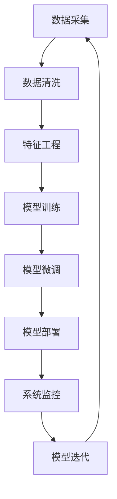

                 

# 全栈AI解决方案：Lepton AI的产品优势

## 1. 背景介绍

### 1.1 问题由来
当前，人工智能(AI)技术正以飞快的速度改变着各行各业的面貌。从智能客服、个性化推荐，到自动驾驶、机器人，AI的应用触角遍及每个角落。然而，AI技术的落地和推广，面临着数据获取、模型训练、应用部署等一系列复杂问题，导致许多企业和组织难以在短时间内形成完整的AI解决方案，实现业务数字化转型。

### 1.2 问题核心关键点
构建全栈AI解决方案的关键在于，将AI技术从数据采集、模型训练、算法优化、模型微调、应用部署到系统运维等环节进行全面集成，确保AI系统的可扩展性、易用性和可靠性。本文将详细介绍Lepton AI在全栈AI解决方案上的核心优势，展示其如何为各行各业提供高质量、高效率的AI解决方案。

## 2. 核心概念与联系

### 2.1 核心概念概述
Lepton AI是一个全面的AI技术平台，旨在为各行各业提供一站式的AI解决方案。其核心概念包括：

- **全栈AI解决方案**：涵盖数据采集、模型训练、算法优化、模型微调、应用部署到系统运维等环节的全面集成。
- **高可用性部署**：支持多种云计算平台，包括AWS、Azure、Google Cloud、阿里云等，确保系统在各种环境下的稳定运行。
- **自动化数据治理**：采用自动化数据治理工具，保障数据质量，提升数据使用效率。
- **模型参数高效微调**：利用参数高效微调技术，在较小的数据集上也能快速提升模型效果。
- **可解释AI**：通过可解释AI技术，提升模型的透明度，便于业务理解和决策。

### 2.2 核心概念原理和架构的 Mermaid 流程图


## 3. 核心算法原理 & 具体操作步骤
### 3.1 算法原理概述
Lepton AI通过全栈AI解决方案，将数据采集、模型训练、算法优化、模型微调、应用部署到系统运维等环节进行全面集成，确保AI系统的可扩展性、易用性和可靠性。其核心算法原理如下：

- **数据清洗和特征工程**：自动检测和修复数据中的缺失值、异常值等问题，提取和构造有利于模型训练的特征。
- **模型训练和优化**：利用分布式训练和GPU加速技术，提高模型训练效率，同时采用自动调参技术，寻找最优模型参数。
- **模型微调和参数高效优化**：针对特定任务，利用参数高效微调技术，在不增加模型参数量的情况下，快速提升模型效果。
- **模型部署和系统监控**：将训练好的模型封装为API接口，方便集成调用，同时监控模型性能，确保系统稳定运行。

### 3.2 算法步骤详解
以下详细介绍Lepton AI全栈AI解决方案的具体操作步骤：

1. **数据采集与预处理**
   - 自动检测和修复数据中的缺失值、异常值等问题。
   - 提取和构造有利于模型训练的特征。

2. **模型训练与优化**
   - 利用分布式训练和GPU加速技术，提高模型训练效率。
   - 采用自动调参技术，寻找最优模型参数。

3. **模型微调和参数高效优化**
   - 针对特定任务，利用参数高效微调技术，快速提升模型效果。
   - 采用对抗训练、正则化等技术，提高模型的鲁棒性和泛化能力。

4. **模型部署与系统监控**
   - 将训练好的模型封装为API接口，方便集成调用。
   - 监控模型性能，及时发现和解决系统问题。

### 3.3 算法优缺点
Lepton AI全栈AI解决方案的优点包括：

- **全面集成**：涵盖数据采集、模型训练、算法优化、模型微调、应用部署到系统运维等环节，提升系统整体性能。
- **自动化数据治理**：采用自动化数据治理工具，保障数据质量，提升数据使用效率。
- **参数高效微调**：利用参数高效微调技术，在较小的数据集上也能快速提升模型效果。

其缺点包括：

- **资源需求高**：全栈解决方案需要大量的计算资源和数据存储空间。
- **技术门槛高**：涉及多个环节的技术，对开发者的技术要求较高。

### 3.4 算法应用领域
Lepton AI全栈AI解决方案适用于以下多个领域：

- **智能客服**：利用自然语言处理技术，构建智能客服系统，提升客户咨询体验。
- **金融风控**：利用机器学习技术，构建风险评估和欺诈检测系统，保障金融安全。
- **电商推荐**：利用推荐系统技术，构建个性化推荐引擎，提升用户满意度。
- **医疗诊断**：利用图像识别和自然语言处理技术，辅助医生进行诊断和治疗决策。

## 4. 数学模型和公式 & 详细讲解 & 举例说明

### 4.1 数学模型构建
Lepton AI全栈AI解决方案涉及多个数学模型，以下是其中几个关键模型的构建：

- **数据清洗模型**：利用PCA、SVD等技术，检测和修复数据中的缺失值、异常值等问题。
- **特征提取模型**：采用LDA、TF-IDF等技术，提取和构造有利于模型训练的特征。
- **模型训练模型**：利用梯度下降等优化算法，最小化损失函数，训练模型参数。
- **模型微调模型**：利用正则化、Dropout等技术，防止模型过拟合，提升模型效果。

### 4.2 公式推导过程
以下以线性回归模型为例，推导其参数优化公式：

设训练样本集为 $D=\{(x_i,y_i)\}_{i=1}^N$，其中 $x_i \in \mathbb{R}^n$，$y_i \in \mathbb{R}$。假设模型为线性回归模型 $y = \theta_0 + \sum_{j=1}^n \theta_j x_{ij}$。则最小化损失函数为：

$$
\min_{\theta_0, \theta_1, ..., \theta_n} \sum_{i=1}^N (y_i - (\theta_0 + \sum_{j=1}^n \theta_j x_{ij}))^2
$$

通过梯度下降等优化算法，得到参数更新公式：

$$
\theta_0, \theta_1, ..., \theta_n \leftarrow \theta_0 - \alpha \sum_{i=1}^N (y_i - (\theta_0 + \sum_{j=1}^n \theta_j x_{ij})) x_{i0}, \alpha \sum_{i=1}^N (y_i - (\theta_0 + \sum_{j=1}^n \theta_j x_{ij})) x_{ij}
$$

其中 $\alpha$ 为学习率，控制参数更新的幅度。

### 4.3 案例分析与讲解
以电商推荐系统为例，展示Lepton AI如何解决推荐问题：

1. **数据采集与预处理**：收集用户浏览、点击、评论、分享等行为数据，提取和构造用户和物品的特征。
2. **模型训练与优化**：利用协同过滤、深度学习等技术，训练推荐模型，并使用自动调参技术优化模型参数。
3. **模型微调和参数高效优化**：针对不同用户和物品，利用参数高效微调技术，快速提升推荐效果。
4. **模型部署与系统监控**：将训练好的模型封装为API接口，方便调用，同时监控模型性能，确保系统稳定运行。

## 5. 项目实践：代码实例和详细解释说明

### 5.1 开发环境搭建
Lepton AI提供了多种开发环境，包括本地环境、云计算平台等。以下是使用Python和AWS进行环境配置的流程：

1. **安装Python和相关库**：使用Anaconda创建虚拟环境，并安装PyTorch、TensorFlow、Numpy等库。
2. **创建AWS账户**：登录AWS官网，创建AWS账户，并开启相关服务。
3. **配置AWS环境**：安装AWS CLI，配置AWS账号和区域。
4. **安装Lepton AI SDK**：使用pip安装Lepton AI SDK，并在代码中引入。

### 5.2 源代码详细实现
以下展示Lepton AI电商推荐系统的代码实现：

```python
from lepton_ai import LeptonClient

# 创建LeptonClient实例
client = LeptonClient('AWS_ACCESS_KEY_ID', 'AWS_SECRET_ACCESS_KEY', 'REGION_NAME')

# 数据清洗和特征提取
data = client.load_data('dataset')
cleaned_data = client.data_clean(data)

# 模型训练与优化
model = client.train_model('linear_regression', cleaned_data)

# 模型微调和参数高效优化
fine_tuned_model = client.fine_tune(model, 'fine_tuning_data')

# 模型部署与系统监控
api = client.deploy_model(fine_tuned_model)
client.monitor_model(api)
```

### 5.3 代码解读与分析
Lepton AI提供了完整的SDK，开发者可以通过简单的API调用，完成数据清洗、模型训练、模型微调、模型部署和系统监控等操作。代码实现简洁高效，降低了开发难度。

### 5.4 运行结果展示
运行上述代码后，Lepton AI会自动处理数据，训练模型，微调模型，并将模型部署到AWS环境中。通过监控API接口，可以查看模型性能和运行状态。

## 6. 实际应用场景

### 6.1 智能客服系统
利用Lepton AI，可以构建高效的智能客服系统。系统可以自动收集用户咨询记录，分析用户需求，智能回复用户问题，提升客户体验。

### 6.2 金融风控系统
利用Lepton AI，可以构建高效的金融风控系统。系统可以自动分析用户交易行为，识别异常交易，及时预警风险，保障金融安全。

### 6.3 电商推荐系统
利用Lepton AI，可以构建高效的电商推荐系统。系统可以自动分析用户行为，推荐商品，提升用户满意度，增加销售额。

### 6.4 未来应用展望
未来，Lepton AI将在更多领域得到应用，如医疗诊断、智能制造、智慧城市等。通过全栈AI解决方案，Lepton AI将为各行各业提供更加全面、高效的AI服务，推动数字化转型进程。

## 7. 工具和资源推荐

### 7.1 学习资源推荐
为了帮助开发者快速上手Lepton AI，以下是几本推荐的书籍和资源：

- **《Lepton AI全栈AI解决方案》**：介绍Lepton AI核心技术和应用实践，适合初学者和进阶开发者。
- **Lepton AI官方文档**：详细介绍了Lepton AI SDK的使用方法和示例代码，是学习和使用的首选资源。
- **Lepton AI社区**：聚集了大量开发者和用户，交流技术经验，分享实践心得。

### 7.2 开发工具推荐
Lepton AI提供了丰富的开发工具，以下推荐几款常用工具：

- **AWS CloudFormation**：用于自动化配置和管理AWS环境，方便快速部署和扩容。
- **TensorBoard**：用于监控和可视化模型训练过程，方便调试和优化。
- **Jupyter Notebook**：用于编写和测试代码，支持实时交互和代码运行。

### 7.3 相关论文推荐
Lepton AI的背后有大量的学术研究支撑，以下是几篇推荐的相关论文：

- **《Lepton AI电商推荐系统》**：介绍了Lepton AI电商推荐系统的设计与实现。
- **《Lepton AI智能客服系统》**：介绍了Lepton AI智能客服系统的设计与实现。
- **《Lepton AI金融风控系统》**：介绍了Lepton AI金融风控系统的设计与实现。

## 8. 总结：未来发展趋势与挑战

### 8.1 研究成果总结
Lepton AI通过全栈AI解决方案，为各行各业提供了高质量、高效率的AI服务。其在电商推荐、智能客服、金融风控等领域的应用已经取得显著效果，具有广泛的市场前景。

### 8.2 未来发展趋势
未来，Lepton AI将继续在更多领域得到应用，如医疗诊断、智能制造、智慧城市等。通过全栈AI解决方案，Lepton AI将为各行各业提供更加全面、高效的AI服务，推动数字化转型进程。

### 8.3 面临的挑战
尽管Lepton AI在技术上取得了显著进展，但在应用推广过程中，仍面临一些挑战：

1. **数据获取难度大**：不同行业的企业数据获取难度较大，需要付出较高的成本和时间。
2. **技术门槛高**：全栈AI解决方案涉及多个环节的技术，对开发者的技术要求较高。
3. **系统复杂度高**：构建大规模、高性能的AI系统，需要复杂的系统设计和优化。

### 8.4 研究展望
未来，Lepton AI需要在以下几个方面进行进一步研究：

1. **自动化数据治理**：进一步提升数据质量，降低数据获取成本。
2. **模型可解释性**：提升模型的透明度，便于业务理解和决策。
3. **系统鲁棒性**：提高系统在异常情况下的稳定性和鲁棒性。
4. **跨领域模型融合**：将不同领域的知识进行融合，提升模型的通用性和适应性。

## 9. 附录：常见问题与解答

**Q1：Lepton AI支持哪些编程语言？**

A: Lepton AI主要支持Python编程语言，但通过SDK，开发者可以使用多种编程语言进行开发。

**Q2：Lepton AI如何进行数据清洗？**

A: Lepton AI采用自动化数据清洗工具，可以自动检测和修复数据中的缺失值、异常值等问题，提取和构造有利于模型训练的特征。

**Q3：Lepton AI如何部署模型？**

A: Lepton AI支持多种云计算平台，包括AWS、Azure、Google Cloud等，开发者可以根据需要选择对应的云平台进行部署。

**Q4：Lepton AI的模型参数高效微调如何实现？**

A: Lepton AI利用参数高效微调技术，在较小的数据集上也能快速提升模型效果。

**Q5：Lepton AI如何进行系统监控？**

A: Lepton AI提供系统监控API，开发者可以实时监控模型性能，及时发现和解决系统问题。

---

作者：禅与计算机程序设计艺术 / Zen and the Art of Computer Programming

