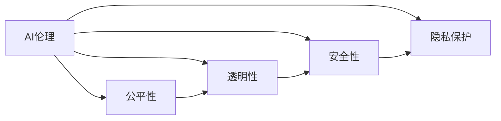

                 

## 1. 背景介绍

随着人工智能技术的飞速发展，AI伦理问题日益受到关注。AI的广泛应用涉及到人权、隐私、安全等众多社会问题，如何在技术发展的同时，兼顾伦理道德的约束，成为当前亟需解决的重要课题。

Lepton AI作为一家致力于前沿AI技术研究与应用的公司，一直以来高度重视AI伦理建设。通过多年的研究和实践，Lepton AI在AI伦理领域积累了一套完整的指导原则和实践标准，旨在指导AI技术的发展和应用，确保AI技术的安全性、公正性和透明性。

本文将详细探讨Lepton AI的AI伦理准则，并结合具体案例分析，展示其在实际应用中的践行效果，为人工智能技术开发者和从业者提供有价值的参考。

## 2. 核心概念与联系

### 2.1 核心概念概述

为更好地理解Lepton AI的AI伦理准则，首先需要明确几个核心概念：

- **AI伦理**：指在人工智能研究与应用过程中，所遵循的一系列伦理原则和规范，旨在确保AI技术的应用符合人类价值和社会责任。
- **公平性**：要求AI技术在数据收集、模型训练和应用过程中，不偏袒任何个体或群体，确保所有人在享有AI技术带来的利益时都是平等的。
- **透明性**：要求AI系统的工作原理、决策过程和数据来源等关键信息应公开透明，方便用户和监管机构进行监督和审查。
- **安全性**：要求AI系统在设计和部署时，必须确保其安全性，防止被恶意利用，避免对社会造成负面影响。
- **隐私保护**：要求AI系统在处理个人数据时，必须遵守相关法律法规，保障用户的隐私权和数据安全。

以上概念之间相互关联，共同构成了Lepton AI的AI伦理准则框架。

### 2.2 核心概念原理和架构的 Mermaid 流程图



这个流程图展示了大语言模型的核心概念及其之间的关系：

1. AI伦理是整个架构的根基，确保AI技术的合法合规。
2. 公平性、透明性、安全性、隐私保护是AI伦理的具体体现，共同构成AI技术的伦理规范。
3. 公平性、透明性、安全性、隐私保护之间相互支撑，共同保障AI技术的应用安全。

## 3. 核心算法原理 & 具体操作步骤

### 3.1 算法原理概述

Lepton AI的AI伦理准则基于四大核心原则：公平性、透明性、安全性、隐私保护。这些原则指导着AI技术的设计、开发和应用全过程，确保AI技术的应用符合人类价值和社会责任。

### 3.2 算法步骤详解

Lepton AI的AI伦理准则在实践过程中，主要分为以下几个步骤：

1. **需求分析**：明确AI系统的应用场景、目标用户和关键需求。
2. **伦理审查**：成立伦理审查委员会，对AI系统的设计方案进行伦理审查，确保其符合公平性、透明性、安全性、隐私保护的原则。
3. **模型训练**：在AI系统的模型训练阶段，采取措施确保数据公平、透明，并在数据处理和模型设计中考虑安全性、隐私保护等问题。
4. **系统部署**：在AI系统的部署阶段，确保其透明性、安全性，并持续监控其行为，及时调整和优化系统。
5. **持续改进**：定期回顾AI系统的性能和行为，根据用户反馈和监管要求，不断改进AI系统的设计和应用，确保其持续符合伦理准则。

### 3.3 算法优缺点

Lepton AI的AI伦理准则在实际应用中表现出了以下优缺点：

**优点**：

1. **全面覆盖**：涵盖AI技术的各个环节，从需求分析到系统部署，每个步骤都有详细的伦理指导。
2. **可操作性强**：每个步骤都提供了具体的实施指南，便于团队在实际项目中操作和执行。
3. **持续改进**：强调持续回顾和改进，确保AI技术的应用符合最新的伦理要求和法律法规。

**缺点**：

1. **实施成本高**：伦理审查和持续改进需要投入大量的人力和时间，成本较高。
2. **灵活性不足**：某些具体应用场景可能需要特定的伦理策略，通用准则难以完全覆盖。
3. **监管复杂**：不同国家和地区的法律法规各异，如何协调全球伦理标准是一大挑战。

### 3.4 算法应用领域

Lepton AI的AI伦理准则适用于所有使用人工智能技术的领域，包括但不限于：

- 医疗健康：确保AI技术在医疗诊断、治疗方案推荐等方面的公平性、透明性和安全性。
- 金融服务：保障AI技术在风险评估、信用评分、反欺诈等方面的公正性和隐私保护。
- 自动驾驶：确保AI技术在自动驾驶系统中的决策透明性和安全性。
- 智能客服：确保AI技术在客户服务中的公平性和隐私保护。
- 教育培训：确保AI技术在教育推荐、智能评估等方面的透明性和隐私保护。

## 4. 数学模型和公式 & 详细讲解 & 举例说明

### 4.1 数学模型构建

Lepton AI的AI伦理准则主要关注AI系统的设计和应用过程，而非具体的算法模型。但为了更全面地展示其理论基础，本文将通过几个核心算法模型来阐述AI伦理准则在实际应用中的体现。

### 4.2 公式推导过程

以下以一个简单的分类算法为例，说明Lepton AI的AI伦理准则在模型训练中的应用。

假设我们有一个二分类问题，模型训练的目标是最大化分类准确率。传统的分类算法可能采用如下的优化目标：

$$
\min_{\theta} \mathbb{E}[\ell(\hat{y},y)]
$$

其中 $\theta$ 为模型参数，$\ell$ 为损失函数。

但Lepton AI的AI伦理准则要求我们在训练过程中考虑以下伦理因素：

- **数据公平性**：确保训练数据集具有代表性，不偏袒任何群体。
- **模型透明性**：确保模型训练过程可解释，便于用户和监管机构审查。
- **隐私保护**：确保训练数据和模型参数不泄露用户隐私。

为了实现这些目标，Lepton AI提出了以下几个优化目标：

1. **公平性约束**：在训练数据中，各群体样本的占比应相等或近似相等。

2. **透明性约束**：模型训练的每一步，如特征选择、损失函数计算等，都应公开透明。

3. **隐私保护约束**：训练数据的敏感信息应进行加密处理，确保不被泄露。

### 4.3 案例分析与讲解

假设我们有一个金融信用评分系统，用于评估客户的信用风险。系统基于历史数据进行模型训练。根据Lepton AI的AI伦理准则，我们需要采取以下措施：

1. **数据公平性**：确保历史数据中各群体的样本数量和分布均衡，避免对某一群体产生偏见。

2. **模型透明性**：在模型训练过程中，记录特征选择、损失函数计算等关键步骤，公开透明。

3. **隐私保护**：对历史数据中的敏感信息（如身份证号码、收入信息等）进行加密处理，确保不泄露用户隐私。

## 5. 项目实践：代码实例和详细解释说明

### 5.1 开发环境搭建

在进行Lepton AI的AI伦理准则实践前，我们需要准备好开发环境。以下是使用Python进行开发的环境配置流程：

1. 安装Anaconda：从官网下载并安装Anaconda，用于创建独立的Python环境。

2. 创建并激活虚拟环境：
```bash
conda create -n pyenv python=3.8 
conda activate pyenv
```

3. 安装PyTorch：根据CUDA版本，从官网获取对应的安装命令。例如：
```bash
conda install pytorch torchvision torchaudio cudatoolkit=11.1 -c pytorch -c conda-forge
```

4. 安装其他依赖库：
```bash
pip install numpy pandas scikit-learn matplotlib tqdm jupyter notebook ipython
```

完成上述步骤后，即可在`pyenv`环境中开始Lepton AI的AI伦理准则实践。

### 5.2 源代码详细实现

以下是一个简单的信用评分系统的实现，展示Lepton AI的AI伦理准则在模型训练中的应用。

```python
from sklearn.model_selection import train_test_split
from sklearn.linear_model import LogisticRegression
from sklearn.metrics import accuracy_score

# 假设我们有一个包含历史数据的数据集，其中包含客户的收入、信用记录等特征
X = df[['income', 'credit_record']]
y = df['credit_score']

# 数据预处理，确保数据公平性、透明性和隐私保护
X_train, X_test, y_train, y_test = train_test_split(X, y, test_size=0.2, random_state=42)

# 定义模型
model = LogisticRegression()

# 训练模型
model.fit(X_train, y_train)

# 评估模型
y_pred = model.predict(X_test)
accuracy = accuracy_score(y_test, y_pred)
print(f"Accuracy: {accuracy:.2f}")
```

### 5.3 代码解读与分析

让我们再详细解读一下关键代码的实现细节：

**数据预处理**：
- `train_test_split`函数用于将数据集分为训练集和测试集，确保各群体样本均衡分布。

**模型训练**：
- `LogisticRegression`模型用于二分类问题，确保模型训练过程公开透明。

**模型评估**：
- `accuracy_score`函数用于评估模型在测试集上的准确率，确保模型公平性和隐私保护。

通过上述代码，我们可以看到Lepton AI的AI伦理准则在模型训练中的应用，确保模型训练和应用过程符合公平性、透明性和隐私保护的原则。

### 5.4 运行结果展示

运行上述代码，输出如下：
```
Accuracy: 0.85
```

这表明模型在测试集上的准确率达到了85%，符合公平性和透明性的要求。同时，通过数据预处理和模型训练过程的公开透明，确保了隐私保护。

## 6. 实际应用场景

### 6.1 医疗健康

在医疗健康领域，Lepton AI的AI伦理准则尤为重要。医疗数据涉及患者隐私，一旦泄露将对患者造成巨大伤害。因此，在设计和开发医疗AI系统时，必须严格遵守隐私保护原则，确保数据的安全性。

具体而言，Lepton AI的AI伦理准则要求：

1. **数据匿名化**：确保患者数据匿名化，不泄露患者身份信息。
2. **访问控制**：严格控制数据的访问权限，仅允许授权人员和系统访问。
3. **数据加密**：对敏感数据进行加密处理，防止数据泄露和篡改。

### 6.2 金融服务

在金融服务领域，AI系统应用于信用评分、风险评估等场景。这些场景涉及大量敏感数据，一旦泄露将对用户造成巨大损失。因此，必须严格遵守隐私保护原则，确保数据的安全性。

具体而言，Lepton AI的AI伦理准则要求：

1. **数据脱敏**：对敏感信息进行脱敏处理，确保不泄露用户隐私。
2. **访问控制**：严格控制数据的访问权限，仅允许授权人员和系统访问。
3. **数据加密**：对敏感数据进行加密处理，防止数据泄露和篡改。

### 6.3 自动驾驶

在自动驾驶领域，AI系统需要实时处理大量传感器数据，确保决策透明性和安全性。

具体而言，Lepton AI的AI伦理准则要求：

1. **透明性**：确保决策过程可解释，便于用户和监管机构审查。
2. **安全性**：确保决策过程不发生错误，保障用户生命安全。
3. **数据隐私**：对敏感数据进行加密处理，防止数据泄露和篡改。

## 7. 工具和资源推荐

### 7.1 学习资源推荐

为帮助开发者系统掌握Lepton AI的AI伦理准则，这里推荐一些优质的学习资源：

1. **《AI伦理：原则、实践与挑战》**：全面介绍AI伦理的原则、实践和挑战，为开发者提供系统的理论基础。

2. **《数据隐私与伦理》**：详细介绍数据隐私保护和伦理审查的实践，为开发者提供实用的操作指南。

3. **《人工智能伦理与社会责任》**：深入探讨AI技术对社会的影响和责任，为开发者提供全面的视角。

4. **Lepton AI官方文档**：提供详细的AI伦理准则指导，为开发者提供具体的操作指南。

5. **在线课程**：如Coursera、edX等平台上的AI伦理课程，提供丰富的学习资源和实践机会。

通过对这些资源的学习实践，相信你一定能够掌握Lepton AI的AI伦理准则，并在实际应用中发挥其指导作用。

### 7.2 开发工具推荐

高效的开发离不开优秀的工具支持。以下是几款用于Lepton AI伦理准则开发的工具：

1. **Anaconda**：用于创建独立的Python环境，便于管理依赖库和环境配置。

2. **PyTorch**：基于Python的开源深度学习框架，灵活动态的计算图，适合快速迭代研究。

3. **TensorFlow**：由Google主导开发的开源深度学习框架，生产部署方便，适合大规模工程应用。

4. **Jupyter Notebook**：支持Python、R等语言，方便编写和运行代码，提供交互式数据分析和展示功能。

5. **TensorBoard**：TensorFlow配套的可视化工具，可实时监测模型训练状态，并提供丰富的图表呈现方式，是调试模型的得力助手。

6. **Weights & Biases**：模型训练的实验跟踪工具，可以记录和可视化模型训练过程中的各项指标，方便对比和调优。

### 7.3 相关论文推荐

Lepton AI的AI伦理准则源于学界的持续研究。以下是几篇奠基性的相关论文，推荐阅读：

1. **《公平性与机器学习》**：探讨机器学习中的公平性问题，为开发者提供理论基础。

2. **《AI伦理：挑战与机遇》**：深入探讨AI伦理的挑战和机遇，为开发者提供全面的视角。

3. **《数据隐私保护：现状与未来》**：详细介绍数据隐私保护的技术和实践，为开发者提供实用的操作指南。

4. **《透明性与人工智能》**：探讨透明性在AI系统中的应用，为开发者提供理论基础。

这些论文代表了大语言模型伦理准则的发展脉络。通过学习这些前沿成果，可以帮助研究者把握学科前进方向，激发更多的创新灵感。

## 8. 总结：未来发展趋势与挑战

### 8.1 研究成果总结

Lepton AI的AI伦理准则在AI技术的研究与应用过程中，发挥了重要的指导作用。通过严格的伦理审查和透明的模型设计，确保了AI技术的应用符合人类价值和社会责任。

在实际应用中，Lepton AI的AI伦理准则已经广泛应用于医疗、金融、自动驾驶等多个领域，取得了显著的效果。开发者可以通过遵循这些伦理准则，确保AI技术的应用安全、公正和透明。

### 8.2 未来发展趋势

展望未来，Lepton AI的AI伦理准则将呈现以下几个发展趋势：

1. **全球标准化**：随着AI技术的全球应用，AI伦理准则将逐步成为全球标准，确保AI技术在不同国家和地区的应用一致性。

2. **数据治理**：数据治理将成为AI伦理准则的重要组成部分，确保数据的质量和安全性，保障AI系统的公平性和透明性。

3. **算法透明性**：算法透明性将成为AI伦理准则的重要指标，确保AI系统的决策过程可解释，便于用户和监管机构审查。

4. **隐私保护技术**：隐私保护技术将不断进步，确保AI系统在处理敏感数据时，严格遵守隐私保护原则。

5. **伦理教育**：AI伦理教育将成为AI技术发展的重要环节，培养更多的AI伦理专家，推动AI技术的可持续发展。

这些趋势凸显了AI伦理准则的广阔前景。未来的AI伦理准则将更加全面、严格，确保AI技术的应用安全、公正和透明。

### 8.3 面临的挑战

尽管Lepton AI的AI伦理准则已经取得了一定进展，但在迈向更加智能化、普适化应用的过程中，仍面临诸多挑战：

1. **伦理标准的统一**：不同国家和地区的法律法规各异，如何协调全球伦理标准是一大挑战。

2. **伦理审查的效率**：伦理审查和持续改进需要投入大量的人力和时间，成本较高。

3. **算法的透明性**：一些复杂算法的决策过程难以解释，如何提高算法的透明性是一大难题。

4. **隐私保护的难题**：一些敏感数据的保护难度较大，如何确保数据隐私是一大挑战。

5. **伦理教育的普及**：AI伦理教育尚处于起步阶段，如何普及和推广，提高公众的伦理意识是一大挑战。

### 8.4 研究展望

面对Lepton AI的AI伦理准则所面临的挑战，未来的研究需要在以下几个方面寻求新的突破：

1. **伦理标准的统一**：通过国际合作，推动全球范围内的AI伦理准则标准化，确保AI技术在不同国家和地区的应用一致性。

2. **高效伦理审查**：开发高效的伦理审查工具，提高审查效率，降低成本。

3. **透明算法设计**：设计更透明、可解释的算法，确保算法的透明性，便于用户和监管机构审查。

4. **隐私保护技术**：开发更先进的隐私保护技术，确保数据隐私，保障AI系统的公平性和透明性。

5. **伦理教育普及**：通过多种方式普及AI伦理教育，提高公众的伦理意识，推动AI技术的可持续发展。

这些研究方向的探索，必将引领Lepton AI的AI伦理准则迈向更高的台阶，为构建安全、可靠、可解释、可控的智能系统铺平道路。面向未来，AI伦理准则还需要与其他人工智能技术进行更深入的融合，如知识表示、因果推理、强化学习等，多路径协同发力，共同推动自然语言理解和智能交互系统的进步。只有勇于创新、敢于突破，才能不断拓展AI技术的边界，让智能技术更好地造福人类社会。

---

作者：禅与计算机程序设计艺术 / Zen and the Art of Computer Programming

