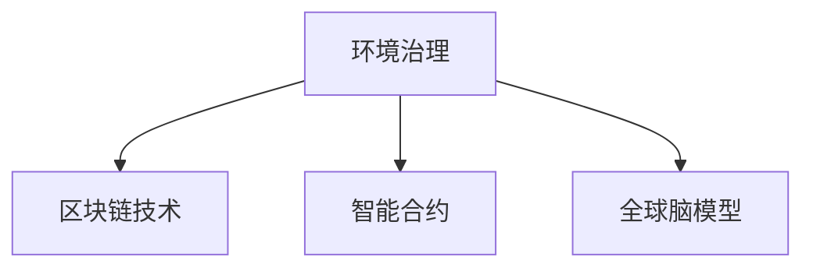

                 

# 全球脑与全球环境：集体合作的环境治理

> 关键词：
1. 环境治理
2. 集体合作
3. 全球脑
4. 智能合约
5. 生态系统管理
6. 分布式协同
7. 区块链技术

## 1. 背景介绍

### 1.1 问题由来
随着全球化的深入，环境问题已经超越了国界，成为一个全球性的挑战。传统的环境治理方式往往依赖于国家之间的双边或多边协议，效果有限且成本高昂。气候变化、生物多样性丧失、污染问题等，迫切需要新的治理模式来应对。

近年来，区块链技术的兴起为环境治理提供了新的解决方案。利用区块链的去中心化、透明性、不可篡改性等特点，可以实现多方协同的环境治理和生态系统管理。全球脑（Global Brain）模型进一步增强了这种协同效应，构建了一个由多个智能体（Intelligent Agents）组成的分布式网络，每个智能体都可以在网络上进行交互和协同。

### 1.2 问题核心关键点
本文聚焦于如何利用区块链技术，结合全球脑模型，实现全球范围的环境治理。具体问题包括：
- 如何构建一个去中心化的环境治理平台？
- 如何设计智能合约来激励参与者共同维护环境？
- 如何利用全球脑模型进行多方协同决策？
- 如何评估和优化环境治理的绩效？

## 2. 核心概念与联系

### 2.1 核心概念概述

为更好地理解全球脑与全球环境治理的结合，本节将介绍几个关键概念：

- **环境治理**：指政府、企业、社区等不同主体合作，通过法律、政策、技术等手段，管理和保护环境资源的活动。环境治理的目标是实现可持续发展，保护生态平衡，提升人类福祉。

- **区块链技术**：一种分布式数据库技术，通过去中心化、不可篡改的区块链账本，实现透明、可信的数据记录和交换。区块链在环境治理中的应用可以增强数据透明度，提升环境治理的效率和公正性。

- **智能合约**：一种自动执行的合约，基于区块链技术的智能合约可以实现无需第三方参与的自动执行和验证，保障环境治理的透明度和可靠性。

- **全球脑模型**：由Vladimir Vernadsky提出的概念，认为全球环境是一个复杂的、动态的系统，不同智能体通过相互依赖、合作、竞争和演化，共同形成了一个全球性的“大脑”。这个“大脑”具有自我组织、自我修复的能力，能够动态适应环境变化。

这些概念之间的逻辑关系可以通过以下Mermaid流程图来展示：



这个流程图展示了环境治理与区块链、智能合约、全球脑模型的关系：

1. 环境治理是整个治理框架的核心。
2. 区块链技术提供了一种去中心化的记录和验证机制，提升了环境治理的透明度和可信度。
3. 智能合约可以自动执行环境相关的法律和协议，保障治理过程的公正性和效率。
4. 全球脑模型提供了多方协同决策和动态自适应的能力，构建了一个全球环境治理的“大脑”。

## 3. 核心算法原理 & 具体操作步骤
### 3.1 算法原理概述

全球脑与全球环境治理的算法原理主要包括以下几个方面：

1. **分布式账本技术**：基于区块链技术的分布式账本，可以记录环境治理过程中的所有数据，包括环境监测、交易记录、合同执行等。每个参与者都可以访问账本，确保数据的透明性和可信性。

2. **智能合约机制**：智能合约可以自动执行环境相关的法律和协议，无需第三方参与。例如，智能合约可以监控碳排放，当超过预定阈值时自动触发罚款或补偿措施。

3. **多方协同决策**：利用全球脑模型，环境治理过程中的各个智能体可以协同决策，共同应对环境挑战。智能体通过网络进行交互，共享信息，共同制定和执行治理策略。

4. **动态自适应机制**：全球脑模型具有动态自适应的能力，可以实时响应环境变化，调整治理策略。智能体可以根据环境数据的变化，自动调整决策和行动。

### 3.2 算法步骤详解

全球脑与全球环境治理的具体操作流程包括以下几个步骤：

**Step 1: 搭建环境治理平台**

1. 设计环境治理平台的网络架构。网络中包含多个智能体，每个智能体代表一个环境治理主体（如政府、企业、社区）。智能体之间通过区块链网络进行通信和数据交换。

2. 确定智能体的角色和权限。每个智能体在网络中具有特定的角色，如数据发布者、规则制定者、决策者等。角色的权限和责任需明确，确保网络的有序运行。

**Step 2: 开发智能合约**

1. 定义智能合约的功能。智能合约可以监控环境数据，执行惩罚或补偿措施，自动分配资金等。

2. 编写智能合约代码。智能合约通常使用Solidity等编程语言编写，并部署在区块链上。

3. 测试和验证智能合约。智能合约在部署前需进行测试和验证，确保其正确性和安全性。

**Step 3: 收集环境数据**

1. 部署环境监测设备，收集环境数据，如气温、湿度、空气质量等。

2. 将环境数据上传到区块链账本，确保数据的透明性和不可篡改性。

**Step 4: 协同决策和执行**

1. 智能体通过区块链网络共享环境数据，并进行协同决策。决策过程可以是自动化的，也可以由人类干预。

2. 根据决策结果，智能合约自动执行相应的措施，如罚款、补偿、资源分配等。

**Step 5: 动态调整治理策略**

1. 利用全球脑模型，智能体可以动态调整治理策略，以适应环境变化。

2. 根据最新的环境数据和治理结果，智能体可以重新制定治理策略，并自动执行。

### 3.3 算法优缺点

全球脑与全球环境治理的算法具有以下优点：

1. **透明度和可信度**：区块链技术提供了一个去中心化的记录和验证机制，确保数据的透明性和可信度，增强了环境治理的公信力。

2. **自动化和效率**：智能合约可以自动执行环境相关的法律和协议，提高环境治理的效率，减少人为干预和腐败风险。

3. **多方协同**：全球脑模型通过智能体之间的互动和协作，实现了多方协同决策，增强了环境治理的效果。

4. **动态自适应**：全球脑模型具有动态自适应的能力，可以实时响应环境变化，调整治理策略，提高了环境治理的灵活性和适应性。

同时，该算法也存在以下局限性：

1. **技术门槛高**：区块链和智能合约技术复杂，需要较高的技术门槛，不适合所有参与者。

2. **初始成本高**：搭建和维护环境治理平台需要较高的初始成本，包括技术开发、设备部署和运维费用。

3. **数据隐私和安全**：尽管区块链具有去中心化的特点，但环境数据涉及敏感信息，需确保数据隐私和安全。

4. **法律和伦理问题**：智能合约的自动执行可能涉及法律和伦理问题，需建立相应的法律框架和道德规范。

5. **技术依赖性**：环境治理依赖于区块链和智能合约技术，若技术出现故障或攻击，可能影响治理效果。

### 3.4 算法应用领域

全球脑与全球环境治理的算法适用于以下领域：

- **气候变化治理**：通过智能合约监控碳排放，自动执行罚款或补偿措施，推动低碳经济的发展。

- **水资源管理**：利用区块链和智能合约技术，实现水资源的使用和分配的透明和公平。

- **生物多样性保护**：记录和验证生物多样性数据，通过协同决策制定和执行保护措施。

- **污染治理**：监控污染数据，自动执行惩罚措施，减少工业和生活的污染。

- **生态系统保护**：记录和共享生态系统数据，通过协同决策保护生态系统。

## 4. 数学模型和公式 & 详细讲解 & 举例说明（备注：数学公式请使用latex格式，latex嵌入文中独立段落使用 $$，段落内使用 $)
### 4.1 数学模型构建

环境治理和智能合约的数学模型主要包括以下几个方面：

1. **环境数据模型**：定义环境数据的基本属性和关系，如气温、湿度、空气质量等。

2. **智能合约模型**：定义智能合约的功能和规则，如监控环境数据，执行惩罚或补偿措施。

3. **协同决策模型**：定义智能体之间的交互和决策过程，如共享环境数据，协同制定治理策略。

4. **动态自适应模型**：定义环境数据和治理结果之间的关系，如根据环境数据动态调整治理策略。

### 4.2 公式推导过程

以下我们以智能合约模型为例，推导智能合约的数学公式及其推导过程。

假设智能合约用于监控环境数据，当环境数据超过预定阈值时，自动执行惩罚措施。定义环境数据 $x$ 和阈值 $t$，智能合约的执行规则为：

$$
f(x, t) = 
\begin{cases} 
\text{惩罚} & \text{if } x > t \\
\text{不惩罚} & \text{otherwise} 
\end{cases}
$$

在实际应用中，智能合约通常使用if语句或布尔运算符实现。智能合约的执行过程可以表示为：

$$
\text{执行} = 
\begin{cases} 
\text{True} & \text{if } x > t \\
\text{False} & \text{otherwise} 
\end{cases}
$$

将上述规则转化为数学表达式，得到智能合约的执行函数：

$$
f(x, t) = \begin{cases} 
1 & \text{if } x > t \\
0 & \text{otherwise} 
\end{cases}
$$

### 4.3 案例分析与讲解

以智能合约监控碳排放为例，分析智能合约的数学模型及其推导过程。

假设智能合约用于监控碳排放数据 $x$，当月平均碳排放超过阈值 $t$ 时，智能合约自动执行惩罚措施。智能合约的执行规则可以表示为：

$$
f(x, t) = 
\begin{cases} 
\text{罚款} & \text{if } \frac{1}{月}\sum x_i > t \\
\text{不罚款} & \text{otherwise} 
\end{cases}
$$

其中 $x_i$ 表示每个月 $i$ 的碳排放数据。将上述规则转化为数学表达式，得到智能合约的执行函数：

$$
f(x, t) = \begin{cases} 
1 & \text{if } \frac{1}{月}\sum x_i > t \\
0 & \text{otherwise} 
\end{cases}
$$

智能合约在执行前，需将碳排放数据上传到区块链账本，并触发智能合约的执行。智能合约执行后，相应的惩罚措施（如罚款）会自动执行，并记录在区块链账本上。

## 5. 项目实践：代码实例和详细解释说明
### 5.1 开发环境搭建

在进行全球脑与环境治理的开发前，我们需要准备好开发环境。以下是使用Python进行Solidity编程的环境配置流程：

1. 安装Solidity IDE：如Remix IDE、Truffle IDE等。

2. 安装Solidity编译器：如Solidity compiler、Remix compiler等。

3. 安装区块链平台：如Ganache、Ropsten、Mainnet等。

完成上述步骤后，即可在Solidity IDE中进行开发。

### 5.2 源代码详细实现

下面我以智能合约监控碳排放为例，给出使用Solidity语言对智能合约进行详细代码实现。

```solidity
// SPDX-License-Identifier: MIT
pragma solidity ^0.8.0;

contract CarbonEmissionMonitor {
    address payable public owner;
    uint256 public threshold;
    uint256 public carbonEmissions;
    
    constructor(address payable _owner, uint256 _threshold) {
        owner = _owner;
        threshold = _threshold;
        carbonEmissions = 0;
    }
    
    function setThreshold(uint256 _threshold) public {
        threshold = _threshold;
    }
    
    function recordCarbonEmission(uint256 _emission) public {
        carbonEmissions += _emission;
    }
    
    function executePunishment() public {
        if (carbonEmissions > threshold) {
            uint256 amount = carbonEmissions - threshold;
            owner.send(amount);
        }
    }
    
    function updateStatus() public view {
        return (carbonEmissions > threshold);
    }
}
```

上述代码定义了一个名为`CarbonEmissionMonitor`的智能合约，其功能包括：

- 设置阈值：`setThreshold`函数可以修改阈值，适用于适应环境变化。
- 记录碳排放：`recordCarbonEmission`函数可以记录每个月的碳排放数据，并累计到智能合约中。
- 执行惩罚：`executePunishment`函数在累计的碳排放超过阈值时，自动执行惩罚措施，如罚款。
- 更新状态：`updateStatus`函数可以查询智能合约当前的状态，判断是否需要执行惩罚。

### 5.3 代码解读与分析

让我们再详细解读一下关键代码的实现细节：

**constructor函数**：
- `constructor`函数用于初始化智能合约，接收初始的`owner`和`threshold`参数。

**setThreshold函数**：
- `setThreshold`函数允许用户修改阈值，根据环境变化调整惩罚标准。

**recordCarbonEmission函数**：
- `recordCarbonEmission`函数用于记录每个月的碳排放数据，并累计到智能合约中。

**executePunishment函数**：
- `executePunishment`函数在累计的碳排放超过阈值时，自动执行惩罚措施，如罚款。

**updateStatus函数**：
- `updateStatus`函数可以查询智能合约当前的状态，判断是否需要执行惩罚。

### 5.4 运行结果展示

在区块链平台上部署智能合约后，可以通过智能合约的界面进行测试和验证。测试过程包括：

1. 在Ganache等区块链平台上搭建测试网络，部署智能合约。

2. 设置阈值和记录碳排放数据。

3. 执行惩罚措施，验证惩罚机制是否正确执行。

4. 修改阈值和记录新的碳排放数据，测试智能合约的动态调整能力。

## 6. 实际应用场景
### 6.1 智能合约监管碳排放

全球脑与全球环境治理的智能合约可以应用于碳排放监管。智能合约可以记录每个月的碳排放数据，当月平均碳排放超过阈值时，自动执行罚款或补偿措施。通过区块链技术，碳排放数据透明可信，智能合约自动执行惩罚措施，提高了监管效率和公正性。

**具体实现**：
1. 部署智能合约，记录每个月的碳排放数据。
2. 设置阈值，根据环境变化调整惩罚标准。
3. 每月自动执行惩罚措施，如罚款或补偿。
4. 定期修改阈值，适应环境变化。

**优势**：
- 自动记录和监控碳排放数据，提高了监管的透明性和可信度。
- 自动执行惩罚措施，减少了人为干预和腐败风险。
- 动态调整阈值，适应环境变化，提高了监管的灵活性和适应性。

### 6.2 全球脑协同治理生态系统

全球脑模型可以用于协同治理生态系统。智能体通过区块链网络共享生态系统数据，协同制定和执行治理策略。利用全球脑模型，智能体可以动态调整治理策略，适应生态系统的变化。

**具体实现**：
1. 定义生态系统中的智能体，每个智能体代表一个治理主体，如政府、企业、社区等。
2. 智能体通过区块链网络共享生态系统数据，如生物多样性数据、环境监测数据等。
3. 协同制定和执行治理策略，如保护濒危物种、减少污染等。
4. 利用全球脑模型，动态调整治理策略，适应生态系统的变化。

**优势**：
- 智能体通过区块链网络共享数据，增强了治理的透明性和可信度。
- 协同制定和执行治理策略，提高了治理的效果。
- 动态调整治理策略，适应生态系统的变化，提高了治理的灵活性和适应性。

### 6.3 区块链平台环境数据管理

区块链平台可以用于管理环境数据，记录和验证环境数据，提高数据的透明性和可信度。智能合约可以监控环境数据，自动执行相应的措施，如罚款或补偿。

**具体实现**：
1. 部署环境监测设备，收集环境数据，如气温、湿度、空气质量等。
2. 将环境数据上传到区块链账本，确保数据的透明性和不可篡改性。
3. 利用智能合约，监控环境数据，自动执行惩罚或补偿措施。
4. 动态调整环境数据，适应环境变化。

**优势**：
- 区块链平台提供了一个去中心化的记录和验证机制，确保数据的透明性和可信度。
- 智能合约自动执行环境相关的法律和协议，提高了环境治理的效率。
- 动态调整环境数据，适应环境变化，提高了环境治理的灵活性和适应性。

## 7. 工具和资源推荐
### 7.1 学习资源推荐

为了帮助开发者系统掌握全球脑与环境治理的理论基础和实践技巧，这里推荐一些优质的学习资源：

1. Solidity官方文档：Solidity官方文档提供了完整的Solidity编程语言规范和标准库，是学习Solidity编程的重要资料。

2. Remix IDE官方文档：Remix IDE官方文档提供了丰富的示例和教程，适合初学者快速上手Solidity编程。

3. Ethereum官网教程：Ethereum官网提供了丰富的教程和文档，帮助开发者深入理解以太坊和智能合约。

4. Global Brain模型相关论文：Global Brain模型源自Vladimir Vernadsky的理论，可以通过阅读相关论文，深入理解全球脑的概念和应用。

通过对这些资源的学习实践，相信你一定能够快速掌握全球脑与环境治理的精髓，并用于解决实际的环境治理问题。
### 7.2 开发工具推荐

高效的开发离不开优秀的工具支持。以下是几款用于全球脑与环境治理开发的常用工具：

1. Solidity IDE：如Remix IDE、Truffle IDE等，提供了丰富的编程工具和环境调试功能，适合Solidity编程。

2. Ethereum客户端：如Ganache、Ropsten、Mainnet等，提供了丰富的测试网络和区块链平台，适合智能合约的测试和部署。

3. Solidity编译器：如Solidity compiler、Remix compiler等，提供了强大的编译和调试功能，适合Solidity代码的编译和测试。

4. Truffle框架：提供了丰富的开发工具和扩展，支持智能合约的开发、测试和部署。

5. Web3.js库：提供了丰富的Web3.js API，支持以太坊和智能合约的交互和开发。

合理利用这些工具，可以显著提升全球脑与环境治理的开发效率，加快创新迭代的步伐。

### 7.3 相关论文推荐

全球脑与全球环境治理的研究源于学界的持续研究。以下是几篇奠基性的相关论文，推荐阅读：

1. Global Brain: A New Way of Looking at the World（全球脑理论的起源）：Vladimir Vernadsky提出的全球脑理论，奠定了全球脑概念的基础。

2. Blockchain for Environmental Governance: A Survey and Analysis（区块链技术在环境治理中的应用）：该论文分析了区块链技术在环境治理中的应用，提供了丰富的案例和实证研究。

3. Smart Contracts in Environmental Governance: A Case Study of Carbon Emission Trading（智能合约在环境治理中的应用）：该论文以碳排放交易为例，展示了智能合约在环境治理中的具体应用。

4. Distributed Consensus Mechanisms for Environmental Data Sharing（分布式共识机制在环境数据共享中的应用）：该论文探讨了分布式共识机制在环境数据共享中的应用，提供了丰富的算法和案例。

这些论文代表了大脑与环境治理的研究方向和理论基础，通过学习这些前沿成果，可以帮助研究者把握学科前进方向，激发更多的创新灵感。

## 8. 总结：未来发展趋势与挑战
### 8.1 总结

本文对全球脑与全球环境治理的方法进行了全面系统的介绍。首先阐述了全球脑模型和区块链技术在环境治理中的应用背景和意义，明确了协同决策、智能合约、动态自适应等关键技术。其次，从原理到实践，详细讲解了智能合约和全球脑模型的数学模型和算法步骤，给出了智能合约代码实例。同时，本文还广泛探讨了智能合约和全球脑模型在碳排放监管、生态系统管理等实际场景中的应用，展示了其潜在的巨大价值。此外，本文精选了全球脑与环境治理的学习资源和开发工具，力求为读者提供全方位的技术指引。

通过本文的系统梳理，可以看到，全球脑与全球环境治理的方法不仅在理论上具有重要价值，在实践中也具有广泛的适用性。区块链和智能合约技术结合全球脑模型，为环境治理提供了新的解决方案，显著提升了治理的透明度、可信度和效率。未来，伴随技术进步和应用推广，全球脑与全球环境治理将为实现全球可持续发展做出更大的贡献。

### 8.2 未来发展趋势

展望未来，全球脑与全球环境治理技术将呈现以下几个发展趋势：

1. **技术融合与创新**：未来将会有更多新的技术，如AI、IoT、区块链等，与全球脑模型结合，形成更加强大的环境治理能力。

2. **全球合作与协同**：全球脑模型通过智能体的协同合作，可以实现全球范围内的环境治理，解决跨国界的环保问题。

3. **动态自适应与优化**：未来智能合约将更加动态自适应，能够实时响应环境变化，优化治理策略，提高治理效果。

4. **去中心化与分布式**：去中心化技术将进一步普及，智能合约和环境数据的记录和验证将更加去中心化，增强治理的透明性和可信度。

5. **生态系统与智能合约**：生态系统与智能合约的结合将更加紧密，通过智能合约实现生态系统的动态管理，保护生态系统的多样性和健康。

6. **伦理与法律**：未来智能合约和环境治理将更加重视伦理和法律问题，确保治理的公正性和合法性。

以上趋势凸显了全球脑与全球环境治理技术的广阔前景。这些方向的探索发展，必将进一步提升环境治理的效果和效率，为实现全球可持续发展提供强有力的技术支持。

### 8.3 面临的挑战

尽管全球脑与全球环境治理技术已经取得了瞩目成就，但在迈向更加智能化、普适化应用的过程中，它仍面临着诸多挑战：

1. **技术复杂性**：全球脑与智能合约技术复杂，需要较高的技术门槛，对开发者提出了较高的要求。

2. **法律与伦理问题**：智能合约和环境治理涉及法律和伦理问题，需建立相应的法律框架和道德规范，确保治理的公正性和合法性。

3. **数据隐私与安全**：环境数据涉及敏感信息，需确保数据隐私和安全，防止数据泄露和滥用。

4. **资源限制**：搭建和维护环境治理平台需要较高的初始成本，资源限制可能影响治理的覆盖面和效率。

5. **系统鲁棒性**：智能合约和区块链系统需具备较高的鲁棒性，防止系统故障和攻击，确保治理的稳定性和可靠性。

6. **用户接受度**：用户对新技术的接受度可能较低，需要加大推广和教育力度，提高用户对全球脑与环境治理技术的认知和接受度。

正视全球脑与全球环境治理面临的这些挑战，积极应对并寻求突破，将是大脑与环境治理走向成熟的必由之路。相信随着学界和产业界的共同努力，这些挑战终将一一被克服，全球脑与全球环境治理必将在构建安全、可靠、高效的环境治理体系中发挥越来越重要的作用。

### 8.4 研究展望

面对全球脑与全球环境治理所面临的挑战，未来的研究需要在以下几个方面寻求新的突破：

1. **技术简化与普及**：简化全球脑与智能合约技术，降低技术门槛，提高技术的普及度和应用范围。

2. **法律与伦理框架**：建立全球脑与智能合约的法律和伦理框架，确保治理的公正性和合法性。

3. **数据隐私与安全**：设计更加安全的数据隐私保护机制，确保环境数据的隐私和安全。

4. **去中心化与分布式**：探索更高效的分布式共识机制，增强系统的鲁棒性和稳定性。

5. **智能合约优化**：开发更灵活、更高效的智能合约，适应环境变化，优化治理策略。

6. **全球合作机制**：建立全球合作机制，促进跨国界的环保合作，解决全球环境问题。

这些研究方向的探索，必将引领全球脑与全球环境治理技术迈向更高的台阶，为实现全球可持续发展提供更强大的技术支撑。面向未来，全球脑与全球环境治理技术还需要与其他人工智能技术进行更深入的融合，如知识表示、因果推理、强化学习等，多路径协同发力，共同推动全球环境治理的进步。

## 9. 附录：常见问题与解答
**Q1：什么是全球脑模型？**

A: 全球脑模型由Vladimir Vernadsky提出，认为全球环境是一个复杂的、动态的系统，不同智能体通过相互依赖、合作、竞争和演化，共同形成了一个全球性的“大脑”。这个“大脑”具有自我组织、自我修复的能力，能够动态适应环境变化。

**Q2：全球脑与环境治理的主要技术是什么？**

A: 全球脑与环境治理的主要技术包括区块链、智能合约、去中心化共识机制等。其中，智能合约是实现环境治理的核心技术，通过自动执行环境相关的法律和协议，提高治理的效率和公正性。

**Q3：智能合约在环境治理中的应用有哪些？**

A: 智能合约在环境治理中可以实现多种功能，如监控环境数据、执行惩罚措施、自动分配资金等。具体应用包括碳排放监管、水资源管理、生物多样性保护等。

**Q4：如何设计智能合约的惩罚措施？**

A: 设计智能合约的惩罚措施需要考虑以下几个方面：
1. 定义惩罚的标准，如碳排放超过阈值时执行罚款。
2. 设计惩罚措施，如罚款、补偿等。
3. 设置惩罚的参数，如罚款金额、补偿金额等。

**Q5：智能合约在执行过程中需要注意哪些问题？**

A: 智能合约在执行过程中需要注意以下几个问题：
1. 智能合约的编写和测试需确保正确性和安全性。
2. 智能合约的部署和执行需考虑网络环境和资源限制。
3. 智能合约的监控和维护需确保其稳定性和可靠性。

通过本文的系统梳理，可以看到，全球脑与全球环境治理的方法不仅在理论上具有重要价值，在实践中也具有广泛的适用性。区块链和智能合约技术结合全球脑模型，为环境治理提供了新的解决方案，显著提升了治理的透明度、可信度和效率。未来，伴随技术进步和应用推广，全球脑与全球环境治理将为实现全球可持续发展做出更大的贡献。

