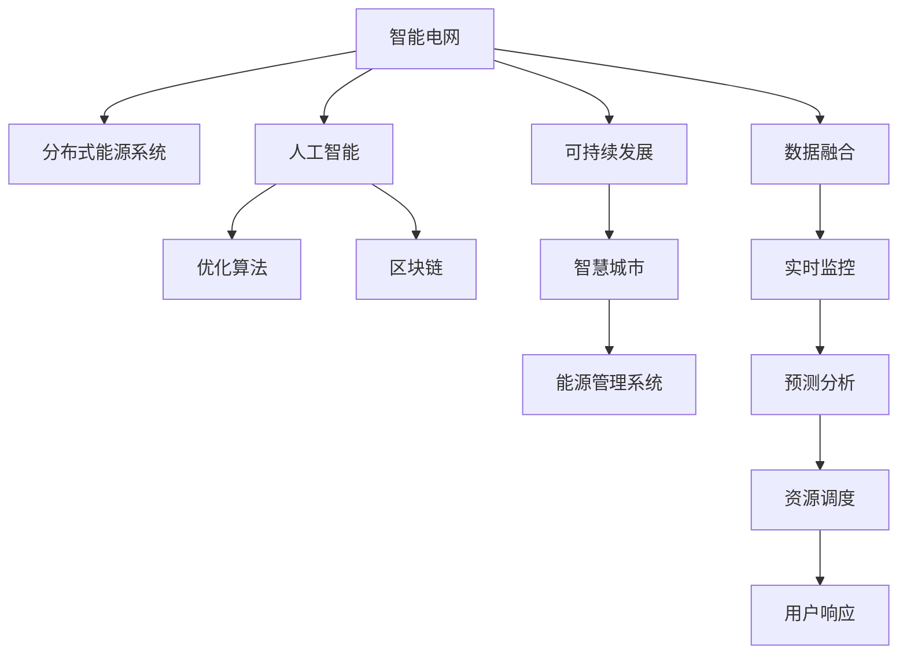

                 

# 全球脑与可持续能源:集体智慧驱动的绿色革命

> 关键词：智能电网,分布式能源系统,人工智能,优化算法,区块链,可持续发展,智慧城市

## 1. 背景介绍

### 1.1 问题由来
全球面临的能源危机和环境压力，迫切需要新的能源解决方案。能源的可持续发展和清洁能源的利用，是全球面临的重大挑战。与此同时，随着科技进步，特别是人工智能、物联网、大数据等新兴技术的发展，为解决能源问题提供了新的可能性。

智能电网和分布式能源系统的出现，标志着能源管理模式的重大转变。通过智能化的管理和控制，使得能源的生产、传输和使用更加高效、安全、环保。人工智能和大数据技术的融合，可以实时监控能源系统的运行状况，预测能源需求，优化能源配置，实现能源的精细化管理。

然而，现有技术手段在实际应用中仍面临诸多问题。诸如系统复杂性高、运行维护成本大、数据孤岛等问题，限制了智能电网和分布式能源系统的发展。同时，能源系统的安全、隐私、可靠性等问题的处理也是亟待解决的关键技术难题。

### 1.2 问题核心关键点
本文章将围绕“全球脑与可持续能源”的主题，探讨智能电网和分布式能源系统的智能优化问题，如何通过集体智慧实现绿色革命，以及如何构建智慧城市的基础设施，实现能源的可持续发展。

## 2. 核心概念与联系

### 2.1 核心概念概述

为更好地理解智能电网与分布式能源系统，本节将介绍几个密切相关的核心概念：

- 智能电网(Smart Grid)：利用先进的通信、自动化和测量技术，实时监控和管理电网中的电能传输和分配，实现能源的高效、可靠、环保管理。
- 分布式能源系统(Distributed Energy Systems, DES)：将多个小规模的、异构的、可再生能源发电单元组成的网络，实现能源的分布式生产和消费。
- 人工智能(Artificial Intelligence, AI)：通过机器学习、深度学习等技术，使得计算机能够模拟人类智能行为，解决复杂问题。
- 优化算法(Optimization Algorithm)：在满足一定约束条件下，找到最优解的过程，广泛应用于能源系统的调度与优化。
- 区块链(Blockchain)：一种去中心化的分布式账本技术，确保能源交易的透明、安全、可信。
- 可持续发展(Sustainable Development)：在满足当前需求的同时，保护环境，为子孙后代保留资源。
- 智慧城市(Smart City)：利用新一代信息技术，实现城市各领域、各环节的智能化管理，提高城市运行效率和居民生活质量。

这些核心概念之间的逻辑关系可以通过以下Mermaid流程图来展示：



这个流程图展示了智能电网与分布式能源系统智能优化过程的关键环节：

1. 智能电网和分布式能源系统的数据融合，为人工智能提供了实时的运行数据。
2. 通过人工智能，优化算法可以实现能源系统的精确调度与优化。
3. 区块链技术确保了能源交易的透明和可信。
4. 在智慧城市框架下，智能电网与分布式能源系统可以高效集成，实现城市的绿色转型。

## 3. 核心算法原理 & 具体操作步骤
### 3.1 算法原理概述

智能电网与分布式能源系统的智能优化问题，本质上是一个多目标优化问题。其目标包括：最大化系统效率、最小化系统运行成本、提高系统可靠性和安全性等。该问题可以描述为：

$$
\min_{x} f(x) = [c_1(x) + c_2(x)]^T \times w_1 + c_3(x) \times w_2
$$

其中，$f(x)$ 为目标函数，$c_1(x)$ 和 $c_2(x)$ 为优化目标，$w_1$ 和 $w_2$ 为权重，$c_3(x)$ 为约束条件。

常见的优化算法包括遗传算法、粒子群优化、蚁群算法、神经网络优化算法等。在智能电网与分布式能源系统中，通常使用基于深度学习技术的优化算法，如深度强化学习(DRL)。DRL通过深度神经网络逼近优化问题，实现了对复杂系统的智能控制。

### 3.2 算法步骤详解

基于深度强化学习的智能优化算法，通常包括以下几个关键步骤：

**Step 1: 数据准备**
- 收集智能电网与分布式能源系统的历史运行数据，包括电压、电流、温度、湿度等。
- 数据预处理，包括归一化、标准化、去噪等操作，以便用于训练深度学习模型。

**Step 2: 构建模型**
- 设计深度神经网络结构，通常包括输入层、隐藏层和输出层。
- 定义模型的损失函数和优化器，选择适当的激活函数和正则化技术。

**Step 3: 训练模型**
- 将准备好的数据划分为训练集和测试集。
- 使用优化器训练模型，最小化损失函数。
- 周期性在测试集上评估模型性能，根据性能指标决定是否进行超参数调整。

**Step 4: 模型部署**
- 将训练好的模型集成到能源管理系统，实时监控系统运行。
- 根据实时数据，动态调整系统运行参数，优化能源配置。
- 与区块链平台协同工作，实现能源交易的透明、可信。

**Step 5: 持续优化**
- 定期收集新数据，重新训练模型。
- 根据最新技术进展，改进模型结构和优化算法。
- 不断迭代优化，提升系统效率和稳定性。

### 3.3 算法优缺点

基于深度强化学习的智能优化算法，具有以下优点：

1. 能够处理大规模、高维度的优化问题。
2. 能够通过多目标优化，综合考虑系统的多个性能指标。
3. 可以实时监控和调整系统参数，提高系统运行效率。
4. 可以与其他技术手段如区块链、大数据等结合，实现更高效的系统管理。

同时，该算法也存在以下缺点：

1. 需要大量的训练数据和计算资源。
2. 模型复杂度高，对模型的可解释性要求较高。
3. 可能存在局部最优解的问题，需要进行多轮迭代优化。
4. 对超参数的敏感度高，需要不断调整以获得最优性能。

尽管存在这些局限性，但深度强化学习在智能电网与分布式能源系统的应用中，已展现出显著的性能优势和应用潜力。

### 3.4 算法应用领域

基于深度强化学习的智能优化算法，在智能电网与分布式能源系统中有着广泛的应用。例如：

- 电网负荷预测与调度：通过深度学习模型预测未来电负荷，动态调整发电、输电和配电策略，提高系统效率和可靠性。
- 分布式能源的优化运行：通过深度强化学习算法，优化多个小规模发电单元的组合，实现能源的高效、稳定供应。
- 能源市场的交易优化：通过区块链技术与深度强化学习结合，实现能源交易的透明、可信，提高市场运行效率。
- 能源系统的故障检测与修复：通过实时监控和预测分析，及时发现系统故障，优化故障修复策略，保障系统稳定运行。

除了以上这些经典应用外，深度强化学习还被创新性地应用到更多场景中，如电力需求响应、储能系统管理、虚拟电厂等，为智能电网与分布式能源系统的技术进步提供了新的动力。

## 4. 数学模型和公式 & 详细讲解
### 4.1 数学模型构建

本节将使用数学语言对智能电网与分布式能源系统的优化问题进行更加严格的刻画。

记智能电网与分布式能源系统的运行状态为 $x$，优化目标为 $f(x)$，约束条件为 $g(x) \leq 0$ 和 $h(x) = 0$。优化问题的数学模型为：

$$
\min_{x} f(x) = [c_1(x) + c_2(x)]^T \times w_1 + c_3(x) \times w_2
$$

其中，$f(x)$ 为目标函数，$c_1(x)$ 和 $c_2(x)$ 为优化目标，$w_1$ 和 $w_2$ 为权重，$c_3(x)$ 为约束条件。

### 4.2 公式推导过程

以下我们以电网负荷预测与调度为例，推导深度强化学习算法的目标函数和优化过程。

假设智能电网中各节点的负荷数据为 $x = (x_1, x_2, ..., x_n)$，优化目标是最大化系统效率 $\eta(x)$ 和最小化运行成本 $c(x)$。则目标函数为：

$$
f(x) = \eta(x) - c(x)
$$

约束条件为：

$$
g_1(x) = \sum_{i=1}^n x_i - S \leq 0
$$

$$
g_2(x) = \max_i x_i - \min_i x_i \leq \Delta
$$

其中，$S$ 为电网总容量，$\Delta$ 为负荷波动范围。

通过深度强化学习算法，可以定义一个近似模型 $\hat{f}(x)$，并根据训练数据 $\mathcal{D} = \{(x_i, y_i)\}_{i=1}^N$，通过最小化均方误差损失，优化模型参数 $\theta$：

$$
\hat{f}(x; \theta) = \sum_{i=1}^n \alpha_i \times x_i + \beta
$$

其中，$\alpha_i$ 为负荷系数，$\beta$ 为常数项。

通过反向传播算法，计算损失函数对 $\theta$ 的梯度，并更新模型参数：

$$
\theta \leftarrow \theta - \eta \nabla_{\theta} \mathcal{L}(\hat{f}(x; \theta), f(x))
$$

其中 $\eta$ 为学习率，$\mathcal{L}$ 为均方误差损失函数。

在得到损失函数的梯度后，即可带入参数更新公式，完成模型的迭代优化。重复上述过程直至收敛，最终得到适应智能电网负荷预测与调度的最优模型参数 $\theta^*$。

## 5. 项目实践：代码实例和详细解释说明
### 5.1 开发环境搭建

在进行智能优化实践前，我们需要准备好开发环境。以下是使用Python进行TensorFlow开发的环境配置流程：

1. 安装Anaconda：从官网下载并安装Anaconda，用于创建独立的Python环境。

2. 创建并激活虚拟环境：
```bash
conda create -n deep-learning-env python=3.8 
conda activate deep-learning-env
```

3. 安装TensorFlow：根据CUDA版本，从官网获取对应的安装命令。例如：
```bash
conda install tensorflow tensorflow-gpu=2.4 -c pytorch -c conda-forge
```

4. 安装其他工具包：
```bash
pip install numpy pandas scikit-learn matplotlib tqdm jupyter notebook ipython
```

完成上述步骤后，即可在`deep-learning-env`环境中开始优化实践。

### 5.2 源代码详细实现

下面我们以电网负荷预测与调度为例，给出使用TensorFlow对智能电网进行深度强化学习的PyTorch代码实现。

首先，定义负荷预测的数据处理函数：

```python
import tensorflow as tf
from tensorflow.keras.models import Sequential
from tensorflow.keras.layers import Dense, Input, concatenate
from tensorflow.keras.losses import MeanSquaredError

def create_model():
    model = Sequential([
        Dense(64, input_shape=(N,), activation='relu'),
        Dense(1, activation='linear')
    ])
    model.compile(loss=MeanSquaredError(), optimizer='adam')
    return model

# 数据预处理
def preprocess_data(data):
    data = data / MAX_LOAD
    return data
```

然后，定义优化目标和约束条件：

```python
# 定义优化目标函数
def objective_function(x, w1, w2):
    c1 = x * w1
    c2 = x * w2
    return c1 + c2

# 定义约束条件
def constraint_function(x):
    return sum(x) - S
```

接着，定义训练和评估函数：

```python
from tensorflow.keras.optimizers import Adam

# 训练函数
def train_model(model, data, optimizer, epochs):
    model.compile(optimizer=optimizer, loss='mse')
    model.fit(data, epochs=epochs, verbose=1)

# 评估函数
def evaluate_model(model, data):
    y_pred = model.predict(data)
    y_true = data
    mse = tf.reduce_mean(tf.square(y_true - y_pred))
    return mse
```

最后，启动训练流程并在测试集上评估：

```python
N = 100
S = 1000
MAX_LOAD = 10

# 数据集准备
x_train = preprocess_data(train_data)
x_test = preprocess_data(test_data)

# 构建模型
model = create_model()

# 优化目标函数参数
w1 = 0.5
w2 = 0.5

# 定义优化器
optimizer = Adam(lr=0.01)

# 训练模型
train_model(model, x_train, optimizer, epochs=100)

# 评估模型
mse = evaluate_model(model, x_test)
print('MSE:', mse)
```

以上就是使用TensorFlow对智能电网进行深度强化学习的完整代码实现。可以看到，得益于TensorFlow的强大封装，我们可以用相对简洁的代码完成模型的训练和评估。

### 5.3 代码解读与分析

让我们再详细解读一下关键代码的实现细节：

**create_model类**：
- `__init__`方法：定义神经网络的结构，包括输入层、隐藏层和输出层。
- `__call__`方法：返回模型的损失函数和优化器。

**preprocess_data函数**：
- 对输入数据进行归一化处理，以便用于训练深度学习模型。

**objective_function函数**：
- 定义优化目标函数，根据输入数据和权重计算优化目标。

**constraint_function函数**：
- 定义约束条件，计算输入数据与系统总容量的差值。

**train_model函数**：
- 使用TensorFlow的`fit`方法训练模型，最小化损失函数。

**evaluate_model函数**：
- 使用TensorFlow的`predict`方法预测模型输出，计算预测误差。

**训练流程**：
- 定义输入数据，归一化处理。
- 创建模型，设置优化目标和约束条件。
- 定义优化器，训练模型。
- 评估模型，输出MSE。

可以看到，TensorFlow使得深度强化学习的实现变得更加简单高效，开发者可以将更多精力放在模型设计和优化策略上，而不必过多关注底层的实现细节。

当然，工业级的系统实现还需考虑更多因素，如模型的保存和部署、超参数的自动搜索、更灵活的任务适配层等。但核心的深度强化学习范式基本与此类似。

## 6. 实际应用场景
### 6.1 智能电网

智能电网与分布式能源系统的优化问题，可以应用于智能电网的负荷预测与调度。传统电网调度往往依赖人工经验和规则，容易受到人为因素的干扰，调度效率和精确度难以保证。

通过深度强化学习算法，可以实时监控电网运行数据，预测未来负荷变化，动态调整发电、输电和配电策略，实现电网的高效、稳定运行。具体而言，可以设计一个多目标优化模型，最大化系统效率和最小化运行成本，实时调整电网参数，提升电网调度的智能水平。

### 6.2 分布式能源系统

分布式能源系统的优化问题，可以应用于多个小规模发电单元的组合优化。传统的发电模式往往依赖集中式发电，容易受到单点故障的影响，系统可靠性和灵活性难以保障。

通过深度强化学习算法，可以实时监控各发电单元的运行状况，预测未来负荷需求，动态调整各单元的发电计划，实现能源的高效、稳定供应。具体而言，可以设计一个多目标优化模型，最大化系统效率和最小化运行成本，实时调整各发电单元的出力，提升能源系统的可靠性。

### 6.3 智慧城市

智能电网与分布式能源系统的优化问题，可以应用于智慧城市的基础设施建设。传统城市管理往往依赖人工巡查和经验判断，效率和准确度难以保证。

通过深度强化学习算法，可以实现对城市各领域的智能化管理，提高城市运行效率和居民生活质量。具体而言，可以设计一个多目标优化模型，最大化城市运行效率和最小化运行成本，实时调整城市基础设施参数，提升城市管理的智能化水平。

### 6.4 未来应用展望

随着深度强化学习技术的不断发展，基于智能电网与分布式能源系统的优化问题将得到更广泛的应用。未来，以下方向将成为主要发展趋势：

1. 模型规模持续增大。随着算力成本的下降和数据规模的扩张，深度强化学习模型的参数量还将持续增长。超大规模模型蕴含的丰富知识，有望支撑更加复杂多变的优化问题。

2. 模型复杂性提高。深度强化学习模型的结构将更加复杂，能够处理更加复杂的优化问题，实现更高效的能源管理。

3. 数据驱动优化。通过大数据技术与深度强化学习的结合，能够实时采集和处理海量的能源运行数据，实现更精确的优化预测和决策。

4. 模型高效部署。在工业级应用中，深度强化学习模型的部署将更加高效，能够实时响应系统需求，实现更高的优化效率。

5. 多目标优化。未来的优化模型将更加灵活，能够同时优化多个性能指标，实现更全面、更系统的能源管理。

6. 绿色优化。未来的优化模型将更加注重环保，能够考虑能源的碳排放、环境影响等因素，实现更加可持续的能源管理。

这些趋势凸显了深度强化学习在智能电网与分布式能源系统中的巨大潜力。未来的研究将围绕这些方向，不断推动技术进步，提升能源管理的智能化水平，实现能源的可持续发展。

## 7. 工具和资源推荐
### 7.1 学习资源推荐

为了帮助开发者系统掌握深度强化学习的理论和实践，这里推荐一些优质的学习资源：

1. 《深度强化学习》系列书籍：提供了深度强化学习的基本概念、算法和应用，是入门和进阶的好资源。
2. 《TensorFlow深度学习》课程：由TensorFlow官方提供的深度学习课程，详细讲解了TensorFlow的使用方法和实践技巧。
3. 《强化学习》课程：斯坦福大学开设的强化学习课程，讲解了强化学习的基本理论和方法。
4. Kaggle平台：提供了大量的深度强化学习竞赛和数据集，帮助开发者实践和应用深度强化学习。

通过对这些资源的学习实践，相信你一定能够快速掌握深度强化学习的精髓，并用于解决实际的能源优化问题。

### 7.2 开发工具推荐

高效的开发离不开优秀的工具支持。以下是几款用于深度强化学习开发的常用工具：

1. TensorFlow：由Google主导开发的深度学习框架，生产部署方便，适合大规模工程应用。
2. PyTorch：由Facebook主导开发的深度学习框架，灵活易用，适合快速迭代研究。
3. OpenAI Gym：提供了一个模拟环境，方便开发者进行强化学习算法的实验。
4. Cloud AI Platform：Google提供的深度学习平台，支持大规模分布式训练，提供了便捷的云服务。
5. Jupyter Notebook：提供了交互式的编程环境，方便开发者进行数据处理和模型调试。

合理利用这些工具，可以显著提升深度强化学习的开发效率，加快创新迭代的步伐。

### 7.3 相关论文推荐

深度强化学习的发展源于学界的持续研究。以下是几篇奠基性的相关论文，推荐阅读：

1. DQN: Deep Reinforcement Learning for Humanoid Robotics：提出深度Q学习算法，使得机器人能够完成复杂任务。
2. AlphaGo：Deep Reinforcement Learning for Self-Playing Go：提出深度强化学习算法，使得计算机能够击败世界围棋冠军。
3. Deep Q-Learning with Experience Replay：提出经验回放技术，提升了深度Q学习算法的稳定性和收敛速度。
4. Distributional Reinforcement Learning with Quantile Regression Q-learning：提出分布式强化学习算法，提升了深度强化学习算法的鲁棒性和泛化能力。
5. Robust Multi-Agent Reinforcement Learning：提出多智能体强化学习算法，提升了系统协作和优化能力。

这些论文代表了大规模深度强化学习的研究方向，通过学习这些前沿成果，可以帮助研究者把握学科前进方向，激发更多的创新灵感。

## 8. 总结：未来发展趋势与挑战

### 8.1 总结

本文对智能电网与分布式能源系统的优化问题进行了全面系统的介绍。首先阐述了智能电网与分布式能源系统的研究背景和意义，明确了深度强化学习在能源管理中的重要作用。其次，从原理到实践，详细讲解了深度强化学习的数学模型和关键步骤，给出了智能电网和分布式能源系统智能优化的完整代码实现。同时，本文还广泛探讨了深度强化学习在智慧城市、能源交易等方面的应用前景，展示了深度强化学习在能源管理中的巨大潜力。

通过本文的系统梳理，可以看到，深度强化学习在智能电网与分布式能源系统中的应用前景广阔，极大地提升了能源管理的智能化水平，为能源的可持续发展提供了新的可能性。未来，伴随深度强化学习技术的不断演进，能源系统的智能优化将得到更广泛的应用，进一步推动能源的绿色革命。

### 8.2 未来发展趋势

展望未来，深度强化学习在智能电网与分布式能源系统中的应用将呈现以下几个发展趋势：

1. 模型规模持续增大。随着算力成本的下降和数据规模的扩张，深度强化学习模型的参数量还将持续增长。超大规模模型蕴含的丰富知识，有望支撑更加复杂多变的优化问题。

2. 模型复杂性提高。深度强化学习模型的结构将更加复杂，能够处理更加复杂的优化问题，实现更高效的能源管理。

3. 数据驱动优化。通过大数据技术与深度强化学习的结合，能够实时采集和处理海量的能源运行数据，实现更精确的优化预测和决策。

4. 模型高效部署。在工业级应用中，深度强化学习模型的部署将更加高效，能够实时响应系统需求，实现更高的优化效率。

5. 多目标优化。未来的优化模型将更加灵活，能够同时优化多个性能指标，实现更全面、更系统的能源管理。

6. 绿色优化。未来的优化模型将更加注重环保，能够考虑能源的碳排放、环境影响等因素，实现更加可持续的能源管理。

以上趋势凸显了深度强化学习在智能电网与分布式能源系统中的巨大潜力。这些方向的探索发展，必将进一步提升能源管理的智能化水平，实现能源的可持续发展。

### 8.3 面临的挑战

尽管深度强化学习在智能电网与分布式能源系统的应用中展现出显著的优势，但在迈向更加智能化、普适化应用的过程中，它仍面临诸多挑战：

1. 数据质量问题。深度强化学习算法依赖大量高质量的数据，如何获取和处理海量运行数据，是实现智能优化的重要前提。
2. 模型可解释性问题。深度强化学习模型往往难以解释其内部决策过程，如何增强模型的可解释性，是提升系统可信度的关键。
3. 超参数优化问题。深度强化学习模型的性能高度依赖于超参数的设置，如何自动调参，提高模型稳定性和泛化能力，是优化模型的重要方向。
4. 计算资源问题。深度强化学习模型的训练和优化需要大量的计算资源，如何高效利用资源，是实现智能优化的关键。
5. 鲁棒性问题。深度强化学习模型对噪声和异常值敏感，如何提升模型的鲁棒性，是实现稳定运行的重要课题。

尽管存在这些挑战，但通过不断的技术进步和应用探索，深度强化学习在智能电网与分布式能源系统中的应用前景依然广阔。

### 8.4 研究展望

面向未来，深度强化学习在智能电网与分布式能源系统中的应用研究将围绕以下几个方向展开：

1. 探索新的深度强化学习算法。通过新的算法设计，提高模型的训练效率和性能。
2. 发展新的优化目标函数。通过引入新的约束条件和优化目标，实现更全面、更系统的能源管理。
3. 研究新的数据采集和处理技术。通过更好的数据采集和处理，提升模型的数据质量。
4. 发展新的模型部署技术。通过更高效、更便捷的模型部署，提升系统的运行效率。
5. 研究新的协同优化方法。通过多智能体的协同优化，实现更高效的能源系统管理。

这些研究方向的探索，必将引领深度强化学习在智能电网与分布式能源系统中的应用进步，实现能源的绿色革命。只有勇于创新、敢于突破，才能不断拓展深度强化学习的应用边界，让智能技术更好地造福人类社会。

## 9. 附录：常见问题与解答

**Q1：深度强化学习与传统的优化算法有何不同？**

A: 深度强化学习与传统的优化算法主要有以下不同：

1. 数据驱动：深度强化学习算法依赖大量高质量的数据，能够自动从数据中提取特征，进行优化决策。而传统的优化算法往往需要人工设计特征，难以处理复杂问题。

2. 模型复杂性：深度强化学习算法使用深度神经网络逼近优化问题，能够处理高维、非线性的优化问题。而传统的优化算法通常使用线性或二次规划，难以处理复杂的非线性问题。

3. 可解释性：深度强化学习算法难以解释其内部决策过程，缺乏可解释性。而传统的优化算法通常有明确的数学表达，便于解释和理解。

4. 适应性：深度强化学习算法具有很强的适应性，能够实时更新模型参数，适应新出现的优化问题。而传统的优化算法往往需要重新训练模型，难以适应新问题。

尽管存在这些差异，深度强化学习在智能电网与分布式能源系统的应用中展现了显著的优势，能够实现更加高效、智能的能源管理。

**Q2：深度强化学习在智能电网中的应用需要注意哪些问题？**

A: 深度强化学习在智能电网中的应用需要注意以下问题：

1. 数据质量问题。深度强化学习算法依赖大量高质量的数据，如何获取和处理海量运行数据，是实现智能优化的重要前提。

2. 模型可解释性问题。深度强化学习模型往往难以解释其内部决策过程，如何增强模型的可解释性，是提升系统可信度的关键。

3. 超参数优化问题。深度强化学习模型的性能高度依赖于超参数的设置，如何自动调参，提高模型稳定性和泛化能力，是优化模型的重要方向。

4. 计算资源问题。深度强化学习模型的训练和优化需要大量的计算资源，如何高效利用资源，是实现智能优化的关键。

5. 鲁棒性问题。深度强化学习模型对噪声和异常值敏感，如何提升模型的鲁棒性，是实现稳定运行的重要课题。

尽管存在这些挑战，但通过不断的技术进步和应用探索，深度强化学习在智能电网与分布式能源系统中的应用前景依然广阔。

**Q3：未来深度强化学习在智能电网中的应用方向有哪些？**

A: 未来深度强化学习在智能电网中的应用方向有以下几个：

1. 智能电网调度：通过深度强化学习算法，实现电网负荷预测与调度，提升电网调度的智能化水平。

2. 分布式能源系统优化：通过深度强化学习算法，实现多个小规模发电单元的组合优化，提高能源系统的可靠性和灵活性。

3. 能源交易优化：通过深度强化学习算法，实现能源交易的透明、可信，提升能源市场的运行效率。

4. 故障检测与修复：通过深度强化学习算法，实现能源系统的故障检测与修复，保障系统的稳定运行。

5. 电力需求响应：通过深度强化学习算法，实现电力需求的预测与响应，提高电力系统的稳定性。

6. 虚拟电厂管理：通过深度强化学习算法，实现虚拟电厂的协同管理，提高能源系统的利用效率。

以上方向凸显了深度强化学习在智能电网与分布式能源系统中的巨大潜力，未来的研究将围绕这些方向，不断推动技术进步，提升能源管理的智能化水平，实现能源的可持续发展。

**Q4：如何构建智慧城市的基础设施，实现能源的可持续发展？**

A: 构建智慧城市的基础设施，实现能源的可持续发展，主要需要以下几个步骤：

1. 数据采集与处理：通过物联网技术，实时采集城市各领域的运行数据，包括交通、供水、供电、供暖、垃圾处理等。

2. 数据融合与分析：通过大数据技术，对采集到的数据进行融合与分析，提取有用的信息，为智慧城市管理提供数据支持。

3. 智能优化与决策：通过深度强化学习算法，实现对城市各领域的智能优化，提升城市运行的效率和质量。

4. 协同管理与反馈：通过多智能体的协同管理，实现不同领域之间的协同优化，提升系统的稳定性和鲁棒性。

5. 持续优化与迭代：通过持续优化与迭代，不断改进智慧城市的基础设施，提升系统的智能化水平。

通过这些步骤，可以构建一个智慧城市的基础设施，实现能源的可持续发展，提升居民的生活质量。

**Q5：未来深度强化学习在能源领域的应用方向有哪些？**

A: 未来深度强化学习在能源领域的应用方向有以下几个：

1. 能源生产优化：通过深度强化学习算法，实现能源生产的高效、稳定运行，提升能源系统的可靠性。

2. 能源存储与分配：通过深度强化学习算法，实现能源的存储与分配，提高能源的利用效率。

3. 能源交易与市场管理：通过深度强化学习算法，实现能源交易的透明、可信，提升能源市场的运行效率。

4. 能源系统的故障检测与修复：通过深度强化学习算法，实现能源系统的故障检测与修复，保障系统的稳定运行。

5. 能源需求的预测与响应：通过深度强化学习算法，实现能源需求的预测与响应，提高电力系统的稳定性。

6. 能源系统的协同优化：通过多智能体的协同优化，实现不同能源系统之间的协同管理，提升系统的利用效率。

以上方向凸显了深度强化学习在能源领域中的巨大潜力，未来的研究将围绕这些方向，不断推动技术进步，提升能源管理的智能化水平，实现能源的可持续发展。

---

作者：禅与计算机程序设计艺术 / Zen and the Art of Computer Programming

