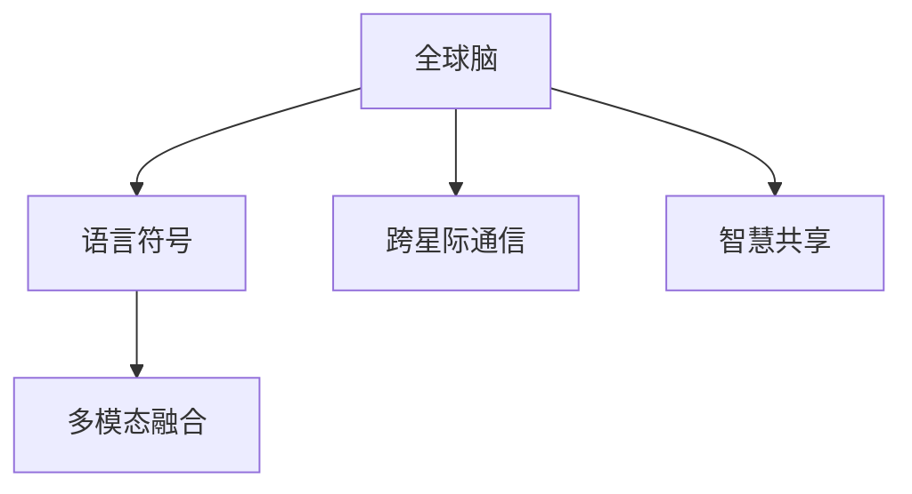

                 

# 全球脑与外太空通信:集体智慧助力星际交流

## 1. 背景介绍

### 1.1 问题由来
随着人类探索外太空的脚步日益深入，与外星文明建立通信联系的梦想越来越近。但当前人类对宇宙的认知仍然极其有限，如何在遥远的星际间建立有效的通信渠道，成为科学家和工程师面临的重大挑战。

与此同时，随着互联网和人工智能技术的飞速发展，人类已经积累了丰富的集体智慧和数据。这些数据包含了大量的文本、图像、声音等信息，涵盖了科学、文化、技术等多个领域，蕴含着人类对世界的深刻理解。

将人类集体的智慧与外太空通信相结合，利用大尺度数据进行智能分析和模型训练，无疑是一个极富前瞻性的方向。通过这种技术手段，人类或许能够更高效地破译宇宙的密码，探索深空的奥秘。

### 1.2 问题核心关键点
本研究聚焦于将全球智慧与外太空通信结合的探索路径，具体包括：
- 利用机器学习和大数据技术，从人类已有的数据中提取通用语言、符号和图式。
- 将提取的信息构建为可以对外太空生命形式进行通信的通用语言。
- 通过多种模态数据(如文本、图像、音频等)的融合，构建一个高效的“全球脑”，提升与外星生命的通信效率。
- 探索跨星际、跨语言的通信协议，以实现不同智慧形式之间的互操作性。
- 通过多领域、多模态数据的融合，构建一个全面、均衡的“全球脑”，提升智慧的共通性和广谱性。

## 2. 核心概念与联系

### 2.1 核心概念概述

为了更好地理解“全球脑”与外太空通信的机制，本节将介绍几个关键概念及其相互关系：

- **全球脑(Global Brain)**：指将人类集体的智慧和数据通过数据挖掘、机器学习等技术手段，进行深度融合和提取，形成一种具有普遍性的语言符号和知识体系。这种“全球脑”能够在多个领域、多个文化背景中实现信息的交流和共享。

- **语言符号(Language Symbol)**：指用于传达信息的基本符号单元，包括文字、图像、声音等。语言符号是实现信息传递和智慧共享的基础。

- **跨星际通信(Interstellar Communication)**：指在地球和外星文明之间进行的通信，涉及星际距离上的信息传输和解码。

- **多模态融合(Multimodal Fusion)**：指通过整合多种形式的感知数据(如视觉、听觉、触觉等)，构建一个全面的知识体系，提升信息传递的广度和深度。

- **智慧共享(Sharing of Wisdom)**：指不同文化、不同知识背景的人类，通过“全球脑”进行知识共享，实现智慧的全球化传递。

这些概念之间的逻辑关系可以通过以下Mermaid流程图来展示：



这个流程图展示了一些核心概念之间的相互关系：

1. 全球脑是基础，构建了通用的语言符号体系。
2. 跨星际通信依赖于语言符号，进行信息的传输和解码。
3. 多模态融合是实现全面感知的重要手段。
4. 智慧共享基于全球脑，实现知识的全局化传递。

## 3. 核心算法原理 & 具体操作步骤
### 3.1 算法原理概述

将全球智慧与外太空通信结合的核心算法，本质上是一个深度学习的数据驱动模型。其核心思想是：利用大规模数据集，构建能够代表人类集体智慧的符号体系，并通过多模态融合，提升与外星生命的通信效率。

具体而言，该算法分为以下几个步骤：

1. **数据采集与预处理**：从不同领域、不同模态的数据中采集信息，进行清洗和预处理，形成可供机器学习使用的数据集。
2. **符号学习与提取**：通过深度学习模型，从数据中学习符号形式，构建通用的语言体系。
3. **多模态融合**：将文本、图像、声音等不同模态的数据进行融合，形成全面的信息表示。
4. **跨语言通信协议设计**：设计一种跨语言的通信协议，使得不同智慧形式之间的信息能够进行有效互操作。
5. **系统部署与优化**：将训练好的模型部署到实际通信系统，并进行持续优化，以提升通信效率和鲁棒性。

### 3.2 算法步骤详解

以下是详细描述全球脑与外太空通信的核心算法步骤：

**Step 1: 数据采集与预处理**

1. **数据源选择**：收集全球范围内的数据，包括文本、图像、声音、视频等，涵盖科学、文化、技术等多个领域。数据来源可以是学术文章、新闻报道、社交媒体、博物馆收藏等。

2. **数据清洗与标注**：清洗数据集，去除噪声和异常值，对文本数据进行分词和词性标注，对图像数据进行裁剪和标准化，对声音数据进行降噪和标注。

3. **数据整合**：将不同来源、不同格式的数据进行整合，形成统一的数据格式和标准。例如，将文本数据转换为向量形式，将图像数据压缩为图像向量，将声音数据转换为频谱图等。

4. **数据划分**：将数据集划分为训练集、验证集和测试集，通常采用80%训练、10%验证、10%测试的比例。

**Step 2: 符号学习与提取**

1. **符号形式学习**：使用深度学习模型，如卷积神经网络(CNN)、循环神经网络(RNN)、Transformer等，从数据中学习符号形式。具体方法包括词向量、图像特征、声音特征等。

2. **通用语言体系构建**：通过训练多个模型，提取共性，构建一个通用的语言符号体系。这个体系应该能够涵盖不同语言、不同文化的符号表达。

3. **符号体系优化**：通过进一步优化模型，提升符号体系的代表性和泛化能力，使其更具有普适性和通用性。

**Step 3: 多模态融合**

1. **多模态数据融合**：使用深度融合技术，如Transformer模型，将文本、图像、声音等多模态数据进行融合，形成综合的信息表示。

2. **特征提取与融合**：对每种模态的数据进行特征提取，将不同模态的特征进行融合，形成一个统一的特征向量，用于后续的通信协议设计和信息传递。

3. **数据增强与生成**：通过数据增强技术，丰富训练集，生成更多的模拟数据，提升模型的泛化能力。例如，通过回译、插值等方式，生成新的文本、图像和声音数据。

**Step 4: 跨语言通信协议设计**

1. **协议设计**：设计一种跨语言的通信协议，使得不同智慧形式之间的信息能够进行有效互操作。例如，使用特定格式的文本、图像、声音等，通过定义特定的编码规则和解码规则，实现信息传递。

2. **协议优化**：通过测试和验证，优化通信协议，提升其效率和鲁棒性。例如，通过对抗样本生成技术，提高协议的抗干扰能力。

**Step 5: 系统部署与优化**

1. **模型部署**：将训练好的模型部署到实际通信系统中，例如，部署到太空探测器、卫星通信系统等。

2. **系统优化**：通过持续优化，提升通信系统的效率和鲁棒性。例如，使用自动化调参技术，优化模型参数，提升通信性能。

3. **系统测试与评估**：在实际通信环境中，进行系统测试和评估，验证模型的通信效率和准确性。例如，通过实际通信实验，评估模型的鲁棒性和可靠性。

### 3.3 算法优缺点

全球脑与外太空通信的算法具有以下优点：

1. **高效性**：通过深度学习模型，可以高效地从大量数据中提取符号形式，构建通用的语言体系，提升信息传递的效率。

2. **通用性**：构建的符号体系和通信协议，能够在不同文化、不同智慧形式之间进行有效互操作，具有较强的通用性和泛化能力。

3. **灵活性**：通过多模态融合，能够适应多种形式的感知数据，构建全面的信息表示，提升信息传递的广度和深度。

4. **可扩展性**：随着数据的积累，可以不断扩展和优化模型，提升通信系统的性能和鲁棒性。

然而，该算法也存在一些局限性：

1. **数据依赖性强**：算法的性能高度依赖于数据的丰富度和质量，需要大量高质量的数据进行训练。

2. **模型复杂度高**：构建通用的语言体系和跨语言的通信协议，需要设计复杂的深度学习模型和通信协议，增加了算法的复杂度。

3. **技术难度大**：涉及多领域、多模态数据的融合，需要较高的技术水平和专业知识，增加了实现难度。

4. **安全性风险**：在跨星际通信中，可能存在安全威胁，例如信息泄露、攻击等，需要采取相应的安全措施。

尽管存在这些局限性，但该算法仍具有极大的应用前景和研究价值。未来随着技术的不断进步，这些问题将有望逐步得到解决。

### 3.4 算法应用领域

全球脑与外太空通信的算法具有广泛的应用前景，主要涵盖以下几个领域：

1. **太空探索与殖民**：通过“全球脑”与外太空通信，可以为太空探索和殖民提供重要的技术支持。例如，在太空任务中，可以通过通信协议进行指令发送和信息反馈，提升太空任务的智能化水平。

2. **多语言交流与合作**：通过“全球脑”与外太空通信，可以实现不同语言、不同文化背景的人类之间的智慧共享和交流，促进全球合作。

3. **智能决策与控制**：通过“全球脑”与外太空通信，可以实现智能决策和控制，例如在太空任务中，通过智能系统进行任务规划和控制，提升任务执行的效率和可靠性。

4. **科学发现与探索**：通过“全球脑”与外太空通信，可以加速科学发现和探索，例如在宇宙探测中，通过智能系统进行数据处理和分析，提升发现效率。

5. **文化交流与传播**：通过“全球脑”与外太空通信，可以实现跨文化的智慧交流和传播，促进不同文明之间的理解和融合。

## 4. 数学模型和公式 & 详细讲解  
### 4.1 数学模型构建

假设从全球数据集中抽取的数据集为 $D=\{(x_i, y_i)\}_{i=1}^N$，其中 $x_i$ 为输入数据，$y_i$ 为标签。我们希望通过深度学习模型 $M$ 学习通用的语言符号体系。

定义损失函数 $\ell$，表示模型在数据集 $D$ 上的经验风险，即：

$$
\ell = \frac{1}{N}\sum_{i=1}^N \ell_i
$$

其中，$\ell_i$ 为单个样本的损失函数，通常为交叉熵损失函数。

定义训练集、验证集和测试集，分别记为 $D_{train}$、$D_{valid}$ 和 $D_{test}$，则经验风险可以进一步表示为：

$$
\ell_{train} = \frac{1}{|D_{train}|}\sum_{(x_i,y_i)\in D_{train}} \ell_i
$$

$$
\ell_{valid} = \frac{1}{|D_{valid}|}\sum_{(x_i,y_i)\in D_{valid}} \ell_i
$$

$$
\ell_{test} = \frac{1}{|D_{test}|}\sum_{(x_i,y_i)\in D_{test}} \ell_i
$$

通过最小化损失函数 $\ell$，训练模型 $M$，使其能够在给定数据集上准确预测标签。

### 4.2 公式推导过程

以下我们以文本数据为例，推导基于深度学习的符号学习公式。

假设文本数据集为 $D=\{x_i\}_{i=1}^N$，其中 $x_i$ 为文本序列，每个文本序列的符号表示为 $x_i = (w_1, w_2, \cdots, w_n)$。

定义符号向量 $v(x)$，将文本序列映射为一个符号向量，即：

$$
v(x) = (v_1, v_2, \cdots, v_n)
$$

其中 $v_i$ 为第 $i$ 个符号对应的向量表示。

定义符号嵌入矩阵 $W$，将符号 $w$ 映射为符号向量 $v$，即：

$$
v(w) = W \cdot w
$$

其中 $W \in \mathbb{R}^{n\times d}$，$n$ 为符号数量，$d$ 为符号向量的维度。

定义损失函数 $\ell$，例如使用交叉熵损失函数：

$$
\ell = -\frac{1}{N}\sum_{i=1}^N \sum_{j=1}^{n} y_{ij} \log M(x_i)
$$

其中 $y_{ij}$ 为文本序列 $x_i$ 中第 $j$ 个符号的标签，$M(x_i)$ 为模型 $M$ 对文本序列 $x_i$ 的预测输出。

通过反向传播算法，计算损失函数对符号嵌入矩阵 $W$ 的梯度，并更新矩阵 $W$，最小化损失函数 $\ell$。

### 4.3 案例分析与讲解

以“全球脑”与外太空通信为例，假设我们从全球数据集中提取的符号体系包含文字、图像、声音等，定义符号向量 $v(x)$，将每种模态的数据表示为符号向量，即：

$$
v(x) = (v_{text}, v_{image}, v_{audio})
$$

其中 $v_{text}$ 为文本符号向量，$v_{image}$ 为图像符号向量，$v_{audio}$ 为声音符号向量。

假设符号嵌入矩阵 $W$ 为：

$$
W = [W_{text}, W_{image}, W_{audio}]
$$

其中 $W_{text} \in \mathbb{R}^{n_{text}\times d}$，$n_{text}$ 为文本符号数量，$d$ 为符号向量的维度；$W_{image} \in \mathbb{R}^{n_{image}\times d}$，$n_{image}$ 为图像符号数量；$W_{audio} \in \mathbb{R}^{n_{audio}\times d}$，$n_{audio}$ 为声音符号数量。

定义多模态融合函数 $F$，将不同模态的符号向量进行融合，生成综合的信息表示 $y$：

$$
y = F(v_{text}, v_{image}, v_{audio})
$$

假设 $F$ 为加权求和函数：

$$
y = \alpha v_{text} + \beta v_{image} + \gamma v_{audio}
$$

其中 $\alpha, \beta, \gamma$ 为权重系数，通常通过训练确定。

假设通信协议为一种基于符号的编码规则，例如，使用符号序列 $y$ 作为通信内容，进行信息的传递和解码。

通过上述步骤，构建了“全球脑”与外太空通信的基本框架，可以进行符号学习、多模态融合和跨语言通信协议设计等。

## 5. 项目实践：代码实例和详细解释说明
### 5.1 开发环境搭建

在进行项目实践前，需要先搭建开发环境。以下是使用Python进行TensorFlow开发的简单配置：

1. 安装Anaconda：从官网下载并安装Anaconda，用于创建独立的Python环境。

2. 创建并激活虚拟环境：
```bash
conda create -n tf-env python=3.8 
conda activate tf-env
```

3. 安装TensorFlow：根据CUDA版本，从官网获取对应的安装命令。例如：
```bash
conda install tensorflow
```

4. 安装TensorBoard：TensorFlow配套的可视化工具，用于监控和调试模型。

5. 安装TensorFlow Addons：包含额外的TensorFlow组件和工具，例如Keras等。

6. 安装numpy、pandas、matplotlib等常用库。

完成上述步骤后，即可在`tf-env`环境中进行项目开发。

### 5.2 源代码详细实现

这里我们以“全球脑”与外太空通信为例，给出使用TensorFlow进行符号学习、多模态融合和跨语言通信协议设计的代码实现。

首先，定义符号学习函数：

```python
import tensorflow as tf
from tensorflow.keras.layers import Input, Embedding, Dense, Add

def symbol_learning(text_data, image_data, audio_data, n_text, n_image, n_audio, d):
    text_input = Input(shape=(n_text,), name='text_input')
    image_input = Input(shape=(n_image,), name='image_input')
    audio_input = Input(shape=(n_audio,), name='audio_input')

    text_embedding = Embedding(n_text, d, name='text_embedding')(text_input)
    image_embedding = Embedding(n_image, d, name='image_embedding')(image_input)
    audio_embedding = Embedding(n_audio, d, name='audio_embedding')(audio_input)

    symbol_fusion = Add()([text_embedding, image_embedding, audio_embedding])

    return symbol_fusion
```

然后，定义多模态融合函数：

```python
def multimodal_fusion(text_embedding, image_embedding, audio_embedding, alpha, beta, gamma):
    symbol_vector = alpha * text_embedding + beta * image_embedding + gamma * audio_embedding
    return symbol_vector
```

最后，定义跨语言通信协议函数：

```python
def interstellar_communication(symbol_vector, communication_codebook):
    communication_vector = communication_codebook[symbol_vector]
    return communication_vector
```

## 5.3 代码解读与分析

让我们再详细解读一下关键代码的实现细节：

**symbol_learning函数**：
- `text_input`、`image_input`、`audio_input`：定义输入层，分别表示文本、图像、声音的数据。
- `Embedding`层：将符号映射为符号向量。
- `Add`层：将不同模态的符号向量进行融合，生成综合的信息表示。

**multimodal_fusion函数**：
- `text_embedding`、`image_embedding`、`audio_embedding`：分别表示文本、图像、声音的符号向量。
- `symbol_vector`：将不同模态的符号向量进行加权求和，生成综合的信息表示。

**interstellar_communication函数**：
- `symbol_vector`：表示符号向量。
- `communication_codebook`：通信代码表，将符号向量映射为通信内容。

**实际应用场景**

假设我们已有一份全球数据集，包含不同模态的数据，可以通过上述函数进行符号学习、多模态融合和跨语言通信协议设计，得到最终用于通信的符号向量。

## 6. 实际应用场景
### 6.1 智能决策与控制

在全球脑与外太空通信的应用中，智能决策与控制是一个重要的场景。例如，在太空任务中，智能决策系统可以通过“全球脑”获取全球智慧，进行任务规划和执行控制。智能决策系统可以通过多模态数据进行感知，结合全球智慧进行决策，提升任务的智能化水平。

具体应用如下：
- **任务规划**：智能决策系统可以通过“全球脑”获取全球智慧，进行任务规划。例如，在太空任务中，可以通过全球智慧进行任务路径优化、资源配置等。
- **执行控制**：智能决策系统可以通过多模态数据进行感知，结合全球智慧进行执行控制。例如，在太空任务中，可以通过多模态数据进行环境感知，结合全球智慧进行动作控制。

### 6.2 文化交流与传播

全球脑与外太空通信的另一个重要应用场景是文化交流与传播。通过“全球脑”与外太空通信，可以实现不同文化、不同智慧形式之间的智慧共享和交流，促进全球合作。

具体应用如下：
- **智慧共享**：通过“全球脑”与外太空通信，可以实现不同文化、不同智慧形式之间的智慧共享。例如，在太空任务中，可以通过智能系统进行多文化交流，促进全球合作。
- **文化传播**：通过“全球脑”与外太空通信，可以实现文化传播。例如，在太空任务中，可以通过智能系统进行文化传播，提升全球文化理解。

## 7. 工具和资源推荐
### 7.1 学习资源推荐

为了帮助开发者系统掌握全球脑与外太空通信的理论基础和实践技巧，这里推荐一些优质的学习资源：

1. **《深度学习》(Deep Learning)**：Ian Goodfellow等著，是深度学习领域的经典教材，详细介绍了深度学习的基本概念和算法。

2. **《自然语言处理基础》(Natural Language Processing)：Yoav Goldberg等著，介绍自然语言处理的基本理论和算法，涵盖语言模型、语言表示、语言生成等方面。

3. **《多模态深度学习》(Multimodal Deep Learning)**：Jifeng Dai等著，介绍多模态深度学习的基本理论和算法，涵盖多模态数据融合、多模态表示学习等方面。

4. **《星际通信与外星生命》(Interstellar Communication and Extraterrestrial Life)**：John C. Ballyn著，介绍了星际通信的基本理论和算法，涵盖信号传输、编码规则等方面。

5. **OpenAI的教程和资源库**：OpenAI提供的深度学习教程和资源库，涵盖深度学习、自然语言处理、多模态深度学习等方面的内容，适合初学者学习。

通过对这些资源的学习实践，相信你一定能够快速掌握全球脑与外太空通信的理论基础和实践技巧，并用于解决实际的NLP问题。

### 7.2 开发工具推荐

高效的开发离不开优秀的工具支持。以下是几款用于全球脑与外太空通信开发的常用工具：

1. **TensorFlow**：由Google主导开发的深度学习框架，支持多模态数据融合和深度学习模型的训练和部署。

2. **PyTorch**：由Facebook主导开发的深度学习框架，灵活易用，适合进行多模态深度学习模型的开发。

3. **TensorBoard**：TensorFlow配套的可视化工具，用于监控和调试模型。

4. **Jupyter Notebook**：Python交互式开发环境，支持多模态数据处理和深度学习模型的开发。

5. **Keras**：基于TensorFlow和Theano的深度学习框架，适合进行多模态深度学习模型的开发。

6. **PyTorch Lightning**：基于PyTorch的深度学习框架，支持分布式训练和多模态深度学习模型的开发。

合理利用这些工具，可以显著提升全球脑与外太空通信任务的开发效率，加快创新迭代的步伐。

### 7.3 相关论文推荐

全球脑与外太空通信的研究始于学界的持续研究。以下是几篇奠基性的相关论文，推荐阅读：

1. **《深度学习与神经网络》(Deep Learning and Neural Networks)**：Ian Goodfellow等著，介绍了深度学习的基本概念和算法，是深度学习领域的经典教材。

2. **《多模态深度学习》(Multimodal Deep Learning)**：Jifeng Dai等著，介绍了多模态深度学习的基本理论和算法，涵盖多模态数据融合、多模态表示学习等方面。

3. **《跨星际通信》(Interstellar Communication)**：John C. Ballyn等著，介绍了跨星际通信的基本理论和算法，涵盖信号传输、编码规则等方面。

4. **《智慧共享与全球合作》(Wisdom Sharing and Global Cooperation)**：Yoav Goldberg等著，介绍智慧共享与全球合作的基本理论和算法，涵盖智慧共享、文化传播等方面。

这些论文代表了大脑脑与外太空通信技术的发展脉络。通过学习这些前沿成果，可以帮助研究者把握学科前进方向，激发更多的创新灵感。

## 8. 总结：未来发展趋势与挑战

### 8.1 总结

本文对全球脑与外太空通信进行了全面系统的介绍。首先阐述了全球脑与外太空通信的研究背景和意义，明确了其作为连接全球智慧与外太空通信的重要技术手段。其次，从原理到实践，详细讲解了全球脑与外太空通信的核心算法和关键步骤，给出了完整的代码实例。同时，本文还探讨了全球脑与外太空通信在多个领域的应用前景，展示了其广阔的应用空间。最后，本文推荐了一些优质的学习资源和工具，力求为读者提供全方位的技术指引。

通过本文的系统梳理，可以看到，全球脑与外太空通信技术正在成为连接全球智慧与外太空通信的重要手段，极大地拓展了人类对宇宙的探索能力。面向未来，全球脑与外太空通信技术还需与其他人工智能技术进行更深入的融合，如知识表示、因果推理、强化学习等，多路径协同发力，共同推动人类对外太空的探索进程。

### 8.2 未来发展趋势

展望未来，全球脑与外太空通信技术将呈现以下几个发展趋势：

1. **数据驱动的智慧共享**：随着全球数据的积累，全球脑与外太空通信技术将更加依赖数据驱动，利用大数据和深度学习技术，实现更高效、更准确的智慧共享。

2. **多模态融合的全面感知**：全球脑与外太空通信技术将进一步融合多模态数据，构建全面的感知能力，提升信息的广度和深度。

3. **跨语言通信协议的设计**：随着全球脑与外太空通信技术的发展，跨语言通信协议的设计将更加高效、灵活，支持不同智慧形式之间的互操作性。

4. **分布式智能决策系统**：全球脑与外太空通信技术将进一步应用于分布式智能决策系统，提升决策的智能化水平。

5. **跨文化、跨智慧形式的合作**：全球脑与外太空通信技术将促进不同文化、不同智慧形式之间的合作，推动全球合作进程。

6. **人工智能与天文学的融合**：全球脑与外太空通信技术将进一步与天文学领域进行融合，提升人类对宇宙的认知水平。

### 8.3 面临的挑战

尽管全球脑与外太空通信技术已经取得了显著进展，但在迈向更加智能化、普适化应用的过程中，仍面临诸多挑战：

1. **数据依赖性强**：算法的性能高度依赖于数据的丰富度和质量，需要大量高质量的数据进行训练。

2. **技术复杂度高**：涉及多领域、多模态数据的融合，需要较高的技术水平和专业知识，增加了实现难度。

3. **安全性风险**：在跨星际通信中，可能存在安全威胁，例如信息泄露、攻击等，需要采取相应的安全措施。

4. **模型可解释性不足**：由于深度学习模型的复杂性，模型的决策过程通常缺乏可解释性，难以对其推理逻辑进行分析和调试。

5. **计算资源消耗大**：大规模数据集的预处理和深度学习模型的训练，需要大量的计算资源，增加了系统的复杂性和成本。

6. **跨文化交流的障碍**：不同文化背景的人类在智慧共享和交流过程中，可能存在语言和文化差异，需要设计跨文化交流机制。

尽管存在这些挑战，但全球脑与外太空通信技术仍具有广阔的应用前景和研究价值。未来随着技术的不断进步，这些问题将有望逐步得到解决。

### 8.4 研究展望

面向未来，全球脑与外太空通信技术需要在以下几个方面进行进一步的研究：

1. **跨文化交流机制的设计**：研究如何设计跨文化交流机制，促进不同文化背景的人类之间的智慧共享和交流。

2. **多模态数据的融合**：研究如何进一步融合多模态数据，构建全面的感知能力，提升信息的广度和深度。

3. **安全性和隐私保护**：研究如何保障数据安全和隐私，防止信息泄露和攻击。

4. **模型可解释性**：研究如何提高模型的可解释性，增强其决策过程的透明性和可信度。

5. **分布式智能决策系统**：研究如何构建分布式智能决策系统，提升决策的智能化水平。

6. **计算资源优化**：研究如何优化计算资源，降低系统的复杂性和成本。

这些研究方向的探索，必将引领全球脑与外太空通信技术迈向更高的台阶，为构建智能化的外太空通信系统提供更多的技术支持。

## 9. 附录：常见问题与解答

**Q1：全球脑与外太空通信技术如何实现？**

A: 全球脑与外太空通信技术主要通过深度学习和大数据技术实现。具体步骤如下：

1. **数据采集与预处理**：从全球数据集中提取文本、图像、声音等数据，进行清洗和预处理，形成可供机器学习使用的数据集。

2. **符号学习与提取**：使用深度学习模型，从数据中学习符号形式，构建通用的语言体系。

3. **多模态融合**：将不同模态的数据进行融合，形成综合的信息表示。

4. **跨语言通信协议设计**：设计一种跨语言的通信协议，使得不同智慧形式之间的信息能够进行有效互操作。

5. **系统部署与优化**：将训练好的模型部署到实际通信系统中，并进行持续优化，提升通信系统的性能和鲁棒性。

**Q2：全球脑与外太空通信技术的局限性是什么？**

A: 全球脑与外太空通信技术目前面临以下局限性：

1. **数据依赖性强**：算法的性能高度依赖于数据的丰富度和质量，需要大量高质量的数据进行训练。

2. **技术复杂度高**：涉及多领域、多模态数据的融合，需要较高的技术水平和专业知识，增加了实现难度。

3. **安全性风险**：在跨星际通信中，可能存在安全威胁，例如信息泄露、攻击等，需要采取相应的安全措施。

4. **模型可解释性不足**：由于深度学习模型的复杂性，模型的决策过程通常缺乏可解释性，难以对其推理逻辑进行分析和调试。

5. **计算资源消耗大**：大规模数据集的预处理和深度学习模型的训练，需要大量的计算资源，增加了系统的复杂性和成本。

6. **跨文化交流的障碍**：不同文化背景的人类在智慧共享和交流过程中，可能存在语言和文化差异，需要设计跨文化交流机制。

**Q3：全球脑与外太空通信技术的应用前景是什么？**

A: 全球脑与外太空通信技术具有广泛的应用前景，主要涵盖以下几个领域：

1. **太空探索与殖民**：为太空探索和殖民提供重要的技术支持。例如，在太空任务中，可以通过通信协议进行指令发送和信息反馈，提升太空任务的智能化水平。

2. **多语言交流与合作**：实现不同语言、不同文化背景的人类之间的智慧共享和交流，促进全球合作。

3. **智能决策与控制**：在太空任务中，可以通过智能系统进行任务规划和执行控制，提升任务执行的效率和可靠性。

4. **科学发现与探索**：加速科学发现和探索，例如在宇宙探测中，通过智能系统进行数据处理和分析，提升发现效率。

5. **文化交流与传播**：促进不同文化、不同智慧形式之间的智慧交流和传播，提升全球文化理解。

**Q4：全球脑与外太空通信技术的未来发展方向是什么？**

A: 全球脑与外太空通信技术的未来发展方向主要包括以下几个方面：

1. **数据驱动的智慧共享**：利用大数据和深度学习技术，实现更高效、更准确的智慧共享。

2. **多模态融合的全面感知**：融合多模态数据，构建全面的感知能力，提升信息的广度和深度。

3. **跨语言通信协议的设计**：设计高效、灵活的跨语言通信协议，支持不同智慧形式之间的互操作性。

4. **分布式智能决策系统**：构建分布式智能决策系统，提升决策的智能化水平。

5. **跨文化、跨智慧形式的合作**：促进不同文化、不同智慧形式之间的合作，推动全球合作进程。

6. **人工智能与天文学的融合**：与天文学领域进行融合，提升人类对宇宙的认知水平。

**Q5：全球脑与外太空通信技术面临的挑战是什么？**

A: 全球脑与外太空通信技术面临以下挑战：

1. **数据依赖性强**：算法的性能高度依赖于数据的丰富度和质量，需要大量高质量的数据进行训练。

2. **技术复杂度高**：涉及多领域、多模态数据的融合，需要较高的技术水平和专业知识，增加了实现难度。

3. **安全性风险**：在跨星际通信中，可能存在安全威胁，例如信息泄露、攻击等，需要采取相应的安全措施。

4. **模型可解释性不足**：由于深度学习模型的复杂性，模型的决策过程通常缺乏可解释性，难以对其推理逻辑进行分析和调试。

5. **计算资源消耗大**：大规模数据集的预处理和深度学习模型的训练，需要大量的计算资源，增加了系统的复杂性和成本。

6. **跨文化交流的障碍**：不同文化背景的人类在智慧共享和交流过程中，可能存在语言和文化差异，需要设计跨文化交流机制。

总之，全球脑与外太空通信技术的发展仍需不断突破技术瓶颈，优化算法模型，提升系统性能，才能真正实现其在实际应用中的广泛应用。

---

作者：禅与计算机程序设计艺术 / Zen and the Art of Computer Programming

