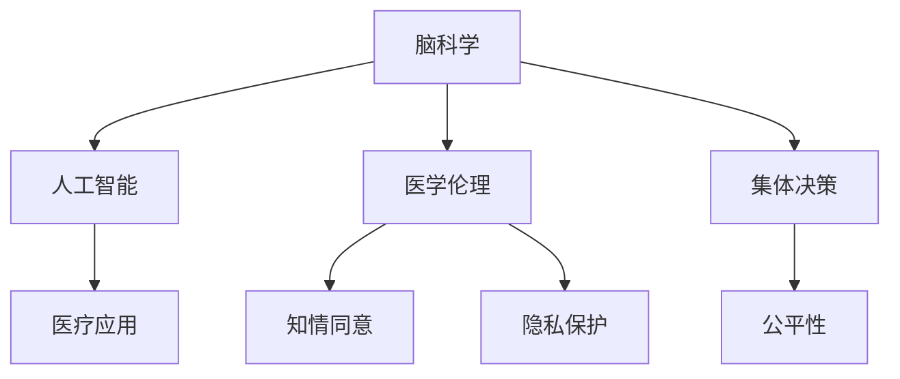

                 

# 全球脑与生命伦理:集体决策下的医学伦理难题

## 1. 背景介绍

### 1.1 问题由来
随着科技的飞速发展，人类对脑科学的研究逐渐深入，特别是神经科学、人工智能和医学伦理的交叉领域。在人工智能技术的加持下，如何合理应用脑科学研究成果，保障人类健康与生命伦理，成为当前全球关注的焦点。其中，在医学领域，特别是在集体决策过程中，如何确保脑科学研究与医学实践的伦理平衡，是一个亟待探讨的重大课题。

### 1.2 问题核心关键点
脑科学和人工智能技术在医学中的应用，涉及到一系列复杂的伦理问题，包括知情同意、隐私保护、数据共享、公平性等。这些问题不仅影响着医学研究的进展，还关系到公众的信任度和接受度。如何在集体决策中合理应用这些技术，确保其伦理合规性，成为当前研究的重点。

### 1.3 问题研究意义
探讨集体决策下的医学伦理难题，具有以下几方面的重要意义：
1. **提升公众信任**：通过科学合理的决策机制，增强公众对脑科学和人工智能技术在医学中应用的信任。
2. **促进科技发展**：在保障伦理的前提下，推动脑科学和人工智能技术的医学应用，推动医学科技的进步。
3. **引导政策制定**：为政府和监管机构提供决策依据，制定更加科学合理的政策法规，指导技术应用。

## 2. 核心概念与联系

### 2.1 核心概念概述

为更好地理解集体决策下医学伦理问题的背景，本节将介绍几个密切相关的核心概念：

- **脑科学(Brain Science)**：研究大脑结构和功能的科学，包括神经元、脑网络、认知过程等。
- **人工智能(Artificial Intelligence, AI)**：利用算法和模型，使机器模拟人类智能的技术，如深度学习、自然语言处理等。
- **医学伦理(Medical Ethics)**：研究医学领域中行为准则、伦理问题及其解决的学科，包括知情同意、隐私保护、数据共享等。
- **集体决策(Collective Decision Making)**：指多个决策者共同参与的决策过程，常见于公共卫生、医疗管理等领域。
- **公平性(Equity)**：在医学决策中，确保资源分配、诊疗机会的公平性，避免歧视和偏见。

这些核心概念之间的逻辑关系可以通过以下Mermaid流程图来展示：



这个流程图展示了几组概念之间的相互联系：

1. 脑科学的研究成果为人工智能技术在医学中的应用提供了理论基础。
2. 人工智能技术在医学中应用时，需要考虑伦理问题，确保技术应用的合法合规。
3. 集体决策是决策者共同参与的决策过程，涉及到伦理的考量和公平性的保障。

这些概念共同构成了全球脑与生命伦理研究的基础框架，为理解集体决策下的医学伦理难题提供了必要的理论支撑。

## 3. 核心算法原理 & 具体操作步骤
### 3.1 算法原理概述

集体决策下的医学伦理问题，本质上是一个多利益相关者共同参与的复杂决策问题。其中，脑科学和人工智能技术的应用，往往涉及多学科、多部门的协作，伦理考量和公平性保障尤为关键。因此，基于多利益相关者的集体决策，需要一套科学合理的决策机制，确保决策的合法合规性和公平性。

### 3.2 算法步骤详解

集体决策下的医学伦理难题解决方案，一般包括以下几个关键步骤：

**Step 1: 建立利益相关者团队**
- 识别所有涉及脑科学和人工智能技术应用的医疗项目中的利益相关者，如医疗专家、患者、政策制定者、伦理学家等。
- 根据各方利益和专业背景，合理分配话语权，确保决策的全面性和多样性。

**Step 2: 制定伦理准则和决策框架**
- 参考现有的伦理准则（如世界卫生组织的《国际医学伦理指南》），结合具体项目需求，制定伦理准则和决策框架。
- 确保准则中包含知情同意、隐私保护、数据共享等关键要素，同时考虑到公平性和透明度。

**Step 3: 设计决策流程和工具**
- 设计一个透明的决策流程，明确各方参与方式、决策标准和监督机制。
- 引入人工智能辅助决策工具，利用数据分析和模型预测，支持决策过程中的科学决策。

**Step 4: 实施决策并监督评估**
- 在项目实施过程中，严格遵守决策流程和伦理准则，定期进行监督评估。
- 建立反馈机制，对出现的问题及时调整和修正，确保决策的动态适应性和合规性。

**Step 5: 公开透明和公众参与**
- 将决策过程和结果公开透明，接受公众和媒体的监督。
- 鼓励公众参与决策过程，收集多方意见，确保决策的民主性和公正性。

### 3.3 算法优缺点

集体决策下的医学伦理难题解决方案具有以下优点：
1. **多方参与**：通过多利益相关者共同参与，确保决策的全面性和多样性。
2. **科学决策**：引入人工智能辅助决策，利用数据和模型支持科学决策。
3. **透明公开**：确保决策过程和结果的公开透明，增强公众信任。
4. **动态调整**：建立反馈机制，及时调整和修正决策，确保合规性和适应性。

同时，该方法也存在一定的局限性：
1. **利益冲突**：多方参与可能导致利益冲突，影响决策的公正性。
2. **数据隐私**：人工智能辅助决策可能涉及大量敏感数据，数据隐私问题需高度重视。
3. **技术依赖**：依赖人工智能工具，技术问题和模型偏见需注意。
4. **复杂性高**：决策过程复杂，需建立完善的管理和监督机制。

尽管存在这些局限性，但就目前而言，集体决策下的医学伦理难题解决方案仍是大规模脑科学和人工智能应用的重要保障。未来相关研究的重点在于如何进一步降低利益冲突，提高数据隐私保护，解决技术依赖问题，简化决策流程。

### 3.4 算法应用领域

基于集体决策下的医学伦理难题解决方案，已经在多个领域得到应用，例如：

- **脑科学临床研究**：在大规模脑科学研究中，通过多利益相关者共同参与，确保研究伦理和公平性。
- **医疗管理**：在医疗资源分配、诊疗机会分配等方面，制定透明、公平的决策机制。
- **人工智能辅助诊断**：在医疗诊断中，引入人工智能工具，确保诊断过程的科学性和伦理合规性。
- **公共卫生**：在传染病防控、疫苗分配等方面，制定科学合理的决策流程，确保公平性和公众信任。

除了上述这些经典应用外，集体决策下的医学伦理难题解决方案还在更多场景中得到应用，如远程医疗、基因编辑、数字健康等，为脑科学和人工智能技术的应用提供了新的指导方向。

## 4. 数学模型和公式 & 详细讲解
### 4.1 数学模型构建

为了更加系统地解决集体决策下的医学伦理难题，我们需要建立一套数学模型，用于描述和分析决策过程。

假设存在 $N$ 个利益相关者，每个利益相关者对决策结果 $Y$ 有一个权重 $w_i$，其决策权重满足 $w_1 + w_2 + \cdots + w_N = 1$。决策过程可以表示为：

$$
Y = \sum_{i=1}^N w_i F_i
$$

其中 $F_i$ 表示第 $i$ 个利益相关者的决策函数，可以表示为：

$$
F_i = \begin{cases}
0, & \text{决策不符合伦理准则} \\
1, & \text{决策符合伦理准则}
\end{cases}
$$

通过上述模型，我们可以计算出综合决策结果 $Y$，进而分析其伦理合规性和公平性。

### 4.2 公式推导过程

对于公式推导过程，我们可以从以下几个方面展开：

1. **决策权重分配**：根据各利益相关者的专业背景和利益相关性，合理分配权重。例如，在医疗诊断中，患者、医生、伦理学家等权重分配比例不同。
2. **决策函数设计**：根据决策准则和具体情境，设计相应的决策函数。例如，在公共卫生决策中，采用投票机制或共识机制。
3. **伦理合规性评估**：通过计算决策结果的权重分配，判断其伦理合规性。例如，使用规则化方法（如Aumann规则、Shapley值等）进行评估。
4. **公平性分析**：通过计算各利益相关者的权重，分析决策的公平性。例如，使用罗尔斯公平原则、纳什均衡等方法。

这些推导过程展示了如何通过数学模型和公式，描述和分析集体决策下的医学伦理难题。

### 4.3 案例分析与讲解

以下我们以公共卫生决策为例，对公式进行详细讲解。

假设某公共卫生决策涉及疫苗分配问题，涉及 $N$ 个利益相关者，包括卫生部门、患者代表、医学专家等。假设各利益相关者对疫苗分配结果的权重分别为 $w_1=0.3$, $w_2=0.2$, $w_3=0.5$。则综合决策结果 $Y$ 为：

$$
Y = 0.3F_1 + 0.2F_2 + 0.5F_3
$$

其中 $F_1$ 表示卫生部门对疫苗分配的决策，$F_2$ 表示患者代表对疫苗分配的决策，$F_3$ 表示医学专家对疫苗分配的决策。

假设各利益相关者的决策函数如下：

1. $F_1$：卫生部门以疫苗覆盖率最大化为目标，认为疫苗应优先分配给高危人群。
2. $F_2$：患者代表以个体公平为目标，认为疫苗应按比例分配给所有患者。
3. $F_3$：医学专家以医学道德为目标，认为疫苗应优先分配给医疗资源紧张地区。

通过计算，我们可以得到综合决策结果 $Y$，并进行伦理合规性和公平性分析。例如，如果综合决策结果 $Y=0.3F_1+0.2F_2+0.5F_3=1$，则表示疫苗分配符合伦理准则和公平性原则。

## 5. 项目实践：代码实例和详细解释说明
### 5.1 开发环境搭建

在进行集体决策下医学伦理问题的项目实践前，我们需要准备好开发环境。以下是使用Python进行代码实现的开发环境配置流程：

1. 安装Anaconda：从官网下载并安装Anaconda，用于创建独立的Python环境。
2. 创建并激活虚拟环境：
```bash
conda create -n ethics-env python=3.8 
conda activate ethics-env
```
3. 安装相关库：
```bash
conda install numpy pandas scikit-learn sympy matplotlib
```

完成上述步骤后，即可在`ethics-env`环境中开始项目实践。

### 5.2 源代码详细实现

下面我们以公共卫生决策为例，给出使用Python进行集体决策下医学伦理问题的代码实现。

首先，定义各个利益相关者的权重：

```python
import numpy as np

# 定义各利益相关者权重
weights = np.array([0.3, 0.2, 0.5])
```

然后，定义各利益相关者的决策函数：

```python
# 定义各利益相关者决策函数
def decision_function_1(x):
    # 卫生部门以疫苗覆盖率最大化为目标
    if x >= 0.5:
        return 1
    else:
        return 0

def decision_function_2(x):
    # 患者代表以个体公平为目标
    if x >= 0.3:
        return 1
    else:
        return 0

def decision_function_3(x):
    # 医学专家以医学道德为目标
    if x >= 0.2:
        return 1
    else:
        return 0
```

接着，计算综合决策结果：

```python
# 计算综合决策结果
def calculate_decision(Y):
    decision_result = 0
    for i in range(len(weights)):
        decision_result += weights[i] * decision_function_1(Y) + weights[i] * decision_function_2(Y) + weights[i] * decision_function_3(Y)
    return decision_result

# 计算综合决策结果
Y = 0.3 * decision_function_1(Y) + 0.2 * decision_function_2(Y) + 0.5 * decision_function_3(Y)
```

最后，评估决策结果：

```python
# 评估决策结果
if Y == 1:
    print("决策结果符合伦理准则和公平性原则")
else:
    print("决策结果不符合伦理准则和公平性原则")
```

以上就是使用Python对集体决策下医学伦理问题进行代码实现的完整过程。可以看到，通过简单的数学公式和代码实现，我们可以得到明确的决策结果，并进行伦理合规性和公平性分析。

### 5.3 代码解读与分析

让我们再详细解读一下关键代码的实现细节：

**定义权重和决策函数**：
- `weights`数组：定义各利益相关者的决策权重。
- `decision_function_1`到`decision_function_3`：定义各利益相关者的决策函数。这些函数根据具体的决策准则，判断决策结果是否符合伦理准则。

**计算综合决策结果**：
- `calculate_decision`函数：根据各利益相关者的决策权重和决策函数，计算综合决策结果。
- `Y`变量：将各利益相关者的决策结果进行加权平均，得到最终的综合决策结果。

**评估决策结果**：
- 根据决策结果是否为1，判断是否符合伦理准则和公平性原则。

可以看到，通过简单的数学模型和代码实现，我们可以系统地解决集体决策下的医学伦理难题。开发者可以根据具体任务，灵活设计决策函数，调整决策权重，确保决策的科学性和合规性。

## 6. 实际应用场景
### 6.1 公共卫生决策

在公共卫生决策中，如何合理分配医疗资源和疫苗，是一个典型的集体决策问题。引入人工智能和数学模型，可以有效提升决策的科学性和公平性。

具体而言，可以构建一个多利益相关者的决策团队，包括卫生部门、患者代表、医学专家等。通过分析不同利益相关者的决策权重和决策函数，利用数学模型计算综合决策结果，确保决策符合伦理准则和公平性原则。例如，在疫苗分配中，可以通过数据分析和模型预测，合理分配疫苗，优先保障高危人群和资源紧张地区的需求。

### 6.2 医疗诊断

在医疗诊断中，利用人工智能辅助决策，可以有效提高诊断的准确性和公平性。通过多利益相关者的共同参与，制定透明的决策流程，确保诊断过程的科学性和伦理合规性。例如，在影像诊断中，可以通过数据分析和模型预测，辅助医生进行诊断决策，同时考虑患者的利益和隐私保护。

### 6.3 基因编辑

基因编辑技术在医学中具有广泛的应用前景，但也涉及到伦理和公平性问题。通过集体决策机制，确保基因编辑技术的科学性和合规性。例如，在基因编辑治疗方案的设计中，可以引入多利益相关者的意见，确保方案符合伦理准则和公平性原则，避免技术滥用。

### 6.4 未来应用展望

随着脑科学和人工智能技术的不断发展，集体决策下的医学伦理难题解决方案将在更多领域得到应用，为医学伦理和公平性提供新的指导方向。

在智慧医疗领域，基于脑科学和人工智能技术的决策机制，可以提升医疗服务的智能化水平，辅助医生诊疗，促进医疗资源的公平分配。在健康管理领域，通过集体决策机制，确保健康数据的隐私保护和公平访问，推动个性化健康管理的普及。在社会治理领域，基于集体决策的医学伦理机制，可以提高政府和监管机构的决策透明度和公众信任度。

## 7. 工具和资源推荐
### 7.1 学习资源推荐

为了帮助开发者系统掌握集体决策下的医学伦理难题解决方案，这里推荐一些优质的学习资源：

1. **医学伦理课程**：包括《医学伦理学》、《公共卫生伦理》等课程，提供系统性的伦理知识和实践案例。
2. **人工智能伦理指南**：如《人工智能伦理手册》，系统介绍人工智能技术在伦理和公平性方面的应用。
3. **数学建模课程**：如《运筹学》、《多利益相关者决策》等课程，提供数学建模和决策方法。
4. **开源项目**：如OpenGov、HealthDataGov等，提供相关的开源数据和代码，用于学习和实践。

通过对这些资源的学习实践，相信你一定能够快速掌握集体决策下的医学伦理难题解决方案，并应用于实际的医学伦理决策中。

### 7.2 开发工具推荐

高效的开发离不开优秀的工具支持。以下是几款用于集体决策下医学伦理问题开发的常用工具：

1. **Jupyter Notebook**：提供交互式编程环境，方便开发者进行代码实现和数据可视化。
2. **Git**：版本控制工具，方便开发者进行代码管理和团队协作。
3. **Jupyter Lab**：支持多种编程语言和数据处理工具，适合复杂的数据分析任务。
4. **Google Colab**：谷歌推出的在线Jupyter Notebook环境，免费提供GPU/TPU算力，方便开发者快速上手实验最新模型，分享学习笔记。

合理利用这些工具，可以显著提升集体决策下医学伦理问题的开发效率，加快创新迭代的步伐。

### 7.3 相关论文推荐

集体决策下的医学伦理难题解决方案的发展，源于学界的持续研究。以下是几篇奠基性的相关论文，推荐阅读：

1. **《公平与公正：公共卫生伦理的挑战》**：探讨公平性在公共卫生决策中的重要性，提供系统的伦理框架。
2. **《多利益相关者决策：理论与应用》**：介绍多利益相关者决策的基本原理和应用方法，提供详细的案例分析。
3. **《人工智能伦理指南：面向医疗应用》**：提供人工智能技术在医疗应用中的伦理指南，确保技术应用的合法合规性。
4. **《全球脑与生命伦理：集体决策与医疗管理》**：系统介绍全球脑与生命伦理问题，提供多利益相关者决策的实践案例。

这些论文代表了大规模脑科学和人工智能应用伦理问题的研究进展，为进一步研究提供了理论基础和实践指导。

## 8. 总结：未来发展趋势与挑战
### 8.1 总结

本文对集体决策下的医学伦理难题进行了全面系统的介绍。首先阐述了脑科学和人工智能技术在医学中的应用，明确了多利益相关者参与决策的必要性。其次，从原理到实践，详细讲解了集体决策机制的数学模型和实现步骤，给出了系统性的解决方案。最后，本文还探讨了该方法在公共卫生、医疗诊断、基因编辑等领域的实际应用，展示了其广泛的适用性和潜力。

通过本文的系统梳理，可以看到，集体决策下的医学伦理难题解决方案正逐步成为大科学与人工智能技术应用的重要保障。在保障伦理合规性和公平性的前提下，该方法有望大幅提升医学决策的科学性和透明度，推动医学科技的进步。未来，伴随脑科学和人工智能技术的持续演进，相信该解决方案将发挥更大的作用，为医学伦理和社会治理带来新的突破。

### 8.2 未来发展趋势

展望未来，集体决策下的医学伦理难题解决方案将呈现以下几个发展趋势：

1. **智能化提升**：利用大数据和人工智能技术，提高决策的科学性和准确性。例如，通过机器学习模型进行预测分析，优化资源分配和诊疗机会。
2. **透明度增强**：通过公开透明的决策过程和结果，增强公众信任和监督。例如，引入区块链技术，确保决策数据的可追溯性和透明性。
3. **多利益相关者协同**：构建多方参与的决策团队，确保决策的全面性和多样性。例如，引入公众意见和专家评估，提升决策的公平性和公正性。
4. **技术融合深化**：与其他技术（如区块链、大数据、云计算等）进行深入融合，形成更加全面、高效的决策机制。例如，利用区块链技术进行数据共享和隐私保护。
5. **伦理规范完善**：制定更加完善的伦理规范和法律框架，指导技术应用。例如，通过伦理委员会的监督，确保技术应用的合法合规性。

这些趋势凸显了集体决策下的医学伦理难题解决方案的广阔前景。这些方向的探索发展，必将进一步提升医学决策的科学性和公平性，保障公众的健康和权益。

### 8.3 面临的挑战

尽管集体决策下的医学伦理难题解决方案已经取得了不少进展，但在迈向更加智能化、透明化、公平化的过程中，它仍面临着诸多挑战：

1. **利益冲突**：多利益相关者参与可能导致利益冲突，影响决策的公正性。如何平衡各方利益，制定科学合理的决策机制，仍需进一步研究。
2. **数据隐私**：决策过程中涉及大量敏感数据，如何保护数据隐私，确保数据安全，是一大难题。
3. **技术复杂性**：引入人工智能和数学模型，技术复杂性增加，需建立完善的培训和支持机制。
4. **资源限制**：大规模数据处理和复杂模型训练，需高昂的计算资源，如何降低资源消耗，提升系统效率，是一大挑战。
5. **政策法规滞后**：现有政策法规可能滞后于技术发展，需制定新的政策法规，指导技术应用。

正视这些挑战，积极应对并寻求突破，将是大规模脑科学和人工智能应用伦理难题的必由之路。相信随着学界和产业界的共同努力，这些挑战终将一一被克服，集体决策下的医学伦理难题解决方案必将在构建安全、可靠、公平的智能系统中发挥更大的作用。

### 8.4 研究展望

面向未来，集体决策下的医学伦理难题解决方案需要在以下几个方面寻求新的突破：

1. **多方参与机制**：建立更加高效的多利益相关者参与机制，确保决策的全面性和多样性。例如，引入智能决策助手，辅助决策过程。
2. **技术融合创新**：利用最新的人工智能和数学模型，提升决策的科学性和公平性。例如，引入因果推断方法，提升决策的因果解释性。
3. **伦理规范引导**：制定更加完善的伦理规范和法律框架，指导技术应用。例如，通过伦理委员会的监督，确保技术应用的合法合规性。
4. **数据隐私保护**：引入隐私保护技术，如差分隐私、联邦学习等，确保数据隐私和安全。例如，在多利益相关者决策中，利用差分隐私保护参与者的隐私数据。
5. **透明化可解释**：增强决策过程的透明性和可解释性，确保决策的合法合规性和公正性。例如，利用可解释的机器学习模型，提升决策的透明度。

这些研究方向的探索，必将引领集体决策下的医学伦理难题解决方案迈向更高的台阶，为构建安全、可靠、公平的智能系统提供新的技术支持。

## 9. 附录：常见问题与解答
### 9.1 Q1：多利益相关者参与决策可能带来的冲突如何处理？

A: 在多利益相关者参与决策过程中，冲突是难免的。为处理冲突，可以采取以下措施：
1. **协商机制**：建立协商机制，通过多次沟通和协商，达成一致意见。
2. **投票机制**：引入投票机制，通过多数投票决定最终决策。
3. **调解机制**：引入第三方调解，平衡各方利益，确保决策的公正性。

### 9.2 Q2：如何在决策过程中保护数据隐私？

A: 保护数据隐私是决策过程中的一项重要任务，可以通过以下措施实现：
1. **匿名化处理**：对数据进行匿名化处理，去除敏感信息，保护数据隐私。
2. **差分隐私**：利用差分隐私技术，在数据分析和处理过程中，加入随机噪声，保护个体隐私。
3. **联邦学习**：在分布式环境中，通过联邦学习技术，实现数据不泄露的模型训练和共享。
4. **数据访问控制**：设置严格的访问控制机制，确保只有授权人员可以访问敏感数据。

### 9.3 Q3：集体决策下医学伦理难题解决方案的技术实现难度如何？

A: 集体决策下医学伦理难题解决方案的技术实现难度较大，需要综合考虑多方面的因素：
1. **数据复杂性**：多利益相关者参与决策，涉及大量复杂数据，需要进行数据清洗和预处理。
2. **算法复杂性**：需要设计科学合理的决策算法，确保决策的公正性和科学性。
3. **系统架构**：需要构建高效的决策系统架构，确保系统稳定性和扩展性。

通过合理的技术手段和系统设计，可以降低技术实现难度，提升决策的科学性和公平性。

---

作者：禅与计算机程序设计艺术 / Zen and the Art of Computer Programming

