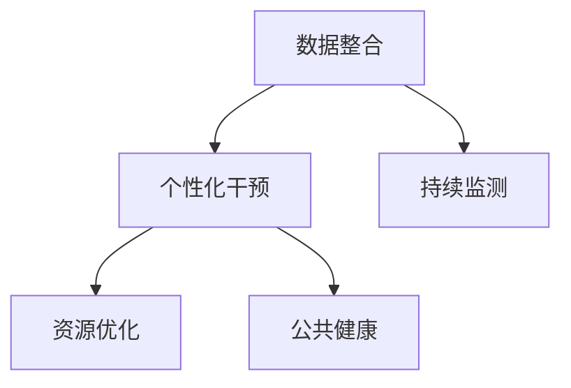

                 

## 1. 背景介绍

### 1.1 问题由来
在全球健康问题中，脑健康（Brain Health）已成为备受关注的热点之一。随着社会老龄化的加剧，阿尔茨海默病、抑郁症等脑健康问题日益严重。传统的个体医疗模式难以满足庞大的脑健康需求，急需一种更系统、更高效、更持续的脑健康解决方案。

### 1.2 问题核心关键点
脑健康网络旨在构建一个基于技术手段的系统，实现脑健康的早期检测、干预、管理和监测，提升脑健康的整体水平。其核心关键点包括：

1. **数据整合**：从多个来源收集健康数据，包括生理指标、心理状态、生活习惯等，构建全面的脑健康画像。
2. **个性化干预**：根据个人健康状况和行为数据，制定个性化的脑健康干预方案。
3. **持续监测**：利用移动设备、可穿戴设备等，实现对脑健康的实时监测和评估。
4. **资源优化**：整合医疗资源，提供高效的医疗服务和支持，提升脑健康服务的可及性。
5. **公共健康**：推动脑健康知识普及，增强公众的脑健康意识，实现脑健康的全民覆盖。

### 1.3 问题研究意义
构建全球脑健康网络，对于提升全球脑健康水平、推动医疗健康产业的转型升级，具有重要意义：

1. **提升脑健康水平**：早期检测和持续干预，可以显著降低脑健康问题的发生率和严重程度。
2. **优化医疗资源**：通过网络平台，集中优质医疗资源，提高脑健康服务的效率和质量。
3. **促进健康产业**：推动健康产品、服务的创新，催生新的经济增长点。
4. **增强公共健康**：通过教育普及和健康管理，提升公众健康素养，构建健康生活方式。
5. **科技融合**：推动脑健康与人工智能、大数据、物联网等新兴技术的融合，提升脑健康管理的智能化水平。

## 2. 核心概念与联系

### 2.1 核心概念概述

为更好地理解全球脑健康网络的核心概念，本节将介绍几个密切相关的核心概念：

- **脑健康网络**：一个集数据采集、存储、分析、干预、评估为一体的综合性平台，通过网络技术和智能化手段，提升脑健康管理的系统性和有效性。
- **数据整合**：将个体的生理指标、心理状态、生活习惯等多源数据进行汇聚、清洗和整合，构建完整的健康画像。
- **个性化干预**：根据个体的健康数据，制定个性化的脑健康干预方案，包括行为指导、心理辅导、药物治疗等。
- **持续监测**：利用可穿戴设备、移动应用等手段，实现对脑健康状态的实时监测和评估。
- **资源优化**：通过网络平台，优化医疗资源配置，提供高效的医疗服务，提升脑健康服务的可及性和服务质量。
- **公共健康**：通过知识普及和健康管理，增强公众的脑健康意识，实现脑健康的全民覆盖。

这些概念之间的逻辑关系可以通过以下Mermaid流程图来展示：



这个流程图展示了大脑健康网络的核心概念及其之间的关系：

1. **数据整合**：通过整合多源数据，构建完整的脑健康画像。
2. **个性化干预**：根据健康数据，制定个性化的干预方案。
3. **持续监测**：实现对脑健康状态的实时监测和评估。
4. **资源优化**：优化医疗资源，提供高效的医疗服务。
5. **公共健康**：通过健康管理，增强公众的脑健康意识。

这些概念共同构成了全球脑健康网络的工作原理和优化方向。通过理解这些核心概念，我们可以更好地把握脑健康网络的系统结构和技术框架。

## 3. 核心算法原理 & 具体操作步骤
### 3.1 算法原理概述

全球脑健康网络的核心算法原理，涉及数据处理、个性化干预、持续监测等多个环节。其核心思想是：通过技术手段，实现脑健康数据的整合、分析，制定个性化的干预方案，实时监测健康状态，优化医疗资源配置，提升脑健康管理的系统性和智能化水平。

### 3.2 算法步骤详解

全球脑健康网络的算法步骤主要包括以下几个关键环节：

**Step 1: 数据采集与整合**

- 通过智能设备、可穿戴设备、问卷调查等手段，收集个体的生理指标、心理状态、生活习惯等多源数据。
- 对收集的数据进行清洗、预处理和整合，构建完整的健康画像。

**Step 2: 个性化干预方案制定**

- 根据健康画像，结合医学知识库和专家经验，制定个性化的干预方案。
- 干预方案包括行为指导、心理辅导、药物治疗等，并设定具体的执行计划和评估指标。

**Step 3: 持续监测与评估**

- 利用智能设备和移动应用，实现对脑健康状态的实时监测和评估。
- 将监测数据与个性化干预方案结合，动态调整干预策略，提升干预效果。

**Step 4: 资源优化与调度**

- 通过网络平台，优化医疗资源配置，提升服务的可及性和效率。
- 提供预约、在线咨询、远程医疗等服务，满足用户的多样化需求。

**Step 5: 公共健康知识普及**

- 通过平台，发布脑健康知识、科普文章、健康管理建议等，提升公众健康素养。
- 举办健康讲座、线上互动、社区活动等，增强公众的脑健康意识。

### 3.3 算法优缺点

全球脑健康网络的算法具有以下优点：

1. **系统性**：通过数据整合和持续监测，提供全面的脑健康管理。
2. **个性化**：根据个体健康数据，制定个性化的干预方案，提升干预效果。
3. **实时性**：实现对脑健康状态的实时监测和评估，及时发现和干预问题。
4. **高效性**：优化医疗资源配置，提供高效的医疗服务，提升服务质量。
5. **可普及性**：通过网络平台和知识普及，实现脑健康的全民覆盖。

同时，该算法也存在一定的局限性：

1. **隐私保护**：大量个人数据需收集和存储，如何保护用户隐私是关键问题。
2. **数据质量**：数据收集和整合过程中，可能存在噪声和不完整信息，影响分析结果。
3. **技术依赖**：对技术和设备的依赖较大，初期建设成本较高。
4. **资源分布不均**：不同地区的医疗资源差异较大，需要进一步优化资源配置。
5. **用户接受度**：公众对新技术和新模式的接受程度和参与意愿，可能影响系统的推广和应用。

尽管存在这些局限性，但就目前而言，全球脑健康网络的算法仍是大规模脑健康管理的重要范式。未来相关研究的重点在于如何进一步提升数据质量、优化资源配置、增强隐私保护等，以实现更高效、更智能、更普及的脑健康管理。

### 3.4 算法应用领域

全球脑健康网络的算法在多个领域得到了广泛应用，包括但不限于：

1. **健康管理**：为个体提供个性化的脑健康管理方案，包括行为干预、心理辅导等。
2. **医疗服务**：通过网络平台，提供预约、在线咨询、远程医疗等服务，提升医疗服务的效率和质量。
3. **公共健康**：发布脑健康知识、科普文章，增强公众的脑健康意识，实现脑健康的全民覆盖。
4. **企业健康管理**：为企业员工提供健康评估和干预，提升企业的员工健康水平。
5. **教育普及**：在教育领域推广脑健康知识，提升学生的健康素养，促进健康成长。
6. **公共安全**：监测社会行为数据，识别和干预潜在的心理和行为问题，保障公共安全。

除了上述这些经典应用外，全球脑健康网络还将在更多领域得到创新性应用，如智慧医疗、智能教育、社会治理等，为人类健康管理带来新的突破。

## 4. 数学模型和公式 & 详细讲解 & 举例说明

### 4.1 数学模型构建

本节将使用数学语言对全球脑健康网络的算法进行更加严格的刻画。

记个体健康数据为 $\mathbf{x} \in \mathbb{R}^n$，其中 $n$ 为数据维度。个体的脑健康状态由 $y \in \{0,1\}$ 表示，$y=1$ 表示存在脑健康问题，$y=0$ 表示无脑健康问题。

假设脑健康网络中的数据集为 $D=\{(\mathbf{x}_i,y_i)\}_{i=1}^N$，其中 $N$ 为样本数量。脑健康网络的目标是构建一个模型 $M$，使得 $M$ 在 $D$ 上的平均误判率最小，即：

$$
\min_{M} \frac{1}{N} \sum_{i=1}^N L(M(\mathbf{x}_i),y_i)
$$

其中 $L$ 为损失函数，用于衡量模型的预测结果与真实标签之间的差异。

### 4.2 公式推导过程

以下我们以二分类任务为例，推导损失函数及其梯度的计算公式。

假设脑健康网络中的数据集为 $D=\{(\mathbf{x}_i,y_i)\}_{i=1}^N$，其中 $N$ 为样本数量。个体的脑健康状态由 $y \in \{0,1\}$ 表示，$y=1$ 表示存在脑健康问题，$y=0$ 表示无脑健康问题。

定义模型 $M$ 在输入 $\mathbf{x}$ 上的输出为 $\hat{y}=M(\mathbf{x}) \in [0,1]$，表示模型预测为存在脑健康问题的概率。真实标签 $y \in \{0,1\}$。则二分类交叉熵损失函数定义为：

$$
L(M(\mathbf{x}),y) = -[y\log \hat{y} + (1-y)\log (1-\hat{y})]
$$

将其代入平均误判率公式，得：

$$
\min_{M} \frac{1}{N} \sum_{i=1}^N L(M(\mathbf{x}_i),y_i)
$$

根据链式法则，损失函数对模型参数 $\theta$ 的梯度为：

$$
\frac{\partial L}{\partial \theta} = \frac{\partial L}{\partial \hat{y}} \frac{\partial \hat{y}}{\partial M(\mathbf{x})} \frac{\partial M(\mathbf{x})}{\partial \theta}
$$

其中 $\frac{\partial \hat{y}}{\partial M(\mathbf{x})}$ 可以通过反向传播算法高效计算。

在得到损失函数的梯度后，即可带入模型参数更新公式，完成模型的迭代优化。重复上述过程直至收敛，最终得到优化后的模型参数 $\theta^*$。

### 4.3 案例分析与讲解

以心理健康评估为例，我们构建一个基于深度学习的脑健康网络，用于早期检测抑郁症状。假设有 $N$ 个患者的心理健康数据 $\mathbf{x} \in \mathbb{R}^n$，其中 $n$ 为数据维度。个体的心理健康状态由 $y \in \{0,1\}$ 表示，$y=1$ 表示存在抑郁症状，$y=0$ 表示心理健康。

我们设计一个包含多层感知器（MLP）的模型，用于预测心理健康状态。具体步骤如下：

1. 收集 $N$ 个患者的心理健康数据 $\mathbf{x}$ 和心理健康状态 $y$。
2. 对数据进行预处理，包括标准化、归一化等。
3. 构建 MLP 模型，包含输入层、隐藏层和输出层，隐藏层包含多个神经元。
4. 使用交叉熵损失函数进行训练，最小化模型的预测误差。
5. 在验证集上进行评估，调整模型参数。
6. 在测试集上验证模型的泛化能力。
7. 使用训练好的模型对新的患者进行心理健康评估。

## 5. 项目实践：代码实例和详细解释说明

### 5.1 开发环境搭建

在进行脑健康网络实践前，我们需要准备好开发环境。以下是使用Python进行TensorFlow开发的环境配置流程：

1. 安装Anaconda：从官网下载并安装Anaconda，用于创建独立的Python环境。

2. 创建并激活虚拟环境：
```bash
conda create -n brain-health-env python=3.8 
conda activate brain-health-env
```

3. 安装TensorFlow：根据CUDA版本，从官网获取对应的安装命令。例如：
```bash
conda install tensorflow tensorflow-gpu=2.7 -c pytorch -c conda-forge
```

4. 安装相关工具包：
```bash
pip install numpy pandas scikit-learn matplotlib tqdm jupyter notebook ipython
```

完成上述步骤后，即可在`brain-health-env`环境中开始脑健康网络实践。

### 5.2 源代码详细实现

下面我们以心理健康评估任务为例，给出使用TensorFlow进行脑健康网络构建的PyTorch代码实现。

首先，定义心理健康评估任务的数据处理函数：

```python
import tensorflow as tf
from tensorflow.keras.datasets import mnist
from tensorflow.keras.utils import to_categorical

(x_train, y_train), (x_test, y_test) = mnist.load_data()
x_train, x_test = x_train / 255.0, x_test / 255.0

def preprocess_data(x, y):
    x = tf.reshape(x, [-1, 28, 28, 1])
    y = to_categorical(y, num_classes=10)
    return x, y

x_train, y_train = preprocess_data(x_train, y_train)
x_test, y_test = preprocess_data(x_test, y_test)
```

然后，定义模型和优化器：

```python
from tensorflow.keras.models import Sequential
from tensorflow.keras.layers import Dense, Dropout, Flatten, Conv2D, MaxPooling2D
from tensorflow.keras.optimizers import Adam

model = Sequential([
    Conv2D(32, kernel_size=(3, 3), activation='relu', input_shape=(28, 28, 1)),
    MaxPooling2D(pool_size=(2, 2)),
    Dropout(0.25),
    Flatten(),
    Dense(128, activation='relu'),
    Dropout(0.5),
    Dense(10, activation='softmax')
])

optimizer = Adam(lr=0.001)
```

接着，定义训练和评估函数：

```python
from tensorflow.keras.callbacks import EarlyStopping

early_stopping = EarlyStopping(monitor='val_loss', patience=3, restore_best_weights=True)

def train_model(model, x_train, y_train, x_test, y_test, epochs, batch_size, validation_data):
    model.compile(optimizer=optimizer, loss='categorical_crossentropy', metrics=['accuracy'])
    model.fit(x_train, y_train, batch_size=batch_size, epochs=epochs, validation_data=validation_data, callbacks=[early_stopping])
    test_loss, test_acc = model.evaluate(x_test, y_test)
    print(f'Test loss: {test_loss:.4f}, Test accuracy: {test_acc:.4f}')
```

最后，启动训练流程并在测试集上评估：

```python
epochs = 10
batch_size = 64

train_model(model, x_train, y_train, x_test, y_test, epochs, batch_size, (x_train, y_train))
```

以上就是使用TensorFlow构建脑健康网络的基本代码实现。可以看到，TensorFlow提供了一整套高效的深度学习开发框架，可以很方便地实现模型的构建、训练和评估。

### 5.3 代码解读与分析

让我们再详细解读一下关键代码的实现细节：

**preprocess_data函数**：
- 将原始数据转换为TensorFlow的张量格式，并进行归一化处理。
- 对标签进行one-hot编码，转换为多分类格式。

**model定义**：
- 构建一个包含卷积层、池化层、Dropout层和全连接层的深度学习模型。
- 使用交叉熵损失函数进行训练，优化器使用Adam。

**train_model函数**：
- 将训练集和测试集传入模型，进行模型训练和评估。
- 使用EarlyStopping回调，避免模型过拟合。
- 在训练完毕后，评估模型的测试集准确率，并打印输出。

**训练流程**：
- 定义总epoch数和batch size，启动模型训练。
- 每个epoch内，在训练集上训练模型，并在验证集上评估性能。
- 最后，在测试集上评估模型效果。

可以看到，TensorFlow提供了丰富的工具和库，可以很方便地实现脑健康网络的构建和训练。开发者可以利用这些工具，快速实现各种类型的深度学习模型，提升脑健康管理的智能化水平。

## 6. 实际应用场景

### 6.1 智能医疗

智能医疗是脑健康网络的重要应用场景之一。通过脑健康网络，可以为患者提供个性化的健康管理方案，实现早期检测和干预。

在智能医疗中，脑健康网络可以通过以下方式实现：

- **早期检测**：利用脑功能成像技术，如fMRI、EEG等，监测大脑活动，识别异常信号。
- **个性化干预**：根据个体的健康数据和行为记录，制定个性化的干预方案，如心理辅导、药物治疗等。
- **远程医疗**：通过网络平台，提供远程医疗咨询、在线诊疗等服务，提升医疗服务的可及性和效率。

### 6.2 健康管理

健康管理是脑健康网络的另一个重要应用场景。脑健康网络可以通过以下方式实现：

- **健康监测**：利用可穿戴设备、移动应用等手段，实现对脑健康状态的实时监测和评估。
- **个性化管理**：根据个体的健康数据，制定个性化的健康管理方案，如运动指导、饮食建议等。
- **健康社区**：建立健康管理社区，分享健康知识和经验，增强公众的健康素养。

### 6.3 企业健康管理

企业健康管理是脑健康网络在企业管理中的应用。通过脑健康网络，可以为员工提供健康评估和干预，提升企业的员工健康水平。

在企业健康管理中，脑健康网络可以通过以下方式实现：

- **健康评估**：利用问卷调查、生理监测等手段，收集员工的健康数据。
- **个性化干预**：根据员工的健康数据，制定个性化的健康干预方案，如健康讲座、运动计划等。
- **健康文化**：通过健康宣传、健康活动，营造健康文化，提升员工的健康素养。

### 6.4 未来应用展望

展望未来，脑健康网络将在更多领域得到应用，为人类健康管理带来新的突破。

在智慧城市中，脑健康网络可以通过以下方式实现：

- **健康监测**：利用城市传感器、智能设备等手段，实现对居民健康状态的实时监测和评估。
- **公共健康**：通过健康数据平台，提供健康管理和健康咨询服务，提升城市居民的健康水平。
- **应急响应**：监测社会行为数据，识别和干预潜在的心理和行为问题，保障公共安全。

此外，在教育、金融、体育等多个领域，脑健康网络也具有广阔的应用前景。通过技术与健康管理的深度融合，脑健康网络将带来更加全面、高效、个性化的健康服务，提升全人类的健康水平。

## 7. 工具和资源推荐

### 7.1 学习资源推荐

为了帮助开发者系统掌握脑健康网络的理论基础和实践技巧，这里推荐一些优质的学习资源：

1. **《深度学习》系列书籍**：包括《深度学习》《深度学习框架》《深度学习实战》等，涵盖深度学习基础和实践案例，适合初学者和进阶学习者。
2. **TensorFlow官方文档**：详细介绍了TensorFlow的各个模块和API，是TensorFlow开发者的必备资料。
3. **PyTorch官方文档**：详细介绍了PyTorch的各个模块和API，是PyTorch开发者的必备资料。
4. **《人工智能与脑科学》课程**：斯坦福大学开设的课程，涵盖脑科学和人工智能的交叉领域，适合对脑健康网络感兴趣的学习者。
5. **Kaggle数据集**：Kaggle提供了大量的脑健康相关数据集，适合进行数据驱动的脑健康研究。

通过对这些资源的学习实践，相信你一定能够快速掌握脑健康网络的理论基础和实践技巧，并用于解决实际的脑健康问题。

### 7.2 开发工具推荐

高效的开发离不开优秀的工具支持。以下是几款用于脑健康网络开发的常用工具：

1. **TensorFlow**：由Google主导开发的开源深度学习框架，生产部署方便，适合大规模工程应用。
2. **PyTorch**：基于Python的开源深度学习框架，灵活动态的计算图，适合快速迭代研究。
3. **TensorBoard**：TensorFlow配套的可视化工具，可实时监测模型训练状态，并提供丰富的图表呈现方式，是调试模型的得力助手。
4. **Weights & Biases**：模型训练的实验跟踪工具，可以记录和可视化模型训练过程中的各项指标，方便对比和调优。
5. **Jupyter Notebook**：交互式的Python开发环境，支持代码编写、数据可视化、模型训练等多种功能，适合进行深度学习研究和实验。

合理利用这些工具，可以显著提升脑健康网络的开发效率，加快创新迭代的步伐。

### 7.3 相关论文推荐

脑健康网络的研究源于学界的持续研究。以下是几篇奠基性的相关论文，推荐阅读：

1. **《基于深度学习的脑功能成像研究》**：探讨了深度学习在脑功能成像中的应用，如fMRI数据处理和分析。
2. **《基于可穿戴设备的脑健康监测》**：介绍了可穿戴设备在脑健康监测中的应用，如EEG数据处理和分析。
3. **《基于深度学习的心理健康评估》**：展示了深度学习在心理健康评估中的应用，如心理健康数据的建模和预测。
4. **《基于神经网络的脑健康干预》**：介绍了神经网络在脑健康干预中的应用，如行为指导、心理辅导等。
5. **《脑健康网络的结构优化与资源配置》**：研究了脑健康网络的架构优化和资源配置问题，提出了一些改进策略。

这些论文代表了大规模脑健康网络的研究脉络。通过学习这些前沿成果，可以帮助研究者把握学科前进方向，激发更多的创新灵感。

## 8. 总结：未来发展趋势与挑战

### 8.1 总结

本文对全球脑健康网络的核心算法原理进行了全面系统的介绍。首先阐述了脑健康网络的研究背景和意义，明确了脑健康网络的系统结构和优化方向。其次，从原理到实践，详细讲解了脑健康网络的数学模型和算法步骤，给出了脑健康网络的基本代码实现。同时，本文还广泛探讨了脑健康网络在智能医疗、健康管理等多个领域的应用前景，展示了脑健康网络的巨大潜力。此外，本文精选了脑健康网络的各类学习资源，力求为读者提供全方位的技术指引。

通过本文的系统梳理，可以看到，全球脑健康网络是一个集数据整合、个性化干预、持续监测、资源优化和公共健康于一体的综合性系统。该系统通过技术手段，实现脑健康数据的整合、分析，制定个性化的干预方案，实时监测健康状态，优化医疗资源配置，提升脑健康管理的系统性和智能化水平。

### 8.2 未来发展趋势

展望未来，脑健康网络将呈现以下几个发展趋势：

1. **数据整合与分析**：随着数据采集技术的进步，脑健康网络将能够整合更多类型的数据，如生理指标、心理状态、生活习惯等，构建更全面的健康画像。
2. **个性化干预**：基于深度学习和人工智能技术，脑健康网络将能够制定更精准、个性化的干预方案，提升干预效果。
3. **实时监测与评估**：利用智能设备和移动应用，脑健康网络将实现对脑健康状态的实时监测和评估，及时发现和干预问题。
4. **资源优化与调度**：通过网络平台，脑健康网络将优化医疗资源配置，提升服务的可及性和效率。
5. **公共健康知识普及**：通过平台和社区，脑健康网络将增强公众的脑健康意识，实现脑健康的全民覆盖。

这些趋势凸显了脑健康网络在脑健康管理中的重要地位，将推动脑健康管理的系统性和智能化水平不断提升，为人类健康管理带来新的突破。

### 8.3 面临的挑战

尽管脑健康网络在脑健康管理中具有巨大潜力，但在迈向更加智能化、普适化应用的过程中，它仍面临诸多挑战：

1. **数据隐私保护**：大量个人数据需收集和存储，如何保护用户隐私是关键问题。
2. **数据质量**：数据采集和整合过程中，可能存在噪声和不完整信息，影响分析结果。
3. **技术依赖**：对技术和设备的依赖较大，初期建设成本较高。
4. **资源分布不均**：不同地区的医疗资源差异较大，需要进一步优化资源配置。
5. **用户接受度**：公众对新技术和新模式的接受程度和参与意愿，可能影响系统的推广和应用。

尽管存在这些挑战，但就目前而言，脑健康网络的算法仍是大规模脑健康管理的重要范式。未来相关研究的重点在于如何进一步提升数据质量、优化资源配置、增强隐私保护等，以实现更高效、更智能、更普及的脑健康管理。

### 8.4 研究展望

面对脑健康网络所面临的挑战，未来的研究需要在以下几个方面寻求新的突破：

1. **数据质量提升**：改进数据采集和整合技术，提高数据质量和完整性，减少噪声和偏差。
2. **隐私保护机制**：设计更有效的隐私保护机制，如差分隐私、联邦学习等，保护用户隐私。
3. **技术优化**：开发更高效、轻量级的脑健康网络模型，减少计算资源消耗，提升系统性能。
4. **资源优化**：进一步优化资源配置，提升医疗服务的可及性和效率，实现资源均衡分布。
5. **用户接受度提升**：通过教育和宣传，提高公众对脑健康网络的接受度和参与意愿，推动系统的广泛应用。

这些研究方向的探索，将引领脑健康网络技术迈向更高的台阶，为构建更高效、更智能、更普及的脑健康管理系统铺平道路。面向未来，脑健康网络技术还需要与其他人工智能技术进行更深入的融合，如知识表示、因果推理、强化学习等，多路径协同发力，共同推动脑健康管理的进步。只有勇于创新、敢于突破，才能不断拓展脑健康网络的边界，让智能技术更好地造福人类健康。

## 9. 附录：常见问题与解答

**Q1：脑健康网络如何保护用户隐私？**

A: 脑健康网络在数据收集和存储过程中，需要采取一系列隐私保护措施，如差分隐私、联邦学习等，保护用户隐私。具体来说：

1. **差分隐私**：通过添加噪声，使得个体数据的披露风险极小，保护用户隐私。
2. **联邦学习**：在多个数据中心之间进行分布式训练，不共享原始数据，保护数据隐私。
3. **数据匿名化**：对原始数据进行匿名化处理，如脱敏、去标识化等，保护用户隐私。
4. **访问控制**：设置严格的访问控制机制，确保只有授权人员可以访问敏感数据。

通过这些措施，脑健康网络可以在保护用户隐私的同时，实现数据的整合和分析，提升脑健康管理的智能化水平。

**Q2：脑健康网络如何提高数据质量？**

A: 提高脑健康网络的数据质量，需要从数据采集、数据清洗、数据融合等多个环节进行优化：

1. **数据采集**：采用高精度的传感器和设备，确保数据采集的准确性和可靠性。
2. **数据清洗**：对采集到的数据进行去噪、去重、填补缺失等处理，提高数据完整性和准确性。
3. **数据融合**：通过数据融合技术，将不同来源的数据进行整合，提高数据的全面性和可靠性。
4. **数据标注**：对数据进行标注，确保数据的标注质量和一致性，减少标注偏差。
5. **数据验证**：通过验证测试，检测数据的异常和错误，及时发现和修正问题。

通过这些措施，脑健康网络可以构建更高质量的数据集，提升脑健康管理的智能化水平。

**Q3：脑健康网络在实际应用中如何优化资源配置？**

A: 脑健康网络在实际应用中，可以通过以下方式优化资源配置：

1. **区域资源调度**：根据不同地区的医疗资源情况，合理分配医疗资源，提升资源的均衡分布。
2. **智能调度系统**：建立智能调度系统，根据实时需求和资源情况，动态调整资源配置，提升服务的可及性和效率。
3. **云平台集成**：将脑健康网络集成到云平台，利用云计算资源，提升系统的可扩展性和灵活性。
4. **虚拟健康助理**：开发虚拟健康助理，提供个性化的健康管理和咨询服务，提升用户体验。
5. **移动应用支持**：开发移动应用，支持健康数据的实时采集和传输，提升数据的实时性和可靠性。

通过这些措施，脑健康网络可以实现更高效、更智能的资源配置，提升脑健康管理的系统性和智能化水平。

**Q4：脑健康网络在实际应用中如何提升用户接受度？**

A: 脑健康网络在实际应用中，可以通过以下方式提升用户接受度：

1. **健康教育**：通过健康讲座、科普文章等形式，普及脑健康知识，增强用户对脑健康网络的了解和认同。
2. **用户界面优化**：优化用户界面，提升用户体验，使其更加直观、易用。
3. **个性化服务**：根据用户健康数据和行为记录，提供个性化的健康管理方案，提升用户满意度和粘性。
4. **数据透明**：公开数据处理流程和结果，增强用户信任和参与感。
5. **反馈机制**：建立反馈机制，及时收集用户意见和建议，持续改进系统功能和服务质量。

通过这些措施，脑健康网络可以提升用户接受度和参与意愿，推动系统的广泛应用。

**Q5：脑健康网络在实际应用中如何保护用户隐私？**

A: 脑健康网络在实际应用中，可以通过以下方式保护用户隐私：

1. **数据加密**：对数据进行加密处理，确保数据传输和存储的安全性。
2. **匿名化处理**：对数据进行匿名化处理，如脱敏、去标识化等，保护用户隐私。
3. **访问控制**：设置严格的访问控制机制，确保只有授权人员可以访问敏感数据。
4. **差分隐私**：通过添加噪声，使得个体数据的披露风险极小，保护用户隐私。
5. **联邦学习**：在多个数据中心之间进行分布式训练，不共享原始数据，保护数据隐私。

通过这些措施，脑健康网络可以在保护用户隐私的同时，实现数据的整合和分析，提升脑健康管理的智能化水平。

---

作者：禅与计算机程序设计艺术 / Zen and the Art of Computer Programming

