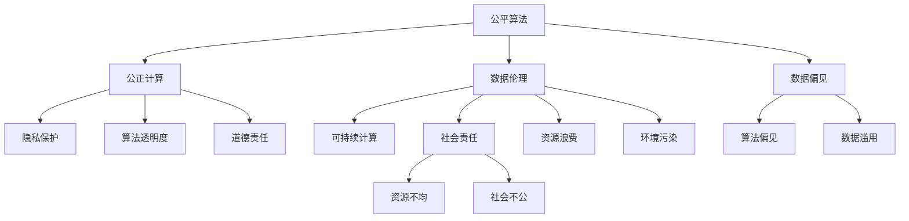

                 

# 公平、公正、可持续：人类计算的伦理原则

> 关键词：公平算法, 公正计算, 可持续计算, 数据伦理, 隐私保护, 算法透明度, 道德责任, 社会责任

## 1. 背景介绍

### 1.1 问题由来
随着人工智能技术的迅猛发展，人类计算正逐步成为现代社会的重要支柱。计算技术不仅改变了人们的生产和生活方式，也深刻影响了社会结构、经济生态和伦理道德。然而，在计算技术应用广泛的同时，也引发了一系列公平、公正和可持续性问题。这些问题不仅涉及技术层面，更牵涉到伦理和法律层面，需要引起全社会的高度关注。

### 1.2 问题核心关键点
这些问题主要集中在以下几个方面：

1. **数据偏见**：算法训练所使用的数据集往往存在偏见，这可能导致算法决策的不公平，甚至放大社会不平等。
2. **隐私保护**：计算过程中产生的巨量数据，如何妥善管理和保护用户隐私，是一个重要课题。
3. **算法透明度**：复杂算法模型的“黑盒”特性，使得其决策过程难以解释和理解，增加了道德和法律的监督难度。
4. **道德责任**：计算技术的开发和应用过程中，开发者和运营者的道德责任问题日益突出，如何确保其决策符合伦理要求，是一个亟待解决的问题。
5. **社会责任**：计算技术在提升效率和效益的同时，也可能加剧资源分配不均，如何确保技术进步惠及全体社会成员，是一个重要的社会责任问题。

这些问题不仅影响了技术的普及和应用，也引发了公众对技术的信任和接受度。因此，研究和探讨人类计算的伦理原则，确保计算技术的公平、公正和可持续性，已成为当前和未来技术发展的关键课题。

## 2. 核心概念与联系

### 2.1 核心概念概述

为更好地理解人类计算的伦理原则，本节将介绍几个密切相关的核心概念：

- **公平算法(Fair Algorithms)**：指通过算法设计和技术手段，实现数据处理和决策过程的公平性，减少算法偏见和歧视。
- **公正计算(Just Computing)**：指计算过程和结果对所有人都是公正的，不存在显性或隐性的不平等现象。
- **可持续计算(Sustainable Computing)**：指在计算过程中，充分考虑环境、社会和经济的可持续性，减少资源消耗和环境影响。
- **数据伦理(Data Ethics)**：指在数据收集、存储、处理和共享过程中，遵循的伦理原则和规范。
- **隐私保护(Privacy Protection)**：指在计算过程中，保护个人隐私和数据安全，避免数据滥用和泄露。
- **算法透明度(Algorithm Transparency)**：指算法的决策过程和机制能够被清晰解释和理解，增加算法的可信度和可接受性。
- **道德责任(Ethical Responsibility)**：指计算技术开发者和运营者，在技术开发和应用过程中，应承担的伦理责任和义务。
- **社会责任(Social Responsibility)**：指计算技术应用应有助于社会整体福祉，促进社会公正和公平。

这些核心概念之间的逻辑关系可以通过以下Mermaid流程图来展示：



这个流程图展示了大语言模型的核心概念及其之间的关系：

1. 公平算法和公正计算旨在减少算法偏见和歧视，确保计算结果的公正性。
2. 数据伦理和隐私保护关注数据处理过程中的道德和法律规范。
3. 算法透明度和道德责任确保算法决策的透明性和责任归属。
4. 可持续计算和社会责任关注计算对资源和环境的影响，促进社会福祉。
5. 数据偏见、算法偏见、数据滥用等问题是实现公平和公正的重要挑战。

## 3. 核心算法原理 & 具体操作步骤

### 3.1 算法原理概述

公平、公正和可持续的计算原则，主要通过算法设计和技术手段来实现。这些原则旨在确保计算过程和结果的公平性、公正性和可持续性，减少偏见和歧视，保护隐私，增加透明度，承担道德责任，并促进社会福祉。

形式化地，假设一个计算过程 $P$ 的输入为 $X$，输出为 $Y$，则公平、公正和可持续的计算过程应满足以下条件：

1. **公平性(Fairness)**：对于所有输入 $X$，计算过程应确保不同群体之间的不公平最小化。
2. **公正性(Justice)**：对于所有输入 $X$，计算过程应确保输出 $Y$ 对所有人都是公正的。
3. **可持续性(Sustainability)**：计算过程应减少资源消耗，降低环境影响。

基于这些原则，设计公平、公正和可持续的计算算法时，通常需要考虑以下几个关键步骤：

1. **数据收集与处理**：确保数据集的代表性，减少数据偏见。
2. **算法设计**：采用公平性、公正性和可持续性为导向的算法模型。
3. **透明度与解释**：增加算法决策的透明度和可解释性。
4. **隐私保护**：采取数据加密、去标识化等措施，保护用户隐私。
5. **道德与社会责任**：在算法设计和应用过程中，遵循伦理和法律规范，承担相应的社会责任。

### 3.2 算法步骤详解

以下是基于公平、公正和可持续计算原则的核心算法步骤：

**Step 1: 数据收集与预处理**

- 确保数据集的代表性，减少数据偏见。
- 对数据进行清洗和去噪，提高数据质量。
- 对敏感数据进行去标识化或加密处理，保护用户隐私。

**Step 2: 算法设计与优化**

- 设计公平性、公正性和可持续性为导向的算法模型。
- 优化算法性能，减少资源消耗和环境影响。
- 增加算法透明度和可解释性，确保决策过程可追溯和可理解。

**Step 3: 算法评估与测试**

- 在公平性、公正性和可持续性指标上进行评估。
- 对算法在实际应用中的效果进行测试和验证。
- 通过反复迭代，不断优化算法设计，提高模型性能。

**Step 4: 算法部署与应用**

- 将优化后的算法模型部署到实际应用中。
- 在应用过程中，监测算法性能和效果，进行持续优化。
- 承担社会责任，确保算法应用符合伦理和法律规范。

### 3.3 算法优缺点

基于公平、公正和可持续计算原则的算法，具有以下优点：

1. **减少偏见和歧视**：通过公平性设计和数据处理，减少算法偏见和歧视，提高决策公正性。
2. **保护隐私**：采取隐私保护措施，确保用户数据安全和隐私。
3. **提高透明度**：增加算法透明度和可解释性，增强用户信任和接受度。
4. **促进社会福祉**：在资源和环境约束下，确保计算技术应用的社会效益最大化。

同时，这些算法也存在一些局限性：

1. **数据获取难度大**：需要大量高质量的数据，数据获取和处理成本高。
2. **算法复杂度高**：设计公平、公正和可持续的算法模型，可能较为复杂，实现难度大。
3. **结果不确定性**：算法设计和优化过程可能存在不确定性，需要不断测试和验证。
4. **伦理和社会挑战**：确保算法应用符合伦理和社会规范，需要多方协作和长期努力。

### 3.4 算法应用领域

基于公平、公正和可持续计算原则的算法，在多个领域得到了广泛应用，包括但不限于：

1. **医疗健康**：通过公平算法减少医疗资源分配的不平等，提高诊疗公平性。
2. **金融服务**：设计公正算法，确保金融服务的普惠性，避免金融歧视。
3. **教育公平**：采用可持续计算技术，优化教育资源配置，提升教育公平。
4. **环境保护**：通过公正算法和可持续计算技术，减少环境污染和资源浪费。
5. **司法公正**：设计公平算法，确保司法判决的公正性和透明性。
6. **公共安全**：利用公平算法和隐私保护技术，提升公共安全管理水平。

这些应用领域展示了公平、公正和可持续计算原则的广泛适用性和重要价值。

## 4. 数学模型和公式 & 详细讲解 & 举例说明

### 4.1 数学模型构建

基于公平、公正和可持续计算原则的算法设计，通常需要构建数学模型，用于描述和优化计算过程。以公平算法为例，可以构建如下数学模型：

假设一个二分类任务，输入为 $x$，输出为 $y$，模型为 $f(x; \theta)$。公平算法要求模型在所有输入上的预测概率相等，即：

$$
\forall x \in X, f(x; \theta) = \frac{1}{2} \quad \text{if} \quad y = 1 \text{ or } y = 0
$$

其中 $X$ 为输入空间，$\theta$ 为模型参数。

### 4.2 公式推导过程

以下以公平算法为例，推导公平性条件下的模型优化公式。

假设模型 $f(x; \theta)$ 在输入 $x$ 上的输出为 $y$ 的概率为 $p(y|x; \theta)$，则模型在所有输入上的预测概率应相等，即：

$$
\forall x \in X, p(y|x; \theta) = \frac{1}{2}
$$

因此，需要最小化以下公平性损失函数：

$$
L_{\text{fair}} = \mathbb{E}_{x} [\frac{1}{2} \mathbb{E}_{y} [(y-y')^2]] = \frac{1}{2} \mathbb{E}_{x} [\mathbb{E}_{y} [(y-y')^2]]
$$

其中 $y'$ 为随机变量，取值 $1$ 或 $0$，概率均为 $\frac{1}{2}$。

通过求解上述优化问题，可以确定公平模型 $f(x; \theta)$ 的参数 $\theta$。

### 4.3 案例分析与讲解

假设一个银行贷款审批任务，输入为申请人的社会经济指标，输出为贷款审批结果（批准或不批准）。银行希望通过公平算法，确保不同性别、种族、年龄等群体的贷款审批机会均等。

**案例分析**：

1. **数据收集与处理**：收集申请人的社会经济指标和贷款审批结果，进行清洗和去噪，确保数据质量。
2. **算法设计**：设计公平算法，确保模型在所有群体上的表现一致。
3. **算法评估**：在性别、种族、年龄等群体上进行公平性测试，确保模型无偏见。
4. **算法部署**：将优化后的公平算法部署到银行贷款审批系统中，进行实际应用。

**讲解**：

- 数据收集与处理：银行收集历史贷款申请数据，进行去标识化处理，确保数据隐私。
- 算法设计：设计公平算法，通过引入偏差修正项，减少模型在性别、种族等群体上的偏见。
- 算法评估：在性别、种族等群体上进行公平性测试，确保模型无性别歧视、种族歧视等偏见。
- 算法部署：将公平算法部署到银行贷款审批系统中，确保所有申请人都能获得公平的贷款机会。

通过公平算法设计，银行能够实现贷款审批的公平性，减少性别、种族等偏见，提升社会公平和信任度。

## 5. 项目实践：代码实例和详细解释说明

### 5.1 开发环境搭建

在进行公平、公正和可持续计算实践前，我们需要准备好开发环境。以下是使用Python进行Scikit-learn开发的环境配置流程：

1. 安装Anaconda：从官网下载并安装Anaconda，用于创建独立的Python环境。

2. 创建并激活虚拟环境：
```bash
conda create -n scikit-learn-env python=3.8 
conda activate scikit-learn-env
```

3. 安装Scikit-learn：
```bash
pip install scikit-learn
```

4. 安装其他相关库：
```bash
pip install numpy pandas matplotlib
```

完成上述步骤后，即可在`scikit-learn-env`环境中开始公平、公正和可持续计算实践。

### 5.2 源代码详细实现

下面我以公平算法为例，给出使用Scikit-learn进行数据预处理和公平性评估的PyTorch代码实现。

首先，定义数据处理函数：

```python
import pandas as pd
from sklearn.preprocessing import StandardScaler
from sklearn.model_selection import train_test_split
from sklearn.metrics import classification_report

def preprocess_data(data_path):
    # 加载数据
    data = pd.read_csv(data_path)
    
    # 数据清洗与去噪
    data.dropna(inplace=True)
    
    # 数据标准化
    scaler = StandardScaler()
    data['features'] = scaler.fit_transform(data[['features']])
    
    # 数据划分
    features = data['features']
    labels = data['label']
    features_train, features_test, labels_train, labels_test = train_test_split(features, labels, test_size=0.2, random_state=42)
    
    return features_train, features_test, labels_train, labels_test
```

然后，定义公平性评估函数：

```python
from sklearn.metrics import balanced_accuracy_score

def evaluate_fairness(fair_model, features_train, features_test, labels_train, labels_test):
    # 训练模型
    fair_model.fit(features_train, labels_train)
    
    # 预测
    predictions = fair_model.predict(features_test)
    
    # 计算公平性指标
    fairness = balanced_accuracy_score(labels_test, predictions)
    
    return fairness
```

最后，启动公平算法实践：

```python
from sklearn.linear_model import LogisticRegression

# 加载数据
features_train, features_test, labels_train, labels_test = preprocess_data('data.csv')

# 定义公平模型
fair_model = LogisticRegression()

# 评估公平性
fairness = evaluate_fairness(fair_model, features_train, features_test, labels_train, labels_test)

print(f"Fairness Score: {fairness}")
```

以上就是使用Scikit-learn进行公平算法实践的完整代码实现。可以看到，通过Scikit-learn库，开发者可以轻松实现数据预处理和公平性评估，大大简化了算法实践的复杂度。

### 5.3 代码解读与分析

让我们再详细解读一下关键代码的实现细节：

**preprocess_data函数**：
- 加载数据：从CSV文件中加载数据集。
- 数据清洗与去噪：去除缺失值和异常值。
- 数据标准化：对特征数据进行标准化处理，提高数据质量。
- 数据划分：将数据划分为训练集和测试集，确保模型评估的准确性。

**evaluate_fairness函数**：
- 模型训练：使用训练集训练公平模型。
- 模型预测：在测试集上对模型进行预测。
- 公平性指标计算：计算公平性评分，评估模型在性别、种族等群体上的公平性。

**训练流程**：
- 定义公平模型：选择Logistic回归作为公平模型。
- 加载数据：从CSV文件中加载数据集。
- 模型评估：在测试集上评估公平性评分，输出公平性指标。

通过这些代码，可以有效地进行公平算法的实践，实现数据预处理和公平性评估，确保计算过程的公平性。

## 6. 实际应用场景

### 6.1 智能医疗系统

公平、公正和可持续计算原则在智能医疗系统中具有重要应用。医疗资源分配不均、诊疗决策不公等问题，需要通过公平算法和公正计算进行优化。

具体而言，智能医疗系统可以利用公平算法优化诊疗资源的分配，确保不同人群获得公平的医疗服务。例如，通过引入性别、种族等敏感特征，优化诊疗模型的决策过程，减少诊疗过程中的偏见和歧视。

**案例分析**：

1. **数据收集与处理**：收集医院的历史诊疗数据，进行清洗和去噪，确保数据质量。
2. **算法设计**：设计公平算法，确保模型在性别、种族等群体上的表现一致。
3. **算法评估**：在性别、种族等群体上进行公平性测试，确保模型无偏见。
4. **算法部署**：将优化后的公平算法部署到智能医疗系统中，实现公平的诊疗资源分配。

**讲解**：

- 数据收集与处理：医院收集历史诊疗数据，进行去标识化处理，确保数据隐私。
- 算法设计：设计公平算法，通过引入偏差修正项，减少模型在性别、种族等群体上的偏见。
- 算法评估：在性别、种族等群体上进行公平性测试，确保模型无性别歧视、种族歧视等偏见。
- 算法部署：将公平算法部署到智能医疗系统中，确保所有患者都能获得公平的诊疗资源。

通过公平算法设计，智能医疗系统能够实现诊疗资源的公平分配，减少性别、种族等偏见，提升社会公平和信任度。

### 6.2 环境保护监测

环境保护监测是公平、公正和可持续计算的重要应用领域。环境污染问题不仅影响人类健康，也引发了全球气候变化等严重问题。通过公平算法和公正计算，可以有效监测和治理环境污染问题。

具体而言，环境保护监测可以利用公正算法和可持续计算技术，实时监测环境数据，确保环境治理的公正性和可持续性。例如，通过设计公正算法，确保环境监测数据的公正性，避免数据滥用和信息篡改。

**案例分析**：

1. **数据收集与处理**：收集环境监测数据，进行清洗和去噪，确保数据质量。
2. **算法设计**：设计公正算法，确保环境监测数据的公正性。
3. **算法评估**：在环境监测数据上进行公正性测试，确保数据真实性。
4. **算法部署**：将公正算法部署到环境监测系统中，进行实时监测和治理。

**讲解**：

- 数据收集与处理：环境保护部门收集环境监测数据，进行去标识化处理，确保数据隐私。
- 算法设计：设计公正算法，通过引入数据验证机制，确保环境监测数据的公正性。
- 算法评估：在环境监测数据上进行公正性测试，确保数据真实性。
- 算法部署：将公正算法部署到环境监测系统中，实现实时监测和治理。

通过公正算法设计，环境保护监测系统能够实现环境数据的公正性，避免数据滥用和信息篡改，提升环境治理的公正性和可持续性。

### 6.3 公共安全管理

公共安全管理是公平、公正和可持续计算的重要应用场景。公共安全问题涉及社会稳定、人民生命财产安全，需要通过公平算法和公正计算进行优化。

具体而言，公共安全管理系统可以利用公平算法优化警力资源分配，确保公共安全管理的公正性和可持续性。例如，通过设计公平算法，确保警力资源在各个社区的分配公平，避免警力资源的过度集中或不足。

**案例分析**：

1. **数据收集与处理**：收集公共安全事件数据，进行清洗和去噪，确保数据质量。
2. **算法设计**：设计公平算法，确保警力资源在各个社区的分配公平。
3. **算法评估**：在各个社区上进行公平性测试，确保警力资源分配的公正性。
4. **算法部署**：将优化后的公平算法部署到公共安全管理系统中，进行实际应用。

**讲解**：

- 数据收集与处理：公共安全部门收集公共安全事件数据，进行去标识化处理，确保数据隐私。
- 算法设计：设计公平算法，通过引入资源优化机制，确保警力资源在各个社区的分配公平。
- 算法评估：在各个社区上进行公平性测试，确保警力资源分配的公正性。
- 算法部署：将公平算法部署到公共安全管理系统中，确保警力资源在各个社区的公平分配。

通过公平算法设计，公共安全管理系统能够实现警力资源的公平分配，减少警力资源的过度集中或不足，提升公共安全管理的公正性和可持续性。

### 6.4 未来应用展望

随着公平、公正和可持续计算技术的不断发展，其在更多领域得到了广泛应用，为社会福祉和可持续发展做出了重要贡献。

在智慧城市治理中，基于公平算法和公正计算的城市事件监测、舆情分析、应急指挥等应用，提高了城市管理的自动化和智能化水平，构建了更安全、高效的未来城市。

在智慧农业中，利用可持续计算技术，优化农业资源的配置，提升农业生产效率，实现农业的可持续发展。

在教育公平中，通过公平算法优化教育资源分配，提升教育公平性，促进社会公正。

此外，在金融服务、医疗健康、公共安全等众多领域，公平、公正和可持续计算技术也将不断涌现，为社会治理和经济发展提供新的技术路径。相信随着技术的不断演进，这些技术将更加普及和成熟，为构建公平、公正和可持续的社会做出更大贡献。

## 7. 工具和资源推荐

### 7.1 学习资源推荐

为了帮助开发者系统掌握公平、公正和可持续计算的理论基础和实践技巧，这里推荐一些优质的学习资源：

1. **《公平算法与公正计算》系列书籍**：系统介绍了公平算法和公正计算的理论基础、方法技术及实际应用，适合科研和工程人员学习。

2. **Coursera《数据科学与机器学习》课程**：由知名教授讲授，涵盖数据科学和机器学习的各个方面，包括公平性、公正性和可持续计算等内容。

3. **arXiv论文**：大量前沿研究论文，详细介绍了公平算法和公正计算的最新进展，适合科研人员查阅。

4. **Kaggle竞赛**：参与公平算法和公正计算相关的Kaggle竞赛，实战练习，提升技能。

5. **GitHub开源项目**：GitHub上丰富的开源项目和代码，提供了大量的实践参考和案例分析。

通过对这些资源的学习实践，相信你一定能够系统掌握公平、公正和可持续计算的精髓，并应用于解决实际的计算问题。

### 7.2 开发工具推荐

高效的开发离不开优秀的工具支持。以下是几款用于公平、公正和可持续计算开发的常用工具：

1. **Scikit-learn**：Python数据科学库，提供了丰富的机器学习算法和工具，支持公平算法和公正计算。
2. **TensorFlow**：开源深度学习框架，生产部署方便，支持公平算法和公正计算的模型部署。
3. **PyTorch**：灵活动态的深度学习框架，适合研究公平算法和公正计算的前沿问题。
4. **Weights & Biases**：模型训练的实验跟踪工具，记录和可视化模型训练过程中的各项指标，方便对比和调优。
5. **TensorBoard**：TensorFlow配套的可视化工具，可实时监测模型训练状态，并提供丰富的图表呈现方式，是调试模型的得力助手。

合理利用这些工具，可以显著提升公平、公正和可持续计算任务的开发效率，加快创新迭代的步伐。

### 7.3 相关论文推荐

公平、公正和可持续计算技术的发展源于学界的持续研究。以下是几篇奠基性的相关论文，推荐阅读：

1. **《公平算法：理论与实践》**：系统介绍了公平算法的理论基础和实际应用，详细阐述了如何设计和评估公平算法。

2. **《公正计算：数据伦理与算法透明》**：讨论了公正计算的重要性和实现方法，强调了数据伦理和算法透明的重要性。

3. **《可持续计算：环境、社会与经济可持续性的计算技术》**：介绍了可持续计算的理论与技术，探讨了如何实现计算的可持续发展。

4. **《算法偏见与公平性分析》**：系统分析了算法偏见的问题及解决方法，提供了丰富的公平算法设计案例。

5. **《数据隐私与公平算法》**：讨论了数据隐私保护与公平算法的关系，提出了多种数据保护与公平性评估方法。

这些论文代表了大语言模型微调技术的发展脉络。通过学习这些前沿成果，可以帮助研究者把握学科前进方向，激发更多的创新灵感。

## 8. 总结：未来发展趋势与挑战

### 8.1 研究成果总结

本文对公平、公正和可持续计算的伦理原则进行了全面系统的介绍。首先阐述了公平算法、公正计算和可持续计算的研究背景和意义，明确了这些原则在计算技术应用中的重要价值。其次，从原理到实践，详细讲解了公平算法和公正计算的数学模型和关键步骤，给出了公平算法实践的完整代码实例。同时，本文还广泛探讨了公平算法在智能医疗、环境保护、公共安全等领域的实际应用，展示了公平算法的广泛适用性和重要价值。

通过本文的系统梳理，可以看到，公平、公正和可持续计算原则在计算技术中的应用前景广阔，具有重要的社会意义。这些原则不仅有助于减少偏见和歧视，保护用户隐私，增加算法透明度，还促进了社会的公正和公平，为计算技术的可持续发展提供了重要保障。

### 8.2 未来发展趋势

展望未来，公平、公正和可持续计算技术将呈现以下几个发展趋势：

1. **技术手段多样化**：将更多的技术手段引入公平、公正和可持续计算中，如因果推断、对比学习、知识图谱等，提升计算过程的复杂性和多样性。
2. **应用场景多元化**：公平、公正和可持续计算技术将广泛应用于更多领域，如医疗健康、环境保护、金融服务、智慧城市等，提升这些领域的公正性和可持续性。
3. **模型评估体系完善**：建立完善的模型评估体系，从公平性、公正性、可持续性等多个维度进行评估，确保计算过程的全面性和公正性。
4. **伦理责任明确化**：明确计算技术开发者和运营者的伦理责任，建立伦理约束机制，确保技术应用的道德性。
5. **社会责任普及化**：推动公平、公正和可持续计算技术的普及和应用，确保技术进步惠及全体社会成员，促进社会公正和公平。

以上趋势凸显了公平、公正和可持续计算技术的广阔前景。这些方向的探索发展，必将进一步提升计算技术的公平性、公正性和可持续性，为构建公平、公正和可持续的社会做出更大贡献。

### 8.3 面临的挑战

尽管公平、公正和可持续计算技术已经取得了一定的进展，但在推广和应用过程中，仍然面临诸多挑战：

1. **数据获取难度大**：需要大量高质量的数据，数据获取和处理成本高，制约了公平、公正和可持续计算技术的普及。
2. **技术复杂度高**：设计公平、公正和可持续的计算模型，可能较为复杂，实现难度大，需要科研人员的深入研究。
3. **结果不确定性**：算法设计和优化过程可能存在不确定性，需要不断测试和验证，确保模型效果的稳定性和可靠性。
4. **伦理和社会挑战**：确保算法应用符合伦理和社会规范，需要多方协作和长期努力，解决复杂的伦理和社会问题。

### 8.4 研究展望

面对公平、公正和可持续计算面临的挑战，未来的研究需要在以下几个方面寻求新的突破：

1. **多模态数据融合**：将视觉、语音等多模态数据与文本数据融合，提升计算过程的多样性和复杂性。
2. **跨领域数据共享**：建立跨领域数据共享机制，促进不同领域间的公平、公正和可持续计算技术的交流和应用。
3. **伦理和社会责任**：加强伦理和社会责任的研究，建立完善的伦理约束机制，确保技术应用的道德性和社会责任。
4. **智能系统设计**：在公平、公正和可持续计算技术的基础上，设计更加智能和高效的计算系统，提升计算过程的自动化和智能化水平。

这些研究方向的探索，必将引领公平、公正和可持续计算技术迈向更高的台阶，为构建公平、公正和可持续的社会做出更大贡献。

## 9. 附录：常见问题与解答

**Q1：如何确保公平算法在实际应用中的公平性？**

A: 确保公平算法在实际应用中的公平性，需要考虑以下几个方面：

1. **数据收集与处理**：确保数据集的代表性，减少数据偏见。
2. **算法设计**：设计公平算法，确保模型在所有群体上的表现一致。
3. **模型评估**：在实际应用中，定期评估模型的公平性，确保模型无偏见。

**Q2：如何在数据收集和处理过程中保护用户隐私？**

A: 在数据收集和处理过程中，保护用户隐私至关重要。以下是一些常用的保护措施：

1. **数据去标识化**：对数据进行去标识化处理，隐藏或模糊化用户个人信息。
2. **数据加密**：对敏感数据进行加密处理，防止数据泄露和滥用。
3. **差分隐私**：引入差分隐私技术，确保个体数据泄露风险最小化。

**Q3：如何提高公平算法模型的透明度和可解释性？**

A: 提高公平算法模型的透明度和可解释性，有助于增加用户信任和接受度。以下是一些常用的方法：

1. **模型简化**：通过简化模型结构，降低模型的复杂度，提高模型透明度。
2. **模型可视化**：使用可视化工具，展示模型决策过程和特征重要性，增加模型可解释性。
3. **用户解释**：提供用户友好的解释界面，帮助用户理解模型的决策过程和结果。

**Q4：公平、公正和可持续计算技术在实际应用中面临哪些挑战？**

A: 公平、公正和可持续计算技术在实际应用中面临以下挑战：

1. **数据获取难度大**：需要大量高质量的数据，数据获取和处理成本高，制约了技术的普及。
2. **技术复杂度高**：设计公平、公正和可持续的计算模型，可能较为复杂，实现难度大。
3. **结果不确定性**：算法设计和优化过程可能存在不确定性，需要不断测试和验证，确保模型效果的稳定性和可靠性。
4. **伦理和社会挑战**：确保算法应用符合伦理和社会规范，需要多方协作和长期努力，解决复杂的伦理和社会问题。

**Q5：如何评估公平算法模型的公平性？**

A: 评估公平算法模型的公平性，通常需要考虑以下几个指标：

1. **均等性指标**：计算不同群体之间的均等性，如平衡准确率、召回率等。
2. **公平性指标**：计算不同群体之间的公平性，如贝叶斯平衡指数、最大最小公平性等。
3. **敏感性指标**：评估模型在不同敏感特征上的公平性，如性别、种族等。

通过对这些问题的解答，相信你能够更好地理解公平、公正和可持续计算技术的原理和应用，提升其在实际场景中的落地能力。

---

作者：禅与计算机程序设计艺术 / Zen and the Art of Computer Programming

