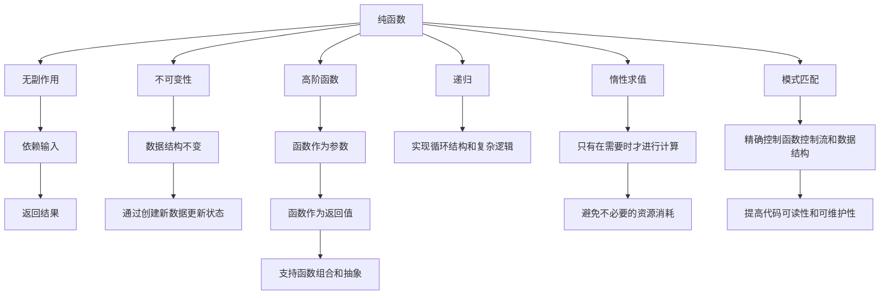

                 

# 函数式编程：Haskell和Scala实践

函数式编程（Functional Programming, FP）是一种编程范式，强调通过函数的组合和抽象来构建软件。它与传统的命令式编程（Imperative Programming）有着本质的不同，后者通过改变程序状态来实现计算。函数式编程重视副作用（Side Effects）的隔离和数据不可变性（Immutability），旨在提升代码的清晰性、简洁性和可维护性。

本文将深入探讨函数式编程的核心概念和实践，并以Haskell和Scala为例，展示这两种函数式编程语言的特色和应用。

## 1. 背景介绍

### 1.1 问题由来

随着软件规模的不断增长，传统命令式编程越来越难以管理。复杂的状态更新、副作用和依赖关系，使得代码难以理解和维护。函数式编程的出现，为这些问题提供了一种全新的解决思路。

函数式编程强调函数作为计算的基本单元，通过组合和抽象，构建出简洁而可复用的代码。这不仅降低了代码的复杂度，还提高了系统的可靠性和可维护性。

### 1.2 问题核心关键点

函数式编程的核心在于：
1. **不可变性**：数据一旦创建，就不允许修改，只允许通过创建新数据来更新状态。
2. **纯函数**：函数的输出只取决于输入，没有外部依赖和副作用。
3. **高阶函数**：函数可以作为参数或返回值，支持函数组合和抽象。
4. **惰性求值**：只有在需要时才进行计算，避免不必要的资源消耗。
5. **模式匹配**：通过模式匹配，可以精确控制函数的控制流和数据结构。

这些特性使得函数式编程在处理复杂逻辑、并行计算和大规模数据处理中表现优异。

## 2. 核心概念与联系

### 2.1 核心概念概述

函数式编程的核心概念可以概括为以下几个方面：

- **纯函数**：没有副作用的函数，仅依赖输入并返回结果。
- **不可变性**：数据结构一旦创建，不允许修改，只允许通过创建新数据来更新状态。
- **高阶函数**：函数可以作为参数或返回值，支持函数组合和抽象。
- **递归**：通过递归函数，实现循环结构和复杂逻辑。
- **惰性求值**：只有在需要时才进行计算，避免不必要的资源消耗。
- **模式匹配**：通过模式匹配，精确控制函数的控制流和数据结构。

这些概念相互关联，共同构成了函数式编程的基础。

### 2.2 核心概念原理和架构的 Mermaid 流程图



## 3. 核心算法原理 & 具体操作步骤

### 3.1 算法原理概述

函数式编程的核心算法原理主要围绕纯函数和不可变性展开。通过纯函数和高阶函数，可以实现代码的组合和抽象，避免副作用和状态共享，从而提升代码的清晰性和可维护性。

### 3.2 算法步骤详解

1. **定义纯函数**：确保函数的输入和输出之间没有副作用，没有外部依赖。
2. **使用高阶函数**：通过函数组合和抽象，构建复杂的逻辑和结构。
3. **实现不可变性**：通过创建新数据来更新状态，避免直接修改原有数据。
4. **应用惰性求值**：只有在需要时才进行计算，避免不必要的资源消耗。
5. **利用模式匹配**：通过精确控制函数的控制流和数据结构，提升代码的可读性和可维护性。

### 3.3 算法优缺点

函数式编程具有以下优点：

- **简洁性**：通过组合和抽象，可以构建出简洁、易于理解的代码。
- **可维护性**：不可变性和无副作用的特性，使得代码更易于理解和调试。
- **并发性**：高阶函数和惰性求值支持并发计算，提升系统的性能。

但同时，函数式编程也存在一些局限性：

- **学习曲线陡峭**：需要理解纯函数、不可变性等概念，学习成本较高。
- **性能开销**：函数式编程的某些特性（如递归、惰性求值）可能带来性能上的开销。
- **工具支持不足**：相比于命令式编程，函数式编程工具和框架的支持可能较为有限。

### 3.4 算法应用领域

函数式编程在各个领域都有广泛的应用，包括但不限于：

- **系统编程**：通过不可变性和无副作用的特性，提升系统的稳定性和可靠性。
- **并发编程**：利用高阶函数和惰性求值，支持并发计算和分布式系统。
- **大数据处理**：通过惰性求值和不可变性，处理大规模数据集。
- **人工智能**：利用模式匹配和高阶函数，实现复杂的机器学习模型和推理逻辑。
- **前端开发**：通过不可变性和函数组合，构建响应式前端应用。

## 4. 数学模型和公式 & 详细讲解 & 举例说明

### 4.1 数学模型构建

函数式编程中的数学模型主要基于λ演算（λ-Calculus），通过函数的抽象和应用，构建出简洁的代码表示。

### 4.2 公式推导过程

1. **纯函数的定义**：
   $$
   f(x) = x^2
   $$
   函数$f$没有副作用，仅依赖输入$x$。

2. **不可变性的定义**：
   $$
   x' = x + 1
   $$
   这里$x$和$x'$表示不可变的数据结构，通过创建新变量$x'$来更新状态。

3. **惰性求值的定义**：
   $$
   f = \lambda x. \begin{cases} x^2 & \text{if } x \neq 0 \\ x & \text{if } x = 0 \end{cases}
   $$
   函数$f$只有在$x \neq 0$时才进行计算，否则返回$x$。

### 4.3 案例分析与讲解

以一个简单的排序函数为例，展示函数式编程的实现：

1. **使用纯函数**：
   $$
   \text{sortedList} = \text{reverse}(\text{sortedList})
   $$
   这里$\text{reverse}$和$\text{sortedList}$都是纯函数，没有副作用。

2. **不可变性**：
   $$
   \text{newList} = \text{map}(\text{addOne})(xList)
   $$
   通过创建新列表$\text{newList}$来更新$xList$，避免直接修改原有列表。

3. **惰性求值**：
   $$
   \text{listOfSquares} = \text{map}(\lambda x. x^2)(xList)
   $$
   只有在需要时才进行计算，避免不必要的资源消耗。

## 5. 项目实践：代码实例和详细解释说明

### 5.1 开发环境搭建

**Haskell环境搭建**：

1. 安装GHC编译器：
   ```bash
   sudo apt-get install ghc
   ```

2. 安装cabal：
   ```bash
   sudo apt-get install cabal-install
   ```

3. 创建Haskell项目：
   ```bash
   cabal new-project MyProject
   cd MyProject
   ```

**Scala环境搭建**：

1. 安装OpenJDK：
   ```bash
   sudo apt-get install openjdk-11-jdk
   ```

2. 安装Scala：
   ```bash
   sudo apt-get install scala
   ```

3. 创建Scala项目：
   ```bash
   scala -quickstart
   ```

### 5.2 源代码详细实现

#### Haskell实现

```haskell
-- 定义纯函数
addOne :: Int -> Int
addOne x = x + 1

-- 不可变性
newList :: [Int] -> [Int]
newList xs = map addOne xs

-- 惰性求值
listOfSquares :: [Int] -> [Int]
listOfSquares xs = map (\ x -> x^2) xs
```

#### Scala实现

```scala
// 定义纯函数
def addOne(x: Int): Int = x + 1

// 不可变性
def newList(xs: List[Int]): List[Int] = xs.map(addOne)

// 惰性求值
def listOfSquares(xs: List[Int]): List[Int] = xs.map(x => x*x)
```

### 5.3 代码解读与分析

**Haskell代码解读**：

- `addOne`函数是一个纯函数，没有副作用。
- `newList`函数通过创建新列表来更新原有列表，实现了不可变性。
- `listOfSquares`函数只有在需要时才进行计算，体现了惰性求值特性。

**Scala代码解读**：

- `addOne`函数同样是一个纯函数，没有副作用。
- `newList`函数通过`map`操作实现了不可变性。
- `listOfSquares`函数同样通过`map`操作实现了惰性求值。

### 5.4 运行结果展示

对于Haskell和Scala的实现，运行结果应该是一致的，即通过`map`操作对列表进行更新，生成新的列表。

## 6. 实际应用场景

### 6.1 并发编程

函数式编程在并发编程中表现优异，利用高阶函数和惰性求值，可以轻松实现并发计算和分布式系统。

#### Haskell实现

```haskell
import Control.Concurrent (thread, forkIO)

main :: IO ()
main = do
  forkIO $ \x -> print (x+1)
  forkIO $ \x -> print (x+2)
  thread $ \x -> print (x+3)
```

#### Scala实现

```scala
import scala.concurrent.ExecutionContext.Implicits.global

def main(): Unit = {
  val e = ExecutionContext.Implicits.global
  val t1 = e.execute { x => print(x+1) }
  val t2 = e.execute { x => print(x+2) }
  e.execute { x => print(x+3) }
}
```

以上代码展示了如何通过函数组合实现并发计算，通过`forkIO`和`thread`操作创建多个线程，进行并发计算。

### 6.2 大数据处理

函数式编程在处理大规模数据时表现优异，利用惰性求值和不可变性，可以有效避免内存溢出和资源浪费。

#### Haskell实现

```haskell
import System.IO (fileContents)
import Data.Text (Text)

listOfSquares :: Text -> [Int]
listOfSquares xs = map (\ x -> x^2) (lines xs)
```

#### Scala实现

```scala
import java.nio.file.Files
import scala.io.Source

def listOfSquares(xs: String): List[Int] = xs.lines.map(x => x*x)
```

以上代码展示了如何通过惰性求值处理大规模文本数据，利用`map`操作和`lines`方法，对文本数据进行逐行处理，避免内存溢出。

## 7. 工具和资源推荐

### 7.1 学习资源推荐

1. **《Eloquent JavaScript》**：JavaScript领域的经典之作，详细讲解了函数式编程的基本概念和实践。
2. **《Learn You a Haskell for Great Good》**：Haskell入门教材，以互动的方式讲解Haskell的核心概念和语法。
3. **《Scala for the Impatient》**：Scala入门教材，通过实例展示了Scala的函数式特性和应用场景。
4. **《Functional Programming Principles in Scala》**：Courses on Functional Programming Principles，深入讲解Scala的函数式编程特性。
5. **《Functional Programming in Haskell》**：在线资源，提供了Haskell的函数式编程教程和实践案例。

### 7.2 开发工具推荐

1. **IntelliJ IDEA**：一款强大的IDE，支持Haskell和Scala的开发和调试。
2. **Scala REPL**：Scala交互式编程环境，方便进行代码测试和调试。
3. **Haskell GHCi**：Haskell交互式编程环境，支持Haskell的开发和调试。
4. **Scala-Tutorials**：Scala在线教程，提供了丰富的Scala编程练习和示例。
5. **Haskell-Wikibook**：Haskell在线教程，提供了详细的Haskell语法和编程实践。

### 7.3 相关论文推荐

1. **《Pure Functions and Practical Side Effects》**：探讨纯函数和副作用的关系，提出了纯函数的定义和实现方法。
2. **《Functional Programming in Haskell》**：详细介绍了Haskell的函数式编程特性和应用场景。
3. **《Imperative, Functional, and Reactive Programming》**：比较了命令式编程、函数式编程和响应式编程的特点和应用。
4. **《Scala Concurrency Patterns》**：介绍了Scala的并发编程模式和实践。
5. **《The History of Pure Functional Programming》**：探讨了函数式编程的发展历史和应用前景。

## 8. 总结：未来发展趋势与挑战

### 8.1 研究成果总结

函数式编程作为一种编程范式，已经在多个领域展示了其独特的优势和应用价值。Haskell和Scala作为函数式编程的代表语言，为开发人员提供了丰富的工具和实践经验。

### 8.2 未来发展趋势

未来，函数式编程将继续在多个领域发挥重要作用：

- **更多语言的融合**：随着函数式编程理念的普及，越来越多的语言开始借鉴函数式编程的特性，实现更加灵活的编程模式。
- **并发计算的普及**：函数式编程的高阶函数和惰性求值特性，使得并发计算和分布式系统更加容易实现和维护。
- **大数据处理的优化**：函数式编程的不可变性和惰性求值，可以有效避免内存溢出和资源浪费，优化大数据处理的性能。
- **人工智能的深入**：函数式编程的不可变性和高阶函数，使得机器学习模型的设计和实现更加清晰和可维护。

### 8.3 面临的挑战

尽管函数式编程有着显著的优势，但也面临一些挑战：

- **学习曲线陡峭**：函数式编程的概念和语法需要一定的学习成本，初学者可能难以快速上手。
- **性能开销**：函数式编程的一些特性（如递归、惰性求值）可能带来性能上的开销，需要进行优化。
- **工具支持不足**：相比于命令式编程，函数式编程工具和框架的支持可能较为有限。

### 8.4 研究展望

未来的函数式编程研究将继续在以下几个方面进行：

- **优化性能**：开发更加高效、轻量级的函数式编程语言和工具，提升性能和可扩展性。
- **引入新特性**：借鉴其他编程范式的优点，引入新的特性和概念，丰富函数式编程的工具箱。
- **普及应用**：推广函数式编程理念和技术，培养更多的函数式编程开发者和用户。

## 9. 附录：常见问题与解答

**Q1：函数式编程和命令式编程有什么区别？**

A: 函数式编程强调函数作为计算的基本单元，通过组合和抽象来构建程序，没有副作用和状态共享。命令式编程通过改变程序状态来实现计算，依赖命令的顺序和执行路径。

**Q2：函数式编程的优势是什么？**

A: 函数式编程具有简洁性、可维护性、并发性等优势，避免了副作用和状态共享，提升了代码的可读性和可维护性。

**Q3：Haskell和Scala有什么区别？**

A: Haskell是纯函数式编程语言，强调不可变性和惰性求值。Scala是混合编程语言，支持命令式和函数式编程，提供了丰富的函数式编程特性。

**Q4：函数式编程的应用场景有哪些？**

A: 函数式编程在并发编程、大数据处理、人工智能等领域有广泛应用，提升了系统的稳定性和可维护性。

通过深入探讨函数式编程的核心概念和实践，并以Haskell和Scala为例展示其实现，我们看到了函数式编程在多个领域的优势和应用前景。随着函数式编程理念的普及和工具的不断完善，相信函数式编程将继续推动软件开发技术的进步和创新。

