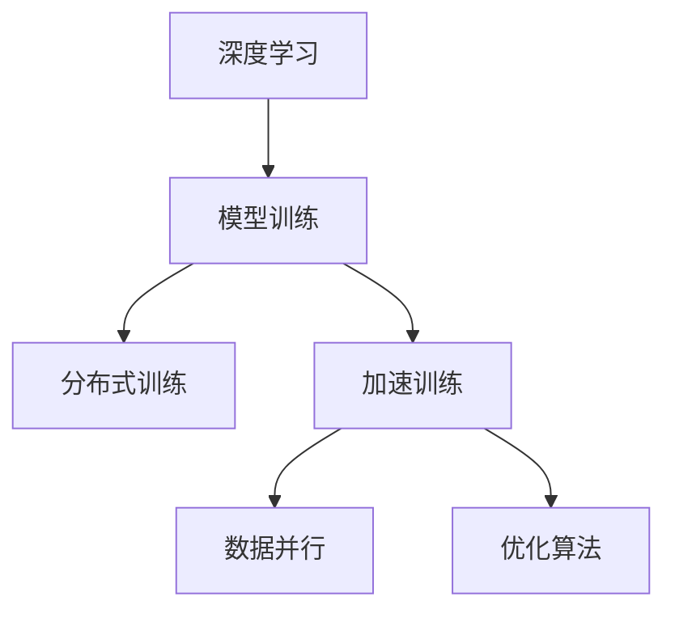
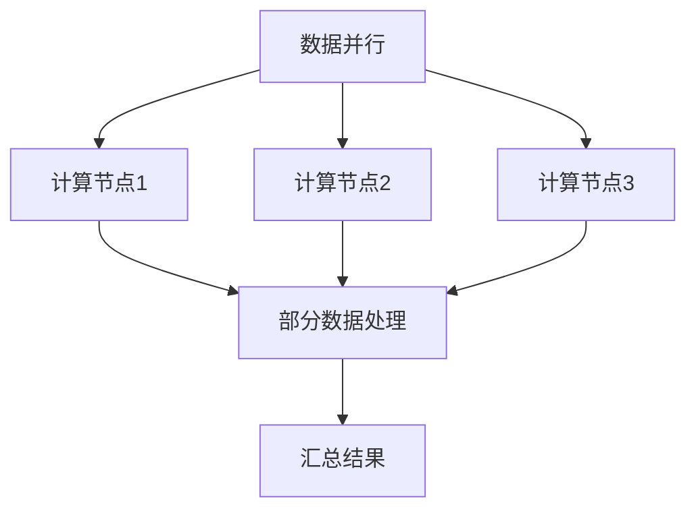
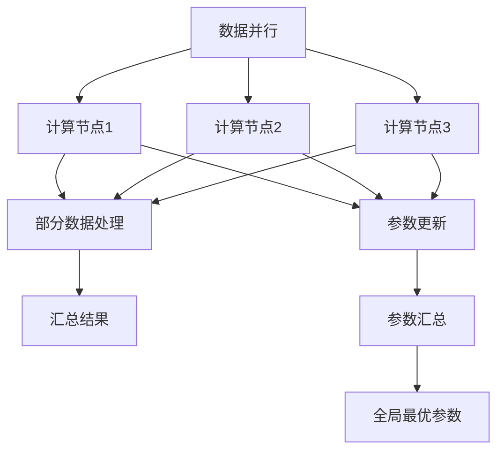

                 

# 分布式优化：扩展AI模型训练

> 关键词：分布式计算, 深度学习, 模型训练, 数据并行, 加速训练, 机器学习, 优化算法

## 1. 背景介绍

随着深度学习技术的迅猛发展，人工智能(AI)模型规模不断增大，训练复杂度日益提升。大型AI模型的训练，特别是深度神经网络(DNNs)，往往需要耗费大量的计算资源和时间，单个计算节点难以承受。因此，分布式训练成为提升AI模型训练效率的关键手段。本文将详细介绍分布式优化的核心概念、算法原理及操作步骤，旨在为读者提供全面、深入的理解，并介绍其在实际应用中的广泛应用场景。

## 2. 核心概念与联系

### 2.1 核心概念概述

为了更好地理解分布式优化，首先需要介绍几个关键概念：

- **分布式计算**：指将大规模任务分解为多个子任务，分配给多个计算节点并行处理，以提升计算效率和资源利用率。
- **深度学习**：一种通过多层神经网络进行复杂模式识别的机器学习方法，广泛应用于图像、语音、自然语言处理等领域。
- **模型训练**：通过大量标注数据和优化算法，调整模型参数，使其能够准确预测未见过的数据。
- **数据并行**：在分布式计算中，将训练数据分配到多个节点，每个节点处理一部分数据，最后将结果汇总。
- **加速训练**：通过优化算法、硬件加速、分布式训练等技术手段，缩短模型训练时间。
- **优化算法**：用于调整模型参数以最小化损失函数，如随机梯度下降(SGD)、Adam、Adagrad等。

这些概念之间的联系可以通过以下Mermaid流程图来展示：



这个流程图展示了深度学习模型训练过程中，分布式优化技术的作用：通过并行处理和优化算法，加速模型训练，提高计算效率。

### 2.2 核心概念原理和架构

在分布式优化过程中，数据并行和模型并行是两种主要的架构：

- **数据并行**：将同一批数据分发给多个计算节点，每个节点独立处理部分数据，并将结果汇总。这种方法对数据分布的要求较高，但可以有效利用计算资源，适用于大规模数据集。
- **模型并行**：将模型各层分发到不同计算节点，每个节点处理一层或部分层，最终将各节点输出合并。这种方法需要较高的节点间通信能力，但可以进一步加速训练，适用于非常大规模的模型。

以下是一个简单的数据并行示意图：



数据并行通过将训练数据分块，每个计算节点独立处理一块数据，最后将各节点的输出结果汇总，可以有效提升计算效率。在实际应用中，数据并行通常使用数据流水线技术，将数据分为多个阶段进行并行处理，每个阶段分配到不同的计算节点上，以最大程度利用计算资源。

## 3. 核心算法原理 & 具体操作步骤

### 3.1 算法原理概述

分布式优化的核心原理是通过并行计算和优化算法，最小化模型损失函数。在分布式环境中，模型参数分布在多个节点上，每个节点独立更新模型的一部分参数。通过迭代更新，各节点将参数的更新结果汇总，最终得到一个全局最优的模型。

具体而言，分布式优化的流程包括以下几个步骤：

1. **数据划分**：将训练数据划分为多个子集，每个子集分配到不同的计算节点上。
2. **参数分配**：将模型参数分布在多个节点上，每个节点处理模型的一部分参数。
3. **独立训练**：每个节点独立训练其负责的参数，更新模型参数。
4. **参数汇总**：将各节点的模型参数更新结果汇总，得到全局最优的模型参数。
5. **迭代更新**：重复以上步骤，直至模型收敛。

### 3.2 算法步骤详解

以数据并行为例，具体的分布式优化步骤如下：

1. **数据划分**：将训练数据集 $D$ 划分为 $N$ 个子集 $D_1, D_2, ..., D_N$，每个子集分配到一个计算节点上。
2. **参数分配**：将模型参数 $\theta$ 分配到 $N$ 个节点上，每个节点负责更新一部分参数。
3. **独立训练**：每个节点独立更新其负责的参数，使用其分配的数据子集进行训练，更新模型参数。
4. **参数汇总**：在每个训练轮次结束后，各节点将更新后的参数汇总，得到全局最优的参数 $\theta'$。
5. **迭代更新**：重复以上步骤，直至模型收敛或达到预设的训练轮次。

以下是一个简单的分布式优化示例：



### 3.3 算法优缺点

分布式优化具有以下优点：

- **计算效率高**：通过并行计算，可以显著提高训练速度，缩短模型训练时间。
- **资源利用率高**：多个计算节点可以同时进行计算，充分利用计算资源。
- **可扩展性强**：随着计算资源的增加，可以动态扩展计算节点，适应更大规模的模型和数据。

同时，分布式优化也存在一些缺点：

- **通信开销大**：节点之间的数据传输和参数更新需要大量的通信开销，可能成为瓶颈。
- **一致性问题**：多个节点同时更新参数时，如何保证参数的一致性，避免数据竞争和死锁。
- **同步难度高**：由于各节点并行训练，同步各节点之间的进度和状态可能较为复杂。

## 4. 数学模型和公式 & 详细讲解

### 4.1 数学模型构建

在分布式优化中，常用的数学模型包括随机梯度下降(SGD)和Adam等。假设模型参数为 $\theta$，损失函数为 $L(\theta)$，数据集为 $D$，则分布式优化的目标是最小化损失函数：

$$
\min_{\theta} \frac{1}{N}\sum_{i=1}^N L(\theta; x_i)
$$

其中，$x_i$ 表示数据集中的一个样本。在分布式环境中，每个节点 $i$ 负责更新 $\theta_i$ 部分参数，目标函数变为：

$$
\min_{\theta_i} \frac{1}{N}\sum_{i=1}^N L(\theta_i; x_i)
$$

### 4.2 公式推导过程

以随机梯度下降为例，推导分布式优化的公式：

1. 假设模型参数 $\theta$ 在节点 $i$ 上，其损失函数为 $L(\theta; x_i)$，则节点 $i$ 的梯度为：

$$
\nabla_{\theta_i} L(\theta; x_i) = \frac{\partial L(\theta; x_i)}{\partial \theta_i}
$$

2. 节点 $i$ 使用该梯度更新参数 $\theta_i$：

$$
\theta_i \leftarrow \theta_i - \eta \nabla_{\theta_i} L(\theta; x_i)
$$

3. 汇总所有节点的参数更新结果，得到全局最优的模型参数 $\theta'$：

$$
\theta' = \frac{1}{N}\sum_{i=1}^N \theta_i
$$

4. 迭代更新，重复以上步骤，直至模型收敛或达到预设的训练轮次。

### 4.3 案例分析与讲解

以深度学习模型训练为例，分析分布式优化的应用。假设有一个包含 $M$ 层的深度神经网络，参数总数为 $P$，数据集 $D$ 被划分为 $N$ 个子集，每个子集分配到一个计算节点上。训练过程如下：

1. 将模型参数 $\theta$ 在 $N$ 个节点上均匀分配，每个节点负责更新部分参数。
2. 每个节点独立计算其分配的子集 $D_i$ 的损失函数，并计算梯度。
3. 节点 $i$ 使用梯度更新其负责的参数 $\theta_i$，更新公式为：

$$
\theta_i \leftarrow \theta_i - \eta \frac{1}{m_i} \sum_{x \in D_i} \nabla_{\theta_i} L(\theta; x)
$$

其中，$m_i$ 表示节点 $i$ 上数据的数量。
4. 每个节点将更新后的参数 $\theta_i$ 发送给其他节点，汇总各节点的参数更新结果。
5. 将汇总后的参数 $\theta'$ 作为全局最优的模型参数，使用数据集 $D$ 进行验证和测试。

## 5. 项目实践：代码实例和详细解释说明

### 5.1 开发环境搭建

在进行分布式优化实践前，我们需要准备好开发环境。以下是使用Python和PyTorch进行分布式训练的环境配置流程：

1. 安装Anaconda：从官网下载并安装Anaconda，用于创建独立的Python环境。

2. 创建并激活虚拟环境：
```bash
conda create -n pytorch-env python=3.8 
conda activate pytorch-env
```

3. 安装PyTorch：根据CUDA版本，从官网获取对应的安装命令。例如：
```bash
conda install pytorch torchvision torchaudio cudatoolkit=11.1 -c pytorch -c conda-forge
```

4. 安装DistributedDataParallel(DDP)：
```bash
pip install torch.distributed
```

5. 安装Horovod：
```bash
pip install horovod
```

6. 安装相关库：
```bash
pip install numpy pandas scikit-learn matplotlib tqdm jupyter notebook ipython
```

完成上述步骤后，即可在`pytorch-env`环境中开始分布式训练实践。

### 5.2 源代码详细实现

以下是一个使用PyTorch和Horovod进行数据并行分布式训练的代码实现。

首先，定义数据处理函数：

```python
from torch.utils.data import Dataset, DataLoader
import torch
import torch.distributed as dist
import os

class MNISTDataset(Dataset):
    def __init__(self, root, train=True, transform=None):
        self.transform = transform
        self.train = train
        self.data = torchvision.datasets.MNIST(root=root, train=train, download=True)
        self.train_loader = DataLoader(self.data, batch_size=64, shuffle=True)
    
    def __getitem__(self, index):
        img, target = self.data[index]
        if self.transform:
            img = self.transform(img)
        return img, target
    
    def __len__(self):
        return len(self.data)
```

然后，定义模型和优化器：

```python
import torch.nn as nn
import torch.nn.functional as F
import torch.distributed as dist
from torch.distributed.optim import DistributedOptimizer

class Net(nn.Module):
    def __init__(self):
        super(Net, self).__init__()
        self.conv1 = nn.Conv2d(1, 32, 3, 1)
        self.conv2 = nn.Conv2d(32, 64, 3, 1)
        self.dropout1 = nn.Dropout(0.25)
        self.dropout2 = nn.Dropout(0.5)
        self.fc1 = nn.Linear(9216, 128)
        self.fc2 = nn.Linear(128, 10)
    
    def forward(self, x):
        x = self.conv1(x)
        x = F.relu(x)
        x = self.conv2(x)
        x = F.relu(x)
        x = F.max_pool2d(x, 2)
        x = self.dropout1(x)
        x = torch.flatten(x, 1)
        x = self.fc1(x)
        x = F.relu(x)
        x = self.dropout2(x)
        x = self.fc2(x)
        output = F.log_softmax(x, dim=1)
        return output

device = torch.device("cuda:0" if torch.cuda.is_available() else "cpu")
model = Net().to(device)

if dist.get_rank() == 0:
    print(model)

criterion = nn.CrossEntropyLoss()
optimizer = DistributedOptimizer(optimizer=torch.optim.Adam(model.parameters(), lr=0.001), device_ids=[device.index()])
```

接着，定义训练和评估函数：

```python
def train_epoch(model, optimizer, criterion, train_loader):
    model.train()
    running_loss = 0.0
    for i, data in enumerate(train_loader, 0):
        inputs, labels = data
        inputs, labels = inputs.to(device), labels.to(device)
        optimizer.zero_grad()
        outputs = model(inputs)
        loss = criterion(outputs, labels)
        loss.backward()
        optimizer.step()
        running_loss += loss.item()
        if i % 10 == 9:
            if dist.get_rank() == 0:
                print('[%d, %5d] loss: %.3f' % (epoch + 1, i + 1, running_loss / 10))
            running_loss = 0.0
    return running_loss / len(train_loader)

def evaluate(model, criterion, test_loader):
    model.eval()
    correct = 0
    total = 0
    with torch.no_grad():
        for data in test_loader:
            images, labels = data
            images, labels = images.to(device), labels.to(device)
            outputs = model(images)
            _, predicted = torch.max(outputs.data, 1)
            total += labels.size(0)
            correct += (predicted == labels).sum().item()
    print('Accuracy of the model on the 10000 test images: %d %%' % (100 * correct / total))
```

最后，启动分布式训练流程并在测试集上评估：

```python
import torch.multiprocessing as mp

mp.set_start_method('spawn')
world_size = 2
dist.init_process_group("gloo", rank=dist.get_rank(), world_size=world_size)

train_loader = DataLoader(MNISTDataset(root='mnist_data', train=True, transform=transforms.ToTensor()), batch_size=64, shuffle=True, num_workers=4)
test_loader = DataLoader(MNISTDataset(root='mnist_data', train=False, transform=transforms.ToTensor()), batch_size=64, shuffle=False, num_workers=4)

train_loader = torch.utils.data.distributed.DistributedSampler(train_loader)
test_loader = torch.utils.data.distributed.DistributedSampler(test_loader)

if dist.get_rank() == 0:
    print(train_loader, test_loader)

train_loss = train_epoch(model, optimizer, criterion, train_loader)
print('Training finished, loss: {:.4f}'.format(train_loss))

evaluate(model, criterion, test_loader)
```

### 5.3 代码解读与分析

让我们再详细解读一下关键代码的实现细节：

**MNISTDataset类**：
- `__init__`方法：初始化训练集和测试集，并创建DataLoader对象，设置批次大小和数据打乱方式。
- `__getitem__`方法：获取数据集的样本。
- `__len__`方法：返回数据集的大小。

**Net类**：
- `__init__`方法：定义模型的结构。
- `forward`方法：定义前向传播过程，将输入数据通过卷积层、池化层、全连接层进行变换，最终输出结果。

**train_epoch函数**：
- 在训练轮次中，使用数据加载器逐批次获取数据，前向传播计算损失函数，反向传播更新模型参数，并输出每批次的损失值。

**evaluate函数**：
- 在测试集上，使用模型对样本进行预测，计算模型的准确率。

**主函数**：
- 初始化分布式环境，启动多个进程进行并行训练。
- 使用DistributedSampler进行数据划分，确保每个进程只获取到分配的数据。
- 在主进程上打印训练结果，并在测试集上进行评估。

可以看到，通过Horovod和DistributedOptimizer等库，分布式优化的实现变得简单易行。开发者可以利用这些工具快速实现数据并行和模型并行，进行高效的分布式训练。

## 6. 实际应用场景

### 6.1 机器学习竞赛

在Kaggle等机器学习竞赛平台，分布式优化技术已被广泛应用于大规模数据集的训练和模型优化。通过将训练数据和模型分布在多个计算节点上，可以显著提升竞赛的参与效率和模型性能。例如，在ImageNet大规模视觉识别竞赛中，分布式优化使得单个模型在数天内完成训练，而非传统单机训练数月。

### 6.2 大规模深度学习应用

在深度学习应用中，分布式优化技术被广泛应用于大规模图像识别、自然语言处理、语音识别等任务。例如，在Google、微软等公司的深度学习研究中，分布式优化使得大规模模型的训练和推理变得更加高效，推动了这些公司AI技术的发展。

### 6.3 云计算平台

云计算平台如AWS、Google Cloud、阿里云等，提供了基于分布式优化的深度学习训练服务，帮助开发者轻松搭建高性能计算环境，进行大规模模型训练。这些服务通常支持多种分布式训练框架，如Horovod、TensorFlow分布式等，方便开发者进行实验和部署。

## 7. 工具和资源推荐

### 7.1 学习资源推荐

为了帮助开发者系统掌握分布式优化的理论基础和实践技巧，这里推荐一些优质的学习资源：

1. 《分布式深度学习》（Distributed Deep Learning）：由深度学习专家Jean-Yves Le Guen等合著，全面介绍了分布式深度学习的理论基础和实践技巧，适合初学者和高级开发者阅读。
2. 《TensorFlow for Deep Learning》（TensorFlow深度学习）：由Google开发者撰写，详细介绍TensorFlow框架的分布式优化功能，并提供丰富的实践案例。
3. 《Distributed Data-Parallel Training of Deep Neural Networks》：这是一篇深度学习领域的经典论文，详细讨论了深度学习模型在分布式环境下的训练方法，是理解分布式优化的重要参考文献。
4. 《Horovod用户手册》（Horovod User Guide）：Horovod官方文档，提供了丰富的分布式优化实践指南，包括代码示例和最佳实践。

通过对这些资源的学习实践，相信你一定能够快速掌握分布式优化的精髓，并用于解决实际的深度学习问题。

### 7.2 开发工具推荐

高效的开发离不开优秀的工具支持。以下是几款用于分布式优化开发的常用工具：

1. PyTorch：基于Python的开源深度学习框架，灵活动态的计算图，适合快速迭代研究。在分布式优化方面，PyTorch提供了丰富的分布式计算功能，如DistributedDataParallel(DDP)、Horovod等。
2. TensorFlow：由Google主导开发的开源深度学习框架，生产部署方便，适合大规模工程应用。TensorFlow提供了强大的分布式训练功能，如TensorFlow分布式、MirroredStrategy等。
3. Horovod：一个基于TensorFlow和PyTorch的分布式训练框架，支持多种分布式计算模型，如数据并行、模型并行、混合并行等。
4. MPI4Py：Python实现的MPI接口，用于分布式计算任务的节点通信和数据交换。

合理利用这些工具，可以显著提升分布式优化的开发效率，加快创新迭代的步伐。

### 7.3 相关论文推荐

分布式优化技术的发展源于学界的持续研究。以下是几篇奠基性的相关论文，推荐阅读：

1. Distributed Training with Distributed Data-Parallelism: An Overview：由深度学习专家Kaiming He等撰写，详细介绍了深度学习模型在分布式环境下的训练方法，是理解分布式优化的重要参考文献。
2. Training Deep Neural Networks Using Distributed Data Parallelism：由深度学习专家Geoffrey Hinton等撰写，详细讨论了深度学习模型在分布式环境下的训练方法，是分布式优化的经典之作。
3. Mixed Precision Training for Distributed Deep Learning：由深度学习专家Victor B. Gomez等撰写，讨论了混合精度训练在分布式深度学习中的应用，显著提升了分布式训练的效率和效果。

这些论文代表了大规模深度学习模型在分布式优化技术的发展脉络，通过学习这些前沿成果，可以帮助研究者把握学科前进方向，激发更多的创新灵感。

## 8. 总结：未来发展趋势与挑战

### 8.1 总结

本文对分布式优化的核心概念、算法原理及操作步骤进行了全面系统的介绍。首先阐述了分布式计算和深度学习的基本原理，详细讲解了分布式优化的核心算法步骤，并给出了实际应用中的代码实现。通过系统的学习和实践，相信读者能够更好地理解分布式优化技术的原理和应用方法。

### 8.2 未来发展趋势

展望未来，分布式优化技术将呈现以下几个发展趋势：

1. **更高效的数据并行**：随着数据量的增加，数据并行将变得更加重要。未来的分布式优化技术将进一步提升数据并行的效率，通过更精细的数据划分和并行算法，实现更高吞吐量和更低延迟。
2. **更广泛的分布式架构**：分布式优化的架构将更加多样化，包括异构集群、边缘计算、云-边计算融合等，适应更多场景的应用需求。
3. **更灵活的分布式算法**：未来的分布式优化算法将更加灵活，支持动态任务调整、混合精度训练、异步训练等，提升训练的灵活性和可扩展性。
4. **更优的资源管理**：分布式优化将更加注重资源管理，通过智能调度、动态扩缩容等手段，实现更高资源利用率和更短训练时间。
5. **更强的可扩展性**：分布式优化将支持更大规模的模型和数据集，通过多节点、多机柜的分布式计算，实现更高性能的模型训练。

以上趋势凸显了分布式优化技术的广阔前景，这些方向的探索发展，必将进一步提升深度学习模型训练的效率和效果，推动人工智能技术的普及和应用。

### 8.3 面临的挑战

尽管分布式优化技术已经取得了瞩目成就，但在迈向更加智能化、普适化应用的过程中，它仍面临着诸多挑战：

1. **通信开销大**：节点之间的数据传输和参数更新需要大量的通信开销，可能成为瓶颈。如何优化通信协议，减少通信开销，是未来需要解决的关键问题。
2. **一致性问题**：多个节点同时更新参数时，如何保证参数的一致性，避免数据竞争和死锁。
3. **同步难度高**：由于各节点并行训练，同步各节点之间的进度和状态可能较为复杂。如何设计高效的同步机制，确保各节点之间的状态一致，也是未来需要解决的重要问题。
4. **模型鲁棒性不足**：分布式训练的模型面对域外数据时，泛化性能往往大打折扣。如何提高模型的鲁棒性，避免灾难性遗忘，还需要更多理论和实践的积累。
5. **可解释性不足**：分布式训练的模型通常缺乏可解释性，难以解释其内部工作机制和决策逻辑。这对于需要高解释性的领域，如医疗、金融等，是一个重要挑战。
6. **安全性有待保障**：分布式训练的模型容易受到恶意攻击，如模型窃取、数据泄露等。如何保障模型的安全性，确保数据和模型的安全，也将是未来的重要研究方向。

### 8.4 研究展望

面对分布式优化所面临的挑战，未来的研究需要在以下几个方面寻求新的突破：

1. **优化通信协议**：通过改进通信协议和算法，减少通信开销，提升数据传输效率。
2. **设计高效的同步机制**：引入更高效、更灵活的同步机制，如异步训练、分布式锁等，确保各节点之间的状态一致。
3. **提升模型鲁棒性**：引入更多的正则化技术、自适应学习率等，提升模型的泛化能力和鲁棒性。
4. **增强可解释性**：引入可解释性模型、可视化工具等，帮助开发者更好地理解模型的决策过程和内部机制。
5. **保障模型安全性**：引入数据加密、模型水印等技术，确保模型的安全性。

这些研究方向将推动分布式优化技术向更高效、更普适、更安全的方向发展，为大规模深度学习模型提供更强大的计算支持和更优的训练效果。

## 9. 附录：常见问题与解答

**Q1：分布式优化与传统单机优化的区别是什么？**

A: 分布式优化与传统单机优化相比，最大的区别在于计算资源的分布和使用方式。在分布式优化中，计算任务被分解为多个子任务，分配到多个计算节点上并行处理，而传统单机优化则在一个节点上执行全部任务。分布式优化能够显著提高计算效率和资源利用率，但也需要更多的通信和同步开销。

**Q2：分布式优化的通信开销如何优化？**

A: 优化通信开销的关键在于减少节点之间的数据传输量和传输频率。可以采用以下方法：
1. 数据压缩：通过数据压缩技术，减少数据传输量。
2. 分布式缓存：使用分布式缓存技术，减少节点之间的数据传输。
3. 混合精度训练：通过混合精度训练技术，减少模型的存储和传输开销。
4. 通信优化：使用更高效的通信协议和算法，减少通信开销。

**Q3：分布式优化的同步问题如何解决？**

A: 分布式优化的同步问题通常采用以下方法解决：
1. 分布式锁：使用分布式锁技术，确保各节点之间的状态一致。
2. 异步训练：通过异步训练技术，减少同步开销。
3. 分布式优化算法：引入更高效的分布式优化算法，如AdamW、Horovod等，自动处理同步问题。

**Q4：分布式优化在实际应用中需要注意哪些问题？**

A: 分布式优化在实际应用中需要注意以下问题：
1. 计算资源管理：合理分配计算资源，避免资源浪费和瓶颈。
2. 通信开销控制：优化通信协议，减少通信开销。
3. 同步问题解决：设计高效的同步机制，确保各节点之间的状态一致。
4. 模型鲁棒性保障：引入正则化技术、自适应学习率等，提升模型的泛化能力和鲁棒性。
5. 可解释性增强：引入可解释性模型、可视化工具等，帮助开发者更好地理解模型的决策过程和内部机制。

这些问题是分布式优化应用过程中需要重点考虑和解决的关键点，只有全面解决这些问题，才能充分发挥分布式优化的优势，提升深度学习模型的训练效果。

通过本文的系统梳理，可以看到，分布式优化技术正在成为深度学习模型训练的重要手段，极大地提升了模型的训练效率和效果。未来，随着分布式计算技术的不断进步，分布式优化技术将更加高效、灵活、普适，推动人工智能技术在更多领域的落地应用。

