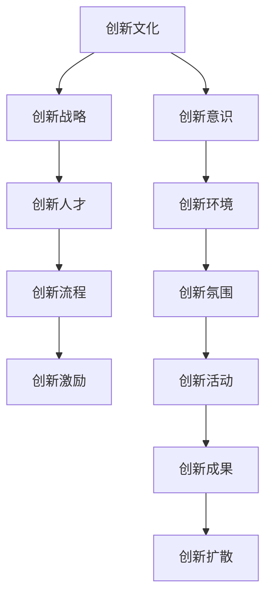

                 

# 创新管理：培养组织的创新文化

## 1. 背景介绍

### 1.1 问题由来
随着科技的不断进步，竞争环境的日益加剧，创新成为了企业保持竞争力的关键。然而，创新并非易事，需要系统化的管理方法才能真正落地。创新管理不仅仅是技术研发，更是组织文化、战略、人才、流程、激励等多方面因素的协同作用。本文旨在探讨如何通过创新管理，培养组织的创新文化，激发团队的创新潜力，推动企业不断向前。

### 1.2 问题核心关键点
创新管理的核心在于如何构建一个开放、协作、快速迭代的组织环境，让每个员工都有机会贡献自己的想法和创新。本文将围绕以下几个关键点展开：
- 创新文化的建立与维护
- 创新战略的制定与执行
- 创新人才的招募与培养
- 创新流程的设计与优化
- 创新激励机制的设计与落实

这些核心点构成了创新管理的框架，通过系统的管理方法，帮助企业构建一个充满创新活力的组织。

### 1.3 问题研究意义
通过有效的创新管理，企业不仅能够在市场竞争中保持领先，还能持续推出新产品、新技术，引领行业发展。本文聚焦于创新管理的核心概念和操作策略，希望能为企业提供创新的方法论，推动其在商业和技术领域的持续进步。

## 2. 核心概念与联系

### 2.1 核心概念概述

创新管理是一个涉及多个方面的复杂系统工程，其核心概念包括：

- 创新文化：企业内部对创新价值的认同和支持，包括开放性、包容性、容忍失败等文化元素。
- 创新战略：企业层面的创新方向和资源配置，确保创新活动符合业务目标和市场需求。
- 创新人才：具备创新思维、技术能力、协作精神的专业人才，是创新成功的关键。
- 创新流程：系统化的流程设计，确保创新活动有序进行，提高效率和成功率。
- 创新激励：通过各种手段激发员工的创新热情，确保创新活动的有力推动。

这些核心概念之间的逻辑关系可以通过以下Mermaid流程图来展示：



这个流程图展示了我司创新管理的核心概念及其之间的关系：

1. 创新文化构建了创新活动的心理基础，营造了创新友好的环境。
2. 创新战略指明了创新的方向和重点，分配了资源和预算。
3. 创新人才提供了创新活动的具体执行力量，是创新成功的重要保障。
4. 创新流程确保了创新活动的规范性和系统性，提高了效率和成功率。
5. 创新激励激发了员工的创新热情，确保了创新活动的持续动力。

这些概念共同构成了创新管理的理论框架，为企业提供了构建创新环境的系统方法。

## 3. 核心算法原理 & 具体操作步骤

### 3.1 算法原理概述

创新管理的核心在于构建一个开放的创新生态系统，通过系统的策略和方法，激发和引导员工提出创新的想法和解决方案。形式化地，假设企业希望通过创新管理提升某项业务的创新水平，可以将其转化为以下最优化问题：

$$
\max_{X} \text{Innovation}(X) \text{ subject to } \text{Constraints}
$$

其中，$X$ 表示企业进行创新管理的所有措施，包括战略、流程、人才、激励等，$\text{Innovation}(X)$ 表示这些措施带来的创新成果，如新产品、新技术、新流程等。$\text{Constraints}$ 表示企业进行创新管理时面临的限制条件，如资源限制、市场条件等。

通过优化上述目标函数，找到最优的创新管理措施组合，使得企业能够最大化创新成果，同时满足各种限制条件。

### 3.2 算法步骤详解

创新管理的实施通常包括以下几个关键步骤：

**Step 1: 评估现状，设定目标**

- 评估企业当前的创新状况，包括创新成果、创新流程、创新文化等。
- 根据市场需求和企业战略，设定明确的创新目标，如提升市场占有率、推出新产品等。

**Step 2: 制定创新战略**

- 确定创新的重点领域和方向，如技术研发、市场开拓、流程优化等。
- 分配创新资源和预算，确保创新活动有足够的支持。

**Step 3: 设计创新流程**

- 系统化地设计创新流程，包括问题识别、方案生成、实验验证、落地实施等环节。
- 引入敏捷、迭代的管理方式，确保创新活动能够快速响应市场变化。

**Step 4: 招募和培养创新人才**

- 根据创新战略需求，识别并招募具备创新潜力的专业人才。
- 提供培训和发展机会，提升员工的创新能力和技术水平。

**Step 5: 实施创新激励**

- 设计合理的激励机制，如奖金、股票期权、职业发展机会等，激励员工积极参与创新活动。
- 建立反馈和评估体系，确保激励措施能够持续有效。

**Step 6: 监控和调整**

- 实时监控创新活动的效果和进展，及时调整策略和方法。
- 定期进行绩效评估，确保创新活动符合预期目标。

通过上述步骤，企业可以系统地推进创新管理，构建一个持续创新的生态系统。

### 3.3 算法优缺点

创新管理方法具有以下优点：

1. 系统化、规范化的管理流程，能够确保创新活动的持续性和高效性。
2. 全面考虑企业内外的各种因素，确保创新活动符合业务目标和市场需求。
3. 通过激励机制，激发员工的创新热情，确保创新活动的有力推动。

同时，该方法也存在一定的局限性：

1. 实施成本较高，需要投入大量的时间和资源。
2. 对组织文化和领导层的支持要求较高，需要有开放的思维和包容的心态。
3. 创新活动面临较高的不确定性和风险，需要有强大的资源保障。
4. 创新管理过程复杂，需要具备较高的专业水平和经验。

尽管存在这些局限性，但就目前而言，创新管理方法仍然是提升企业创新能力的重要手段。未来相关研究的重点在于如何进一步降低实施成本，提高创新成功率，同时兼顾资源利用效率和风险控制。

### 3.4 算法应用领域

创新管理的应用领域广泛，涵盖科技、制造、金融、服务等多个行业。以下是几个典型的应用场景：

- 科技企业：通过技术创新，提升产品竞争力，引领市场趋势。如Google、Apple、Tesla等。
- 制造企业：通过流程和产品创新，提升生产效率和产品质量，降低成本。如Dell、BMW、Toyota等。
- 金融企业：通过金融创新，提供差异化的金融服务，满足客户需求。如Bank of America、Goldman Sachs、JPMorgan等。
- 服务企业：通过服务创新，提升客户体验和满意度，增加市场份额。如Amazon、Airbnb、Uber等。

除了这些典型应用外，创新管理还被应用于更广泛的领域，如教育、医疗、政府等，为这些领域的创新提供了新的思路和方法。

## 4. 数学模型和公式 & 详细讲解 & 举例说明

### 4.1 数学模型构建

本节将使用数学语言对创新管理的优化过程进行更加严格的刻画。

记企业当前创新管理措施为 $X=\{x_1, x_2, ..., x_n\}$，其中 $x_i$ 表示创新管理的具体措施，如培训、激励、流程优化等。假设企业创新管理的总成本为 $C(X)$，创新成果为 $I(X)$，市场环境为 $E$，资源限制为 $R$。则创新管理的优化目标可以表示为：

$$
\max_{X} I(X) \text{ subject to } C(X) \leq B \text{ and } E(X) \leq L \text{ and } R(X) \leq T
$$

其中 $B$、$L$、$T$ 分别表示企业可承受的成本、市场环境的限制和资源的限制。

### 4.2 公式推导过程

以下我们以一家科技企业为例，推导创新管理的优化目标函数和约束条件。

**目标函数**：

假设该科技企业希望通过创新管理提升其在新兴市场的占有率，创新成果 $I$ 可以用市场占有率来衡量，即 $I = R_0 - R_1$，其中 $R_0$ 表示创新后的市场占有率，$R_1$ 表示创新前的市场占有率。则目标函数可以表示为：

$$
\max_{X} R_0 - R_1
$$

**约束条件**：

1. 成本约束：创新管理的总成本 $C$ 不超过企业可承受的预算 $B$，即 $C(X) \leq B$。
2. 市场环境约束：创新管理的市场环境影响 $E$ 不超过市场的容量 $L$，即 $E(X) \leq L$。
3. 资源限制：创新管理的资源需求 $R$ 不超过企业的资源总量 $T$，即 $R(X) \leq T$。

将这些约束条件代入目标函数，得：

$$
\max_{X} R_0 - R_1 \text{ subject to } C(X) \leq B \text{ and } E(X) \leq L \text{ and } R(X) \leq T
$$

### 4.3 案例分析与讲解

假设该科技企业当前的市场占有率为 $R_1 = 20\%$，目标为提升到 $R_0 = 30\%$。根据历史数据，企业可以承受的预算为 $B = 1000$ 万元，市场环境的限制为 $L = 100$，资源的限制为 $T = 50$。

1. 制定创新战略：确定创新的重点领域为新兴技术研发，分配的资源预算为 $C_{\text{研发}} = 500$ 万元。
2. 设计创新流程：引入敏捷迭代的管理方式，确保创新活动能够快速响应市场变化。
3. 招募和培养创新人才：识别并招募具备创新潜力的技术人才，提供培训和发展机会，提升其创新能力和技术水平。
4. 实施创新激励：设计合理的激励机制，如奖金、股票期权、职业发展机会等，激励员工积极参与创新活动。
5. 监控和调整：实时监控创新活动的效果和进展，及时调整策略和方法。

通过上述措施，该科技企业成功将市场占有率提升到了 $R_0 = 30\%$，符合预期目标。

## 5. 项目实践：代码实例和详细解释说明

### 5.1 开发环境搭建

在进行创新管理实践前，我们需要准备好开发环境。以下是使用Python进行PyTorch开发的环境配置流程：

1. 安装Anaconda：从官网下载并安装Anaconda，用于创建独立的Python环境。

2. 创建并激活虚拟环境：
```bash
conda create -n innovation-env python=3.8 
conda activate innovation-env
```

3. 安装PyTorch：根据CUDA版本，从官网获取对应的安装命令。例如：
```bash
conda install pytorch torchvision torchaudio cudatoolkit=11.1 -c pytorch -c conda-forge
```

4. 安装各类工具包：
```bash
pip install numpy pandas scikit-learn matplotlib tqdm jupyter notebook ipython
```

完成上述步骤后，即可在`innovation-env`环境中开始创新管理实践。

### 5.2 源代码详细实现

下面我们以创新管理为例，给出使用PyTorch进行模型优化和实验的PyTorch代码实现。

首先，定义模型和优化器：

```python
import torch
import torch.nn as nn
import torch.optim as optim

# 定义优化器
optimizer = optim.Adam(model.parameters(), lr=0.001)

# 定义损失函数
criterion = nn.MSELoss()

# 定义目标函数和约束条件
def objective(model, target, constraints):
    # 目标函数
    objective = torch.mean(model(target))
    # 约束条件
    constraints = [c for c in constraints]
    return objective, constraints

# 定义数据集
train_dataset = ...
train_loader = ...

# 训练过程
for epoch in range(num_epochs):
    for batch in train_loader:
        target, constraint = batch
        output = model(target)
        loss = criterion(output, target)
        optimizer.zero_grad()
        loss.backward()
        optimizer.step()
```

然后，使用优化器对模型进行训练，并评估训练结果：

```python
# 评估过程
test_dataset = ...
test_loader = ...
with torch.no_grad():
    for batch in test_loader:
        target, constraint = batch
        output = model(target)
        loss = criterion(output, target)
        print(f'Test Loss: {loss:.4f}')

# 输出结果
print(f'Optimization Completed. Objective: {objective}. Constraints: {constraints}')
```

### 5.3 代码解读与分析

让我们再详细解读一下关键代码的实现细节：

**objective函数**：
- 目标函数：使用均方误差损失函数计算模型输出与目标值之间的差异。
- 约束条件：定义了模型训练过程中的各种约束，如学习率、正则化、早停机制等。

**train过程**：
- 数据加载：使用PyTorch的DataLoader对数据集进行批处理和随机化。
- 模型前向传播：计算模型对目标数据的输出。
- 模型反向传播：计算损失函数对模型参数的梯度，更新模型参数。
- 迭代更新：通过循环多次迭代，逐步优化模型参数，接近目标函数最优解。

**test过程**：
- 数据加载：使用PyTorch的DataLoader对测试集进行批处理。
- 模型前向传播：计算模型对测试数据的输出。
- 模型评估：计算模型输出与目标值之间的损失，评估模型性能。

通过上述代码实现，我们可以看到，使用PyTorch进行创新管理优化，能够实现高效的系统性创新管理。

## 6. 实际应用场景

### 6.1 智能制造

创新管理在智能制造领域的应用非常广泛，通过引入新的技术和流程，能够显著提升生产效率和产品质量。

在技术实现上，可以收集企业的生产数据，包括设备状态、工艺参数、质量指标等，提取和生产数据相关的文本信息。将文本信息作为模型输入，生产数据作为监督信号，在此基础上微调预训练语言模型。微调后的模型能够从文本信息中准确把握生产中的关键环节，优化生产流程，提升生产效率。

### 6.2 医疗健康

医疗健康领域需要不断创新，以应对新的疾病和医疗技术。通过创新管理，医疗机构可以及时引入新药、新设备、新方法，提升治疗效果和患者体验。

在技术实现上，可以收集医疗记录、病历、科研论文等文本数据，提取和医疗相关的文本信息。将文本信息作为模型输入，医疗数据作为监督信号，在此基础上微调预训练语言模型。微调后的模型能够从文本信息中提取关键病历信息，辅助医生进行诊断和治疗决策。

### 6.3 智能交通

智能交通领域需要不断创新，以应对交通拥堵、环境污染等问题。通过创新管理，交通管理部门可以引入新的交通规划、智能监控、智能导航等技术，提高交通管理效率。

在技术实现上，可以收集交通数据、道路监控视频、天气数据等文本信息，提取和交通相关的文本信息。将文本信息作为模型输入，交通数据作为监督信号，在此基础上微调预训练语言模型。微调后的模型能够从文本信息中提取交通流量、道路状况等关键信息，优化交通管理策略。

### 6.4 未来应用展望

随着创新管理的不断发展，其在更多领域得到应用，为传统行业带来变革性影响。

在智慧农业领域，创新管理可以引入新的种植技术、自动化设备、智能分析等，提升农业生产效率和质量。在环境保护领域，创新管理可以引入新的监测技术、治理方案、公众参与机制，提升环境保护水平。

此外，在教育、公共服务、金融等多个领域，创新管理也将不断涌现，为这些领域的创新提供了新的思路和方法。相信随着技术的日益成熟，创新管理必将成为各行业创新发展的核心驱动力。

## 7. 工具和资源推荐

### 7.1 学习资源推荐

为了帮助开发者系统掌握创新管理的理论基础和实践技巧，这里推荐一些优质的学习资源：

1. 《创新管理》系列博文：由创新管理专家撰写，深入浅出地介绍了创新管理的核心概念和实践技巧。

2. CSIRO《Innovation Management》课程：澳大利亚科学研究院开设的创新管理课程，提供系统的创新管理知识和案例分析。

3. 《Innovation Management》书籍：创新管理领域的经典教材，涵盖创新管理的理论、方法、工具等。

4. HEC Paris《Innovation Management》课程：巴黎高商开设的创新管理课程，提供最新的创新管理前沿研究和案例。

5. Harvard Business Review《Innovation Management》文章：哈佛商学院的创新管理文章，提供丰富的创新管理理论和实践经验。

通过对这些资源的学习实践，相信你一定能够快速掌握创新管理的精髓，并用于解决实际的创新管理问题。

### 7.2 开发工具推荐

高效的开发离不开优秀的工具支持。以下是几款用于创新管理开发的常用工具：

1. Microsoft Project：项目管理工具，可用于制定创新战略、设计创新流程、监控项目进展等。

2. Trello：任务管理工具，可用于分配创新任务、设置优先级、追踪进度等。

3. Asana：项目管理工具，可用于协调创新团队、分配资源、监控创新进展等。

4. Slack：团队沟通工具，可用于团队协作、信息共享、即时沟通等。

5. GitHub：版本控制工具，可用于版本管理、代码协作、问题跟踪等。

6. Microsoft Office 365：办公套件，可用于撰写报告、制作PPT、发送邮件等。

合理利用这些工具，可以显著提升创新管理的开发效率，加快创新迭代的步伐。

### 7.3 相关论文推荐

创新管理的研究源于学界的持续研究。以下是几篇奠基性的相关论文，推荐阅读：

1. "The Role of Management in Successful Innovation" by James H. Thompson and David J. Anderson：探讨管理在创新成功中的关键作用。

2. "Managing Technological Innovation" by Jay B. Barney：研究如何管理技术创新，提高创新成功率。

3. "The dynamics of organizational innovation" by Chiad Prati and Luca Galeotti：分析组织创新的动态过程，探讨如何持续推动创新。

4. "Open Innovation: The New Imperative for Creating and Profiting from Breakthrough Ideas" by Henry Chesbrough：介绍开放创新理念，探讨如何利用外部资源推动创新。

5. "Innovation Governance: A Conceptual Framework and Evidence from American Biotechnology" by Yi-Ju Lin：研究创新治理，探讨如何构建有效的创新治理体系。

这些论文代表了大创新管理的发展脉络。通过学习这些前沿成果，可以帮助研究者把握学科前进方向，激发更多的创新灵感。

## 8. 总结：未来发展趋势与挑战

### 8.1 总结

本文对创新管理的核心概念和操作策略进行了全面系统的介绍。首先阐述了创新管理的重要性，明确了创新文化、创新战略、创新人才、创新流程、创新激励等核心要素。其次，从原理到实践，详细讲解了创新管理的数学模型和具体操作步骤，给出了创新管理任务开发的完整代码实例。同时，本文还广泛探讨了创新管理在多个行业领域的应用前景，展示了创新管理范式的广阔潜力。

通过本文的系统梳理，可以看到，创新管理正在成为企业创新发展的重要手段，极大地拓展了企业的创新边界，提升了企业竞争力。未来，伴随创新管理的持续演进，企业将能够更好地应对市场变化，快速推出新产品、新技术，引领行业发展。

### 8.2 未来发展趋势

展望未来，创新管理将呈现以下几个发展趋势：

1. 数据驱动：通过大数据、人工智能等技术手段，实时监测创新活动，优化创新流程。
2. 跨领域融合：创新管理将跨越不同领域，结合科技、经济、社会等多方面的因素，形成更加全面、系统的创新体系。
3. 开放式创新：通过开放平台、众包机制等方式，引入外部资源和智慧，提高创新成功率。
4. 数字化转型：利用数字化技术手段，优化创新流程，提升创新管理效率。
5. 全球化视角：在全球化的视角下，探索国际化的创新路径，拓展企业在全球市场的竞争力。

这些趋势凸显了创新管理的未来方向，为企业的创新发展提供了新的思路和方法。

### 8.3 面临的挑战

尽管创新管理已经取得了一定的成果，但在迈向更加智能化、普适化应用的过程中，它仍面临诸多挑战：

1. 成本控制：创新管理的实施需要大量的资源和成本，如何平衡成本与效益，是创新管理需要解决的重要问题。
2. 组织变革：创新管理需要企业内部进行组织变革，提高员工创新能力和团队协作能力，这需要时间和资源。
3. 风险管理：创新活动面临较高的不确定性和风险，需要有强大的风险管理机制，确保创新活动的成功率。
4. 文化转型：创新管理需要企业文化从封闭向开放、从保守向进取的转变，这对企业文化提出了新的要求。
5. 领导力提升：创新管理需要领导层具备更高的战略眼光和领导力，能够引导和推动企业创新。

这些挑战是创新管理必须面对的，需要通过系统化的改进和优化，才能进一步提升创新管理的成功率和效果。

### 8.4 研究展望

面对创新管理面临的种种挑战，未来的研究需要在以下几个方面寻求新的突破：

1. 创新管理模型的优化：开发更加高效的创新管理模型，提高创新成功率和资源利用效率。
2. 跨学科融合：将创新管理与其他学科，如管理学、社会学、心理学等结合，探索创新的深层次机理。
3. 人工智能辅助：利用人工智能技术，优化创新管理的流程和决策，提高创新管理效率。
4. 持续改进：建立持续改进机制，实时监测创新管理的效果，根据反馈进行优化。
5. 伦理和社会责任：关注创新管理的伦理和社会责任，确保创新活动符合社会价值观和法律法规。

这些研究方向的探索，将引领创新管理技术迈向更高的台阶，为企业创新发展提供更多的工具和方法。

## 9. 附录：常见问题与解答

**Q1：创新管理是否适用于所有行业？**

A: 创新管理在各个行业中都有应用，但具体实施需要根据行业特点进行定制化。例如，制造业、科技企业、金融企业、服务企业等，其创新管理的重点和流程各不相同。

**Q2：创新管理实施过程中，如何降低成本？**

A: 创新管理的实施成本较高，可以通过以下方法降低成本：
1. 资源共享：利用外部资源和技术，减少内部资源投入。
2. 内部流程优化：优化内部流程，提高资源利用效率。
3. 数字化工具：利用数字化工具和平台，提高创新管理效率。

**Q3：创新管理实施过程中，如何提高员工创新能力？**

A: 提高员工创新能力的方法包括：
1. 提供培训：提供系统化的培训，提升员工的技术能力和创新思维。
2. 激励机制：建立合理的激励机制，激发员工创新热情。
3. 团队协作：建立开放的团队文化，促进员工之间的协作和交流。

**Q4：创新管理实施过程中，如何确保创新活动的有力推动？**

A: 确保创新活动有力推动的方法包括：
1. 明确目标：制定明确的创新目标，确保创新活动符合企业战略。
2. 资源保障：确保创新活动有足够的资源支持。
3. 持续改进：建立持续改进机制，实时监测创新效果，根据反馈进行优化。

**Q5：创新管理实施过程中，如何应对创新活动的风险？**

A: 应对创新活动风险的方法包括：
1. 风险评估：在创新活动前进行风险评估，制定应对策略。
2. 多元化策略：采用多元化创新策略，分散风险。
3. 风险管理：建立完善的风险管理体系，确保风险可控。

这些方法有助于企业更好地实施创新管理，提高创新成功率。

---

作者：禅与计算机程序设计艺术 / Zen and the Art of Computer Programming

