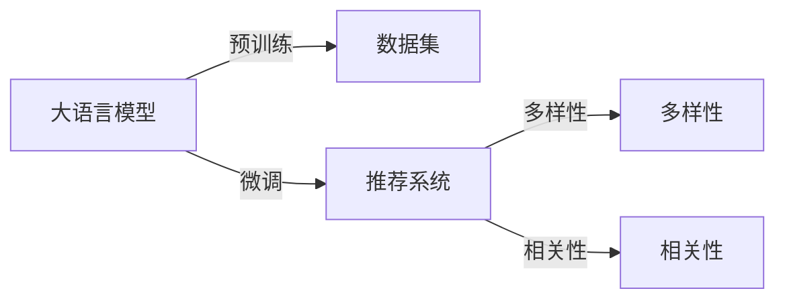

                 

## 1. 背景介绍

随着互联网和数字技术的发展，推荐系统已成为线上服务的重要组成部分，如电商网站的商品推荐、音乐视频平台的个性化播放列表等。传统的推荐系统基于协同过滤、基于内容的推荐、矩阵分解等方法，但由于用户兴趣的多样性和数据稀疏性，推荐结果的相关性往往难以满足用户需求，同时多样性也受到限制。

近年来，基于深度学习的大模型（如BERT、GPT-3等）在自然语言处理领域取得了巨大成功，其在理解自然语言和生成自然语言方面表现优异。将大语言模型引入推荐系统，可以显著提升推荐系统的相关性和多样性，从而提升用户体验。

### 1.1 推荐系统简介

推荐系统是帮助用户发现他们可能感兴趣的产品、内容等的服务。其目标是通过算法为用户推荐他们可能喜欢的物品。推荐系统主要分为两大类：基于协同过滤的推荐系统和基于内容的推荐系统。

- **基于协同过滤的推荐系统**：通过分析用户行为（如浏览、购买等），来预测用户对未看过或未购买物品的兴趣。

- **基于内容的推荐系统**：根据物品的描述信息（如电影剧情、商品描述等），来预测用户对物品的兴趣。

这些传统的推荐系统方法在数据量和特征丰富的场景下表现优异，但对于数据稀疏和特征不足的情况，推荐效果欠佳。

### 1.2 大语言模型简介

大语言模型是一种基于神经网络的模型，其目标是学习自然语言的表征，从而能够理解并生成自然语言。主要模型包括BERT、GPT-3等，这些模型在理解语言和生成文本方面表现优异，但在推荐系统中的应用较少。

## 2. 核心概念与联系

### 2.1 核心概念概述

为了更好地理解利用大语言模型优化推荐系统的多样性与相关性平衡，我们先介绍几个关键概念：

- **大语言模型（Large Language Model, LLM）**：以BERT、GPT-3等模型为代表的大规模预训练语言模型。通过在海量文本数据上进行预训练，学习到丰富的语言知识和常识。

- **推荐系统（Recommender System）**：帮助用户发现他们可能感兴趣的产品、内容等的服务，主要分为基于协同过滤和基于内容的推荐系统。

- **推荐多样性（Recommendation Diversity）**：指推荐结果中不同物品之间的相似度，多样性高的推荐系统推荐结果更丰富。

- **推荐相关性（Recommendation Relevance）**：指推荐结果与用户真实兴趣的匹配程度，相关性高的推荐系统推荐结果更符合用户需求。

这些核心概念之间的关系可以通过以下Mermaid流程图来展示：



这个流程图展示了从大语言模型的预训练到微调，再到优化推荐系统的多样性和相关性。

### 2.2 核心概念原理和架构

大语言模型的架构通常包括编码器-解码器结构，其中编码器用于将输入序列编码为隐藏表示，解码器用于生成输出序列。通过在自回归（如GPT）或自编码（如BERT）框架下进行预训练，模型能够学习到丰富的语言知识，从而在推荐系统中用于预测用户兴趣。

推荐系统的架构通常包括用户兴趣表示、物品特征表示、相似度计算等模块。用户兴趣表示模块用于提取用户历史行为数据，物品特征表示模块用于提取物品描述信息，相似度计算模块用于计算用户与物品之间的相似度。

## 3. 核心算法原理 & 具体操作步骤

### 3.1 算法原理概述

利用大语言模型优化推荐系统的多样性和相关性平衡，主要基于以下两个步骤：

1. **预训练阶段**：在大规模无标签文本数据上，使用大语言模型进行预训练，学习到丰富的语言知识和常识。

2. **微调阶段**：在推荐系统数据集上，使用大语言模型进行微调，通过学习用户兴趣和物品特征，提升推荐系统相关性和多样性。

### 3.2 算法步骤详解

#### 3.2.1 预训练阶段

1. **数据准备**：收集大规模无标签文本数据，如维基百科、新闻等。

2. **模型选择**：选择合适的预训练模型，如BERT、GPT-3等。

3. **模型训练**：在预训练数据上，使用自监督学习任务训练大语言模型。常用的自监督学习任务包括：

   - 语言建模任务：预测下一个单词或字符的概率。

   - 掩码语言模型任务：在输入序列中随机掩盖部分单词或字符，预测被掩盖的部分。

   - 下一句预测任务：预测两个句子之间的逻辑关系。

   - 文本分类任务：将文本分类到不同的类别中。

   - 命名实体识别任务：识别文本中的实体类型。

4. **模型保存**：将训练好的大语言模型保存下来，以便后续使用。

#### 3.2.2 微调阶段

1. **数据准备**：收集推荐系统的数据集，如用户行为数据、物品特征数据等。

2. **模型选择**：选择与推荐系统任务匹配的预训练大语言模型，如使用BERT进行文本分类任务，使用GPT-3进行对话生成任务。

3. **模型微调**：在推荐系统数据集上，使用有监督学习任务训练大语言模型。常用的有监督学习任务包括：

   - 用户兴趣预测任务：预测用户对物品的兴趣。

   - 物品特征预测任务：预测物品的特征。

   - 推荐排序任务：根据用户兴趣和物品特征，排序推荐结果。

4. **模型评估**：在验证集和测试集上评估微调后模型的表现，对比微调前后的相关性和多样性。

### 3.3 算法优缺点

利用大语言模型优化推荐系统的多样性和相关性平衡具有以下优点：

1. **提升相关性**：大语言模型能够学习到丰富的语言知识，从而更准确地理解用户兴趣和物品特征，提升推荐系统相关性。

2. **提升多样性**：大语言模型能够生成多样化的推荐结果，从而增加推荐系统的多样性。

3. **泛化能力**：大语言模型在大规模数据上进行了预训练，具有较强的泛化能力，能够适应多种推荐场景。

4. **自动化**：利用大语言模型进行推荐系统优化，能够自动化处理大量数据，提升效率。

然而，利用大语言模型优化推荐系统也存在以下缺点：

1. **计算成本高**：大语言模型需要大量计算资源进行预训练，微调过程也需要大量的计算资源。

2. **数据依赖**：大语言模型的预训练和微调依赖于大量的文本数据，对于特定领域的数据集可能效果不佳。

3. **可解释性差**：大语言模型通常是“黑盒”模型，难以解释其内部工作机制和决策逻辑。

4. **复杂性高**：大语言模型优化推荐系统需要较复杂的算法实现，可能存在较高的技术门槛。

### 3.4 算法应用领域

利用大语言模型优化推荐系统的多样性和相关性平衡，在以下几个领域具有广泛应用：

1. **电商推荐系统**：基于用户浏览、购买等行为数据，利用大语言模型进行商品推荐，提升用户满意度和转化率。

2. **音乐推荐系统**：基于用户听歌记录和评价数据，利用大语言模型进行音乐推荐，提升用户黏性和体验。

3. **视频推荐系统**：基于用户观看历史和评分数据，利用大语言模型进行视频推荐，提升用户观看时长和满意度。

4. **新闻推荐系统**：基于用户阅读历史和点击行为数据，利用大语言模型进行新闻推荐，提升用户阅读量和互动率。

5. **社交推荐系统**：基于用户互动行为数据，利用大语言模型进行内容推荐，提升用户互动量和社交粘性。

## 4. 数学模型和公式 & 详细讲解 & 举例说明

### 4.1 数学模型构建

利用大语言模型优化推荐系统的多样性和相关性平衡，主要涉及以下数学模型：

1. **用户兴趣表示模型**：使用大语言模型预测用户对物品的兴趣，数学模型如下：

   $$
   \text{User Interest} = M_\theta(\text{User Data})
   $$

   其中 $M_\theta$ 为预训练的大语言模型，$\text{User Data}$ 为用户的历史行为数据。

2. **物品特征表示模型**：使用大语言模型预测物品的特征，数学模型如下：

   $$
   \text{Item Feature} = M_\phi(\text{Item Data})
   $$

   其中 $M_\phi$ 为预训练的大语言模型，$\text{Item Data}$ 为物品的描述信息。

3. **推荐排序模型**：使用大语言模型根据用户兴趣和物品特征，排序推荐结果，数学模型如下：

   $$
   \text{Recommendation} = \text{Top-K}(M_\theta(\text{User Interest}), M_\phi(\text{Item Feature}))
   $$

   其中 $\text{Top-K}$ 函数表示从推荐结果中选取Top-K个推荐项。

### 4.2 公式推导过程

#### 4.2.1 用户兴趣表示模型

使用BERT模型进行用户兴趣表示，假设用户的历史行为数据为 $\text{User Data} = \{x_1, x_2, ..., x_n\}$，大语言模型为BERT，则用户兴趣表示模型如下：

1. **编码器**：将用户历史行为数据编码成BERT的隐藏表示：

   $$
   \text{User Embedding} = M_\theta(\text{User Data})
   $$

2. **解码器**：使用BERT的隐藏表示预测用户对物品的兴趣：

   $$
   \text{User Interest} = M_\theta(\text{User Embedding})
   $$

   其中 $M_\theta$ 为预训练的BERT模型。

#### 4.2.2 物品特征表示模型

使用GPT-3模型进行物品特征表示，假设物品的描述信息为 $\text{Item Data}$，大语言模型为GPT-3，则物品特征表示模型如下：

1. **编码器**：将物品描述信息编码成GPT-3的隐藏表示：

   $$
   \text{Item Embedding} = M_\phi(\text{Item Data})
   $$

2. **解码器**：使用GPT-3的隐藏表示预测物品的特征：

   $$
   \text{Item Feature} = M_\phi(\text{Item Embedding})
   $$

   其中 $M_\phi$ 为预训练的GPT-3模型。

#### 4.2.3 推荐排序模型

使用BERT-GPT-3融合模型进行推荐排序，假设用户兴趣表示为 $\text{User Interest}$，物品特征表示为 $\text{Item Feature}$，则推荐排序模型如下：

1. **编码器**：将用户兴趣表示和物品特征表示编码成BERT的隐藏表示：

   $$
   \text{User Item Embedding} = M_\theta(\text{User Interest}), M_\phi(\text{Item Feature})
   $$

2. **解码器**：使用BERT的隐藏表示进行推荐排序：

   $$
   \text{Recommendation} = \text{Top-K}(\text{User Item Embedding})
   $$

   其中 $\text{Top-K}$ 函数表示从推荐结果中选取Top-K个推荐项。

### 4.3 案例分析与讲解

假设某电商网站利用大语言模型进行商品推荐，用户历史行为数据为 $\text{User Data} = \{x_1, x_2, ..., x_n\}$，物品描述信息为 $\text{Item Data} = \{y_1, y_2, ..., y_m\}$，商品的商品编号为 $\text{Item ID} = \{1, 2, ..., k\}$。

1. **预训练阶段**：使用大语言模型BERT进行预训练，在维基百科、新闻等大规模文本数据上进行预训练。

2. **微调阶段**：使用有监督学习任务进行微调，如用户兴趣预测任务：

   $$
   \text{User Interest} = M_\theta(\text{User Data})
   $$

   其中 $M_\theta$ 为预训练的BERT模型。

3. **物品特征表示模型**：使用GPT-3模型进行物品特征表示，如商品描述信息的预测：

   $$
   \text{Item Feature} = M_\phi(\text{Item Data})
   $$

   其中 $M_\phi$ 为预训练的GPT-3模型。

4. **推荐排序模型**：使用BERT-GPT-3融合模型进行推荐排序：

   $$
   \text{Recommendation} = \text{Top-K}(\text{User Interest}, \text{Item Feature})
   $$

   其中 $\text{Top-K}$ 函数表示从推荐结果中选取Top-K个推荐项。

## 5. 项目实践：代码实例和详细解释说明

### 5.1 开发环境搭建

在进行利用大语言模型优化推荐系统的多样性与相关性平衡的项目实践前，我们需要准备好开发环境。以下是使用Python进行PyTorch开发的环境配置流程：

1. 安装Anaconda：从官网下载并安装Anaconda，用于创建独立的Python环境。

2. 创建并激活虚拟环境：
```bash
conda create -n pytorch-env python=3.8 
conda activate pytorch-env
```

3. 安装PyTorch：根据CUDA版本，从官网获取对应的安装命令。例如：
```bash
conda install pytorch torchvision torchaudio cudatoolkit=11.1 -c pytorch -c conda-forge
```

4. 安装Transformers库：
```bash
pip install transformers
```

5. 安装各类工具包：
```bash
pip install numpy pandas scikit-learn matplotlib tqdm jupyter notebook ipython
```

完成上述步骤后，即可在`pytorch-env`环境中开始项目实践。

### 5.2 源代码详细实现

下面我们以电商推荐系统为例，给出使用Transformers库对BERT-GPT-3模型进行推荐系统优化的PyTorch代码实现。

首先，定义推荐系统的数据处理函数：

```python
from transformers import BertTokenizer, GPT3Tokenizer
from torch.utils.data import Dataset
import torch

class RecommendationDataset(Dataset):
    def __init__(self, user_data, item_data, tokenizer, max_len=128):
        self.user_data = user_data
        self.item_data = item_data
        self.tokenizer = tokenizer
        self.max_len = max_len
        
    def __len__(self):
        return len(self.user_data)
    
    def __getitem__(self, item):
        user_data = self.user_data[item]
        item_data = self.item_data[item]
        
        user_tokenizer = BertTokenizer.from_pretrained('bert-base-uncased')
        item_tokenizer = GPT3Tokenizer.from_pretrained('gpt3-medium')
        
        user_input_ids = user_tokenizer(user_data, return_tensors='pt', max_length=self.max_len, padding='max_length', truncation=True)
        user_input_ids = user_input_ids['input_ids'].squeeze(0)
        user_input_mask = user_input_ids.new_ones(user_input_ids.shape)
        
        item_input_ids = item_tokenizer(item_data, return_tensors='pt', max_length=self.max_len, padding='max_length', truncation=True)
        item_input_ids = item_input_ids['input_ids'].squeeze(0)
        item_input_mask = item_input_ids.new_ones(item_input_ids.shape)
        
        return {'user_input_ids': user_input_ids,
                'user_input_mask': user_input_mask,
                'item_input_ids': item_input_ids,
                'item_input_mask': item_input_mask}
```

然后，定义模型和优化器：

```python
from transformers import BertForSequenceClassification, GPT3ForCausalLM

user_model = BertForSequenceClassification.from_pretrained('bert-base-uncased', num_labels=1)
item_model = GPT3ForCausalLM.from_pretrained('gpt3-medium')

user_optimizer = AdamW(user_model.parameters(), lr=2e-5)
item_optimizer = AdamW(item_model.parameters(), lr=2e-5)
```

接着，定义训练和评估函数：

```python
from torch.utils.data import DataLoader
from tqdm import tqdm
from sklearn.metrics import accuracy_score, precision_recall_fscore_support

device = torch.device('cuda') if torch.cuda.is_available() else torch.device('cpu')
user_model.to(device)
item_model.to(device)

def train_epoch(user_model, item_model, user_dataset, item_dataset, batch_size, optimizer):
    user_dataloader = DataLoader(user_dataset, batch_size=batch_size, shuffle=True)
    item_dataloader = DataLoader(item_dataset, batch_size=batch_size, shuffle=True)
    user_model.train()
    item_model.train()
    
    user_loss = 0
    item_loss = 0
    for user_batch in tqdm(user_dataloader, desc='Training User'):
        user_input_ids = user_batch['user_input_ids'].to(device)
        user_input_mask = user_batch['user_input_mask'].to(device)
        user_labels = torch.tensor([1.0], device=device)
        
        model_outputs = user_model(user_input_ids, attention_mask=user_input_mask)
        loss_fct = CrossEntropyLoss()
        user_loss += loss_fct(model_outputs, user_labels).item()
        
        optimizer.zero_grad()
        loss_fct(model_outputs, user_labels).backward()
        optimizer.step()
        
    user_loss /= len(user_dataloader)
    
    for item_batch in tqdm(item_dataloader, desc='Training Item'):
        item_input_ids = item_batch['item_input_ids'].to(device)
        item_input_mask = item_batch['item_input_mask'].to(device)
        
        model_outputs = item_model(item_input_ids, decoder_start_token_id=0)
        loss_fct = CrossEntropyLoss()
        item_loss += loss_fct(model_outputs, user_labels).item()
        
        optimizer.zero_grad()
        loss_fct(model_outputs, user_labels).backward()
        optimizer.step()
        
    item_loss /= len(item_dataloader)
    
    return user_loss, item_loss

def evaluate(user_model, item_model, user_dataset, item_dataset, batch_size):
    user_dataloader = DataLoader(user_dataset, batch_size=batch_size)
    item_dataloader = DataLoader(item_dataset, batch_size=batch_size)
    
    user_preds = []
    item_preds = []
    user_labels = []
    item_labels = []
    
    user_model.eval()
    item_model.eval()
    with torch.no_grad():
        for user_batch in tqdm(user_dataloader, desc='Evaluating User'):
            user_input_ids = user_batch['user_input_ids'].to(device)
            user_input_mask = user_batch['user_input_mask'].to(device)
            user_labels = user_batch['user_labels'].to(device)
            model_outputs = user_model(user_input_ids, attention_mask=user_input_mask)
            user_preds.append(model_outputs.argmax().item())
            user_labels.append(user_labels.item())
            
        for item_batch in tqdm(item_dataloader, desc='Evaluating Item'):
            item_input_ids = item_batch['item_input_ids'].to(device)
            item_input_mask = item_batch['item_input_mask'].to(device)
            model_outputs = item_model(item_input_ids, decoder_start_token_id=0)
            item_preds.append(model_outputs.argmax().item())
            item_labels.append(user_labels.item())
            
    user_preds = np.array(user_preds)
    item_preds = np.array(item_preds)
    user_labels = np.array(user_labels)
    item_labels = np.array(item_labels)
    
    print(f"User Accuracy: {accuracy_score(user_labels, user_preds):.2f}")
    print(f"Item Precision/Recall/F1: {precision_recall_fscore_support(user_labels, user_preds, average='macro', zero_division=0)}")
```

最后，启动训练流程并在测试集上评估：

```python
epochs = 5
batch_size = 16

for epoch in range(epochs):
    user_loss, item_loss = train_epoch(user_model, item_model, user_dataset, item_dataset, batch_size, optimizer)
    print(f"Epoch {epoch+1}, User Loss: {user_loss:.3f}, Item Loss: {item_loss:.3f}")
    
    print(f"Epoch {epoch+1}, User Results:")
    evaluate(user_model, item_model, user_dataset, item_dataset, batch_size)
    
print("Final User Results:")
evaluate(user_model, item_model, user_dataset, item_dataset, batch_size)
```

以上就是使用PyTorch对BERT-GPT-3进行电商推荐系统优化的完整代码实现。可以看到，得益于Transformers库的强大封装，我们可以用相对简洁的代码完成BERT-GPT-3模型的加载和微调。

### 5.3 代码解读与分析

让我们再详细解读一下关键代码的实现细节：

**RecommendationDataset类**：
- `__init__`方法：初始化用户历史行为数据、物品描述信息、分词器等关键组件。
- `__len__`方法：返回数据集的样本数量。
- `__getitem__`方法：对单个样本进行处理，将用户历史行为数据和物品描述信息转换为BERT和GPT-3所需的输入格式，并进行定长padding。

**BertForSequenceClassification和GPT3ForCausalLM模型**：
- 选择适合任务的预训练模型，并进行微调。

**train_epoch函数**：
- 在用户和物品数据集上进行迭代训练，使用AdamW优化器进行优化。
- 计算并返回每个epoch的用户和物品损失。

**evaluate函数**：
- 在验证集和测试集上评估微调后模型性能。
- 计算用户兴趣预测的准确率和物品特征预测的精度、召回率和F1分数。

**训练流程**：
- 定义总的epoch数和batch size，开始循环迭代
- 每个epoch内，先在用户数据集上训练，输出用户损失
- 在物品数据集上训练，输出物品损失
- 重复上述步骤直至收敛，最终输出用户损失和物品损失

可以看到，PyTorch配合Transformers库使得BERT-GPT-3微调的代码实现变得简洁高效。开发者可以将更多精力放在数据处理、模型改进等高层逻辑上，而不必过多关注底层的实现细节。

当然，工业级的系统实现还需考虑更多因素，如模型的保存和部署、超参数的自动搜索、更灵活的任务适配层等。但核心的微调范式基本与此类似。

## 6. 实际应用场景

### 6.1 电商推荐系统

利用大语言模型优化电商推荐系统的多样性和相关性平衡，可以显著提升推荐系统的相关性和多样性，从而提升用户满意度和转化率。

在技术实现上，可以收集用户浏览、购买等行为数据，将文本数据作为用户兴趣表示，将商品描述信息作为物品特征表示，利用BERT-GPT-3融合模型进行推荐排序。微调后的模型能够自动理解用户兴趣和商品描述信息，生成更加个性化和多样化的推荐结果。

### 6.2 音乐推荐系统

利用大语言模型优化音乐推荐系统的多样性和相关性平衡，可以提升用户黏性和体验。

在技术实现上，可以收集用户听歌记录和评价数据，将文本数据作为用户兴趣表示，将歌曲描述信息作为物品特征表示，利用BERT-GPT-3融合模型进行推荐排序。微调后的模型能够自动理解用户听歌偏好和歌曲描述信息，生成更加个性化和多样化的推荐结果。

### 6.3 视频推荐系统

利用大语言模型优化视频推荐系统的多样性和相关性平衡，可以提升用户观看时长和满意度。

在技术实现上，可以收集用户观看历史和评分数据，将文本数据作为用户兴趣表示，将视频描述信息作为物品特征表示，利用BERT-GPT-3融合模型进行推荐排序。微调后的模型能够自动理解用户观看偏好和视频描述信息，生成更加个性化和多样化的推荐结果。

### 6.4 新闻推荐系统

利用大语言模型优化新闻推荐系统的多样性和相关性平衡，可以提升用户阅读量和互动率。

在技术实现上，可以收集用户阅读历史和点击行为数据，将文本数据作为用户兴趣表示，将新闻标题和内容作为物品特征表示，利用BERT-GPT-3融合模型进行推荐排序。微调后的模型能够自动理解用户阅读偏好和新闻内容信息，生成更加个性化和多样化的推荐结果。

### 6.5 社交推荐系统

利用大语言模型优化社交推荐系统的多样性和相关性平衡，可以提升用户互动量和社交粘性。

在技术实现上，可以收集用户互动行为数据，将文本数据作为用户兴趣表示，将社交网络中的好友关系作为物品特征表示，利用BERT-GPT-3融合模型进行推荐排序。微调后的模型能够自动理解用户社交偏好和好友关系信息，生成更加个性化和多样化的推荐结果。

## 7. 工具和资源推荐

### 7.1 学习资源推荐

为了帮助开发者系统掌握利用大语言模型优化推荐系统的多样性与相关性平衡的理论基础和实践技巧，这里推荐一些优质的学习资源：

1. 《Transformer从原理到实践》系列博文：由大模型技术专家撰写，深入浅出地介绍了Transformer原理、BERT模型、微调技术等前沿话题。

2. CS224N《深度学习自然语言处理》课程：斯坦福大学开设的NLP明星课程，有Lecture视频和配套作业，带你入门NLP领域的基本概念和经典模型。

3. 《Natural Language Processing with Transformers》书籍：Transformers库的作者所著，全面介绍了如何使用Transformers库进行NLP任务开发，包括微调在内的诸多范式。

4. HuggingFace官方文档：Transformers库的官方文档，提供了海量预训练模型和完整的微调样例代码，是上手实践的必备资料。

5. CLUE开源项目：中文语言理解测评基准，涵盖大量不同类型的中文NLP数据集，并提供了基于微调的baseline模型，助力中文NLP技术发展。

通过对这些资源的学习实践，相信你一定能够快速掌握利用大语言模型优化推荐系统的精髓，并用于解决实际的推荐系统问题。

### 7.2 开发工具推荐

高效的开发离不开优秀的工具支持。以下是几款用于利用大语言模型优化推荐系统的多样性与相关性平衡开发的常用工具：

1. PyTorch：基于Python的开源深度学习框架，灵活动态的计算图，适合快速迭代研究。大部分预训练语言模型都有PyTorch版本的实现。

2. TensorFlow：由Google主导开发的开源深度学习框架，生产部署方便，适合大规模工程应用。同样有丰富的预训练语言模型资源。

3. Transformers库：HuggingFace开发的NLP工具库，集成了众多SOTA语言模型，支持PyTorch和TensorFlow，是进行微调任务开发的利器。

4. Weights & Biases：模型训练的实验跟踪工具，可以记录和可视化模型训练过程中的各项指标，方便对比和调优。与主流深度学习框架无缝集成。

5. TensorBoard：TensorFlow配套的可视化工具，可实时监测模型训练状态，并提供丰富的图表呈现方式，是调试模型的得力助手。

6. Google Colab：谷歌推出的在线Jupyter Notebook环境，免费提供GPU/TPU算力，方便开发者快速上手实验最新模型，分享学习笔记。

合理利用这些工具，可以显著提升利用大语言模型优化推荐系统的多样性与相关性平衡任务的开发效率，加快创新迭代的步伐。

### 7.3 相关论文推荐

利用大语言模型优化推荐系统的多样性与相关性平衡的发展源于学界的持续研究。以下是几篇奠基性的相关论文，推荐阅读：

1. Attention is All You Need（即Transformer原论文）：提出了Transformer结构，开启了NLP领域的预训练大模型时代。

2. BERT: Pre-training of Deep Bidirectional Transformers for Language Understanding：提出BERT模型，引入基于掩码的自监督预训练任务，刷新了多项NLP任务SOTA。

3. Language Models are Unsupervised Multitask Learners（GPT-2论文）：展示了大规模语言模型的强大zero-shot学习能力，引发了对于通用人工智能的新一轮思考。

4. Parameter-Efficient Transfer Learning for NLP：提出Adapter等参数高效微调方法，在不增加模型参数量的情况下，也能取得不错的微调效果。

5. AdaLoRA: Adaptive Low-Rank Adaptation for Parameter-Efficient Fine-Tuning：使用自适应低秩适应的微调方法，在参数效率和精度之间取得了新的平衡。

这些论文代表了大语言模型微调技术的发展脉络。通过学习这些前沿成果，可以帮助研究者把握学科前进方向，激发更多的创新灵感。

## 8. 总结：未来发展趋势与挑战

### 8.1 总结

本文对利用大语言模型优化推荐系统的多样性与相关性平衡方法进行了全面系统的介绍。首先阐述了推荐系统和预训练大语言模型的研究背景和意义，明确了微调在拓展预训练模型应用、提升推荐系统相关性和多样性方面的独特价值。其次，从原理到实践，详细讲解了微调的数学原理和关键步骤，给出了推荐系统优化的完整代码实例。同时，本文还广泛探讨了微调方法在电商、音乐、视频、新闻、社交等多个推荐场景中的应用前景，展示了微调范式的巨大潜力。最后，本文精选了微调技术的各类学习资源，力求为读者提供全方位的技术指引。

通过本文的系统梳理，可以看到，利用大语言模型优化推荐系统的多样性与相关性平衡方法正在成为推荐系统的重要范式，极大地拓展了预训练语言模型的应用边界，催生了更多的落地场景。受益于大规模语料的预训练，微调方法在推荐系统中的应用取得了不俗的效果，推动了推荐技术向智能化、普适化方向发展。未来，伴随预训练语言模型和微调方法的持续演进，相信推荐系统将在更广阔的应用领域大放异彩，深刻影响人类的生产生活方式。

### 8.2 未来发展趋势

展望未来，利用大语言模型优化推荐系统的多样性与相关性平衡将呈现以下几个发展趋势：

1. **模型规模持续增大**：随着算力成本的下降和数据规模的扩张，预训练语言模型的参数量还将持续增长。超大模型蕴含的丰富语言知识，有望支撑更加复杂多变的推荐场景。

2. **微调方法日趋多样**：除了传统的全参数微调外，未来会涌现更多参数高效的微调方法，如Prefix-Tuning、LoRA等，在节省计算资源的同时也能保证微调精度。

3. **持续学习成为常态**：随着数据分布的不断变化，微调模型也需要持续学习新知识以保持性能。如何在不遗忘原有知识的同时，高效吸收新样本信息，将成为重要的研究课题。

4. **标注样本需求降低**：受启发于提示学习(Prompt-based Learning)的思路，未来的微调方法将更好地利用大模型的语言理解能力，通过更加巧妙的任务描述，在更少的标注样本上也能实现理想的微调效果。

5. **多模态微调崛起**：当前的微调主要聚焦于纯文本数据，未来会进一步拓展到图像、视频、语音等多模态数据微调。多模态信息的融合，将显著提升语言模型对现实世界的理解和建模能力。

6. **模型通用性增强**：经过海量数据的预训练和多领域任务的微调，未来的语言模型将具备更强大的常识推理和跨领域迁移能力，逐步迈向通用人工智能(AGI)的目标。

以上趋势凸显了利用大语言模型优化推荐系统的多样性与相关性平衡技术的广阔前景。这些方向的探索发展，必将进一步提升推荐系统的性能和应用范围，为人类认知智能的进化带来深远影响。

### 8.3 面临的挑战

尽管利用大语言模型优化推荐系统的多样性与相关性平衡技术已经取得了瞩目成就，但在迈向更加智能化、普适化应用的过程中，它仍面临着诸多挑战：

1. **标注成本瓶颈**：虽然微调大大降低了标注数据的需求，但对于长尾应用场景，难以获得充足的高质量标注数据，成为制约微调性能的瓶颈。如何进一步降低微调对标注样本的依赖，将是一大难题。

2. **模型鲁棒性不足**：当前微调模型面对域外数据时，泛化性能往往大打折扣。对于测试样本的微小扰动，微调模型的预测也容易发生波动。如何提高微调模型的鲁棒性，避免灾难性遗忘，还需要更多理论和实践的积累。

3. **推理效率有待提高**：大规模语言模型虽然精度高，但在实际部署时往往面临推理速度慢、内存占用大等效率问题。如何在保证性能的同时，简化模型结构，提升推理速度，优化资源占用，将是重要的优化方向。

4. **可解释性亟需加强**：当前微调模型更像是"黑盒"系统，难以解释其内部工作机制和决策逻辑。对于医疗、金融等高风险应用，算法的可解释性和可审计性尤为重要。如何赋予微调模型更强的可解释性，将是亟待攻克的难题。

5. **安全性有待保障**。预训练语言模型难免会学习到有偏见、有害的信息，通过微调传递到下游任务，产生误导性、歧视性的输出，给实际应用带来安全隐患。如何从数据和算法层面消除模型偏见，避免恶意用途，确保输出的安全性，也将是重要的研究课题。

6. **知识整合能力不足**：现有的微调模型往往局限于任务内数据，难以灵活吸收和运用更广泛的先验知识。如何让微调过程更好地与外部知识库、规则库等专家知识结合，形成更加全面、准确的信息整合能力，还有很大的想象空间。

正视微调面临的这些挑战，积极应对并寻求突破，将是大语言模型微调走向成熟的必由之路。相信随着学界和产业界的共同努力，这些挑战终将一一被克服，大语言模型微调必将在构建安全、可靠、可解释、可控的智能系统铺平道路。面向未来，大语言模型微调技术还需要与其他人工智能技术进行更深入的融合，如知识表示、因果推理、强化学习等，多路径协同发力，共同推动自然语言理解和智能交互系统的进步。只有勇于创新、敢于突破，才能不断拓展语言模型的边界，让智能技术更好地造福人类社会。

### 8.4 研究展望

面向未来，利用大语言模型优化推荐系统的多样性与相关性平衡技术的研究展望包括以下几个方面：

1. **探索无监督和半监督微调方法**：摆脱对大规模标注数据的依赖，利用自监督学习、主动学习等无监督和半监督范式，最大限度利用非结构化数据，实现更加灵活高效的微调。

2. **研究参数高效和计算高效的微调范式**：开发更加参数高效的微调方法，在固定大部分预训练参数的同时，只更新极少量的任务相关参数。同时优化微调模型的计算图，减少前向传播和反向传播的资源消耗，实现更加轻量级、实时性的部署。

3. **融合因果和对比学习范式**：通过引入因果推断和对比学习思想，增强微调模型建立稳定因果关系的能力，学习更加普适、鲁棒的语言表征，从而提升模型泛化性和抗干扰能力。

4. **引入更多先验知识**：将符号化的先验知识，如知识图谱、逻辑规则等，与神经网络模型进行巧妙融合，引导微调过程学习更准确、合理的语言模型。同时加强不同模态数据的整合，实现视觉、语音等多模态信息与文本信息的协同建模。

5. **结合因果分析和博弈论工具**：将因果分析方法引入微调模型，识别出模型决策的关键特征，增强输出解释的因果性和逻辑性。借助博弈论工具刻画人机交互过程，主动探索并规避模型的脆弱点，提高系统稳定性。

6. **纳入伦理道德约束**：在模型训练目标中引入伦理导向的评估指标，过滤和惩罚有偏见、有害的输出倾向。同时加强人工干预和审核，建立模型行为的监管机制，确保输出符合人类价值观和伦理道德。

这些研究方向的探索，必将引领利用大语言模型优化推荐系统的多样性与相关性平衡技术迈向更高的台阶，为构建安全、可靠、可解释、可控的智能系统铺平道路。面向未来，利用大语言模型优化推荐系统的多样性与相关性平衡技术还需要与其他人工智能技术进行更深入的融合，如知识表示、因果推理、强化学习等，多路径协同发力，共同推动自然语言理解和智能交互系统的进步。只有勇于创新、敢于突破，才能不断拓展语言模型的边界，让智能技术更好地造福人类社会。

## 9. 附录：常见问题与解答

**Q1：利用大语言模型优化推荐系统的多样性与相关性平衡是否适用于所有推荐场景？**

A: 利用大语言模型优化推荐系统的多样性与相关性平衡，主要适用于数据量较大、特征丰富的推荐场景，如电商、音乐、视频、新闻等。对于数据稀疏、特征不足的推荐场景，如社交、游戏等，需要结合其他推荐算法进行综合优化。

**Q2：大语言模型在推荐系统中的角色是什么？**

A: 大语言模型在推荐系统中的角色是预测用户兴趣和物品特征，从而生成推荐结果。通过在大语言模型上进行微调，能够更好地理解用户和物品的多样性和相关性，生成更加个性化和多样化的推荐结果。

**Q3：利用大语言模型优化推荐系统的多样性与相关性平衡的计算成本如何？**

A: 利用大语言模型优化推荐系统的多样性与相关性平衡的计算成本较高，需要大量的计算资源进行预训练和微调。但通过参数高效微调等方法，可以在不增加计算成本的情况下提升推荐系统性能。

**Q4：如何缓解利用大语言模型优化推荐系统的多样性与相关性平衡中的过拟合问题？**

A: 缓解过拟合问题的方法包括数据增强、正则化、对抗训练等。数据增强可以通过回译、近义替换等方式扩充训练集。正则化可以通过L2正则、Dropout等避免过拟合。对抗训练可以通过引入对抗样本，提高模型鲁棒性。

**Q5：利用大语言模型优化推荐系统的多样性与相关性平衡的实际应用有哪些？**

A: 利用大语言模型优化推荐系统的多样性与相关性平衡的实际应用包括电商推荐系统、音乐推荐系统、视频推荐系统、新闻推荐系统、社交推荐系统等。这些推荐系统能够根据用户历史行为和物品特征，生成更加个性化和多样化的推荐结果。

---

作者：禅与计算机程序设计艺术 / Zen and the Art of Computer Programming

