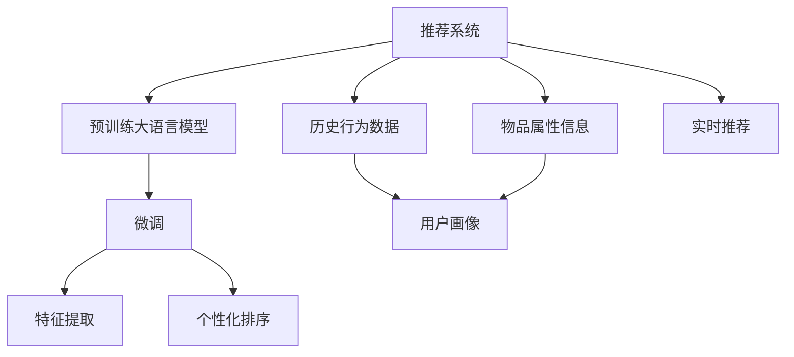

                 

## 1. 背景介绍

推荐系统在电商、新闻、音乐、视频等多个领域具有举足轻重的地位，为产品提供个性化推荐，提升用户体验。目前主流的推荐算法包括基于协同过滤、基于矩阵分解、基于深度学习等方法，这些方法在很大程度上依赖于用户历史行为数据和物品属性信息。然而，在实际应用中，用户历史数据往往难以获取，用户画像也不够全面，因此传统的推荐算法难以充分挖掘用户需求和物品价值。

## 2. 核心概念与联系

### 2.1 核心概念概述

为了充分利用大语言模型(LLM)的优势，在推荐系统中引入个性化排序优化，这里需要一些核心概念：

- 大语言模型(LLM)：指以Transformer为代表的自回归语言模型，如GPT-3、BERT等。通过预训练在文本数据上学习语言的通用表示，具备强大的文本理解和生成能力。
- 推荐系统：一种以个性化推荐为核心功能的信息过滤系统，旨在向用户推荐符合其兴趣的内容，如商品、新闻、视频等。
- 个性化排序：根据用户的个性化需求和偏好，对推荐内容进行排序，提升推荐的精准度和相关性。
- 预训练-微调：指使用大规模无标签数据对模型进行预训练，再用小规模标注数据进行微调，以适应特定任务的方法。

这些核心概念之间存在紧密的联系，共同构成推荐系统中的个性化排序优化范式。

### 2.2 核心概念原理和架构的 Mermaid 流程图



## 3. 核心算法原理 & 具体操作步骤

### 3.1 算法原理概述

基于大语言模型的个性化排序优化，本质上是一个深度学习的迁移学习过程。其核心思想是：利用预训练大语言模型在自然语言处理(NLP)领域的强大能力，将其应用于推荐系统的个性化排序任务，通过微调优化模型性能，使其能够更好地适应特定推荐场景。

形式化地，假设推荐系统中的物品集合为 $\mathcal{I}$，用户集合为 $\mathcal{U}$，已知的用户历史行为数据为 $D=\{(x_i,y_i)\}_{i=1}^N$，其中 $x_i$ 为用户行为，$y_i$ 为物品id。

定义推荐模型为 $M_{\theta}:\mathcal{I} \times \mathcal{U} \rightarrow [0,1]$，表示物品 $i$ 推荐给用户 $u$ 的概率。推荐排序的目标是最小化用户满意度损失函数 $\mathcal{L}_{\text{sorted}}$，即：

$$
\mathcal{L}_{\text{sorted}}(\theta) = \frac{1}{N} \sum_{i=1}^N \sum_{u=1}^N \ell(M_{\theta}(i,u),y_i)
$$

其中，$\ell$ 为交叉熵损失函数，$M_{\theta}(i,u)$ 为模型在物品 $i$ 推荐给用户 $u$ 时的预测概率。

通过梯度下降等优化算法，微调过程不断更新模型参数 $\theta$，最小化损失函数 $\mathcal{L}_{\text{sorted}}$，使得模型预测的推荐排序与用户历史行为数据 $y_i$ 尽可能接近。

### 3.2 算法步骤详解

基于大语言模型的个性化排序优化一般包括以下几个关键步骤：

**Step 1: 准备预训练模型和数据集**
- 选择合适的预训练语言模型 $M_{\theta}$ 作为初始化参数，如 BERT、GPT 等。
- 准备推荐系统中的历史行为数据集 $D$，划分为训练集、验证集和测试集。一般要求标注数据与预训练数据的分布不要差异过大。

**Step 2: 添加推荐排序层**
- 根据推荐系统任务类型，在预训练模型顶层设计合适的输出层和损失函数。
- 对于推荐排序任务，通常使用交叉熵损失函数，同时设置top-k排序策略，用于限制推荐结果数量。

**Step 3: 设置微调超参数**
- 选择合适的优化算法及其参数，如 AdamW、SGD 等，设置学习率、批大小、迭代轮数等。
- 设置正则化技术及强度，包括权重衰减、Dropout、Early Stopping等。
- 确定冻结预训练参数的策略，如仅微调顶层，或全部参数都参与微调。

**Step 4: 执行梯度训练**
- 将训练集数据分批次输入模型，前向传播计算损失函数。
- 反向传播计算参数梯度，根据设定的优化算法和学习率更新模型参数。
- 周期性在验证集上评估模型性能，根据性能指标决定是否触发 Early Stopping。
- 重复上述步骤直到满足预设的迭代轮数或 Early Stopping 条件。

**Step 5: 测试和部署**
- 在测试集上评估微调后模型 $M_{\hat{\theta}}$ 的性能，对比微调前后的精度提升。
- 使用微调后的模型对新样本进行推理预测，集成到实际的应用系统中。
- 持续收集新的数据，定期重新微调模型，以适应数据分布的变化。

### 3.3 算法优缺点

基于大语言模型的个性化排序优化方法具有以下优点：
1. 高效准确：利用预训练大语言模型在NLP领域的强大能力，可以有效提升推荐系统的准确性和相关性。
2. 泛化性强：大语言模型在多领域具有较强的泛化能力，能够应用于不同场景的个性化推荐。
3. 低成本：不需要从头训练模型，只需微调预训练模型，大大降低了开发成本。
4. 实时性高：大语言模型微调后的推理速度快，能够实时进行个性化推荐，提升用户体验。

同时，该方法也存在一定的局限性：
1. 数据依赖度高：微调效果很大程度上取决于标注数据的质量和数量，高质量标注数据的获取成本较高。
2. 模型复杂度高：大语言模型参数量大，微调时需要较高的计算资源和存储资源。
3. 应用领域限制：对于特定领域的推荐任务，微调效果可能不理想，需要进一步的领域适配。

尽管存在这些局限性，但就目前而言，基于大语言模型的个性化排序优化方法仍是大规模推荐系统中优化推荐效果的重要手段。

### 3.4 算法应用领域

基于大语言模型的个性化排序优化方法，在推荐系统领域已经得到了广泛的应用，覆盖了电商、新闻、音乐、视频等多个领域，具体包括：

- 商品推荐：如亚马逊、淘宝等电商平台的个性化推荐。
- 内容推荐：如Netflix、YouTube等平台的视频内容推荐。
- 新闻推荐：如今日头条、百度新闻等平台的新闻内容推荐。
- 音乐推荐：如Spotify、网易云音乐等平台的个性化音乐推荐。

除了这些经典应用外，个性化排序优化方法还被创新性地应用于更多场景中，如多模态推荐、社交网络推荐等，为推荐系统带来了新的突破。

## 4. 数学模型和公式 & 详细讲解 & 举例说明

### 4.1 数学模型构建

假设推荐系统中的物品集合为 $\mathcal{I}$，用户集合为 $\mathcal{U}$，已知的用户历史行为数据为 $D=\{(x_i,y_i)\}_{i=1}^N$，其中 $x_i$ 为用户行为，$y_i$ 为物品id。

定义推荐模型为 $M_{\theta}:\mathcal{I} \times \mathcal{U} \rightarrow [0,1]$，表示物品 $i$ 推荐给用户 $u$ 的概率。推荐排序的目标是最小化用户满意度损失函数 $\mathcal{L}_{\text{sorted}}$，即：

$$
\mathcal{L}_{\text{sorted}}(\theta) = \frac{1}{N} \sum_{i=1}^N \sum_{u=1}^N \ell(M_{\theta}(i,u),y_i)
$$

其中，$\ell$ 为交叉熵损失函数，$M_{\theta}(i,u)$ 为模型在物品 $i$ 推荐给用户 $u$ 时的预测概率。

### 4.2 公式推导过程

下面以推荐排序任务为例，详细推导模型训练过程。

假设推荐模型 $M_{\theta}$ 在物品 $i$ 推荐给用户 $u$ 时的输出为 $\hat{y}_i=\log \frac{M_{\theta}(i,u)}{1-M_{\theta}(i,u)}$。则交叉熵损失函数为：

$$
\ell(M_{\theta}(i,u),y_i) = -[y_i\hat{y}_i + (1-y_i)\log(1-\hat{y}_i)]
$$

将其代入经验风险公式，得：

$$
\mathcal{L}_{\text{sorted}}(\theta) = -\frac{1}{N}\sum_{i=1}^N \sum_{u=1}^N [y_i \log M_{\theta}(i,u) + (1-y_i)\log(1-M_{\theta}(i,u))]
$$

根据链式法则，损失函数对参数 $\theta_k$ 的梯度为：

$$
\frac{\partial \mathcal{L}_{\text{sorted}}(\theta)}{\partial \theta_k} = -\frac{1}{N}\sum_{i=1}^N \sum_{u=1}^N (\frac{y_i}{M_{\theta}(i,u)}-\frac{1-y_i}{1-M_{\theta}(i,u)}) \frac{\partial M_{\theta}(i,u)}{\partial \theta_k}
$$

其中 $\frac{\partial M_{\theta}(i,u)}{\partial \theta_k}$ 可进一步递归展开，利用自动微分技术完成计算。

### 4.3 案例分析与讲解

以亚马逊的个性化商品推荐为例，分析如何使用大语言模型进行微调优化。

假设亚马逊有一个用户行为数据集 $D=\{(x_i,y_i)\}_{i=1}^N$，其中 $x_i$ 为用户浏览商品的行为序列，$y_i$ 为用户后续购买的商品id。

步骤1：准备预训练模型和数据集
- 选择BERT模型作为初始化参数。
- 将用户行为序列 $x_i$ 转化为BERT的输入形式，使用预先训练好的BERT模型获得用户行为向量和物品id的嵌入向量。
- 将用户行为向量和物品嵌入向量拼接，输入到预训练模型的顶层分类器中，得到推荐概率。

步骤2：添加推荐排序层
- 使用交叉熵损失函数 $\ell(M_{\theta}(i,u),y_i)$ 作为损失函数。
- 设置top-k排序策略，限制推荐结果数量。

步骤3：设置微调超参数
- 使用AdamW优化器，设置学习率为1e-5。
- 使用L2正则和Dropout防止过拟合。
- 仅微调顶层分类器，保持预训练的BERT参数不变。

步骤4：执行梯度训练
- 将训练集数据分批次输入模型，前向传播计算损失函数。
- 反向传播计算参数梯度，根据AdamW算法更新模型参数。
- 周期性在验证集上评估模型性能，决定是否触发Early Stopping。
- 重复上述步骤直到满足预设的迭代轮数或Early Stopping条件。

步骤5：测试和部署
- 在测试集上评估微调后的模型性能，对比微调前后的推荐效果。
- 使用微调后的模型对新商品进行推荐排序，集成到亚马逊的推荐系统中。
- 持续收集用户行为数据，定期重新微调模型，以适应数据分布的变化。

通过以上步骤，利用大语言模型对亚马逊的个性化商品推荐进行优化，能够显著提升推荐系统的准确性和相关性。

## 5. 项目实践：代码实例和详细解释说明

### 5.1 开发环境搭建

在进行微调实践前，我们需要准备好开发环境。以下是使用Python进行PyTorch开发的环境配置流程：

1. 安装Anaconda：从官网下载并安装Anaconda，用于创建独立的Python环境。

2. 创建并激活虚拟环境：
```bash
conda create -n pytorch-env python=3.8 
conda activate pytorch-env
```

3. 安装PyTorch：根据CUDA版本，从官网获取对应的安装命令。例如：
```bash
conda install pytorch torchvision torchaudio cudatoolkit=11.1 -c pytorch -c conda-forge
```

4. 安装Transformers库：
```bash
pip install transformers
```

5. 安装各类工具包：
```bash
pip install numpy pandas scikit-learn matplotlib tqdm jupyter notebook ipython
```

完成上述步骤后，即可在`pytorch-env`环境中开始微调实践。

### 5.2 源代码详细实现

这里以亚马逊个性化商品推荐为例，给出使用PyTorch对BERT模型进行微调的代码实现。

首先，定义数据处理函数：

```python
from transformers import BertTokenizer
from torch.utils.data import Dataset, DataLoader
from torch import nn, optim
import torch

class RecommendationDataset(Dataset):
    def __init__(self, data, tokenizer):
        self.data = data
        self.tokenizer = tokenizer
        self.max_len = 128
        
    def __len__(self):
        return len(self.data)
    
    def __getitem__(self, item):
        item_data = self.data[item]
        text = item_data[0]
        label = item_data[1]
        
        encoding = self.tokenizer(text, return_tensors='pt', max_length=self.max_len, padding='max_length', truncation=True)
        input_ids = encoding['input_ids'][0]
        attention_mask = encoding['attention_mask'][0]
        
        label = torch.tensor(label, dtype=torch.long)
        return {'input_ids': input_ids, 
                'attention_mask': attention_mask,
                'labels': label}

# 定义推荐排序函数
class RecommendationModel(nn.Module):
    def __init__(self, num_labels):
        super(RecommendationModel, self).__init__()
        self.bert = BertForSequenceClassification.from_pretrained('bert-base-uncased', num_labels=num_labels)
        self.dropout = nn.Dropout(0.3)
        self.classifier = nn.Linear(768, 1)
    
    def forward(self, input_ids, attention_mask, labels=None):
        outputs = self.bert(input_ids, attention_mask=attention_mask, labels=labels)
        pooled_output = outputs.pooler_output
        pooled_output = self.dropout(pooled_output)
        logits = self.classifier(pooled_output)
        probabilities = torch.sigmoid(logits)
        return {'logits': logits, 'probabilities': probabilities}

# 加载数据和模型
tokenizer = BertTokenizer.from_pretrained('bert-base-uncased')
dataset = RecommendationDataset(data, tokenizer)

model = RecommendationModel(num_labels=len(tag2id))
device = torch.device('cuda') if torch.cuda.is_available() else torch.device('cpu')
model.to(device)

# 定义优化器和损失函数
optimizer = AdamW(model.parameters(), lr=1e-5)
criterion = nn.BCEWithLogitsLoss()

# 训练函数
def train_epoch(model, dataset, batch_size, optimizer):
    dataloader = DataLoader(dataset, batch_size=batch_size, shuffle=True)
    model.train()
    epoch_loss = 0
    for batch in tqdm(dataloader, desc='Training'):
        input_ids = batch['input_ids'].to(device)
        attention_mask = batch['attention_mask'].to(device)
        labels = batch['labels'].to(device)
        model.zero_grad()
        outputs = model(input_ids, attention_mask=attention_mask, labels=labels)
        loss = criterion(outputs['logits'], labels)
        epoch_loss += loss.item()
        loss.backward()
        optimizer.step()
    return epoch_loss / len(dataloader)

# 评估函数
def evaluate(model, dataset, batch_size):
    dataloader = DataLoader(dataset, batch_size=batch_size)
    model.eval()
    preds, labels = [], []
    with torch.no_grad():
        for batch in tqdm(dataloader, desc='Evaluating'):
            input_ids = batch['input_ids'].to(device)
            attention_mask = batch['attention_mask'].to(device)
            batch_labels = batch['labels']
            outputs = model(input_ids, attention_mask=attention_mask)
            batch_preds = outputs['probabilities'].to('cpu').tolist()
            batch_labels = batch_labels.to('cpu').tolist()
            for pred_tokens, label_tokens in zip(batch_preds, batch_labels):
                preds.append(pred_tokens[:len(label_tokens)])
                labels.append(label_tokens)
                
    print(classification_report(labels, preds))

# 训练过程
epochs = 5
batch_size = 16

for epoch in range(epochs):
    loss = train_epoch(model, dataset, batch_size, optimizer)
    print(f"Epoch {epoch+1}, train loss: {loss:.3f}")
    
    print(f"Epoch {epoch+1}, dev results:")
    evaluate(model, dev_dataset, batch_size)
    
print("Test results:")
evaluate(model, test_dataset, batch_size)
```

以上就是使用PyTorch对BERT进行亚马逊个性化商品推荐微调的完整代码实现。可以看到，得益于Transformers库的强大封装，我们可以用相对简洁的代码完成BERT模型的加载和微调。

### 5.3 代码解读与分析

让我们再详细解读一下关键代码的实现细节：

**RecommendationDataset类**：
- `__init__`方法：初始化数据和分词器。
- `__len__`方法：返回数据集的样本数量。
- `__getitem__`方法：对单个样本进行处理，将文本转化为BERT的输入形式。

**RecommendationModel类**：
- 定义了BERT作为特征提取器，通过添加一个简单的线性分类器进行推荐排序。

**优化器和损失函数**：
- 使用AdamW优化器，学习率为1e-5。
- 使用BCEWithLogitsLoss作为损失函数，用于计算推荐排序的交叉熵损失。

**训练函数train_epoch**：
- 对数据以批为单位进行迭代，在每个批次上前向传播计算loss并反向传播更新模型参数。

**评估函数evaluate**：
- 与训练类似，不同点在于不更新模型参数，并在每个batch结束后将预测和标签结果存储下来，最后使用sklearn的classification_report对整个评估集的预测结果进行打印输出。

**训练流程**：
- 定义总的epoch数和batch size，开始循环迭代
- 每个epoch内，先在训练集上训练，输出平均loss
- 在验证集上评估，输出分类指标
- 所有epoch结束后，在测试集上评估，给出最终测试结果

可以看到，PyTorch配合Transformers库使得BERT微调的代码实现变得简洁高效。开发者可以将更多精力放在数据处理、模型改进等高层逻辑上，而不必过多关注底层的实现细节。

当然，工业级的系统实现还需考虑更多因素，如模型的保存和部署、超参数的自动搜索、更灵活的任务适配层等。但核心的微调范式基本与此类似。

## 6. 实际应用场景

### 6.1 电商推荐

在电商领域，个性化推荐系统是提升用户体验和交易转化率的关键。传统的协同过滤、矩阵分解等推荐算法，依赖用户历史行为数据，对数据量和质量要求较高。基于大语言模型的微调方法，则能够在大数据量和小样本场景下，仍能取得不错的推荐效果。

以亚马逊为例，通过微调大语言模型，能够将用户的浏览记录、评分、评论等信息转化为文本描述，输入到微调后的模型中进行推荐排序，快速生成个性化推荐结果。对于不同用户的不同浏览行为，模型能够学习到更全面的特征表示，提升推荐的相关性和多样性。

### 6.2 音乐推荐

音乐推荐是推荐系统的重要应用场景，传统的推荐算法难以捕捉用户对音乐的复杂喜好。通过微调大语言模型，能够将用户的听歌行为、评分、评论等转化为文本描述，输入到微调后的模型中进行推荐排序，快速生成个性化推荐结果。对于不同用户的不同听歌行为，模型能够学习到更全面的特征表示，提升推荐的相关性和多样性。

以Spotify为例，通过微调大语言模型，能够将用户的听歌记录、评分、评论等信息转化为文本描述，输入到微调后的模型中进行推荐排序，快速生成个性化推荐结果。对于不同用户的不同听歌行为，模型能够学习到更全面的特征表示，提升推荐的相关性和多样性。

### 6.3 视频推荐

视频推荐是推荐系统的重要应用场景，传统的推荐算法难以捕捉用户对视频的复杂喜好。通过微调大语言模型，能够将用户的观看行为、评分、评论等转化为文本描述，输入到微调后的模型中进行推荐排序，快速生成个性化推荐结果。对于不同用户的不同观看行为，模型能够学习到更全面的特征表示，提升推荐的相关性和多样性。

以Netflix为例，通过微调大语言模型，能够将用户的观看记录、评分、评论等信息转化为文本描述，输入到微调后的模型中进行推荐排序，快速生成个性化推荐结果。对于不同用户的不同观看行为，模型能够学习到更全面的特征表示，提升推荐的相关性和多样性。

### 6.4 未来应用展望

随着大语言模型微调技术的不断发展，其在推荐系统领域的应用前景将更加广阔。

1. 推荐模型自动化构建：未来，大语言模型微调技术将能够自动构建推荐模型，无需人工干预，大大提高开发效率。
2. 多模态推荐：将视觉、语音等多模态信息与文本信息融合，提升推荐系统的多感官能力，增强用户体验。
3. 实时推荐优化：利用实时数据进行推荐模型的微调，保持推荐结果的时效性和相关性。
4. 个性化推荐路径优化：通过微调模型，优化推荐路径，提升推荐系统的精准度和用户体验。

未来，随着大语言模型微调技术的不断进步，推荐系统将能够更好地适应用户的多样化需求，提供更加精准、个性化的推荐内容，进一步提升用户的满意度和忠诚度。

## 7. 工具和资源推荐

### 7.1 学习资源推荐

为了帮助开发者系统掌握大语言模型微调的理论基础和实践技巧，这里推荐一些优质的学习资源：

1. 《Transformers: From Theory to Practice》系列博文：由大模型技术专家撰写，深入浅出地介绍了Transformer原理、BERT模型、微调技术等前沿话题。

2. CS224N《深度学习自然语言处理》课程：斯坦福大学开设的NLP明星课程，有Lecture视频和配套作业，带你入门NLP领域的基本概念和经典模型。

3. 《Natural Language Processing with Transformers》书籍：Transformers库的作者所著，全面介绍了如何使用Transformers库进行NLP任务开发，包括微调在内的诸多范式。

4. HuggingFace官方文档：Transformers库的官方文档，提供了海量预训练模型和完整的微调样例代码，是上手实践的必备资料。

5. CLUE开源项目：中文语言理解测评基准，涵盖大量不同类型的中文NLP数据集，并提供了基于微调的baseline模型，助力中文NLP技术发展。

通过对这些资源的学习实践，相信你一定能够快速掌握大语言模型微调的精髓，并用于解决实际的NLP问题。

### 7.2 开发工具推荐

高效的开发离不开优秀的工具支持。以下是几款用于大语言模型微调开发的常用工具：

1. PyTorch：基于Python的开源深度学习框架，灵活动态的计算图，适合快速迭代研究。大部分预训练语言模型都有PyTorch版本的实现。

2. TensorFlow：由Google主导开发的开源深度学习框架，生产部署方便，适合大规模工程应用。同样有丰富的预训练语言模型资源。

3. Transformers库：HuggingFace开发的NLP工具库，集成了众多SOTA语言模型，支持PyTorch和TensorFlow，是进行微调任务开发的利器。

4. Weights & Biases：模型训练的实验跟踪工具，可以记录和可视化模型训练过程中的各项指标，方便对比和调优。与主流深度学习框架无缝集成。

5. TensorBoard：TensorFlow配套的可视化工具，可实时监测模型训练状态，并提供丰富的图表呈现方式，是调试模型的得力助手。

6. Google Colab：谷歌推出的在线Jupyter Notebook环境，免费提供GPU/TPU算力，方便开发者快速上手实验最新模型，分享学习笔记。

合理利用这些工具，可以显著提升大语言模型微调任务的开发效率，加快创新迭代的步伐。

### 7.3 相关论文推荐

大语言模型和微调技术的发展源于学界的持续研究。以下是几篇奠基性的相关论文，推荐阅读：

1. Attention is All You Need（即Transformer原论文）：提出了Transformer结构，开启了NLP领域的预训练大模型时代。

2. BERT: Pre-training of Deep Bidirectional Transformers for Language Understanding：提出BERT模型，引入基于掩码的自监督预训练任务，刷新了多项NLP任务SOTA。

3. Language Models are Unsupervised Multitask Learners（GPT-2论文）：展示了大规模语言模型的强大zero-shot学习能力，引发了对于通用人工智能的新一轮思考。

4. Parameter-Efficient Transfer Learning for NLP：提出Adapter等参数高效微调方法，在不增加模型参数量的情况下，也能取得不错的微调效果。

5. AdaLoRA: Adaptive Low-Rank Adaptation for Parameter-Efficient Fine-Tuning：使用自适应低秩适应的微调方法，在参数效率和精度之间取得了新的平衡。

这些论文代表了大语言模型微调技术的发展脉络。通过学习这些前沿成果，可以帮助研究者把握学科前进方向，激发更多的创新灵感。

## 8. 总结：未来发展趋势与挑战

### 8.1 总结

本文对基于大语言模型的个性化排序优化方法进行了全面系统的介绍。首先阐述了大语言模型和微调技术的研究背景和意义，明确了微调在拓展预训练模型应用、提升推荐系统性能方面的独特价值。其次，从原理到实践，详细讲解了推荐排序的数学原理和关键步骤，给出了推荐系统开发的完整代码实例。同时，本文还广泛探讨了个性化排序优化方法在电商、音乐、视频等多个领域的应用前景，展示了微调范式的巨大潜力。此外，本文精选了微调技术的各类学习资源，力求为读者提供全方位的技术指引。

通过本文的系统梳理，可以看到，基于大语言模型的微调方法正在成为推荐系统优化推荐效果的重要手段，极大地拓展了预训练语言模型的应用边界，催生了更多的落地场景。受益于大规模语料的预训练，微调方法能够在大数据量和小样本场景下，仍能取得不错的推荐效果，有力推动了推荐系统的产业化进程。未来，伴随预训练语言模型和微调方法的持续演进，相信推荐系统将能够更好地适应用户的多样化需求，提供更加精准、个性化的推荐内容，进一步提升用户的满意度和忠诚度。

### 8.2 未来发展趋势

展望未来，大语言模型微调技术将呈现以下几个发展趋势：

1. 模型规模持续增大。随着算力成本的下降和数据规模的扩张，预训练语言模型的参数量还将持续增长。超大规模语言模型蕴含的丰富语言知识，有望支撑更加复杂多变的推荐任务微调。

2. 微调方法日趋多样。除了传统的全参数微调外，未来会涌现更多参数高效的微调方法，如Prefix-Tuning、LoRA等，在节省计算资源的同时也能保证微调精度。

3. 持续学习成为常态。随着数据分布的不断变化，微调模型也需要持续学习新知识以保持性能。如何在不遗忘原有知识的同时，高效吸收新样本信息，将成为重要的研究课题。

4. 标注样本需求降低。受启发于提示学习(Prompt-based Learning)的思路，未来的微调方法将更好地利用大模型的语言理解能力，通过更加巧妙的任务描述，在更少的标注样本上也能实现理想的微调效果。

5. 多模态微调崛起。当前的微调主要聚焦于纯文本数据，未来会进一步拓展到图像、视频、语音等多模态数据微调。多模态信息的融合，将显著提升推荐系统对现实世界的理解和建模能力。

6. 模型通用性增强。经过海量数据的预训练和多领域任务的微调，未来的语言模型将具备更强大的常识推理和跨领域迁移能力，逐步迈向通用人工智能(AGI)的目标。

以上趋势凸显了大语言模型微调技术的广阔前景。这些方向的探索发展，必将进一步提升推荐系统的性能和应用范围，为人类认知智能的进化带来深远影响。

### 8.3 面临的挑战

尽管大语言模型微调技术已经取得了瞩目成就，但在迈向更加智能化、普适化应用的过程中，它仍面临着诸多挑战：

1. 标注成本瓶颈。虽然微调大大降低了标注数据的需求，但对于长尾应用场景，难以获得充足的高质量标注数据，成为制约微调性能的瓶颈。如何进一步降低微调对标注样本的依赖，将是一大难题。

2. 模型鲁棒性不足。当前微调模型面对域外数据时，泛化性能往往大打折扣。对于测试样本的微小扰动，微调模型的预测也容易发生波动。如何提高微调模型的鲁棒性，避免灾难性遗忘，还需要更多理论和实践的积累。

3. 推理效率有待提高。大规模语言模型虽然精度高，但在实际部署时往往面临推理速度慢、内存占用大等效率问题。如何在保证性能的同时，简化模型结构，提升推理速度，优化资源占用，将是重要的优化方向。

4. 可解释性亟需加强。当前微调模型更像是"黑盒"系统，难以解释其内部工作机制和决策逻辑。对于医疗、金融等高风险应用，算法的可解释性和可审计性尤为重要。如何赋予微调模型更强的可解释性，将是亟待攻克的难题。

5. 安全性有待保障。预训练语言模型难免会学习到有偏见、有害的信息，通过微调传递到下游任务，产生误导性、歧视性的输出，给实际应用带来安全隐患。如何从数据和算法层面消除模型偏见，避免恶意用途，确保输出的安全性，也将是重要的研究课题。

6. 知识整合能力不足。现有的微调模型往往局限于任务内数据，难以灵活吸收和运用更广泛的先验知识。如何让微调过程更好地与外部知识库、规则库等专家知识结合，形成更加全面、准确的信息整合能力，还有很大的想象空间。

正视微调面临的这些挑战，积极应对并寻求突破，将是大语言模型微调走向成熟的必由之路。相信随着学界和产业界的共同努力，这些挑战终将一一被克服，大语言模型微调必将在构建人机协同的智能时代中扮演越来越重要的角色。

### 8.4 研究展望

面对大语言模型微调所面临的种种挑战，未来的研究需要在以下几个方面寻求新的突破：

1. 探索无监督和半监督微调方法。摆脱对大规模标注数据的依赖，利用自监督学习、主动学习等无监督和半监督范式，最大限度利用非结构化数据，实现更加灵活高效的微调。

2. 研究参数高效和计算高效的微调范式。开发更加参数高效的微调方法，在固定大部分预训练参数的同时，只更新极少量的任务相关参数。同时优化微调模型的计算图，减少前向传播和反向传播的资源消耗，实现更加轻量级、实时性的部署。

3. 融合因果和对比学习范式。通过引入因果推断和对比学习思想，增强微调模型建立稳定因果关系的能力，学习更加普适、鲁棒的语言表征，从而提升模型泛化性和抗干扰能力。

4. 引入更多先验知识。将符号化的先验知识，如知识图谱、逻辑规则等，与神经网络模型进行巧妙融合，引导微调过程学习更准确、合理的语言模型。同时加强不同模态数据的整合，实现视觉、语音等多模态信息与文本信息的协同建模。

5. 结合因果分析和博弈论工具。将因果分析方法引入微调模型，识别出模型决策的关键特征，增强输出解释的因果性和逻辑性。借助博弈论工具刻画人机交互过程，主动探索并规避模型的脆弱点，提高系统稳定性。

6. 纳入伦理道德约束。在模型训练目标中引入伦理导向的评估指标，过滤和惩罚有偏见、有害的输出倾向。同时加强人工干预和审核，建立模型行为的监管机制，确保输出符合人类价值观和伦理道德。

这些研究方向的探索，必将引领大语言模型微调技术迈向更高的台阶，为构建安全、可靠、可解释、可控的智能系统铺平道路。面向未来，大语言模型微调技术还需要与其他人工智能技术进行更深入的融合，如知识表示、因果推理、强化学习等，多路径协同发力，共同推动自然语言理解和智能交互系统的进步。只有勇于创新、敢于突破，才能不断拓展语言模型的边界，让智能技术更好地造福人类社会。

## 9. 附录：常见问题与解答

**Q1：大语言模型微调是否适用于所有推荐系统任务？**

A: 大语言模型微调在大多数推荐系统任务上都能取得不错的效果，特别是对于数据量较小的任务。但对于一些特定领域的任务，如医学、法律等，仅仅依靠通用语料预训练的模型可能难以很好地适应。此时需要在特定领域语料上进一步预训练，再进行微调，才能获得理想效果。此外，对于一些需要时效性、个性化很强的任务，如对话、推荐等，微调方法也需要针对性的改进优化。

**Q2：微调过程中如何选择合适的学习率？**

A: 微调的学习率一般要比预训练时小1-2个数量级，如果使用过大的学习率，容易破坏预训练权重，导致过拟合。一般建议从1e-5开始调参，逐步减小学习率，直至收敛。也可以使用warmup策略，在开始阶段使用较小的学习率，再逐渐过渡到预设值。需要注意的是，不同的优化器(如AdamW、Adafactor等)以及不同的学习率调度策略，可能需要设置不同的学习率阈值。

**Q3：采用大模型微调时会面临哪些资源瓶颈？**

A: 目前主流的预训练大模型动辄以亿计的参数规模，对算力、内存、存储都提出了很高的要求。GPU/TPU等高性能设备是必不可少的，但即便如此，超大批次的训练和推理也可能遇到显存不足的问题。因此需要采用一些资源优化技术，如梯度积累、混合精度训练、模型并行等，来突破硬件瓶颈。同时，模型的存储和读取也可能占用大量时间和空间，需要采用模型压缩、稀疏化存储等方法进行优化。

**Q4：如何缓解微调过程中的过拟合问题？**

A: 过拟合是微调面临的主要挑战，尤其是在标注数据不足的情况下。常见的缓解策略包括：
1. 数据增强：通过回译、近义替换等方式扩充训练集
2. 正则化：使用L2正则、Dropout、Early Stopping等避免过拟合
3. 对抗训练：引入对抗样本，提高模型鲁棒性
4. 参数高效微调：只调整少量参数(如Adapter、Prefix等)，减小过拟合风险
5. 多模型集成：训练多个微调模型，取平均输出，抑制过拟合

这些策略往往需要根据具体任务和数据特点进行灵活组合。只有在数据、模型、训练、推理等各环节进行全面优化，才能最大限度地发挥大模型微调的威力。

**Q5：微调模型在落地部署时需要注意哪些问题？**

A: 将微调模型转化为实际应用，还需要考虑以下因素：
1. 模型裁剪：去除不必要的层和参数，减小模型尺寸，加快推理速度
2. 量化加速：将浮点模型转为定点模型，压缩存储空间，提高计算效率
3. 服务化封装：将模型封装为标准化服务接口，便于集成调用
4. 弹性伸缩：根据请求流量动态调整资源配置，平衡服务质量和成本
5. 监控告警：实时采集系统指标，设置异常告警阈值，确保服务稳定性
6. 安全防护：采用访问鉴权、数据脱敏等措施，保障数据和模型安全

大语言模型微调为推荐系统提供了广阔的想象空间，但如何将强大的性能转化为稳定、高效、安全的业务价值，还需要工程实践的不断打磨。唯有从数据、算法、工程、业务等多个维度协同发力，才能真正实现人工智能技术在垂直行业的规模化落地。总之，微调需要开发者根据具体任务，不断迭代和优化模型、数据和算法，方能得到理想的效果。

---

作者：禅与计算机程序设计艺术 / Zen and the Art of Computer Programming

