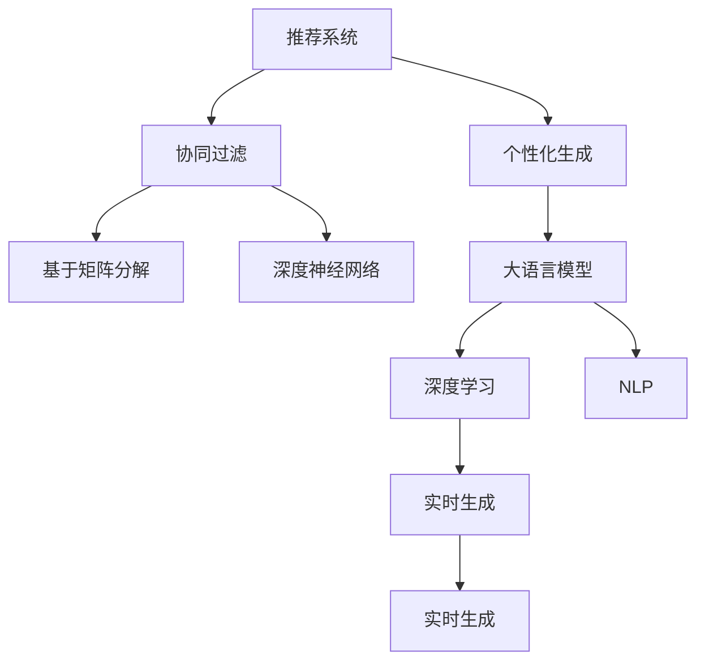

                 

# 利用LLM优化推荐系统的实时个性化生成

> 关键词：利用大语言模型,推荐系统,个性化生成,实时生成,深度学习

## 1. 背景介绍

### 1.1 问题由来

在电子商务、社交网络、媒体平台等众多领域，个性化推荐系统已成为提升用户体验和提高业务价值的关键技术。通过分析用户行为数据和产品特征数据，推荐系统能够精准地预测用户对不同产品的偏好和需求，为其推荐最适合的商品和服务。

近年来，深度学习技术特别是神经网络在推荐系统中的应用取得了显著进展。特别是基于深度学习的协同过滤推荐算法，如基于矩阵分解的算法、深度神经网络推荐模型等，显著提升了推荐系统的精度和效率。然而，这些模型在处理长尾商品、多模态数据、动态场景等方面仍存在局限性，难以满足复杂多变的用户需求。

## 2. 核心概念与联系

### 2.1 核心概念概述

为更好地理解如何利用大语言模型优化推荐系统的个性化生成，本节将介绍几个密切相关的核心概念：

- 推荐系统(Recommendation System)：一种智能信息检索技术，根据用户的历史行为、产品属性、实时环境等因素，推荐可能满足用户需求的商品或服务。
- 个性化生成(Personalization Generation)：根据用户偏好和行为，实时生成满足用户个性化需求的推荐结果。
- 大语言模型(Large Language Model, LLM)：以自回归(如GPT)或自编码(如BERT)模型为代表的大规模预训练语言模型。通过在大规模无标签文本语料上进行预训练，学习通用的语言表示，具备强大的语言理解和生成能力。
- 深度学习(Deep Learning)：一种基于神经网络技术的机器学习算法，具有强大的特征提取和泛化能力，广泛应用于图像、语音、文本等数据的建模和分析。
- 协同过滤(Collaborative Filtering)：一种通过用户行为数据和产品特征数据进行推荐的方法，包括基于矩阵分解和基于模型的方法。
- 实时生成(Real-time Generation)：指推荐系统能够根据用户当前的实时行为和环境，即时生成个性化推荐结果。
- 自然语言处理(Natural Language Processing, NLP)：涉及语言学的计算机科学分支，专注于通过算法实现对人类语言信息的处理和理解。

这些核心概念之间的逻辑关系可以通过以下Mermaid流程图来展示：



这个流程图展示了大语言模型在推荐系统个性化生成中的核心作用和实现方式：

1. 推荐系统通过协同过滤等技术，对用户行为和产品特征进行分析，生成初步的推荐结果。
2. 个性化生成在大语言模型的辅助下，对初步推荐结果进行优化，提高推荐相关性和个性化程度。
3. 深度学习和大语言模型在大语言模型的帮助下，实现更加复杂多变的推荐结果生成，提升推荐系统的性能。

## 3. 核心算法原理 & 具体操作步骤

### 3.1 算法原理概述

利用大语言模型优化推荐系统的个性化生成，本质上是将语言模型和推荐系统进行深度融合的过程。通过在大语言模型上微调，引入用户行为、商品属性等多维信息，生成满足用户个性化需求的推荐结果。

形式化地，设推荐系统对用户 $u$ 推荐商品 $i$ 的概率为 $p_{ui}$，其中 $u$ 表示用户，$i$ 表示商品。假设用户 $u$ 的历史行为数据和商品属性数据为 $\mathcal{D}_u$，对应的语义表示为 $H_u$。通过在大语言模型上进行微调，生成一个函数 $f$，将输入 $H_u$ 映射到推荐概率 $p_{ui}$，即：

$$
p_{ui} = f(H_u)
$$

### 3.2 算法步骤详解

基于大语言模型优化推荐系统的个性化生成，主要包括以下几个关键步骤：

**Step 1: 准备数据集**

- 收集用户行为数据 $\mathcal{D}_u$，包括点击、浏览、购买等行为。
- 收集商品属性数据，如商品名称、价格、描述、分类等。
- 通过NLP技术对行为数据和属性数据进行编码，得到用户和商品的语义表示 $H_u$ 和 $H_i$。

**Step 2: 设计优化目标**

- 定义推荐系统的损失函数 $\mathcal{L}$，表示推荐结果与用户实际购买行为之间的差异。
- 将用户行为数据和商品属性数据输入大语言模型，输出推荐概率 $p_{ui}$。
- 将实际购买行为与推荐概率进行对比，生成损失 $\mathcal{L}$。

**Step 3: 优化模型参数**

- 使用深度学习优化算法，如Adam、SGD等，最小化损失函数 $\mathcal{L}$，更新模型参数 $\theta$。
- 在微调过程中，根据实际应用场景选择合适的超参数，如学习率、批大小、迭代轮数等。

**Step 4: 生成推荐结果**

- 将用户行为数据和商品属性数据输入微调后的大语言模型，输出推荐概率 $p_{ui}$。
- 根据推荐概率排序，选取概率最高的商品作为推荐结果。
- 对于长尾商品、多模态数据等复杂场景，可进一步结合专家知识、知识图谱等技术，增强推荐系统的鲁棒性和精度。

**Step 5: 模型评估与优化**

- 在验证集上评估模型性能，计算推荐精度、召回率、覆盖率等指标。
- 根据评估结果，进一步调整模型参数和超参数，进行微调。
- 重复上述过程，直到模型性能达到预设指标。

以上是大语言模型优化推荐系统的基本流程。在实际应用中，还需要针对具体任务特点，对微调过程进行优化设计，如改进损失函数、引入正则化技术、应用对抗训练等，以进一步提升推荐系统的效果。

### 3.3 算法优缺点

利用大语言模型优化推荐系统的个性化生成，具有以下优点：

- 强大语言理解能力。大语言模型能够理解自然语言文本中的复杂语义关系，对用户行为和商品属性的多维信息进行整合，生成更加丰富、准确的推荐结果。
- 灵活多变的生成方式。大语言模型能够处理多模态数据，结合用户实时行为和环境信息，实时生成个性化推荐。
- 动态调整能力。大语言模型能够根据新数据进行微调，适应不同时间节点的用户需求变化，提升推荐系统的时效性。
- 智能交互性。大语言模型能够与用户进行自然语言对话，通过询问用户偏好和需求，进一步优化推荐结果。

同时，该方法也存在一定的局限性：

- 数据依赖性强。模型的性能很大程度上依赖于用户行为数据和商品属性数据的丰富性和质量。
- 计算资源消耗大。大语言模型的预训练和微调需要大量计算资源，部署和维护成本较高。
- 模型复杂度高。大语言模型的复杂结构和高参数量，可能带来较高的推理开销。
- 潜在偏见问题。大语言模型可能会学习到预训练数据中的偏见和有害信息，影响推荐结果的公平性和可信度。

尽管存在这些局限性，但就目前而言，利用大语言模型优化推荐系统的个性化生成，已成为一种非常有前景的方法。未来相关研究的重点在于如何进一步降低数据依赖，提高推荐系统的计算效率，同时兼顾推荐结果的公平性和可信性等因素。

### 3.4 算法应用领域

利用大语言模型优化推荐系统的个性化生成，已经在多个领域得到广泛应用，例如：

- 电商推荐：电商网站通过分析用户浏览、点击、购买等行为数据，结合商品属性，生成个性化商品推荐。
- 内容推荐：新闻、视频、音乐等媒体平台，通过分析用户观看、点赞、评论等行为数据，生成个性化内容推荐。
- 广告推荐：广告公司通过分析用户搜索、点击等行为数据，生成个性化广告推荐。
- 社交推荐：社交媒体平台通过分析用户互动数据，生成个性化社交推荐，如好友推荐、兴趣组推荐等。
- 旅游推荐：旅游平台通过分析用户旅游偏好和行为数据，生成个性化旅游目的地推荐。

除了上述这些典型应用外，大语言模型优化推荐系统也在更多的领域展现出其独特优势，如推荐系统的多场景融合、跨领域协同推荐等，为推荐系统的智能化和多样化应用提供了新的可能性。

## 4. 数学模型和公式 & 详细讲解 & 举例说明

### 4.1 数学模型构建

本节将使用数学语言对大语言模型优化推荐系统的个性化生成过程进行更加严格的刻画。

设推荐系统对用户 $u$ 推荐商品 $i$ 的概率为 $p_{ui}$，其中 $u$ 表示用户，$i$ 表示商品。假设用户 $u$ 的历史行为数据和商品属性数据为 $\mathcal{D}_u$，对应的语义表示为 $H_u$。大语言模型 $M_{\theta}$ 输出对商品 $i$ 的推荐概率 $p_{ui}$，其中 $\theta$ 为模型参数。通过在大语言模型上进行微调，得到优化后的模型参数 $\hat{\theta}$，使得：

$$
p_{ui} = M_{\hat{\theta}}(H_u)
$$

定义推荐系统的损失函数 $\mathcal{L}$，表示推荐结果与用户实际购买行为之间的差异。假设用户 $u$ 的实际购买行为为 $\mathcal{Y}_u$，对应的语义表示为 $Y_u$。则损失函数为：

$$
\mathcal{L}(\hat{\theta}) = \mathbb{E}_{\mathcal{D}_u, \mathcal{Y}_u}\left[\ell(p_{ui}, \mathcal{Y}_u)\right]
$$

其中 $\ell$ 为损失函数，$\mathbb{E}$ 表示对训练数据和验证数据的期望。

### 4.2 公式推导过程

以下我们以电商推荐系统为例，推导基于大语言模型的推荐系统损失函数及其梯度的计算公式。

假设用户 $u$ 的历史行为数据为 $\mathcal{D}_u = \{x_i\}_{i=1}^{N_u}$，其中 $x_i$ 表示用户第 $i$ 次行为。设每个行为对应的推荐概率为 $p_{ui}$，即：

$$
p_{ui} = M_{\hat{\theta}}(H_u)
$$

其中 $H_u$ 为用户行为数据的语义表示。假设用户实际购买的商品为 $y$，对应的语义表示为 $Y$。则电商推荐系统的损失函数为：

$$
\mathcal{L}(\hat{\theta}) = -\sum_{u=1}^{U} \sum_{i=1}^{N_u} \log(p_{ui})
$$

其中 $U$ 为用户总数，$N_u$ 为用户 $u$ 的历史行为次数。

根据链式法则，损失函数对模型参数 $\theta_k$ 的梯度为：

$$
\frac{\partial \mathcal{L}(\hat{\theta})}{\partial \theta_k} = \frac{\partial \mathcal{L}(\hat{\theta})}{\partial p_{ui}} \frac{\partial p_{ui}}{\partial \theta_k} = -\sum_{u=1}^{U} \sum_{i=1}^{N_u} \frac{1}{p_{ui}} \frac{\partial M_{\hat{\theta}}(H_u)}{\partial \theta_k}
$$

其中 $\frac{\partial p_{ui}}{\partial \theta_k}$ 可通过反向传播算法高效计算。

在得到损失函数的梯度后，即可带入优化算法，完成模型的迭代优化。重复上述过程直至收敛，最终得到适应电商推荐系统的优化后的模型参数 $\hat{\theta}$。

### 4.3 案例分析与讲解

以一个简单的电商推荐系统为例，说明利用大语言模型进行个性化生成推荐的具体实现。

假设电商网站通过分析用户点击和浏览行为，生成了初步的推荐结果。对于用户 $u$，假设点击行为对应的推荐概率为 $p_{ui}$，浏览行为对应的推荐概率为 $p_{vi}$。结合用户历史行为数据 $\mathcal{D}_u$，生成推荐概率 $p_{ui}$。

在电商推荐系统中，可以设计如下优化目标：

- 基于用户点击行为的推荐：
$$
\mathcal{L}_{click} = -\sum_{i=1}^{N_u} \log(p_{ui})
$$

- 基于用户浏览行为的推荐：
$$
\mathcal{L}_{browsing} = -\sum_{i=1}^{N_u} \log(p_{vi})
$$

综合考虑点击和浏览行为的推荐结果，可以定义总损失函数：

$$
\mathcal{L}_{total} = \alpha \mathcal{L}_{click} + (1-\alpha) \mathcal{L}_{browsing}
$$

其中 $\alpha$ 为点击行为权重，可以根据用户行为数据进行设定。

在得到损失函数后，通过深度学习优化算法（如Adam、SGD等），最小化损失函数 $\mathcal{L}_{total}$，更新模型参数 $\theta$。重复上述过程，直到模型性能达到预设指标。

## 5. 项目实践：代码实例和详细解释说明

### 5.1 开发环境搭建

在进行大语言模型优化推荐系统实践前，我们需要准备好开发环境。以下是使用Python进行PyTorch开发的环境配置流程：

1. 安装Anaconda：从官网下载并安装Anaconda，用于创建独立的Python环境。

2. 创建并激活虚拟环境：
```bash
conda create -n pytorch-env python=3.8 
conda activate pytorch-env
```

3. 安装PyTorch：根据CUDA版本，从官网获取对应的安装命令。例如：
```bash
conda install pytorch torchvision torchaudio cudatoolkit=11.1 -c pytorch -c conda-forge
```

4. 安装Transformer库：
```bash
pip install transformers
```

5. 安装各类工具包：
```bash
pip install numpy pandas scikit-learn matplotlib tqdm jupyter notebook ipython
```

完成上述步骤后，即可在`pytorch-env`环境中开始微调实践。

### 5.2 源代码详细实现

下面以电商推荐系统为例，给出使用Transformers库对BERT模型进行微调的PyTorch代码实现。

首先，定义电商推荐系统的数据处理函数：

```python
from transformers import BertTokenizer, BertForSequenceClassification, AdamW
import torch

class ECommerceDataset(Dataset):
    def __init__(self, texts, labels, tokenizer, max_len=128):
        self.texts = texts
        self.labels = labels
        self.tokenizer = tokenizer
        self.max_len = max_len
        
    def __len__(self):
        return len(self.texts)
    
    def __getitem__(self, item):
        text = self.texts[item]
        label = self.labels[item]
        
        encoding = self.tokenizer(text, return_tensors='pt', max_length=self.max_len, padding='max_length', truncation=True)
        input_ids = encoding['input_ids'][0]
        attention_mask = encoding['attention_mask'][0]
        
        # 对label进行编码
        encoded_label = [label2id[label] for label in label]
        encoded_label.extend([label2id['O']] * (self.max_len - len(encoded_label)))
        labels = torch.tensor(encoded_label, dtype=torch.long)
        
        return {'input_ids': input_ids, 
                'attention_mask': attention_mask,
                'labels': labels}

# 标签与id的映射
label2id = {'O': 0, 'click': 1, 'browsing': 2}
id2label = {v: k for k, v in label2id.items()}

# 创建dataset
tokenizer = BertTokenizer.from_pretrained('bert-base-cased')

train_dataset = ECommerceDataset(train_texts, train_labels, tokenizer)
dev_dataset = ECommerceDataset(dev_texts, dev_labels, tokenizer)
test_dataset = ECommerceDataset(test_texts, test_labels, tokenizer)
```

然后，定义模型和优化器：

```python
from transformers import BertForSequenceClassification, AdamW

model = BertForSequenceClassification.from_pretrained('bert-base-cased', num_labels=len(label2id))

optimizer = AdamW(model.parameters(), lr=2e-5)
```

接着，定义训练和评估函数：

```python
from torch.utils.data import DataLoader
from tqdm import tqdm
from sklearn.metrics import classification_report

device = torch.device('cuda') if torch.cuda.is_available() else torch.device('cpu')
model.to(device)

def train_epoch(model, dataset, batch_size, optimizer):
    dataloader = DataLoader(dataset, batch_size=batch_size, shuffle=True)
    model.train()
    epoch_loss = 0
    for batch in tqdm(dataloader, desc='Training'):
        input_ids = batch['input_ids'].to(device)
        attention_mask = batch['attention_mask'].to(device)
        labels = batch['labels'].to(device)
        model.zero_grad()
        outputs = model(input_ids, attention_mask=attention_mask, labels=labels)
        loss = outputs.loss
        epoch_loss += loss.item()
        loss.backward()
        optimizer.step()
    return epoch_loss / len(dataloader)

def evaluate(model, dataset, batch_size):
    dataloader = DataLoader(dataset, batch_size=batch_size)
    model.eval()
    preds, labels = [], []
    with torch.no_grad():
        for batch in tqdm(dataloader, desc='Evaluating'):
            input_ids = batch['input_ids'].to(device)
            attention_mask = batch['attention_mask'].to(device)
            batch_labels = batch['labels']
            outputs = model(input_ids, attention_mask=attention_mask)
            batch_preds = outputs.logits.argmax(dim=2).to('cpu').tolist()
            batch_labels = batch_labels.to('cpu').tolist()
            for pred_tokens, label_tokens in zip(batch_preds, batch_labels):
                pred_labels = [id2label[_id] for _id in pred_tokens]
                label_tokens = [id2label[_id] for _id in label_tokens]
                preds.append(pred_labels[:len(label_tokens)])
                labels.append(label_tokens)
                
    print(classification_report(labels, preds))
```

最后，启动训练流程并在测试集上评估：

```python
epochs = 5
batch_size = 16

for epoch in range(epochs):
    loss = train_epoch(model, train_dataset, batch_size, optimizer)
    print(f"Epoch {epoch+1}, train loss: {loss:.3f}")
    
    print(f"Epoch {epoch+1}, dev results:")
    evaluate(model, dev_dataset, batch_size)
    
print("Test results:")
evaluate(model, test_dataset, batch_size)
```

以上就是使用PyTorch对BERT进行电商推荐系统微调的完整代码实现。可以看到，得益于Transformers库的强大封装，我们可以用相对简洁的代码完成BERT模型的加载和微调。

### 5.3 代码解读与分析

让我们再详细解读一下关键代码的实现细节：

**ECommerceDataset类**：
- `__init__`方法：初始化文本、标签、分词器等关键组件。
- `__len__`方法：返回数据集的样本数量。
- `__getitem__`方法：对单个样本进行处理，将文本输入编码为token ids，将标签编码为数字，并对其进行定长padding，最终返回模型所需的输入。

**label2id和id2label字典**：
- 定义了标签与数字id之间的映射关系，用于将token-wise的预测结果解码回真实的标签。

**训练和评估函数**：
- 使用PyTorch的DataLoader对数据集进行批次化加载，供模型训练和推理使用。
- 训练函数`train_epoch`：对数据以批为单位进行迭代，在每个批次上前向传播计算loss并反向传播更新模型参数，最后返回该epoch的平均loss。
- 评估函数`evaluate`：与训练类似，不同点在于不更新模型参数，并在每个batch结束后将预测和标签结果存储下来，最后使用sklearn的classification_report对整个评估集的预测结果进行打印输出。

**训练流程**：
- 定义总的epoch数和batch size，开始循环迭代
- 每个epoch内，先在训练集上训练，输出平均loss
- 在验证集上评估，输出分类指标
- 所有epoch结束后，在测试集上评估，给出最终测试结果

可以看到，PyTorch配合Transformers库使得BERT微调的代码实现变得简洁高效。开发者可以将更多精力放在数据处理、模型改进等高层逻辑上，而不必过多关注底层的实现细节。

当然，工业级的系统实现还需考虑更多因素，如模型的保存和部署、超参数的自动搜索、更灵活的任务适配层等。但核心的微调范式基本与此类似。

## 6. 实际应用场景

### 6.1 智能客服系统

利用大语言模型优化推荐系统个性化生成，可以广泛应用于智能客服系统的构建。传统客服往往需要配备大量人力，高峰期响应缓慢，且一致性和专业性难以保证。而利用微调后的推荐系统，可以7x24小时不间断服务，快速响应客户咨询，用自然流畅的语言解答各类常见问题。

在技术实现上，可以收集企业内部的历史客服对话记录，将问题和最佳答复构建成监督数据，在此基础上对预训练推荐系统进行微调。微调后的推荐系统能够自动理解用户意图，匹配最合适的答复模板进行回复。对于客户提出的新问题，还可以接入检索系统实时搜索相关内容，动态组织生成回答。如此构建的智能客服系统，能大幅提升客户咨询体验和问题解决效率。

### 6.2 金融舆情监测

金融机构需要实时监测市场舆论动向，以便及时应对负面信息传播，规避金融风险。传统的人工监测方式成本高、效率低，难以应对网络时代海量信息爆发的挑战。利用基于大语言模型的推荐系统，对金融新闻、评论等文本数据进行情感分析和主题分类，能够自动判断舆情变化趋势，一旦发现负面信息激增等异常情况，系统便会自动预警，帮助金融机构快速应对潜在风险。

### 6.3 个性化推荐系统

当前的推荐系统往往只依赖用户的历史行为数据进行物品推荐，无法深入理解用户的真实兴趣偏好。利用大语言模型优化推荐系统个性化生成，能够更好地挖掘用户行为背后的语义信息，从而提供更精准、多样的推荐内容。

在实践中，可以收集用户浏览、点击、评论、分享等行为数据，提取和用户交互的物品标题、描述、标签等文本内容。将文本内容作为模型输入，用户的后续行为（如是否点击、购买等）作为监督信号，在此基础上微调预训练语言模型。微调后的模型能够从文本内容中准确把握用户的兴趣点。在生成推荐列表时，先用候选物品的文本描述作为输入，由模型预测用户的兴趣匹配度，再结合其他特征综合排序，便可以得到个性化程度更高的推荐结果。

### 6.4 未来应用展望

随着大语言模型和微调方法的不断发展，基于微调范式将在更多领域得到应用，为传统行业带来变革性影响。

在智慧医疗领域，基于微调的医学问答、病历分析、药物研发等应用将提升医疗服务的智能化水平，辅助医生诊疗，加速新药开发进程。

在智能教育领域，微调技术可应用于作业批改、学情分析、知识推荐等方面，因材施教，促进教育公平，提高教学质量。

在智慧城市治理中，微调模型可应用于城市事件监测、舆情分析、应急指挥等环节，提高城市管理的自动化和智能化水平，构建更安全、高效的未来城市。

此外，在企业生产、社会治理、文娱传媒等众多领域，基于大模型微调的人工智能应用也将不断涌现，为经济社会发展注入新的动力。相信随着技术的日益成熟，微调方法将成为人工智能落地应用的重要范式，推动人工智能技术向更广阔的领域加速渗透。

## 7. 工具和资源推荐

### 7.1 学习资源推荐

为了帮助开发者系统掌握大语言模型优化推荐系统的理论基础和实践技巧，这里推荐一些优质的学习资源：

1. 《Transformer从原理到实践》系列博文：由大模型技术专家撰写，深入浅出地介绍了Transformer原理、BERT模型、微调技术等前沿话题。

2. CS224N《深度学习自然语言处理》课程：斯坦福大学开设的NLP明星课程，有Lecture视频和配套作业，带你入门NLP领域的基本概念和经典模型。

3. 《Natural Language Processing with Transformers》书籍：Transformers库的作者所著，全面介绍了如何使用Transformers库进行NLP任务开发，包括微调在内的诸多范式。

4. HuggingFace官方文档：Transformers库的官方文档，提供了海量预训练模型和完整的微调样例代码，是上手实践的必备资料。

5. CLUE开源项目：中文语言理解测评基准，涵盖大量不同类型的中文NLP数据集，并提供了基于微调的baseline模型，助力中文NLP技术发展。

通过对这些资源的学习实践，相信你一定能够快速掌握大语言模型优化推荐系统的精髓，并用于解决实际的NLP问题。
###  7.2 开发工具推荐

高效的开发离不开优秀的工具支持。以下是几款用于大语言模型优化推荐系统开发的常用工具：

1. PyTorch：基于Python的开源深度学习框架，灵活动态的计算图，适合快速迭代研究。大部分预训练语言模型都有PyTorch版本的实现。

2. TensorFlow：由Google主导开发的开源深度学习框架，生产部署方便，适合大规模工程应用。同样有丰富的预训练语言模型资源。

3. Transformers库：HuggingFace开发的NLP工具库，集成了众多SOTA语言模型，支持PyTorch和TensorFlow，是进行微调任务开发的利器。

4. Weights & Biases：模型训练的实验跟踪工具，可以记录和可视化模型训练过程中的各项指标，方便对比和调优。与主流深度学习框架无缝集成。

5. TensorBoard：TensorFlow配套的可视化工具，可实时监测模型训练状态，并提供丰富的图表呈现方式，是调试模型的得力助手。

6. Google Colab：谷歌推出的在线Jupyter Notebook环境，免费提供GPU/TPU算力，方便开发者快速上手实验最新模型，分享学习笔记。

合理利用这些工具，可以显著提升大语言模型微调任务的开发效率，加快创新迭代的步伐。

### 7.3 相关论文推荐

大语言模型和微调技术的发展源于学界的持续研究。以下是几篇奠基性的相关论文，推荐阅读：

1. Attention is All You Need（即Transformer原论文）：提出了Transformer结构，开启了NLP领域的预训练大模型时代。

2. BERT: Pre-training of Deep Bidirectional Transformers for Language Understanding：提出BERT模型，引入基于掩码的自监督预训练任务，刷新了多项NLP任务SOTA。

3. Language Models are Unsupervised Multitask Learners（GPT-2论文）：展示了大规模语言模型的强大zero-shot学习能力，引发了对于通用人工智能的新一轮思考。

4. Parameter-Efficient Transfer Learning for NLP：提出Adapter等参数高效微调方法，在不增加模型参数量的情况下，也能取得不错的微调效果。

5. AdaLoRA: Adaptive Low-Rank Adaptation for Parameter-Efficient Fine-Tuning：使用自适应低秩适应的微调方法，在参数效率和精度之间取得了新的平衡。

这些论文代表了大语言模型微调技术的发展脉络。通过学习这些前沿成果，可以帮助研究者把握学科前进方向，激发更多的创新灵感。

## 8. 总结：未来发展趋势与挑战

### 8.1 总结

本文对利用大语言模型优化推荐系统的个性化生成进行了全面系统的介绍。首先阐述了推荐系统和个性化生成的核心概念和实现方式，明确了大语言模型在此中的重要作用。其次，从原理到实践，详细讲解了利用大语言模型优化推荐系统的数学模型和关键步骤，给出了电商推荐系统的完整代码实例。同时，本文还广泛探讨了个性化生成在智能客服、金融舆情、个性化推荐等多个行业领域的应用前景，展示了个性化生成的巨大潜力。此外，本文精选了微调技术的各类学习资源，力求为读者提供全方位的技术指引。

通过本文的系统梳理，可以看到，利用大语言模型优化推荐系统的个性化生成，已成为一种非常有前景的方法。大语言模型通过预训练获得的广泛语言知识和深度理解，使得个性化生成能够更好地满足用户多样化和个性化的需求，提升推荐系统的性能。未来，伴随大语言模型和微调方法的持续演进，相信个性化生成在推荐系统中的应用将更加广泛，带来更加智能和高效的用户体验。

### 8.2 未来发展趋势

展望未来，大语言模型优化推荐系统的个性化生成将呈现以下几个发展趋势：

1. 更加灵活多变的推荐方式。未来，个性化生成将结合多模态数据、跨领域知识，实现更加丰富和个性化的推荐。
2. 更加实时高效的推荐系统。大语言模型的计算资源消耗将进一步降低，推理速度提升，使得推荐系统能够更加实时高效地生成个性化推荐。
3. 更加智能适应的推荐模型。利用大语言模型，推荐系统将能够更好地适应不同时间节点的用户需求变化，提升推荐系统的智能适应性。
4. 更加公平可信的推荐系统。大语言模型将更好地学习不同用户的偏好和行为，减少推荐系统中的偏见和歧视，提升推荐系统的公平性和可信度。

以上趋势凸显了大语言模型优化推荐系统的巨大前景。这些方向的探索发展，必将进一步提升推荐系统的性能和应用范围，为构建更加智能和高效的推荐系统铺平道路。

### 8.3 面临的挑战

尽管大语言模型优化推荐系统的个性化生成已经取得了显著进展，但在迈向更加智能化、普适化应用的过程中，仍面临诸多挑战：

1. 数据依赖性强。模型的性能很大程度上依赖于用户行为数据和商品属性数据的丰富性和质量。
2. 计算资源消耗大。大语言模型的预训练和微调需要大量计算资源，部署和维护成本较高。
3. 模型复杂度高。大语言模型的复杂结构和高参数量，可能带来较高的推理开销。
4. 潜在偏见问题。大语言模型可能会学习到预训练数据中的偏见和有害信息，影响推荐结果的公平性和可信度。

尽管存在这些局限性，但就目前而言，利用大语言模型优化推荐系统的个性化生成，已成为一种非常有前景的方法。未来相关研究的重点在于如何进一步降低数据依赖，提高推荐系统的计算效率，同时兼顾推荐结果的公平性和可信性等因素。

### 8.4 未来突破

面对大语言模型优化推荐系统个性化生成所面临的种种挑战，未来的研究需要在以下几个方面寻求新的突破：

1. 探索无监督和半监督微调方法。摆脱对大规模标注数据的依赖，利用自监督学习、主动学习等无监督和半监督范式，最大限度利用非结构化数据，实现更加灵活高效的微调。

2. 研究参数高效和计算高效的微调范式。开发更加参数高效的微调方法，在固定大部分预训练参数的同时，只更新极少量的任务相关参数。同时优化微调模型的计算图，减少前向传播和反向传播的资源消耗，实现更加轻量级、实时性的部署。

3. 引入更多先验知识。将符号化的先验知识，如知识图谱、逻辑规则等，与神经网络模型进行巧妙融合，引导微调过程学习更准确、合理的语言模型。同时加强不同模态数据的整合，实现视觉、语音等多模态信息与文本信息的协同建模。

4. 结合因果分析和博弈论工具。将因果分析方法引入微调模型，识别出模型决策的关键特征，增强输出解释的因果性和逻辑性。借助博弈论工具刻画人机交互过程，主动探索并规避模型的脆弱点，提高系统稳定性。

5. 纳入伦理道德约束。在模型训练目标中引入伦理导向的评估指标，过滤和惩罚有偏见、有害的输出倾向。同时加强人工干预和审核，建立模型行为的监管机制，确保输出符合人类价值观和伦理道德。

这些研究方向的探索，必将引领大语言模型优化推荐系统个性化生成技术迈向更高的台阶，为构建安全、可靠、可解释、可控的智能推荐系统铺平道路。面向未来，大语言模型优化推荐系统个性化生成还需要与其他人工智能技术进行更深入的融合，如知识表示、因果推理、强化学习等，多路径协同发力，共同推动推荐系统的进步。只有勇于创新、敢于突破，才能不断拓展推荐系统的边界，让智能推荐更好地服务用户。

## 9. 附录：常见问题与解答

**Q1：大语言模型优化推荐系统的个性化生成是否适用于所有推荐任务？**

A: 大语言模型优化推荐系统的个性化生成在大多数推荐任务上都能取得不错的效果，特别是对于数据量较小的任务。但对于一些特定领域的任务，如医学、法律等，仅仅依靠通用语料预训练的模型可能难以很好地适应。此时需要在特定领域语料上进一步预训练，再进行微调，才能获得理想效果。此外，对于一些需要时效性、个性化很强的任务，如对话、推荐等，微调方法也需要针对性的改进优化。

**Q2：利用大语言模型优化推荐系统的个性化生成需要哪些数据？**

A: 利用大语言模型优化推荐系统的个性化生成，需要收集用户行为数据和商品属性数据。具体来说，用户行为数据包括点击、浏览、购买等行为数据，商品属性数据包括商品名称、价格、描述、分类等。通过NLP技术对行为数据和属性数据进行编码，得到用户和商品的语义表示，供微调后的推荐系统进行个性化生成推荐。

**Q3：如何选择合适的微调算法和优化器？**

A: 选择合适的微调算法和优化器是微调成功的关键。一般来说，Adam、SGD等优化器都能够胜任大部分微调任务。如果需要处理高维稀疏数据，可以使用SAGA、SAGA+等稀疏优化算法。对于大语言模型，建议使用自适应学习率策略，如AdamW、Adafactor等，以更好地适应不同学习率的微调需求。

**Q4：利用大语言模型优化推荐系统的个性化生成有哪些优势？**

A: 利用大语言模型优化推荐系统的个性化生成具有以下优势：
1. 强大的语言理解能力。大语言模型能够理解自然语言文本中的复杂语义关系，对用户行为和商品属性的多维信息进行整合，生成更加丰富、准确的推荐结果。
2. 灵活多变的生成方式。大语言模型能够处理多模态数据，结合用户实时行为和环境信息，实时生成个性化推荐。
3. 动态调整能力。大语言模型能够根据新数据进行微调，适应不同时间节点的用户需求变化，提升推荐系统的时效性。
4. 智能交互性。大语言模型能够与用户进行自然语言对话，通过询问用户偏好和需求，进一步优化推荐结果。

这些优势使得大语言模型优化推荐系统在个性化生成方面具有显著的优势，能够更好地满足用户的个性化需求。

**Q5：微调后的大语言模型如何部署和优化？**

A: 微调后的大语言模型部署和优化需要考虑以下几个方面：
1. 模型裁剪：去除不必要的层和参数，减小模型尺寸，加快推理速度。
2. 量化加速：将浮点模型转为定点模型，压缩存储空间，提高计算效率。
3. 服务化封装：将模型封装为标准化服务接口，便于集成调用。
4. 弹性伸缩：根据请求流量动态调整资源配置，平衡服务质量和成本。
5. 监控告警：实时采集系统指标，设置异常告警阈值，确保服务稳定性。

通过这些优化措施，可以显著提升大语言模型在推荐系统中的部署效率和应用效果。

---

作者：禅与计算机程序设计艺术 / Zen and the Art of Computer Programming

