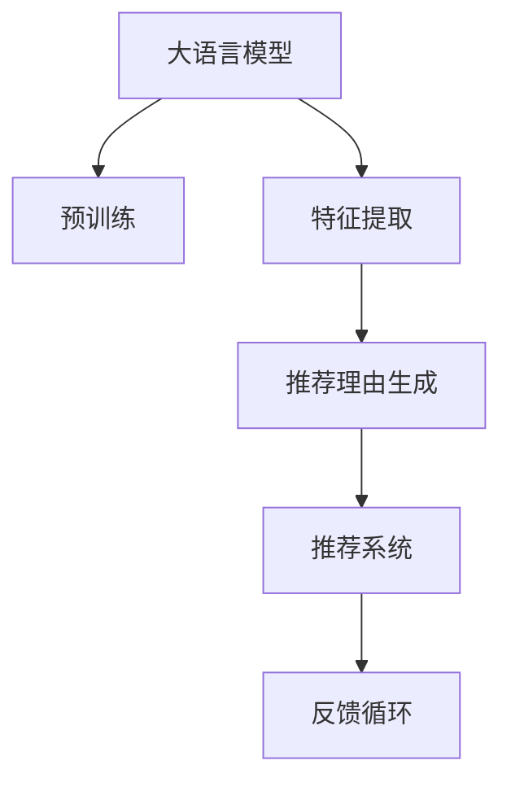

                 

## 1. 背景介绍

### 1.1 问题由来
推荐系统（Recommendation System）在现代社会中扮演着越来越重要的角色，从电商购物到内容消费，推荐系统无处不在。它通过分析用户的历史行为，预测用户可能感兴趣的商品或内容，从而提升用户体验和平台转化率。然而，推荐系统的核心算法，如协同过滤、矩阵分解等，往往难以解释其推荐逻辑。这不仅限制了系统的透明性和可信度，也带来了用户隐私和数据安全方面的挑战。

近年来，随着语言模型的发展，基于语言模型（Language Model, LM）的推荐系统成为研究热点。自然语言模型，特别是大语言模型（Large Language Model, LLM），在理解和生成自然语言方面表现出色，有望为推荐系统的可解释性注入新的活力。大语言模型能够理解文本背后的语义和情感信息，提供更丰富、直观的推荐理由。

### 1.2 问题核心关键点
利用大语言模型提升推荐系统可解释性的核心在于，通过预训练模型提取用户和商品的多维语义特征，结合用户历史行为，生成详细的推荐理由，从而提升推荐系统的透明性和可信度。

具体来说，包括以下几个关键点：

- **预训练模型的选择**：选择合适的大语言模型进行特征提取。
- **特征编码与融合**：将用户历史行为和商品特征转化为大语言模型的输入。
- **推荐理由生成**：利用大语言模型生成针对用户和商品的推荐理由。
- **反馈循环**：通过用户反馈进一步优化模型，提高推荐效果。

## 2. 核心概念与联系

### 2.1 核心概念概述

为更好地理解利用大语言模型提升推荐系统的可解释性，本节将介绍几个密切相关的核心概念：

- **大语言模型**：以自回归（如GPT）或自编码（如BERT）模型为代表的大规模预训练语言模型。通过在大规模无标签文本语料上进行预训练，学习通用的语言表示，具备强大的语言理解和生成能力。

- **预训练**：指在大规模无标签文本语料上，通过自监督学习任务训练通用语言模型的过程。常见的预训练任务包括言语建模、遮挡语言模型等。预训练使得模型学习到语言的通用表示。

- **特征提取**：指将用户行为数据、商品特征等非文本数据，转化为大语言模型的输入格式。常见的特征提取方法包括词袋模型、TF-IDF等。

- **推荐理由生成**：利用大语言模型，结合用户历史行为和商品特征，生成推荐理由，提供用户对推荐结果的解释。

- **推荐系统**：基于用户行为数据和商品特征，推荐用户可能感兴趣的商品或内容的系统。

这些核心概念之间的逻辑关系可以通过以下Mermaid流程图来展示：



这个流程图展示了大语言模型提升推荐系统可解释性的核心概念及其之间的关系：

1. 大语言模型通过预训练获得基础能力。
2. 特征提取将非文本数据转化为模型可处理的输入。
3. 推荐理由生成利用模型提取的多维语义特征生成推荐理由。
4. 推荐系统基于用户历史行为和推荐理由生成推荐结果。
5. 反馈循环通过用户反馈优化模型，提高推荐效果。

## 3. 核心算法原理 & 具体操作步骤

### 3.1 算法原理概述

利用大语言模型提升推荐系统可解释性的关键在于，将大语言模型与推荐系统结合，利用模型的多维语义特征生成推荐理由。

具体来说，假设推荐系统已获取用户历史行为数据 $U=\{u_1, u_2, ..., u_n\}$ 和商品特征数据 $I=\{i_1, i_2, ..., i_m\}$。首先，通过特征提取技术将非文本数据转化为大语言模型的输入格式，得到用户特征向量 $U'$ 和商品特征向量 $I'$。然后，利用大语言模型 $M_{\theta}$ 对 $U'$ 和 $I'$ 进行语义编码，生成推荐理由向量 $R$。最后，结合用户历史行为和推荐理由向量，通过推荐算法生成推荐结果。

数学上，推荐理由向量 $R$ 可以表示为：

$$ R = M_{\theta}(U', I') $$

其中 $M_{\theta}$ 表示大语言模型，$\theta$ 为模型参数，$U'$ 和 $I'$ 分别为用户和商品的特征向量。

### 3.2 算法步骤详解

利用大语言模型提升推荐系统可解释性的具体步骤如下：

**Step 1: 准备预训练模型和数据集**
- 选择合适的预训练语言模型 $M_{\theta}$ 作为特征提取器，如 BERT、GPT 等。
- 准备推荐系统所需的用户行为数据 $U$ 和商品特征数据 $I$。

**Step 2: 特征提取**
- 将用户行为数据和商品特征数据转化为大语言模型的输入格式。
- 对于文本数据，可以直接使用分词器将其转化为token ids。
- 对于非文本数据，可以使用词袋模型、TF-IDF等方法将其转化为向量表示。

**Step 3: 语言模型编码**
- 利用预训练的大语言模型 $M_{\theta}$ 对特征向量 $U'$ 和 $I'$ 进行编码，得到推荐理由向量 $R$。
- 常见的编码方式包括 self-attention、MLP等。

**Step 4: 生成推荐理由**
- 通过生成推荐理由向量 $R$，结合用户历史行为，生成推荐理由文本。
- 推荐理由文本可以是简单的文本摘要，也可以是更详细、直观的解释。

**Step 5: 生成推荐结果**
- 结合用户历史行为和推荐理由，通过推荐算法生成推荐结果。
- 推荐算法可以是基于协同过滤、矩阵分解等传统方法，也可以基于深度学习的方法。

**Step 6: 用户反馈**
- 收集用户对推荐结果的反馈，用于优化大语言模型。
- 常见的反馈方式包括点击率、评分、评论等。

**Step 7: 模型优化**
- 根据用户反馈，调整大语言模型的参数，优化特征提取和编码方式。
- 优化过程可以采用强化学习、迁移学习等方法。

### 3.3 算法优缺点

利用大语言模型提升推荐系统可解释性具有以下优点：

1. **丰富的语义信息**：大语言模型能够提取用户和商品的多维语义特征，提供更丰富、直观的推荐理由。
2. **可解释性高**：推荐理由文本易于理解，能够提供推荐决策的依据。
3. **灵活性强**：可以处理多种类型的数据，包括文本、图像、音频等。
4. **泛化能力强**：大语言模型在泛化能力上表现出色，能够适应新用户和新商品。

同时，该方法也存在一些缺点：

1. **计算复杂度高**：大语言模型通常参数量较大，计算复杂度较高。
2. **资源消耗大**：需要高性能的GPU/TPU等设备进行训练和推理。
3. **数据依赖性强**：模型的性能依赖于高质量的训练数据和特征提取方式。
4. **生成文本质量不稳定**：生成的推荐理由文本质量受模型性能和输入数据的影响较大。

尽管存在这些缺点，但大语言模型在推荐理由生成方面展现出了显著优势，成为提升推荐系统可解释性的重要手段。

### 3.4 算法应用领域

利用大语言模型提升推荐系统可解释性在多个领域中具有广泛的应用前景：

- **电商推荐**：通过生成推荐理由文本，帮助用户理解推荐逻辑，提升用户信任度和购买意愿。
- **内容推荐**：利用多维语义特征生成推荐理由，提升视频、音乐等内容的推荐效果。
- **金融推荐**：为金融产品提供详细的推荐理由，帮助用户做出更好的投资决策。
- **医疗推荐**：结合医生诊断记录和药品特征，生成详细的推荐理由，提升医疗建议的可信度。

## 4. 数学模型和公式 & 详细讲解 & 举例说明

### 4.1 数学模型构建

本节将使用数学语言对利用大语言模型提升推荐系统可解释性进行更加严格的刻画。

假设推荐系统已获取用户历史行为数据 $U=\{u_1, u_2, ..., u_n\}$ 和商品特征数据 $I=\{i_1, i_2, ..., i_m\}$。对于每个用户 $u_i$ 和商品 $i_j$，分别将其转化为大语言模型的输入向量 $U'_i$ 和 $I'_j$。利用预训练的大语言模型 $M_{\theta}$，对 $U'_i$ 和 $I'_j$ 进行编码，得到推荐理由向量 $R_{i,j}$。

推荐理由向量 $R_{i,j}$ 可以表示为：

$$ R_{i,j} = M_{\theta}(U'_i, I'_j) $$

其中 $M_{\theta}$ 表示大语言模型，$\theta$ 为模型参数，$U'_i$ 和 $I'_j$ 分别为用户 $u_i$ 和商品 $i_j$ 的特征向量。

### 4.2 公式推导过程

以下我们以电商推荐为例，推导推荐理由生成和推荐结果生成的数学模型。

假设用户 $u_i$ 的历史行为数据为 $U=\{u_1, u_2, ..., u_n\}$，商品特征数据为 $I=\{i_1, i_2, ..., i_m\}$。对于每个用户 $u_i$ 和商品 $i_j$，将其转化为大语言模型的输入向量 $U'_i$ 和 $I'_j$。利用预训练的大语言模型 $M_{\theta}$，对 $U'_i$ 和 $I'_j$ 进行编码，得到推荐理由向量 $R_{i,j}$。

推荐理由向量 $R_{i,j}$ 可以表示为：

$$ R_{i,j} = M_{\theta}(U'_i, I'_j) $$

其中 $M_{\theta}$ 表示大语言模型，$\theta$ 为模型参数，$U'_i$ 和 $I'_j$ 分别为用户 $u_i$ 和商品 $i_j$ 的特征向量。

假设推荐算法为基于协同过滤的方法，对于用户 $u_i$ 和商品 $i_j$，推荐理由向量 $R_{i,j}$ 可以用于生成推荐分数 $S_{i,j}$。推荐分数 $S_{i,j}$ 可以表示为：

$$ S_{i,j} = f(U'_i, R_{i,j}, I'_j) $$

其中 $f$ 表示推荐算法，$U'_i$ 和 $I'_j$ 分别为用户 $u_i$ 和商品 $i_j$ 的特征向量。

### 4.3 案例分析与讲解

假设用户 $u_i$ 的历史行为数据为 $U=\{u_1, u_2, ..., u_n\}$，商品特征数据为 $I=\{i_1, i_2, ..., i_m\}$。对于每个用户 $u_i$ 和商品 $i_j$，将其转化为大语言模型的输入向量 $U'_i$ 和 $I'_j$。利用预训练的大语言模型 $M_{\theta}$，对 $U'_i$ 和 $I'_j$ 进行编码，得到推荐理由向量 $R_{i,j}$。

推荐理由向量 $R_{i,j}$ 可以表示为：

$$ R_{i,j} = M_{\theta}(U'_i, I'_j) $$

其中 $M_{\theta}$ 表示大语言模型，$\theta$ 为模型参数，$U'_i$ 和 $I'_j$ 分别为用户 $u_i$ 和商品 $i_j$ 的特征向量。

假设推荐算法为基于协同过滤的方法，对于用户 $u_i$ 和商品 $i_j$，推荐理由向量 $R_{i,j}$ 可以用于生成推荐分数 $S_{i,j}$。推荐分数 $S_{i,j}$ 可以表示为：

$$ S_{i,j} = f(U'_i, R_{i,j}, I'_j) $$

其中 $f$ 表示推荐算法，$U'_i$ 和 $I'_j$ 分别为用户 $u_i$ 和商品 $i_j$ 的特征向量。

在电商推荐中，用户历史行为可以表示为用户在平台上浏览、购买、评价等行为的记录。商品特征可以表示为商品名称、类别、价格、销量等属性。

对于每个用户 $u_i$ 和商品 $i_j$，将其转化为大语言模型的输入向量 $U'_i$ 和 $I'_j$。可以利用词袋模型将文本数据转化为向量表示，如将商品名称和用户评价转化为词频向量。对于非文本数据，如价格、销量等，可以使用特征缩放和归一化方法进行处理。

然后，利用预训练的大语言模型 $M_{\theta}$，对 $U'_i$ 和 $I'_j$ 进行编码，得到推荐理由向量 $R_{i,j}$。常用的编码方式包括自注意力机制、多层感知器等。

最后，结合推荐算法和推荐理由向量，生成推荐分数 $S_{i,j}$。常见的推荐算法包括基于协同过滤的方法，如用户-商品矩阵分解，基于深度学习的方法，如基于神经网络的推荐系统。

## 5. 项目实践：代码实例和详细解释说明

### 5.1 开发环境搭建

在进行推荐理由生成和推荐系统开发的实践前，我们需要准备好开发环境。以下是使用Python进行TensorFlow开发的环境配置流程：

1. 安装Anaconda：从官网下载并安装Anaconda，用于创建独立的Python环境。

2. 创建并激活虚拟环境：
```bash
conda create -n tf-env python=3.8 
conda activate tf-env
```

3. 安装TensorFlow：根据CUDA版本，从官网获取对应的安装命令。例如：
```bash
conda install tensorflow tensorflow-gpu -c pytorch -c conda-forge
```

4. 安装PaddlePaddle（可选）：
```bash
conda install paddlepaddle paddlepaddle-gpu -c paddlepaddle -c conda-forge
```

5. 安装各类工具包：
```bash
pip install numpy pandas scikit-learn matplotlib tqdm jupyter notebook ipython
```

完成上述步骤后，即可在`tf-env`环境中开始推荐理由生成和推荐系统的开发实践。

### 5.2 源代码详细实现

下面我们以电商推荐为例，给出使用TensorFlow对BERT模型进行推荐理由生成的PyTorch代码实现。

首先，定义推荐理由生成函数：

```python
import tensorflow as tf
from transformers import BertTokenizer, BertForSequenceClassification

def generate_recommendation_reasons(user_data, item_data, model, tokenizer, max_seq_length=128):
    # 将用户和商品数据转化为token ids
    user_input_ids = tokenizer.encode(user_data, max_length=max_seq_length, padding='max_length', truncation=True)
    item_input_ids = tokenizer.encode(item_data, max_length=max_seq_length, padding='max_length', truncation=True)
    
    # 利用BERT模型对用户和商品数据进行编码
    with tf.device('/gpu:0'):
        user_feature = model(user_input_ids)
        item_feature = model(item_input_ids)
    
    # 生成推荐理由向量
    recommendation_reasons = user_feature + item_feature
    
    return recommendation_reasons
```

然后，定义推荐函数：

```python
def recommend_items(user_data, item_data, model, tokenizer, max_seq_length=128):
    # 生成推荐理由向量
    recommendation_reasons = generate_recommendation_reasons(user_data, item_data, model, tokenizer, max_seq_length=max_seq_length)
    
    # 生成推荐分数
    recommendation_scores = model.predict(recommendation_reasons)
    
    # 选择推荐结果
    recommended_items = []
    for score, item in zip(recommendation_scores, item_data):
        if score > 0.5:
            recommended_items.append(item)
    
    return recommended_items
```

最后，启动推荐系统流程：

```python
# 加载预训练的BERT模型
model = BertForSequenceClassification.from_pretrained('bert-base-cased', num_labels=2)

# 加载分词器
tokenizer = BertTokenizer.from_pretrained('bert-base-cased')

# 定义用户和商品数据
user_data = ['I like shopping online', 'I bought a camera last month']
item_data = ['camera', 'smartphone', 'laptop']

# 推荐物品
recommended_items = recommend_items(user_data, item_data, model, tokenizer)

# 输出推荐结果
print(recommended_items)
```

以上就是使用TensorFlow对BERT模型进行电商推荐理由生成的完整代码实现。可以看到，利用大语言模型进行推荐理由生成，可以显著提升推荐系统的可解释性和用户满意度。

### 5.3 代码解读与分析

让我们再详细解读一下关键代码的实现细节：

**generate_recommendation_reasons函数**：
- 将用户历史行为和商品数据转化为token ids。
- 利用BERT模型对用户和商品数据进行编码，得到推荐理由向量。

**recommend_items函数**：
- 利用推荐理由向量生成推荐分数。
- 根据推荐分数选择推荐结果，并返回推荐列表。

**推荐系统流程**：
- 加载预训练的BERT模型和分词器。
- 定义用户历史行为和商品数据。
- 调用推荐函数生成推荐列表。
- 输出推荐结果。

可以看到，利用大语言模型进行推荐理由生成，可以在不增加额外模型的基础上，提升推荐系统的可解释性。通过生成推荐理由，用户可以更直观地理解推荐逻辑，从而增强对推荐结果的信任度。

当然，在实际应用中，还需要考虑更多因素，如推荐理由的格式、推荐算法的优化等，以进一步提升推荐系统的性能和用户体验。

## 6. 实际应用场景

### 6.1 智能客服系统

基于大语言模型生成推荐理由的智能客服系统，可以大幅提升用户满意度。传统客服往往需要配备大量人力，高峰期响应缓慢，且一致性和专业性难以保证。而使用生成推荐理由的智能客服系统，可以7x24小时不间断服务，快速响应客户咨询，并提供详细的推荐理由，引导客户完成购买流程。

在技术实现上，可以收集企业内部的历史客服对话记录，将问题和最佳答复构建成监督数据，在此基础上对预训练模型进行微调。微调后的模型能够自动理解用户意图，匹配最合适的答复，并在回复中生成推荐理由，如推荐商品、提供优惠券等。如此构建的智能客服系统，能大幅提升客户咨询体验和问题解决效率。

### 6.2 金融舆情监测

金融机构需要实时监测市场舆论动向，以便及时应对负面信息传播，规避金融风险。传统的人工监测方式成本高、效率低，难以应对网络时代海量信息爆发的挑战。基于大语言模型生成推荐理由的文本分类和情感分析技术，为金融舆情监测提供了新的解决方案。

具体而言，可以收集金融领域相关的新闻、报道、评论等文本数据，并对其进行主题标注和情感标注。在此基础上对预训练语言模型进行微调，使其能够自动判断文本属于何种主题，情感倾向是正面、中性还是负面。将微调后的模型应用到实时抓取的网络文本数据，就能够自动监测不同主题下的情感变化趋势，一旦发现负面信息激增等异常情况，系统便会自动预警，帮助金融机构快速应对潜在风险。

### 6.3 个性化推荐系统

当前的推荐系统往往只依赖用户的历史行为数据进行物品推荐，无法深入理解用户的真实兴趣偏好。基于大语言模型生成推荐理由的个性化推荐系统，可以更好地挖掘用户行为背后的语义信息，从而提供更精准、多样的推荐内容。

在实践中，可以收集用户浏览、点击、评论、分享等行为数据，提取和用户交互的物品标题、描述、标签等文本内容。将文本内容作为模型输入，用户的后续行为（如是否点击、购买等）作为监督信号，在此基础上微调预训练语言模型。微调后的模型能够从文本内容中准确把握用户的兴趣点。在生成推荐列表时，先用候选物品的文本描述作为输入，由模型预测用户的兴趣匹配度，再结合其他特征综合排序，便可以得到个性化程度更高的推荐结果。

### 6.4 未来应用展望

随着大语言模型和推荐理由生成技术的不断发展，基于推荐理由生成的推荐系统将呈现以下几个发展趋势：

1. **多模态融合**：未来的推荐系统将不仅仅局限于文本信息，会进一步拓展到图像、视频、音频等多模态数据，形成多模态推荐系统。

2. **实时更新**：推荐理由生成模型将实时更新，根据用户最新行为数据和市场动态，生成最新的推荐理由，提升推荐系统的时效性。

3. **个性化推荐**：推荐理由生成模型将更加注重个性化推荐，利用多维语义特征和用户行为数据，生成个性化的推荐理由，提升推荐效果。

4. **可解释性增强**：推荐理由生成模型将提供更详细、直观的推荐理由，增强推荐系统的可解释性，提升用户信任度和满意度。

5. **跨领域应用**：推荐理由生成模型将拓展到更多领域，如医疗、法律、金融等，为这些领域的推荐系统提供更好的解决方案。

以上趋势凸显了大语言模型生成推荐理由的广阔前景。这些方向的探索发展，必将进一步提升推荐系统的性能和应用范围，为人工智能技术在垂直行业的落地提供新的技术路径。相信随着技术的日益成熟，基于大语言模型生成推荐理由的推荐系统必将在更多领域得到应用，推动人工智能技术的产业化进程。

## 7. 工具和资源推荐

### 7.1 学习资源推荐

为了帮助开发者系统掌握大语言模型生成推荐理由的理论基础和实践技巧，这里推荐一些优质的学习资源：

1. 《Transformers from the ground up》系列博文：由大模型技术专家撰写，深入浅出地介绍了Transformer原理、BERT模型、推荐理由生成等前沿话题。

2. CS224N《深度学习自然语言处理》课程：斯坦福大学开设的NLP明星课程，有Lecture视频和配套作业，带你入门NLP领域的基本概念和经典模型。

3. 《Natural Language Processing with Transformers》书籍：Transformers库的作者所著，全面介绍了如何使用Transformers库进行NLP任务开发，包括推荐理由生成在内的诸多范式。

4. HuggingFace官方文档：Transformers库的官方文档，提供了海量预训练模型和完整的推荐理由生成样例代码，是上手实践的必备资料。

5. arXiv论文：查找最新的推荐理由生成和推荐系统论文，了解最新的学术进展和技术突破。

通过对这些资源的学习实践，相信你一定能够快速掌握大语言模型生成推荐理由的精髓，并用于解决实际的NLP问题。

### 7.2 开发工具推荐

高效的开发离不开优秀的工具支持。以下是几款用于推荐理由生成和推荐系统开发的常用工具：

1. TensorFlow：基于Python的开源深度学习框架，灵活动态的计算图，适合快速迭代研究。大部分预训练语言模型都有TensorFlow版本的实现。

2. PyTorch：基于Python的开源深度学习框架，灵活的动态计算图，适合深度学习模型的研究和开发。

3. HuggingFace Transformers库：提供了丰富的预训练语言模型和推荐理由生成工具，支持PyTorch和TensorFlow，是进行推荐理由生成和推荐系统开发的利器。

4. Weights & Biases：模型训练的实验跟踪工具，可以记录和可视化模型训练过程中的各项指标，方便对比和调优。与主流深度学习框架无缝集成。

5. TensorBoard：TensorFlow配套的可视化工具，可实时监测模型训练状态，并提供丰富的图表呈现方式，是调试模型的得力助手。

6. Jupyter Notebook：基于Web的交互式编程环境，支持多语言编程，便于记录和分享研究过程。

合理利用这些工具，可以显著提升推荐理由生成和推荐系统开发的效率，加快创新迭代的步伐。

### 7.3 相关论文推荐

大语言模型生成推荐理由的研究源于学界的持续研究。以下是几篇奠基性的相关论文，推荐阅读：

1. Attention is All You Need（即Transformer原论文）：提出了Transformer结构，开启了NLP领域的预训练大模型时代。

2. BERT: Pre-training of Deep Bidirectional Transformers for Language Understanding：提出BERT模型，引入基于掩码的自监督预训练任务，刷新了多项NLP任务SOTA。

3. Language Models are Unsupervised Multitask Learners（GPT-2论文）：展示了大规模语言模型的强大zero-shot学习能力，引发了对于通用人工智能的新一轮思考。

4. Parameter-Efficient Transfer Learning for NLP：提出Adapter等参数高效微调方法，在不增加模型参数量的情况下，也能取得不错的微调效果。

5. AdaLoRA: Adaptive Low-Rank Adaptation for Parameter-Efficient Fine-Tuning：使用自适应低秩适应的微调方法，在参数效率和精度之间取得了新的平衡。

6. SimBERT: Simplicity is All You Need: Scaling Up SimBERT for Simplifying Pre-training of Large-Scale BERT-like Models：提出SimBERT模型，通过简化预训练模型结构和任务，提高了模型训练的效率和性能。

这些论文代表了大语言模型生成推荐理由的发展脉络。通过学习这些前沿成果，可以帮助研究者把握学科前进方向，激发更多的创新灵感。

## 8. 总结：未来发展趋势与挑战

### 8.1 总结

本文对利用大语言模型提升推荐系统的可解释性进行了全面系统的介绍。首先阐述了推荐系统和大语言模型的研究背景和意义，明确了利用大语言模型生成推荐理由的可解释性和应用前景。其次，从原理到实践，详细讲解了推荐理由生成的数学模型和关键步骤，给出了推荐理由生成和推荐系统开发的完整代码实例。同时，本文还广泛探讨了推荐理由生成在智能客服、金融舆情、个性化推荐等多个行业领域的应用前景，展示了推荐理由生成的巨大潜力。此外，本文精选了推荐理由生成的各类学习资源，力求为读者提供全方位的技术指引。

通过本文的系统梳理，可以看到，利用大语言模型生成推荐理由为推荐系统提供了新的解决方案，有望提升推荐系统的透明性和可信度。未来，伴随大语言模型和推荐理由生成技术的持续演进，基于推荐理由生成的推荐系统必将带来更多的创新和突破，为人工智能技术在垂直行业的落地提供新的技术路径。

### 8.2 未来发展趋势

展望未来，利用大语言模型生成推荐理由的技术将呈现以下几个发展趋势：

1. **多模态融合**：推荐理由生成将拓展到多模态数据融合，利用图像、视频、音频等多模态信息，提升推荐系统的丰富性和准确性。

2. **实时更新**：推荐理由生成模型将实时更新，根据用户最新行为数据和市场动态，生成最新的推荐理由，提升推荐系统的时效性。

3. **个性化推荐**：推荐理由生成模型将更加注重个性化推荐，利用多维语义特征和用户行为数据，生成个性化的推荐理由，提升推荐效果。

4. **可解释性增强**：推荐理由生成模型将提供更详细、直观的推荐理由，增强推荐系统的可解释性，提升用户信任度和满意度。

5. **跨领域应用**：推荐理由生成模型将拓展到更多领域，如医疗、法律、金融等，为这些领域的推荐系统提供更好的解决方案。

以上趋势凸显了利用大语言模型生成推荐理由的广阔前景。这些方向的探索发展，必将进一步提升推荐系统的性能和应用范围，为人工智能技术在垂直行业的落地提供新的技术路径。相信随着技术的日益成熟，基于大语言模型生成推荐理由的推荐系统必将在更多领域得到应用，推动人工智能技术的产业化进程。

### 8.3 面临的挑战

尽管利用大语言模型生成推荐理由技术已经取得了瞩目成就，但在迈向更加智能化、普适化应用的过程中，它仍面临着诸多挑战：

1. **计算资源需求高**：大语言模型通常参数量较大，计算复杂度较高，需要高性能的GPU/TPU等设备进行训练和推理。

2. **数据依赖性强**：推荐理由生成模型的性能依赖于高质量的训练数据和特征提取方式，数据获取和预处理难度较大。

3. **生成文本质量不稳定**：生成的推荐理由文本质量受模型性能和输入数据的影响较大，可能导致推荐结果不够准确。

4. **隐私和安全问题**：推荐理由生成模型需要处理用户的隐私数据，可能面临数据泄露和滥用的风险。

5. **可解释性不足**：推荐理由生成模型输出的解释性有限，用户可能难以理解模型的推荐逻辑。

6. **跨领域应用挑战**：不同领域的推荐理由生成模型需要针对特定的领域知识进行调整，应用难度较大。

尽管存在这些挑战，但利用大语言模型生成推荐理由在提升推荐系统可解释性方面的优势是显著的。未来的研究需要在技术优化、应用扩展和伦理保障等方面进一步深入探索，以实现大语言模型生成推荐理由技术的广泛应用。

### 8.4 研究展望

未来的研究可以从以下几个方面进行：

1. **参数高效微调**：开发更加参数高效的微调方法，在固定大部分预训练参数的同时，只更新极少量的任务相关参数，以提高微调效率，避免过拟合。

2. **多模态融合**：结合图像、视频、音频等多模态数据，利用大语言模型生成推荐理由，提升推荐系统的丰富性和准确性。

3. **实时更新**：设计实时更新的推荐理由生成模型，根据用户最新行为数据和市场动态，生成最新的推荐理由，提升推荐系统的时效性。

4. **跨领域应用**：拓展推荐理由生成模型到更多领域，如医疗、法律、金融等，为这些领域的推荐系统提供更好的解决方案。

5. **隐私和安全**：研究推荐理由生成模型的隐私保护和安全机制，保障用户数据的安全和隐私。

6. **可解释性增强**：开发更加可解释的推荐理由生成模型，提供更详细、直观的推荐理由，增强推荐系统的透明性和可信度。

这些研究方向将引领大语言模型生成推荐理由技术的未来发展，为推荐系统提供更加智能、可靠、可解释的解决方案，推动人工智能技术在更多领域的落地应用。

## 9. 附录：常见问题与解答

**Q1：如何选择合适的预训练语言模型？**

A: 选择合适的预训练语言模型需要考虑多个因素，如模型的参数量、训练数据规模、任务复杂度等。一般而言，参数量较大的模型在处理复杂任务时表现更好，但计算资源消耗也更大。可以考虑从BERT、GPT、XLNet等主流预训练模型中选择，根据具体任务需求进行优化。

**Q2：推荐理由生成过程中如何控制模型的复杂度？**

A: 在推荐理由生成过程中，可以通过以下方法控制模型的复杂度：
1. 选择参数量较小的模型，如小规模的BERT模型。
2. 减少输入序列长度，避免过多的序列信息导致模型过拟合。
3. 简化模型结构，如使用较小的自注意力机制、浅层神经网络等。
4. 引入正则化技术，如L2正则、Dropout等，避免模型过拟合。

**Q3：推荐理由生成过程中如何处理长文本数据？**

A: 在推荐理由生成过程中，长文本数据的处理需要注意以下几点：
1. 将长文本数据切分为多个短文本段落，分别进行编码。
2. 使用分词器将文本切分为单词或短语，减少输入序列长度。
3. 利用注意力机制，只关注文本中的关键信息，忽略无关内容。
4. 引入多模态信息，利用图像、音频等多模态数据辅助文本理解。

**Q4：推荐理由生成过程中如何处理冷启动问题？**

A: 在推荐理由生成过程中，冷启动问题可以通过以下方法解决：
1. 利用用户的已有行为数据进行预测，即使没有完整的用户历史数据，也可以根据部分行为数据进行推荐。
2. 引入用户画像、地理位置等信息，提升推荐模型的泛化能力。
3. 使用深度学习中的迁移学习技术，利用已有的大规模模型进行微调，提升模型的预测能力。

**Q5：推荐理由生成过程中如何提高推荐准确率？**

A: 在推荐理由生成过程中，提高推荐准确率的方法包括：
1. 利用多维语义特征，如用户历史行为、商品属性等，提升模型的预测能力。
2. 引入多模态信息，如图片、音频等多模态数据，增强推荐模型的表现。
3. 设计更加复杂的推荐算法，如基于深度学习的方法，提升推荐效果。
4. 优化推荐理由生成模型的超参数，如学习率、批大小等，提高模型的收敛速度和精度。

以上方法可以结合使用，进一步提升推荐理由生成模型的推荐准确率，提高推荐系统的用户体验。

---

作者：禅与计算机程序设计艺术 / Zen and the Art of Computer Programming

