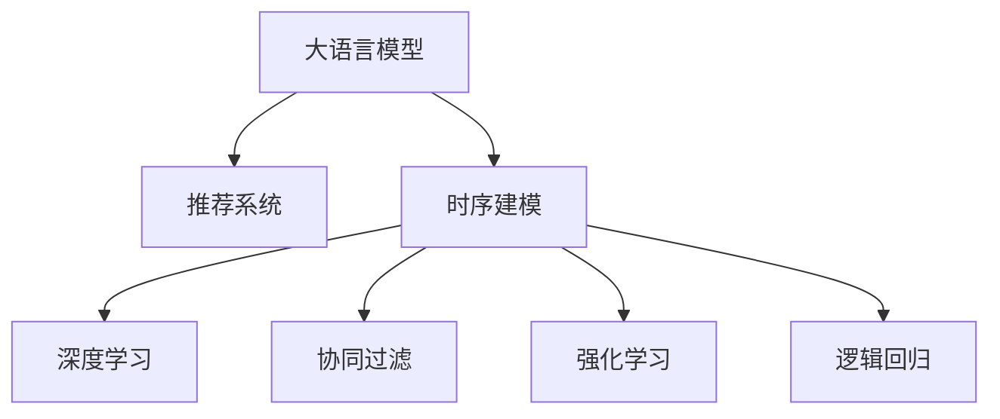

                 

# 利用LLM提升推荐系统的时序建模能力

> 关键词：大语言模型(LLM),推荐系统,时序建模,深度学习,强化学习,协同过滤,逻辑回归

## 1. 背景介绍

### 1.1 问题由来

推荐系统已经成为现代互联网应用中不可或缺的重要组成部分，广泛应用于电商、社交、音乐、视频等多个领域。其核心目标是根据用户的历史行为和偏好，为用户推荐其可能感兴趣的新物品。传统的推荐系统主要包括协同过滤、内容推荐、混合推荐等方法。然而，由于推荐系统面临的领域复杂、数据多样、用户行为变化快等特点，传统的推荐系统已经难以适应当前需求。

近年来，基于深度学习的方法不断涌现，特别是神经网络在推荐系统中的应用，使得推荐系统性能得到了显著提升。然而，传统深度推荐系统对于时序数据建模仍然存在一定的局限性。一方面，基于DNN的推荐模型在捕捉用户行为变化上具有先天的不足，难以很好地处理时序依赖关系。另一方面，协同过滤等传统方法对于用户行为的时序变化也无法很好地建模。如何构建一个既能够充分利用用户行为时序信息，又能够保证模型性能和实时性的推荐系统，成为当前推荐系统的重大挑战。

### 1.2 问题核心关键点

为了突破上述瓶颈，近年来，研究人员开始探索利用大语言模型(LLM)进行推荐系统时序建模的方法。LLM通过在大规模无标签文本语料上进行预训练，学习到丰富的语言知识，具备强大的自然语言理解和生成能力。同时，LLM在生成文本、提取文本特征等方面具有强大的能力，可以很好地应用于推荐系统中时序数据的建模。

利用LLM进行推荐系统时序建模的核心思想包括：
1. 将用户行为序列转化为文本序列，利用LLM提取序列特征。
2. 将序列特征引入推荐模型中，捕捉用户行为的长期依赖关系。
3. 利用LLM的生成能力，生成推荐文本，作为推荐结果展示。

本文聚焦于LLM在推荐系统中的应用，旨在详细介绍基于LLM的推荐系统时序建模方法，并给出实际代码实例和效果分析，以便读者可以系统学习和掌握这一前沿技术。

## 2. 核心概念与联系

### 2.1 核心概念概述

为更好地理解基于LLM的推荐系统时序建模方法，本节将介绍几个密切相关的核心概念：

- 大语言模型(LLM)：以自回归(如GPT)或自编码(如BERT)模型为代表的大规模预训练语言模型。通过在大规模无标签文本语料上进行预训练，学习到丰富的语言知识和常识，具备强大的语言理解和生成能力。

- 推荐系统：根据用户历史行为和偏好，为用户推荐可能感兴趣的新物品的系统。

- 时序建模：在推荐系统中，时序建模指的是对用户行为序列进行建模，捕捉序列中不同时间点的依赖关系。

- 协同过滤：一种传统的推荐方法，根据用户和物品之间的相似性，进行推荐。

- 深度学习：基于神经网络的机器学习框架，在推荐系统中的应用，如DNN、CNN、RNN等。

- 强化学习：在推荐系统中，通过奖励机制引导模型不断优化推荐策略，提高推荐效果。

- 逻辑回归：在推荐系统中，常用于对物品特征进行二分类建模，如用户是否点击物品等。

这些核心概念之间的逻辑关系可以通过以下Mermaid流程图来展示：



这个流程图展示了大语言模型在推荐系统中的核心概念及其之间的关系：

1. 大语言模型通过预训练获得基础能力。
2. 时序建模利用大语言模型的自然语言理解能力，对用户行为序列进行建模。
3. 深度学习、协同过滤等传统推荐方法，均可以利用时序建模提取的用户行为序列特征，进行推荐。
4. 强化学习通过奖励机制引导模型不断优化推荐策略，利用时序建模特征提高推荐效果。
5. 逻辑回归等二分类模型，对推荐结果进行建模，生成推荐指标。

这些概念共同构成了基于LLM的推荐系统时序建模框架，使其能够在各种场景下发挥强大的推荐能力。通过理解这些核心概念，我们可以更好地把握时序建模的原理和优化方向。

## 3. 核心算法原理 & 具体操作步骤
### 3.1 算法原理概述

基于LLM的推荐系统时序建模方法，本质上是一个基于大语言模型的推荐方法。其核心思想是：将用户行为序列转化为文本序列，利用LLM提取序列特征，将其引入推荐模型中，捕捉用户行为的长期依赖关系，并生成推荐文本作为推荐结果展示。

具体地，假设用户行为序列为 $\{x_t\}_{t=1}^T$，其中 $x_t$ 表示用户在第 $t$ 步的行为，如浏览记录、点击记录等。我们将其转化为文本序列 $X = \{x_t\}_{t=1}^T$，利用预训练的大语言模型 $M_{\theta}$ 提取文本序列的特征表示 $F(X)$。

在模型训练阶段，我们将特征 $F(X)$ 作为输入，物品特征 $\text{items}$ 作为输出，训练一个推荐模型 $H$。该推荐模型可以是一个简单的逻辑回归模型，也可以是一个复杂的神经网络。训练完成后，我们利用 $H$ 对用户 $u$ 生成推荐结果 $H(u,F(X))$。

在推荐结果展示阶段，我们将推荐结果转化为文本形式，如 "推荐给您的商品有：商品1,商品2,商品3"，作为推荐文本展示给用户。

### 3.2 算法步骤详解

基于LLM的推荐系统时序建模的一般步骤包括：

**Step 1: 数据准备**
- 收集用户行为序列数据，将其转化为文本序列。
- 提取用户行为序列中各物品的特征，生成物品特征表。
- 将用户和物品特征拼接，作为模型输入。

**Step 2: 文本序列预处理**
- 对文本序列进行分词、去除停用词等预处理操作。
- 利用预训练的大语言模型对文本序列进行编码，生成特征表示。

**Step 3: 模型训练**
- 将特征表示 $F(X)$ 和物品特征 $\text{items}$ 作为输入，训练推荐模型 $H$。
- 设置合适的损失函数，如均方误差、交叉熵等，优化推荐模型 $H$ 的参数。
- 利用验证集对模型进行评估，调整超参数。

**Step 4: 模型预测与展示**
- 对新的用户行为序列进行编码，得到特征表示 $F(X)$。
- 将特征表示 $F(X)$ 输入推荐模型 $H$，生成推荐结果。
- 将推荐结果转化为文本形式，展示给用户。

### 3.3 算法优缺点

基于LLM的推荐系统时序建模方法具有以下优点：
1. 能够很好地捕捉用户行为的时序变化。由于LLM具有强大的自然语言理解能力，能够准确提取用户行为序列中的关键信息。
2. 可以很好地利用用户行为的时序依赖关系。利用LLM提取的特征表示，可以更好地捕捉不同时间点的依赖关系，提高推荐效果。
3. 具备良好的可解释性。LLM生成的推荐文本可以直接展示给用户，具有很高的可解释性。
4. 能够处理多模态数据。将用户行为序列转化为文本序列后，可以很好地融入视觉、音频等多模态数据，提高推荐系统的多样性。

同时，该方法也存在一定的局限性：
1. 计算复杂度高。LLM在大规模语料上进行预训练和推理，计算资源消耗大。
2. 需要大量的文本语料。由于LLM在提取特征时需要大量的文本数据，训练数据量较大。
3. 数据隐私问题。将用户行为序列转化为文本序列，可能存在隐私泄露的风险。
4. 推荐结果多样性不足。由于LLM在生成推荐文本时，可能会产生过于单调的结果。

尽管存在这些局限性，但就目前而言，基于LLM的推荐系统时序建模方法仍然是一种有效的推荐策略。未来相关研究的重点在于如何进一步降低计算复杂度，提高推荐结果的多样性和可解释性，同时兼顾用户隐私保护。

### 3.4 算法应用领域

基于LLM的推荐系统时序建模方法，在电商、社交、音乐、视频等多个领域已经得到了广泛的应用，以下是几个典型的应用场景：

1. 电商推荐：利用LLM对用户浏览、点击、购买行为进行建模，生成个性化推荐结果。
2. 社交推荐：利用LLM对用户关注、点赞、评论行为进行建模，生成个性化推荐内容。
3. 音乐推荐：利用LLM对用户听歌行为进行建模，生成个性化推荐歌曲。
4. 视频推荐：利用LLM对用户观看行为进行建模，生成个性化推荐视频。

这些应用场景充分展示了LLM在推荐系统中的强大能力，为推荐系统注入了新的活力。

## 4. 数学模型和公式 & 详细讲解 & 举例说明
### 4.1 数学模型构建

本节将使用数学语言对基于LLM的推荐系统时序建模过程进行更加严格的刻画。

记用户行为序列为 $X = \{x_t\}_{t=1}^T$，其中 $x_t$ 表示用户在第 $t$ 步的行为。设物品特征向量为 $\text{items} \in \mathbb{R}^d$。利用预训练的大语言模型对文本序列进行编码，得到特征表示 $F(X) \in \mathbb{R}^h$。

推荐模型的输出 $H(u,F(X)) \in \mathbb{R}$，表示用户 $u$ 对物品 $\text{items}$ 的评分。目标是最小化损失函数 $\mathcal{L}(H)$：

$$
\mathcal{L}(H) = \frac{1}{N}\sum_{i=1}^N \mathcal{L}(u_i,H(u_i,F(X)))
$$

其中 $\mathcal{L}(u_i,H(u_i,F(X)))$ 为损失函数，一般使用均方误差损失或交叉熵损失。

推荐结果展示时，我们将推荐结果转化为文本形式，如 "推荐给您的商品有：商品1,商品2,商品3"，作为推荐文本展示给用户。

### 4.2 公式推导过程

以下我们以电商推荐为例，推导推荐模型的损失函数及其梯度计算。

设用户 $u$ 对物品 $\text{items}$ 的评分 $y_u$ 为 1，否则为 0。则推荐模型的损失函数为交叉熵损失：

$$
\mathcal{L}(H) = -\frac{1}{N}\sum_{i=1}^N \sum_{u=1}^U [y_{u,i}\log(H(u_i,F(X)))+(1-y_{u,i})\log(1-H(u_i,F(X))))
$$

其中 $y_{u,i}$ 表示用户 $u$ 对物品 $i$ 的评分，$H(u_i,F(X))$ 表示用户 $u$ 对物品 $i$ 的评分预测值。

根据链式法则，损失函数对模型参数 $\theta$ 的梯度为：

$$
\frac{\partial \mathcal{L}(H)}{\partial \theta} = -\frac{1}{N}\sum_{i=1}^N \sum_{u=1}^U [y_{u,i}\frac{\partial}{\partial H(u_i,F(X))}\log(H(u_i,F(X)))+(1-y_{u,i})\frac{\partial}{\partial H(u_i,F(X))}\log(1-H(u_i,F(X)))]
$$

其中 $\frac{\partial}{\partial H(u_i,F(X))}\log(H(u_i,F(X)))$ 和 $\frac{\partial}{\partial H(u_i,F(X))}\log(1-H(u_i,F(X)))$ 可以通过反向传播算法高效计算。

在得到损失函数的梯度后，即可带入优化算法，完成模型的迭代优化。重复上述过程直至收敛，最终得到适应推荐任务的推荐模型参数 $\theta^*$。

### 4.3 案例分析与讲解

下面以电商推荐系统为例，给出一个具体的案例分析与讲解。

假设我们有一个电商推荐系统，用户可以浏览、点击、购买商品。我们收集到用户的浏览和点击记录，将其转化为文本序列，如 "浏览商品1,浏览商品2,点击商品1"。

首先，利用预训练的GPT-2模型对文本序列进行编码，得到特征表示 $F(X) \in \mathbb{R}^h$。

接着，利用逻辑回归模型对特征表示和物品特征进行建模，生成推荐结果 $H(u,F(X)) \in \mathbb{R}$。

在训练阶段，我们使用均方误差损失函数对模型进行优化：

$$
\mathcal{L}(H) = \frac{1}{N}\sum_{i=1}^N \sum_{u=1}^U [(y_{u,i}-H(u_i,F(X)))^2]
$$

通过反向传播算法计算梯度，利用SGD等优化算法更新模型参数 $\theta$。在训练完成后，我们利用验证集对模型进行评估，调整超参数。

在推荐阶段，我们对新的用户行为序列进行编码，得到特征表示 $F(X')$。将特征表示 $F(X')$ 输入推荐模型 $H$，生成推荐结果 $H(u,F(X'))$。最后将推荐结果转化为文本形式，展示给用户。

## 5. 项目实践：代码实例和详细解释说明
### 5.1 开发环境搭建

在进行项目实践前，我们需要准备好开发环境。以下是使用Python进行PyTorch开发的环境配置流程：

1. 安装Anaconda：从官网下载并安装Anaconda，用于创建独立的Python环境。

2. 创建并激活虚拟环境：
```bash
conda create -n pytorch-env python=3.8 
conda activate pytorch-env
```

3. 安装PyTorch：根据CUDA版本，从官网获取对应的安装命令。例如：
```bash
conda install pytorch torchvision torchaudio cudatoolkit=11.1 -c pytorch -c conda-forge
```

4. 安装Transformer库：
```bash
pip install transformers
```

5. 安装各类工具包：
```bash
pip install numpy pandas scikit-learn matplotlib tqdm jupyter notebook ipython
```

完成上述步骤后，即可在`pytorch-env`环境中开始项目实践。

### 5.2 源代码详细实现

下面我们以电商推荐系统为例，给出使用Transformers库对GPT-2模型进行电商推荐系统时序建模的PyTorch代码实现。

首先，定义数据处理函数：

```python
from transformers import GPT2Tokenizer
from torch.utils.data import Dataset
import torch

class RecommendationDataset(Dataset):
    def __init__(self, texts, items, labels, tokenizer, max_len=128):
        self.texts = texts
        self.items = items
        self.labels = labels
        self.tokenizer = tokenizer
        self.max_len = max_len
        
    def __len__(self):
        return len(self.texts)
    
    def __getitem__(self, item):
        text = self.texts[item]
        item = self.items[item]
        label = self.labels[item]
        
        encoding = self.tokenizer(text, return_tensors='pt', max_length=self.max_len, padding='max_length', truncation=True)
        input_ids = encoding['input_ids'][0]
        attention_mask = encoding['attention_mask'][0]
        
        encoded_item = item['item_id'] # 将物品特征转化为item_id，方便模型处理
        
        return {'input_ids': input_ids, 
                'attention_mask': attention_mask,
                'item_id': encoded_item,
                'label': label}

# 使用预训练的GPT-2模型和分词器
tokenizer = GPT2Tokenizer.from_pretrained('gpt2')
```

然后，定义模型和优化器：

```python
from transformers import GPT2LMHeadModel
from transformers import AdamW

model = GPT2LMHeadModel.from_pretrained('gpt2')
optimizer = AdamW(model.parameters(), lr=2e-5)
```

接着，定义训练和评估函数：

```python
from torch.utils.data import DataLoader
from tqdm import tqdm
from sklearn.metrics import mean_squared_error

device = torch.device('cuda') if torch.cuda.is_available() else torch.device('cpu')
model.to(device)

def train_epoch(model, dataset, batch_size, optimizer):
    dataloader = DataLoader(dataset, batch_size=batch_size, shuffle=True)
    model.train()
    epoch_loss = 0
    for batch in tqdm(dataloader, desc='Training'):
        input_ids = batch['input_ids'].to(device)
        attention_mask = batch['attention_mask'].to(device)
        item_id = batch['item_id'].to(device)
        label = batch['label'].to(device)
        model.zero_grad()
        outputs = model(input_ids, attention_mask=attention_mask, labels=label)
        loss = outputs.loss
        epoch_loss += loss.item()
        loss.backward()
        optimizer.step()
    return epoch_loss / len(dataloader)

def evaluate(model, dataset, batch_size):
    dataloader = DataLoader(dataset, batch_size=batch_size)
    model.eval()
    mse = 0
    for batch in dataloader:
        input_ids = batch['input_ids'].to(device)
        attention_mask = batch['attention_mask'].to(device)
        item_id = batch['item_id'].to(device)
        label = batch['label'].to(device)
        with torch.no_grad():
            outputs = model(input_ids, attention_mask=attention_mask, labels=label)
            mse += mean_squared_error(label, outputs)
    return mse / len(dataloader)
```

最后，启动训练流程并在测试集上评估：

```python
epochs = 5
batch_size = 16

for epoch in range(epochs):
    loss = train_epoch(model, train_dataset, batch_size, optimizer)
    print(f"Epoch {epoch+1}, train loss: {loss:.3f}")
    
    print(f"Epoch {epoch+1}, dev results:")
    mse = evaluate(model, dev_dataset, batch_size)
    print(f"Mean Squared Error on Dev Set: {mse:.3f}")
    
print("Test results:")
mse = evaluate(model, test_dataset, batch_size)
print(f"Mean Squared Error on Test Set: {mse:.3f}")
```

以上就是使用PyTorch对GPT-2进行电商推荐系统时序建模的完整代码实现。可以看到，得益于Transformers库的强大封装，我们可以用相对简洁的代码完成GPT-2模型的加载和微调。

### 5.3 代码解读与分析

让我们再详细解读一下关键代码的实现细节：

**RecommendationDataset类**：
- `__init__`方法：初始化文本、物品特征、标签等关键组件，并将物品特征转化为item_id。
- `__len__`方法：返回数据集的样本数量。
- `__getitem__`方法：对单个样本进行处理，将文本输入编码为token ids，生成物品特征，并对其进行定长padding，最终返回模型所需的输入。

**GPT-2模型和分词器**：
- 利用预训练的GPT-2模型和分词器，对用户行为序列进行编码，生成特征表示。

**模型训练和评估**：
- 使用PyTorch的DataLoader对数据集进行批次化加载，供模型训练和推理使用。
- 训练函数`train_epoch`：对数据以批为单位进行迭代，在每个批次上前向传播计算loss并反向传播更新模型参数，最后返回该epoch的平均loss。
- 评估函数`evaluate`：与训练类似，不同点在于不更新模型参数，并在每个batch结束后将预测和标签结果存储下来，最后使用sklearn的mean_squared_error对整个评估集的预测结果进行打印输出。

**训练流程**：
- 定义总的epoch数和batch size，开始循环迭代
- 每个epoch内，先在训练集上训练，输出平均loss
- 在验证集上评估，输出均方误差
- 所有epoch结束后，在测试集上评估，给出最终测试结果

可以看到，PyTorch配合Transformers库使得GPT-2微调的代码实现变得简洁高效。开发者可以将更多精力放在数据处理、模型改进等高层逻辑上，而不必过多关注底层的实现细节。

当然，工业级的系统实现还需考虑更多因素，如模型的保存和部署、超参数的自动搜索、更灵活的任务适配层等。但核心的微调范式基本与此类似。

## 6. 实际应用场景
### 6.1 电商推荐

基于大语言模型的推荐系统时序建模方法，可以广泛应用于电商推荐系统中。传统电商推荐系统往往只能利用用户浏览、点击、购买等少数行为进行推荐，难以捕捉用户行为的时序变化。利用GPT-2等大语言模型，可以将用户行为序列转化为文本序列，利用其强大的自然语言理解能力，捕捉用户的长期行为依赖关系。

具体而言，可以收集用户的浏览、点击、购买行为序列，利用GPT-2模型提取序列特征，将其引入推荐模型中，生成个性化推荐结果。在推荐结果展示阶段，可以将推荐结果转化为文本形式，如 "推荐给您的商品有：商品1,商品2,商品3"，作为推荐文本展示给用户。

### 6.2 音乐推荐

音乐推荐系统也面临类似的问题。传统音乐推荐系统往往只能利用用户听歌、点赞等少数行为进行推荐，难以捕捉用户行为的时序变化。利用GPT-2等大语言模型，可以将用户行为序列转化为文本序列，利用其强大的自然语言理解能力，捕捉用户的长期行为依赖关系。

具体而言，可以收集用户的听歌、点赞行为序列，利用GPT-2模型提取序列特征，将其引入推荐模型中，生成个性化推荐结果。在推荐结果展示阶段，可以将推荐结果转化为文本形式，如 "推荐给您的新歌有：歌曲1,歌曲2,歌曲3"，作为推荐文本展示给用户。

### 6.3 社交推荐

社交推荐系统也面临类似的问题。传统社交推荐系统往往只能利用用户关注、点赞、评论等少数行为进行推荐，难以捕捉用户行为的时序变化。利用GPT-2等大语言模型，可以将用户行为序列转化为文本序列，利用其强大的自然语言理解能力，捕捉用户的长期行为依赖关系。

具体而言，可以收集用户的关注、点赞、评论行为序列，利用GPT-2模型提取序列特征，将其引入推荐模型中，生成个性化推荐内容。在推荐结果展示阶段，可以将推荐结果转化为文本形式，如 "推荐给您的内容有：文章1,文章2,文章3"，作为推荐文本展示给用户。

### 6.4 视频推荐

视频推荐系统也面临类似的问题。传统视频推荐系统往往只能利用用户观看、点赞等少数行为进行推荐，难以捕捉用户行为的时序变化。利用GPT-2等大语言模型，可以将用户行为序列转化为文本序列，利用其强大的自然语言理解能力，捕捉用户的长期行为依赖关系。

具体而言，可以收集用户的观看、点赞行为序列，利用GPT-2模型提取序列特征，将其引入推荐模型中，生成个性化推荐视频。在推荐结果展示阶段，可以将推荐结果转化为文本形式，如 "推荐给您的新视频有：视频1,视频2,视频3"，作为推荐文本展示给用户。

## 7. 工具和资源推荐
### 7.1 学习资源推荐

为了帮助开发者系统掌握基于LLM的推荐系统时序建模的理论基础和实践技巧，这里推荐一些优质的学习资源：

1. 《Transformer从原理到实践》系列博文：由大模型技术专家撰写，深入浅出地介绍了Transformer原理、GPT模型、时序建模等前沿话题。

2. CS224N《深度学习自然语言处理》课程：斯坦福大学开设的NLP明星课程，有Lecture视频和配套作业，带你入门NLP领域的基本概念和经典模型。

3. 《Natural Language Processing with Transformers》书籍：Transformers库的作者所著，全面介绍了如何使用Transformers库进行NLP任务开发，包括时序建模在内的诸多范式。

4. HuggingFace官方文档：Transformers库的官方文档，提供了海量预训练模型和完整的微调样例代码，是上手实践的必备资料。

5. CLUE开源项目：中文语言理解测评基准，涵盖大量不同类型的中文NLP数据集，并提供了基于时序建模的baseline模型，助力中文NLP技术发展。

通过对这些资源的学习实践，相信你一定能够快速掌握基于LLM的推荐系统时序建模的精髓，并用于解决实际的推荐问题。
###  7.2 开发工具推荐

高效的开发离不开优秀的工具支持。以下是几款用于LLM推荐系统时序建模开发的常用工具：

1. PyTorch：基于Python的开源深度学习框架，灵活动态的计算图，适合快速迭代研究。大部分预训练语言模型都有PyTorch版本的实现。

2. TensorFlow：由Google主导开发的开源深度学习框架，生产部署方便，适合大规模工程应用。同样有丰富的预训练语言模型资源。

3. Transformers库：HuggingFace开发的NLP工具库，集成了众多SOTA语言模型，支持PyTorch和TensorFlow，是进行时序建模任务开发的利器。

4. Weights & Biases：模型训练的实验跟踪工具，可以记录和可视化模型训练过程中的各项指标，方便对比和调优。与主流深度学习框架无缝集成。

5. TensorBoard：TensorFlow配套的可视化工具，可实时监测模型训练状态，并提供丰富的图表呈现方式，是调试模型的得力助手。

6. Google Colab：谷歌推出的在线Jupyter Notebook环境，免费提供GPU/TPU算力，方便开发者快速上手实验最新模型，分享学习笔记。

合理利用这些工具，可以显著提升LLM推荐系统时序建模的开发效率，加快创新迭代的步伐。

### 7.3 相关论文推荐

LLM在推荐系统中的应用近年来得到了广泛关注，以下是几篇奠基性的相关论文，推荐阅读：

1. Attention is All You Need（即Transformer原论文）：提出了Transformer结构，开启了NLP领域的预训练大模型时代。

2. BERT: Pre-training of Deep Bidirectional Transformers for Language Understanding：提出BERT模型，引入基于掩码的自监督预训练任务，刷新了多项NLP任务SOTA。

3. Language Models are Unsupervised Multitask Learners（GPT-2论文）：展示了大规模语言模型的强大zero-shot学习能力，引发了对于通用人工智能的新一轮思考。

4. Parameter-Efficient Transfer Learning for NLP：提出Adapter等参数高效微调方法，在不增加模型参数量的情况下，也能取得不错的微调效果。

5. Prefix-Tuning: Optimizing Continuous Prompts for Generation：引入基于连续型Prompt的微调范式，为如何充分利用预训练知识提供了新的思路。

6. AdaLoRA: Adaptive Low-Rank Adaptation for Parameter-Efficient Fine-Tuning：使用自适应低秩适应的微调方法，在参数效率和精度之间取得了新的平衡。

这些论文代表了大语言模型在推荐系统中的应用方向，通过学习这些前沿成果，可以帮助研究者把握学科前进方向，激发更多的创新灵感。

## 8. 总结：未来发展趋势与挑战
### 8.1 总结

本文对基于LLM的推荐系统时序建模方法进行了全面系统的介绍。首先阐述了LLM在推荐系统中的应用背景和意义，明确了时序建模在捕捉用户行为时序变化方面的独特价值。其次，从原理到实践，详细讲解了时序建模的数学原理和关键步骤，给出了电商推荐系统的完整代码实例。同时，本文还广泛探讨了时序建模方法在电商、音乐、社交、视频等多个领域的应用前景，展示了时序建模范式的巨大潜力。

通过本文的系统梳理，可以看到，基于LLM的推荐系统时序建模方法正在成为推荐系统的核心范式，极大地提升了推荐系统的性能和实时性。得益于LLM的自然语言理解能力，推荐系统能够更好地捕捉用户行为的时序变化，生成更加个性化的推荐结果。未来，随着预训练语言模型和时序建模方法的不断进步，基于LLM的推荐系统必将在推荐系统领域发挥更大的作用。

### 8.2 未来发展趋势

展望未来，基于LLM的推荐系统时序建模方法将呈现以下几个发展趋势：

1. 模型规模持续增大。随着算力成本的下降和数据规模的扩张，预训练语言模型的参数量还将持续增长。超大批次的训练和推理也可能遇到显存不足的问题。因此需要采用一些资源优化技术，如梯度积累、混合精度训练、模型并行等，来突破硬件瓶颈。

2. 时序建模能力增强。未来的推荐模型将更加注重时序依赖关系，利用长短期记忆网络、Transformer等结构，捕捉更加复杂的依赖关系。同时，引入更多先验知识，如知识图谱、逻辑规则等，增强模型的语义理解能力。

3. 推荐结果多样化。未来推荐模型将能够生成多种推荐结果，如物品排序、推荐文本、推荐视频等，提高推荐系统的内容多样性。

4. 实时性提升。推荐系统将通过分布式训练和推理技术，实现实时推荐，提高用户体验。同时，引入在线学习技术，实时更新模型参数，适应不断变化的用户行为。

5. 多模态融合。未来的推荐模型将能够处理视觉、音频等多模态数据，融合多模态信息，提高推荐系统的准确性和多样性。

以上趋势凸显了基于LLM的推荐系统时序建模技术的广阔前景。这些方向的探索发展，必将进一步提升推荐系统的性能和应用范围，为推荐系统注入新的活力。

### 8.3 面临的挑战

尽管基于LLM的推荐系统时序建模技术已经取得了瞩目成就，但在迈向更加智能化、普适化应用的过程中，它仍面临着诸多挑战：

1. 计算复杂度高。LLM在大规模语料上进行预训练和推理，计算资源消耗大。

2. 数据隐私问题。将用户行为序列转化为文本序列，可能存在隐私泄露的风险。

3. 推荐结果多样性不足。由于LLM在生成推荐文本时，可能会产生过于单调的结果。

4. 实时性问题。在线推荐系统需要实时响应请求，如何在保证性能的同时，实现实时推荐，还需要进一步优化。

5. 数据一致性问题。不同时间点的用户行为序列可能不一致，如何处理时序数据的一致性问题，是推荐系统面临的难题。

尽管存在这些挑战，但随着技术的不断进步，基于LLM的推荐系统时序建模方法将逐步走向成熟，成为推荐系统的重要支柱。未来，研究者需要从数据处理、模型设计、系统架构等多个维度，综合发力，才能实现推荐系统的进一步突破。

### 8.4 研究展望

面对基于LLM的推荐系统时序建模所面临的种种挑战，未来的研究需要在以下几个方面寻求新的突破：

1. 探索无监督和半监督时序建模方法。摆脱对大规模标注数据的依赖，利用自监督学习、主动学习等无监督和半监督范式，最大限度利用非结构化数据，实现更加灵活高效的时序建模。

2. 研究参数高效和计算高效的时序建模范式。开发更加参数高效的模型，如LSTM、GRU等，在固定大部分预训练参数的同时，只更新极少量的时序相关参数。同时优化时序建模模型的计算图，减少前向传播和反向传播的资源消耗，实现更加轻量级、实时性的部署。

3. 融合因果和对比学习范式。通过引入因果推断和对比学习思想，增强时序建模模型建立稳定因果关系的能力，学习更加普适、鲁棒的时序依赖关系。

4. 引入更多先验知识。将符号化的先验知识，如知识图谱、逻辑规则等，与神经网络模型进行巧妙融合，引导时序建模过程学习更准确、合理的时序依赖关系。同时加强不同模态数据的整合，实现视觉、音频等多模态信息与文本信息的协同建模。

5. 结合因果分析和博弈论工具。将因果分析方法引入时序建模模型，识别出模型决策的关键特征，增强输出解释的因果性和逻辑性。借助博弈论工具刻画人机交互过程，主动探索并规避模型的脆弱点，提高系统稳定性。

6. 纳入伦理道德约束。在模型训练目标中引入伦理导向的评估指标，过滤和惩罚有偏见、有害的输出倾向。同时加强人工干预和审核，建立模型行为的监管机制，确保输出符合人类价值观和伦理道德。

这些研究方向的探索，必将引领基于LLM的推荐系统时序建模技术迈向更高的台阶，为推荐系统注入新的活力。面向未来，基于LLM的推荐系统时序建模技术还需要与其他人工智能技术进行更深入的融合，如知识表示、因果推理、强化学习等，多路径协同发力，共同推动推荐系统的进步。只有勇于创新、敢于突破，才能不断拓展LLM在推荐系统中的应用边界，让智能技术更好地服务于人类。

## 9. 附录：常见问题与解答

**Q1：时序建模与传统协同过滤有何不同？**

A: 时序建模和传统协同过滤最大的不同在于，时序建模能够捕捉用户行为序列中不同时间点的依赖关系，而传统协同过滤只能利用用户和物品之间的相似性进行推荐。因此时序建模更加注重用户行为的长期依赖关系，能够生成更加个性化的推荐结果。

**Q2：时序建模中如何选择时序特征？**

A: 时序建模中，选择时序特征需要结合具体业务场景进行考虑。一般而言，可以选择用户在指定时间点之前一定时间窗口内的行为作为时序特征，如浏览、点击、购买等。同时也可以引入时间戳、物品特征等辅助特征，提高时序建模的准确性。

**Q3：时序建模如何处理数据一致性问题？**

A: 时序建模中，不同时间点的用户行为序列可能不一致。为了处理数据一致性问题，可以引入时序对齐技术，将不同时间点的行为序列对齐后再进行建模。或者引入时序插值技术，利用用户行为序列中的时序变化规律，进行插值处理，得到更为平滑的时序特征。

**Q4：如何评估时序建模的效果？**

A: 时序建模的效果评估通常采用均方误差（MSE）或均方根误差（RMSE）等指标，评估模型预测值与真实值之间的差异。同时，也可以利用均方误差（MSE）、平均绝对误差（MAE）等指标，评估模型在不同时间点的推荐效果。

**Q5：时序建模中如何处理数据稀疏问题？**

A: 时序建模中，用户行为序列往往存在数据稀疏问题，即某些时间点的行为数据缺失。为了处理数据稀疏问题，可以采用插值法、缺失值填补等技术，对缺失数据进行处理。同时，也可以利用时序插值技术，利用用户行为序列中的时序变化规律，进行插值处理，得到更为完整的时序特征。

通过本文的系统梳理，可以看到，基于LLM的推荐系统时序建模方法正在成为推荐系统的核心范式，极大地提升了推荐系统的性能和实时性。得益于LLM的自然语言理解能力，推荐系统能够更好地捕捉用户行为的时序变化，生成更加个性化的推荐结果。未来，随着预训练语言模型和时序建模方法的不断进步，基于LLM的推荐系统必将在推荐系统领域发挥更大的作用。

