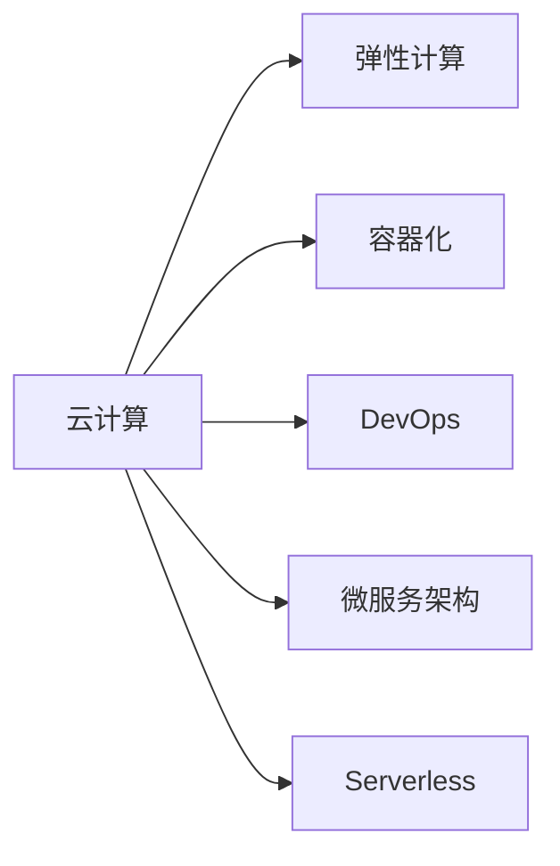
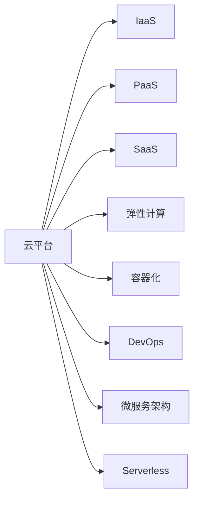

                 

# 利用云计算实现创业自动化

在当今快速变化的商业环境中，创业公司面临着前所未有的挑战。传统的IT基础设施成本高昂，维护复杂，而云计算提供了一种灵活、高效且成本可控的解决方案。本文将深入探讨利用云计算实现创业自动化的核心概念、技术原理和具体实践，帮助创业者掌握如何利用云计算技术，简化创业过程，加速业务增长。

## 1. 背景介绍

### 1.1 问题由来

随着互联网和移动互联网的迅速发展，创业者在开拓新业务时，常常需要依赖于高效的IT基础设施来支持各种应用程序的开发、测试、部署和管理。然而，传统的本地服务器和数据中心模式不仅需要巨大的初始投资和运营成本，而且难以应对业务需求快速变化和扩展的需求。因此，如何以更低的成本和更高的效率支持创业公司的业务，成为了一个迫切需要解决的问题。

### 1.2 问题核心关键点

云计算的出现，提供了一种全新的IT基础设施部署方式，它允许创业者按需使用计算资源，而无需投资和管理自己的数据中心。其核心关键点包括：

- **弹性计算**：根据业务需求，自动扩展或缩减计算资源，确保系统的可靠性和性能。
- **全球分布**：在全球范围内提供计算资源，支持跨国业务和远程团队协作。
- **高可用性**：提供多数据中心和冗余备份，确保业务连续性和数据安全性。
- **自助服务**：用户可以自助部署和管理应用，简化了IT流程。
- **经济高效**：按使用量付费，避免初始投资和过剩资源浪费。

通过理解这些关键点，创业者可以更好地利用云计算实现业务自动化，提升运营效率和灵活性。

## 2. 核心概念与联系

### 2.1 核心概念概述

为深入理解云计算如何支持创业自动化，下面将介绍几个核心概念及其相互联系：

- **云计算**：利用互联网提供计算资源和服务的模式，包括基础设施即服务（IaaS）、平台即服务（PaaS）和软件即服务（SaaS）等。
- **弹性计算**：根据需求动态调整计算资源，确保系统的灵活性和成本效益。
- **容器化**：使用容器技术（如Docker）来封装和隔离应用，提升部署效率和可移植性。
- **DevOps**：融合软件开发（Dev）和运维（Ops）的实践，以自动化方式加速软件开发和交付。
- **微服务架构**：将应用拆分成一组独立的、可以独立部署和扩展的服务，提高系统的可维护性和扩展性。
- **Serverless**：由云服务提供商自动管理计算资源，开发者只需关注应用逻辑，无需管理底层基础设施。

这些概念通过Mermaid流程图来表示：



### 2.2 核心概念原理和架构的 Mermaid 流程图



这个流程图展示了云计算体系架构的各个层次及其相互关系。其中：

- 云平台（A）提供了不同层级的服务（B-I），包括基础设施、平台和应用服务。
- IaaS层（B）提供了基本的计算和存储资源，由用户自行管理和优化。
- PaaS层（C）提供了更高层次的服务，如数据库、消息队列等，简化了应用开发。
- SaaS层（D）直接提供应用服务，用户无需担心底层基础设施。
- 弹性计算（E）支持动态调整计算资源，以适应业务变化。
- 容器化（F）封装和隔离应用，提高部署效率和可移植性。
- DevOps（G）融合开发和运维，加速软件开发和交付。
- 微服务架构（H）将应用拆分为独立的服务，提高系统灵活性和可维护性。
- Serverless（I）自动管理计算资源，开发者专注于应用逻辑。

## 3. 核心算法原理 & 具体操作步骤

### 3.1 算法原理概述

利用云计算实现创业自动化，主要涉及以下算法原理：

- **云基础设施管理**：通过API或SDK，自动化管理云基础设施，如虚拟机、存储和网络资源。
- **应用部署与监控**：使用容器技术和DevOps工具，实现应用的自动部署、测试、部署和监控。
- **自动化测试**：使用持续集成和持续部署（CI/CD）工具，自动化执行测试和发布流程。
- **弹性伸缩**：根据业务负载动态调整计算资源，确保系统性能和成本效益。
- **安全与合规**：使用云安全服务和合规性工具，确保数据和应用的安全性和合法性。

### 3.2 算法步骤详解

下面详细介绍利用云计算实现创业自动化的具体操作步骤：

#### 3.2.1 选择云平台

首先，选择适合自己业务的云平台，如AWS、Azure或Google Cloud。考虑因素包括成本、功能、可用性和支持等。

#### 3.2.2 部署基础设施

根据业务需求，使用云平台的API或管理控制台，部署虚拟服务器、数据库和存储等基础设施。

#### 3.2.3 容器化应用

将应用封装到容器中（如Docker），确保应用的可移植性和快速部署。使用容器编排工具（如Kubernetes）管理容器集群。

#### 3.2.4 自动化部署与测试

使用CI/CD工具（如Jenkins、GitLab CI/CD）自动化执行应用的部署和测试流程，确保代码质量。

#### 3.2.5 持续监控与优化

使用监控工具（如Prometheus、Grafana）实时监控应用性能和资源使用情况，及时发现和解决问题。

#### 3.2.6 安全与合规

使用云平台的安全服务（如AWS Security Hub、Azure Security Center）和合规性工具（如GDPR Compliance Center），确保应用和数据的安全性和合法性。

### 3.3 算法优缺点

云计算实现创业自动化的主要优点包括：

- **成本效益**：按需使用计算资源，避免过剩资源浪费。
- **高可用性**：多数据中心和冗余备份，确保业务连续性和数据安全性。
- **弹性伸缩**：根据业务需求动态调整计算资源，确保系统性能。
- **易于管理**：自动化管理云基础设施，简化IT流程。

但同时也存在一些缺点：

- **数据隐私**：云服务提供商可能访问敏感数据，需要加强数据加密和安全管理。
- **服务中断**：云服务提供商可能出现服务中断或数据丢失，影响业务连续性。
- **依赖供应商**：依赖云服务提供商的稳定性和可靠性，可能影响业务运营。

### 3.4 算法应用领域

云计算实现创业自动化的应用领域非常广泛，包括但不限于：

- **开发与测试**：自动化执行代码审查、构建、测试和部署，加速软件开发生命周期。
- **生产环境部署**：使用容器化和DevOps工具，实现应用的快速部署和更新。
- **数据分析与处理**：使用云平台的数据分析服务（如AWS EMR、Azure HDInsight）处理大规模数据集。
- **DevOps自动化**：通过自动化测试、部署和监控，提高开发和运维效率。
- **移动应用开发**：使用云平台提供的移动应用服务（如AWS Amplify、Azure App Service），简化移动应用开发流程。
- **物联网应用**：使用云平台提供的IoT服务（如AWS IoT、Azure IoT Hub），构建智能物联网应用。

## 4. 数学模型和公式 & 详细讲解 & 举例说明

### 4.1 数学模型构建

在云计算中，资源的使用量是通过计费模型来计算的。通常使用以下公式来计算费用：

$$
Cost = (Usage \times Rate) + (Usage \times Rate \times Time)
$$

其中，Usage表示使用的资源量，Rate表示每单位资源的价格，Time表示使用时间。

### 4.2 公式推导过程

假设云平台提供的计算资源单价为每小时1美元，业务需求在一段时间内需要1000个计算实例，每个实例的计算时间为10小时，则费用计算如下：

$$
Cost = (1000 \times 1 \times 10) + (1000 \times 1 \times 10 \times 0.5)
$$

$$
Cost = 10000 + 5000 = 15000
$$

### 4.3 案例分析与讲解

假设某创业公司需要在某段时间内使用500台计算实例，每个实例的计算时间为2小时，云平台提供的计算实例单价为每小时0.5美元，则总费用计算如下：

$$
Cost = (500 \times 0.5 \times 2) + (500 \times 0.5 \times 2 \times 0.5)
$$

$$
Cost = 500 + 250 = 750
$$

通过计算可以发现，尽管创业公司只使用了有限的资源，但通过按需计费的方式，大大降低了初始投资和过剩资源的浪费，实现了成本效益。

## 5. 项目实践：代码实例和详细解释说明

### 5.1 开发环境搭建

#### 5.1.1 安装依赖

首先，安装Python和云平台提供的SDK，如AWS CLI、Azure CLI等。

```bash
# 安装AWS CLI
pip install awscli --upgrade --user
# 配置AWS CLI
aws configure
```

#### 5.1.2 设置云平台账户

在云平台管理控制台中创建和管理云账户，确保有权访问所需的资源。

### 5.2 源代码详细实现

#### 5.2.1 云资源部署

使用云平台的API或管理控制台，部署所需的云资源。

```python
import boto3

# 创建EC2实例
ec2 = boto3.resource('ec2')
instance = ec2.create_instances(
    ImageId='ami-0123456789abcdef0', 
    MinCount=1, 
    MaxCount=1, 
    InstanceType='t2.micro', 
    KeyName='my-key-pair'
)
```

#### 5.2.2 应用容器化

将应用打包为容器镜像，并使用容器编排工具管理容器集群。

```docker
# 构建Docker镜像
docker build -t my-app .
# 推送镜像到容器注册表
docker tag my-app:latest my-registry-url/my-app:latest
docker push my-registry-url/my-app:latest
# 部署容器到Kubernetes集群
kubectl apply -f deployment.yaml
```

#### 5.2.3 自动化部署与测试

使用CI/CD工具自动化执行应用的部署和测试流程。

```yaml
# Jenkinsfile
pipeline {
    agent any
    stages {
        stage('Build') {
            steps {
                sh 'docker build -t my-app:latest .'
            }
        }
        stage('Test') {
            steps {
                sh 'docker run --rm -it my-app:latest bash -c "echo hello world"'
            }
        }
        stage('Deploy') {
            steps {
                sh 'kubectl apply -f deployment.yaml'
            }
        }
    }
}
```

### 5.3 代码解读与分析

**云资源部署**

- **EC2实例创建**：使用AWS SDK创建EC2实例，指定镜像ID、实例类型、密钥对等参数。
- **Elastic Load Balancer创建**：创建ELB，将实例添加到负载均衡器中，确保高可用性和负载均衡。
- **RDS数据库创建**：创建RDS数据库实例，用于存储和管理应用数据。

**应用容器化**

- **Docker构建镜像**：将应用打包为Docker镜像，指定镜像名称和标签。
- **Docker镜像推送**：将镜像推送到容器注册表中，如Amazon ECR、Docker Hub等。
- **Kubernetes集群部署**：使用Kubernetes API或CLI部署容器，指定Deployment和Service等资源。

**自动化部署与测试**

- **Jenkinsfile**：定义Jenkins pipeline，实现构建、测试和部署流程的自动化。
- **测试脚本**：编写测试脚本，确保应用在容器环境中能够正常运行。
- **部署脚本**：编写部署脚本，将应用部署到Kubernetes集群中，并进行负载均衡和自动扩展。

### 5.4 运行结果展示

在Jenkins控制台中查看任务执行结果，确认应用是否成功部署。

```bash
[Pipeline] deploying
[Pipeline] > Step 'apply'
...
[Pipeline] > Step 'test'
...
[Pipeline] > Step 'deploy'
...
[Pipeline] > Step 'echo'
[Pipeline] > Step 'echo'
```

## 6. 实际应用场景

### 6.1 创业企业自动化的典型案例

#### 6.1.1 电商平台自动化

某电商平台使用AWS云平台，实现网站的自动化部署、负载均衡和弹性伸缩。具体步骤包括：

- 使用EC2实例部署网站服务器，使用ELB实现负载均衡。
- 使用ECS容器服务部署应用，使用Fargate实现按需计算资源。
- 使用RDS数据库存储和管理订单数据。
- 使用S3存储静态资源，如图片和视频。

#### 6.1.2 移动应用开发

某创业公司使用Azure云平台，实现移动应用的自动化部署和监控。具体步骤包括：

- 使用Azure App Service部署移动应用，使用Azure Functions处理后台逻辑。
- 使用Azure DevOps实现CI/CD流程，自动化构建和部署应用。
- 使用Azure Monitor监控应用性能，使用Azure Application Insights收集日志和异常。

### 6.2 未来应用展望

#### 6.2.1 边缘计算

随着物联网和移动设备的普及，边缘计算成为云计算的重要补充。创业公司可以利用边缘计算平台（如AWS Greengrass、Azure IoT Edge），将计算资源部署到靠近用户设备的边缘节点，提高响应速度和数据安全性。

#### 6.2.2 人工智能与机器学习

云计算平台提供了丰富的人工智能和机器学习服务（如AWS SageMaker、Azure Machine Learning），创业公司可以方便地集成这些服务，加速模型训练和部署，提高业务智能化水平。

#### 6.2.3 区块链

区块链技术为创业公司提供了安全、透明的数据管理和共享方式。使用云平台的区块链服务（如AWS Blockchain、Azure Blockchain），可以构建基于区块链的智能合约和去中心化应用。

## 7. 工具和资源推荐

### 7.1 学习资源推荐

为了帮助创业者掌握云计算的原理和实践，以下推荐一些优质的学习资源：

- **AWS认证**：获得AWS认证是了解AWS云平台的最佳方式。AWS提供丰富的培训课程和考试，涵盖AWS核心服务和管理工具。
- **Azure认证**：Azure认证课程和考试可以帮助你深入理解Azure云平台的工作原理和实践技巧。
- **Google Cloud认证**：Google Cloud提供丰富的培训课程和认证考试，涵盖Google Cloud平台的核心服务和最佳实践。
- **在线课程**：Coursera、Udemy等在线学习平台提供大量的云计算课程，覆盖云平台原理、DevOps工具和容器化技术等。
- **技术博客和社区**：AWS、Azure和Google Cloud官方博客和社区，提供丰富的技术文章、白皮书和案例研究，帮助开发者解决实际问题。

### 7.2 开发工具推荐

#### 7.2.1 云平台管理工具

- **AWS CLI**：AWS控制台和命令行工具，方便管理AWS云资源。
- **Azure CLI**：Azure控制台和命令行工具，用于管理Azure云资源。
- **Google Cloud SDK**：Google Cloud控制台和命令行工具，用于管理Google Cloud云资源。

#### 7.2.2 DevOps工具

- **Jenkins**：开源的CI/CD工具，支持多种云平台和容器编排工具。
- **GitLab CI/CD**：集成到GitLab的CI/CD工具，提供持续集成和持续部署功能。
- **Kubernetes**：开源的容器编排工具，支持多节点集群管理和自动化部署。

#### 7.2.3 容器化工具

- **Docker**：开源的容器化工具，支持应用封装和容器编排。
- **Kubernetes**：开源的容器编排工具，支持多节点集群管理和自动化部署。

### 7.3 相关论文推荐

云计算技术的快速发展带来了大量学术论文。以下推荐几篇前沿论文，以供参考：

- **云计算安全与隐私**：探讨云计算环境下的安全与隐私问题，提出基于区块链和多方计算的解决方案。
- **云资源优化**：研究如何优化云资源的分配和使用，提高云平台的成本效益。
- **云平台性能优化**：研究云平台的性能优化技术，如负载均衡、弹性伸缩和缓存策略。
- **云计算架构**：探讨云计算架构的设计和优化，如微服务架构和Serverless架构。

## 8. 总结：未来发展趋势与挑战

### 8.1 研究成果总结

本文探讨了利用云计算实现创业自动化的核心概念、技术原理和具体实践。主要研究成果包括：

- 详细介绍了云计算的弹性计算、容器化、DevOps和微服务架构等技术原理。
- 通过代码实例展示了如何在AWS、Azure和Google Cloud等云平台上进行云资源部署、应用容器化和自动化部署与测试。
- 通过实际应用场景展示了云计算在电商平台、移动应用开发和物联网等领域的应用。

### 8.2 未来发展趋势

未来云计算技术的发展趋势包括：

- **边缘计算**：边缘计算将成为云计算的重要补充，支持物联网和移动设备的计算需求。
- **人工智能与机器学习**：云计算平台将进一步集成人工智能和机器学习服务，提高业务智能化水平。
- **区块链**：区块链技术将为云计算平台提供安全、透明的数据管理和共享方式。

### 8.3 面临的挑战

尽管云计算技术取得了显著进展，但在实际应用中也面临一些挑战：

- **数据隐私和安全**：云计算平台需要加强数据加密和安全管理，确保敏感数据的安全。
- **服务中断和可靠性**：云服务提供商可能出现服务中断或数据丢失，影响业务连续性。
- **依赖供应商**：依赖云服务提供商的稳定性和可靠性，可能影响业务运营。

### 8.4 研究展望

未来的研究方向包括：

- **多云管理**：研究如何跨多个云平台进行资源管理和应用部署，提高资源利用率和业务连续性。
- **自动化运维**：研究如何自动化运维流程，提高运维效率和故障处理能力。
- **云原生应用**：研究如何构建基于云原生（如Kubernetes、Docker）的应用，提高应用的可移植性和扩展性。

## 9. 附录：常见问题与解答

**Q1: 使用云计算需要考虑哪些成本因素？**

A: 使用云计算需要考虑以下成本因素：

- **计算成本**：按使用量计费，需要根据实际使用量计算费用。
- **存储成本**：按使用量计费，需要根据实际存储量计算费用。
- **网络成本**：按使用量计费，需要根据实际带宽使用情况计算费用。
- **数据传输成本**：按数据量计费，需要根据实际数据传输量计算费用。

**Q2: 云计算平台提供的弹性计算如何实现？**

A: 云计算平台提供的弹性计算通过以下方式实现：

- **自动扩展**：根据业务需求自动扩展或缩减计算资源，确保系统性能和成本效益。
- **负载均衡**：将计算资源分配到多个实例中，提高系统的可用性和性能。
- **自愈机制**：自动检测和修复系统故障，确保系统连续性和稳定性。

**Q3: 如何确保云计算环境下的数据安全？**

A: 确保云计算环境下的数据安全需要采取以下措施：

- **数据加密**：对数据进行加密存储和传输，确保数据安全。
- **访问控制**：使用身份和访问管理（IAM）工具，限制对敏感数据的访问权限。
- **审计和合规性**：使用云安全服务和合规性工具，定期审计和检查系统的合规性。

**Q4: 如何选择合适的云计算平台？**

A: 选择合适的云计算平台需要考虑以下因素：

- **成本**：根据业务需求和预算选择合适的云平台，避免过剩资源浪费。
- **功能**：根据业务需求选择合适的云平台功能，如弹性计算、容器化、DevOps等。
- **可用性**：根据业务需求选择合适的云平台可用性，确保业务连续性和数据安全性。
- **支持**：选择有良好支持和服务的云平台，确保问题能够及时解决。

通过深入理解和掌握云计算的原理和实践，创业者可以更好地利用云计算技术，简化创业过程，加速业务增长。在未来的发展中，云计算将为创业公司提供更加灵活、高效和成本可控的IT基础设施，助力其在激烈的市场竞争中脱颖而出。

