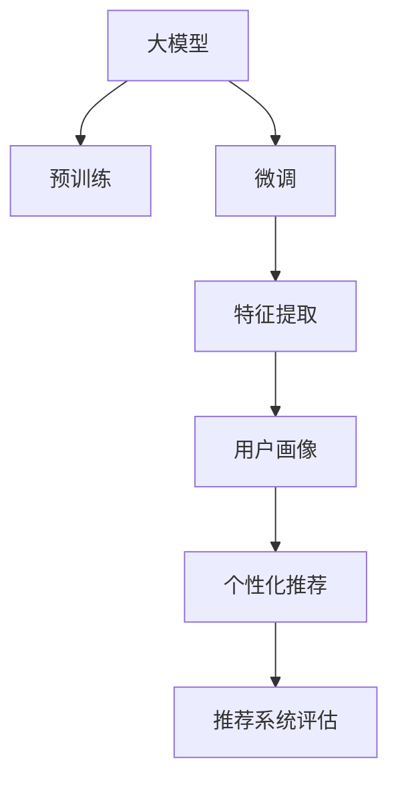

                 

## 1. 背景介绍

### 1.1 问题由来

在智能推荐系统中，用户行为模式挖掘是一个重要的研究方向。传统的推荐系统依赖于用户历史行为数据，但这些数据往往稀疏且不完整。为了提升推荐的个性化和精准度，推荐系统需要了解用户的兴趣和偏好，这通常需要大规模用户行为数据的建模和分析。而基于大模型的推荐系统，特别是预训练语言模型，通过学习大量文本语料，能够获取丰富的用户行为和兴趣特征，从而大幅提升推荐系统的性能。

### 1.2 问题核心关键点

基于大模型的推荐系统，核心在于如何高效地挖掘用户行为模式，并利用这些模式进行个性化推荐。具体来说，需要解决以下关键问题：

1. **数据预处理**：如何将原始用户行为数据转化为机器学习模型可以处理的格式。
2. **特征提取**：如何从预处理后的数据中提取有意义的特征。
3. **用户画像构建**：如何利用提取的特征构建用户画像，反映用户的行为模式和兴趣偏好。
4. **推荐算法设计**：如何在用户画像的基础上，设计高效的推荐算法，实现个性化推荐。
5. **模型评估与优化**：如何评估推荐系统的性能，并根据反馈不断优化。

### 1.3 问题研究意义

用户行为模式挖掘技术能够帮助推荐系统更好地理解用户需求，提升推荐的个性化和精准度。具体意义如下：

1. **提升用户体验**：通过个性化推荐，使用户在平台上的体验更加流畅和愉悦。
2. **增加用户粘性**：推荐系统的精准推荐能使用户停留时间更长，增加用户粘性。
3. **提高转化率**：通过推荐高相关度内容，提升用户转化率，增加平台收益。
4. **加速产品迭代**：基于用户行为的数据分析，帮助产品经理了解用户需求，快速迭代产品功能。

## 2. 核心概念与联系

### 2.1 核心概念概述

为更好地理解基于大模型的推荐系统，我们需要对一些核心概念进行梳理：

- **大模型**：以Transformer、BERT等模型为代表的大规模预训练语言模型。通过学习大量文本数据，能够获取丰富的语义和特征信息。
- **预训练**：在大规模无标签文本数据上进行自监督学习，学习语言的通用表示。
- **微调**：在预训练模型的基础上，使用任务相关的标注数据进行有监督学习，适应特定任务。
- **用户画像**：通过挖掘用户行为特征，构建用户的行为模式和兴趣偏好描述。
- **个性化推荐**：根据用户画像，设计推荐算法，生成个性化推荐结果。
- **推荐系统评估**：通过A/B测试、用户反馈等手段，评估推荐系统的性能和效果。

这些概念通过以下Mermaid流程图来展示：



这个流程图展示了基于大模型的推荐系统的核心逻辑：

1. 大模型通过预训练获得基础能力。
2. 微调使得通用大模型更好地适应特定推荐任务。
3. 特征提取从用户行为数据中挖掘有意义的特征。
4. 用户画像通过提取的特征构建用户行为模式和兴趣偏好。
5. 个性化推荐在用户画像的基础上设计推荐算法。
6. 推荐系统评估根据用户反馈和A/B测试评估推荐效果。

## 3. 核心算法原理 & 具体操作步骤

### 3.1 算法原理概述

基于大模型的推荐系统，利用大模型的语义理解能力和特征提取能力，从用户行为数据中挖掘用户的行为模式和兴趣偏好。具体来说，通过预训练和微调学习到的语言表示，能够捕捉到用户行为数据中的语义信息，从而在推荐算法中得到应用。

### 3.2 算法步骤详解

基于大模型的推荐系统主要包括以下几个关键步骤：

1. **数据预处理**：
   - 收集用户行为数据，如浏览记录、点击记录、评分记录等。
   - 对原始数据进行清洗和格式转换，如去重、标准化等。
   - 将用户行为数据转化为文本格式，便于大模型的处理。

2. **特征提取**：
   - 使用大模型对预处理后的文本进行编码，提取语义特征。
   - 通过上下文感知的方式，捕捉用户行为数据中的语义信息。
   - 对提取的特征进行降维和聚类，减少噪声和冗余。

3. **用户画像构建**：
   - 根据提取的特征，构建用户画像，反映用户的行为模式和兴趣偏好。
   - 使用聚类算法对用户进行分组，找出具有相似行为特征的用户群体。
   - 利用用户画像进行用户分群，实现细粒度的推荐。

4. **推荐算法设计**：
   - 设计高效的推荐算法，如协同过滤、基于内容的推荐、混合推荐等。
   - 利用用户画像，实现个性化推荐，提升推荐的相关性和多样性。
   - 引入用户反馈和点击率等信号，实时调整推荐策略。

5. **模型评估与优化**：
   - 使用A/B测试和用户反馈，评估推荐系统的性能。
   - 根据评估结果，不断优化推荐算法和用户画像模型。
   - 引入用户隐私保护机制，确保用户数据的安全性。

### 3.3 算法优缺点

基于大模型的推荐系统具有以下优点：

1. **数据适应性强**：能够适应不同类型和规模的用户行为数据，提供多模态特征支持。
2. **特征提取能力强**：通过大模型的语义理解能力，能够从文本数据中挖掘更深层次的语义信息。
3. **推荐效果显著**：基于用户画像的推荐算法，能够实现个性化推荐，提升用户体验。
4. **模型可解释性强**：通过大模型的预训练和微调，推荐算法的决策过程具有可解释性。

但同时，基于大模型的推荐系统也存在一些局限性：

1. **计算资源需求高**：大模型的预训练和微调需要大量的计算资源，可能对部署环境提出高要求。
2. **数据隐私问题**：用户行为数据涉及隐私，需要严格的数据保护和隐私政策。
3. **模型复杂度高**：大模型参数量庞大，可能增加推荐系统的复杂度，影响推理速度。
4. **推荐鲁棒性不足**：模型在面临冷启动用户或噪声数据时，推荐效果可能下降。

### 3.4 算法应用领域

基于大模型的推荐系统已经在多个领域得到了应用，例如：

- **电商推荐**：通过分析用户的浏览和购买记录，为用户推荐感兴趣的商品。
- **音乐推荐**：分析用户的听歌记录和评分，推荐适合的音乐。
- **视频推荐**：根据用户的观看历史和评分，推荐相关视频内容。
- **新闻推荐**：分析用户的新闻阅读记录，推荐相关新闻内容。
- **社交网络推荐**：分析用户在平台上的互动行为，推荐感兴趣的朋友和内容。

除了这些经典应用外，大模型推荐系统还被创新性地应用到更多场景中，如推荐系统与知识图谱的结合，基于用户画像的情感分析推荐等，为推荐系统带来了新的突破。

## 4. 数学模型和公式 & 详细讲解  
### 4.1 数学模型构建

本节将使用数学语言对基于大模型的推荐系统进行更加严格的刻画。

记大模型为 $M_{\theta}$，其中 $\theta$ 为模型参数。假设推荐任务的数据集为 $D=\{(x_i,y_i)\}_{i=1}^N, x_i \in \mathbb{R}^d, y_i \in \{1,-1\}$，其中 $x_i$ 为用户行为数据，$y_i$ 为推荐标签。

定义推荐任务的损失函数为：

$$
\mathcal{L}(\theta) = \frac{1}{N} \sum_{i=1}^N [y_i\log M_{\theta}(x_i)+(1-y_i)\log(1-M_{\theta}(x_i))]
$$

其中，$M_{\theta}(x_i)$ 表示模型对用户行为数据的预测输出，$y_i$ 表示推荐标签。

微调的目标是最小化损失函数，即找到最优参数：

$$
\theta^* = \mathop{\arg\min}_{\theta} \mathcal{L}(\theta)
$$

在实践中，我们通常使用基于梯度的优化算法（如SGD、Adam等）来近似求解上述最优化问题。设 $\eta$ 为学习率，$\lambda$ 为正则化系数，则参数的更新公式为：

$$
\theta \leftarrow \theta - \eta \nabla_{\theta}\mathcal{L}(\theta) - \eta\lambda\theta
$$

其中 $\nabla_{\theta}\mathcal{L}(\theta)$ 为损失函数对参数 $\theta$ 的梯度，可通过反向传播算法高效计算。

### 4.2 公式推导过程

以下我们以电商推荐为例，推导基于大模型的推荐系统中的交叉熵损失函数及其梯度的计算公式。

假设模型 $M_{\theta}$ 在用户行为数据 $x$ 上的输出为 $\hat{y}=M_{\theta}(x) \in [0,1]$，表示用户点击的概率。真实标签 $y \in \{0,1\}$。则交叉熵损失函数定义为：

$$
\ell(M_{\theta}(x),y) = -[y\log \hat{y} + (1-y)\log (1-\hat{y})]
$$

将其代入经验风险公式，得：

$$
\mathcal{L}(\theta) = -\frac{1}{N}\sum_{i=1}^N [y_i\log M_{\theta}(x_i)+(1-y_i)\log(1-M_{\theta}(x_i))]
$$

根据链式法则，损失函数对参数 $\theta_k$ 的梯度为：

$$
\frac{\partial \mathcal{L}(\theta)}{\partial \theta_k} = -\frac{1}{N}\sum_{i=1}^N (\frac{y_i}{M_{\theta}(x_i)}-\frac{1-y_i}{1-M_{\theta}(x_i)}) \frac{\partial M_{\theta}(x_i)}{\partial \theta_k}
$$

其中 $\frac{\partial M_{\theta}(x_i)}{\partial \theta_k}$ 可进一步递归展开，利用自动微分技术完成计算。

### 4.3 案例分析与讲解

假设有一个电商平台，需要为用户推荐商品。我们收集了用户的浏览记录和购买记录，并对其进行预处理和格式转换。接下来，使用大模型BERT对预处理后的文本进行编码，提取语义特征。然后，通过聚类算法将用户分为不同的群体，构建用户画像。最后，设计基于用户画像的协同过滤推荐算法，实现个性化推荐。

在实现过程中，需要注意以下关键步骤：

1. **数据预处理**：收集用户浏览记录和购买记录，进行去重和格式标准化。
2. **特征提取**：使用BERT对预处理后的文本进行编码，提取语义特征。
3. **用户画像构建**：通过聚类算法对用户进行分组，构建用户画像。
4. **推荐算法设计**：设计基于用户画像的协同过滤推荐算法。
5. **模型评估与优化**：通过A/B测试和用户反馈评估推荐效果，不断优化推荐算法和用户画像模型。

## 5. 项目实践：代码实例和详细解释说明

### 5.1 开发环境搭建

在进行推荐系统开发前，我们需要准备好开发环境。以下是使用Python进行PyTorch开发的环境配置流程：

1. 安装Anaconda：从官网下载并安装Anaconda，用于创建独立的Python环境。

2. 创建并激活虚拟环境：
```bash
conda create -n pytorch-env python=3.8 
conda activate pytorch-env
```

3. 安装PyTorch：根据CUDA版本，从官网获取对应的安装命令。例如：
```bash
conda install pytorch torchvision torchaudio cudatoolkit=11.1 -c pytorch -c conda-forge
```

4. 安装Transformers库：
```bash
pip install transformers
```

5. 安装各类工具包：
```bash
pip install numpy pandas scikit-learn matplotlib tqdm jupyter notebook ipython
```

完成上述步骤后，即可在`pytorch-env`环境中开始推荐系统开发。

### 5.2 源代码详细实现

下面我们以电商推荐为例，给出使用Transformers库对BERT模型进行推荐系统微调的PyTorch代码实现。

首先，定义推荐任务的数据处理函数：

```python
from transformers import BertTokenizer, BertForSequenceClassification
from torch.utils.data import Dataset, DataLoader
import torch

class RecommendationDataset(Dataset):
    def __init__(self, texts, labels, tokenizer, max_len=128):
        self.texts = texts
        self.labels = labels
        self.tokenizer = tokenizer
        self.max_len = max_len
        
    def __len__(self):
        return len(self.texts)
    
    def __getitem__(self, item):
        text = self.texts[item]
        label = self.labels[item]
        
        encoding = self.tokenizer(text, return_tensors='pt', max_length=self.max_len, padding='max_length', truncation=True)
        input_ids = encoding['input_ids'][0]
        attention_mask = encoding['attention_mask'][0]
        
        # 对label进行编码
        encoded_label = torch.tensor(label, dtype=torch.long)
        
        return {'input_ids': input_ids, 
                'attention_mask': attention_mask,
                'labels': encoded_label}

# 创建dataset
tokenizer = BertTokenizer.from_pretrained('bert-base-cased')

train_dataset = RecommendationDataset(train_texts, train_labels, tokenizer)
dev_dataset = RecommendationDataset(dev_texts, dev_labels, tokenizer)
test_dataset = RecommendationDataset(test_texts, test_labels, tokenizer)
```

然后，定义模型和优化器：

```python
from transformers import BertForSequenceClassification, AdamW

model = BertForSequenceClassification.from_pretrained('bert-base-cased', num_labels=2)

optimizer = AdamW(model.parameters(), lr=2e-5)
```

接着，定义训练和评估函数：

```python
from tqdm import tqdm

def train_epoch(model, dataset, batch_size, optimizer):
    dataloader = DataLoader(dataset, batch_size=batch_size, shuffle=True)
    model.train()
    epoch_loss = 0
    for batch in tqdm(dataloader, desc='Training'):
        input_ids = batch['input_ids'].to(device)
        attention_mask = batch['attention_mask'].to(device)
        labels = batch['labels'].to(device)
        model.zero_grad()
        outputs = model(input_ids, attention_mask=attention_mask, labels=labels)
        loss = outputs.loss
        epoch_loss += loss.item()
        loss.backward()
        optimizer.step()
    return epoch_loss / len(dataloader)

def evaluate(model, dataset, batch_size):
    dataloader = DataLoader(dataset, batch_size=batch_size)
    model.eval()
    preds, labels = [], []
    with torch.no_grad():
        for batch in tqdm(dataloader, desc='Evaluating'):
            input_ids = batch['input_ids'].to(device)
            attention_mask = batch['attention_mask'].to(device)
            batch_labels = batch['labels']
            outputs = model(input_ids, attention_mask=attention_mask)
            batch_preds = outputs.logits.argmax(dim=2).to('cpu').tolist()
            batch_labels = batch_labels.to('cpu').tolist()
            for pred, label in zip(batch_preds, batch_labels):
                preds.append(pred)
                labels.append(label)
                
    print(classification_report(labels, preds))
```

最后，启动训练流程并在测试集上评估：

```python
epochs = 5
batch_size = 16

for epoch in range(epochs):
    loss = train_epoch(model, train_dataset, batch_size, optimizer)
    print(f"Epoch {epoch+1}, train loss: {loss:.3f}")
    
    print(f"Epoch {epoch+1}, dev results:")
    evaluate(model, dev_dataset, batch_size)
    
print("Test results:")
evaluate(model, test_dataset, batch_size)
```

以上就是使用PyTorch对BERT进行电商推荐任务微调的完整代码实现。可以看到，得益于Transformers库的强大封装，我们可以用相对简洁的代码完成BERT模型的加载和微调。

### 5.3 代码解读与分析

让我们再详细解读一下关键代码的实现细节：

**RecommendationDataset类**：
- `__init__`方法：初始化文本、标签、分词器等关键组件。
- `__len__`方法：返回数据集的样本数量。
- `__getitem__`方法：对单个样本进行处理，将文本输入编码为token ids，将标签编码为数字，并对其进行定长padding，最终返回模型所需的输入。

**交叉熵损失函数**：
- 定义交叉熵损失函数，计算模型对用户行为数据的预测输出与真实标签之间的差异。
- 通过链式法则，计算损失函数对模型参数的梯度。

**训练和评估函数**：
- 使用PyTorch的DataLoader对数据集进行批次化加载，供模型训练和推理使用。
- 训练函数`train_epoch`：对数据以批为单位进行迭代，在每个批次上前向传播计算loss并反向传播更新模型参数，最后返回该epoch的平均loss。
- 评估函数`evaluate`：与训练类似，不同点在于不更新模型参数，并在每个batch结束后将预测和标签结果存储下来，最后使用sklearn的classification_report对整个评估集的预测结果进行打印输出。

**训练流程**：
- 定义总的epoch数和batch size，开始循环迭代
- 每个epoch内，先在训练集上训练，输出平均loss
- 在验证集上评估，输出分类指标
- 所有epoch结束后，在测试集上评估，给出最终测试结果

可以看到，PyTorch配合Transformers库使得BERT微调的代码实现变得简洁高效。开发者可以将更多精力放在数据处理、模型改进等高层逻辑上，而不必过多关注底层的实现细节。

当然，工业级的系统实现还需考虑更多因素，如模型的保存和部署、超参数的自动搜索、更灵活的任务适配层等。但核心的微调范式基本与此类似。

## 6. 实际应用场景
### 6.1 智能客服系统

基于大模型的推荐系统可以应用于智能客服系统的构建。传统客服往往需要配备大量人力，高峰期响应缓慢，且一致性和专业性难以保证。而使用基于大模型的推荐系统，可以7x24小时不间断服务，快速响应客户咨询，用自然流畅的语言解答各类常见问题。

在技术实现上，可以收集企业内部的历史客服对话记录，将问题和最佳答复构建成监督数据，在此基础上对预训练推荐模型进行微调。微调后的推荐模型能够自动理解用户意图，匹配最合适的答复模板进行回复。对于客户提出的新问题，还可以接入检索系统实时搜索相关内容，动态组织生成回答。如此构建的智能客服系统，能大幅提升客户咨询体验和问题解决效率。

### 6.2 金融舆情监测

金融机构需要实时监测市场舆论动向，以便及时应对负面信息传播，规避金融风险。传统的人工监测方式成本高、效率低，难以应对网络时代海量信息爆发的挑战。基于大模型的推荐系统，可以自动监测不同主题下的情感变化趋势，一旦发现负面信息激增等异常情况，系统便会自动预警，帮助金融机构快速应对潜在风险。

### 6.3 个性化推荐系统

当前的推荐系统往往只依赖用户的历史行为数据进行物品推荐，无法深入理解用户的真实兴趣偏好。基于大模型的推荐系统，能够从用户的文本数据中挖掘更深层次的语义信息，从而提升推荐的个性化和精准度。

在实践中，可以收集用户浏览、点击、评论、分享等行为数据，提取和用户交互的物品标题、描述、标签等文本内容。将文本内容作为模型输入，用户的后续行为（如是否点击、购买等）作为监督信号，在此基础上微调预训练语言模型。微调后的模型能够从文本内容中准确把握用户的兴趣点。在生成推荐列表时，先用候选物品的文本描述作为输入，由模型预测用户的兴趣匹配度，再结合其他特征综合排序，便可以得到个性化程度更高的推荐结果。

### 6.4 未来应用展望

随着大模型和推荐系统的不断发展，基于大模型的推荐系统将在更多领域得到应用，为各行各业带来变革性影响。

在智慧医疗领域，基于大模型的推荐系统可以推荐医生和药物，帮助患者找到合适的医疗资源和药物方案。

在智能教育领域，推荐系统可以推荐课程和资料，帮助学生找到最适合的学习资源。

在智慧城市治理中，推荐系统可以推荐合适的服务和生活资源，提高市民生活质量。

此外，在企业生产、社会治理、文娱传媒等众多领域，基于大模型的推荐系统也将不断涌现，为经济社会发展注入新的动力。相信随着技术的日益成熟，基于大模型的推荐系统必将在构建人机协同的智能时代中扮演越来越重要的角色。

## 7. 工具和资源推荐
### 7.1 学习资源推荐

为了帮助开发者系统掌握大模型推荐系统的理论基础和实践技巧，这里推荐一些优质的学习资源：

1. 《Transformers: From Research to Production》系列博文：由大模型技术专家撰写，深入浅出地介绍了Transformer原理、BERT模型、推荐系统等前沿话题。

2. 《Deep Learning for Recommendation Systems》课程：斯坦福大学开设的推荐系统课程，介绍了多种推荐算法的原理和实现。

3. 《推荐系统实战》书籍：详细介绍了推荐系统的设计和实现方法，包括基于大模型的推荐系统。

4. Coursera上的《Recommender Systems》课程：由LinkedIn等公司提供，介绍了推荐系统的基本概念和算法。

5. GitHub上的开源项目，如TensorFlow Recommenders、PyTorch Reinforcement Learning等，提供了丰富的推荐系统资源和代码示例。

通过对这些资源的学习实践，相信你一定能够快速掌握大模型推荐系统的精髓，并用于解决实际的推荐问题。
###  7.2 开发工具推荐

高效的开发离不开优秀的工具支持。以下是几款用于大模型推荐系统开发的常用工具：

1. PyTorch：基于Python的开源深度学习框架，灵活动态的计算图，适合快速迭代研究。大部分预训练语言模型都有PyTorch版本的实现。

2. TensorFlow：由Google主导开发的开源深度学习框架，生产部署方便，适合大规模工程应用。同样有丰富的预训练语言模型资源。

3. Transformers库：HuggingFace开发的NLP工具库，集成了众多SOTA语言模型，支持PyTorch和TensorFlow，是进行推荐系统微调的利器。

4. Weights & Biases：模型训练的实验跟踪工具，可以记录和可视化模型训练过程中的各项指标，方便对比和调优。与主流深度学习框架无缝集成。

5. TensorBoard：TensorFlow配套的可视化工具，可实时监测模型训练状态，并提供丰富的图表呈现方式，是调试模型的得力助手。

6. Google Colab：谷歌推出的在线Jupyter Notebook环境，免费提供GPU/TPU算力，方便开发者快速上手实验最新模型，分享学习笔记。

合理利用这些工具，可以显著提升大模型推荐系统的开发效率，加快创新迭代的步伐。

### 7.3 相关论文推荐

大模型推荐系统的研究源于学界的持续研究。以下是几篇奠基性的相关论文，推荐阅读：

1. Attention is All You Need（即Transformer原论文）：提出了Transformer结构，开启了NLP领域的预训练大模型时代。

2. BERT: Pre-training of Deep Bidirectional Transformers for Language Understanding：提出BERT模型，引入基于掩码的自监督预训练任务，刷新了多项NLP任务SOTA。

3. Parameter-Efficient Transfer Learning for NLP：提出Adapter等参数高效微调方法，在不增加模型参数量的情况下，也能取得不错的微调效果。

4. Separable Self-Attention for Sequence-to-Sequence Learning：提出了可分离自注意力（Separable Self-Attention）方法，提高了大模型在推荐系统中的性能。

5. Towards Better Understanding of Recommendation Systems with Pre-trained Language Models：详细介绍了大模型在推荐系统中的应用，并提出了新的推荐算法。

6. Large-Scale Deep Learning for Recommendations：介绍了大规模深度学习在推荐系统中的应用，并提出了新的模型架构和算法。

这些论文代表了大模型推荐系统的研究进展。通过学习这些前沿成果，可以帮助研究者把握学科前进方向，激发更多的创新灵感。

## 8. 总结：未来发展趋势与挑战

### 8.1 总结

本文对基于大模型的推荐系统进行了全面系统的介绍。首先阐述了大模型的推荐系统的研究背景和意义，明确了推荐系统在大数据时代的应用价值。其次，从原理到实践，详细讲解了大模型推荐系统的数学原理和关键步骤，给出了推荐系统开发的完整代码实例。同时，本文还广泛探讨了大模型推荐系统在智能客服、金融舆情、个性化推荐等多个领域的应用前景，展示了其广阔的应用前景。此外，本文精选了推荐系统的各类学习资源，力求为读者提供全方位的技术指引。

通过本文的系统梳理，可以看到，基于大模型的推荐系统正在成为推荐系统的主流范式，极大地提升了推荐系统的个性化和精准度。未来，伴随大模型和推荐系统的不断发展，基于大模型的推荐系统必将在更多领域得到应用，为各行各业带来变革性影响。

### 8.2 未来发展趋势

展望未来，大模型推荐系统将呈现以下几个发展趋势：

1. **模型规模持续增大**：随着算力成本的下降和数据规模的扩张，预训练语言模型的参数量还将持续增长。超大规模语言模型蕴含的丰富语义信息，有望支撑更加复杂多变的推荐任务。

2. **推荐算法多样化**：未来的推荐算法将不再局限于基于用户历史行为的协同过滤等传统方法，将更多引入深度学习、图神经网络等新兴算法。

3. **跨领域推荐**：将推荐系统与知识图谱、专家知识库等外部信息源结合，实现跨领域的推荐，提升推荐的相关性和多样性。

4. **实时推荐**：通过流式数据处理和在线模型训练，实现实时推荐，提升推荐的时效性和个性化程度。

5. **多模态推荐**：将推荐系统与视觉、音频等多模态信息结合，实现多模态推荐，提升推荐系统的交互体验和感知能力。

6. **个性化推荐**：结合用户的个性化需求和行为，实现更加精准的推荐，提升用户体验。

以上趋势凸显了大模型推荐系统的广阔前景。这些方向的探索发展，必将进一步提升推荐系统的性能和应用范围，为经济社会发展注入新的动力。

### 8.3 面临的挑战

尽管大模型推荐系统已经取得了瞩目成就，但在迈向更加智能化、普适化应用的过程中，它仍面临着诸多挑战：

1. **数据隐私问题**：用户行为数据涉及隐私，需要严格的数据保护和隐私政策。

2. **冷启动问题**：新用户的推荐效果往往不如活跃用户，需要通过多模态数据和预训练模型来缓解冷启动问题。

3. **推荐鲁棒性不足**：模型在面临噪声数据时，推荐效果可能下降，需要引入更多先验知识和正则化技术来提升鲁棒性。

4. **计算资源需求高**：大模型的预训练和微调需要大量的计算资源，可能对部署环境提出高要求。

5. **推荐模型可解释性不足**：推荐算法的决策过程缺乏可解释性，难以对其推理逻辑进行分析和调试。

6. **推荐系统的泛化能力**：模型在面临不同领域的推荐任务时，泛化能力可能不足，需要引入多领域预训练等方法来提升泛化能力。

正视推荐系统面临的这些挑战，积极应对并寻求突破，将是大模型推荐系统迈向成熟的必由之路。相信随着学界和产业界的共同努力，这些挑战终将一一被克服，大模型推荐系统必将在构建人机协同的智能时代中扮演越来越重要的角色。

### 8.4 研究展望

面对大模型推荐系统所面临的种种挑战，未来的研究需要在以下几个方面寻求新的突破：

1. **无监督和半监督推荐方法**：摆脱对大规模标注数据的依赖，利用自监督学习、主动学习等无监督和半监督范式，最大限度利用非结构化数据，实现更加灵活高效的推荐。

2. **参数高效推荐方法**：开发更加参数高效的推荐方法，在固定大部分预训练参数的同时，只更新极少量的任务相关参数。同时优化推荐模型的计算图，减少前向传播和反向传播的资源消耗，实现更加轻量级、实时性的部署。

3. **因果分析和博弈论工具**：将因果分析方法引入推荐系统，识别出推荐决策的关键特征，增强推荐算法的决策过程的可解释性。借助博弈论工具刻画人机交互过程，主动探索并规避推荐系统的脆弱点，提高系统稳定性。

4. **多模态推荐系统**：将推荐系统与视觉、音频等多模态信息结合，实现多模态推荐，提升推荐系统的交互体验和感知能力。

5. **跨领域推荐系统**：将推荐系统与知识图谱、专家知识库等外部信息源结合，实现跨领域的推荐，提升推荐的相关性和多样性。

6. **个性化推荐系统**：结合用户的个性化需求和行为，实现更加精准的推荐，提升用户体验。

这些研究方向的探索，必将引领大模型推荐系统技术迈向更高的台阶，为推荐系统带来更多的创新灵感。

## 9. 附录：常见问题与解答

**Q1：大模型推荐系统是否适用于所有推荐场景？**

A: 大模型推荐系统在大多数推荐场景上都能取得不错的效果，特别是对于数据量较小的推荐任务。但对于一些特定领域的推荐任务，如医学、法律等，仅仅依靠通用语料预训练的模型可能难以很好地适应。此时需要在特定领域语料上进一步预训练，再进行微调，才能获得理想效果。

**Q2：大模型推荐系统的计算资源需求高吗？**

A: 大模型的预训练和微调需要大量的计算资源，可能对部署环境提出高要求。GPU/TPU等高性能设备是必不可少的，但即便如此，超大批次的训练和推理也可能遇到显存不足的问题。因此需要采用一些资源优化技术，如梯度积累、混合精度训练、模型并行等，来突破硬件瓶颈。同时，模型的存储和读取也可能占用大量时间和空间，需要采用模型压缩、稀疏化存储等方法进行优化。

**Q3：大模型推荐系统的可解释性如何？**

A: 大模型推荐系统的可解释性通常不足，推荐算法的决策过程缺乏可解释性，难以对其推理逻辑进行分析和调试。需要通过一些技术手段，如可解释性模型、特征可视化等方法，提升推荐系统的可解释性。

**Q4：如何缓解大模型推荐系统的冷启动问题？**

A: 冷启动问题是推荐系统中的一个常见问题，可以通过多模态数据和预训练模型来缓解。具体来说，可以收集用户的社交媒体数据、行为日志、设备信息等，利用大模型提取用户的多模态特征，构建用户画像，实现更加精准的推荐。

**Q5：大模型推荐系统如何应对噪声数据？**

A: 噪声数据是推荐系统中的一个常见问题，可以通过引入更多先验知识和正则化技术来提升鲁棒性。具体来说，可以通过知识图谱、逻辑规则等外部信息源，指导推荐算法的决策过程，减少噪声数据的影响。同时引入正则化技术，如L2正则、Dropout等，防止模型过拟合，提升鲁棒性。

正视推荐系统面临的这些挑战，积极应对并寻求突破，将是大模型推荐系统迈向成熟的必由之路。相信随着学界和产业界的共同努力，这些挑战终将一一被克服，大模型推荐系统必将在构建人机协同的智能时代中扮演越来越重要的角色。

