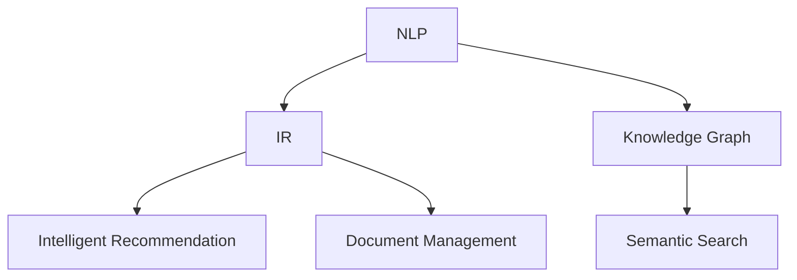

                 

# 利用开源工具打造个人知识库

## 1. 背景介绍

### 1.1 问题由来

在信息爆炸的数字化时代，知识获取变得更加容易，但信息的筛选和整理却变得更加复杂。如何高效地组织、检索和使用个人知识，成为每一个专业人士都必须面对的挑战。个人知识库（Personal Knowledge Base）应运而生，它集成了个人信息检索、知识管理、智能推荐等多项功能，成为数字化时代的知识管理利器。

### 1.2 问题核心关键点

个人知识库的核心在于其高效、智能、可扩展的特性。通过自动化信息检索、自然语言处理、关联规则学习等技术，个人知识库能够帮助用户快速找到所需的信息，管理知识库中的数据，并通过智能推荐系统，为用户提供个性化的知识服务。

## 2. 核心概念与联系

### 2.1 核心概念概述

为更好地理解个人知识库的构建方法，本节将介绍几个关键概念：

- 自然语言处理（Natural Language Processing, NLP）：通过计算机科学、人工智能和语言学的交叉领域，使计算机能够理解和生成自然语言。个人知识库中的信息检索、摘要生成、关联推荐等功能，都依赖于NLP技术。

- 数据检索（Information Retrieval, IR）：根据用户输入的查询词，从知识库中检索出相关的文档、网页、笔记等内容。常用技术包括倒排索引、TF-IDF、向量空间模型等。

- 知识图谱（Knowledge Graph）：通过节点和边来描述实体和它们之间的关系，提供结构化的知识表示，便于进行复杂查询和推理。

- 智能推荐系统（Recommendation System）：根据用户的历史行为、兴趣偏好等数据，推荐相关的知识资源。常用的推荐算法包括协同过滤、基于内容的推荐、混合推荐等。

- 文档管理（Document Management）：实现对知识库中各类文档的存储、分类、检索、同步等功能，提供便捷的信息访问路径。

- 语义搜索（Semantic Search）：通过理解用户查询的语义，提供更加精确的信息检索。常用技术包括ELK、Solr等。

这些概念之间的逻辑关系可以通过以下Mermaid流程图来展示：



这个流程图展示了NLP、IR、知识图谱、推荐系统、文档管理、语义搜索等技术在个人知识库构建中的作用，并强调了这些技术之间的密切联系。

## 3. 核心算法原理 & 具体操作步骤

### 3.1 算法原理概述

个人知识库的核心算法原理主要集中在以下几个方面：

1. **信息检索算法**：通过构建倒排索引、TF-IDF模型等，实现快速的文本匹配和检索。
2. **知识抽取算法**：从非结构化文本中抽取实体、关系等信息，构建知识图谱。
3. **智能推荐算法**：利用协同过滤、基于内容的推荐、混合推荐等算法，为每个用户提供个性化的推荐。
4. **语义搜索算法**：通过ELK、Solr等工具，实现对用户查询语义的理解和匹配。

这些算法通过复杂的数据处理和机器学习模型，实现从数据到知识的转化和推荐，为用户提供高效、个性化的知识服务。

### 3.2 算法步骤详解

以下以信息检索和智能推荐为例，详细讲解核心算法的操作步骤。

**步骤1: 数据预处理**

- 信息检索：收集并清洗知识库中的文档数据，进行分词、去停用词等预处理。
- 推荐系统：收集用户的历史行为数据，如浏览、点击、收藏、评分等，作为推荐的基础。

**步骤2: 构建索引**

- 信息检索：将预处理后的文档数据建立倒排索引、TF-IDF模型等，优化检索效率。
- 推荐系统：基于用户行为数据，构建协同过滤、用户画像等推荐模型。

**步骤3: 模型训练**

- 信息检索：通过训练TF-IDF、LSI、LDA等模型，提高检索准确率。
- 推荐系统：通过协同过滤、基于内容的推荐、混合推荐等算法，优化推荐效果。

**步骤4: 结果评估与优化**

- 信息检索：在测试集上评估检索效果，优化检索算法和模型。
- 推荐系统：通过A/B测试、用户反馈等，不断优化推荐算法和模型。

### 3.3 算法优缺点

个人知识库的算法具有以下优点：

- **高效性**：通过自动化处理和机器学习算法，可以快速实现知识检索和推荐。
- **个性化**：通过用户行为分析，提供高度个性化的知识服务。
- **可扩展性**：算法可以灵活适配各种数据源和业务场景，便于知识库的扩展和定制。

同时，这些算法也存在一些缺点：

- **复杂度**：算法模型复杂，需要较多的计算资源和时间。
- **数据依赖**：算法的性能依赖于高质量的数据，数据清洗和标注需要大量人工介入。
- **模型偏见**：推荐算法可能受到历史数据偏见的影响，导致推荐结果有偏差。

### 3.4 算法应用领域

个人知识库的核心算法已经在多个领域得到广泛应用：

- **文档管理**：提供知识库中各类文档的存储、分类、检索、同步等功能。
- **智能推荐**：为用户提供个性化的知识资源推荐，如学术文章、技术博客、产品文档等。
- **信息检索**：通过自然语言处理技术，实现对大量文档的快速检索。
- **语义搜索**：通过理解用户查询语义，提供精确的信息检索。
- **知识图谱**：构建结构化的知识表示，便于复杂查询和推理。

## 4. 数学模型和公式 & 详细讲解 & 举例说明

### 4.1 数学模型构建

个人知识库的核心模型通常包括以下几个部分：

- 倒排索引模型：用于文本检索，构建倒排索引（Inverted Index），将文档按照关键词分类，加速检索过程。
- TF-IDF模型：用于文本相似度计算，计算每个词在文档中出现的频率和在语料库中的重要性。
- 协同过滤模型：用于推荐系统，根据用户历史行为数据，推荐相关物品。
- 基于内容的推荐模型：通过分析用户历史浏览和评分记录，推荐相似物品。
- 知识图谱模型：用于表示和推理知识，常用的有RDF、OWL等模型。
- 语义搜索模型：用于理解查询语义，常用的有ELK、Solr等工具。

### 4.2 公式推导过程

**倒排索引公式**：
$$
I = \{(k, P_k)\} \quad \text{where } k \in T, P_k \in D
$$
其中 $T$ 是所有关键词的集合，$D$ 是所有文档的集合，$I$ 是倒排索引的集合。

**TF-IDF公式**：
$$
TF(t) = \frac{\text{Number of times term t appears in document}}{\text{Total number of terms in document}}
$$
$$
IDF(t) = \log{\frac{N}{df(t)}}
$$
其中，$TF(t)$ 是词频，$IDF(t)$ 是逆文档频率，$df(t)$ 是包含关键词 $t$ 的文档数。

**协同过滤公式**：
$$
\hat{y}_{ui} = \frac{\sum_{v=1}^{N}(r_{uv} \cdot p_{vi})}{\sqrt{\sum_{v=1}^{N}(p_{vi}^2)}}
$$
其中 $r_{uv}$ 是用户 $u$ 对物品 $v$ 的评分，$p_{vi}$ 是物品 $v$ 的评分均值，$\hat{y}_{ui}$ 是物品 $v$ 对用户 $u$ 的预测评分。

**基于内容的推荐公式**：
$$
\hat{y}_{uv} = \alpha \cdot \cos(\mathbf{p_u}, \mathbf{p_v}) + (1-\alpha) \cdot r_{uv}
$$
其中 $\cos(\mathbf{p_u}, \mathbf{p_v})$ 是用户 $u$ 与物品 $v$ 的相似度，$\alpha$ 是相似度系数。

### 4.3 案例分析与讲解

以一个简单的在线图书馆为例，用户可以收藏书籍并给书籍评分。利用协同过滤算法，系统可以推荐相似评分和浏览记录的用户可能喜欢的书籍，从而提升用户体验。

**案例步骤**：
1. 收集用户历史评分和浏览数据。
2. 计算每个用户与每个物品的相似度。
3. 根据用户历史评分预测新物品的评分。
4. 根据相似度和评分预测结果，为用户推荐新物品。

## 5. 项目实践：代码实例和详细解释说明

### 5.1 开发环境搭建

要进行个人知识库的开发，需要准备以下环境：

1. **安装Python**：
   ```bash
   sudo apt-get update
   sudo apt-get install python3-pip python3-dev libpq-dev
   ```
2. **安装Flask**：
   ```bash
   pip3 install flask
   ```
3. **安装SQLite3**：
   ```bash
   pip3 install pysqlite3
   ```
4. **安装NLTK和Scikit-learn**：
   ```bash
   pip3 install nltk scikit-learn
   ```

### 5.2 源代码详细实现

以下是一个简单的信息检索系统的示例代码，包括用户注册、文档上传、信息检索等功能：

```python
from flask import Flask, render_template, request
from flask_sqlalchemy import SQLAlchemy
from sklearn.feature_extraction.text import TfidfVectorizer
from sklearn.metrics.pairwise import cosine_similarity

app = Flask(__name__)
app.config['SQLALCHEMY_DATABASE_URI'] = 'sqlite:///library.db'
db = SQLAlchemy(app)

class User(db.Model):
    id = db.Column(db.Integer, primary_key=True)
    username = db.Column(db.String(80), unique=True, nullable=False)
    password = db.Column(db.String(120), nullable=False)
    books = db.relationship('Book', backref='user', lazy=True)

class Book(db.Model):
    id = db.Column(db.Integer, primary_key=True)
    title = db.Column(db.String(120), nullable=False)
    user_id = db.Column(db.Integer, db.ForeignKey('user.id'), nullable=False)
    content = db.Column(db.Text, nullable=False)
    keywords = db.Column(db.String(500), nullable=False)

@app.route('/')
def index():
    return render_template('index.html')

@app.route('/register', methods=['GET', 'POST'])
def register():
    if request.method == 'POST':
        username = request.form['username']
        password = request.form['password']
        user = User(username=username, password=password)
        db.session.add(user)
        db.session.commit()
        return redirect('/')
    else:
        return render_template('register.html')

@app.route('/upload', methods=['GET', 'POST'])
def upload():
    if request.method == 'POST':
        user = User.query.filter_by(username=request.form['username']).first()
        title = request.form['title']
        content = request.form['content']
        keywords = request.form['keywords']
        book = Book(title=title, content=content, keywords=keywords, user=user)
        db.session.add(book)
        db.session.commit()
        return redirect('/')
    else:
        return render_template('upload.html')

@app.route('/search', methods=['GET', 'POST'])
def search():
    if request.method == 'POST':
        search_query = request.form['search_query']
        books = Book.query.filter(Book.title.ilike(f'%{search_query}%')) \
                    .or_(
                        Book.content.ilike(f'%{search_query}%')
                    ).all()
        results = []
        for book in books:
            tfidf_vectorizer = TfidfVectorizer().fit_transform([book.content])
            query_tfidf = TfidfVectorizer().fit_transform([search_query])
            similarity = cosine_similarity(query_tfidf, tfidf_vectorizer).flatten().tolist()
            result_index = similarity.index(max(similarity))
            results.append((book.title, similarity[result_index]))
        return render_template('search_results.html', results=results)
    else:
        return render_template('search.html')
```

### 5.3 代码解读与分析

以上代码展示了个人知识库的基本功能，包括用户注册、文档上传、信息检索等。

- **Flask框架**：用于搭建Web应用。
- **SQLAlchemy**：用于数据库操作。
- **TF-IDF向量化**：用于文本相似度计算。
- **余弦相似度**：用于计算文本之间的相似度。

**代码解读**：

- `User` 和 `Book` 模型分别代表用户和书籍，包含用户注册、文档上传、信息检索等功能。
- `TfidfVectorizer` 用于将文本数据转化为TF-IDF特征向量，用于文本相似度计算。
- `cosine_similarity` 用于计算文本之间的余弦相似度，衡量文本的相似程度。

### 5.4 运行结果展示

运行以上代码后，可以在浏览器中访问本地地址 `http://127.0.0.1:5000/` ，查看注册、上传、搜索等页面，并进行相应的操作。

## 6. 实际应用场景

### 6.1 在线图书馆

在线图书馆是一个典型的个人知识库应用场景，用户可以收藏书籍、标记兴趣标签、分享读书笔记等。通过信息检索和推荐算法，系统可以为用户推荐可能感兴趣的书籍，提升用户阅读体验。

### 6.2 学术论文管理

学术论文管理平台可以记录用户的阅读、引用、笔记等行为，通过信息检索和推荐系统，为用户推荐相关领域的论文，并提供论文摘要、引用计数等辅助信息。

### 6.3 技术博客聚合

技术博客聚合平台可以将多个博客网站的内容聚合展示，用户可以通过搜索、标签等方式快速找到感兴趣的文章，通过推荐系统发现最新的技术趋势。

### 6.4 未来应用展望

随着人工智能和自然语言处理技术的不断发展，个人知识库将具备更加丰富的功能，如智能笔记、多语言支持、交互式问答等。未来，个人知识库将在更多领域得到应用，成为数字化时代知识管理的重要工具。

## 7. 工具和资源推荐

### 7.1 学习资源推荐

1. **《Python Web开发实战》**：介绍了使用Flask、Django等框架进行Web应用的开发。
2. **《信息检索原理与实践》**：详细讲解了倒排索引、TF-IDF等核心技术。
3. **《推荐系统实战》**：通过实际案例，讲解了协同过滤、基于内容的推荐等算法。
4. **《自然语言处理综述》**：涵盖了NLP的各个核心技术，如分词、词性标注、句法分析等。
5. **《Python自然语言处理》**：介绍了使用Python进行NLP应用的开发，包括NLTK、SpaCy等工具。

### 7.2 开发工具推荐

1. **Flask**：轻量级的Web应用框架，适合快速开发。
2. **SQLAlchemy**：Python的ORM工具，方便进行数据库操作。
3. **TensorFlow**：强大的深度学习框架，适合进行复杂模型的开发。
4. **ELK Stack**：开源搜索引擎和分析平台，支持全文检索、监控、分析等功能。
5. **Solr**：基于Lucene的开源搜索引擎，支持高级搜索和推荐算法。

### 7.3 相关论文推荐

1. **《TF-IDF: A Probabilistic Model for Assessing Full-Text Documents》**：详细介绍了TF-IDF模型的原理和应用。
2. **《Evaluation of Recommendation Algorithms》**：介绍了协同过滤、基于内容的推荐等算法的优缺点和应用场景。
3. **《A Survey of Semantic Search》**：详细讲解了语义搜索的原理和应用。

## 8. 总结：未来发展趋势与挑战

### 8.1 研究成果总结

本文详细介绍了基于开源工具的个人知识库构建方法，包括信息检索、推荐系统、知识图谱等核心技术。通过实际案例展示了这些技术的应用，提供了详细的代码实现和分析。

### 8.2 未来发展趋势

个人知识库的未来发展趋势包括以下几个方面：

1. **智能化**：利用人工智能技术，提升知识库的检索、推荐、推理等功能的智能化水平。
2. **个性化**：通过用户行为分析，提供更加个性化的知识服务，如智能笔记、多语言支持等。
3. **可扩展性**：支持多种数据源和业务场景，易于扩展和定制。
4. **多模态**：支持多种类型的知识表示，如文本、图片、音频等。

### 8.3 面临的挑战

尽管个人知识库具备诸多优点，但也面临一些挑战：

1. **数据质量**：高质量的数据是知识库的基础，需要花费大量时间和精力进行数据清洗和标注。
2. **算法复杂度**：算法模型复杂，需要较多的计算资源和时间。
3. **用户隐私**：知识库涉及用户的隐私数据，需要采取安全措施保护用户信息。

### 8.4 研究展望

未来，个人知识库的研究方向将集中在以下几个方面：

1. **多语言支持**：支持多种语言的知识检索和推荐，拓展知识库的应用范围。
2. **实时性**：提高知识库的实时性，支持实时更新和查询。
3. **交互式**：开发交互式界面，提升用户体验。
4. **知识图谱**：构建知识图谱，支持复杂查询和推理。
5. **联邦学习**：利用联邦学习等技术，保护用户隐私的同时，提高知识库的性能。

## 9. 附录：常见问题与解答

### Q1：如何构建高质量的个人知识库？

A: 构建高质量的个人知识库需要以下步骤：

1. **数据收集**：收集和清洗数据，去除噪声和冗余信息。
2. **数据标注**：对数据进行标注，提供标签、关键词等信息。
3. **模型训练**：选择合适的算法，进行模型训练和调优。
4. **系统集成**：将模型集成到Web应用中，提供用户接口。

### Q2：如何选择适合的信息检索算法？

A: 选择信息检索算法需要考虑以下几个因素：

1. **数据规模**：数据规模较大时，倒排索引、向量空间模型等算法效果更好。
2. **查询复杂度**：复杂查询时，语义搜索等算法更优。
3. **实时性要求**：实时查询时，倒排索引、Elasticsearch等算法更优。

### Q3：如何提高推荐系统的准确性？

A: 提高推荐系统的准确性需要以下步骤：

1. **数据收集**：收集用户历史行为数据，如浏览、点击、评分等。
2. **模型选择**：选择合适的推荐算法，如协同过滤、基于内容的推荐、混合推荐等。
3. **模型调优**：通过A/B测试、用户反馈等，不断优化推荐模型。

### Q4：如何保护用户隐私？

A: 保护用户隐私需要以下措施：

1. **数据匿名化**：对用户数据进行匿名化处理。
2. **加密存储**：使用加密技术保护用户数据。
3. **权限控制**：设置严格的访问控制，防止未授权访问。

### Q5：个人知识库如何与其他系统集成？

A: 个人知识库可以通过API接口与其他系统集成，实现数据的共享和交互。常用的API接口包括RESTful API、GraphQL等。

---

作者：禅与计算机程序设计艺术 / Zen and the Art of Computer Programming

