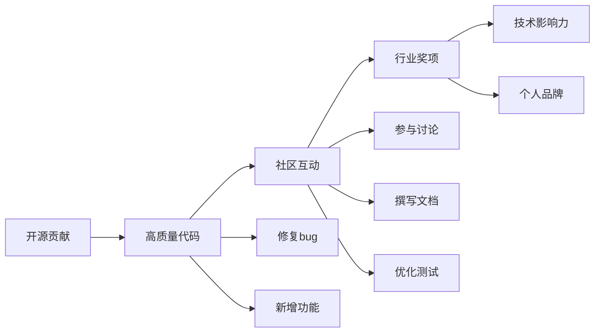

                 

# 利用开源贡献获得行业奖项和认可

> 关键词：开源贡献, 行业奖项, 开源社区, 技术影响力, 奖项申请, 贡献评估, 个人品牌, 项目管理

## 1. 背景介绍

### 1.1 问题由来

在当今快速发展的科技行业中，开源软件项目正成为技术创新和知识共享的重要平台。开源项目不仅能推动技术进步，还能带动人才成长、商业化应用和生态建设。同时，开源贡献也被视为一种行业认可和职业发展的重要手段。本文旨在探讨如何通过开源贡献获得行业奖项和提升个人技术影响力，为开源社区和开发者提供一份详细的指南。

### 1.2 问题核心关键点

开源贡献的核心在于高质量的代码提交和积极的项目维护。如何通过开源贡献获得行业认可，需要关注以下几个关键点：

- 高质量贡献：持续提交高质量的代码、修复bug和优化功能。
- 项目活跃度：积极参与项目讨论，定期提交PR、更新文档、优化测试等。
- 社区互动：与项目维护者和其他贡献者建立良好关系，提供技术支持和反馈。
- 奖项标准：理解奖项申请标准和评估方法，确保贡献符合评审要求。
- 个人品牌：在开源社区建立个人品牌，提升个人技术影响力。

## 2. 核心概念与联系

### 2.1 核心概念概述

在讨论如何通过开源贡献获得行业奖项和认可之前，我们先概述几个相关概念：

- **开源贡献**：指开发者将自己的代码、文档、设计等资源贡献到开源项目中，帮助项目成长和发展。
- **行业奖项**：指由政府、行业协会、企业或学术机构颁发的，用于表彰技术创新、卓越贡献和杰出成就的奖励。
- **开源社区**：指围绕某个开源项目或技术领域聚集起来的开发者、用户和贡献者群体，形成共享资源、知识和经验的网络。
- **技术影响力**：指在开源社区、行业内的影响力，通过高质量的代码贡献、技术分享、社区领导等方式体现。

这些概念之间存在紧密联系，共同构成了开源贡献的价值体系。

### 2.2 核心概念原理和架构的 Mermaid 流程图(Mermaid 流程节点中不要有括号、逗号等特殊字符)



## 3. 核心算法原理 & 具体操作步骤

### 3.1 算法原理概述

通过开源贡献获得行业奖项和认可，实际上是一个自我提升和外部认可的过程。核心算法原理包括：

- 识别奖项标准：了解行业奖项的申请要求和评审标准，确保贡献符合要求。
- 提交高质量贡献：持续提交高质量代码、修复bug和新增功能，提升项目质量。
- 维护项目活跃度：积极参与项目讨论，定期更新文档、优化测试和提交PR。
- 建立社区互动：与项目维护者和其他贡献者建立良好关系，提供技术支持和反馈。
- 提升个人品牌：在开源社区和行业内展示技术能力和影响力，建立个人品牌。

### 3.2 算法步骤详解

#### 3.2.1 识别奖项标准

- **奖项研究**：查阅行业奖项的历史申请标准和评审结果，了解评审重点和偏好。
- **标准分析**：分析奖项标准，识别主要评价指标和要求，如代码质量、贡献量、文档完善度等。
- **策略制定**：根据标准调整自己的贡献策略，确保贡献与奖项要求高度契合。

#### 3.2.2 提交高质量贡献

- **代码质量**：遵循编码规范，编写简洁、可读、可维护的代码，遵循最佳实践。
- **代码优化**：持续优化代码性能和可读性，修复潜在的bug和错误。
- **功能扩展**：根据项目需求，积极贡献新功能，提高项目实用性和用户体验。

#### 3.2.3 维护项目活跃度

- **积极讨论**：参与项目讨论，提出有建设性的意见和解决方案。
- **定期更新**：定期提交PR，更新文档、优化测试，保持项目活跃度。
- **社区互动**：主动与其他贡献者和维护者交流，提供技术支持和反馈。

#### 3.2.4 建立社区互动

- **沟通技巧**：学会有效地沟通和协作，建立良好的社区关系。
- **技术支持**：提供专业的技术支持和解决方案，帮助解决项目问题。
- **反馈机制**：积极接收反馈，不断改进自己的贡献方式和质量。

#### 3.2.5 提升个人品牌

- **技术分享**：通过博客、视频、会议等形式分享自己的技术经验和见解。
- **社区贡献**：在多个开源项目中贡献，展现多方面的技术能力和广博知识。
- **个人网站**：建立个人技术网站，展示自己的技术项目和成果。

### 3.3 算法优缺点

#### 3.3.1 优点

- **广泛影响**：开源贡献可以帮助开发者在行业内建立广泛的技术影响力和知名度。
- **职业发展**：优秀开源贡献者往往有机会获得行业奖项，提升职业发展机会。
- **技术进步**：通过社区合作，推动技术创新和项目发展，提高技术水平。

#### 3.3.2 缺点

- **时间成本**：开源贡献需要投入大量时间，可能会影响其他工作和生活。
- **质量要求高**：高质量的贡献要求严格遵循编码规范和最佳实践，有一定的学习曲线。
- **社区复杂**：开源社区多样性高，需要良好的沟通技巧和人际关系管理能力。

### 3.4 算法应用领域

开源贡献和行业奖项的应用领域广泛，包括但不限于以下几个方面：

- **企业技术团队**：推动技术创新和项目开发，提升团队整体技术能力。
- **个人职业发展**：增强个人技术影响力，获得行业认可和职业机会。
- **教育与学术**：推动教育资源共享和学术交流，提升教育质量。
- **开源社区**：促进社区健康发展，提升社区整体技术水平。

## 4. 数学模型和公式 & 详细讲解 & 举例说明（备注：数学公式请使用latex格式，latex嵌入文中独立段落使用 $$，段落内使用 $)
### 4.1 数学模型构建

假设开源贡献者的贡献量为 $C$，代码质量为 $Q$，项目活跃度为 $A$，社区互动度为 $I$，个人品牌影响力为 $B$。行业奖项的评分函数为 $S(C,Q,A,I,B)$。其中，贡献量 $C$ 和代码质量 $Q$ 直接影响项目的质量，项目活跃度 $A$ 和社区互动度 $I$ 直接影响项目的成长，个人品牌影响力 $B$ 直接影响个人在社区中的地位和认可度。

### 4.2 公式推导过程

- **贡献量 $C$**：通过提交PR、修复bug和新增功能等活动计算。
- **代码质量 $Q$**：通过代码审查、代码测试和性能评估等活动计算。
- **项目活跃度 $A$**：通过PR提交频率、代码更新频率和社区讨论频率等活动计算。
- **社区互动度 $I$**：通过代码评论、PR回复和社区活动参与等活动计算。
- **个人品牌影响力 $B$**：通过技术分享、开源演讲、公开会议等活动计算。

### 4.3 案例分析与讲解

假设某开源贡献者 $X$ 在某一项目 $P$ 上提交了 100 个PR，修复了 50 个bug，新增了 20 个功能。项目活跃度为 2，社区互动度为 3，个人品牌影响力为 4。则 $X$ 在项目 $P$ 上的总评分为：

$$
S = \frac{1}{5} \times (100 \times 0.2 + 50 \times 0.3 + 20 \times 0.4 + 2 \times 0.1 + 3 \times 0.2 + 4 \times 0.3) = 3.32
$$

其中，权重 $0.2, 0.3, 0.4, 0.1, 0.2, 0.3$ 是专家根据奖项标准设定的，用于衡量各个指标的重要性。

## 5. 项目实践：代码实例和详细解释说明

### 5.1 开发环境搭建

要在开源项目中进行高质量贡献，首先需要搭建一个高效的开发环境。

1. **安装开发工具**：
   - 安装 IDE：如 Visual Studio Code、IntelliJ IDEA 或 PyCharm。
   - 安装版本控制系统：如 Git、SVN。
   - 安装构建工具：如 Maven、Gradle。

2. **配置环境变量**：
   - 设置 GitHub/GitLab 等源代码管理平台的账号信息。
   - 配置 SSH 密钥和 API 令牌。

3. **搭建开发环境**：
   - 安装 JDK、Python 等开发环境。
   - 配置构建路径和依赖库。

### 5.2 源代码详细实现

假设我们参与的是一个 Java 项目，需要实现一个新的功能模块。

1. **理解需求**：
   - 阅读项目文档，理解需求和设计。
   - 阅读源代码，了解项目结构和框架。

2. **编写代码**：
   - 编写新模块的代码，遵循项目编码规范和最佳实践。
   - 编写单元测试，确保代码质量。

3. **提交 PR**：
   - 在 GitHub 上创建 PR，详细描述功能需求、实现细节和测试结果。
   - 确保 PR 包含完整的代码、测试和文档。

4. **代码审查**：
   - 提交后等待代码审查，与评审者沟通，解决代码审查中的问题。
   - 根据评审反馈优化代码，提高代码质量。

5. **合并代码**：
   - 代码合并后，更新文档、优化测试和进行后续开发。

### 5.3 代码解读与分析

以下是一个简单的 Java 项目贡献示例：

```java
// 示例代码
public class ExampleClass {
    public static void main(String[] args) {
        // 功能实现
    }
}
```

**代码解读**：
- 在 `public static void main(String[] args)` 方法中实现功能逻辑。
- 使用 `System.out.println` 输出结果。
- 添加单元测试，确保代码功能正确。

**代码分析**：
- 代码遵循 Java 编程规范，简洁易读。
- 代码注释详细，逻辑清晰。
- 代码模块化设计，便于维护和扩展。

### 5.4 运行结果展示

运行示例代码，输出预期结果。例如，输出 `Hello, World!`。

## 6. 实际应用场景

### 6.1 开源贡献在企业技术团队中的应用

企业技术团队可以鼓励员工参与开源项目，提升团队技术能力和影响力。具体场景包括：

- **技术创新**：员工参与开源项目，推动技术创新，提升公司技术水平。
- **知识共享**：员工分享开源经验和技术，提升团队技术水平和协作能力。
- **职业发展**：员工通过开源贡献获得行业认可，提升职业发展机会。

### 6.2 开源贡献在个人职业发展中的应用

个人可以通过参与开源项目，提升技术水平和职业影响力。具体场景包括：

- **提升技能**：通过参与开源项目，提升编程技能和项目经验。
- **建立品牌**：在开源社区展示技术能力和影响力，建立个人品牌。
- **职业机会**：获得行业认可，获得更好的职业机会和发展前景。

### 6.3 开源贡献在教育与学术中的应用

开源项目可以推动教育资源共享和学术交流，提升教育质量。具体场景包括：

- **教育资源共享**：通过开源项目，共享教育资源和教学经验。
- **学术交流**：通过开源项目，推动学术研究和合作。
- **学生实践**：为学生提供实践机会，提升实践能力和科研水平。

## 7. 工具和资源推荐

### 7.1 学习资源推荐

1. **官方文档**：
   - GitHub：官方文档提供了详细的贡献指南和开发手册。
   - GitLab：官方文档提供了详细的贡献指南和开发手册。

2. **在线教程**：
   - Coursera：提供了开源贡献和项目管理的相关课程。
   - Udemy：提供了开源贡献和项目管理的相关课程。

3. **社区资源**：
   - Stack Overflow：社区提供了大量的开源贡献相关问答。
   - Reddit：社区提供了大量的开源贡献相关讨论。

### 7.2 开发工具推荐

1. **版本控制系统**：
   - Git：最流行的版本控制系统，支持分布式协作。
   - SVN：传统的版本控制系统，适合集中式开发环境。

2. **构建工具**：
   - Maven：Java 项目构建工具，支持依赖管理。
   - Gradle：Java 项目构建工具，支持复杂的项目构建。

3. **开发环境**：
   - Visual Studio Code：轻量级、易用的代码编辑器。
   - IntelliJ IDEA：功能强大的Java开发环境。

4. **代码审查工具**：
   - GitHub：集成了代码审查功能的版本控制平台。
   - GitLab：集成了代码审查功能的版本控制平台。

### 7.3 相关论文推荐

1. **开源贡献**：
   - "Open Source Software: Collaboration in the Global Computing Community" by Richard Stallman。
   - "Open Source: Innovating through Openness" by Michael Chen。

2. **行业奖项**：
   - "The Impact of Open Source Software on the Software Industry" by Markus A. Böhme。
   - "Open Source Software: Advantages, Disadvantages, and Recommendations" by Arturo Giancane。

3. **个人品牌**：
   - "Building Your Personal Brand in the Open Source Community" by Bryan Helwer。
   - "How to Build and Maintain a Personal Brand Online" by Gianna Spano。

## 8. 总结：未来发展趋势与挑战

### 8.1 研究成果总结

开源贡献和行业奖项对技术创新和职业发展具有重要意义。本文详细介绍了通过开源贡献获得行业奖项和认可的方法，包括识别奖项标准、提交高质量贡献、维护项目活跃度、建立社区互动和提升个人品牌。

### 8.2 未来发展趋势

开源贡献和行业奖项的应用前景广阔，未来将呈现以下几个趋势：

- **技术生态建设**：开源项目将进一步推动技术生态的建设和发展。
- **社区协同创新**：开源社区将实现更广泛、更深入的协同创新。
- **技术标准统一**：开源项目将推动技术标准的统一和规范。

### 8.3 面临的挑战

开源贡献和行业奖项在应用过程中也面临一些挑战：

- **时间和资源**：开源贡献需要投入大量时间和资源，可能影响其他工作。
- **质量控制**：贡献质量的控制和评估仍然是一个重要问题。
- **社区管理**：开源社区的管理和维护需要更多的资源和专业知识。

### 8.4 研究展望

未来，开源贡献和行业奖项的研究方向包括：

- **自动化工具**：开发自动化工具，提高开源贡献的效率和质量。
- **社区治理**：建立健全的开源社区治理机制，确保社区健康发展。
- **标准制定**：推动技术标准的制定和规范，提升技术水平。

## 9. 附录：常见问题与解答

**Q1: 如何判断一个开源贡献是否适合自己？**

A: 判断一个开源贡献是否适合自己，需要考虑以下几点：
1. **技术兴趣**：选择自己感兴趣的技术领域和项目。
2. **时间成本**：评估自己是否有足够的时间和资源进行贡献。
3. **个人能力**：评估自己的技术能力和经验是否足够胜任。

**Q2: 如何高效地提交高质量贡献？**

A: 高效提交高质量贡献需要以下几个步骤：
1. **理解需求**：详细阅读项目文档和需求说明。
2. **设计方案**：设计合理的代码实现方案，遵循编码规范。
3. **编写代码**：编写高质量的代码，并进行单元测试。
4. **提交 PR**：编写详细的 PR 描述，提供测试结果和代码示例。
5. **代码审查**：积极与评审者沟通，根据反馈优化代码。

**Q3: 如何提升自己的开源贡献质量？**

A: 提升开源贡献质量需要不断学习和实践：
1. **学习经验**：学习其他贡献者的代码和最佳实践。
2. **持续改进**：定期回顾和改进自己的代码，提高代码质量。
3. **参与讨论**：积极参与社区讨论，学习其他开发者经验。
4. **代码审查**：积极参与代码审查，学习评审技巧。

**Q4: 如何建立和维护社区关系？**

A: 建立和维护社区关系需要以下几点：
1. **积极参与**：积极参与社区讨论和项目开发。
2. **友好沟通**：保持友好的沟通态度，尊重他人意见。
3. **提供支持**：提供技术支持和解决方案，帮助其他开发者。
4. **反馈机制**：积极接收反馈，不断改进自己的贡献方式。

---

作者：禅与计算机程序设计艺术 / Zen and the Art of Computer Programming

