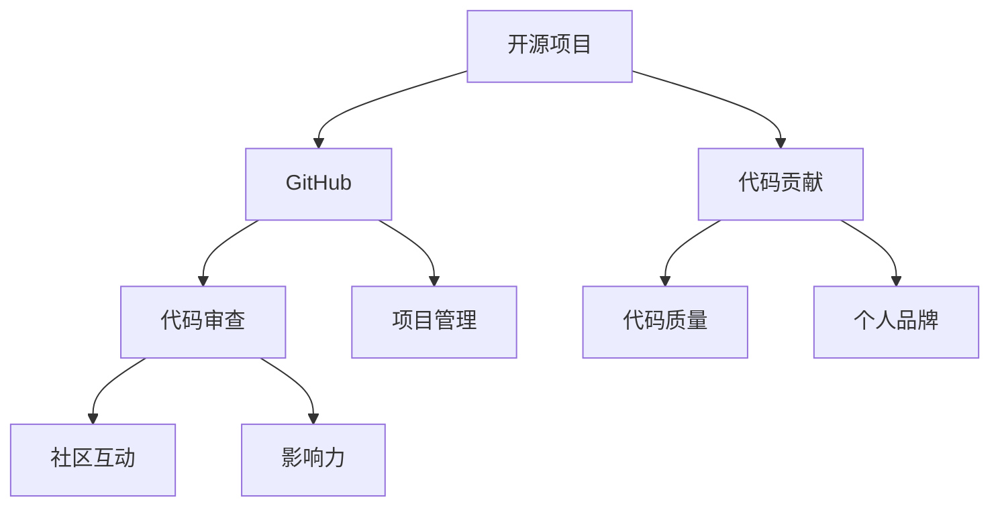

                 

# 利用开源项目打造个人品牌

## 1. 背景介绍

在当今这个信息爆炸的时代，个人品牌建设对于任何职业人士来说都是至关重要的。无论是技术专家、创业者，还是市场营销人员，一个清晰、有影响力的个人品牌可以帮助你建立权威、吸引粉丝、提高知名度。而在技术领域，开源项目无疑是打造个人品牌、展示技术实力的最佳平台。

### 1.1 个人品牌的重要性
一个强大的个人品牌不仅可以增加你在行业内的影响力，还能带来更多职业机会，甚至改变你的职业生涯轨迹。例如，通过GitHub上的开源项目，你可以吸引雇主的注意，赢得合作项目，甚至成为开源社区的核心贡献者。此外，个人品牌还能够提升你的专业形象，增强客户的信任感，提高你的工作满意度和收入水平。

### 1.2 开源项目的兴起
开源项目自1990年代以来一直存在，但直到最近几年才真正兴盛起来。GitHub等平台让开源项目更加容易访问和参与，吸引了大量的开发者和贡献者。这些项目不仅包括技术工具和框架，还涵盖了从教育到社会公益的各个领域。参与开源项目，不仅能够锻炼技术能力，还能让你的代码和成就被更多人看到，从而提升个人品牌。

## 2. 核心概念与联系

### 2.1 核心概念概述

要利用开源项目打造个人品牌，首先需要理解以下核心概念：

- **开源项目**：指由社区开发者贡献，公开源代码和开发流程的项目。开源项目通常使用开源许可证，允许任何人复制、分发、修改和使用其源代码。

- **GitHub**：最流行的代码托管平台，支持版本控制、项目管理和社区协作。GitHub上的开源项目，可以通过Pull Request、Issue跟踪等功能，促进开发者之间的交流和协作。

- **代码贡献**：指开发者将自己的代码提交到开源项目中，包括提交新功能、修复bug、改进文档等。代码贡献不仅能提升代码质量，还能增加项目和个人的曝光度。

- **个人品牌**：通过个人在职业领域内的表现和成就，塑造的专业形象和声誉。个人品牌不仅包括技术能力和工作成绩，还包括沟通能力、团队合作精神等软技能。

- **影响力**：指个人在特定领域内的知名度和影响力。在开源社区中，影响力通常通过项目贡献量、社区参与度、文章发布量等指标来衡量。

这些核心概念之间的联系和互动，构成了利用开源项目打造个人品牌的全过程：



在开源社区中，开源项目是基础，GitHub提供了平台，代码贡献和社区互动是关键过程，而最终的影响力和个人品牌则是在这些过程中的成果。

## 3. 核心算法原理 & 具体操作步骤

### 3.1 算法原理概述

利用开源项目打造个人品牌的核心算法原理是：通过在开源项目上积极贡献代码、参与讨论和项目维护，逐步积累影响力，最终形成强大的个人品牌。

形式化地，假设你在开源项目 $P$ 上进行贡献，通过代码贡献 $C_i$ 和社区互动 $I_i$，可以获得的声誉 $R_i$ 由以下公式决定：

$$
R_i = f(C_i, I_i)
$$

其中 $f$ 是一个复杂函数，可能包括代码提交数量、Pull Request被接受的次数、社区中的讨论次数、贡献的代码质量等。

### 3.2 算法步骤详解

1. **选择合适的开源项目**：选择与你兴趣和技能相匹配的开源项目，确保有足够的学习和贡献机会。
2. **了解项目流程**：熟悉GitHub的Pull Request、Issue跟踪等功能，学习项目的代码结构、编码规范和社区规则。
3. **开始贡献代码**：从小处着手，如提交文档、修复小bug、添加注释等，逐步积累贡献。
4. **参与社区讨论**：积极参与项目的讨论，提供建设性意见，帮助解决难题。
5. **接受代码审查**：提交代码后，接受社区成员的审查和反馈，不断改进自己的代码质量。
6. **提升影响力**：通过参与更多复杂项目、撰写技术文章、参与开源社区活动等方式，提升自己在项目和社区中的影响力。
7. **展示成果**：通过GitHub的Profile、个人网站等渠道展示你的项目贡献、技术成就和社会影响力。

### 3.3 算法优缺点

利用开源项目打造个人品牌的算法具有以下优点：

- **广泛曝光**：GitHub等平台让全球开发者都能看到你的贡献，提升了个人品牌的曝光度。
- **多维成长**：通过技术学习、社区互动和项目贡献，你的技能和软技能都能得到全面提升。
- **真实记录**：代码贡献和社区互动记录在案，具有较高的可信度和说服力。

同时，该算法也存在一些局限：

- **高门槛**：需要一定的编程能力和时间投入，可能不适合所有人群。
- **社区压力**：开源社区有时存在“精英文化”，新成员需要承受一定的压力。
- **利益冲突**：商业公司可能对开源项目有利益冲突，需要谨慎选择。

### 3.4 算法应用领域

利用开源项目打造个人品牌的应用领域广泛，几乎涵盖所有技术领域：

- **软件开发**：通过贡献开源软件工具和框架，提升自己的技术影响力和品牌声誉。
- **数据科学**：参与开源数据集和分析工具的维护，展示数据处理和分析能力。
- **机器学习**：在Kaggle等平台上参与竞赛，贡献模型和算法，提升自己在社区中的影响力。
- **网络安全**：贡献漏洞报告、补丁代码和防御策略，建立安全专家的品牌形象。
- **硬件开发**：在开源硬件项目中贡献设计文档和电路图，展示硬件设计和开发能力。
- **教育培训**：编写技术教程、编译编程挑战，提升教学能力和品牌形象。

## 4. 数学模型和公式 & 详细讲解 & 举例说明

### 4.1 数学模型构建

假设你在开源项目 $P$ 上进行贡献，每次贡献得到的声誉增量由以下因素决定：

- $C_i$：第 $i$ 次代码提交的数量。
- $I_i$：第 $i$ 次社区互动的质量。
- $d_i$：第 $i$ 次贡献的难度系数。

声誉 $R_i$ 的计算模型为：

$$
R_i = w_C C_i + w_I I_i + w_D d_i
$$

其中 $w_C$、$w_I$、$w_D$ 是权重系数，表示代码贡献、社区互动和贡献难度的相对重要性。

### 4.2 公式推导过程

为了方便计算，我们可以将代码贡献和社区互动量化为以下形式：

- $C_i$：第 $i$ 次提交的代码行数。
- $I_i$：第 $i$ 次社区互动的次数（如回复、点赞、评论等）。

于是，声誉增量的计算公式可以写为：

$$
R_i = w_C C_i + w_I I_i + w_D \frac{C_i}{S_i}
$$

其中 $S_i$ 是第 $i$ 次贡献所需的总工作量（如代码行数、修复的bug数量等）。

### 4.3 案例分析与讲解

以一个开源数据集项目为例：

- **代码贡献**：小王在项目中提交了50行代码，修复了3个bug。
- **社区互动**：小王在讨论区发布了5条评论，获得了10个点赞。
- **难度系数**：修复这些bug需要1小时，代码贡献需要2小时。

根据公式，小王的声誉增量为：

$$
R_i = w_C \cdot 50 + w_I \cdot 15 + w_D \cdot \frac{50}{3+2}
$$

其中 $w_C = 1$，$w_I = 1$，$w_D = 1$。

如果小王的声誉初始值为0，则他的总声誉为：

$$
R = \sum_{i=1}^n R_i
$$

## 5. 项目实践：代码实例和详细解释说明

### 5.1 开发环境搭建

要利用开源项目打造个人品牌，首先需要搭建一个合适的开发环境。以下是在GitHub上参与开源项目的详细步骤：

1. **注册GitHub账号**：访问GitHub官网，创建个人账号，完成邮箱验证。
2. **安装Git和GitHub Desktop**：安装Git命令行工具和GitHub Desktop桌面客户端，方便进行代码推送和项目管理。
3. **选择项目和Fork**：选择一个感兴趣的开源项目，并通过Fork功能将项目复制到自己的GitHub仓库中。
4. **克隆项目本地**：使用Git命令克隆项目到本地，方便进行代码开发和修改。
5. **设置本地开发环境**：根据项目要求，安装相应的开发依赖和编译器，如Python、Node.js、Java等。

### 5.2 源代码详细实现

以下是一个简单的Python项目贡献示例：

1. **阅读项目文档**：
```bash
git clone https://github.com/username/project.git
cd project
```

2. **修改代码**：
```python
# 修改Python代码
def hello_world():
    print("Hello, world!")
hello_world()
```

3. **提交修改**：
```bash
git add .
git commit -m "Add hello_world function"
```

4. **推送修改到远程仓库**：
```bash
git push origin master
```

5. **创建Pull Request**：
```bash
git checkout -b pr-1
```

6. **提交Pull Request**：
```bash
git push origin pr-1
```

7. **接受代码审查**：
```bash
git push origin master
```

### 5.3 代码解读与分析

以下是代码贡献的详细解释：

1. **克隆项目**：使用`git clone`命令克隆项目到本地。
2. **修改代码**：在项目中增加一个`hello_world`函数，用于输出"Hello, world!"。
3. **提交修改**：使用`git add`命令添加修改文件，使用`git commit`命令提交修改，并添加提交说明。
4. **推送修改**：使用`git push`命令将修改推送到GitHub远程仓库。
5. **创建Pull Request**：在本地分支上创建Pull Request，指定目标仓库为原始项目。
6. **提交Pull Request**：将本地分支推送到GitHub，创建Pull Request。
7. **接受代码审查**：在Pull Request中，接受项目维护者的代码审查，并根据反馈进行修改。

### 5.4 运行结果展示

成功提交Pull Request后，项目维护者会在Pull Request中提出反馈，如代码风格、功能实现等。你需要根据反馈进行修改，并通过Pull Request页面进行互动。成功合并后，代码就会正式成为项目的一部分，你的贡献也会被记录在案。

## 6. 实际应用场景

### 6.1 软件开发

在软件开发领域，利用开源项目打造个人品牌非常常见。例如，Open Source Initiative（OSI）就有许多优秀的开源软件项目，如Linux、Apache HTTP Server等。通过为这些项目贡献代码和修复bug，开发者不仅能够提升自己的技术能力，还能在业界建立起良好的声誉。

### 6.2 数据科学

数据科学领域同样有很多开源项目，如Scikit-Learn、TensorFlow等。通过参与这些项目的贡献和讨论，数据科学家可以在学术界和工业界建立起强大的个人品牌。例如，Kaggle上的数据集项目和机器学习竞赛，为数据科学家提供了展示自己技能和成就的平台。

### 6.3 机器学习

机器学习领域也有很多开源项目，如TensorFlow、PyTorch、Keras等。通过在这些项目上贡献代码和模型，开发者可以建立起自己在机器学习领域的权威地位。例如，在Kaggle竞赛中赢得名次，并在GitHub上发布论文和代码，都会显著提升你的影响力。

### 6.4 未来应用展望

未来，随着技术的发展和社会的进步，开源项目和代码贡献在各个领域的渗透将更加深入，个人品牌的打造也将更加多元化。以下是一些未来应用展望：

- **跨学科合作**：开源项目将不仅仅局限于技术领域，跨学科的合作项目将更加普遍。通过参与跨学科项目，你可以展示自己多领域的能力，提升品牌价值。
- **区块链技术**：随着区块链技术的兴起，开源区块链项目也将成为个人品牌的重要组成部分。通过在区块链项目上贡献代码和算法，你可以建立起自己在加密货币、智能合约等领域的权威地位。
- **社交媒体技术**：随着社交媒体技术的发展，开源社交平台和内容管理系统也将涌现。通过在这些项目上贡献代码和功能，你可以展示自己在社交媒体分析、推荐系统等方面的技术能力。
- **健康科技**：随着健康科技的兴起，开源医疗数据集和健康应用也将受到广泛关注。通过在这些项目上贡献代码和算法，你可以建立起自己在健康科技领域的权威地位。

## 7. 工具和资源推荐

### 7.1 学习资源推荐

1. **GitHub官方文档**：GitHub的官方文档提供了丰富的使用指南，帮助你熟悉Git和GitHub Desktop的使用。
2. **GitHub Developer Blog**：GitHub的开发者博客提供了大量的技术文章和教程，帮助你了解开源项目的最佳实践。
3. **Stack Overflow**：Stack Overflow是一个程序员社区，你可以从中获取技术问题解答，学习其他开发者的经验。
4. **Coursera**：Coursera提供了很多开源项目相关的课程，如《Python for Data Science》、《Machine Learning with TensorFlow》等。
5. **Kaggle**：Kaggle是一个数据科学竞赛平台，你可以在上面参与机器学习竞赛，提升技术能力和品牌影响力。

### 7.2 开发工具推荐

1. **Git**：Git是最流行的版本控制系统，是参与开源项目的基础工具。
2. **GitHub Desktop**：GitHub Desktop是一个图形化界面的工具，方便在本地进行代码推送和项目管理。
3. **Visual Studio Code**：Visual Studio Code是一个轻量级的代码编辑器，支持多种编程语言和扩展。
4. **PyCharm**：PyCharm是一个Python集成开发环境，支持调试、测试和版本控制等功能。
5. **JIRA**：JIRA是一个项目管理工具，可以帮助团队协作和任务跟踪。

### 7.3 相关论文推荐

1. **“A Survey of Scientific Software Development in the 21st Century”**：这篇论文提供了开源软件开发领域的全面回顾，适合了解开源项目的最佳实践。
2. **“Opportunistic Code Maintenance: A Case Study of Collaborative Software Development”**：这篇论文研究了开源社区中的代码维护过程，适合理解社区协作和贡献的机制。
3. **“The Impact of Contributing to Open Source on Developers’ Professional Development”**：这篇论文研究了参与开源项目对开发者职业发展的影响，适合理解开源项目对个人品牌的重要性。

## 8. 总结：未来发展趋势与挑战

### 8.1 研究成果总结

本文详细介绍了利用开源项目打造个人品牌的方法和步骤，从算法原理、操作步骤到实际应用场景，提供了全面的技术指导。通过参与开源项目，开发者可以显著提升自己的技术能力和品牌影响力，进而获得更多的职业机会和合作项目。

### 8.2 未来发展趋势

未来，开源项目和代码贡献将更加普及，成为开发者展示技术能力和建立个人品牌的重要手段。以下趋势将推动这一进程：

- **开源工具的普及**：开源工具和框架的普及，使得更多开发者能够参与到开源项目中，贡献自己的力量。
- **跨学科项目的涌现**：跨学科项目的兴起，将促进不同领域之间的合作和交流，带来更多的创新机会。
- **商业公司的支持**：越来越多的商业公司支持开源项目，提供资金和资源支持，推动项目的持续发展和壮大。
- **社区的活跃度提升**：开源社区的活跃度和参与度将进一步提升，带来更多的交流和合作机会。

### 8.3 面临的挑战

尽管开源项目和代码贡献在个人品牌建设中具有巨大潜力，但仍面临一些挑战：

- **时间和精力**：参与开源项目需要大量的时间和精力投入，可能影响正常工作和生活。
- **社区压力**：开源社区有时存在“精英文化”，新成员需要承受一定的压力和挑战。
- **利益冲突**：商业公司可能对开源项目有利益冲突，需要谨慎选择参与项目。
- **代码质量**：提交的代码质量不高，可能被社区拒绝或修复。

### 8.4 研究展望

未来，需要在以下几个方面进一步研究和发展开源项目和代码贡献：

- **自动化工具**：开发更多自动化工具，帮助开发者更高效地参与开源项目，降低参与门槛。
- **社区文化建设**：通过社区活动、技术讲座等方式，建设更加友好和包容的社区文化。
- **激励机制设计**：设计更加公平和合理的激励机制，鼓励开发者积极参与开源项目。
- **代码质量提升**：通过代码审查和代码风格指南，提升代码质量，确保项目的长期发展。

## 9. 附录：常见问题与解答

**Q1：如何选择合适的开源项目进行贡献？**

A: 选择与你的兴趣和技能相匹配的开源项目，确保有足够的学习和贡献机会。可以通过GitHub的搜索功能，查找相关领域的项目，并阅读项目的README和Issues，了解项目的目标和需求。

**Q2：如何高效提交Pull Request？**

A: 高效提交Pull Request的关键是明确贡献目标和代码质量。在提交前，确保代码格式规范、功能实现完整、单元测试通过。同时，在Pull Request中清晰描述贡献的目的和实现方式，接受反馈并及时修改。

**Q3：如何提升在开源社区的影响力？**

A: 提升影响力的关键在于积极参与社区互动。通过撰写技术文章、发布博客、参与社区讨论等方式，展示自己的技术能力和专业见解。同时，积极解决社区中的问题，帮助其他开发者，赢得社区成员的尊重和信任。

**Q4：如何平衡开源项目和日常工作？**

A: 平衡开源项目和日常工作的方法是合理规划时间。可以在业余时间参与开源项目，逐步积累贡献。同时，选择适合的工作时间，如周末、晚上等，确保代码质量和时间效率。

通过本文的系统梳理，可以看到，利用开源项目打造个人品牌是一个复杂但极具潜力的过程。开发者需要不断学习和实践，才能在开源社区中建立起强大的个人品牌，进而推动自己的职业发展。

