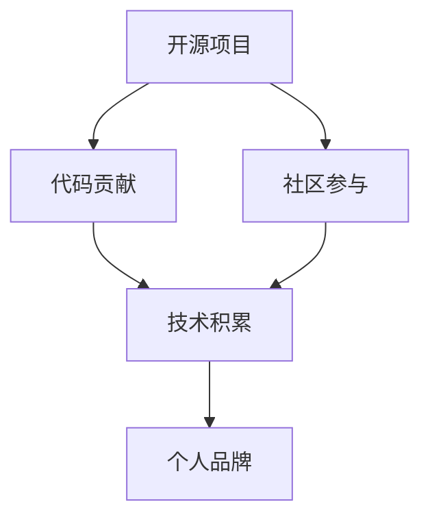

                 

## 1. 背景介绍

在当今数字化时代，开源项目已成为个人品牌建设的重要工具。通过参与开源项目，开发者不仅能够展示自己的技术能力，还能积累丰富的经验，构建个人品牌。本文将深入探讨如何利用开源项目打造个人品牌，包括选择合适的开源项目、参与项目的具体步骤、注意事项和最佳实践。

## 2. 核心概念与联系

### 2.1 核心概念概述

- **开源项目（Open Source Project）**：指软件代码等资源可以被任何人自由访问、修改和分发，同时遵循开源协议的数字化项目。
- **个人品牌（Personal Brand）**：指个体在特定领域内的知名度、专业形象和口碑。
- **代码贡献（Code Contribution）**：指开发者将自己的代码提交到开源项目中，为项目做出贡献。
- **社区参与（Community Engagement）**：指开发者积极参与开源项目社区，如参与讨论、问题反馈等。
- **技术积累（Technical Accumulation）**：指开发者通过参与开源项目积累的技术知识和经验。

这些概念之间的联系主要体现在：
1. **开源项目**提供了展示个人能力的平台。
2. **代码贡献**是个人品牌的核心组成部分。
3. **社区参与**有助于提升个人在社区中的影响力。
4. **技术积累**是个人品牌成长的基石。

### 2.2 Mermaid 流程图



## 3. 核心算法原理 & 具体操作步骤

### 3.1 算法原理概述

基于开源项目的个人品牌打造，其核心原理是通过代码贡献和社区参与，积累技术知识和社区影响力，从而构建个人品牌。具体步骤如下：

1. **选择开源项目**：找到与自身技术栈匹配且自己感兴趣的项目。
2. **学习项目代码和文档**：理解项目的架构和代码风格。
3. **提交代码贡献**：解决项目中的问题，或添加新功能。
4. **积极参与社区**：通过问题反馈、代码评审等方式与项目团队互动。
5. **积累技术知识**：通过解决项目中的技术问题，提升自身技术水平。
6. **构建个人品牌**：通过展示自己的技术能力，积累行业声誉。

### 3.2 算法步骤详解

#### 步骤 1：选择开源项目

1. **确定技术方向**：选择与自己技术栈相匹配的开源项目。例如，如果你擅长Java，可以选择Spring框架或Apache Commons等项目。
2. **评估项目活跃度**：选择活跃的、有持续维护的项目，可以确保你的贡献不会被忽略。
3. **关注项目社区**：了解项目的社区氛围和参与方式。

#### 步骤 2：学习项目代码和文档

1. **阅读项目README**：理解项目的愿景、目标和基本结构。
2. **阅读代码文档**：了解项目的代码风格、命名规范和设计原则。
3. **使用GitHubIssues**：阅读项目中的问题，理解项目的待解决任务。

#### 步骤 3：提交代码贡献

1. ** fork 项目**：将项目代码克隆到自己的GitHub仓库中。
2. **创建分支**：在主分支外创建新分支，进行开发工作。
3. **编写代码**：按照项目规范编写代码，解决特定问题或添加新功能。
4. **提交代码**：通过Git提交代码到GitHub仓库。
5. **等待审核**：项目维护者会审核你的代码，提出修改意见。
6. **完成修改**：根据反馈修改代码，直到通过审核。

#### 步骤 4：积极参与社区

1. **关注项目进展**：通过GitHubIssues和Discussion等渠道，了解项目的最新动态。
2. **参与讨论**：在Discussion中提出问题、分享见解或反馈意见。
3. **解决问题**：积极解决项目中的问题，展示自己的技术能力。
4. **贡献文档**：编写和改进项目文档，提升项目的可读性和维护性。

### 3.3 算法优缺点

#### 优点：

1. **广泛曝光**：开源项目具有广泛的用户群体，参与其中可以迅速提升个人品牌知名度。
2. **技术提升**：通过解决项目中的实际问题，积累丰富的技术经验。
3. **建立网络**：与项目团队和社区成员互动，拓展人脉资源。
4. **展示能力**：代码贡献和社区参与可以展示自己的技术实力和专业形象。

#### 缺点：

1. **时间投入**：参与开源项目需要大量时间，可能会影响其他工作。
2. **代码质量要求高**：提交的代码需要符合项目规范和标准，存在一定的难度。
3. **竞争激烈**：优秀开源项目吸引众多开发者参与，可能会感到竞争压力。

### 3.4 算法应用领域

开源项目打造个人品牌的应用领域非常广泛，包括但不限于以下方面：

- **职业发展**：提升个人在行业内的知名度，增加职业机会。
- **技术交流**：通过参与开源项目，与其他开发者交流技术经验和见解。
- **企业招聘**：展示自身技术能力，吸引企业的关注。
- **教育培训**：通过参与开源项目，积累教学素材，提升教学水平。
- **学术研究**：利用开源项目中的数据和代码，进行学术研究和论文撰写。

## 4. 数学模型和公式 & 详细讲解 & 举例说明

### 4.1 数学模型构建

假设有一个开源项目，该项目每季度发布一个版本，版本编号为V1、V2、V3等。设每个版本有n个功能模块，每个模块由m个开发者贡献。

令 $C_{ij}$ 表示开发者i在第j个版本中对模块j的代码贡献数量。$P_{ij}$ 表示开发者i在第j个版本中在Discussion中的活跃度。$T_{ij}$ 表示开发者i在第j个版本中的技术积累。

目标函数为：

$$ \min \sum_{i=1}^{n} \sum_{j=1}^{m} (C_{ij} + P_{ij} + T_{ij}) $$

其中：

- $C_{ij}$：代码贡献数量。
- $P_{ij}$：社区活跃度。
- $T_{ij}$：技术积累量。

约束条件为：

$$ \sum_{i=1}^{n} C_{ij} = m $$
$$ \sum_{i=1}^{n} P_{ij} \leq 1 $$
$$ \sum_{i=1}^{n} T_{ij} \leq 1 $$

### 4.2 公式推导过程

- **代码贡献约束**：每个模块由m个开发者共同完成，因此每个开发者对每个模块的代码贡献数量之和为m。
- **社区活跃度约束**：每个开发者在每个版本中的社区活跃度不超过1。
- **技术积累约束**：每个开发者在每个版本中的技术积累不超过1。

### 4.3 案例分析与讲解

假设开发者A参与了一个开源项目，该项目的每个版本有3个模块，每个模块由3个开发者贡献。开发者A在V1、V2、V3版本中分别对模块1、模块2和模块3有贡献，社区活跃度分别为0.5、0.7、0.3，技术积累分别为0.4、0.6、0.8。

通过计算：

$$ C_{11} + C_{21} + C_{31} = m = 3 $$
$$ P_{11} + P_{12} + P_{13} \leq 1 $$
$$ T_{11} + T_{12} + T_{13} \leq 1 $$

可以计算出开发者A的总贡献：

$$ C_{11} + P_{11} + T_{11} = 1 $$
$$ C_{21} + P_{21} + T_{21} = 1 $$
$$ C_{31} + P_{31} + T_{31} = 1 $$

## 5. 项目实践：代码实例和详细解释说明

### 5.1 开发环境搭建

1. **安装GitHub Desktop**：下载并安装GitHub Desktop，方便使用Git进行代码管理。
2. **创建GitHub账号**：注册GitHub账号，并下载Personal Access Tokens，用于身份验证。
3. **克隆项目代码**：使用GitHub Desktop或命令行工具，克隆开源项目的Git仓库。

### 5.2 源代码详细实现

以下是一个简单的开源项目贡献示例，以改进Linux内核模块的代码为例：

```bash
# 克隆项目代码
git clone https://github.com/torvalds/linux.git

# 创建分支
git checkout -b fix-bug

# 修改代码
cd linux
vi drivers/.../...

# 提交代码
git add .
git commit -m "修复bug"

# 推送代码
git push origin fix-bug
```

### 5.3 代码解读与分析

- **克隆项目**：使用Git clone命令克隆项目代码，保留原始代码。
- **创建分支**：使用git checkout -b命令创建新分支，避免修改主分支。
- **修改代码**：使用编辑器或IDE修改代码，解决问题或添加新功能。
- **提交代码**：使用git add和git commit命令提交修改，并添加提交信息。
- **推送代码**：使用git push命令将代码推送到GitHub仓库，供项目团队审核。

### 5.4 运行结果展示

- **代码审核**：提交代码后，项目维护者会在GitHubIssue或Pull Request中提出修改意见。
- **问题解决**：根据反馈修改代码，直至通过审核。
- **代码合并**：代码审核通过后，项目维护者会将代码合并到主分支中。

## 6. 实际应用场景

### 6.1 软件开发

开源项目为软件开发提供了丰富的代码资源和技术交流平台。开发者可以通过参与开源项目，积累实际项目经验，提升技术水平。

### 6.2 教育培训

开源项目提供了大量的学习资料和实践机会。教师可以利用开源项目进行教学，学生可以参与项目积累实践经验。

### 6.3 学术研究

开源项目提供了丰富的数据集和代码资源，有助于学术研究。研究人员可以通过分析开源项目的数据，进行论文撰写和研究。

## 7. 工具和资源推荐

### 7.1 学习资源推荐

1. **GitHub官方文档**：提供了GitHub的全面文档，适合初学者和高级开发者。
2. **Git官方文档**：提供了Git的版本控制原理和使用方法，适合初学者。
3. **Stack Overflow**：开发者社区，可以解决GitHub代码贡献中的各种问题。

### 7.2 开发工具推荐

1. **GitHub Desktop**：图形化Git客户端，适合初学者和中级开发者。
2. **GitHub Desktop**：图形化Git客户端，适合初学者和中级开发者。
3. **Visual Studio Code**：轻量级IDE，支持Git和GitHub集成。

### 7.3 相关论文推荐

1. **"Revisiting Open Source: A First-Principles Approach to Open Source Participation"**：一篇关于开源项目参与的学术论文，详细分析了开源项目的参与动机和影响。
2. **"Forking Features: The Impact of Community Engagement on Open Source Code Contribution"**：一篇关于代码贡献与社区参与关系的学术论文，详细探讨了社区参与对代码贡献的影响。

## 8. 总结：未来发展趋势与挑战

### 8.1 总结

本文详细介绍了如何利用开源项目打造个人品牌，通过代码贡献和社区参与，积累技术知识和社区影响力，从而构建个人品牌。通过分析开源项目的核心概念和流程，我们展示了开源项目在职业发展、技术交流、企业招聘、教育培训和学术研究等多个领域的应用前景。同时，我们提出了开源项目贡献的优缺点，以及需要注意的事项和最佳实践。

### 8.2 未来发展趋势

- **自动化工具普及**：随着自动化工具的普及，开发者可以更快速、高效地进行代码贡献和社区互动。
- **社区文化成熟**：开源社区将更加注重文化建设，提高社区成员的参与感和归属感。
- **跨平台协作**：开源项目将越来越多地支持跨平台协作，打破技术壁垒。
- **多样性包容**：开源项目将更加注重多样性和包容性，吸引更多开发者参与。
- **知识共享**：开源项目将更加注重知识共享，推动技术的快速发展和普及。

### 8.3 面临的挑战

- **时间管理**：开发者需要在开源项目和日常工作之间找到平衡，管理好时间。
- **技术差距**：不同开发者之间可能存在技术差距，需要耐心指导和帮助。
- **社区动态**：开源社区的动态变化可能影响项目的稳定性和持续性。
- **质量控制**：代码质量的控制需要严格的审核和测试流程。
- **法律风险**：开源项目需要遵守开源协议，处理法律风险。

### 8.4 研究展望

- **个性化推荐系统**：基于开源项目的历史数据，开发个性化推荐系统，帮助开发者找到最适合自己的项目。
- **社区情感分析**：通过分析社区讨论的情感，判断项目和社区的活跃度。
- **贡献者画像**：构建贡献者画像，了解贡献者的技能和兴趣，提高项目匹配度。
- **自动代码审核**：开发自动代码审核工具，提高代码审核效率。
- **社区互动分析**：分析社区互动数据，优化社区管理策略。

## 9. 附录：常见问题与解答

**Q1: 开源项目如何选择合适的开源项目？**

A: 选择合适的开源项目应该考虑以下几个因素：
1. 技术栈匹配：选择与自己技术栈相匹配的项目，能够更快地上手和贡献。
2. 社区活跃度：选择活跃的、有持续维护的项目，可以确保你的贡献不会被忽略。
3. 兴趣和热情：选择自己感兴趣的项目，能够长期坚持和贡献。
4. 学习机会：选择能够提升技术能力的项目，积累丰富的技术经验。

**Q2: 如何平衡开源项目和个人工作？**

A: 平衡开源项目和个人工作需要合理的时间管理：
1. 制定计划：合理安排开源项目和个人工作的时间，设置明确的目标。
2. 优先级排序：根据任务的重要性和紧急程度，优先处理关键任务。
3. 时间分配：合理分配时间，避免过度投入导致其他工作受到影响。
4. 灵活调整：根据实际情况灵活调整时间分配，保持高效工作状态。

**Q3: 如何提高代码贡献质量？**

A: 提高代码贡献质量需要以下几个步骤：
1. 理解项目代码：仔细阅读项目的代码和文档，理解项目的结构和设计。
2. 编写测试代码：编写单元测试和集成测试，确保代码的正确性和稳定性。
3. 代码审查：提交代码前，仔细检查代码质量，确保符合项目规范和标准。
4. 遵循规范：遵循项目的代码规范和命名约定，提升代码的可读性和可维护性。
5. 接受反馈：积极接受和解决代码评审中的意见，不断改进代码质量。

**Q4: 如何积极参与社区？**

A: 积极参与社区需要以下几个步骤：
1. 关注项目进展：通过GitHubIssues和Discussion等渠道，了解项目的最新动态。
2. 提出问题：在Discussion中提出问题，分享见解或反馈意见。
3. 解决问题：积极解决项目中的问题，展示自己的技术能力。
4. 贡献文档：编写和改进项目文档，提升项目的可读性和维护性。
5. 参与讨论：积极参与项目讨论，分享经验和见解，增强社区互动。

---

作者：禅与计算机程序设计艺术 / Zen and the Art of Computer Programming

