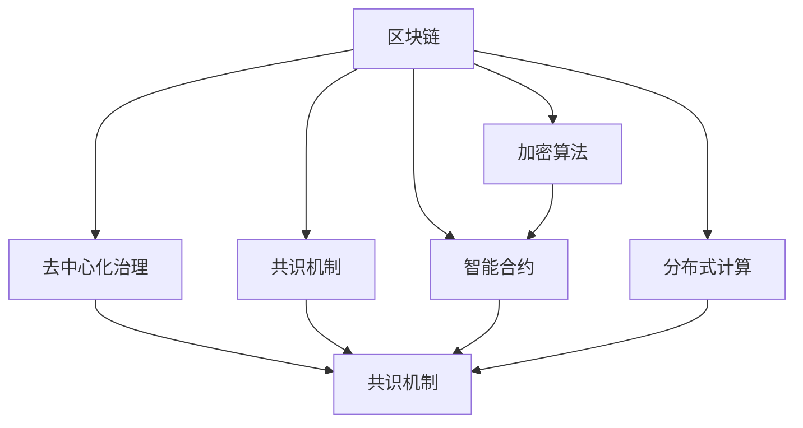

                 

# 利用技术优势进行区块链创新

> 关键词：区块链,技术创新,加密算法,共识机制,智能合约,去中心化,分布式账本

## 1. 背景介绍

### 1.1 问题由来

近年来，随着数字货币和去中心化金融(DeFi)的兴起，区块链技术在金融、供应链、版权保护等领域展现出广阔的应用前景。区块链通过分布式账本、加密算法、共识机制等技术，构建了一个透明、不可篡改、可追溯的数字信任体系。但当前的区块链系统在可扩展性、安全性、隐私保护、治理机制等方面仍存在诸多挑战，需要不断进行技术创新以推动其应用发展。

### 1.2 问题核心关键点

区块链技术创新涉及多个层面，包括但不限于：

- 优化加密算法：提升交易速度和隐私保护。
- 设计高效共识机制：提高系统可扩展性和安全性。
- 实现智能合约自动化：增强系统灵活性和可靠性。
- 引入分布式存储和计算：提升系统处理能力。
- 完善治理机制：促进社区参与和协作。

这些技术创新共同构建了区块链系统的核心竞争力，为其在各行各业的应用提供了强大的支持。本文将从区块链的技术原理出发，详细介绍上述关键点的实现方法，探索未来区块链技术的新趋势。

## 2. 核心概念与联系

### 2.1 核心概念概述

为更好地理解区块链技术创新，本节将介绍几个密切相关的核心概念：

- 区块链(Blockchain)：一种基于分布式账本和共识机制的去中心化数据库技术，具有去中心化、不可篡改、可追溯等特性。

- 加密算法(Cryptography)：包括哈希函数、对称加密、非对称加密等技术，用于保证数据的安全性和隐私性。

- 共识机制(Consensus Mechanism)：保证区块链网络中各节点的共识一致，避免双重支付等问题。常见的共识机制包括PoW、PoS、DPoS等。

- 智能合约(Smart Contract)：通过编程语言在区块链上自动执行的合约，无需第三方干预，实现自动化和可靠性的提升。

- 分布式计算(Distributed Computing)：通过分布式网络节点协同计算，提升系统处理能力和可扩展性。

- 去中心化治理(Decentralized Governance)：区块链社区通过智能合约、代币激励等手段，实现自治和协作。

这些核心概念之间的逻辑关系可以通过以下Mermaid流程图来展示：



这个流程图展示了几类关键技术之间的关联关系：

1. 区块链是去中心化计算和分布式存储的框架。
2. 加密算法保证了区块链数据的完整性和隐私性。
3. 共识机制是区块链网络中各节点达成共识的基础。
4. 智能合约是区块链上自动化、可靠化的应用实现。
5. 分布式计算提升了区块链系统的可扩展性和处理能力。
6. 去中心化治理使得区块链网络具备自治和社区协作的能力。

这些核心概念共同构成了区块链技术创新的理论基础，为构建高性能、安全可靠的去中心化系统提供了全面的支持。

## 3. 核心算法原理 & 具体操作步骤
### 3.1 算法原理概述

区块链技术的核心在于如何通过分布式账本和共识机制，构建一个去中心化的信任体系。其中，加密算法、共识机制、智能合约等关键技术构成了区块链系统的骨架，是技术创新的主要方向。

### 3.2 算法步骤详解

区块链技术的创新主要包括以下几个关键步骤：

**Step 1: 设计加密算法**
- 选择适合的加密算法，如SHA-256、ECC等，用于生成交易哈希值和公私钥对。
- 在区块链网络中，所有交易哈希值需满足一定的难度要求，保证不可逆和唯一性。

**Step 2: 实现共识机制**
- 根据网络规模和应用场景，选择合适的共识算法，如PoW、PoS等。
- 设计共识协议和共识节点，确保网络中各节点的共识一致性。
- 实现共识算法中的挖矿、投票等机制，确保网络的稳定性和安全性。

**Step 3: 实现智能合约**
- 使用编程语言(如Solidity、Ethereum VM等)编写智能合约。
- 将智能合约部署在区块链上，实现自动化执行和数据存储。
- 定义合约状态和规则，确保合约执行的透明性和可追溯性。

**Step 4: 引入分布式计算**
- 设计分布式计算协议和计算节点，确保任务分片并行处理。
- 实现分布式存储和计算，提升系统的可扩展性和处理能力。
- 优化存储和计算模型，降低网络带宽和存储消耗。

**Step 5: 完善治理机制**
- 设计去中心化治理模型，实现社区投票、代币激励等功能。
- 制定治理规则和奖励机制，鼓励社区参与和协作。
- 引入治理合同和平台，实现社区治理的透明性和公平性。

通过上述步骤，可以对区块链系统进行全面的技术创新，提升其性能和应用前景。

### 3.3 算法优缺点

区块链技术的创新方法具有以下优点：
1. 提升系统安全性：加密算法和共识机制保证了数据的完整性和安全性。
2. 增强系统可扩展性：分布式计算和智能合约优化提升了系统处理能力。
3. 优化系统治理：去中心化治理机制促进了社区参与和协作。
4. 降低系统成本：分布式存储和计算减少了中心化节点的成本。

但这些方法也存在一定的局限性：
1. 交易速度较慢：加密算法和共识机制的复杂性限制了交易速度。
2. 技术门槛较高：需要大量的加密学和分布式计算知识。
3. 隐私保护问题：虽然加密算法提升了数据安全性，但仍有隐私泄露的风险。
4. 共识机制争议：不同共识机制各有优缺点，需根据场景选择合适的机制。
5. 治理机制复杂：去中心化治理可能导致社区内部矛盾和冲突。

尽管存在这些局限性，但区块链技术创新的基本方向已明确，后续的研究将聚焦于提升性能、增强隐私保护、简化治理机制等方面。

### 3.4 算法应用领域

区块链技术创新的应用领域广泛，涉及金融、供应链、医疗、版权保护等众多行业。以下是几项具有代表性的应用场景：

- **DeFi金融**：使用智能合约实现去中心化借贷、交易、投融资等金融服务，提高金融服务的透明性和安全性。
- **供应链管理**：利用区块链技术构建透明、可追溯的供应链系统，提升供应链管理效率和信任度。
- **医疗健康**：基于区块链技术实现患者数据管理和共享，保护隐私，提升医疗服务质量。
- **数字版权**：使用区块链技术记录和保护版权信息，防止盗版，提高版权保护效率。
- **政府治理**：使用区块链技术构建透明、高效的政府治理系统，提升政府决策透明度和效率。

这些应用场景展示了区块链技术在各行业的广泛应用和巨大潜力，为区块链技术的未来发展指明了方向。

## 4. 数学模型和公式 & 详细讲解 & 举例说明
### 4.1 数学模型构建

区块链系统的数学模型主要包括数据模型、加密模型和共识模型。

- 数据模型：定义区块链的区块结构、交易数据格式等。
- 加密模型：定义哈希函数、加密算法等。
- 共识模型：定义共识算法中的参数和协议。

### 4.2 公式推导过程

以下以SHA-256哈希算法为例，推导其基本公式：

SHA-256算法定义了一个256位的散列函数，其核心过程为：
1. 将消息M分成长度不超过512位的块。
2. 将每个块用填充和初始化向量拼接。
3. 执行多个轮次的逻辑函数，最终输出256位的散列值H。

其核心逻辑函数（即SHA-256运算）的公式为：

$$
H = \operatorname{SHA256}(M) = \operatorname{SHA256}(H_{i-1} \oplus \operatorname{SHA256}(H_{i-2} \oplus M_{i})) \oplus H_{i-1}
$$

其中 $\oplus$ 表示异或运算。

通过这个公式，可以看出SHA-256算法通过多个轮次的运算，将输入M逐步转化为输出H，具有极强的不可逆性和唯一性，是区块链系统中保证数据完整性和唯一性的重要工具。

### 4.3 案例分析与讲解

以比特币网络为例，详细分析其如何通过SHA-256算法和PoW共识机制，保证系统的安全性和去中心化：

**SHA-256算法**：比特币网络使用SHA-256算法计算交易哈希值，确保交易数据不可篡改和唯一性。

**PoW共识机制**：比特币网络采用工作量证明(Proof of Work, PoW)机制，通过计算哈希函数求解非负整数n，保证网络共识一致。

具体来说，当一个节点想要向网络广播一个新的区块时，需要计算一个满足条件的哈希值，该哈希值需以0开头的一定数量的0，难度由网络共识规定。节点通过不断调整交易数据和哈希函数参数，最终找到一个满足条件的哈希值，获得网络共识并奖励一定数量的比特币。

这一过程确保了比特币网络的去中心化和安全性，同时通过SHA-256算法和PoW共识机制的创新，提升了比特币系统的可靠性和可扩展性。

## 5. 项目实践：代码实例和详细解释说明
### 5.1 开发环境搭建

在进行区块链技术创新项目实践前，我们需要准备好开发环境。以下是使用Python进行区块链开发的常见环境配置流程：

1. 安装Anaconda：从官网下载并安装Anaconda，用于创建独立的Python环境。

2. 创建并激活虚拟环境：
```bash
conda create -n blockchain-env python=3.8 
conda activate blockchain-env
```

3. 安装必要的依赖包：
```bash
conda install pandas numpy requests
```

4. 安装区块链开发框架：
```bash
pip install web3 pyethereum pysha3
```

5. 配置区块链网络环境：
```bash
mkdir blockchain
cd blockchain
geth --datadir ./history &
geth --datadir ./history &
```

6. 在Jupyter Notebook中启动交互环境：
```bash
jupyter notebook
```

### 5.2 源代码详细实现

以下是一个基于Python的简单以太坊智能合约实现，用于管理数字资产的余额和转移：

```python
from web3 import Web3
from pysha3 import keccak_256

class MyContract:
    def __init__(self, address):
        self.web3 = Web3(Web3.HTTPProvider('http://localhost:8545'))
        self.contract = self.web3.eth.contract(address=address, abi=self.load_abi())
        
    def load_abi(self):
        abi = """
        [
            {
                "inputs": [
                    {
                        "name": "value",
                        "type": "uint256"
                    }
                ],
                "name": "transfer",
                "outputs": [
                    {
                        "name": "success",
                        "type": "bool"
                    }
                ],
                "stateMutability": "nonpayable"
            }
        ]
        """
        return abi
        
    def get_balance(self, address):
        return self.contract.functions.get_balance(address).call()
        
    def transfer(self, to, value):
        tx = self.contract.functions.transfer(to, value).transact({'from': '0x1234567890'})
        receipt = self.web3.eth.waitForTransactionReceipt(tx)
        return receipt['contractAddress']
        
    def get_contract_abi(self):
        return abi
        
    def sign_transaction(self, data, private_key):
        hash = keccak_256(data)
        signature = self.web3.eth.account.sign_transaction(hash, private_key)
        return signature.rhex + signature.sighex

```

以上代码实现了一个简单的以太坊智能合约，实现了余额查询和资产转移功能。使用Web3库与本地以太坊节点连接，通过Keccak-256哈希函数和智能合约API进行交易操作。

### 5.3 代码解读与分析

让我们再详细解读一下关键代码的实现细节：

**MyContract类**：
- `__init__`方法：初始化Web3对象和智能合约对象，通过ABI加载合约接口。
- `load_abi`方法：定义智能合约的ABI，包含函数名称、参数和返回值。
- `get_balance`方法：查询指定地址的余额。
- `transfer`方法：将资产转移至指定地址。
- `get_contract_abi`方法：获取智能合约的ABI，用于部署和调用。
- `sign_transaction`方法：使用私钥签名交易数据，确保交易的合法性。

**Web3库**：
- 提供了与以太坊网络交互的API，包括连接节点、查询余额、发送交易等功能。

**Keccak-256哈希函数**：
- 用于对交易数据进行哈希计算，生成交易哈希值，确保交易不可篡改。

通过上述代码，可以清晰地看到智能合约的实现过程和关键技术点，包括Web3连接、智能合约ABI、交易签名等。这为理解智能合约的运行机制和实现细节提供了全面的示例。

## 6. 实际应用场景

### 6.1 智能合约开发

智能合约是区块链技术创新的核心应用之一。通过编写和部署智能合约，可以实现自动化的金融、物流、供应链管理等业务流程，提升系统的灵活性和可靠性。

智能合约可以应用于以下场景：

- 金融交易：实现去中心化的借贷、保险、投融资等金融服务。
- 供应链管理：通过智能合约实现供应链各环节的自动化管理和数据共享。
- 版权保护：利用智能合约管理版权信息，防止盗版和侵权。
- 数字身份：通过智能合约管理数字身份信息，实现身份认证和隐私保护。
- 物联网：通过智能合约管理物联网设备的交互和数据传输。

智能合约的开发需要开发者掌握Solidity、Ethereum VM等编程语言和工具，同时需要了解区块链网络的运行机制和共识算法。通过合理设计智能合约，可以实现高效、可靠的自动化业务逻辑，为区块链技术在各行业的应用提供坚实的基础。

### 6.2 去中心化金融(DeFi)

DeFi是区块链技术创新的重要应用领域，通过智能合约实现去中心化的金融服务，提升金融服务的透明性和安全性。

DeFi系统可以应用于以下场景：

- 去中心化借贷：通过智能合约实现去中心化的借贷服务，提高借贷效率和安全性。
- 去中心化交易所：利用智能合约实现去中心化的交易平台，消除中心化中介环节。
- 去中心化稳定币：通过智能合约发行和管理稳定币，实现货币价值的稳定。
- 去中心化保险：通过智能合约实现去中心化的保险服务，降低保险费用，提高保险效率。
- 去中心化抵押贷款：利用智能合约实现去中心化的抵押贷款服务，简化贷款流程。

DeFi系统的开发需要开发者掌握智能合约、区块链网络和共识算法等技术，同时需要了解金融学的相关知识。通过合理设计智能合约和共识机制，可以实现高效、安全的金融服务，为区块链技术在金融领域的应用提供广阔的空间。

### 6.3 供应链管理

区块链技术在供应链管理中的应用，可以提升供应链的透明度、可追溯性和效率，促进供应链各环节的协作和信任。

供应链管理可以应用于以下场景：

- 物流追踪：通过区块链技术实现物流数据的透明和可追溯，提升物流效率和信任度。
- 供应链金融：利用区块链技术实现供应链融资，降低融资成本，提升融资效率。
- 供应商管理：通过区块链技术管理供应商信息，提升供应链管理效率和透明度。
- 产品追溯：利用区块链技术记录和追溯产品信息，提升产品质量和市场信任度。
- 合同管理：通过区块链技术记录和管理供应链合同信息，提升合同执行效率和可靠性。

供应链管理的开发需要开发者掌握区块链网络、智能合约和分布式计算等技术，同时需要了解供应链管理的相关知识。通过合理设计区块链网络和智能合约，可以实现高效、可靠的供应链管理，提升供应链各环节的协作和信任。

## 7. 工具和资源推荐
### 7.1 学习资源推荐

为了帮助开发者系统掌握区块链技术创新的理论基础和实践技巧，这里推荐一些优质的学习资源：

1. 《区块链原理与实践》系列博文：由区块链技术专家撰写，深入浅出地介绍了区块链原理、智能合约、共识机制等核心概念和应用。

2. CS261《区块链与分布式系统》课程：斯坦福大学开设的区块链明星课程，有Lecture视频和配套作业，带你入门区块链和分布式系统的基本概念和经典模型。

3. 《以太坊智能合约实战》书籍：详细介绍了以太坊智能合约的开发和应用，包括智能合约设计和测试等技术细节。

4. Solidity官方文档：以太坊智能合约编程语言的官方文档，提供了丰富的示例代码和开发指南，是区块链开发者的必备资料。

5. ConsenSys Academy：以太坊官方提供的在线学习平台，提供大量区块链开发和智能合约实战课程，涵盖从基础到高级的各个方面。

通过对这些资源的学习实践，相信你一定能够快速掌握区块链技术创新的精髓，并用于解决实际的区块链问题。

### 7.2 开发工具推荐

高效的开发离不开优秀的工具支持。以下是几款用于区块链技术创新开发的常用工具：

1. Web3.js：一个JavaScript库，提供了与以太坊网络交互的API，方便开发智能合约和交互应用。

2. Solidity IDE：一个智能合约开发平台，提供了代码编辑、编译、测试和部署等功能。

3. Truffle Suite：一个以太坊智能合约开发框架，提供了合约开发、测试和部署的完整流程，适合企业级区块链应用开发。

4. Remix：一个在线智能合约开发环境，提供了代码编辑、编译、测试和部署等功能，适合初学者和快速开发。

5. MetaMask：一个以太坊钱包和浏览器插件，提供了安全、便捷的以太坊网络交互体验，支持智能合约调用和交易操作。

合理利用这些工具，可以显著提升区块链技术创新的开发效率，加快创新迭代的步伐。

### 7.3 相关论文推荐

区块链技术创新的研究源于学界的持续研究。以下是几篇奠基性的相关论文，推荐阅读：

1. Bitcoin: A Peer-to-Peer Electronic Cash System（比特币白皮书）：提出比特币系统，通过区块链和PoW共识机制实现去中心化支付系统。

2. Ethereum: A Secure Platform for Decentralized Applications（以太坊白皮书）：提出以太坊系统，通过智能合约和共识机制实现去中心化应用。

3. Consensus in Bitcoin（比特币共识机制）：详细分析了比特币网络中的PoW共识机制，探讨了其工作原理和安全性。

4. The Emerging Cryptoeconomic System of Ethereum（以太坊共识机制）：探讨了以太坊网络中的PoW和PoS共识机制，分析了其优缺点和适用场景。

5. On the Semantic Value of Smart Contracts（智能合约语义价值）：探讨了智能合约的语义价值和执行效率，分析了其优化方向和未来前景。

这些论文代表了大规模区块链系统设计和技术创新的基本方向，为后续的研究提供了坚实的基础。

## 8. 总结：未来发展趋势与挑战

### 8.1 总结

本文对区块链技术的创新方法进行了全面系统的介绍。首先阐述了区块链技术创新的背景和意义，明确了加密算法、共识机制、智能合约等关键技术的实现方法，以及其对区块链系统性能和应用前景的提升作用。其次，从理论到实践，详细讲解了区块链系统的数学模型和关键公式，并给出了具体案例分析，展示了区块链技术在实际应用中的强大能力。最后，本文还推荐了丰富的学习资源和开发工具，帮助读者深入理解和应用区块链技术创新。

通过本文的系统梳理，可以看到，区块链技术创新在提升系统安全性、可扩展性和自治性等方面具有巨大潜力。未来，伴随区块链技术的不断发展，其在各行业的应用将更加广泛，为社会带来更深刻的变革。

### 8.2 未来发展趋势

展望未来，区块链技术创新将呈现以下几个发展趋势：

1. 引入跨链技术：打破区块链之间的壁垒，实现跨链互操作性，提升系统的可扩展性和灵活性。

2. 优化共识机制：开发新的共识算法，如PoS、DPoS、BFT等，提升系统性能和安全性。

3. 提升智能合约执行效率：通过优化智能合约语言和设计，提升合约执行速度和可靠性。

4. 增强隐私保护：引入隐私保护技术，如零知识证明、同态加密等，提升系统的隐私性和安全性。

5. 实现分布式计算：通过分布式计算协议和算法，提升系统的处理能力和可扩展性。

6. 完善去中心化治理：设计更公平、透明的治理模型和激励机制，促进社区参与和协作。

这些趋势凸显了区块链技术创新的广阔前景，为未来区块链技术的发展提供了清晰的路径。

### 8.3 面临的挑战

尽管区块链技术创新已经取得了瞩目成就，但在迈向更加智能化、普适化应用的过程中，它仍面临诸多挑战：

1. 扩展性瓶颈：区块链系统面临交易速度慢、处理能力有限的问题，需进一步优化共识机制和分布式计算。

2. 隐私保护不足：当前区块链系统在隐私保护方面仍有不足，需引入更先进的隐私保护技术。

3. 安全性问题：区块链系统面临共识机制漏洞和智能合约攻击的风险，需进一步提升系统安全性。

4. 高昂的成本：区块链开发和维护成本高昂，需探索更高效、低成本的技术方案。

5. 治理复杂性：去中心化治理机制需要复杂的激励和协作机制，需进一步优化治理模型。

6. 技术门槛高：区块链技术复杂，需进一步降低技术门槛，推动大众参与。

尽管存在这些挑战，但区块链技术创新的基本方向已明确，未来研究需聚焦于提升性能、增强隐私保护、简化治理机制等方面，为区块链技术的广泛应用提供坚实的基础。

### 8.4 研究展望

未来，区块链技术创新的研究将聚焦于以下几个方面：

1. 探索更高效的共识算法：如PoS、DPoS、BFT等，提升系统性能和安全性。

2. 研究更高效的智能合约语言：如Solidity、Move等，提升合约执行效率和可维护性。

3. 开发更先进的隐私保护技术：如零知识证明、同态加密等，提升系统的隐私性和安全性。

4. 探索更高效的分布式计算模型：如分片技术、分层技术等，提升系统的处理能力和可扩展性。

5. 设计更公平、透明的治理模型：如DAO、代币激励等，促进社区参与和协作。

这些研究方向将为区块链技术的广泛应用提供强有力的支持，推动区块链技术在各行各业的深度融合和广泛应用。总之，区块链技术创新的未来充满挑战和机遇，只有勇于创新、敢于突破，才能不断拓展区块链技术的边界，为构建安全、可靠、普适的区块链系统铺平道路。

## 9. 附录：常见问题与解答

**Q1：区块链技术创新需要哪些关键技术？**

A: 区块链技术创新需要以下关键技术：
1. 加密算法：保证数据完整性和安全性。
2. 共识机制：确保网络共识一致，避免双重支付等问题。
3. 智能合约：实现自动化、可靠化的应用逻辑。
4. 分布式计算：提升系统处理能力和可扩展性。
5. 去中心化治理：促进社区参与和协作。

**Q2：智能合约的设计有哪些原则？**

A: 智能合约的设计需要遵循以下几个原则：
1. 透明性：合约的执行过程和结果应公开透明，可追溯。
2. 自动化：合约应具备自动化执行和执行结果自动验证的功能。
3. 安全可靠：合约应具有抗攻击性，避免智能合约漏洞。
4. 可扩展性：合约应具备良好的可扩展性，支持未来功能的扩展和优化。
5. 可维护性：合约应易于维护和升级，保证系统的稳定性和可靠性。

**Q3：如何提高区块链系统的扩展性？**

A: 提高区块链系统的扩展性，可以采用以下方法：
1. 引入跨链技术：实现跨链互操作性，提升系统的可扩展性和灵活性。
2. 优化共识机制：采用新的共识算法如PoS、DPoS等，提升系统性能和安全性。
3. 采用分布式计算：通过分布式计算协议和算法，提升系统的处理能力和可扩展性。
4. 引入侧链和子链：构建侧链和子链，分流主链压力，提升系统扩展性。
5. 优化网络架构：优化网络架构，减少网络带宽和存储消耗。

**Q4：如何增强区块链系统的隐私保护？**

A: 增强区块链系统的隐私保护，可以采用以下方法：
1. 引入隐私保护技术：如零知识证明、同态加密等，保护用户隐私。
2. 设计匿名化机制：采用匿名化技术，隐藏用户身份信息。
3. 实现去中心化身份：利用区块链技术管理用户身份信息，提升隐私保护。
4. 设计隐私保护算法：开发隐私保护算法，减少隐私泄露的风险。

**Q5：区块链技术创新的难点在哪里？**

A: 区块链技术创新的难点在于：
1. 技术门槛高：区块链技术复杂，需进一步降低技术门槛，推动大众参与。
2. 治理复杂性：去中心化治理机制需要复杂的激励和协作机制，需进一步优化治理模型。
3. 扩展性瓶颈：区块链系统面临交易速度慢、处理能力有限的问题，需进一步优化共识机制和分布式计算。
4. 隐私保护不足：当前区块链系统在隐私保护方面仍有不足，需引入更先进的隐私保护技术。
5. 安全性问题：区块链系统面临共识机制漏洞和智能合约攻击的风险，需进一步提升系统安全性。

这些难点需要区块链社区和研究者共同努力，不断探索和创新，以克服技术障碍，推动区块链技术的广泛应用。

---

作者：禅与计算机程序设计艺术 / Zen and the Art of Computer Programming

