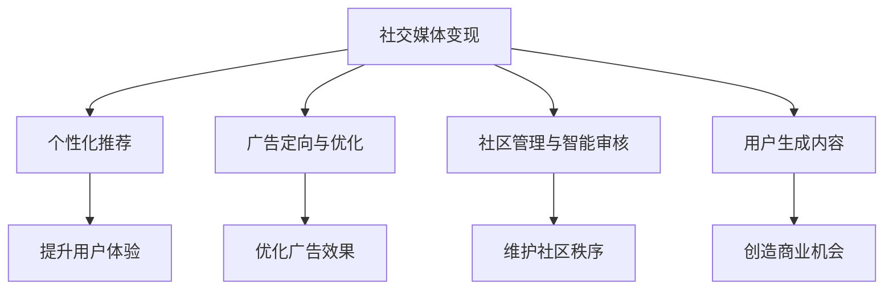

                 

# 利用技术优势进行社交媒体变现

## 1. 背景介绍

### 1.1 问题由来

随着社交媒体平台的崛起，社交网络的价值日益凸显。海量的用户数据和丰富的社交互动提供了无比广阔的商业机会，使得各大企业和机构纷纷投身于社交媒体变现的探索中。传统的基于流量的广告和内容付费模式已经难以满足日益增长的市场需求。社交媒体变现需要更加精准、高效的技术手段，以实现数据价值的最大化。

### 1.2 问题核心关键点

如何通过技术手段，更高效地利用社交媒体平台的数据和流量，实现变现的最大化？目前主要依赖于以下几个关键点：

1. **数据挖掘与分析**：从社交媒体数据中挖掘有价值的信息，如用户兴趣、行为模式等，以指导内容推荐、广告投放等。
2. **个性化推荐**：通过算法优化，为不同用户提供个性化内容，提升用户体验和粘性。
3. **广告定位与优化**：利用机器学习模型，精准定位目标用户群体，并优化广告投放策略。
4. **社区管理与互动**：借助自然语言处理(NLP)技术，实现对社区内容的智能审核、引导和互动。
5. **用户生成内容利用**：通过算法激励，激发用户生成高质量内容，同时利用这些内容进行变现。

### 1.3 问题研究意义

社交媒体变现技术的发展，对于提升社交媒体平台的商业价值，推动数字经济的发展具有重要意义：

1. **提升用户体验**：通过个性化推荐和社区互动，提升用户粘性和满意度。
2. **优化广告效果**：精准定位和投放，提高广告投资回报率，降低营销成本。
3. **发现商业机会**：从海量数据中挖掘用户需求和市场趋势，创造新的商业模式。
4. **数据安全保障**：通过技术手段实现对用户数据的合规保护，增强用户信任。

## 2. 核心概念与联系

### 2.1 核心概念概述

为更好地理解社交媒体变现的技术手段，本节将介绍几个密切相关的核心概念：

- **社交媒体变现**：利用社交媒体平台，通过广告、付费内容、电商等形式实现商业价值变现的过程。
- **个性化推荐系统**：基于用户行为和兴趣，动态生成个性化推荐内容，提升用户体验。
- **广告定向与优化**：通过用户画像和行为数据，精准定位目标用户群体，优化广告投放策略。
- **社区管理与智能审核**：利用自然语言处理技术，对社区内容进行智能审核和引导，维护社区秩序。
- **用户生成内容**：通过技术激励机制，引导用户生成高质量内容，并利用这些内容实现商业变现。

这些核心概念之间的逻辑关系可以通过以下Mermaid流程图来展示：



这个流程图展示了几类社交媒体变现技术的核心概念及其之间的关系：

1. 社交媒体变现通过多种技术手段，如个性化推荐、广告定向、内容审核等，实现商业价值最大化。
2. 个性化推荐和广告定向提升了用户体验和广告效果，而社区管理和用户生成内容则创造了更多的商业机会。
3. 这些技术手段相互协同，共同推动社交媒体平台向更加智能化、精准化的方向发展。

## 3. 核心算法原理 & 具体操作步骤
### 3.1 算法原理概述

社交媒体变现的核心算法原理主要包括个性化推荐、广告定向、社区管理、用户生成内容等方面，其中个性化推荐和广告定向是主要的技术手段。

个性化推荐系统基于用户的历史行为和兴趣，生成个性化的内容推荐，提升用户体验。而广告定向则是通过机器学习模型，精准定位目标用户群体，实现广告投放的最优化。两者共同作用，可以有效提升社交媒体平台的商业价值。

### 3.2 算法步骤详解

#### 3.2.1 个性化推荐算法步骤

1. **数据收集与处理**：收集用户行为数据，如浏览记录、点赞、评论等，并进行清洗和特征提取。
2. **用户画像构建**：利用机器学习算法，如协同过滤、深度学习等，构建用户画像，描述用户兴趣和行为特征。
3. **内容生成与推荐**：根据用户画像，使用推荐算法，如矩阵分解、深度神经网络等，生成个性化推荐内容，并推送给用户。
4. **推荐效果评估**：通过A/B测试等方法，评估推荐效果，不断优化推荐算法和内容库。

#### 3.2.2 广告定向算法步骤

1. **数据收集与处理**：收集用户数据和广告数据，并进行清洗和特征提取。
2. **用户画像构建**：利用机器学习算法，构建用户画像，描述用户属性和行为特征。
3. **广告投放优化**：使用优化算法，如线性回归、逻辑回归等，预测用户对不同广告的反应，并进行定向投放。
4. **效果评估与反馈**：根据广告投放效果，调整模型参数和投放策略，不断优化广告定向。

### 3.3 算法优缺点

#### 3.3.1 个性化推荐

**优点**：
1. **提升用户体验**：个性化推荐能够提升用户的满意度和粘性，增加平台的使用时长。
2. **优化广告效果**：通过精准定位，提升广告的点击率和转化率，提高广告投资回报率。

**缺点**：
1. **隐私问题**：用户行为数据的收集和分析涉及隐私保护问题，需要严格遵守法律法规。
2. **数据冷启动**：新用户缺乏足够的历史数据，难以进行有效的个性化推荐。
3. **模型复杂度**：推荐算法模型通常较为复杂，计算成本较高。

#### 3.3.2 广告定向

**优点**：
1. **精准投放**：通过机器学习模型，精准定位目标用户群体，提高广告的投放效果。
2. **成本控制**：优化广告预算分配，降低无效投放，提升广告效果。

**缺点**：
1. **模型偏差**：模型对用户特征的预测可能存在偏差，导致定向效果不佳。
2. **动态变化**：用户兴趣和行为是动态变化的，需要实时更新模型以保持准确性。
3. **数据隐私**：广告定向涉及用户数据的收集和分析，需要保护用户隐私。

### 3.4 算法应用领域

个性化推荐和广告定向技术已经在电商、社交媒体、在线视频等多个领域得到了广泛应用，展示了其强大的商业价值：

- **电商**：如亚马逊、淘宝等电商平台，通过个性化推荐提升销售转化率，实现精准广告投放。
- **社交媒体**：如微信、微博等社交平台，通过个性化推荐和广告定向，提升用户粘性和广告效果。
- **在线视频**：如Netflix、爱奇艺等视频平台，通过个性化推荐提升用户观看时长，优化广告收入。

除了以上应用，个性化推荐和广告定向技术还在教育、金融、医疗等多个领域展现出了巨大的潜力，为各行各业带来了新的商业机会。

## 4. 数学模型和公式 & 详细讲解  
### 4.1 数学模型构建

个性化推荐和广告定向的数学模型主要基于协同过滤、深度学习、线性回归等方法。以协同过滤为例，用户行为矩阵表示为 $R \in \mathbb{R}^{N \times M}$，其中 $N$ 为用户数，$M$ 为物品数，$R_{ui}$ 表示用户 $u$ 对物品 $i$ 的评分。协同过滤的目标是通过已知的用户评分，预测未知的评分，即 $R_{ui}$ 的推荐值。

### 4.2 公式推导过程

协同过滤的推荐公式为：

$$
\hat{R}_{ui} = \alpha \cdot \frac{\sum_{j=1}^{N} R_{uj} \cdot R_{ji}}{\sqrt{\sum_{j=1}^{N} R_{uj}^2} \cdot \sqrt{\sum_{j=1}^{N} R_{ji}^2}}
$$

其中 $\alpha$ 为衰减系数，用于控制评分相似度的大小。该公式基于用户的相似性和物品的相似性，通过矩阵分解，生成推荐值。

### 4.3 案例分析与讲解

以Netflix的个性化推荐为例，Netflix通过协同过滤算法，预测用户对未观看影视作品的好评度，从而生成推荐列表。其具体流程如下：

1. **数据收集**：收集用户历史观看记录，构建用户行为矩阵。
2. **矩阵分解**：使用奇异值分解(SVD)，将用户行为矩阵分解为用户因子矩阵和物品因子矩阵。
3. **评分预测**：根据用户因子和物品因子，生成推荐评分矩阵，预测用户对未观看作品的好评度。
4. **排序推荐**：将预测评分进行排序，生成推荐列表，推送给用户。

通过上述推荐算法，Netflix在用户粘性、广告收入等方面取得了显著提升，成为全球领先的视频服务平台。

## 5. 项目实践：代码实例和详细解释说明
### 5.1 开发环境搭建

在进行社交媒体变现技术开发前，我们需要准备好开发环境。以下是使用Python进行PyTorch开发的环境配置流程：

1. 安装Anaconda：从官网下载并安装Anaconda，用于创建独立的Python环境。

2. 创建并激活虚拟环境：
```bash
conda create -n pytorch-env python=3.8 
conda activate pytorch-env
```

3. 安装PyTorch：根据CUDA版本，从官网获取对应的安装命令。例如：
```bash
conda install pytorch torchvision torchaudio cudatoolkit=11.1 -c pytorch -c conda-forge
```

4. 安装PyTorch库：
```bash
pip install torch torchvision torchaudio transformers
```

5. 安装各类工具包：
```bash
pip install numpy pandas scikit-learn matplotlib tqdm jupyter notebook ipython
```

完成上述步骤后，即可在`pytorch-env`环境中开始开发实践。

### 5.2 源代码详细实现

这里我们以广告定向为例，给出使用PyTorch进行广告定向的代码实现。

首先，定义广告定向的数据处理函数：

```python
import torch
import pandas as pd

def load_data():
    train_data = pd.read_csv('train_data.csv')
    test_data = pd.read_csv('test_data.csv')
    return train_data, test_data

def preprocess_data(data):
    # 数据预处理，如特征提取、数据标准化等
    # ...
    return X_train, y_train, X_test, y_test

X_train, y_train, X_test, y_test = preprocess_data(load_data())
```

然后，定义广告定向的模型和优化器：

```python
from torch import nn
from torch import optim

class AdOnlineClassifier(nn.Module):
    def __init__(self, input_dim, hidden_dim, output_dim):
        super(AdOnlineClassifier, self).__init__()
        self.fc1 = nn.Linear(input_dim, hidden_dim)
        self.fc2 = nn.Linear(hidden_dim, output_dim)
        
    def forward(self, x):
        x = torch.relu(self.fc1(x))
        x = self.fc2(x)
        return x

model = AdOnlineClassifier(input_dim=20, hidden_dim=10, output_dim=2)

optimizer = optim.Adam(model.parameters(), lr=0.001)
```

接着，定义广告定向的训练函数和评估函数：

```python
from sklearn.metrics import accuracy_score

def train_model(model, train_data, optimizer, num_epochs):
    model.train()
    for epoch in range(num_epochs):
        for i, (X, y) in enumerate(train_loader):
            optimizer.zero_grad()
            y_pred = model(X)
            loss = nn.CrossEntropyLoss()(y_pred, y)
            loss.backward()
            optimizer.step()
            print(f'Epoch {epoch+1}, Batch {i+1}, Loss: {loss.item()}')
    return model

def evaluate_model(model, test_data):
    model.eval()
    test_loss = 0
    with torch.no_grad():
        for X, y in test_loader:
            y_pred = model(X)
            test_loss += nn.CrossEntropyLoss()(y_pred, y).item()
    print(f'Test Loss: {test_loss / len(test_loader)}')
    print(f'Test Accuracy: {accuracy_score(y_pred, y_test).round(2)}')
```

最后，启动广告定向的训练流程并在测试集上评估：

```python
num_epochs = 10
batch_size = 32

train_loader = torch.utils.data.DataLoader(train_data, batch_size=batch_size, shuffle=True)
test_loader = torch.utils.data.DataLoader(test_data, batch_size=batch_size, shuffle=False)

model = train_model(model, train_loader, optimizer, num_epochs)
evaluate_model(model, test_loader)
```

以上就是使用PyTorch进行广告定向的完整代码实现。可以看到，借助PyTorch的强大库函数，广告定向的开发变得简洁高效。

### 5.3 代码解读与分析

让我们再详细解读一下关键代码的实现细节：

**广告定向数据处理函数**：
- `load_data`方法：加载广告定向数据集，包括训练集和测试集。
- `preprocess_data`方法：进行数据预处理，如特征提取、标准化等，生成模型所需的数据集。

**广告定向模型定义**：
- `AdOnlineClassifier`类：定义一个简单的线性分类器，用于预测用户是否点击广告。
- `nn.Linear`类：定义线性层，进行向量映射。
- `nn.ReLU`类：定义ReLU激活函数，增加模型非线性表达能力。

**优化器定义**：
- `optim.Adam`类：定义Adam优化器，用于更新模型参数。

**训练函数**：
- `train_model`函数：在训练集上进行迭代训练，更新模型参数。
- `torch.no_grad`上下文管理器：开启无梯度计算模式，加快模型推理速度。

**评估函数**：
- `evaluate_model`函数：在测试集上评估模型性能，输出测试损失和准确率。

**训练流程**：
- `num_epochs`变量：设置训练轮数。
- `batch_size`变量：设置批处理大小。
- `train_loader`和`test_loader`：定义数据加载器，进行批处理数据和数据集迭代。
- `train_model`函数：调用训练函数进行模型训练。
- `evaluate_model`函数：调用评估函数进行模型评估。

可以看到，广告定向的开发主要是利用PyTorch库函数进行模型定义和训练。通过合理的参数设置和模型优化，可以在较短的时间内构建出高效的广告定向系统。

## 6. 实际应用场景
### 6.1 智能广告投放

社交媒体平台利用广告定向技术，可以实现精准投放，提升广告效果和投资回报率。例如，Facebook和Google通过广告定向技术，对用户进行行为特征分析，生成用户画像，精确匹配广告内容，实现了高效的广告投放。

在技术实现上，可以收集用户点击、浏览、互动等行为数据，构建用户行为矩阵。利用协同过滤、深度学习等方法，预测用户对不同广告的反应，从而实现精准投放。

### 6.2 个性化内容推荐

社交媒体平台通过个性化推荐，提升用户体验和粘性。例如，微信朋友圈、微博热搜等通过推荐算法，为用户推荐感兴趣的内容，增加平台的使用时长。

在技术实现上，可以收集用户历史行为数据，构建用户画像。使用协同过滤、深度学习等方法，生成个性化推荐内容，并通过A/B测试等方法不断优化推荐效果。

### 6.3 智能客服系统

社交媒体平台利用用户生成内容，构建智能客服系统，提升用户体验。例如，微博客服、抖音客服通过自然语言处理技术，自动回答用户问题，解决用户疑惑，提升客户满意度。

在技术实现上，可以收集用户评论、私信等生成内容，构建语料库。使用情感分析、命名实体识别等技术，对用户生成内容进行自动审核和分类，生成智能回复，提升客服系统的响应速度和准确性。

### 6.4 未来应用展望

随着技术的不断进步，社交媒体变现技术将在更多领域得到应用，为各行各业带来新的机遇：

- **教育**：利用用户生成内容，构建教育平台，提供个性化的学习推荐和资源共享。
- **医疗**：利用用户生成内容，构建医疗平台，提供健康咨询和个性化诊疗。
- **旅游**：利用用户生成内容，构建旅游平台，提供个性化旅游推荐和点评分享。
- **金融**：利用用户生成内容，构建金融平台，提供个性化的投资建议和理财服务。

社交媒体变现技术的多样化应用，将进一步推动社交媒体平台向更加智能化、精准化的方向发展，为数字经济带来新的活力。

## 7. 工具和资源推荐
### 7.1 学习资源推荐

为了帮助开发者系统掌握社交媒体变现的技术基础和实践技巧，这里推荐一些优质的学习资源：

1. **《深度学习与推荐系统》**：刘永龙著，详细讲解了推荐系统的算法和实现方法，适合初学者系统学习。
2. **《社交媒体数据分析》**：张亚坤著，介绍了社交媒体数据的收集和分析方法，适合应用型开发者参考。
3. **《Python深度学习》**：Francois Chollet著，系统讲解了深度学习框架PyTorch的使用方法和应用案例，适合实战开发者参考。
4. **《自然语言处理入门》**：李威著，介绍了自然语言处理的基础理论和应用方法，适合NLP开发者参考。
5. **Google AdWords AdRank官方文档**：Google广告平台官方文档，详细介绍了广告定向的算法和优化方法，适合广告开发者参考。

通过对这些资源的学习实践，相信你一定能够快速掌握社交媒体变现的精髓，并用于解决实际的商业问题。

### 7.2 开发工具推荐

高效的开发离不开优秀的工具支持。以下是几款用于社交媒体变现开发的常用工具：

1. **PyTorch**：基于Python的开源深度学习框架，灵活动态的计算图，适合快速迭代研究。大多数社交媒体推荐和广告定向系统都有PyTorch版本的实现。
2. **TensorFlow**：由Google主导开发的开源深度学习框架，生产部署方便，适合大规模工程应用。同样有丰富的推荐系统和广告定向资源。
3. **Keras**：基于TensorFlow和Theano的高层次API，适合快速开发原型和模型实验。
4. **Spark**：Apache基金会推出的分布式计算框架，适合处理大规模数据集，进行高效的数据处理和分析。
5. **Jupyter Notebook**：轻量级开发环境，支持Python、R等多种语言，适合快速迭代实验和文档记录。
6. **Scikit-Learn**：Python数据挖掘和机器学习库，适合进行数据预处理和模型评估。

合理利用这些工具，可以显著提升社交媒体变现任务的开发效率，加快创新迭代的步伐。

### 7.3 相关论文推荐

社交媒体变现技术的发展源于学界的持续研究。以下是几篇奠基性的相关论文，推荐阅读：

1. **AdWords AdRank论文**：Google广告平台的核心算法，详细介绍了广告定向的优化算法和实现方法。
2. **Wide & Deep Learning for Recommender Systems**：利用宽模型和深度模型结合的方式，提升推荐系统的效果。
3. **Adversarial Learning for Social Media Environments**：研究对抗性学习在社交媒体推荐和广告定向中的应用。
4. **YouTube Recommendations at Scale**：YouTube推荐的优化算法和实现方法，展示了推荐系统的巨大潜力。

这些论文代表了大数据和深度学习在社交媒体变现技术中的应用，提供了丰富的理论和技术支撑。通过学习这些前沿成果，可以帮助研究者把握学科前进方向，激发更多的创新灵感。

## 8. 总结：未来发展趋势与挑战

### 8.1 总结

本文对社交媒体变现的技术手段进行了全面系统的介绍。首先阐述了社交媒体变现的背景和意义，明确了个性化推荐、广告定向等核心技术手段的独特价值。其次，从原理到实践，详细讲解了这些技术的数学模型和关键步骤，给出了具体代码实例。同时，本文还广泛探讨了这些技术在广告投放、内容推荐、智能客服等多个领域的应用前景，展示了社交媒体变现的广阔潜力。此外，本文精选了社交媒体变现技术的各类学习资源，力求为读者提供全方位的技术指引。

通过本文的系统梳理，可以看到，社交媒体变现技术已经广泛应用于各大平台，通过技术手段提升了用户体验和商业价值。未来，伴随技术的不断演进，社交媒体变现将迎来更加智能化、精准化的发展方向，为数字经济带来新的机遇和挑战。

### 8.2 未来发展趋势

展望未来，社交媒体变现技术将呈现以下几个发展趋势：

1. **数据驱动**：未来社交媒体变现将更加依赖于数据驱动，通过收集和分析海量用户数据，实现更加精准的用户画像和推荐。
2. **算法优化**：随着算法技术的不断发展，推荐算法和广告定向将更加高效、智能，提升用户体验和广告效果。
3. **跨领域应用**：社交媒体变现技术将跨界应用到更多领域，如金融、医疗、教育等，创造新的商业价值。
4. **隐私保护**：伴随隐私保护法规的日益严格，社交媒体平台将更加重视用户隐私保护，引入更多隐私保护技术。
5. **多模态融合**：未来推荐系统将更多地融合视觉、音频等多模态数据，提升推荐效果。

这些趋势凸显了社交媒体变现技术的广阔前景。这些方向的探索发展，将进一步推动社交媒体平台向更加智能化、精准化的方向发展，为数字经济带来新的活力。

### 8.3 面临的挑战

尽管社交媒体变现技术已经取得了显著成效，但在迈向更加智能化、普适化应用的过程中，它仍面临诸多挑战：

1. **数据隐私问题**：用户数据的收集和分析涉及隐私保护问题，需要严格遵守法律法规。
2. **冷启动问题**：新用户缺乏足够的历史数据，难以进行有效的个性化推荐。
3. **模型复杂度**：推荐算法模型通常较为复杂，计算成本较高。
4. **动态变化**：用户兴趣和行为是动态变化的，需要实时更新模型以保持准确性。
5. **算法偏差**：模型对用户特征的预测可能存在偏差，导致推荐和定向效果不佳。

正视这些挑战，积极应对并寻求突破，将是社交媒体变现技术走向成熟的必由之路。相信随着学界和产业界的共同努力，这些挑战终将一一被克服，社交媒体变现技术必将迎来更加广阔的发展空间。

### 8.4 研究展望

面对社交媒体变现所面临的挑战，未来的研究需要在以下几个方面寻求新的突破：

1. **数据增强**：通过数据增强技术，提升推荐和定向模型的泛化能力，缓解冷启动问题。
2. **轻量化模型**：开发轻量化推荐和定向模型，提升模型推理速度和资源利用效率。
3. **因果推理**：引入因果推理技术，提升推荐模型的可解释性和鲁棒性。
4. **跨模态融合**：更多地融合视觉、音频等多模态数据，提升推荐效果。
5. **隐私保护**：引入隐私保护技术，如差分隐私、联邦学习等，确保用户数据的安全性和隐私保护。

这些研究方向的探索，必将引领社交媒体变现技术迈向更高的台阶，为构建安全、可靠、可解释、可控的智能系统铺平道路。面向未来，社交媒体变现技术还需要与其他人工智能技术进行更深入的融合，如知识表示、因果推理、强化学习等，多路径协同发力，共同推动自然语言理解和智能交互系统的进步。只有勇于创新、敢于突破，才能不断拓展社交媒体变现技术的边界，让智能技术更好地造福社会。

## 9. 附录：常见问题与解答

**Q1：社交媒体平台如何保证用户数据隐私？**

A: 社交媒体平台在数据收集和分析过程中，严格遵守相关法律法规，如GDPR、CCPA等。具体措施包括：
1. 匿名化处理：对用户数据进行匿名化处理，避免直接关联到个人身份。
2. 加密传输：使用HTTPS等加密传输协议，保护数据传输过程中的安全。
3. 数据访问控制：限制数据访问权限，确保只有授权人员能够访问敏感数据。
4. 隐私协议：明确告知用户数据收集和使用方式，征得用户同意。

通过以上措施，社交媒体平台可以在保证用户隐私的前提下，进行数据收集和分析。

**Q2：社交媒体平台如何应对冷启动问题？**

A: 社交媒体平台可以通过以下方式应对冷启动问题：
1. 基于兴趣标签推荐：收集用户历史行为数据，生成兴趣标签，进行冷启动推荐。
2. 多维度数据融合：结合用户人口统计信息、设备信息等多维度数据，进行多模态推荐。
3. 模型预训练：在少量数据上进行模型预训练，提高模型初始化效果。
4. 强化学习：通过与用户互动，逐步优化推荐策略，缓解冷启动问题。

通过这些方法，社交媒体平台可以在冷启动阶段，为用户快速提供个性化推荐，提升用户体验。

**Q3：社交媒体平台如何提升广告定向效果？**

A: 社交媒体平台可以通过以下方式提升广告定向效果：
1. 数据融合：结合用户历史行为数据和广告展示数据，进行联合优化。
2. 特征工程：对用户特征进行深入挖掘，构建更加精准的用户画像。
3. 实时更新：定期更新用户画像和广告库，保持数据的时效性。
4. 模型优化：引入先进的机器学习模型，如深度学习、强化学习等，提升广告定向效果。

通过这些方法，社交媒体平台可以不断提高广告定向的精准度，提升广告投放效果。

**Q4：社交媒体平台如何提升个性化推荐效果？**

A: 社交媒体平台可以通过以下方式提升个性化推荐效果：
1. 数据收集：全面收集用户行为数据，如浏览记录、点击记录、互动记录等。
2. 特征工程：对用户行为数据进行特征提取，生成用户画像。
3. 模型优化：引入先进的推荐算法，如协同过滤、深度学习等，提升推荐效果。
4. 实时更新：定期更新用户画像和物品库，保持数据的时效性。

通过这些方法，社交媒体平台可以不断优化个性化推荐算法，提升用户粘性和满意度。

**Q5：社交媒体平台如何实现社区管理与智能审核？**

A: 社交媒体平台可以通过以下方式实现社区管理与智能审核：
1. 数据收集：收集社区内容数据，如评论、私信、帖子等。
2. 文本分析：利用自然语言处理技术，对文本内容进行情感分析、实体识别等。
3. 规则制定：制定社区管理规则，如禁止垃圾信息、假冒账号等。
4. 智能审核：引入机器学习模型，自动审核社区内容，及时发现违规行为。

通过这些方法，社交媒体平台可以提升社区管理效率，保障平台秩序。

---

作者：禅与计算机程序设计艺术 / Zen and the Art of Computer Programming

