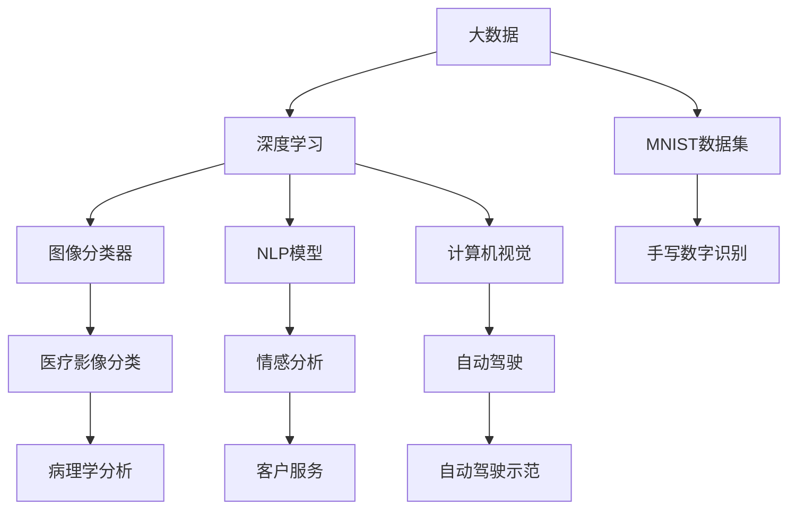

                 

## 1. 背景介绍

全球性挑战，如气候变化、资源短缺、疾病流行、社会不公等，影响着人类的生存和发展。解决这些挑战，需要全人类的智慧和努力。人工智能（AI）作为一门快速发展的技术，通过利用机器学习和数据分析，可以汇聚和整合全球知识，为解决全球性问题提供新的可能性。本文将探讨如何利用集体智慧，通过AI技术解决全球性挑战。

## 2. 核心概念与联系

### 2.1 核心概念概述

- **人工智能（AI）**：一种模拟人类智能的技术，包括机器学习、深度学习、自然语言处理、计算机视觉等子领域。
- **机器学习**：通过算法让机器自动学习，从数据中发现规律，做出预测和决策。
- **深度学习**：一种基于神经网络的机器学习方法，能够处理大规模、非结构化数据，如图像、文本等。
- **自然语言处理（NLP）**：使机器能够理解、处理和生成人类语言的技术。
- **计算机视觉（CV）**：使机器能够“看”和“理解”图像和视频的技术。
- **大数据**：大量、多样、高速、真实的数据集，用于训练AI模型。

这些概念相互联系，共同构成了一个强大的AI技术生态系统，可以应用于全球性挑战的解决。

### 2.2 核心概念原理和架构的 Mermaid 流程图



这个流程图展示了AI技术在多个领域的应用，包括医疗、教育、交通、金融等。通过这些技术，AI可以整合全球知识，解决实际问题。

## 3. 核心算法原理 & 具体操作步骤

### 3.1 算法原理概述

利用集体智慧解决全球性挑战，通常包括以下几个关键步骤：

1. **数据收集**：从全球各地收集相关的数据，包括文本、图像、视频等。
2. **数据预处理**：对数据进行清洗、标注、归一化等处理，使之适合机器学习。
3. **模型训练**：利用机器学习算法训练模型，使其能够学习到数据的规律。
4. **模型评估**：通过评估指标（如准确率、召回率、F1值等）测试模型的性能。
5. **模型部署**：将训练好的模型应用到实际问题中，进行预测和决策。

### 3.2 算法步骤详解

以医疗影像分类为例，以下是具体的步骤：

1. **数据收集**：从全球医疗机构收集大量的医学影像数据，包括X光片、CT扫描、MRI等。
2. **数据预处理**：对数据进行清洗、标注，如去除噪音、分割病灶等。
3. **模型训练**：使用深度学习模型（如卷积神经网络CNN）对数据进行训练，优化模型参数。
4. **模型评估**：在独立的测试集上评估模型性能，如使用混淆矩阵、ROC曲线等。
5. **模型部署**：将模型部署到实际医疗机构，用于病理学分析和诊断。

### 3.3 算法优缺点

**优点**：
- 数据多样化：通过全球数据，可以覆盖更多样化的场景和情况。
- 模型泛化能力：模型在处理新数据时表现较好，能够更好地适应复杂环境。
- 自动化程度高：AI可以自动进行数据处理和模型训练，节省人力和时间。

**缺点**：
- 数据隐私问题：涉及敏感数据，可能引发隐私泄露和伦理问题。
- 数据质量问题：数据标注可能存在偏差和不一致，影响模型性能。
- 模型可解释性：复杂的AI模型难以解释其决策过程，可能缺乏信任度。

### 3.4 算法应用领域

AI技术广泛应用于全球性挑战的解决，以下是一些典型应用领域：

- **医疗健康**：利用AI进行医学影像分析、药物研发、基因组学研究等。
- **环境保护**：使用AI进行气候变化监测、资源管理、环境污染治理等。
- **灾害管理**：通过AI进行地震预测、洪水预警、灾害响应等。
- **教育**：利用AI进行个性化学习、自动评分、知识图谱构建等。
- **金融**：利用AI进行风险评估、欺诈检测、投资分析等。
- **社会公正**：使用AI进行社会舆情分析、公平就业、精准扶贫等。

## 4. 数学模型和公式 & 详细讲解 & 举例说明

### 4.1 数学模型构建

假设我们有一个包含$N$个样本的数据集$D=\{(x_1, y_1), (x_2, y_2), ..., (x_N, y_N)\}$，其中$x_i$是输入特征，$y_i$是标签。

模型的目标是学习一个映射函数$f(x)$，使得$f(x)$能够准确预测$y$。我们可以使用线性回归模型来构建这个映射函数，其形式为：

$$
y_i = f(x_i) = \theta_0 + \sum_{j=1}^d \theta_j x_{ij}
$$

其中$\theta_0$和$\theta_j$是模型参数，$d$是特征维度。

### 4.2 公式推导过程

我们利用均方误差（Mean Squared Error, MSE）作为损失函数，目标是使模型参数$\theta$最小化：

$$
\min_\theta \sum_{i=1}^N (y_i - f(x_i))^2
$$

对损失函数求导，得到参数$\theta$的更新公式：

$$
\theta_j = \theta_j - \eta \frac{1}{N} \sum_{i=1}^N (y_i - f(x_i)) x_{ij}
$$

其中$\eta$是学习率，控制每次参数更新的步长。

### 4.3 案例分析与讲解

以医疗影像分类为例，使用卷积神经网络（CNN）进行模型训练。CNN是一种专门用于图像处理的深度学习模型，其核心是卷积层和池化层。

卷积层通过滤波器在输入数据上滑动，提取局部特征；池化层则对特征图进行降维，减少计算量和内存消耗。经过多个卷积和池化层后，特征图被送入全连接层进行分类。

## 5. 项目实践：代码实例和详细解释说明

### 5.1 开发环境搭建

在进行AI项目实践前，我们需要准备好开发环境。以下是使用Python进行TensorFlow开发的简单流程：

1. 安装Anaconda：从官网下载并安装Anaconda，用于创建独立的Python环境。
2. 创建并激活虚拟环境：
```bash
conda create -n tf-env python=3.8 
conda activate tf-env
```

3. 安装TensorFlow：
```bash
pip install tensorflow
```

4. 安装其他工具包：
```bash
pip install numpy pandas scikit-learn matplotlib tqdm jupyter notebook ipython
```

完成上述步骤后，即可在`tf-env`环境中开始AI项目实践。

### 5.2 源代码详细实现

我们以图像分类为例，给出使用TensorFlow进行卷积神经网络（CNN）训练的PyTorch代码实现。

```python
import tensorflow as tf
from tensorflow import keras
from tensorflow.keras import layers

# 构建CNN模型
model = keras.Sequential([
    layers.Conv2D(32, kernel_size=(3, 3), activation='relu', input_shape=(28, 28, 1)),
    layers.MaxPooling2D(pool_size=(2, 2)),
    layers.Flatten(),
    layers.Dense(10, activation='softmax')
])

# 编译模型
model.compile(optimizer=tf.keras.optimizers.Adam(learning_rate=0.001),
              loss=tf.keras.losses.SparseCategoricalCrossentropy(from_logits=True),
              metrics=['accuracy'])

# 加载数据集
mnist = keras.datasets.mnist
(x_train, y_train), (x_test, y_test) = mnist.load_data()
x_train, x_test = x_train / 255.0, x_test / 255.0

# 训练模型
model.fit(x_train.reshape(-1, 28, 28, 1), y_train, epochs=10, validation_data=(x_test.reshape(-1, 28, 28, 1), y_test))
```

### 5.3 代码解读与分析

让我们再详细解读一下关键代码的实现细节：

**Sequential模型**：
- `Sequential`是Keras中的一个顺序模型，用于堆叠多个层，顺序执行。

**Conv2D层**：
- `Conv2D`是卷积层，用于提取图像特征。

**MaxPooling2D层**：
- `MaxPooling2D`是池化层，用于降维和特征提取。

**Flatten层**：
- `Flatten`层将特征图展开为一维向量，便于后续的全连接层处理。

**Dense层**：
- `Dense`层是标准全连接层，用于分类。

**优化器**：
- `Adam`优化器，自适应调整学习率。

**损失函数**：
- `SparseCategoricalCrossentropy`损失函数，用于多分类问题。

**数据预处理**：
- `mnist.load_data()`加载MNIST数据集，使用`reshape`函数将数据重塑为模型所需的输入形状。

**训练模型**：
- `fit`函数用于模型训练，指定训练集、验证集、训练轮数等参数。

## 6. 实际应用场景

### 6.1 医疗影像分类

医疗影像分类是AI在医疗健康领域的重要应用之一。利用AI，可以对X光片、CT扫描、MRI等医学影像进行自动分类，辅助医生进行诊断。

以肺结节检测为例，使用CNN对肺部CT扫描进行分类。模型可以学习到肺结节的特征，自动识别并标记出肺结节的位置和大小，辅助医生快速诊断。

### 6.2 资源管理

全球资源管理是环境保护的重要内容。通过AI技术，可以对水资源、能源、食物等进行智能管理，减少浪费和损失。

例如，使用AI进行水资源管理，可以实时监测水质和水量，预测水资源供需情况，进行科学调度和分配。利用深度学习算法，可以分析全球气候变化趋势，预测灾害发生，提前采取措施。

### 6.3 灾害管理

灾害管理是全球性挑战的重要组成部分。利用AI进行灾害预测、预警、应急响应，可以最大限度地减少灾害带来的损失。

例如，使用AI进行地震预测，可以通过分析地质数据和历史地震记录，预测地震发生概率。利用图像识别技术，可以快速评估灾害情况，制定科学的救援方案。

### 6.4 未来应用展望

随着AI技术的不断进步，其在解决全球性挑战中的应用前景更加广阔。未来，AI将在以下几个方面发挥重要作用：

- **数据驱动决策**：利用大数据和机器学习，进行科学决策，提升全球治理效率。
- **智能基础设施**：构建智能交通、能源、环保等基础设施，提升人类生活质量。
- **个性化服务**：提供个性化学习、医疗、金融等服务，满足不同群体的需求。
- **全球合作**：通过AI技术，促进全球合作，解决共同问题，实现可持续发展。

## 7. 工具和资源推荐

### 7.1 学习资源推荐

为了帮助开发者系统掌握AI技术的理论基础和实践技巧，这里推荐一些优质的学习资源：

1. **《深度学习》（Ian Goodfellow等著）**：全面介绍了深度学习的基础理论和算法。
2. **《机器学习实战》（Peter Harrington著）**：通过实践项目，帮助读者掌握机器学习的基本流程和技术。
3. **Google机器学习速成课程**：由Google提供的免费课程，涵盖机器学习的基本概念和实践技巧。
4. **Kaggle数据科学竞赛**：通过参与实际竞赛，学习数据科学和机器学习的应用。
5. **Coursera机器学习课程**：由斯坦福大学提供的免费课程，涵盖机器学习的基础和高级技术。

通过这些资源的学习实践，相信你一定能够快速掌握AI技术的精髓，并用于解决实际的全球性问题。

### 7.2 开发工具推荐

高效的开发离不开优秀的工具支持。以下是几款用于AI项目开发的常用工具：

1. **Jupyter Notebook**：开源的交互式编程环境，支持Python、R等语言，适合数据科学和机器学习项目。
2. **TensorFlow**：由Google开发的开源深度学习框架，支持分布式计算和模型部署。
3. **PyTorch**：Facebook开源的深度学习框架，支持动态图和静态图，易于使用和调试。
4. **Keras**：基于TensorFlow和Theano的高级神经网络API，易于上手。
5. **MXNet**：由Apache开发的开源深度学习框架，支持多种编程语言，适合分布式计算。
6. **Scikit-learn**：Python中的机器学习库，提供了丰富的算法和工具，适合数据分析和模型训练。

合理利用这些工具，可以显著提升AI项目的开发效率，加快创新迭代的步伐。

### 7.3 相关论文推荐

AI技术的发展源于学界的持续研究。以下是几篇奠基性的相关论文，推荐阅读：

1. **ImageNet Classification with Deep Convolutional Neural Networks**（AlexNet论文）：提出了深度卷积神经网络，推动了计算机视觉的发展。
2. **Long Short-Term Memory**（LSTM论文）：提出长短期记忆网络，解决了循环神经网络中的梯度消失问题。
3. **Attention Is All You Need**（Transformer论文）：提出了Transformer结构，开启了自然语言处理的大模型时代。
4. **Generative Adversarial Nets**（GAN论文）：提出生成对抗网络，用于生成逼真的图像和视频。
5. **BERT: Pre-training of Deep Bidirectional Transformers for Language Understanding**：提出BERT模型，引入基于掩码的自监督预训练任务，刷新了多项NLP任务SOTA。
6. **AlphaGo Zero**：提出AlphaGo Zero，通过自我博弈的方式，达到了人类级甚至超越人类的围棋水平。

这些论文代表了大数据、深度学习和AI技术的发展脉络。通过学习这些前沿成果，可以帮助研究者把握学科前进方向，激发更多的创新灵感。

## 8. 总结：未来发展趋势与挑战

### 8.1 总结

本文对利用AI技术解决全球性挑战进行了全面系统的介绍。首先阐述了AI技术在解决全球性问题中的重要性，明确了数据收集、模型训练和模型部署等关键步骤。其次，从原理到实践，详细讲解了机器学习模型的构建和训练过程，给出了代码实例和详细解释。同时，本文还广泛探讨了AI技术在医疗、资源管理、灾害管理等多个领域的应用前景，展示了AI技术的巨大潜力。最后，本文精选了AI技术的各类学习资源，力求为读者提供全方位的技术指引。

通过本文的系统梳理，可以看到，AI技术正在成为解决全球性问题的有力工具。这些技术的不断进步和应用，必将对人类社会产生深远的影响。

### 8.2 未来发展趋势

展望未来，AI技术将呈现以下几个发展趋势：

1. **自动化水平提升**：随着自动化技术和算法的发展，AI将在更多领域实现自动化，提升生产效率。
2. **数据融合和互操作性增强**：通过数据融合技术，不同来源和格式的数据可以无缝集成，实现跨领域应用。
3. **人机协同增强**：通过AI辅助决策，提升人类决策的准确性和效率，实现人机协同。
4. **跨领域应用拓展**：AI技术将广泛应用于各个领域，推动各行业的智能化升级。
5. **可解释性和可控性增强**：AI模型的决策过程将更加透明和可解释，便于管理和控制。
6. **伦理和安全性的重视**：AI技术的发展将更加注重伦理和安全性，避免滥用和误导。

以上趋势凸显了AI技术的应用前景和潜力。这些方向的探索发展，必将进一步推动AI技术在全球性挑战解决中的应用，为人类社会的可持续发展提供新的动力。

### 8.3 面临的挑战

尽管AI技术在解决全球性问题中取得了显著进展，但在迈向更加智能化、普适化应用的过程中，仍面临诸多挑战：

1. **数据隐私和伦理问题**：涉及敏感数据，可能引发隐私泄露和伦理问题。
2. **数据质量和一致性问题**：数据标注可能存在偏差和不一致，影响模型性能。
3. **模型可解释性和可控性问题**：复杂的AI模型难以解释其决策过程，可能缺乏信任度。
4. **资源消耗和计算成本问题**：大规模模型需要大量计算资源，带来高昂的计算成本。
5. **安全和稳定性问题**：AI模型可能存在漏洞和偏见，需要加强安全防护和监管。
6. **跨领域应用和融合问题**：不同领域的数据和技术难以协同整合，需要进一步探索和解决。

正视AI技术面临的这些挑战，积极应对并寻求突破，将是大数据、深度学习和AI技术走向成熟的必由之路。相信随着学界和产业界的共同努力，这些挑战终将一一被克服，AI技术必将在全球性挑战解决中发挥更大的作用。

### 8.4 研究展望

未来的研究需要在以下几个方面寻求新的突破：

1. **多模态学习**：融合视觉、语音、文本等多种模态数据，提高AI模型的综合感知能力。
2. **知识图谱和语义网络**：构建知识图谱和语义网络，增强AI模型的知识整合能力。
3. **因果推理和解释性**：引入因果推理和解释性方法，提升AI模型的可解释性和可靠性。
4. **自动化机器学习**：利用自动化机器学习技术，优化模型参数和学习过程，提高AI模型的性能。
5. **跨领域协作**：推动跨领域协作和合作，共享数据和知识，提升AI技术的应用效果。
6. **伦理和安全约束**：建立伦理和安全约束机制，确保AI技术的应用符合人类价值观和伦理道德。

这些研究方向的探索，必将引领AI技术在全球性挑战解决中的应用，为人类社会的可持续发展提供新的动力。

## 9. 附录：常见问题与解答

**Q1：AI技术是否适用于所有全球性挑战？**

A: AI技术在解决全球性问题中具有重要作用，但并非所有问题都适合使用AI技术。对于复杂性和不确定性较高的问题，AI技术的局限性较大。例如，道德伦理和社会公正等问题，需要人类智慧进行综合考量。

**Q2：数据隐私和伦理问题如何解决？**

A: 数据隐私和伦理问题需要在数据收集和处理过程中予以充分考虑。采用匿名化处理、数据加密等技术，保护个人隐私。同时，制定相关的伦理规范和法律政策，确保数据使用的合规性。

**Q3：如何提高AI模型的可解释性和可靠性？**

A: 提高AI模型的可解释性和可靠性，可以从以下几个方面入手：
1. 使用可解释性较高的模型，如决策树、线性回归等。
2. 引入因果推理和解释性方法，如因果图、XAI（可解释性AI）等。
3. 利用数据可视化技术，展示模型的决策过程和关键特征。
4. 引入专家知识和领域规则，辅助模型进行决策。

**Q4：AI技术的计算成本如何降低？**

A: 降低AI技术的计算成本，可以从以下几个方面入手：
1. 优化算法和模型结构，减少计算量和内存消耗。
2. 采用分布式计算和模型并行，提高计算效率。
3. 使用GPU和TPU等高性能设备，加速计算过程。
4. 优化数据存储和传输，减少I/O开销。

**Q5：AI技术在解决全球性挑战中的局限性有哪些？**

A: AI技术在解决全球性问题中也存在一些局限性，例如：
1. 数据质量和一致性问题：数据标注可能存在偏差和不一致，影响模型性能。
2. 数据隐私和伦理问题：涉及敏感数据，可能引发隐私泄露和伦理问题。
3. 模型可解释性和可控性问题：复杂的AI模型难以解释其决策过程，可能缺乏信任度。
4. 资源消耗和计算成本问题：大规模模型需要大量计算资源，带来高昂的计算成本。
5. 安全和稳定性问题：AI模型可能存在漏洞和偏见，需要加强安全防护和监管。

这些局限性需要在实际应用中加以注意，并采取相应的措施予以克服。

---

作者：禅与计算机程序设计艺术 / Zen and the Art of Computer Programming

