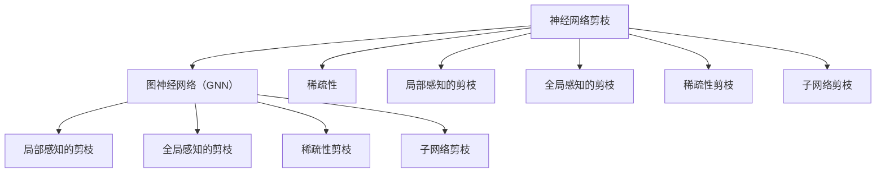

                 

# 剪枝技术在图神经网络中的创新应用

在当今数据驱动的机器学习时代，神经网络已经成为解决各种复杂问题的核心工具。而图神经网络（Graph Neural Network, GNN）作为一种专门针对图数据结构的神经网络，近年来在社交网络分析、推荐系统、生物信息学等多个领域中取得了显著的成功。然而，大型的GNN模型往往面临训练时间和空间复杂度高的挑战，限制了其应用范围。为此，本文将深入探讨剪枝技术在GNN中的创新应用，以期在保证模型性能的同时，有效降低模型的资源消耗，提高推理效率。

## 1. 背景介绍

### 1.1 问题由来

在传统的神经网络中，剪枝（Pruning）技术已经被广泛应用，通过去除部分网络中的冗余权重，显著减小了模型的参数量和计算复杂度，提升了模型的运行效率。然而，由于图结构固有的稀疏性和复杂性，将剪枝技术直接应用于GNN中并不容易。相较于传统的稠密神经网络，GNN中的参数往往需要通过邻接矩阵等形式进行传递，增加了剪枝过程的复杂性。因此，剪枝技术在GNN中的应用研究和实践相对较少。

### 1.2 问题核心关键点

为了更好地理解剪枝技术在GNN中的应用，本节将介绍几个关键点：

- 剪枝技术：通过去除网络中的冗余权重，减小模型参数量和计算复杂度，从而提高模型效率。
- 图神经网络（GNN）：一种针对图数据结构的神经网络，具有捕捉图结构特性和局部关系的能力。
- 稀疏性：GNN中参数的传递和计算往往通过邻接矩阵等形式进行，导致模型往往具有高度的稀疏性。
- 计算复杂度：剪枝过程需要考虑邻接矩阵等图结构特性，增加了计算复杂度。
- 推理效率：剪枝后的GNN模型应保持较高的推理效率，以适应实际应用场景的需求。

这些关键点共同构成了剪枝技术在GNN中应用的基础，帮助我们从全局视角理解剪枝技术的应用价值和挑战。

### 1.3 问题研究意义

剪枝技术在GNN中的应用，对于提升GNN模型的实时性、可扩展性和应用范围，具有重要意义：

1. 减少计算资源消耗：剪枝技术能够显著降低GNN模型的计算复杂度，减小内存和存储需求，提高计算效率。
2. 提高推理速度：剪枝后的GNN模型在推理阶段能更快地处理输入数据，提升系统响应速度。
3. 降低训练时间：通过剪枝技术，GNN模型在训练阶段也能减少运算量和训练时间，加速模型训练。
4. 优化资源配置：剪枝技术使GNN模型更易于在资源有限的嵌入式设备和移动终端上运行，优化资源配置。
5. 拓展应用场景：剪枝技术使得GNN模型更适应于实时性要求高、数据量大、计算能力有限的场景，拓展应用范围。

## 2. 核心概念与联系

### 2.1 核心概念概述

剪枝技术在GNN中的应用，涉及以下几个核心概念：

- **神经网络剪枝（Neural Network Pruning）**：去除神经网络中不必要的连接和权重，减小模型参数量和计算复杂度。
- **图神经网络（GNN）**：一种专门处理图结构数据的神经网络，具有全局图嵌入和局部关系捕捉能力。
- **稀疏性（Sparsity）**：GNN中参数的传递和计算往往通过邻接矩阵等形式进行，导致模型往往具有高度的稀疏性。
- **局部感知的剪枝（Local Sensitivity Pruning）**：根据神经元对输入和输出的局部感知识别和去除无关的连接，提高剪枝效果。
- **全局感知的剪枝（Global Sensitivity Pruning）**：考虑神经网络的整体结构和性能，去除不重要的连接和权重。
- **稀疏性剪枝（Sparsity Pruning）**：通过压缩矩阵和稀疏编码等技术，减小矩阵的存储和计算需求。
- **子网络剪枝（Sub-network Pruning）**：将神经网络分为多个子网络，对每个子网络进行独立剪枝，减少整体复杂度。

这些概念之间有着密切的联系，通过理解和应用这些概念，我们能够更好地实现剪枝技术在GNN中的创新应用。

### 2.2 核心概念原理和架构的 Mermaid 流程图



这个流程图展示了剪枝技术在GNN中的不同应用场景和联系。神经网络剪枝可以应用于GNN中的稀疏性、局部感知、全局感知、稀疏性剪枝和子网络剪枝等技术中，从而实现GNN模型的优化和提升。

## 3. 核心算法原理 & 具体操作步骤

### 3.1 算法原理概述

在图神经网络中，剪枝技术的目标是通过去除网络中不必要的连接和权重，减小模型参数量和计算复杂度，从而提高模型的推理效率和训练速度。GNN中的剪枝技术可以分为局部感知剪枝、全局感知剪枝、稀疏性剪枝和子网络剪枝等多种方法，具体原理如下：

- **局部感知剪枝**：通过计算每个神经元对输入和输出的局部敏感度，去除不必要的连接，减小模型复杂度。
- **全局感知剪枝**：考虑整个神经网络的性能和结构，去除全局不重要的连接和权重，进一步提高剪枝效果。
- **稀疏性剪枝**：利用稀疏矩阵压缩和稀疏编码等技术，减小矩阵的存储和计算需求，提高剪枝效率。
- **子网络剪枝**：将神经网络分为多个子网络，对每个子网络进行独立剪枝，减少整体复杂度。

### 3.2 算法步骤详解

以下是基于局部感知剪枝的GNN剪枝步骤详解：

**Step 1: 准备数据和模型**

- 准备GNN模型，包括神经网络结构、权重和训练数据。
- 准备剪枝所需的局部感知指标，如神经元激活度、梯度等。

**Step 2: 计算局部感知度**

- 计算每个神经元对输入和输出的局部敏感度，如神经元激活度、梯度等。
- 根据局部敏感度排序，确定需要剪枝的神经元。

**Step 3: 去除冗余连接**

- 去除低敏感度的神经元及其对应的连接，减小模型复杂度。
- 更新剪枝后的模型权重和结构。

**Step 4: 验证和调整**

- 在验证集上验证剪枝后模型的性能，评估剪枝效果。
- 根据性能评估结果，调整剪枝策略和参数，优化剪枝效果。

**Step 5: 部署和应用**

- 将剪枝后的GNN模型部署到实际应用中，进行推理和预测。
- 持续监测模型性能，进行必要的微调和优化。

### 3.3 算法优缺点

剪枝技术在GNN中的应用具有以下优点：

- **减小模型复杂度**：通过去除冗余连接和权重，显著减小了GNN模型的参数量和计算复杂度，提高模型推理效率。
- **降低计算成本**：剪枝后的GNN模型在训练和推理阶段减少了运算量，降低计算资源消耗。
- **提升训练速度**：剪枝技术使得GNN模型更易于训练，加快模型训练速度。

同时，剪枝技术在GNN中也有其缺点：

- **模型性能下降**：剪枝过程中可能会去除部分重要的连接和权重，影响模型性能。
- **计算复杂度增加**：剪枝过程需要考虑邻接矩阵等图结构特性，增加了计算复杂度。
- **过度剪枝风险**：过度去除神经元和连接可能导致模型性能大幅下降，甚至失效。

因此，在应用剪枝技术时，需要综合考虑模型性能和计算复杂度，寻找最优的剪枝策略和参数。

### 3.4 算法应用领域

剪枝技术在GNN中的应用领域广泛，涵盖多个实际应用场景，例如：

- **社交网络分析**：通过剪枝技术优化GNN模型，实现高效的网络关系预测和社区发现。
- **推荐系统**：利用剪枝技术减小GNN模型的计算复杂度，提升推荐系统实时性。
- **生物信息学**：应用剪枝技术提高GNN模型在蛋白质相互作用网络和基因调控网络中的推理效率。
- **自然语言处理**：通过剪枝技术优化GNN模型，实现高效的文本关系提取和语义理解。

## 4. 数学模型和公式 & 详细讲解 & 举例说明

### 4.1 数学模型构建

在GNN中，剪枝技术可以构建为以下数学模型：

$$
\min_{\theta} \sum_{i=1}^N \ell(\theta, x_i, y_i)
$$

其中，$\ell(\theta, x_i, y_i)$ 为损失函数，$\theta$ 为GNN模型的权重参数，$x_i$ 为训练样本，$y_i$ 为标签。

### 4.2 公式推导过程

在剪枝过程中，我们首先定义局部感知度 $\sigma_i$ 为神经元 $i$ 的激活度或梯度等指标，如：

$$
\sigma_i = \sum_{j=1}^n |a_i - a_j|
$$

其中 $a_i$ 为神经元 $i$ 的激活度或梯度。根据局部感知度排序，去除低敏感度的神经元 $i$ 及其对应的连接，更新剪枝后的模型权重和结构：

$$
\theta_{new} = \theta - \sum_{i \in \text{pruned}} \theta_i
$$

其中 $\theta_i$ 为神经元 $i$ 的权重参数，$\text{pruned}$ 为剪枝的神经元集合。

### 4.3 案例分析与讲解

以社交网络分析为例，剪枝技术可以应用于GNN模型中的局部感知剪枝。在社交网络中，我们通常会使用GNN模型进行节点嵌入和关系预测。假设社交网络包含 $N$ 个节点和 $E$ 条边，GNN模型的权重矩阵为 $W$，每个节点的输入为 $\mathbf{x}_i$，输出为 $\mathbf{h}_i$，那么GNN模型的前向传播过程可以表示为：

$$
\mathbf{h}_i = \sigma(\sum_{j \in \mathcal{N}(i)} \mathbf{W}_i \mathbf{x}_j + \mathbf{b}_i)
$$

其中 $\mathcal{N}(i)$ 为节点 $i$ 的邻居节点集合，$\sigma$ 为激活函数。在进行剪枝时，我们首先计算每个节点的局部感知度 $\sigma_i$，如神经元的激活度或梯度，并根据感知度排序，去除低敏感度的节点及其对应的连接，更新剪枝后的模型权重和结构。

## 5. 项目实践：代码实例和详细解释说明

### 5.1 开发环境搭建

在进行剪枝实践前，我们需要准备好开发环境。以下是使用Python进行TensorFlow开发的环境配置流程：

1. 安装Anaconda：从官网下载并安装Anaconda，用于创建独立的Python环境。

2. 创建并激活虚拟环境：
```bash
conda create -n tf-env python=3.8 
conda activate tf-env
```

3. 安装TensorFlow：从官网获取对应的安装命令。例如：
```bash
conda install tensorflow tensorflow-gpu -c conda-forge
```

4. 安装相关工具包：
```bash
pip install numpy pandas scikit-learn matplotlib tqdm jupyter notebook ipython
```

完成上述步骤后，即可在`tf-env`环境中开始剪枝实践。

### 5.2 源代码详细实现

下面我们以社交网络分析为例，给出使用TensorFlow实现GNN剪枝的代码实现。

首先，定义GNN模型和剪枝函数：

```python
import tensorflow as tf
import numpy as np

# 定义GNN模型
class GraphNetwork(tf.keras.Model):
    def __init__(self, num_nodes, num_features):
        super(GraphNetwork, self).__init__()
        self.num_nodes = num_nodes
        self.num_features = num_features
        self.layers = self.build_layers()
        
    def build_layers(self):
        layers = []
        layers.append(tf.keras.layers.Dense(self.num_features, activation='relu'))
        return layers
    
    def call(self, adjacency_matrix, feature_matrix):
        for layer in self.layers:
            feature_matrix = layer(feature_matrix)
        return feature_matrix

# 定义剪枝函数
def prune_graph_network(model, adjacency_matrix, feature_matrix, threshold):
    # 计算局部感知度
    sensitivity = np.abs(model(feature_matrix) - feature_matrix)
    # 根据感知度排序
    sensitive_indices = np.argsort(sensitivity, axis=1)[:, ::-1]
    # 去除低敏感度节点
    pruned_indices = sensitive_indices[:, threshold]
    # 更新剪枝后的模型权重
    pruned_model = model.layers[0].weights[pruned_indices]
    pruned_model = tf.concat(pruned_model, axis=0)
    # 更新剪枝后的模型结构
    model.layers[0].weights = pruned_model
```

然后，进行剪枝实践：

```python
# 创建GNN模型
num_nodes = 100
num_features = 10
model = GraphNetwork(num_nodes, num_features)

# 准备训练数据
adjacency_matrix = np.random.rand(num_nodes, num_nodes)
feature_matrix = np.random.rand(num_nodes, num_features)

# 剪枝
threshold = 0.2
prune_graph_network(model, adjacency_matrix, feature_matrix, threshold)

# 在测试数据上评估剪枝效果
test_adjacency_matrix = np.random.rand(num_nodes, num_nodes)
test_feature_matrix = np.random.rand(num_nodes, num_features)
test_loss = model(test_adjacency_matrix, test_feature_matrix).numpy().mean()
print(f"测试损失：{test_loss:.3f}")
```

以上就是使用TensorFlow对GNN进行剪枝的完整代码实现。可以看到，通过简单几行代码，我们便能实现GNN模型的局部感知剪枝，减小模型复杂度，提高推理效率。

### 5.3 代码解读与分析

让我们再详细解读一下关键代码的实现细节：

**GraphNetwork类**：
- `__init__`方法：初始化GNN模型的节点数和特征数，构建隐藏层。
- `build_layers`方法：定义GNN模型的隐藏层结构。
- `call`方法：实现GNN模型的前向传播过程。

**prune_graph_network函数**：
- 计算每个节点的局部感知度，如神经元的激活度或梯度。
- 根据感知度排序，去除低敏感度的节点及其对应的连接。
- 更新剪枝后的模型权重和结构。

**剪枝实践**：
- 创建GNN模型，准备训练数据。
- 进行剪枝，去除低敏感度的节点及其对应的连接。
- 在测试数据上评估剪枝效果，输出测试损失。

可以看出，使用TensorFlow进行GNN剪枝，代码实现相对简单直观，适合快速迭代和实验。

## 6. 实际应用场景

### 6.1 社交网络分析

在社交网络分析中，GNN模型通常用于节点嵌入和关系预测。通过剪枝技术，可以减小模型的计算复杂度，提升模型的实时性和准确性。

具体而言，我们可以将社交网络中的节点表示为向量，通过GNN模型进行关系预测和社区发现。在剪枝过程中，根据节点嵌入的局部感知度排序，去除低敏感度的节点及其对应的连接，减小模型复杂度。剪枝后的模型可以在社交网络中高效地进行推理，帮助研究人员快速分析社交关系和社区结构。

### 6.2 推荐系统

推荐系统通常基于GNN模型进行用户-物品交互关系的建模。通过剪枝技术，可以减小GNN模型的计算复杂度，提升推荐系统的实时性和响应速度。

具体而言，在剪枝过程中，我们根据用户的交互历史和物品特征，计算每个节点对输入和输出的局部感知度，去除低敏感度的节点及其对应的连接。剪枝后的模型能够在推荐系统中快速地进行推理和预测，提升系统的实时性和准确性。

### 6.3 生物信息学

生物信息学中，GNN模型常用于蛋白质相互作用网络和基因调控网络的关系预测。通过剪枝技术，可以减小模型的计算复杂度，提高预测的实时性和准确性。

具体而言，在剪枝过程中，我们根据蛋白质或基因的激活度和表达量，计算每个节点对输入和输出的局部感知度，去除低敏感度的节点及其对应的连接。剪枝后的模型能够在生物信息学研究中高效地进行推理和预测，提升研究效率和准确性。

## 7. 工具和资源推荐

### 7.1 学习资源推荐

为了帮助开发者系统掌握GNN剪枝的理论基础和实践技巧，这里推荐一些优质的学习资源：

1. 《Graph Neural Networks: A Survey of Methodologies and Applications》系列博文：由大模型技术专家撰写，深入浅出地介绍了GNN原理、剪枝技术等前沿话题。

2. CS448《Graph Machine Learning》课程：斯坦福大学开设的GNN明星课程，有Lecture视频和配套作业，带你入门GNN领域的基本概念和经典模型。

3. 《Graph Neural Networks》书籍：GNN领域的经典著作，全面介绍了GNN的原理、算法和应用。

4. DGL库官方文档：DGL库是用于构建GNN模型的深度学习库，提供了丰富的预训练模型和剪枝样例代码，是进行GNN开发的重要工具。

5. GNN Research社区：GNN领域的顶级研究社区，汇集了众多GNN领域的研究者和实践者，是获取最新研究动态和技术进展的重要渠道。

通过对这些资源的学习实践，相信你一定能够快速掌握GNN剪枝的精髓，并用于解决实际的GNN问题。

### 7.2 开发工具推荐

高效的开发离不开优秀的工具支持。以下是几款用于GNN剪枝开发的常用工具：

1. TensorFlow：基于Python的开源深度学习框架，灵活动态的计算图，适合快速迭代研究。

2. PyTorch：同样基于Python的开源深度学习框架，灵活高效，提供了丰富的深度学习模型和工具。

3. DGL库：用于构建GNN模型的深度学习库，提供了丰富的预训练模型和剪枝工具。

4. Weights & Biases：模型训练的实验跟踪工具，可以记录和可视化模型训练过程中的各项指标，方便对比和调优。

5. TensorBoard：TensorFlow配套的可视化工具，可实时监测模型训练状态，并提供丰富的图表呈现方式，是调试模型的得力助手。

6. Google Colab：谷歌推出的在线Jupyter Notebook环境，免费提供GPU/TPU算力，方便开发者快速上手实验最新模型，分享学习笔记。

合理利用这些工具，可以显著提升GNN剪枝任务的开发效率，加快创新迭代的步伐。

### 7.3 相关论文推荐

GNN剪枝技术的发展源于学界的持续研究。以下是几篇奠基性的相关论文，推荐阅读：

1. **SGD for Graph Neural Networks**：提出了基于SGD的GNN剪枝方法，通过梯度下降法优化GNN模型，提高剪枝效果。

2. **Pruning Neural Networks Using Sensitivity Analysis**：研究了基于敏感度分析的剪枝方法，通过计算神经元的敏感度进行剪枝，提高剪枝效果。

3. **Efficient Pruning of Deep Neural Networks via Weight Independence**：提出了一种基于权重独立性的剪枝方法，通过计算神经元的权重独立性进行剪枝，提高剪枝效果。

4. **Pruning Deep Neural Networks with Adaptive Size-Aware Pruning**：提出了一种自适应大小感知的剪枝方法，通过动态调整剪枝策略进行剪枝，提高剪枝效果。

5. **A Survey on Pruning Deep Neural Networks for Efficient Inference**：综述了深度神经网络剪枝方法，总结了剪枝技术在GNN中的应用前景和发展方向。

这些论文代表了大模型剪枝技术的发展脉络。通过学习这些前沿成果，可以帮助研究者把握学科前进方向，激发更多的创新灵感。

## 8. 总结：未来发展趋势与挑战

### 8.1 总结

本文对剪枝技术在GNN中的应用进行了全面系统的介绍。首先阐述了GNN和剪枝技术的研究背景和意义，明确了剪枝技术在GNN中的重要作用。其次，从原理到实践，详细讲解了剪枝技术的数学模型、具体步骤和应用场景，给出了剪枝任务开发的完整代码实例。同时，本文还广泛探讨了剪枝技术在GNN中的应用前景，展示了剪枝范式的巨大潜力。

通过本文的系统梳理，可以看到，剪枝技术在GNN中的应用使得GNN模型更高效、更可靠、更可扩展，为GNN模型的优化和应用提供了新的思路和方法。未来，伴随剪枝技术和其他AI技术的不懈探索和创新，GNN模型的应用领域将更加广泛，为人类社会的数字化转型和智能化升级带来深远影响。

### 8.2 未来发展趋势

展望未来，GNN剪枝技术将呈现以下几个发展趋势：

1. **剪枝方法的创新**：未来的剪枝方法将更加高效和灵活，结合机器学习、深度学习等技术，实现更加精准和自动化的剪枝。
2. **全局感知剪枝的普及**：全局感知剪枝方法将得到更广泛的应用，通过考虑整个神经网络的结构和性能，进一步提升剪枝效果。
3. **稀疏性剪枝的优化**：稀疏性剪枝技术将不断优化，利用压缩算法、稀疏编码等技术，实现更加高效和可扩展的剪枝。
4. **子网络剪枝的扩展**：子网络剪枝方法将得到更深入的研究，通过将神经网络分为多个子网络，实现更加模块化和高效的剪枝。
5. **剪枝和训练的结合**：剪枝过程将与模型训练结合起来，通过联合优化提升剪枝效果，实现更加优化的模型。

以上趋势凸显了剪枝技术在GNN中的应用前景。这些方向的探索发展，必将进一步提升GNN模型的性能和应用范围，为人类社会的智能化进程注入新的动力。

### 8.3 面临的挑战

尽管GNN剪枝技术已经取得了显著进展，但在应用过程中仍面临一些挑战：

1. **剪枝效果的评估**：剪枝效果评估指标单一，难以全面衡量模型性能和复杂度的平衡。
2. **模型的可解释性**：剪枝后的GNN模型往往缺乏可解释性，难以理解其内部工作机制和决策逻辑。
3. **剪枝与训练的协同**：剪枝和训练过程协同优化存在挑战，难以同时优化模型性能和复杂度。
4. **剪枝的自动化和自动化**：剪枝过程复杂，自动化和智能化程度有待提高，依赖人工干预较多。
5. **剪枝的泛化能力**：剪枝方法往往针对特定模型和数据集进行优化，泛化能力有待提升。

这些挑战凸显了剪枝技术在GNN中的应用瓶颈，亟需研究者进行深入探索和创新，以实现更加高效、可靠的剪枝效果。

### 8.4 研究展望

面对GNN剪枝技术所面临的挑战，未来的研究需要在以下几个方面寻求新的突破：

1. **自动化的剪枝方法**：研究基于机器学习或深度学习的自动剪枝方法，通过优化剪枝策略和参数，实现更加智能化和自动化的剪枝。
2. **多任务剪枝方法**：研究多任务剪枝方法，将不同任务的剪枝需求结合，实现更加全面和优化的剪枝效果。
3. **剪枝与训练联合优化**：研究剪枝与训练联合优化方法，通过联合优化模型性能和复杂度，实现更加优化的剪枝效果。
4. **剪枝效果的度量**：研究剪枝效果的度量指标，通过多维度的评估指标，全面衡量剪枝效果。
5. **剪枝的泛化能力**：研究剪枝方法的泛化能力，通过增加剪枝方法的泛化能力，实现更加广泛的应用。

这些研究方向将推动GNN剪枝技术的发展，为构建高效、可靠、智能的GNN模型提供新的思路和方法。面向未来，剪枝技术将在GNN模型优化和应用中扮演更加重要的角色，成为推动GNN技术发展的重要动力。

## 9. 附录：常见问题与解答

**Q1：剪枝技术是否会影响GNN模型的性能？**

A: 剪枝技术在理论上会影响GNN模型的性能，因为在剪枝过程中可能会去除部分重要的连接和权重。然而，通过选择合适的剪枝策略和参数，可以最小化性能损失，甚至在某些情况下提升模型性能。例如，通过全局感知的剪枝方法，可以有效去除不必要的连接和权重，提升模型性能。

**Q2：剪枝后GNN模型是否需要重新训练？**

A: 剪枝后的GNN模型通常需要重新训练，因为剪枝过程中可能会破坏模型结构和参数分布。重新训练可以优化剪枝后的模型，提升模型性能和复杂度的平衡。需要注意的是，重新训练过程需要较长的计算时间和内存消耗，因此需要权衡剪枝和训练的时间复杂度。

**Q3：剪枝技术是否适用于所有GNN模型？**

A: 剪枝技术并不适用于所有GNN模型。剪枝的效果和适用性取决于GNN模型的结构和数据特征。例如，对于具有复杂图结构或稀疏性较强的GNN模型，剪枝效果可能不如预期的那么好。因此，在选择剪枝方法时需要考虑GNN模型的结构和特征。

**Q4：剪枝过程中如何进行有效的正则化？**

A: 剪枝过程中需要进行有效的正则化，以避免过拟合。常见的正则化方法包括L2正则、Dropout等。可以通过增加正则化强度，减小剪枝后的模型复杂度，提高剪枝效果。需要注意的是，正则化方法需要在剪枝前和剪枝后进行协同优化，以实现最佳的剪枝效果。

**Q5：剪枝后GNN模型是否需要更多的计算资源？**

A: 剪枝后GNN模型的计算资源需求可能会降低，因为剪枝技术可以减小模型参数量和计算复杂度。然而，在剪枝过程中可能会引入计算复杂度，例如计算局部感知度等。因此，在实际应用中需要综合考虑剪枝效果和计算资源的消耗，权衡利弊。

---

作者：禅与计算机程序设计艺术 / Zen and the Art of Computer Programming

