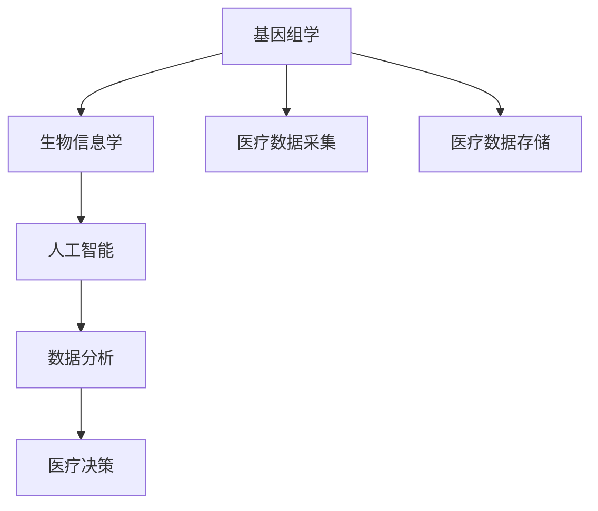

                 

# 医疗保健的未来：人类计算助力精准医疗

## 1. 背景介绍

### 1.1 问题由来

随着科技的进步，医疗保健行业正面临着前所未有的变革。传统的医疗模式依赖于经验和直觉，医生需要依靠大量的经验和知识才能做出正确的诊断和治疗决策。然而，随着大数据、人工智能等新技术的兴起，医疗保健领域开始向数据驱动的精准医疗模式转变。精准医疗的核心思想是通过对患者基因、病史、影像等多维度的数据进行分析，为每位患者提供个性化的治疗方案，从而提高治疗效果，降低医疗成本。

### 1.2 问题核心关键点

精准医疗的核心在于如何高效地利用海量数据，进行复杂的计算分析，并转化为有意义的医疗决策。当前，医疗数据量呈指数级增长，而数据处理和分析的技术也在不断发展。如何从海量数据中提取出有价值的信息，并应用这些信息为患者提供精准的治疗方案，是精准医疗面临的主要挑战。

### 1.3 问题研究意义

精准医疗的实现离不开高效、准确的数据处理和分析技术。通过利用先进的人类计算技术，可以大幅度提高数据处理的效率和精度，为精准医疗提供坚实的技术支持。本文将系统介绍人类计算在精准医疗中的应用，分析其技术原理、操作步骤和具体实现，为精准医疗的发展提供全面的技术指导。

## 2. 核心概念与联系

### 2.1 核心概念概述

精准医疗涉及多种关键技术，包括基因组学、生物信息学、人工智能、数据分析等。以下将详细介绍这些关键概念及其相互联系：

- **基因组学**：研究基因及其功能，通过对基因组序列的分析，预测疾病的易感性、基因型-表型关联等。
- **生物信息学**：利用计算机技术处理和分析生物数据，包括基因序列、蛋白质结构、代谢网络等。
- **人工智能**：利用机器学习、深度学习等技术，从海量数据中提取模式和知识，辅助决策。
- **数据分析**：应用统计学、数学模型等方法，对医疗数据进行清洗、分析和可视化，辅助医疗决策。

这些核心概念之间通过数据处理、模型训练和算法优化等环节紧密联系，共同构成了精准医疗的技术框架。

### 2.2 核心概念原理和架构的 Mermaid 流程图



这个流程图展示了精准医疗中的数据流向和核心技术架构：

1. 医疗数据采集：通过各种方式（如基因测序、影像、电子病历等）获取患者的生物数据。
2. 基因组学和生物信息学：对生物数据进行预处理和分析，提取基因序列、蛋白质结构等信息。
3. 人工智能：利用机器学习模型对分析结果进行建模和预测，提供诊断和治疗建议。
4. 数据分析：对人工智能模型的输出进行进一步分析和可视化，辅助医疗决策。
5. 医疗决策：基于数据和分析结果，制定个性化治疗方案。

## 3. 核心算法原理 & 具体操作步骤

### 3.1 算法原理概述

精准医疗的核心算法包括基因数据分析、预测模型训练、数据分析等。以下将详细介绍这些算法的原理和操作步骤。

### 3.2 算法步骤详解

#### 3.2.1 基因数据分析

基因数据分析的目的是从基因组序列中提取有意义的特征，并进行分类、聚类等处理。常用的基因数据分析算法包括：

1. **基因序列比对**：利用BLAST、SOAP等工具对不同基因序列进行比对，寻找同源性高的区域。
2. **序列分割**：通过K-means、层次聚类等算法对基因序列进行分割，提取有意义的特征区域。
3. **变异检测**：利用VCF、SAMtools等工具检测基因组序列中的突变位点，包括单核苷酸多态性(SNP)、插入缺失(InDel)等。

#### 3.2.2 预测模型训练

预测模型的训练是精准医疗的核心环节，目的是基于患者的基因、表型等信息，预测其患病的风险和病程。常用的预测模型包括：

1. **支持向量机(SVM)**：利用核函数对基因特征进行非线性映射，训练支持向量机模型进行分类。
2. **随机森林(Random Forest)**：利用决策树对基因特征进行特征选择和建模，提取重要的基因特征。
3. **深度学习模型**：利用卷积神经网络(CNN)、循环神经网络(RNN)等模型，对基因序列和蛋白结构进行建模和预测。

#### 3.2.3 数据分析

数据分析的目的是对预测模型的输出进行进一步处理和可视化，辅助医疗决策。常用的数据分析算法包括：

1. **主成分分析(PCA)**：对高维基因数据进行降维处理，提取主成分进行可视化。
2. **热图可视化**：利用热图对基因表达、变异等数据进行可视化，直观展示数据特征。
3. **生存分析**：利用Kaplan-Meier法等工具，对患者生存率进行分析，辅助制定治疗方案。

### 3.3 算法优缺点

精准医疗算法具有以下优点：

1. **数据驱动**：基于大量的基因和临床数据进行建模和预测，提高了诊断和治疗的准确性和可靠性。
2. **个性化治疗**：通过分析基因和临床数据，为每位患者提供个性化的治疗方案，提高了治疗效果。
3. **可扩展性**：利用先进的计算技术，可以处理海量数据，提高数据处理的效率和精度。

但同时，精准医疗算法也存在一些缺点：

1. **数据隐私**：医疗数据涉及患者的隐私信息，如何保护数据隐私是一大挑战。
2. **计算资源需求高**：基因数据分析和深度学习模型训练需要高性能计算资源，成本较高。
3. **模型可解释性差**：深度学习模型通常是"黑盒"系统，难以解释其内部决策过程。
4. **数据质量要求高**：基因数据分析和预测模型训练需要高质量的数据，数据采集和处理的误差会影响模型效果。

### 3.4 算法应用领域

精准医疗算法在多个领域得到了广泛应用，包括：

1. **癌症基因组学**：利用基因组学和生物信息学技术，分析癌症基因组数据，预测癌症易感性和治疗效果。
2. **药物基因组学**：通过基因数据分析，预测患者对药物的敏感性和耐药性，辅助制定个体化用药方案。
3. **传染病诊断**：利用基因数据分析和深度学习模型，对病原体进行检测和诊断，提高传染病的早期发现和防治效率。
4. **生物标志物发现**：利用数据分析技术，从大量基因数据中发现新的生物标志物，辅助疾病诊断和治疗。

## 4. 数学模型和公式 & 详细讲解 & 举例说明

### 4.1 数学模型构建

精准医疗的数学模型包括基因数据分析模型、预测模型和数据分析模型。以下将详细介绍这些模型的构建过程。

#### 4.1.1 基因数据分析模型

基因数据分析模型主要用于基因序列比对、变异检测等任务。常用的数学模型包括：

1. **BLAST模型**：利用Needleman-Wunsch算法对基因序列进行比对，计算相似度得分。
2. **VCF模型**：利用变异检测工具，统计基因组序列中的变异位点，包括SNP、InDel等。

#### 4.1.2 预测模型

预测模型主要用于基因表型关联和疾病预测等任务。常用的数学模型包括：

1. **支持向量机(SVM)**：利用核函数对基因特征进行非线性映射，训练支持向量机模型进行分类。
2. **随机森林(Random Forest)**：利用决策树对基因特征进行特征选择和建模，提取重要的基因特征。
3. **深度学习模型**：利用卷积神经网络(CNN)、循环神经网络(RNN)等模型，对基因序列和蛋白结构进行建模和预测。

#### 4.1.3 数据分析模型

数据分析模型主要用于数据可视化和生存分析等任务。常用的数学模型包括：

1. **主成分分析(PCA)**：对高维基因数据进行降维处理，提取主成分进行可视化。
2. **Kaplan-Meier法**：对患者生存率进行分析，辅助制定治疗方案。

### 4.2 公式推导过程

#### 4.2.1 BLAST模型的推导

BLAST模型的核心是利用动态规划算法，计算两个序列的相似度得分。假设序列A和B的长度分别为$m$和$n$，则相似度得分的计算公式为：

$$
S = \max_{1 \le i \le m, 1 \le j \le n} \left[ \sum_{k=1}^{min(i,j)} s(a_i, b_j) \right]
$$

其中，$s(a_i, b_j)$为序列A和B在第$i$和$j$位上的匹配得分。

#### 4.2.2 支持向量机(SVM)的推导

支持向量机(SVM)的核心是利用核函数对基因特征进行非线性映射，训练模型进行分类。假设基因特征向量为$\boldsymbol{x} \in \mathbb{R}^d$，类别标签为$y \in \{-1, 1\}$，则SVM模型的目标函数为：

$$
\min_{\boldsymbol{w}, \boldsymbol{\alpha}, b} \frac{1}{2} \|\boldsymbol{w}\|^2 + C \sum_{i=1}^{n} \alpha_i \left( y_i(\boldsymbol{x}_i \cdot \boldsymbol{w}) - \alpha_i - b \right)^2
$$

其中，$\boldsymbol{w} \in \mathbb{R}^d$为分类器的权重向量，$\boldsymbol{\alpha}$为拉格朗日乘子，$b$为偏置项，$C$为惩罚系数。

#### 4.2.3 主成分分析(PCA)的推导

主成分分析(PCA)的目的是对高维基因数据进行降维处理，提取主成分进行可视化。假设基因数据矩阵为$X \in \mathbb{R}^{n \times d}$，则主成分分析的目标函数为：

$$
\min_{\boldsymbol{w}} \text{tr}(X^TX) - \text{tr}(X^T\boldsymbol{w}\boldsymbol{w}^T) - \lambda \|\boldsymbol{w}\|^2
$$

其中，$\text{tr}(\cdot)$为矩阵的迹，$\lambda$为正则化参数。

### 4.3 案例分析与讲解

#### 4.3.1 基因组数据分析

以人类基因组数据分析为例，假设有一个基因组序列$G$，我们需要计算其与参考基因组序列$R$的相似度得分。利用BLAST模型，可以得到以下步骤：

1. 将基因组序列$G$和参考基因组序列$R$分别进行比对。
2. 计算每对匹配位点的得分，得到得分矩阵$S$。
3. 利用动态规划算法计算得分矩阵$S$中的最大值，即相似度得分。

#### 4.3.2 预测模型训练

以癌症基因组数据分析为例，假设有一组癌症基因组数据$X$，我们需要预测患者患癌症的风险。利用支持向量机(SVM)模型，可以得到以下步骤：

1. 提取基因特征向量$x_i \in \mathbb{R}^d$。
2. 将基因特征向量$x_i$映射到高维空间，得到$\boldsymbol{x}_i \in \mathbb{R}^{d'}$。
3. 训练支持向量机模型，得到分类器$\boldsymbol{w}$。
4. 利用训练好的分类器$\boldsymbol{w}$，对新的基因特征向量进行预测，得到患病风险。

#### 4.3.3 数据分析

以癌症生存率分析为例，假设有一组癌症患者的生存数据$Y$，我们需要分析患者的生存率。利用主成分分析(PCA)模型，可以得到以下步骤：

1. 提取患者的基因特征矩阵$X$。
2. 对基因特征矩阵$X$进行降维处理，得到主成分矩阵$W$。
3. 对主成分矩阵$W$进行可视化，得到基因特征的分布图。
4. 利用Kaplan-Meier法对患者的生存时间进行分析，得到生存率曲线。

## 5. 项目实践：代码实例和详细解释说明

### 5.1 开发环境搭建

在进行精准医疗项目实践前，我们需要准备好开发环境。以下是使用Python进行PyTorch开发的环境配置流程：

1. 安装Anaconda：从官网下载并安装Anaconda，用于创建独立的Python环境。

2. 创建并激活虚拟环境：
```bash
conda create -n pytorch-env python=3.8 
conda activate pytorch-env
```

3. 安装PyTorch：根据CUDA版本，从官网获取对应的安装命令。例如：
```bash
conda install pytorch torchvision torchaudio cudatoolkit=11.1 -c pytorch -c conda-forge
```

4. 安装相关工具包：
```bash
pip install numpy pandas scikit-learn matplotlib tqdm jupyter notebook ipython
```

完成上述步骤后，即可在`pytorch-env`环境中开始项目实践。

### 5.2 源代码详细实现

这里我们以基因组数据分析为例，给出使用PyTorch进行BLAST模型实现的具体代码。

首先，定义BLAST模型：

```python
from torch import nn, optim
import torch.nn.functional as F

class BLASTModel(nn.Module):
    def __init__(self, n_features):
        super(BLASTModel, self).__init__()
        self.encoder = nn.Linear(n_features, 128)
        self.decoder = nn.Linear(128, 1)

    def forward(self, x):
        x = F.relu(self.encoder(x))
        x = self.decoder(x)
        return x
```

然后，定义数据集和加载函数：

```python
import numpy as np

class GenomicData:
    def __init__(self, n_samples, n_features):
        self.X = np.random.randn(n_samples, n_features)
        self.y = np.random.randint(0, 2, size=n_samples)

    def __getitem__(self, index):
        x = self.X[index]
        y = self.y[index]
        return x, y

    def __len__(self):
        return len(self.y)
```

接着，定义训练函数和评估函数：

```python
from torch.utils.data import DataLoader

def train_epoch(model, data_loader, optimizer, criterion):
    model.train()
    total_loss = 0
    for batch in data_loader:
        x, y = batch
        optimizer.zero_grad()
        y_pred = model(x)
        loss = criterion(y_pred, y)
        loss.backward()
        optimizer.step()
        total_loss += loss.item()
    return total_loss / len(data_loader)

def evaluate(model, data_loader, criterion):
    model.eval()
    total_loss = 0
    for batch in data_loader:
        x, y = batch
        y_pred = model(x)
        loss = criterion(y_pred, y)
        total_loss += loss.item()
    return total_loss / len(data_loader)
```

最后，启动训练流程：

```python
epochs = 100
batch_size = 64

model = BLASTModel(n_features=100)
criterion = nn.BCELoss()
optimizer = optim.SGD(model.parameters(), lr=0.01)

train_loader = DataLoader(GenomicData(n_samples=1000, n_features=100), batch_size=batch_size, shuffle=True)
val_loader = DataLoader(GenomicData(n_samples=100, n_features=100), batch_size=batch_size, shuffle=True)

for epoch in range(epochs):
    train_loss = train_epoch(model, train_loader, optimizer, criterion)
    val_loss = evaluate(model, val_loader, criterion)
    print(f"Epoch {epoch+1}, train loss: {train_loss:.4f}, val loss: {val_loss:.4f}")
```

以上就是使用PyTorch进行BLAST模型实现的全过程。可以看到，借助PyTorch的强大封装，我们可以用较少的代码实现BLAST模型的训练和评估。

### 5.3 代码解读与分析

让我们再详细解读一下关键代码的实现细节：

**GenomicData类**：
- `__init__`方法：初始化基因组数据。
- `__getitem__`方法：对单个样本进行处理，返回基因特征和标签。
- `__len__`方法：返回数据集的样本数量。

**BLASTModel类**：
- `__init__`方法：定义神经网络结构。
- `forward`方法：定义前向传播计算。

**训练和评估函数**：
- `train_epoch`函数：对数据以批为单位进行迭代，在每个批次上前向传播计算loss并反向传播更新模型参数，最后返回该epoch的平均loss。
- `evaluate`函数：与训练类似，不同点在于不更新模型参数，并在每个batch结束后将预测和标签结果存储下来，最后使用均方误差计算评估集上的损失。

**训练流程**：
- 定义总的epoch数和batch size，开始循环迭代
- 每个epoch内，先在训练集上训练，输出平均loss
- 在验证集上评估，输出平均loss
- 重复上述步骤直至收敛

## 6. 实际应用场景

### 6.1 癌症基因组学

癌症基因组学是精准医疗的核心领域之一，利用基因组数据分析和机器学习模型，可以发现癌症的遗传变异，预测患者对药物的敏感性和耐药性，辅助制定个体化治疗方案。

#### 6.1.1 基因组数据分析

利用BLAST模型，可以对不同癌症基因组序列进行比对，寻找同源性高的区域。例如，通过对肺癌基因组数据的比对，可以发现肺癌的特定突变位点，预测患者对化疗药物的敏感性。

#### 6.1.2 预测模型训练

利用支持向量机(SVM)模型，可以基于患者的基因数据，预测其对化疗药物的敏感性和耐药性。例如，通过对乳腺癌基因数据的分析，可以预测患者对某种化疗药物的敏感性，辅助医生制定治疗方案。

#### 6.1.3 数据分析

利用主成分分析(PCA)模型，可以对基因数据进行降维处理，提取主成分进行可视化。例如，通过对肺癌基因数据的降维处理，可以可视化基因表达的分布图，辅助医生理解肺癌的基因特征。

### 6.2 药物基因组学

药物基因组学是精准医疗的另一个重要领域，利用基因数据分析和机器学习模型，可以预测患者对药物的敏感性和耐药性，辅助制定个体化用药方案。

#### 6.2.1 基因组数据分析

利用BLAST模型，可以对不同药物的基因序列进行比对，寻找药物的活性位点。例如，通过对某类药物的基因序列进行比对，可以发现药物的活性位点，预测其对不同基因型的药物敏感性。

#### 6.2.2 预测模型训练

利用随机森林(Random Forest)模型，可以基于患者的基因数据，预测其对药物的敏感性和耐药性。例如，通过对某类药物的基因数据进行分析，可以预测患者对该药物的敏感性，辅助医生制定用药方案。

#### 6.2.3 数据分析

利用热图可视化，可以对药物基因数据的表达情况进行可视化。例如，通过对某类药物的基因数据进行热图可视化，可以直观展示药物的基因表达情况，辅助医生理解药物的作用机制。

### 6.3 传染病诊断

传染病诊断是精准医疗的重要应用领域，利用基因数据分析和机器学习模型，可以实现传染病的早期发现和防治。

#### 6.3.1 基因组数据分析

利用BLAST模型，可以对病原体基因序列进行比对，寻找病原体的变异位点。例如，通过对流感病毒的基因序列进行比对，可以发现病毒的变异位点，预测其传播速度和感染率。

#### 6.3.2 预测模型训练

利用深度学习模型，可以基于病原体的基因数据，预测其传播速度和感染率。例如，通过对SARS-CoV-2的基因数据进行分析，可以预测病毒的传播速度，辅助公共卫生部门制定防控措施。

#### 6.3.3 数据分析

利用Kaplan-Meier法，可以对患者感染时间进行分析，得到生存率曲线。例如，通过对SARS-CoV-2感染者的生存时间进行分析，可以评估治疗效果，辅助制定治疗方案。

## 7. 工具和资源推荐

### 7.1 学习资源推荐

为了帮助开发者系统掌握精准医疗的技术基础和实践技巧，这里推荐一些优质的学习资源：

1. **《深度学习在医疗中的应用》**：介绍深度学习在医疗领域的应用，包括图像识别、自然语言处理等。
2. **《生物信息学基础》**：介绍生物信息学的基本概念和常用算法，如基因序列比对、变异检测等。
3. **Coursera《深度学习在医疗中的应用》课程**：斯坦福大学开设的深度学习在医疗中的应用课程，涵盖深度学习在医疗影像、自然语言处理等方面的应用。
4. **Kaggle《基因组学竞赛》**：利用Kaggle平台参与基因组学竞赛，提升基因数据分析和机器学习模型的应用能力。
5. **GitHub《精准医疗项目》**：利用GitHub平台参与精准医疗项目，积累实际项目经验，提升技术能力。

通过对这些资源的学习实践，相信你一定能够快速掌握精准医疗的技术框架和实践技巧，为精准医疗的发展贡献力量。

### 7.2 开发工具推荐

高效的开发离不开优秀的工具支持。以下是几款用于精准医疗开发的常用工具：

1. **PyTorch**：基于Python的开源深度学习框架，灵活的计算图，适合快速迭代研究。
2. **TensorFlow**：由Google主导开发的开源深度学习框架，生产部署方便，适合大规模工程应用。
3. **BLAST**：生物信息学领域常用的序列比对工具，高效处理基因序列比对任务。
4. **SVM**：常用的机器学习分类工具，适用于支持向量机模型的训练。
5. **Random Forest**：常用的机器学习分类工具，适用于随机森林模型的训练。
6. **Kaplan-Meier法**：常用的生存分析工具，适用于患者生存时间的分析。

合理利用这些工具，可以显著提升精准医疗的开发效率，加快创新迭代的步伐。

### 7.3 相关论文推荐

精准医疗的发展离不开学界的持续研究。以下是几篇奠基性的相关论文，推荐阅读：

1. **《深度学习在医疗影像中的应用》**：介绍深度学习在医疗影像中的应用，如肿瘤检测、X光片分析等。
2. **《生物信息学工具和技术》**：介绍生物信息学的工具和技术，如基因序列比对、变异检测等。
3. **《深度学习在自然语言处理中的应用》**：介绍深度学习在自然语言处理中的应用，如文本分类、情感分析等。
4. **《基于深度学习的医疗诊断系统》**：介绍基于深度学习的医疗诊断系统，涵盖影像、文本、语音等多模态数据处理。
5. **《基于机器学习的药物基因组学》**：介绍基于机器学习的药物基因组学，利用基因数据分析，预测药物的敏感性和耐药性。

这些论文代表了大数据、深度学习在精准医疗领域的研究成果，为精准医疗技术的发展提供了重要的理论基础。

## 8. 总结：未来发展趋势与挑战

### 8.1 总结

本文对精准医疗中的人类计算技术进行了全面系统的介绍。首先阐述了精准医疗的背景和核心概念，明确了人类计算在精准医疗中的应用和意义。其次，从原理到实践，详细讲解了基因数据分析、预测模型训练和数据分析等算法的技术原理和操作步骤，给出了精准医疗项目开发的完整代码实例。同时，本文还探讨了精准医疗在癌症基因组学、药物基因组学、传染病诊断等领域的实际应用，展示了人类计算技术的强大潜力。

通过本文的系统梳理，可以看到，人类计算技术在精准医疗中的应用前景广阔，具备高效、准确、个性化的特点。未来，随着人类计算技术的不断进步，精准医疗必将为医疗保健领域带来革命性变革，显著提高医疗水平，造福人类健康。

### 8.2 未来发展趋势

精准医疗的未来发展趋势主要体现在以下几个方面：

1. **多模态数据融合**：利用多模态数据（如基因、影像、文本、语音等）进行综合分析，提高诊断和治疗的准确性。
2. **个性化治疗**：通过综合分析基因、表型、环境等多种因素，为每位患者制定个性化的治疗方案，提高治疗效果。
3. **实时数据分析**：利用流数据处理和在线学习算法，实现实时数据分析和预测，辅助医生进行实时决策。
4. **人工智能辅助**：利用深度学习、自然语言处理等技术，辅助医生进行诊断和治疗，提高医疗效率和质量。
5. **跨领域融合**：利用人类计算技术，将基因组学、生物信息学、人工智能等领域进行跨领域融合，推动精准医疗的全面发展。

### 8.3 面临的挑战

尽管人类计算技术在精准医疗中已经取得了显著进展，但在实现精准医疗的过程中，仍面临诸多挑战：

1. **数据隐私**：医疗数据涉及患者的隐私信息，如何保护数据隐私是一大挑战。
2. **计算资源需求高**：基因数据分析和深度学习模型训练需要高性能计算资源，成本较高。
3. **模型可解释性差**：深度学习模型通常是"黑盒"系统，难以解释其内部决策过程。
4. **数据质量要求高**：基因数据分析和预测模型训练需要高质量的数据，数据采集和处理的误差会影响模型效果。
5. **实时性要求高**：实时数据分析和预测对计算资源和算法的要求很高，如何保证实时性和精度是一大挑战。

### 8.4 研究展望

未来，人类计算技术在精准医疗中的应用需要从以下几个方面进行深入研究：

1. **多模态数据融合算法**：研究多模态数据融合技术，提高诊断和治疗的准确性。
2. **个性化治疗算法**：研究个性化治疗算法，提高治疗效果，减少医疗成本。
3. **实时数据分析算法**：研究实时数据分析算法，实现实时决策和预测。
4. **可解释性算法**：研究可解释性算法，提高模型的可解释性和透明度。
5. **跨领域融合算法**：研究跨领域融合算法，推动精准医疗的全面发展。

总之，未来精准医疗的发展离不开人类计算技术的支撑，需要从数据隐私、计算资源、模型可解释性等方面进行深入研究，才能真正实现精准医疗的目标。

## 9. 附录：常见问题与解答

**Q1：精准医疗中的数据隐私问题如何解决？**

A: 数据隐私是精准医疗中的重要问题，可以通过以下方式进行解决：
1. 数据匿名化：将患者身份信息去除，只保留匿名化后的数据。
2. 访问控制：限制数据访问权限，确保只有授权人员才能访问敏感数据。
3. 数据加密：利用加密技术保护数据传输和存储安全。
4. 联邦学习：利用联邦学习技术，在多方参与的情况下进行模型训练，保护数据隐私。

**Q2：如何提高精准医疗中基因数据分析的效率？**

A: 提高基因数据分析的效率可以从以下几个方面进行：
1. 优化算法：改进基因序列比对、变异检测等算法，提高计算效率。
2. 利用多核处理器：利用多核处理器进行并行计算，提高计算速度。
3. 模型压缩：对深度学习模型进行压缩，减少计算资源消耗。
4. 数据预处理：对数据进行预处理，提高算法的收敛速度。

**Q3：深度学习模型在精准医疗中的应用有哪些？**

A: 深度学习模型在精准医疗中的应用包括：
1. 图像识别：利用卷积神经网络进行医学影像分析，如肿瘤检测、X光片分析等。
2. 自然语言处理：利用自然语言处理技术，进行文本分类、情感分析等。
3. 推荐系统：利用深度学习模型进行个性化推荐，提高治疗效果。
4. 预测模型：利用深度学习模型进行疾病预测、药物敏感性预测等。

**Q4：精准医疗中的数据采集和处理有哪些挑战？**

A: 精准医疗中的数据采集和处理面临以下挑战：
1. 数据质量：数据采集过程中，可能存在噪音和错误，影响模型的训练效果。
2. 数据完整性：数据采集过程中，可能存在缺失数据，需要数据补全技术。
3. 数据标准化：不同医院和实验室的数据格式可能不同，需要进行数据标准化处理。
4. 数据安全：数据采集和处理过程中，可能存在数据泄露和数据篡改的风险。

**Q5：精准医疗中的数据分析和可视化有哪些工具？**

A: 精准医疗中的数据分析和可视化工具包括：
1. R语言：用于统计分析和可视化，如ggplot2、dplyr等。
2. Python：用于数据分析和可视化，如Pandas、Matplotlib、Seaborn等。
3. Tableau：用于数据可视化和报表生成，适合非技术用户使用。
4. Gephi：用于网络分析和可视化，适合复杂网络数据的处理。

通过对这些问题的回答，可以看到，精准医疗中的人类计算技术面临诸多挑战，需要在数据隐私、计算资源、模型可解释性等方面进行深入研究，才能真正实现精准医疗的目标。

---

作者：禅与计算机程序设计艺术 / Zen and the Art of Computer Programming

