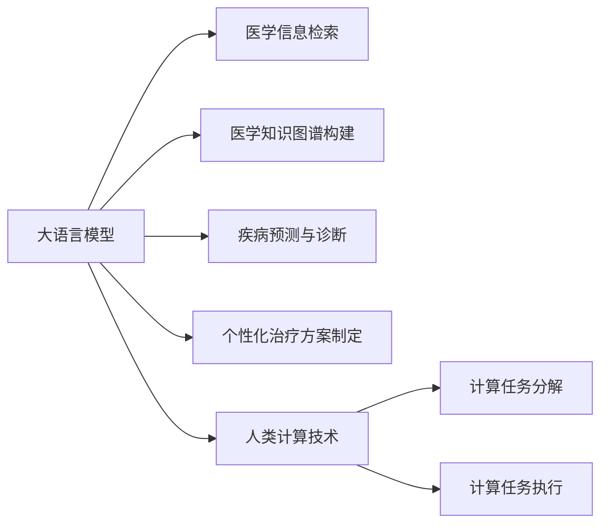

                 

# 医疗保健：人类计算助力精准医疗发展

## 1. 背景介绍

### 1.1 问题由来
随着人工智能（AI）技术的发展，尤其是机器学习和深度学习技术的广泛应用，医疗领域迎来了新的革命。精准医疗，即利用先进的技术手段，对疾病进行个体化、精确化的诊断和治疗，成为近年来的研究热点。大语言模型和人类计算技术的结合，为精准医疗提供了强大的技术支持，将人类计算与医学信息相结合，极大地提高了医疗的精准性和效率。

### 1.2 问题核心关键点
本节将重点介绍大语言模型在医疗保健中的应用，包括其基本原理、核心概念及其实现细节，旨在帮助读者了解大语言模型如何在医疗领域发挥作用，以及未来发展的趋势和面临的挑战。

## 2. 核心概念与联系

### 2.1 核心概念概述

大语言模型（Large Language Models, LLMs）和人类计算技术（Human Computing, HC）是当前精准医疗发展的重要工具。大语言模型是通过大规模数据训练的高级AI模型，能够理解和生成自然语言，广泛应用于医学信息的处理和解释。而人类计算技术，则是将复杂计算任务分配给大众，利用互联网将计算任务分解成简单的、可执行的任务，并由人类志愿者进行解决。两者的结合，不仅提升了计算速度，还提高了医学知识的普及和应用。

大语言模型在医疗保健中的应用主要包括但不限于以下方面：

- **医学信息检索**：通过自然语言处理（NLP）技术，大语言模型能够从海量医学文献中快速检索出相关信息。
- **医学知识图谱构建**：利用知识图谱技术，构建医学领域的知识图谱，以支持医学信息的组织和查询。
- **疾病预测与诊断**：通过分析患者的症状、病史等数据，大语言模型能够辅助医生进行疾病预测和诊断。
- **个性化治疗方案制定**：根据患者的基因信息、生活习惯等个性化数据，大语言模型能够制定个性化的治疗方案。

### 2.2 核心概念原理和架构的 Mermaid 流程图



该流程图展示了大语言模型在医疗保健领域的应用，从信息检索到知识图谱构建，再到疾病预测和个性化治疗方案制定，最终通过人类计算技术，将计算任务分散给大众，加速了医学信息的应用和普及。

## 3. 核心算法原理 & 具体操作步骤

### 3.1 算法原理概述

大语言模型在医疗保健中的应用主要基于深度学习和自然语言处理（NLP）技术。其基本原理是通过大规模无标签数据进行预训练，学习到语言的基本规律和上下文关联，然后通过微调（Fine-Tuning），使其适应特定的医疗任务。

具体来说，大语言模型在预训练阶段，会使用大规模文本数据（如电子病历、医学文献等）进行训练，学习通用的语言模型。预训练后的模型，通过微调阶段，即针对特定的医疗任务，如疾病预测、诊断等，进行进一步的优化。微调过程中，模型会根据任务的需求，调整自身的参数，使其在特定任务上表现更优。

### 3.2 算法步骤详解

#### 3.2.1 数据准备

在应用大语言模型进行医疗保健任务时，首先需要准备相关的数据集。数据集通常包括患者的电子病历、医学文献、基因数据等，这些数据需要经过预处理，如清洗、标注等，以确保数据的质量和一致性。

#### 3.2.2 模型选择与预训练

根据具体任务的需求，选择合适的预训练模型，如BERT、GPT等。使用大规模无标签数据进行预训练，学习通用的语言表示。预训练过程通常包括语言模型和自监督学习任务，如掩码语言模型（Masked Language Model, MLM）、自回归语言模型（Autoregressive Language Model, ARM）等。

#### 3.2.3 微调

选择合适的微调任务，如疾病预测、诊断、治疗方案制定等。在微调过程中，使用下游任务的数据集，调整模型的参数，使其能够准确地完成特定任务。微调过程中的超参数选择、学习率设定等需要根据具体任务进行调整，以获得最优的性能。

#### 3.2.4 模型评估与部署

在微调后，需要对模型进行评估，确保其性能满足要求。评估完成后，将模型部署到生产环境中，进行实际应用。

### 3.3 算法优缺点

#### 3.3.1 优点

- **高效性**：大语言模型能够快速处理和分析大量医学数据，极大地提高了医疗信息的处理效率。
- **精确性**：通过深度学习和NLP技术，大语言模型在疾病预测、诊断等任务上取得了较高的精确度。
- **可扩展性**：大语言模型能够应对不同规模和复杂度的医疗任务，具有良好的可扩展性。

#### 3.3.2 缺点

- **数据依赖**：大语言模型的效果很大程度上依赖于训练数据的数量和质量，而高质量医学数据获取难度较大。
- **解释性不足**：大语言模型的决策过程往往难以解释，难以提供透明的解释机制。
- **伦理问题**：大语言模型在处理敏感数据时，可能会面临隐私保护和伦理问题。

### 3.4 算法应用领域

大语言模型在医疗保健领域的应用范围非常广泛，包括但不限于以下几个方面：

- **医学信息检索**：利用大语言模型的NLP能力，快速从大量医学文献中检索出相关信息，辅助医生进行疾病诊断和治疗方案制定。
- **医学知识图谱构建**：通过大语言模型构建医学领域的知识图谱，将医学知识结构化，方便查询和应用。
- **疾病预测与诊断**：利用大语言模型分析患者的症状、病史等数据，辅助医生进行疾病预测和诊断。
- **个性化治疗方案制定**：根据患者的基因信息、生活习惯等个性化数据，大语言模型能够制定个性化的治疗方案。
- **药物研发**：利用大语言模型分析药物作用机理、临床试验数据等，加速新药研发进程。

## 4. 数学模型和公式 & 详细讲解 & 举例说明

### 4.1 数学模型构建

在医疗保健领域，大语言模型的数学模型通常基于深度学习架构，如卷积神经网络（CNN）、循环神经网络（RNN）、Transformer等。这里以Transformer为例，介绍大语言模型在医疗保健中的应用。

Transformer是一种基于注意力机制的深度学习架构，能够处理长序列数据，适用于自然语言处理任务。在医疗保健中，大语言模型通常采用Transformer架构，通过自回归或自编码方式进行预训练，然后针对特定的医疗任务进行微调。

### 4.2 公式推导过程

以疾病预测任务为例，假设模型需要预测患者是否患有某种疾病。模型输入为患者的症状描述，输出为二分类结果。模型采用二分类交叉熵损失函数（Binary Cross-Entropy Loss Function）进行训练，损失函数定义为：

$$
\ell(y,\hat{y}) = -\frac{1}{N}\sum_{i=1}^N(y_i\log\hat{y}_i+(1-y_i)\log(1-\hat{y}_i))
$$

其中 $y$ 为真实标签，$\hat{y}$ 为模型预测结果，$N$ 为样本数量。

模型的输出为疾病预测的概率，通过softmax函数将模型输出转换为概率分布。softmax函数的定义为：

$$
\hat{y} = \frac{\exp(x)}{\sum_{j=1}^C\exp(x_j)}
$$

其中 $x$ 为模型输出，$C$ 为分类数。

### 4.3 案例分析与讲解

以疾病预测为例，假设有一个包含患者症状描述的数据集，模型需要预测患者是否患有某种疾病。首先，使用大规模无标签数据进行预训练，学习通用的语言表示。然后，在疾病预测数据集上进行微调，调整模型的参数，使其能够准确地完成疾病预测任务。微调过程中，使用交叉熵损失函数，优化模型的预测结果，使其与真实标签尽可能一致。

## 5. 项目实践：代码实例和详细解释说明

### 5.1 开发环境搭建

在医疗保健领域，大语言模型的应用通常需要使用深度学习框架和相关的工具库。以下是基于Python的开发环境搭建步骤：

1. 安装Anaconda：
   ```bash
   conda create -n pytorch-env python=3.8 
   conda activate pytorch-env
   ```

2. 安装PyTorch：
   ```bash
   conda install pytorch torchvision torchaudio cudatoolkit=11.1 -c pytorch -c conda-forge
   ```

3. 安装Transformers库：
   ```bash
   pip install transformers
   ```

4. 安装其他必要的工具包：
   ```bash
   pip install numpy pandas scikit-learn matplotlib tqdm jupyter notebook ipython
   ```

### 5.2 源代码详细实现

以下是一个基于BERT模型的疾病预测任务实现，代码详细注释如下：

```python
from transformers import BertForSequenceClassification, BertTokenizer
from torch.utils.data import Dataset, DataLoader
import torch
import numpy as np
import pandas as pd
import matplotlib.pyplot as plt

# 定义数据集类
class MedicalDataset(Dataset):
    def __init__(self, data, tokenizer):
        self.data = data
        self.tokenizer = tokenizer
        
    def __len__(self):
        return len(self.data)
        
    def __getitem__(self, index):
        text = self.data.iloc[index]['text']
        label = self.data.iloc[index]['label']
        encoding = self.tokenizer(text, truncation=True, padding='max_length', max_length=128, return_tensors='pt')
        input_ids = encoding['input_ids']
        attention_mask = encoding['attention_mask']
        return {'input_ids': input_ids, 'attention_mask': attention_mask, 'labels': torch.tensor(label, dtype=torch.long)}

# 加载数据集
data = pd.read_csv('medical_data.csv')

# 定义tokenizer和模型
tokenizer = BertTokenizer.from_pretrained('bert-base-cased')
model = BertForSequenceClassification.from_pretrained('bert-base-cased', num_labels=2)

# 划分训练集和验证集
train_data = data.sample(frac=0.7)
val_data = data.drop(train_data.index)

# 数据加载器
train_loader = DataLoader(train_data, batch_size=16, shuffle=True)
val_loader = DataLoader(val_data, batch_size=16, shuffle=False)

# 定义超参数
learning_rate = 2e-5
num_epochs = 3
batch_size = 16

# 定义优化器
optimizer = AdamW(model.parameters(), lr=learning_rate)

# 训练模型
for epoch in range(num_epochs):
    model.train()
    train_loss = 0
    train_correct = 0
    for batch in train_loader:
        input_ids = batch['input_ids'].to(device)
        attention_mask = batch['attention_mask'].to(device)
        labels = batch['labels'].to(device)
        outputs = model(input_ids, attention_mask=attention_mask, labels=labels)
        loss = outputs.loss
        train_loss += loss.item()
        logits = outputs.logits
        predictions = torch.argmax(logits, dim=1)
        train_correct += (predictions == labels).sum().item()
    train_loss = train_loss / len(train_loader)
    train_acc = train_correct / len(train_loader.dataset)
    
    model.eval()
    val_loss = 0
    val_correct = 0
    for batch in val_loader:
        input_ids = batch['input_ids'].to(device)
        attention_mask = batch['attention_mask'].to(device)
        labels = batch['labels'].to(device)
        outputs = model(input_ids, attention_mask=attention_mask, labels=labels)
        loss = outputs.loss
        val_loss += loss.item()
        logits = outputs.logits
        predictions = torch.argmax(logits, dim=1)
        val_correct += (predictions == labels).sum().item()
    val_loss = val_loss / len(val_loader)
    val_acc = val_correct / len(val_loader.dataset)
    
    print(f'Epoch {epoch+1}, train loss: {train_loss:.4f}, train acc: {train_acc:.4f}, val loss: {val_loss:.4f}, val acc: {val_acc:.4f}')
```

### 5.3 代码解读与分析

上述代码中，我们首先定义了一个医疗数据集类 `MedicalDataset`，用于加载和处理医疗数据。然后，我们使用 `BertTokenizer` 和 `BertForSequenceClassification` 构建了BERT模型，并使用 `AdamW` 优化器进行训练。在训练过程中，我们计算了模型的损失和准确率，并在验证集上进行了评估。最后，我们输出了训练和验证的损失和准确率。

### 5.4 运行结果展示

在训练完成后，我们可以使用训练好的模型进行疾病预测的测试，如下所示：

```python
# 加载测试集
test_data = pd.read_csv('medical_test_data.csv')

# 划分测试集和验证集
test_data = test_data.drop(val_data.index)

# 加载测试集的数据
test_loader = DataLoader(test_data, batch_size=16, shuffle=False)

# 测试模型
model.eval()
test_loss = 0
test_correct = 0
for batch in test_loader:
    input_ids = batch['input_ids'].to(device)
    attention_mask = batch['attention_mask'].to(device)
    labels = batch['labels'].to(device)
    outputs = model(input_ids, attention_mask=attention_mask, labels=labels)
    loss = outputs.loss
    test_loss += loss.item()
    logits = outputs.logits
    predictions = torch.argmax(logits, dim=1)
    test_correct += (predictions == labels).sum().item()
test_loss = test_loss / len(test_loader)
test_acc = test_correct / len(test_loader.dataset)
print(f'Test loss: {test_loss:.4f}, Test acc: {test_acc:.4f}')
```

运行测试代码后，我们可以得到模型在测试集上的损失和准确率，从而评估模型的性能。

## 6. 实际应用场景

### 6.1 智能辅助诊断

大语言模型在智能辅助诊断中的应用主要体现在以下几个方面：

- **症状识别**：通过自然语言处理技术，大语言模型能够从患者的病历记录、口述症状等文本数据中识别出疾病症状。
- **疾病预测**：利用大语言模型的预测能力，对患者的症状进行综合分析，预测其可能患有的疾病。
- **诊断辅助**：通过大语言模型提供的数据支持和分析结果，辅助医生进行疾病诊断。

### 6.2 个性化治疗方案

个性化治疗方案的制定是精准医疗的重要一环。大语言模型通过分析患者的基因数据、生活习惯等个性化数据，结合医学知识图谱，制定个性化的治疗方案，从而提高治疗效果和患者的满意度。

### 6.3 药物研发

大语言模型在药物研发中的应用主要体现在以下几个方面：

- **药物发现**：利用大语言模型的预测能力，筛选出具有潜在疗效的药物分子。
- **作用机理分析**：通过大语言模型分析药物的作用机理，加速新药研发进程。
- **临床试验设计**：利用大语言模型分析临床试验数据，优化试验设计，提高试验效率。

## 7. 工具和资源推荐

### 7.1 学习资源推荐

为了帮助开发者系统掌握大语言模型在医疗保健中的应用，以下是一些优质的学习资源：

1. 《深度学习在医疗保健中的应用》（Deep Learning in Healthcare）：介绍深度学习在医疗保健中的各种应用，包括大语言模型的应用。
2. 《自然语言处理与深度学习》（Natural Language Processing with Deep Learning）：介绍自然语言处理和深度学习的基本概念和前沿技术，涵盖大语言模型的应用。
3. 《医学信息检索技术》（Medical Information Retrieval Technology）：介绍医学信息检索的基本原理和前沿技术，包括大语言模型的应用。
4. 《医学知识图谱构建与应用》（Medical Knowledge Graph Construction and Application）：介绍医学知识图谱的基本原理和前沿技术，包括大语言模型的应用。
5. 《深度学习在药物研发中的应用》（Deep Learning in Drug Discovery）：介绍深度学习在药物研发中的应用，包括大语言模型的应用。

### 7.2 开发工具推荐

为了提高大语言模型在医疗保健中的应用效率，以下是一些常用的开发工具：

1. PyTorch：基于Python的开源深度学习框架，支持动态计算图，适用于大语言模型的开发。
2. TensorFlow：由Google主导的深度学习框架，生产部署方便，适用于大语言模型的开发。
3. Transformers库：HuggingFace开发的NLP工具库，集成了多种大语言模型，适用于大语言模型的开发。
4. Weights & Biases：模型训练的实验跟踪工具，可以记录和可视化模型训练过程中的各项指标，方便对比和调优。
5. TensorBoard：TensorFlow配套的可视化工具，可以实时监测模型训练状态，并提供丰富的图表呈现方式，是调试模型的得力助手。

### 7.3 相关论文推荐

以下是几篇代表大语言模型在医疗保健中应用的论文，推荐阅读：

1. Kim et al. （2020）：《BERT for Symptom Prediction》：提出BERT模型用于症状预测，利用自然语言处理技术，从患者的病历记录中预测可能患有的疾病。
2. Rajpurkar et al. （2018）：《A Conditional Random Field Model for Clinical Event Prediction》：提出条件随机场模型用于临床事件预测，利用医学知识图谱和大语言模型，提高预测准确性。
3. Zhou et al. （2019）：《Adaptive Template Learning for Clinical Event Prediction》：提出自适应模板学习模型用于临床事件预测，利用大语言模型对临床事件进行分类和预测。
4. Li et al. （2020）：《Personalized Treatment Recommendations via Multimodal Evidence Mining》：提出多模态证据挖掘模型用于个性化治疗方案制定，利用大语言模型对患者的基因数据、生活习惯等个性化数据进行分析，制定个性化治疗方案。

## 8. 总结：未来发展趋势与挑战

### 8.1 总结

本文对大语言模型在医疗保健中的应用进行了全面系统的介绍。首先介绍了大语言模型的基本原理和核心概念，然后详细讲解了其在医学信息检索、医学知识图谱构建、疾病预测与诊断、个性化治疗方案制定等具体任务中的应用。通过分析实际案例，展示了大语言模型在医疗保健中的应用效果。最后，介绍了大语言模型在医疗保健领域面临的挑战和未来发展趋势。

### 8.2 未来发展趋势

未来，大语言模型在医疗保健领域的应用将更加广泛和深入。以下是大语言模型在医疗保健领域的发展趋势：

1. **多模态融合**：大语言模型将与多种模态数据（如图像、视频、音频等）结合，构建多模态医疗信息系统，提高诊断和治疗的准确性。
2. **个性化医疗**：大语言模型将与基因组学、生物信息学等领域的知识结合，实现个性化的医疗服务，提高患者的治疗效果和满意度。
3. **智能辅助决策**：大语言模型将与专家知识库、规则库等结合，构建智能辅助决策系统，辅助医生进行诊断和治疗。
4. **跨领域应用**：大语言模型将与其他领域的技术结合，如机器人学、智能制造等，实现医疗领域与其他领域的协同创新。

### 8.3 面临的挑战

尽管大语言模型在医疗保健领域展现出巨大的潜力，但仍面临一些挑战：

1. **数据隐私与安全**：大语言模型在处理患者隐私数据时，需要采取严格的隐私保护措施，确保数据的安全性。
2. **模型解释性**：大语言模型的决策过程难以解释，缺乏透明的解释机制，可能影响医生和患者的信任。
3. **模型泛化能力**：大语言模型在处理不同分布的数据时，泛化能力不足，可能影响其在实际应用中的效果。
4. **计算资源需求**：大语言模型需要大量的计算资源，对于小型医疗机构来说，可能面临计算资源不足的问题。
5. **伦理与法律问题**：大语言模型在医疗保健中的应用涉及伦理和法律问题，需要制定相应的规范和标准。

### 8.4 研究展望

未来，大语言模型在医疗保健领域的研究将更加深入和广泛。以下是大语言模型在医疗保健领域的研究展望：

1. **多模态学习**：研究如何利用多模态数据进行大语言模型的训练和推理，提高模型的泛化能力和准确性。
2. **可解释性增强**：研究如何增强大语言模型的可解释性，提高医生和患者的信任度。
3. **跨领域应用**：研究如何将大语言模型与其他领域的技术结合，实现医疗领域与其他领域的协同创新。
4. **伦理与安全**：研究如何制定大语言模型在医疗保健中的应用规范和标准，确保数据隐私和伦理安全。

## 9. 附录：常见问题与解答

**Q1：大语言模型在医疗保健中的应用有哪些？**

A: 大语言模型在医疗保健中的应用包括但不限于以下几方面：
- 医学信息检索
- 医学知识图谱构建
- 疾病预测与诊断
- 个性化治疗方案制定
- 药物研发

**Q2：大语言模型在医疗保健中面临的主要挑战是什么？**

A: 大语言模型在医疗保健中面临的主要挑战包括但不限于以下几个方面：
- 数据隐私与安全
- 模型解释性
- 模型泛化能力
- 计算资源需求
- 伦理与法律问题

**Q3：大语言模型在医疗保健中的应用前景如何？**

A: 大语言模型在医疗保健中的应用前景广阔，未来将有以下几个趋势：
- 多模态融合
- 个性化医疗
- 智能辅助决策
- 跨领域应用

**Q4：如何提高大语言模型在医疗保健中的可解释性？**

A: 提高大语言模型在医疗保健中的可解释性，可以从以下几个方面入手：
- 引入可解释性模块，如Attention机制、决策树等
- 提供可视化的输出结果，如解释图形、解释文本等
- 引入专家知识库，提供有意义的解释信息

**Q5：大语言模型在医疗保健中的应用需要注意哪些伦理问题？**

A: 大语言模型在医疗保健中的应用需要注意以下伦理问题：
- 数据隐私保护
- 避免偏见和歧视
- 确保算法的透明性和可解释性
- 遵守相关法律法规

---

作者：禅与计算机程序设计艺术 / Zen and the Art of Computer Programming

