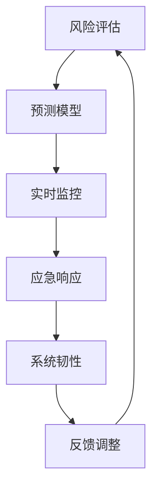

                 

# 危机管理：如何在turbulence中保持稳定

> 关键词：
危机管理, 稳定性, 风险评估, 预测模型, 实时监控, 应急响应, 系统韧性, 自动化

## 1. 背景介绍

### 1.1 问题由来

现代社会的复杂性和不确定性日渐增强，自然灾害、网络攻击、供应链中断、公共卫生事件等危机事件频发，严重威胁社会和经济的稳定。这些危机往往具有突发性强、波及面广、影响深远的特点，对社会治理体系提出了前所未有的挑战。如何高效应对这些危机，保障社会稳定运行，成为各国政府和企业的重要课题。

### 1.2 问题核心关键点

危机管理的核心在于：在危机发生前进行有效的风险评估和预警，实时监控危机动态，及时响应，持续评估和调整危机管理策略，以保障系统的稳定性和韧性。以下是危机管理的主要关键点：

- 风险评估：评估各种潜在危机的可能性、影响和应对难度，明确优先级和应对策略。
- 预测模型：建立基于大数据和人工智能的预测模型，准确预报危机趋势，辅助决策。
- 实时监控：通过传感器、数据流等实时获取危机信息，及时发现异常。
- 应急响应：根据危机预测和实时监控结果，快速启动应急预案，协调各方资源进行应对。
- 系统韧性：构建具有韧性的信息系统，能够承受冲击并迅速恢复。
- 自动化：通过自动化技术提升危机管理效率，减少人为干预带来的误差。

## 2. 核心概念与联系

### 2.1 核心概念概述

危机管理涉及多学科知识，包括系统工程、风险管理、计算机科学、心理学等。以下简要介绍几个核心概念及其相互联系：

- **系统韧性(System Resilience)**：指系统在面对外部冲击时，能够保持功能、结构和性能的能力。韧性强的系统能够快速响应危机、恢复功能，并在灾后重建。
- **风险评估(Risk Assessment)**：通过定量或定性分析，评估潜在危机的概率、影响和应对难度。风险评估是危机管理的基础，指导资源分配和策略制定。
- **预测模型(Prediction Model)**：使用历史数据和人工智能技术，建立预测模型，准确预测危机趋势，提供决策支持。
- **实时监控(Real-time Monitoring)**：通过传感器、数据流等技术，实时获取危机动态，及时发现异常。实时监控是应急响应的前提。
- **应急响应(Emergency Response)**：根据预测和监控结果，快速启动应急预案，协调资源进行应对。应急响应是危机管理的关键环节。

这些概念相互联系，构成了一个完整的危机管理体系。系统韧性是目标，风险评估和预测模型提供决策依据，实时监控和应急响应保障系统的稳定运行。

### 2.2 核心概念原理和架构的 Mermaid 流程图



这个流程图展示了危机管理各个环节的相互作用：

1. **风险评估**：对各类潜在危机进行定量和定性分析，确定风险优先级和应对策略。
2. **预测模型**：基于历史数据和人工智能，建立预测模型，预报危机趋势。
3. **实时监控**：通过传感器、数据流等技术，实时获取危机动态，及时发现异常。
4. **应急响应**：根据预测和监控结果，启动应急预案，协调资源进行应对。
5. **系统韧性**：保持系统的功能、结构和性能，快速恢复。
6. **反馈调整**：基于应急响应结果，调整风险评估和预测模型，提升系统韧性。

这些环节形成一个闭环，不断迭代优化，提升危机管理的有效性。

## 3. 核心算法原理 & 具体操作步骤

### 3.1 算法原理概述

危机管理的核心算法原理主要包括风险评估、预测模型、实时监控和应急响应等。这些算法通过数据驱动和智能分析，支持决策和行动，保障系统的稳定性和韧性。

### 3.2 算法步骤详解

#### 3.2.1 风险评估

风险评估是危机管理的第一步，通过定量和定性方法，评估各类危机的可能性、影响和应对难度。其步骤包括：

1. **数据收集**：收集与潜在危机相关的历史数据、专家意见、社会经济指标等。
2. **风险识别**：识别潜在危机的种类，包括自然灾害、公共卫生事件、网络攻击等。
3. **风险量化**：使用定量方法（如统计分析、概率模型）和定性方法（如专家打分、问卷调查）量化风险概率和影响程度。
4. **风险排序**：根据量化结果，排序确定优先级。

#### 3.2.2 预测模型

预测模型通过大数据和机器学习技术，建立对危机的动态预测，提供决策支持。其步骤包括：

1. **数据准备**：收集历史危机数据、社会经济数据等，清洗和预处理数据。
2. **模型选择**：选择适合危机预测的模型，如时间序列模型、回归模型、神经网络等。
3. **模型训练**：使用历史数据训练模型，优化模型参数。
4. **模型验证**：使用验证数据集评估模型性能，调整模型参数。
5. **模型部署**：将模型部署到实时监控系统中，持续更新模型参数。

#### 3.2.3 实时监控

实时监控通过传感器、数据流等技术，实时获取危机动态，及时发现异常。其步骤包括：

1. **传感器部署**：在关键位置部署传感器，实时监测环境、交通、物资等数据。
2. **数据集成**：将传感器数据、网络数据、社交媒体数据等集成到一个统一的数据平台。
3. **异常检测**：使用统计分析、机器学习等方法，识别异常事件和趋势。
4. **实时预警**：根据异常检测结果，及时发出预警信号，通知相关部门。

#### 3.2.4 应急响应

应急响应根据预测和监控结果，快速启动应急预案，协调资源进行应对。其步骤包括：

1. **预案制定**：制定详细的应急预案，明确各个环节的责任和操作流程。
2. **资源调配**：根据预警信号，调配应急物资、人力、设备等资源。
3. **实时执行**：按照预案执行应急措施，协调各方力量进行应对。
4. **效果评估**：评估应急响应的效果，调整预案和资源分配。

### 3.3 算法优缺点

#### 3.3.1 风险评估

优点：
- 全面评估潜在危机的可能性、影响和应对难度。
- 提供决策依据，优化资源分配和策略制定。

缺点：
- 数据收集和处理复杂，耗时耗力。
- 定性方法主观性强，可能导致误判。

#### 3.3.2 预测模型

优点：
- 基于大数据和人工智能，准确预报危机趋势。
- 支持实时决策和应急响应。

缺点：
- 模型建立复杂，需要大量数据和计算资源。
- 模型可能存在过拟合或欠拟合问题，需要持续优化。

#### 3.3.3 实时监控

优点：
- 实时获取危机动态，及时发现异常。
- 保障应急响应的及时性和准确性。

缺点：
- 传感器和数据集成复杂，成本高。
- 异常检测技术要求高，可能存在误报或漏报。

#### 3.3.4 应急响应

优点：
- 快速启动应急预案，协调资源进行应对。
- 保障系统的稳定性和韧性。

缺点：
- 预案制定复杂，需要广泛协调和资源投入。
- 应急响应可能存在延迟或错误，需要持续改进。

### 3.4 算法应用领域

危机管理算法在多个领域得到了广泛应用，包括：

- **政府应急管理**：构建城市应急指挥系统，提升自然灾害、公共卫生事件的响应能力。
- **企业风险管理**：建立企业危机预警系统，防范网络攻击、供应链中断等风险。
- **公共安全**：构建社会安全监测系统，防范恐怖袭击、公共场所安全事件。
- **金融风险管理**：构建市场风险预测系统，防范金融危机和经济波动。
- **公共卫生**：建立传染病监测系统，预警疫情暴发和流行趋势。
- **网络安全**：构建网络攻击监测系统，实时防御和应对网络威胁。

## 4. 数学模型和公式 & 详细讲解 & 举例说明

### 4.1 数学模型构建

危机管理涉及多个子领域，其数学模型也各具特点。以下是几个常用的数学模型及其构建方法：

#### 4.1.1 风险评估模型

风险评估模型通常使用定量方法，通过统计分析、概率模型等技术，量化风险概率和影响程度。以自然灾害风险评估为例，其数学模型构建如下：

1. **概率模型**：使用历史数据构建概率模型，评估灾害发生的概率。例如，使用贝叶斯网络、马尔可夫链等模型，建立灾害概率分布。
2. **影响模型**：使用经济模型、环境模型等，量化灾害对社会、经济、环境的影响。例如，使用回归模型、优化模型等，评估灾害造成的损失。
3. **综合评估模型**：将概率模型和影响模型结合起来，综合评估风险水平。例如，使用效用函数、风险指数等方法，计算综合风险评估指标。

#### 4.1.2 预测模型

预测模型使用机器学习技术，基于历史数据建立预测模型，提供危机趋势预测。以自然灾害预测为例，其数学模型构建如下：

1. **数据预处理**：清洗、归一化、特征提取等步骤，准备输入数据。
2. **模型选择**：选择合适的预测模型，如线性回归、决策树、神经网络等。
3. **模型训练**：使用历史数据训练模型，优化模型参数。
4. **模型验证**：使用验证数据集评估模型性能，调整模型参数。
5. **模型部署**：将模型部署到实时监控系统中，持续更新模型参数。

#### 4.1.3 实时监控模型

实时监控模型使用传感器数据和机器学习技术，实时监测危机动态，及时发现异常。以城市交通监控为例，其数学模型构建如下：

1. **数据收集**：通过传感器、摄像头等技术，实时获取交通流量、速度、事故等数据。
2. **数据融合**：将不同来源的数据进行融合，构建统一的数据平台。
3. **异常检测**：使用统计分析、机器学习等方法，识别异常事件和趋势。例如，使用时间序列分析、支持向量机等算法，检测交通拥堵、事故等异常。
4. **实时预警**：根据异常检测结果，及时发出预警信号，通知相关部门。

#### 4.1.4 应急响应模型

应急响应模型使用优化算法和决策支持系统，制定应急预案，协调资源进行应对。以自然灾害应急响应为例，其数学模型构建如下：

1. **预案制定**：使用决策树、优化模型等，制定详细的应急预案，明确各个环节的责任和操作流程。
2. **资源调配**：使用线性规划、整数规划等优化算法，调配应急物资、人力、设备等资源。
3. **实时执行**：按照预案执行应急措施，协调各方力量进行应对。
4. **效果评估**：使用统计分析、效用评估等方法，评估应急响应的效果，调整预案和资源分配。

### 4.2 公式推导过程

#### 4.2.1 风险评估公式

以自然灾害风险评估为例，其风险评估公式如下：

$$
Risk = P(D) \times Impact(D)
$$

其中，$Risk$ 为风险水平，$P(D)$ 为灾害发生概率，$Impact(D)$ 为灾害影响程度。

#### 4.2.2 预测模型公式

以自然灾害预测为例，其预测模型公式如下：

$$
\hat{Y} = \theta^T X + \epsilon
$$

其中，$\hat{Y}$ 为预测值，$\theta$ 为模型参数，$X$ 为输入特征，$\epsilon$ 为误差项。

#### 4.2.3 实时监控公式

以交通流量监控为例，其实时监控公式如下：

$$
Trend = \alpha \times T + (1-\alpha) \times \hat{T}
$$

其中，$Trend$ 为当前趋势，$T$ 为历史趋势，$\hat{T}$ 为预测趋势，$\alpha$ 为权重系数。

#### 4.2.4 应急响应公式

以自然灾害应急响应为例，其应急响应公式如下：

$$
Cost = \sum_{i=1}^n C_i
$$

其中，$Cost$ 为应急成本，$C_i$ 为各个环节的成本。

### 4.3 案例分析与讲解

#### 4.3.1 风险评估案例

某城市面临洪水风险，需要进行风险评估。以下是具体步骤：

1. **数据收集**：收集历史洪水数据、社会经济数据等，清洗和预处理数据。
2. **风险识别**：识别洪水的风险种类，包括河流溢出、城市内涝等。
3. **风险量化**：使用统计分析、概率模型等方法，量化洪水风险概率和影响程度。
4. **风险排序**：根据量化结果，排序确定优先级，制定应对策略。

#### 4.3.2 预测模型案例

某企业面临网络攻击风险，需要进行风险预测。以下是具体步骤：

1. **数据准备**：收集历史攻击数据、网络流量数据等，清洗和预处理数据。
2. **模型选择**：选择适合攻击预测的模型，如决策树、神经网络等。
3. **模型训练**：使用历史数据训练模型，优化模型参数。
4. **模型验证**：使用验证数据集评估模型性能，调整模型参数。
5. **模型部署**：将模型部署到实时监控系统中，持续更新模型参数。

#### 4.3.3 实时监控案例

某城市交通面临堵塞风险，需要进行实时监控。以下是具体步骤：

1. **传感器部署**：在关键位置部署传感器，实时监测交通流量、速度等数据。
2. **数据集成**：将传感器数据、网络数据、社交媒体数据等集成到一个统一的数据平台。
3. **异常检测**：使用统计分析、机器学习等方法，识别交通堵塞异常。
4. **实时预警**：根据异常检测结果，及时发出预警信号，通知相关部门。

#### 4.3.4 应急响应案例

某城市面临地震风险，需要进行应急响应。以下是具体步骤：

1. **预案制定**：制定详细的应急预案，明确各个环节的责任和操作流程。
2. **资源调配**：使用线性规划等优化算法，调配应急物资、人力、设备等资源。
3. **实时执行**：按照预案执行应急措施，协调各方力量进行应对。
4. **效果评估**：使用统计分析、效用评估等方法，评估应急响应的效果，调整预案和资源分配。

## 5. 项目实践：代码实例和详细解释说明

### 5.1 开发环境搭建

在进行危机管理项目开发前，我们需要准备好开发环境。以下是使用Python进行PyTorch开发的环境配置流程：

1. 安装Anaconda：从官网下载并安装Anaconda，用于创建独立的Python环境。
2. 创建并激活虚拟环境：
```bash
conda create -n pytorch-env python=3.8 
conda activate pytorch-env
```
3. 安装PyTorch：根据CUDA版本，从官网获取对应的安装命令。例如：
```bash
conda install pytorch torchvision torchaudio cudatoolkit=11.1 -c pytorch -c conda-forge
```
4. 安装TensorFlow：
```bash
conda install tensorflow -c conda-forge
```
5. 安装TensorBoard：
```bash
conda install tensorboard -c conda-forge
```
6. 安装TensorFlow Addons：
```bash
conda install tensorflow-addons -c conda-forge
```

完成上述步骤后，即可在`pytorch-env`环境中开始项目开发。

### 5.2 源代码详细实现

这里我们以自然灾害风险评估为例，使用TensorFlow实现一个简单的风险评估模型。

首先，定义风险评估模型类：

```python
import tensorflow as tf

class RiskAssessmentModel(tf.keras.Model):
    def __init__(self, input_dim, output_dim):
        super(RiskAssessmentModel, self).__init__()
        self.dense1 = tf.keras.layers.Dense(64, activation='relu', input_dim=input_dim)
        self.dense2 = tf.keras.layers.Dense(output_dim, activation='sigmoid')

    def call(self, inputs):
        x = self.dense1(inputs)
        x = self.dense2(x)
        return x
```

然后，准备训练数据：

```python
import numpy as np

# 生成随机数据
X = np.random.randn(1000, 10)
y = np.random.randn(1000, 1)

# 构建数据集
dataset = tf.data.Dataset.from_tensor_slices((X, y))
dataset = dataset.shuffle(buffer_size=1000).batch(batch_size=32)
```

接着，定义损失函数和优化器：

```python
loss_fn = tf.keras.losses.BinaryCrossentropy()

optimizer = tf.keras.optimizers.Adam(learning_rate=0.001)
```

最后，进行模型训练：

```python
@tf.function
def train_step(inputs):
    with tf.GradientTape() as tape:
        logits = model(inputs)
        loss = loss_fn(y_true=y, y_pred=logits)
    gradients = tape.gradient(loss, model.trainable_variables)
    optimizer.apply_gradients(zip(gradients, model.trainable_variables))

# 模型训练
for epoch in range(100):
    for batch in dataset:
        inputs, targets = batch
        train_step(inputs)
```

以上就是一个简单的自然灾害风险评估模型的实现。可以看到，利用TensorFlow的Keras API，我们只需编写少量代码，即可构建和训练一个风险评估模型。

### 5.3 代码解读与分析

让我们再详细解读一下关键代码的实现细节：

**RiskAssessmentModel类**：
- `__init__`方法：定义模型结构，包括两个全连接层。
- `call`方法：定义模型的前向传播过程，输出风险评估结果。

**X和y数组**：
- `X`表示输入特征，这里使用随机生成的10维向量。
- `y`表示风险评估结果，这里使用随机生成的1维向量。

**dataset构造**：
- 使用TensorFlow的Dataset API，将X和y数组构建成数据集，并进行随机打乱和分批处理。

**loss_fn**：
- 定义二分类交叉熵损失函数，用于衡量模型输出与真实标签之间的差异。

**optimizer**：
- 定义Adam优化器，用于更新模型参数。

**train_step函数**：
- 定义训练过程，使用梯度下降优化器更新模型参数，每批更新一次。

可以看到，利用TensorFlow等深度学习框架，我们可以轻松实现各类危机管理算法，提升模型训练和优化效率。开发者可以将更多精力放在模型设计、数据处理等高层逻辑上，而不必过多关注底层的实现细节。

当然，工业级的系统实现还需考虑更多因素，如模型的保存和部署、超参数的自动搜索、模型的自动化部署和监控等。但核心的危机管理算法基本与此类似。

## 6. 实际应用场景

### 6.1 智能城市应急响应

智能城市通过集成各类传感器、数据流和智能算法，能够实现对自然灾害、公共安全事件的实时监控和应急响应。例如，智能城市可以通过传感器监控城市水位、气温、地震活动等数据，实时预警洪水、台风、地震等灾害。

在技术实现上，可以构建城市应急指挥中心，集成气象、地质、交通、医疗等数据，实时监控城市状态。一旦发现异常，系统自动启动应急预案，协调各方力量进行响应。智能城市应急响应系统能够大大提升城市应对自然灾害和公共安全事件的能力，保障城市安全运行。

### 6.2 企业网络安全防护

企业网络面临来自外部和内部的各种威胁，包括网络攻击、数据泄露、恶意软件等。通过危机管理技术，企业可以构建安全防护体系，实时监控网络动态，快速响应安全事件。

在技术实现上，可以构建网络安全监测系统，集成防火墙、入侵检测系统、异常检测等技术，实时监控网络流量和行为。一旦发现异常，系统自动启动应急预案，隔离受攻击设备，恢复网络正常运行。网络安全防护系统能够有效提升企业网络的安全性和稳定性，保护企业数据和业务。

### 6.3 公共卫生事件预警

公共卫生事件如疫情、食源性疾病等，对社会稳定和人民健康构成严重威胁。通过危机管理技术，公共卫生机构可以构建预警系统，实时监控和预测疾病传播趋势，及时预警和应对。

在技术实现上，可以构建公共卫生监测系统，集成医院数据、社交媒体数据、气象数据等，实时监控疾病动态。一旦发现异常，系统自动启动应急预案，调配医疗资源，发布公共健康指南。公共卫生预警系统能够有效控制疾病传播，保障公共卫生安全。

### 6.4 金融市场风险管理

金融市场面临各种风险，如市场波动、信用风险、操作风险等。通过危机管理技术，金融机构可以构建风险管理系统，实时监控市场动态，预测和控制风险。

在技术实现上，可以构建金融市场监测系统，集成市场数据、财务数据、新闻数据等，实时监控市场趋势。一旦发现异常，系统自动启动应急预案，调整投资策略，控制风险敞口。金融市场风险管理系统能够有效控制金融风险，保障市场稳定运行。

### 6.5 自然灾害预警

自然灾害如洪水、地震、台风等，对社会和经济造成巨大损失。通过危机管理技术，政府和相关部门可以构建预警系统，实时监控自然灾害动态，及时预警和应对。

在技术实现上，可以构建自然灾害监测系统，集成卫星遥感数据、气象数据、地震数据等，实时监控自然灾害。一旦发现异常，系统自动启动应急预案，调配救援资源，保障人民生命财产安全。自然灾害预警系统能够有效减轻灾害损失，保障社会稳定。

### 6.6 供应链中断预警

供应链中断如物流延迟、零部件短缺等，对企业生产和运营造成严重影响。通过危机管理技术，企业可以构建供应链风险管理系统，实时监控供应链动态，预警和应对中断事件。

在技术实现上，可以构建供应链监测系统，集成物流数据、库存数据、供应商数据等，实时监控供应链状态。一旦发现异常，系统自动启动应急预案，调整生产计划，保障供应链稳定。供应链风险管理系统能够有效降低供应链中断风险，保障企业生产和运营。

## 7. 工具和资源推荐

### 7.1 学习资源推荐

为了帮助开发者系统掌握危机管理的相关理论和技术，这里推荐一些优质的学习资源：

1. 《系统工程基础》书籍：深入介绍系统工程的基本概念和方法，帮助理解危机管理的整体框架。
2. 《数据科学导论》书籍：介绍数据科学的基础知识和常用技术，帮助理解风险评估和预测模型的构建。
3. 《机器学习实战》书籍：介绍机器学习算法和实现方法，帮助理解危机管理中的预测模型。
4. 《深度学习》课程：斯坦福大学开设的深度学习课程，涵盖深度学习的基本概念和经典模型，帮助理解实时监控和应急响应的技术。
5. 《危机管理》在线课程：介绍危机管理的理论和方法，涵盖风险评估、预测模型、实时监控和应急响应等关键环节。
6. 《自然灾害监测与管理》专业期刊：定期发布自然灾害监测和管理的前沿研究成果，提供最新的危机管理技术。

通过对这些资源的学习实践，相信你一定能够系统掌握危机管理的精髓，并应用于实际问题解决。

### 7.2 开发工具推荐

高效的开发离不开优秀的工具支持。以下是几款用于危机管理开发的常用工具：

1. TensorFlow：基于Python的开源深度学习框架，灵活的数据流图和动态计算图，适合快速迭代研究。
2. PyTorch：基于Python的开源深度学习框架，动态计算图和GPU加速，适合高效训练和推理。
3. Scikit-learn：Python的数据挖掘和机器学习库，提供简单易用的机器学习算法和工具。
4. Apache Kafka：开源的消息队列系统，支持高吞吐量的数据流处理，适合实时监控和数据集成。
5. Apache Hadoop：开源的大数据处理框架，支持分布式数据存储和计算，适合大规模数据处理。
6. Grafana：开源的数据可视化工具，支持多数据源集成和动态报表展示，适合实时监控和应急响应。

合理利用这些工具，可以显著提升危机管理开发的效率，加速创新迭代的步伐。

### 7.3 相关论文推荐

危机管理技术的发展源于学界的持续研究。以下是几篇奠基性的相关论文，推荐阅读：

1. "Distributed Statistical Event Risk Analysis and Its Applications"：介绍基于统计方法的危机风险评估模型，涵盖自然灾害、公共卫生等多个领域。
2. "Probabilistic Models of Natural Hazards and Their Uncertainty Analysis"：介绍基于概率模型的自然灾害风险评估方法，详细推导数学模型和算法。
3. "Real-time Disease Outbreak Prediction Using Twitter Sentiment Analysis"：介绍基于Twitter情感分析的疾病预测方法，展示社交媒体在危机管理中的应用。
4. "A Real-time Healthcare Crisis Management System"：介绍基于实时监控和应急响应的公共卫生危机管理系统，涵盖数据集成、异常检测和应急预案等技术。
5. "Deep Learning for Crisis Management: A Survey"：综述近年来基于深度学习的危机管理技术，涵盖预测模型、实时监控和应急响应等多个环节。

这些论文代表了大规模数据和人工智能在危机管理中的应用趋势，为危机管理的理论与实践提供了丰富的参考。

## 8. 总结：未来发展趋势与挑战

### 8.1 总结

本文对危机管理算法进行了全面系统的介绍。首先阐述了危机管理的背景和意义，明确了其核心概念和各个环节的相互作用。其次，从原理到实践，详细讲解了危机管理的数学模型和算法步骤，给出了具体的代码实现。同时，本文还探讨了危机管理技术在智能城市、企业网络、公共卫生、金融市场等领域的广泛应用，展示了其巨大的价值和潜力。此外，本文精选了危机管理技术的各类学习资源，力求为读者提供全方位的技术指引。

通过本文的系统梳理，可以看到，危机管理算法在大规模数据和人工智能的驱动下，正在逐步走向智能化和自动化。危机管理的各个环节，从风险评估、预测模型、实时监控到应急响应，都得到了充分的技术支持。危机管理算法在保障社会稳定和经济发展方面，将发挥越来越重要的作用。

### 8.2 未来发展趋势

展望未来，危机管理算法将呈现以下几个发展趋势：

1. **智能化**：基于人工智能和深度学习技术，危机管理算法将更加智能化和自动化，能够实时预测、实时监控和实时响应，提升危机管理效率。
2. **数据化**：通过大规模数据的积累和分析，危机管理算法将更加数据化和量化，提供更加准确的决策支持。
3. **融合化**：危机管理算法将与其他人工智能技术进行更深入的融合，如知识表示、因果推理、强化学习等，提供更加全面和智能的危机管理解决方案。
4. **云化**：危机管理算法将越来越多地部署到云平台上，实现数据共享和协同处理，提升系统效率和安全性。
5. **全球化**：危机管理算法将更多应用于全球性危机，如自然灾害、公共卫生事件等，提供全球性的危机预警和应对方案。
6. **人性化**：危机管理算法将更加注重用户体验和伦理道德，提供更加人性化和可解释的危机管理服务。

以上趋势凸显了危机管理算法的广阔前景。这些方向的探索发展，必将进一步提升危机管理的有效性，为构建稳定、安全、智能的社会提供技术支持。

### 8.3 面临的挑战

尽管危机管理算法已经取得了显著成果，但在迈向更加智能化、普适化应用的过程中，仍面临诸多挑战：

1. **数据隐私和安全**：大规模数据的使用带来数据隐私和安全问题，需要严格的数据保护和隐私政策。
2. **模型鲁棒性**：危机管理算法面临复杂多变的环境，需要模型具有鲁棒性，能够应对未知的危机情况。
3. **多源数据融合**：危机管理涉及多种数据源，数据格式和质量不一，需要进行高质量的数据融合。
4. **自动化与人工干预**：危机管理算法需要与人工干预相结合，确保系统在关键时刻能够切换到人工操作。
5. **伦理和道德**：危机管理算法需要考虑伦理和道德问题，避免算法偏见和有害输出。
6. **全球化挑战**：全球性的危机管理需要考虑不同地区、不同文化的差异，提供全球化的危机预警和应对方案。

这些挑战凸显了危机管理算法的复杂性和多样性，需要综合考虑技术、伦理、法律等多个因素，确保系统安全、可靠和公正。只有全面应对这些挑战，才能真正实现危机管理的智能化和普适化。

### 8.4 研究展望

面对危机管理算法所面临的诸多挑战，未来的研究需要在以下几个方面寻求新的突破：

1. **数据隐私和安全**：开发基于区块链和联邦学习的数据隐私保护技术，确保大规模数据的安全性和隐私性。
2. **模型鲁棒性**：研究鲁棒性更强的模型架构和训练方法，提升模型应对未知危机的能力。
3. **多源数据融合**：开发高效的多源数据融合算法，提高数据质量，确保数据的统一性和一致性。
4. **自动化与人工干预**：研究自动化与人工干预的结合方式，确保系统在关键时刻能够切换到人工操作，提升系统的可靠性和用户体验。
5. **伦理和道德**：研究伦理和道德约束的机制，确保算法的公平性和公正性，避免算法偏见和有害输出。
6. **全球化挑战**：开发全球化的危机管理算法，考虑不同地区、不同文化的差异，提供全球化的危机预警和应对方案。

这些研究方向将引领危机管理算法的未来发展，为构建稳定、安全、智能的社会提供坚实的技术保障。

## 9. 附录：常见问题与解答

**Q1：危机管理算法的核心思想是什么？**

A: 危机管理算法的核心思想是通过数据驱动和智能分析，提供决策支持，确保系统的稳定性和韧性。主要包括以下几个环节：
1. 风险评估：评估各类潜在危机的可能性、影响和应对难度。
2. 预测模型：建立基于大数据和人工智能的预测模型，准确预报危机趋势。
3. 实时监控：通过传感器、数据流等技术，实时获取危机动态，及时发现异常。
4. 应急响应：根据预测和监控结果，快速启动应急预案，协调资源进行应对。

**Q2：危机管理算法的主要步骤是什么？**

A: 危机管理算法的主要步骤包括以下几个环节：
1. 数据收集：收集与潜在危机相关的历史数据、专家意见、社会经济指标等。
2. 风险识别：识别潜在危机的种类，包括自然灾害、公共卫生事件、网络攻击等。
3. 风险量化：使用定量方法（如统计分析、概率模型）和定性方法（如专家打分、问卷调查）量化风险概率和影响程度。
4. 风险排序：根据量化结果，排序确定优先级，制定应对策略。
5. 模型选择：选择合适的预测模型，如线性回归、决策树、神经网络等。
6. 模型训练：使用历史数据训练模型，优化模型参数。
7. 模型验证：使用验证数据集评估模型性能，调整模型参数。
8. 模型部署：将模型部署到实时监控系统中，持续更新模型参数。
9. 数据集成：将不同来源的数据进行融合，构建统一的数据平台。
10. 异常检测：使用统计分析、机器学习等方法，识别异常事件和趋势。
11. 实时预警：根据异常检测结果，及时发出预警信号，通知相关部门。
12. 应急预案：制定详细的应急预案，明确各个环节的责任和操作流程。
13. 资源调配：使用线性规划等优化算法，调配应急物资、人力、设备等资源。
14. 实时执行：按照预案执行应急措施，协调各方力量进行应对。
15. 效果评估：使用统计分析、效用评估等方法，评估应急响应的效果，调整预案和资源分配。

**Q3：如何构建高效的危机管理算法？**

A: 构建高效的危机管理算法需要综合考虑数据、模型、技术等多个因素，以下是一些关键步骤：
1. 数据收集：收集全面、高质量的数据，涵盖历史数据、实时数据、专家意见等。
2. 数据预处理：清洗、归一化、特征提取等步骤，准备输入数据。
3. 模型选择：选择合适的模型，如线性回归、决策树、神经网络等，考虑模型的复杂度和效果。
4. 模型训练：使用历史数据训练模型，优化模型参数，确保模型泛化能力。
5. 模型验证：使用验证数据集评估模型性能，调整模型参数，确保模型准确性。
6. 模型部署：将模型部署到实时监控系统中，持续更新模型参数，确保模型实时性。
7. 数据融合：将不同来源的数据进行融合，构建统一的数据平台，确保数据的完整性和一致性。
8. 异常检测：使用统计分析、机器学习等方法，识别异常事件和趋势，确保异常检测的准确性。
9. 实时预警：根据异常检测结果，及时发出预警信号，确保预警的及时性。
10. 应急预案：制定详细的应急预案，明确各个环节的责任和操作流程，确保应急响应的可靠性和有效性。
11. 资源调配：使用优化算法，调配应急物资、人力、设备等资源，确保资源的高效利用。
12. 实时执行：按照预案执行应急措施，协调各方力量进行应对，确保应急响应的快速性和准确性。
13. 效果评估：使用统计分析、效用评估等方法，评估应急响应的效果，确保预案的持续改进和优化。

通过以上步骤，可以构建高效的危机管理算法，提升系统稳定性和韧性，保障社会的安全运行。

---

作者：禅与计算机程序设计艺术 / Zen and the Art of Computer Programming

