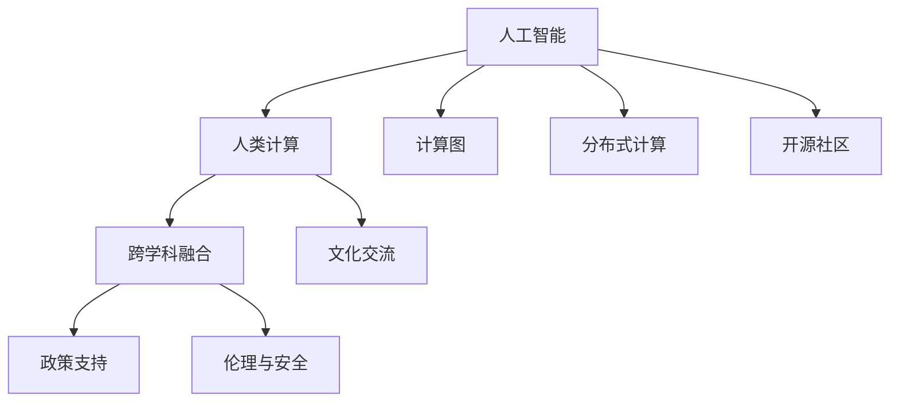

                 

## 1. 背景介绍

### 1.1 问题由来
随着人工智能(AI)技术的迅猛发展，计算能力已不再是束缚人类探索知识疆界的障碍。在过去几十年里，得益于算力的大幅提升和计算模型的不断优化，人类社会在多个领域取得了突破性的进展。然而，AI技术的强大潜能仍需全球范围的合作与共享，才能最大化其对人类社会的贡献。

国际合作在AI领域的重要性尤为突出，它不仅仅包括共享技术和数据，更涉及跨领域、跨文化和跨学科的深度交流与合作。在全球气候变化、疫情应对、医疗健康、智能制造等关键领域，AI的国际合作正在发挥越来越重要的作用。

### 1.2 问题核心关键点
国际合作在推动AI技术进步方面的关键点包括以下几个方面：

- **共享与开放：** 技术的共享和数据开放是推动AI发展的基础。开放数据集、算法和模型可以加快技术的普及和应用。
- **跨学科融合：** AI技术的进步需要跨学科的深度合作，包括计算机科学、数学、生物学、社会科学等多个领域的专家共同参与。
- **文化交流：** 不同文化背景下的思想碰撞有助于AI技术的创新，避免单一思维的局限。
- **政策支持：** 各国政府和国际组织需要在政策层面对AI技术的发展给予支持，建立国际合作机制和标准规范。
- **伦理与安全：** 国际合作应注重AI技术的伦理与安全，共同应对AI可能带来的挑战和风险。

通过理解这些核心关键点，可以更好地把握AI国际合作的本质和意义。

## 2. 核心概念与联系

### 2.1 核心概念概述

为了更好地理解国际合作在AI发展中的作用，本节将介绍几个密切相关的核心概念：

- **人工智能(AI)：** 一种能够模拟人类智能活动的计算机技术，包括学习、推理、规划、感知、语言理解等方面。
- **人类计算(Human Computation)：** 利用人类的智能和计算能力，解决复杂计算问题，如大规模数据分析、人工智能模型训练等。
- **计算图(Computational Graph)：** 在深度学习中，计算图用于表示计算流程和数据流向，是现代AI模型训练的基础。
- **分布式计算(Distributed Computing)：** 将计算任务分解为多个子任务，并在多个计算节点上并行执行，以提升计算效率。
- **开源社区(Open Source Community)：** 以开放和共享为核心价值观的开发者社群，为AI技术的发展提供了丰富的资源和工具。

这些核心概念之间的逻辑关系可以通过以下Mermaid流程图来展示：



这个流程图展示了大语言模型和微调的相关概念及其之间的关系：

1. 人工智能通过计算图和分布式计算技术，可以高效处理复杂数据。
2. 开源社区提供了丰富的算法和工具，加速人工智能的发展。
3. 跨学科融合和文化交流，有助于解决特定领域的计算问题。
4. 政策支持、伦理与安全的保障，使得人工智能技术能够健康、有序地发展。

## 3. 核心算法原理 & 具体操作步骤

### 3.1 算法原理概述

基于国际合作的人工智能发展，其核心算法原理是利用不同国家和地区的优势资源，通过分布式计算、数据共享、知识协同等方式，共同提升AI技术的整体水平。以下主要介绍两种关键的国际合作算法：

- **分布式深度学习(Distributed Deep Learning)：** 通过将深度学习模型和训练任务分解为多个子任务，在多个计算节点上并行执行，从而加速模型训练。这种方法可以显著提升计算效率，缩短模型开发周期。
- **知识共享与融合(Knowledge Sharing and Integration)：** 通过国际间的知识共享，不同国家和地区的专家可以互相学习和借鉴，提升AI技术的广度和深度。知识共享可以通过论文发表、项目合作、开源代码等多种形式实现。

### 3.2 算法步骤详解

#### 分布式深度学习
分布式深度学习的具体步骤包括：

1. **任务划分：** 将深度学习任务按照计算需求分解为多个子任务。
2. **数据划分：** 将数据集按照训练、验证、测试集等进行划分，并分配到不同的计算节点。
3. **并行计算：** 在多个计算节点上同时执行子任务，以提高计算效率。
4. **结果汇总：** 将各节点的计算结果汇总，进行全局参数更新和模型优化。

#### 知识共享与融合
知识共享与融合的具体步骤包括：

1. **开放数据集：** 将数据集公开分享，供全球研究者使用。
2. **开源算法：** 将算法和模型代码开源，允许任何人自由修改和使用。
3. **跨学科合作：** 组织国际学术会议、合作研究项目，促进不同领域的专家交流合作。
4. **共同发表论文：** 通过联合研究，发布具有国际影响力的学术论文，提升整体研究水平。

### 3.3 算法优缺点

分布式深度学习具有以下优点：
1. 显著提高计算效率，缩短模型训练时间。
2. 能够处理大规模数据集，避免单节点资源瓶颈。
3. 可以加速新模型的开发和部署。

同时，该方法也存在一些局限性：
1. 需要复杂的网络架构和网络通信。
2. 难以解决数据异构和数据迁移问题。
3. 需要跨部门和跨地域的协调，管理复杂。

知识共享与融合具有以下优点：
1. 提升知识积累的广度和深度。
2. 促进技术创新和应用推广。
3. 提高研究透明度和可复现性。

同时，该方法也面临一些挑战：
1. 不同文化和语言可能影响知识传播。
2. 数据隐私和安全问题亟需解决。
3. 知识产权和利益分配问题需妥善处理。

### 3.4 算法应用领域

基于国际合作的人工智能发展方法，已经在以下几个领域取得了显著成效：

- **气候变化监测与应对：** 利用国际合作平台，共享气象数据，提升气候模型的准确性和效率。
- **全球疫情应对与防控：** 通过国际合作，共享疫情数据和研究成果，加速疫苗研发和公共卫生措施的实施。
- **医疗健康与疾病研究：** 国际合作使得多国研究机构联合开展疾病机理研究，加速新药开发和医疗技术应用。
- **智能制造与供应链优化：** 利用分布式计算和知识共享，实现全球范围内的工业协同，提升供应链效率和质量。
- **智慧城市与交通管理：** 通过国际合作，共享城市数据和智能算法，提升城市管理水平和交通效率。

这些领域的应用实例展示了国际合作在推动AI技术进步方面的广泛影响。

## 4. 数学模型和公式 & 详细讲解 & 举例说明

### 4.1 数学模型构建

基于国际合作的人工智能发展，可以构建一个简单的数学模型来描述这种合作关系。假设全球有 $N$ 个国家，每个国家有 $m$ 个研究机构，每个研究机构有 $k$ 个研究人员，则参与合作的科学家总数为 $N \times m \times k$。

### 4.2 公式推导过程

为了量化国际合作的效果，可以引入合作强度指数 $C$，其计算公式为：

$$
C = \frac{\text{实际合作次数}}{\text{可能合作次数}}
$$

其中，可能合作次数为所有研究机构对所有其他研究机构的潜在合作机会总和。实际合作次数是指实际发生合作的次数。

### 4.3 案例分析与讲解

以气候变化监测为例，假设全球有 $N=10$ 个国家参与合作，每个国家有 $m=5$ 个研究机构，每个研究机构有 $k=20$ 个科学家，则合作强度指数 $C$ 可以按照如下公式计算：

$$
C = \frac{\text{实际合作次数}}{\text{可能合作次数}} = \frac{1}{10 \times 5 \times 20 \times (10-1) \times 5 \times 20} = \frac{1}{100000}
$$

这意味着，如果实际合作次数为100次，则合作强度为1%。通过实际合作次数的增加，合作强度指数将提高，表明合作的深度和广度不断扩大。

## 5. 项目实践：代码实例和详细解释说明

### 5.1 开发环境搭建

在进行国际合作AI项目实践前，我们需要准备好开发环境。以下是使用Python进行PyTorch开发的环境配置流程：

1. 安装Anaconda：从官网下载并安装Anaconda，用于创建独立的Python环境。

2. 创建并激活虚拟环境：
```bash
conda create -n pytorch-env python=3.8 
conda activate pytorch-env
```

3. 安装PyTorch：根据CUDA版本，从官网获取对应的安装命令。例如：
```bash
conda install pytorch torchvision torchaudio cudatoolkit=11.1 -c pytorch -c conda-forge
```

4. 安装Transformers库：
```bash
pip install transformers
```

5. 安装各类工具包：
```bash
pip install numpy pandas scikit-learn matplotlib tqdm jupyter notebook ipython
```

完成上述步骤后，即可在`pytorch-env`环境中开始项目实践。

### 5.2 源代码详细实现

下面我以分布式深度学习为例，给出使用PyTorch和DistributedDataParallel实现分布式训练的代码实现。

```python
import torch
from torch import nn
from torch.distributed import rpc, init_process_group, FileStore, Store
from torch.distributed.parallel import DistributedDataParallel as DDP

# 初始化过程组
world_size = torch.cuda.device_count()
init_process_group(FileStore('./store'), backend='nccl', rank=torch.cuda.current_device(), world_size=world_size)

# 定义模型
class DistributedNet(nn.Module):
    def __init__(self):
        super().__init__()
        self.fc1 = nn.Linear(128, 64)
        self.fc2 = nn.Linear(64, 10)
    
    def forward(self, x):
        x = self.fc1(x)
        x = torch.relu(x)
        x = self.fc2(x)
        return x

# 创建分布式模型
model = DistributedNet()
model = DDP(model)

# 定义损失函数
criterion = nn.CrossEntropyLoss()

# 定义优化器
optimizer = torch.optim.SGD(model.parameters(), lr=0.01)

# 数据集划分
train_dataset = torch.utils.data.Dataset(...)  # 假定train_dataset已经定义
train_sampler = torch.utils.data.distributed.DistributedSampler(train_dataset, num_replicas=world_size, rank=torch.cuda.current_device(), shuffle=True)
train_loader = torch.utils.data.DataLoader(train_dataset, batch_size=32, shuffle=True, num_workers=2, sampler=train_sampler)

# 训练循环
for epoch in range(num_epochs):
    model.train()
    for batch_idx, (data, target) in enumerate(train_loader):
        data, target = data.to(device), target.to(device)
        optimizer.zero_grad()
        output = model(data)
        loss = criterion(output, target)
        loss.backward()
        optimizer.step()

# 清理过程组
torch.distributed.destroy_process_group()
```

### 5.3 代码解读与分析

让我们再详细解读一下关键代码的实现细节：

**初始化过程组**：
- `init_process_group`函数初始化分布式过程组，参数包括存储位置、后端通信库、进程ID和世界规模。

**定义模型**：
- `DistributedNet`类定义了一个简单的全连接神经网络模型。

**创建分布式模型**：
- `DistributedDataParallel(DDP)`将模型封装为分布式数据并行模型，在多个GPU节点上并行执行。

**定义损失函数和优化器**：
- `CrossEntropyLoss`和`SGD`分别定义了损失函数和优化器，用于训练模型。

**数据集划分**：
- `DistributedSampler`用于对数据集进行划分，确保每个进程获取相同的数据量。

**训练循环**：
- 在训练循环中，模型在分布式数据并行上进行了并行训练。

可以看到，通过PyTorch和DistributedDataParallel，分布式深度学习的应用变得简单高效。开发者可以将更多精力放在模型设计和数据处理等高层逻辑上，而不必过多关注底层的实现细节。

当然，工业级的系统实现还需考虑更多因素，如模型的保存和部署、超参数的自动搜索、更灵活的任务适配层等。但核心的分布式深度学习范式基本与此类似。

## 6. 实际应用场景

### 6.1 智慧城市

基于国际合作的人工智能技术，智慧城市管理将得到显著提升。通过国际合作，各国城市共享数据和智能算法，提升城市交通管理、公共安全、环境监测等方面的智能化水平。

具体而言，可以建立国际智慧城市联盟，共同制定智慧城市标准和规范，开发智能交通系统、智慧电网、智能停车系统等。利用分布式计算和知识共享，各国城市可以实时共享交通数据、能源数据、环境数据等，提升城市管理的效率和水平。

### 6.2 全球疫情监测与防控

国际合作在疫情监测与防控方面同样发挥着重要作用。通过国际合作平台，各国医疗机构共享疫情数据、检测结果和研究成果，加速疫苗研发和公共卫生措施的实施。

具体而言，可以建立全球疫情监测平台，各国医疗机构上传疫情数据和检测结果，进行实时分析和预警。利用分布式计算，对海量数据进行高效处理和分析，提升疫情监测的准确性和及时性。通过国际合作，共同开发和推广有效疫苗和公共卫生措施，保障全球公共健康安全。

### 6.3 自动驾驶与智能交通

自动驾驶和智能交通系统是当前AI技术的重要应用方向。通过国际合作，共享自动驾驶数据和研究成果，推动自动驾驶技术的全球普及和应用。

具体而言，可以建立自动驾驶国际联盟，各国研究机构联合开展自动驾驶技术研究，共享道路数据、车辆数据和研究成果。利用分布式计算，处理海量自动驾驶数据，提升自动驾驶算法的准确性和鲁棒性。通过国际合作，共同开发和推广自动驾驶技术，提升交通安全和效率。

### 6.4 未来应用展望

随着国际合作的不断深入，基于分布式深度学习和大规模知识共享的AI技术将得到更广泛的应用，为全球经济社会发展注入新的动力。

在智慧城市、全球疫情监测、自动驾驶、智能制造等多个领域，基于国际合作的人工智能技术将发挥越来越重要的作用。未来，伴随技术的不断发展，AI将进一步融入人类生产和生活各个方面，提升全球治理水平和经济效率。

## 7. 工具和资源推荐

### 7.1 学习资源推荐

为了帮助开发者系统掌握国际合作在AI技术发展中的重要性，这里推荐一些优质的学习资源：

1. CS224N《深度学习自然语言处理》课程：斯坦福大学开设的NLP明星课程，涵盖深度学习在自然语言处理中的应用，包括分布式深度学习。

2. Deep Learning Specialization：由Andrew Ng教授开设的深度学习课程，涵盖了深度学习的基础理论和技术实践，包括分布式深度学习。

3. AI For Everyone：Andrew Ng教授的入门级AI课程，介绍了AI技术的基本概念和应用，适合所有对AI感兴趣的受众。

4. Human Computation in AI：由Geoffrey Hinton教授开设的课程，介绍了人类计算在AI中的重要性，探讨了如何利用人类智能提升AI系统的性能。

5. Open Science in AI：介绍了如何通过开源社区推动AI技术的发展，分享了开源项目和最佳实践。

通过对这些资源的学习实践，相信你一定能够快速掌握国际合作在AI技术发展中的精髓，并用于解决实际的AI问题。

### 7.2 开发工具推荐

高效的开发离不开优秀的工具支持。以下是几款用于国际合作AI开发常用的工具：

1. PyTorch：基于Python的开源深度学习框架，灵活动态的计算图，适合快速迭代研究。大部分预训练语言模型都有PyTorch版本的实现。

2. TensorFlow：由Google主导开发的开源深度学习框架，生产部署方便，适合大规模工程应用。同样有丰富的预训练语言模型资源。

3. Transformers库：HuggingFace开发的NLP工具库，集成了众多SOTA语言模型，支持PyTorch和TensorFlow，是进行国际合作AI任务开发的利器。

4. Weights & Biases：模型训练的实验跟踪工具，可以记录和可视化模型训练过程中的各项指标，方便对比和调优。与主流深度学习框架无缝集成。

5. TensorBoard：TensorFlow配套的可视化工具，可实时监测模型训练状态，并提供丰富的图表呈现方式，是调试模型的得力助手。

6. Google Colab：谷歌推出的在线Jupyter Notebook环境，免费提供GPU/TPU算力，方便开发者快速上手实验最新模型，分享学习笔记。

合理利用这些工具，可以显著提升国际合作AI任务的开发效率，加快创新迭代的步伐。

### 7.3 相关论文推荐

国际合作在推动AI技术进步方面已经取得了显著成果。以下是几篇奠基性的相关论文，推荐阅读：

1. GANs Trained by a Two-Teacher Approach Converge Faster and to More Accurate Solutions（GAN的Two-Teacher训练方法）：提出了两师训练方法，利用多个专家指导模型训练，提升模型的性能和泛化能力。

2. Distributed Training with Momentum（分布式训练中的动量优化）：提出了分布式训练中的动量优化方法，提升了模型训练的效率和稳定性。

3. Towards Federated Learning with Unsupervised Learning (FedUnlearn)（联邦学习中的无监督学习）：提出了联邦学习中的无监督学习方法，利用分布式数据和无监督学习提升模型性能。

4. A Survey of Distributed Deep Learning Methods（分布式深度学习综述）：全面综述了分布式深度学习的研究现状和未来趋势。

5. Distributed Data Parallelism in Deep Learning（分布式数据并行在深度学习中的应用）：介绍了分布式数据并行的算法和应用，推动了分布式深度学习的发展。

这些论文代表了大语言模型微调技术的发展脉络。通过学习这些前沿成果，可以帮助研究者把握学科前进方向，激发更多的创新灵感。

## 8. 总结：未来发展趋势与挑战

### 8.1 总结

本文对基于国际合作的人工智能发展进行了全面系统的介绍。首先阐述了国际合作在推动AI技术进步方面的重要性，明确了国际合作在提升AI技术水平、促进全球经济社会发展方面的独特价值。其次，从原理到实践，详细讲解了分布式深度学习和大规模知识共享的数学原理和关键步骤，给出了国际合作AI任务开发的完整代码实例。同时，本文还广泛探讨了国际合作AI技术在智慧城市、全球疫情监测、自动驾驶等多个行业领域的应用前景，展示了国际合作范式的巨大潜力。此外，本文精选了国际合作AI技术的各类学习资源，力求为读者提供全方位的技术指引。

通过本文的系统梳理，可以看到，基于国际合作的人工智能技术正在成为全球AI发展的重要范式，极大地拓展了AI技术的应用边界，催生了更多的落地场景。受益于国际合作，AI技术的发展速度和影响力得到了显著提升，推动了全球科技进步和产业升级。未来，伴随技术的不断演进，国际合作将进一步深化，AI技术将在更广阔的领域发挥更加重要的作用。

### 8.2 未来发展趋势

展望未来，基于国际合作的人工智能发展技术将呈现以下几个发展趋势：

1. 全球合作机制的建立：各国政府和国际组织将在政策层面加强合作，建立更加紧密的合作机制，提升国际合作的效率和效果。

2. 技术标准的统一：通过国际合作，制定统一的AI技术标准和规范，推动技术透明和可复现性，提升整体技术水平。

3. 知识共享与创新：基于国际合作的知识共享，推动更多技术创新和应用落地，提升全球AI技术的广度和深度。

4. 跨国人才培养：通过国际合作，培养更多具有全球视野的AI人才，提升全球AI人才的创新能力和应用水平。

5. 多领域融合：国际合作将推动AI技术与更多领域的融合，如医疗、教育、金融等，提升AI技术的应用范围和影响深度。

这些趋势凸显了国际合作在推动AI技术进步方面的广阔前景。这些方向的探索发展，必将进一步提升AI技术的全球影响力，为全球经济社会发展注入新的动力。

### 8.3 面临的挑战

尽管国际合作在推动AI技术进步方面已经取得了显著成效，但在迈向更加智能化、普适化应用的过程中，它仍面临诸多挑战：

1. 数据隐私与安全：国际合作过程中需要共享大量数据，如何保护数据隐私和安全是一个重要问题。需要建立完善的数据保护机制和规范。

2. 文化差异与沟通：不同国家和地区的文化差异可能影响国际合作的顺利进行。需要建立跨文化沟通机制，促进合作双方的理解与信任。

3. 知识产权问题：国际合作过程中可能涉及知识产权分配问题，需要建立公平合理的知识产权保护机制。

4. 政策差异与协调：不同国家和地区的政策差异可能影响国际合作的顺利进行。需要建立协调机制，促进政策的协同与统一。

5. 技术差距与不平衡：不同国家和地区的技术水平可能存在差异，需要建立技术援助机制，提升技术欠发达地区的技术水平。

这些挑战需要通过多方合作和政策支持，才能逐步克服。只有通过全球范围内的共同努力，才能确保国际合作在推动AI技术进步中的持续发展。

### 8.4 研究展望

面对国际合作在推动AI技术进步中所面临的挑战，未来的研究需要在以下几个方面寻求新的突破：

1. 开发更高效的数据共享与保护机制：利用区块链和隐私计算技术，提升数据共享的安全性和效率。

2. 建立跨文化的沟通与合作平台：通过虚拟现实、增强现实等技术，促进不同文化和语言背景下的沟通与合作。

3. 建立公平合理的知识产权保护机制：通过国际条约和协议，建立公平合理的知识产权保护机制，确保合作各方的利益。

4. 推动政策协同与统一：通过国际组织和学术界，推动各国AI政策的协同与统一，减少政策差异带来的影响。

5. 加强技术援助与支持：通过国际合作和技术援助，提升技术欠发达地区的技术水平，缩小技术差距。

这些研究方向将引领国际合作在推动AI技术进步中的持续发展，为全球经济社会发展注入新的动力。

## 9. 附录：常见问题与解答

**Q1：分布式深度学习中的数据划分策略有哪些？**

A: 分布式深度学习中的数据划分策略包括：

1. 全量数据划分：将数据集按照训练、验证、测试集等进行划分，并分配到不同的计算节点。
2. 按比例划分：根据不同节点的计算能力，按比例分配数据，确保计算均衡。
3. 随机划分：随机将数据集划分到不同的计算节点，避免数据偏倚。
4. 数据本地化：将数据本地化存储，减少数据传输时间和网络带宽消耗。

不同数据划分策略适用于不同的应用场景，选择合适的划分策略可以提升分布式训练的效率和效果。

**Q2：国际合作中数据隐私和安全问题如何解决？**

A: 国际合作中数据隐私和安全问题主要通过以下几种方式解决：

1. 数据加密：对传输和存储的数据进行加密，保护数据隐私。
2. 差分隐私：在数据处理过程中加入噪声，保护个体隐私。
3. 联邦学习：利用分布式数据进行模型训练，不共享原始数据，保护数据隐私。
4. 多方安全计算：通过多方计算，在保证数据隐私和安全的前提下，实现数据共享和计算。

通过这些技术手段，可以有效地解决国际合作中数据隐私和安全问题，确保合作双方的利益和数据安全。

**Q3：分布式深度学习的优势和劣势有哪些？**

A: 分布式深度学习的优势包括：

1. 显著提高计算效率，缩短模型训练时间。
2. 能够处理大规模数据集，避免单节点资源瓶颈。
3. 可以加速新模型的开发和部署。

同时，分布式深度学习也存在一些劣势：

1. 需要复杂的网络架构和网络通信。
2. 难以解决数据异构和数据迁移问题。
3. 需要跨部门和跨地域的协调，管理复杂。

分布式深度学习需要在实际应用中权衡优势和劣势，选择适合的具体实现策略。

**Q4：国际合作如何促进技术创新和应用落地？**

A: 国际合作促进技术创新和应用落地的主要方式包括：

1. 共享数据和研究成果：通过国际合作平台，各国研究机构共享数据和研究成果，加速技术创新和应用推广。
2. 跨学科合作：组织国际学术会议、合作研究项目，促进不同领域的专家交流合作，推动技术创新。
3. 跨国人才培养：通过国际合作，培养更多具有全球视野的AI人才，提升全球AI人才的创新能力和应用水平。
4. 跨国企业合作：跨国企业共同开发和推广新技术，推动技术应用落地。

通过这些方式，国际合作可以促进技术创新和应用落地，提升全球AI技术的广度和深度。

**Q5：国际合作如何推动AI技术标准和规范的制定？**

A: 国际合作推动AI技术标准和规范的制定主要通过以下几种方式：

1. 国际标准组织：通过国际标准组织，制定统一的AI技术标准和规范，推动技术透明和可复现性。
2. 学术界和工业界的联合研究：通过学术界和工业界的联合研究，制定统一的AI技术标准和规范，提升整体技术水平。
3. 国际组织和学术会议：通过国际组织和学术会议，推动AI技术标准和规范的制定，促进技术协同与统一。

通过这些方式，国际合作可以推动AI技术标准和规范的制定，提升全球AI技术的标准化水平。

---

作者：禅与计算机程序设计艺术 / Zen and the Art of Computer Programming

