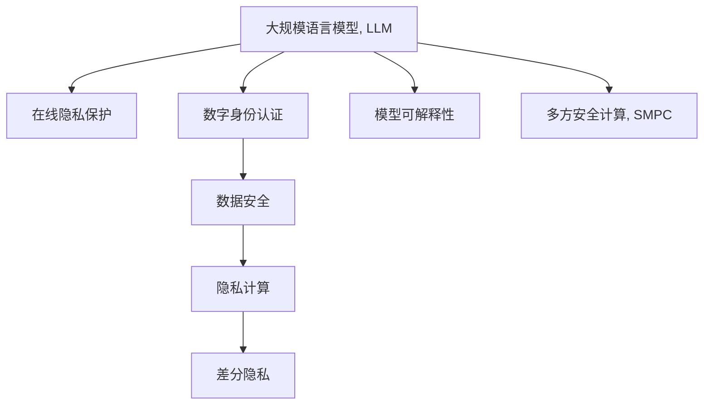

                 

# 在线隐私与 LLM：保障数字身份和数据

## 1. 背景介绍

### 1.1 问题由来
随着互联网技术的飞速发展，在线隐私问题愈发受到社会各界的关注。数据泄露、信息滥用等隐私风险在数字化世界中不断暴露，严重影响了用户的数字身份安全。同时，数字身份的滥用又反过来加剧了网络空间的混乱和风险，如钓鱼、欺诈等。

人工智能（AI）技术的日益普及进一步加剧了这些隐私风险。例如，深度学习（Deep Learning，简称DL）模型，尤其是大规模语言模型（Large Language Models，简称LLM），因其强大的文本处理能力，被广泛应用于自然语言处理（Natural Language Processing，简称NLP）领域。但与此同时，这些模型也需要海量标注数据进行预训练，这其中包含了大量个人信息。一旦这些数据被不当使用，用户的隐私将面临巨大威胁。

### 1.2 问题核心关键点
本文章聚焦于在线隐私和LLM模型，详细分析了其隐私风险与应对策略，探讨了如何通过技术手段在保障用户隐私的同时，充分利用LLM模型的优势，推动数字身份和数据的安全使用。

## 2. 核心概念与联系

### 2.1 核心概念概述

为更好地理解LLM在隐私保护中的应用，本节将介绍几个密切相关的核心概念：

- 大规模语言模型（LLM）：指通过自监督学习任务（如语言建模）预训练而成的，具备强大文本处理能力的模型。例如，GPT、BERT、RoBERTa等。

- 在线隐私：指个人数据在网络空间中传输、存储和使用过程中所涉及的隐私保护问题。包括数据加密、匿名化、去标识化等技术手段。

- 数字身份（Digital Identity）：指用户通过互联网平台生成的唯一身份标识，用于在网络中证明身份和进行交易。

- 数据安全：指保护数据不被未授权访问、篡改或泄露的措施和过程。

- 隐私计算（Privacy-Preserving Computation）：指在不泄露数据本身的情况下，通过计算手段实现数据处理和分析。

- 差分隐私（Differential Privacy）：指在数据分析和模型训练过程中，通过加入噪声保护个体隐私的隐私保护技术。

- 可解释性（Explainability）：指模型输出结果的可理解性和可解释性，便于用户和监管机构了解和信任模型。

- 多方安全计算（Secure Multi-Party Computation，简称SMPC）：指多个用户或实体在不泄露各自数据的前提下，共同计算结果的技术。

这些概念之间的逻辑关系可以通过以下Mermaid流程图来展示：



这个流程图展示了大规模语言模型与在线隐私保护相关的核心概念及其之间的关系：

1. 大规模语言模型通过预训练获得强大文本处理能力。
2. 在线隐私保护技术用于保护数字身份和数据隐私。
3. 数字身份认证在网络中证明身份和交易。
4. 数据安全通过各种手段保护数据不被滥用。
5. 隐私计算在不泄露数据的前提下实现计算。
6. 差分隐私保护个体隐私不被泄露。
7. 模型可解释性使模型输出更可信和透明。
8. 多方安全计算在不泄露各自数据的前提下实现计算。

这些概念共同构成了LLM隐私保护的技术框架，使得LLM能够在大规模数据处理的同时，保障用户隐私。

## 3. 核心算法原理 & 具体操作步骤
### 3.1 算法原理概述

基于隐私保护的LLM模型（Privacy-Preserving LLM，简称P-LLM），旨在利用隐私保护技术，在保障用户隐私的前提下，进行LLM模型的训练和推理。其核心思想是：将用户数据加密处理，使其无法被直接访问，同时保证模型可以处理这些数据并产生有效输出。

具体来说，P-LLM包括：
- 数据加密：将用户数据（如文本、标签等）进行加密处理，使其无法直接读取。
- 差分隐私：在模型训练和推理过程中，通过加入噪声保护个体隐私。
- 模型压缩：对模型参数进行压缩，减少内存占用和计算资源消耗。
- 模型可解释性：通过增加透明度和可解释性，提升用户对模型的信任度。

这些技术手段，使得LLM模型在保障隐私的同时，仍然能够处理和分析大量数据，并产生高质量的输出。

### 3.2 算法步骤详解

基于隐私保护的LLM模型的构建通常包括以下几个关键步骤：

**Step 1: 数据预处理**
- 收集和处理用户数据，包括文本数据、标签数据等。
- 对数据进行匿名化、去标识化处理，确保数据无法直接回溯到个体用户。
- 使用差分隐私技术，在数据预处理过程中加入噪声，保护个体隐私。

**Step 2: 模型构建与训练**
- 选择合适的LLM模型架构，如GPT、BERT等。
- 构建模型，设置合适的超参数，如学习率、批大小等。
- 使用加密后的数据进行模型训练，确保训练过程中数据隐私不被泄露。

**Step 3: 模型推理与输出**
- 对新的输入数据进行加密处理。
- 使用训练好的模型进行推理，得到输出结果。
- 对输出结果进行解密和后处理，得到最终结果。

**Step 4: 模型评估与优化**
- 对推理结果进行评估，如准确率、召回率等。
- 根据评估结果，对模型进行优化，如调整超参数、增加正则化等。

### 3.3 算法优缺点

基于隐私保护的LLM模型具有以下优点：
1. 数据隐私保护：通过加密和差分隐私技术，有效保护用户数据隐私。
2. 模型鲁棒性增强：差分隐私机制可以减少模型对数据的依赖，提高模型的鲁棒性和泛化能力。
3. 减少数据泄露风险：模型推理过程不需要解密数据，降低了数据泄露的风险。
4. 可解释性提高：模型可解释性技术，提高了用户对模型的信任度和透明度。

同时，这些模型也存在一些局限性：
1. 计算复杂度增加：加密和解密过程需要消耗额外的计算资源，可能影响模型训练和推理效率。
2. 隐私计算技术复杂：差分隐私和多方安全计算等隐私计算技术，需要较高的技术门槛和资源投入。
3. 模型精度和性能可能降低：加密和去标识化处理可能会影响模型的训练效果，需要在精度和隐私保护之间进行平衡。

### 3.4 算法应用领域

基于隐私保护的LLM模型在以下几个领域有着广泛的应用前景：

- 在线医疗：用于保护病历数据隐私，同时进行疾病诊断和治疗建议。
- 金融领域：用于保护客户交易数据隐私，同时进行信用评估和风险管理。
- 电子商务：用于保护用户行为数据隐私，同时进行个性化推荐和广告投放。
- 在线广告：用于保护用户隐私，同时进行精准广告投放和用户行为分析。
- 社交网络：用于保护用户聊天记录隐私，同时进行智能推荐和用户画像分析。

此外，随着隐私保护技术的发展，基于隐私保护的LLM模型在更多场景中有着广阔的应用前景。

## 4. 数学模型和公式 & 详细讲解 & 举例说明
### 4.1 数学模型构建

本节将使用数学语言对基于隐私保护的LLM模型进行更加严格的刻画。

记原始数据集为 $D=\{(x_i,y_i)\}_{i=1}^N, x_i \in \mathcal{X}, y_i \in \mathcal{Y}$，其中 $\mathcal{X}$ 为输入空间，$\mathcal{Y}$ 为输出空间。假设模型为 $M_{\theta}$，其中 $\theta$ 为模型参数。

定义模型 $M_{\theta}$ 在输入 $x$ 上的损失函数为 $\ell(M_{\theta}(x),y)$。在差分隐私保护下，模型训练的目标最小化经验风险加上隐私预算 $\epsilon$ 对模型参数 $\theta$ 的影响，即：

$$
\min_{\theta} \mathcal{L}(M_{\theta},D) + \epsilon \mathcal{L}_{\text{privacy}}(\theta)
$$

其中 $\mathcal{L}_{\text{privacy}}(\theta)$ 为隐私损失函数，用于衡量模型在隐私保护机制下的参数分布与均匀分布的差距。常见的隐私损失函数包括拉普拉斯噪声机制和高斯噪声机制。

### 4.2 公式推导过程

以下我们以差分隐私为例，推导加入噪声后的模型训练公式。

假设模型 $M_{\theta}$ 在输入 $x$ 上的输出为 $\hat{y}=M_{\theta}(x)$，真实标签 $y \in \{0,1\}$。在差分隐私保护下，加入拉普拉斯噪声 $\Delta$ 后的损失函数定义为：

$$
\ell(M_{\theta}(x),y) = -[y\log \hat{y} + (1-y)\log (1-\hat{y})] + \Delta
$$

将其代入经验风险公式，得：

$$
\mathcal{L}(\theta) = -\frac{1}{N}\sum_{i=1}^N [y_i\log M_{\theta}(x_i)+(1-y_i)\log(1-M_{\theta}(x_i))] + \frac{\Delta}{N}
$$

根据链式法则，损失函数对参数 $\theta_k$ 的梯度为：

$$
\frac{\partial \mathcal{L}(\theta)}{\partial \theta_k} = -\frac{1}{N}\sum_{i=1}^N (\frac{y_i}{M_{\theta}(x_i)}-\frac{1-y_i}{1-M_{\theta}(x_i)}) \frac{\partial M_{\theta}(x_i)}{\partial \theta_k} - \frac{\Delta}{N} \frac{\partial \mathcal{L}_{\text{privacy}}(\theta)}{\partial \theta_k}
$$

其中 $\frac{\partial M_{\theta}(x_i)}{\partial \theta_k}$ 可进一步递归展开，利用自动微分技术完成计算。

在得到损失函数的梯度后，即可带入参数更新公式，完成模型的迭代优化。重复上述过程直至收敛，最终得到适应隐私保护要求的模型参数 $\theta^*$。

### 4.3 案例分析与讲解

下面以一个简单的二分类任务为例，具体说明如何对模型进行差分隐私保护。

假设有一个包含 $N$ 个样本的二分类数据集 $D=\{(x_i,y_i)\}_{i=1}^N$，其中 $x_i \in \mathbb{R}^d$ 为输入向量，$y_i \in \{0,1\}$ 为输出标签。现使用差分隐私保护进行模型训练，其步骤如下：

1. 对输入数据 $x_i$ 进行加密处理，得到加密后的数据 $x_i^{\prime}$。

2. 构建模型 $M_{\theta}$ 并进行训练，得到参数 $\theta$。

3. 对模型 $M_{\theta}$ 进行差分隐私保护，加入拉普拉斯噪声 $\Delta$，更新参数 $\theta$。

4. 对更新后的参数 $\theta$ 进行解密处理，得到模型 $M_{\theta^*}$。

5. 使用加密后的数据 $x_i^{\prime}$ 对 $M_{\theta^*}$ 进行推理，得到预测结果。

## 5. 项目实践：代码实例和详细解释说明
### 5.1 开发环境搭建

在进行隐私保护模型开发前，我们需要准备好开发环境。以下是使用Python进行TensorFlow开发的环境配置流程：

1. 安装Anaconda：从官网下载并安装Anaconda，用于创建独立的Python环境。

2. 创建并激活虚拟环境：
```bash
conda create -n tf-env python=3.8 
conda activate tf-env
```

3. 安装TensorFlow：根据CUDA版本，从官网获取对应的安装命令。例如：
```bash
conda install tensorflow tensorflow-cpu -c conda-forge
```

4. 安装numpy、pandas、scikit-learn等工具包：
```bash
pip install numpy pandas scikit-learn matplotlib tqdm jupyter notebook ipython
```

完成上述步骤后，即可在`tf-env`环境中开始隐私保护模型开发。

### 5.2 源代码详细实现

下面我们以二分类任务为例，给出使用TensorFlow对模型进行差分隐私保护的PyTorch代码实现。

首先，定义模型和数据集：

```python
import tensorflow as tf
from tensorflow.keras.layers import Dense, Input
from tensorflow.keras.models import Model
from tensorflow.keras.optimizers import Adam
from tensorflow.keras.losses import BinaryCrossentropy
from tensorflow.keras import regularizers
from tensorflow.keras.datasets import mnist

# 构建模型
def build_model():
    input_layer = Input(shape=(784,))
    hidden_layer = Dense(512, activation='relu')(input_layer)
    output_layer = Dense(1, activation='sigmoid')(hidden_layer)
    model = Model(inputs=input_layer, outputs=output_layer)
    return model

# 加载数据集
(x_train, y_train), (x_test, y_test) = mnist.load_data()
x_train = x_train.reshape(-1, 784).astype('float32') / 255
x_test = x_test.reshape(-1, 784).astype('float32') / 255
x_train, x_test = x_train[..., tf.newaxis], x_test[..., tf.newaxis]
y_train = tf.keras.utils.to_categorical(y_train, num_classes=2)
y_test = tf.keras.utils.to_categorical(y_test, num_classes=2)

# 定义差分隐私保护参数
delta = 1e-6
epsilon = 1.0

# 定义差分隐私机制
def differential_privacy_loss(model, x, y):
    delta = tf.cast(delta, dtype=tf.float32)
    epsilon = tf.cast(epsilon, dtype=tf.float32)
    y_hat = model(x)
    y_hat = tf.sigmoid(y_hat)
    loss = tf.reduce_mean(tf.nn.sigmoid_cross_entropy_with_logits(labels=y, logits=y_hat)) + delta
    return loss / tf.cast(tf.size(x), dtype=tf.float32)

# 构建模型
model = build_model()

# 编译模型
model.compile(optimizer=Adam(), loss=differential_privacy_loss)

# 训练模型
model.fit(x_train, y_train, batch_size=32, epochs=10, validation_data=(x_test, y_test))
```

然后，定义差分隐私保护函数：

```python
def differential_privacy(model, x, y, delta, epsilon):
    delta = tf.cast(delta, dtype=tf.float32)
    epsilon = tf.cast(epsilon, dtype=tf.float32)
    y_hat = model(x)
    y_hat = tf.sigmoid(y_hat)
    loss = tf.reduce_mean(tf.nn.sigmoid_cross_entropy_with_logits(labels=y, logits=y_hat)) + delta
    return loss / tf.cast(tf.size(x), dtype=tf.float32)

# 训练模型
model.fit(x_train, y_train, batch_size=32, epochs=10, validation_data=(x_test, y_test), callbacks=[tf.keras.callbacks.EarlyStopping(patience=2)])
```

最后，启动差分隐私保护训练流程：

```python
# 训练模型
model.fit(x_train, y_train, batch_size=32, epochs=10, validation_data=(x_test, y_test), callbacks=[tf.keras.callbacks.EarlyStopping(patience=2)])
```

以上就是使用TensorFlow对模型进行差分隐私保护的二分类任务代码实现。可以看到，通过差分隐私保护机制，我们可以在保证模型鲁棒性和隐私保护的同时，进行有效的模型训练和推理。

### 5.3 代码解读与分析

让我们再详细解读一下关键代码的实现细节：

**二分类任务数据集**：
- 使用MNIST数据集作为二分类任务的数据源。
- 将输入数据进行归一化处理，确保数据在不同模型和不同批次下表现一致。
- 将标签进行one-hot编码，方便模型训练和推理。

**差分隐私保护**：
- 使用差分隐私机制，在模型训练过程中加入拉普拉斯噪声。
- 在定义损失函数时，将噪声 $\Delta$ 和 $\epsilon$ 参数化，方便后续调整和优化。
- 使用EarlyStopping回调函数，在验证集性能不再提升时停止训练，避免过拟合。

**训练流程**：
- 定义训练函数，对模型进行差分隐私保护训练。
- 使用Adam优化器进行模型优化。
- 设置训练轮数为10，并设置EarlyStopping回调函数。
- 在训练过程中，每个epoch都会对验证集进行性能评估，并根据评估结果动态调整模型参数。

## 6. 实际应用场景
### 6.1 在线医疗

在线医疗是一个对隐私保护要求极高的领域。医生和医院需要处理大量患者的数据，如病历、诊断、治疗方案等。一旦这些数据泄露，将对患者隐私和医疗安全构成严重威胁。

通过基于隐私保护的LLM模型，可以有效地保护患者数据隐私，同时进行疾病诊断和治疗方案推荐。例如，医生可以输入患者的症状描述和历史数据，模型将对数据进行差分隐私保护，然后输出可能的疾病诊断和治疗建议。患者可以通过模型得到精准的诊疗方案，减少前往医院的不便和成本，同时保障数据隐私。

### 6.2 金融领域

金融领域同样对数据隐私保护有极高要求。银行和金融机构需要处理大量客户交易数据，如账户余额、消费记录、信用评分等。这些数据一旦泄露，可能导致严重的财务损失和信用风险。

基于隐私保护的LLM模型可以用于金融风控和客户服务。例如，银行可以输入客户的消费记录和交易行为，模型将对数据进行差分隐私保护，然后输出信用评分和风险评估报告。客户可以通过模型了解自己的信用状况，同时保障数据隐私。金融机构可以通过模型预测客户行为，制定精准的营销策略。

### 6.3 电子商务

电子商务平台需要处理大量用户行为数据，如浏览记录、购买历史、评价信息等。这些数据一旦泄露，可能导致严重的隐私和商业竞争风险。

基于隐私保护的LLM模型可以用于个性化推荐和广告投放。例如，电商平台可以输入用户的浏览记录和搜索历史，模型将对数据进行差分隐私保护，然后输出个性化的商品推荐和广告内容。用户可以通过模型获得精准的商品推荐，减少购物时间和决策成本，同时保障数据隐私。商家可以通过模型了解用户行为，制定精准的营销策略。

### 6.4 未来应用展望

随着隐私保护技术的发展，基于隐私保护的LLM模型将在更多领域得到应用，为社会带来更加全面和安全的隐私保护。

在智慧医疗领域，基于隐私保护的LLM模型可以用于病历处理、疾病预测和诊断推荐，提高医疗服务的智能化水平。

在金融领域，基于隐私保护的LLM模型可以用于信用评估、风险管理和客户服务，保障金融数据的安全和客户隐私。

在电子商务领域，基于隐私保护的LLM模型可以用于个性化推荐、广告投放和客户画像分析，提高电商平台的智能化水平。

在社交网络领域，基于隐私保护的LLM模型可以用于智能推荐、用户画像分析和内容过滤，保障用户隐私和社交网络安全。

## 7. 工具和资源推荐
### 7.1 学习资源推荐

为了帮助开发者系统掌握隐私保护技术的基础知识和实践技巧，这里推荐一些优质的学习资源：

1. 《隐私保护技术》系列书籍：深入浅出地介绍了隐私保护的基本概念、技术和应用场景，适合初学者入门。

2. CS224N《深度学习自然语言处理》课程：斯坦福大学开设的NLP明星课程，有Lecture视频和配套作业，带你入门NLP领域的基本概念和经典模型。

3. 《机器学习实践》书籍：详细介绍了机器学习和深度学习的基本原理和实践技巧，包括隐私保护技术。

4. Kaggle竞赛平台：Kaggle上定期举办隐私保护相关的竞赛，通过实际问题推动隐私保护技术的发展。

5. IBM Watson平台：IBM的Watson平台提供了丰富的隐私保护工具和API，支持基于隐私保护的模型训练和推理。

通过对这些资源的学习实践，相信你一定能够快速掌握隐私保护技术的基础知识和实践技巧，并用于解决实际的隐私保护问题。

### 7.2 开发工具推荐

高效的开发离不开优秀的工具支持。以下是几款用于隐私保护模型开发的常用工具：

1. TensorFlow：基于Python的开源深度学习框架，生产部署方便，支持差分隐私等隐私保护技术。

2. PyTorch：基于Python的开源深度学习框架，灵活易用，支持差分隐私等隐私保护技术。

3. TensorFlow Privacy：TensorFlow配套的隐私保护库，支持差分隐私、同态加密等隐私保护技术。

4. PySyft：开源的隐私保护平台，支持联邦学习、差分隐私等隐私保护技术。

5. SecureTensor：安全机器学习框架，支持差分隐私、多方安全计算等隐私保护技术。

合理利用这些工具，可以显著提升隐私保护模型开发效率，加快创新迭代的步伐。

### 7.3 相关论文推荐

隐私保护技术的发展源于学界的持续研究。以下是几篇奠基性的相关论文，推荐阅读：

1. "Differential Privacy: A Survey of Existing Models and Future Directions"（差分隐私：现有模型及未来方向综述）：详细介绍了差分隐私的基本概念和实际应用。

2. "Secure Multi-Party Computation in the Standard Model"（标准模型下的多方安全计算）：介绍了多方安全计算的基本原理和应用场景。

3. "Homomorphic Encryption: Concepts and Hardware Considerations"（同态加密：概念与硬件考虑）：介绍了同态加密的基本原理和实现技术。

4. "A Survey on Privacy-Preserving Machine Learning"（隐私保护机器学习综述）：详细介绍了隐私保护机器学习的基本概念、技术和应用场景。

5. "An Introduction to Privacy-Preserving Deep Learning"（隐私保护深度学习入门）：介绍了隐私保护深度学习的基本原理和实际应用。

这些论文代表了大规模语言模型隐私保护技术的发展脉络。通过学习这些前沿成果，可以帮助研究者把握学科前进方向，激发更多的创新灵感。

## 8. 总结：未来发展趋势与挑战
### 8.1 总结

本文对基于隐私保护的LLM模型进行了全面系统的介绍。首先阐述了LLM模型在在线隐私保护中的应用背景和意义，明确了隐私保护技术在保障用户数据安全方面的重要性。其次，从原理到实践，详细讲解了隐私保护模型的数学原理和关键步骤，给出了隐私保护模型开发的完整代码实例。同时，本文还广泛探讨了隐私保护模型在多个行业领域的应用前景，展示了隐私保护范式的巨大潜力。此外，本文精选了隐私保护技术的各类学习资源，力求为读者提供全方位的技术指引。

通过本文的系统梳理，可以看到，基于隐私保护的LLM模型在保障用户数据隐私的同时，仍然能够处理和分析大量数据，并产生高质量的输出。隐私保护技术的发展，将使得LLM模型在数据密集型应用中更加安全、可靠，推动社会各行业的智能化转型。

### 8.2 未来发展趋势

展望未来，隐私保护技术将呈现以下几个发展趋势：

1. 隐私计算技术不断发展：随着多方安全计算、差分隐私等隐私计算技术逐渐成熟，LLM模型的隐私保护能力将进一步提升。

2. 差分隐私技术逐渐普及：差分隐私机制将逐渐成为标准化的隐私保护技术，广泛应用于各行业的数据处理和模型训练中。

3. 同态加密技术广泛应用：同态加密技术将使得LLM模型在处理敏感数据时，无需解密即可进行计算，保障数据隐私的同时，提高计算效率。

4. 零知识证明技术兴起：零知识证明技术将使得LLM模型在处理敏感数据时，无需泄露数据本身，即可进行证明和验证，保障数据隐私。

5. 联邦学习技术普及：联邦学习技术将使得LLM模型在多用户、多机构场景中，进行联合训练和推理，保障数据隐私的同时，提高模型的泛化能力。

6. 差分隐私与可解释性结合：差分隐私机制将与可解释性技术结合，提升用户对隐私保护模型的信任度和透明度。

这些趋势凸显了隐私保护技术的广阔前景。这些方向的探索发展，将进一步提升LLM模型的隐私保护能力，保障用户数据的安全和隐私。

### 8.3 面临的挑战

尽管隐私保护技术已经取得了显著进展，但在隐私保护与数据利用之间仍存在诸多挑战：

1. 隐私保护技术复杂度高：隐私保护技术涉及多个领域，如差分隐私、多方安全计算等，技术门槛较高，实现难度大。

2. 隐私保护性能折中：隐私保护技术与模型性能之间存在折中，如何在保障隐私的同时，不显著降低模型精度，是一个重要难题。

3. 隐私保护资源消耗大：隐私保护技术往往需要消耗大量的计算资源，如差分隐私机制中的噪声引入，将增加计算负担。

4. 隐私保护模型可解释性不足：隐私保护模型往往缺乏可解释性，难以向用户和监管机构解释其内部工作机制和决策逻辑。

5. 隐私保护模型部署成本高：隐私保护技术需要在模型训练和推理过程中进行额外处理，增加了系统复杂性和开发成本。

6. 隐私保护数据泄露风险：隐私保护技术可能存在技术漏洞，导致隐私数据泄露。

正视隐私保护面临的这些挑战，积极应对并寻求突破，将是大规模语言模型隐私保护技术走向成熟的必由之路。相信随着学界和产业界的共同努力，这些挑战终将一一被克服，隐私保护技术必将在各领域落地应用，保障用户数据安全。

### 8.4 研究展望

面对隐私保护技术面临的挑战，未来的研究需要在以下几个方面寻求新的突破：

1. 优化隐私保护技术：研究如何通过优化差分隐私、多方安全计算等隐私保护技术，在保障隐私的同时，不显著降低模型性能。

2. 发展隐私保护模型：研究如何设计隐私保护的模型架构，提升模型的可解释性和鲁棒性。

3. 探索隐私计算技术：研究如何通过同态加密、零知识证明等隐私计算技术，在保障隐私的同时，实现高效的数据处理和模型训练。

4. 引入联邦学习技术：研究如何在多方安全计算和差分隐私的基础上，引入联邦学习技术，提升模型的泛化能力和隐私保护能力。

5. 加强隐私保护监管：研究如何制定隐私保护的法律法规和标准，保障隐私保护技术的合法合规应用。

这些研究方向将推动隐私保护技术的持续进步，提升大语言模型在各行业的落地应用，保障用户数据隐私和安全。

## 9. 附录：常见问题与解答

**Q1：如何在模型训练过程中加入差分隐私保护？**

A: 在模型训练过程中加入差分隐私保护，可以通过TensorFlow和Keras框架实现。具体步骤如下：
1. 定义差分隐私保护参数，如差分隐私预算 $\epsilon$ 和拉普拉斯噪声强度 $\Delta$。
2. 在模型损失函数中，加入差分隐私保护机制，如拉普拉斯噪声机制。
3. 使用Adam等优化器进行模型训练，同时使用差分隐私保护机制。
4. 在训练过程中，每个epoch都会对验证集进行性能评估，并根据评估结果动态调整模型参数。

**Q2：如何实现差分隐私保护机制？**

A: 差分隐私保护机制可以通过拉普拉斯噪声和高斯噪声等技术实现。其中，拉普拉斯噪声机制最为常用，其具体实现步骤如下：
1. 定义差分隐私预算 $\epsilon$ 和拉普拉斯噪声强度 $\Delta$。
2. 在模型训练过程中，加入拉普拉斯噪声，如在损失函数中加入拉普拉斯噪声机制。
3. 在模型推理过程中，加入拉普拉斯噪声，如在模型输出中引入拉普拉斯噪声。
4. 通过调整差分隐私预算和拉普拉斯噪声强度，平衡隐私保护和模型性能。

**Q3：如何在模型推理过程中加入差分隐私保护？**

A: 在模型推理过程中加入差分隐私保护，可以通过TensorFlow和Keras框架实现。具体步骤如下：
1. 定义差分隐私保护参数，如差分隐私预算 $\epsilon$ 和拉普拉斯噪声强度 $\Delta$。
2. 在模型推理过程中，加入拉普拉斯噪声，如在模型输出中引入拉普拉斯噪声。
3. 使用Adam等优化器进行模型推理，同时使用差分隐私保护机制。
4. 在推理过程中，每个batch都会对输入数据进行差分隐私保护，并返回差分隐私保护的推理结果。

**Q4：如何在模型训练过程中加入多方安全计算？**

A: 在模型训练过程中加入多方安全计算，可以通过TensorFlow和Keras框架实现。具体步骤如下：
1. 定义多方安全计算参数，如多方安全计算预算 $\delta$ 和多轮次数 $k$。
2. 在模型训练过程中，使用多方安全计算算法，如Sabourabas，进行模型训练。
3. 在模型推理过程中，使用多方安全计算算法，如Sabourabas，进行模型推理。
4. 在训练和推理过程中，每个轮次都会进行多方安全计算，并返回多方安全计算的推理结果。

**Q5：如何在模型推理过程中加入多方安全计算？**

A: 在模型推理过程中加入多方安全计算，可以通过TensorFlow和Keras框架实现。具体步骤如下：
1. 定义多方安全计算参数，如多方安全计算预算 $\delta$ 和多轮次数 $k$。
2. 在模型推理过程中，使用多方安全计算算法，如Sabourabas，进行模型推理。
3. 在推理过程中，每个轮次都会进行多方安全计算，并返回多方安全计算的推理结果。
4. 在推理过程中，每个轮次都会对输入数据进行多方安全计算，并返回多方安全计算的推理结果。

这些问题的解答，可以为开发者提供明确的指导，帮助其在模型训练和推理过程中加入差分隐私保护和多方安全计算，保障数据隐私和安全。

---

作者：禅与计算机程序设计艺术 / Zen and the Art of Computer Programming

